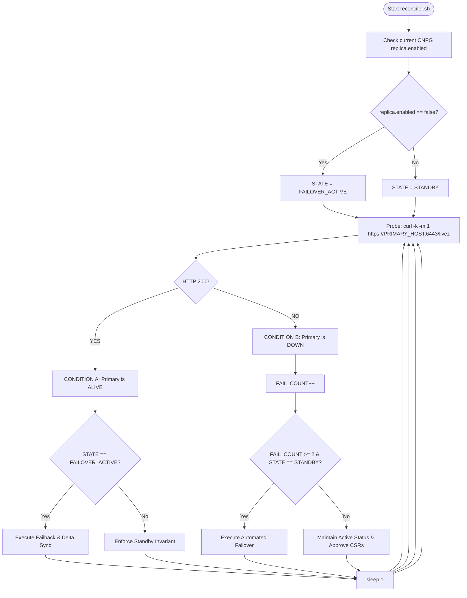
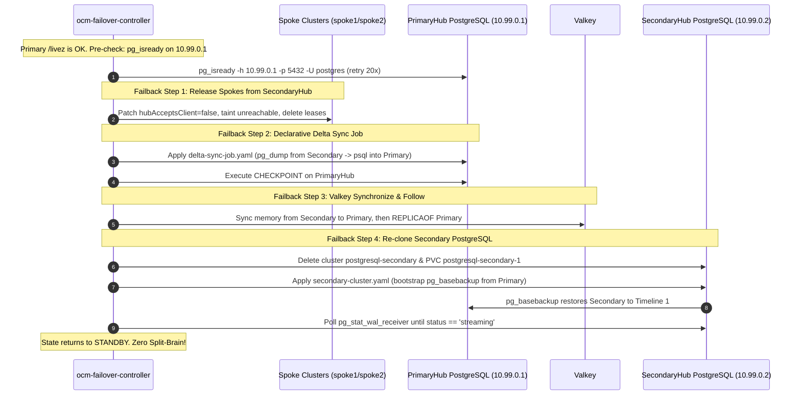

# Deep-Dive Technical Analysis: `failover-controller.yaml`

**File Path**: [`codeInspector/charts/apiServer/templates/failover-controller.yaml`](file:///home/berrybytes/Desktop/Kamal/01-Sandbox/codeInspector/charts/apiServer/templates/failover-controller.yaml)
**Destination Analysis**: `01-sandbox-multi-cluster/failover-controller-yaml.md`
**Target Cluster**: SecondaryHub (`kind-secondaryhub` / WireGuard `10.99.0.2`)
**Namespace**: `opensandbox-system`

---

## 1. Architectural Purpose & Overview

The [`failover-controller.yaml`](file:///home/berrybytes/Desktop/Kamal/01-Sandbox/codeInspector/charts/apiServer/templates/failover-controller.yaml) manifest is a **Kubernetes-native high-availability (HA) orchestrator**. It replaces unmanaged host-level bash scripts and systemd daemons (such as the legacy `ocm-failover-daemon.service`) with a containerized, declarative Kubernetes controller.

### Deployment Condition
The entire file is guarded by Helm conditions:
```yaml
{{- if and .Values.failoverController .Values.failoverController.enabled }}
...
{{- end }}
```
- In **`values.yaml`** (used on PrimaryHub): `failoverController.enabled: false` (not deployed).
- In **`values-secondary.yaml`** (used on SecondaryHub): `failoverController.enabled: true` (strictly deployed on SecondaryHub).

### Primary Responsibilities
1. **Continuous Health Monitoring**: Actively health-checks PrimaryHub's Kubernetes API (`/livez`) every 1 second over the WireGuard overlay network (`10.99.0.1:6443`).
2. **Automated In-Place Failover**: When PrimaryHub goes down (2 consecutive failed probes ≈ 2–3s), it:
   - Accepts and untaints Open Cluster Management (OCM) spoke clusters (`spoke1`, `spoke2`).
   - Automatically approves spoke TLS `CertificateSigningRequest` (CSR) objects.
   - Promotes CloudNativePG (CNPG) PostgreSQL from Read-Only replica to Read-Write primary in-place without pod restarts (< 500ms).
   - Promotes the Valkey cache/queue from read-only replica to master.
3. **Automated Split-Brain-Safe Failback**: When PrimaryHub recovers:
   - Immediately releases spoke clusters back to PrimaryHub (Priority 0).
   - Validates PrimaryHub's PostgreSQL database health (`pg_isready`).
   - Launches a declarative Kubernetes Job (`failback-delta-sync`) to dump and sync outage data (e.g. newly created API keys) into PrimaryHub.
   - Reverses Valkey replication.
   - Re-clones SecondaryHub's PostgreSQL instance using `pg_basebackup` to cleanly resolve PostgreSQL **Timeline Divergence** (Timeline 2 back to Timeline 1).

---

## 2. Resource-by-Resource Breakdown

The manifest defines **4 core Kubernetes objects** in a single file:

```
failover-controller.yaml
│
├── 1. ServiceAccount       ocm-failover-controller-sa
├── 2. ClusterRole          ocm-failover-controller-role
├── 3. ClusterRoleBinding   ocm-failover-controller-rb
├── 4. ConfigMap            ocm-failover-controller-script
│     ├── reconciler.sh           (PID 1 controller infinite loop)
│     ├── secondary-cluster.yaml  (CNPG pg_basebackup re-clone manifest)
│     └── delta-sync-job.yaml     (Outage delta sync Job manifest)
└── 5. Deployment           ocm-failover-controller
      └── mounts ConfigMap at /scripts/ and executes /scripts/reconciler.sh
```

---

### Resource 1: `ServiceAccount` (Lines 1–10)
```yaml
apiVersion: v1
kind: ServiceAccount
metadata:
  name: ocm-failover-controller-sa
  namespace: {{ .Values.namespace | default "opensandbox-system" }}
```
Provides the dedicated pod identity under which the controller runs in `opensandbox-system`.

---

### Resource 2: `ClusterRole` (Lines 11–50)
Defines the strict, least-privilege RBAC permissions required by the controller to manage the multi-cluster control plane:

| API Group | Resources | Verbs | Purpose |
| :--- | :--- | :--- | :--- |
| `postgresql.cnpg.io` | `clusters` | `get, list, watch, patch, update, delete, create` | Modifies `spec.replica.enabled` to promote DB to RW; deletes and re-creates cluster during failback re-clone. |
| `cluster.open-cluster-management.io`<br>`register.open-cluster-management.io` | `managedclusters`, `managedclusters/status`, `managedclusters/accept` | `get, list, watch, patch, update, create` | Updates `spec.hubAcceptsClient`, sets lease intervals, removes/adds taints, and modifies availability status. |
| `certificates.k8s.io` | `certificatesigningrequests`, `certificatesigningrequests/approval` | `get, list, watch, create, update, patch` | Inspects pending spoke TLS requests. |
| `certificates.k8s.io` | `signers` (`kubernetes.io/kube-apiserver-client`) | `approve` | Approves spoke klusterlet client certificates so spokes can join SecondaryHub. |
| `apps` | `deployments`, `deployments/scale` | `get, list, watch, patch, update` | Inspects and reconciles control plane services. |
| `""` (Core) | `pods`, `pods/exec` | `get, list, watch, create, delete` | Executes `pg_isready`, `psql`, and `valkey-cli` commands inside database and cache pods. |
| `""` (Core) | `persistentvolumeclaims` | `get, list, watch, delete` | Cleans up stale database PVCs during failback re-cloning. |
| `coordination.k8s.io` | `leases` | `get, list, watch, create, update, patch, delete` | Purges spoke leases on failback to force instant re-registration to PrimaryHub. |
| `batch` | `jobs` | `get, list, watch, create, delete` | Submits and monitors the `failback-delta-sync` Job. |

---

### Resource 3: `ClusterRoleBinding` (Lines 51–66)
```yaml
apiVersion: rbac.authorization.k8s.io/v1
kind: ClusterRoleBinding
metadata:
  name: ocm-failover-controller-rb
subjects:
- kind: ServiceAccount
  name: ocm-failover-controller-sa
  namespace: {{ .Values.namespace | default "opensandbox-system" }}
roleRef:
  kind: ClusterRole
  name: ocm-failover-controller-role
  apiGroup: rbac.authorization.k8s.io
```
Binds `ocm-failover-controller-sa` to `ocm-failover-controller-role` across the entire cluster.

---

### Resource 4: `ConfigMap` (Lines 67–400)
The ConfigMap `ocm-failover-controller-script` acts as an embedded file store containing **3 distinct assets**:
1. `reconciler.sh`: The core bash control loop.
2. `secondary-cluster.yaml`: A declarative CloudNativePG `Cluster` spec.
3. `delta-sync-job.yaml`: A declarative Kubernetes `Job` spec.

---

### Resource 5: `Deployment` (Lines 401–454)
```yaml
apiVersion: apps/v1
kind: Deployment
metadata:
  name: ocm-failover-controller
  namespace: {{ .Values.namespace | default "opensandbox-system" }}
spec:
  replicas: 1
  strategy:
    type: Recreate
```
- **Image**: `bitnami/kubectl:latest` (contains `kubectl`, `jq`, and standard network tools).
- **Strategy `Recreate`**: Crucial to prevent two controller pods from running simultaneously during upgrades, ensuring only one instance ever makes failover/failback decisions.
- **Volume Mount**: Mounts `ocm-failover-controller-script` ConfigMap at `/scripts`.
- **Command**: `/bin/bash /scripts/reconciler.sh`.
- **Environment Variables**:
  - `PRIMARY_HOST`: `10.99.0.1` (PrimaryHub WireGuard IP).
  - `SECONDARY_IP`: `10.99.0.2` (SecondaryHub WireGuard IP).
  - `PRIMARY_PORT`: `30432` / `5432` (Primary PostgreSQL port).
  - `PRIMARY_VALKEY_PORT`: `30379` / `6379` (Primary Valkey port).

---

## 3. Deep-Dive: The `reconciler.sh` Control Loop

`reconciler.sh` is the execution engine running inside the controller container.



---

### 3.1 Dynamic Initial State Recovery & Memory Bookmark (Lines 93–99)
```bash
IS_REPLICA=$(kubectl get cluster postgresql-secondary -n "$NAMESPACE" -o jsonpath='{.spec.replica.enabled}' 2>/dev/null || echo 'true')
if [ "$IS_REPLICA" = "false" ]; then
  STATE="FAILOVER_ACTIVE"
else
  STATE="STANDBY"
fi
```

#### Does `replica.enabled == false` Trigger Failover?
**No. This startup check is NOT what triggers the failover.**
- **The actual trigger**: Failover is triggered exclusively by **PrimaryHub going down** (when `curl .../livez` fails 2 consecutive times in the main loop).
- **The purpose of this check**: It is a **"Crash-Recovery / Memory Bookmark"** that runs only once when the controller pod boots up or restarts.

#### Why Is This Memory Bookmark Needed?
A container process in Kubernetes has ephemeral memory. If the controller pod crashes, is evicted, or is restarted during an ongoing outage:
1. **The Scenario**:
   - PrimaryHub suffered an outage 10 minutes ago.
   - The controller had already triggered failover, promoted `postgresql-secondary` to Read-Write (`replica.enabled: false`), accepted the spoke clusters, and set its in-memory variable `STATE="FAILOVER_ACTIVE"`.
   - Now, the controller pod crashes or is upgraded by Kubernetes.
2. **Without this check (The Risk)**:
   - A new controller pod starts with an empty bash memory and defaults to `STATE="STANDBY"`.
   - The controller would wrongly believe it is in standby mode, fail to properly track failover operations, or mismanage spokes when PrimaryHub recovers.
3. **With this check (The Self-Healing Solution)**:
   - On startup, the controller inspects the live database cluster:
     - If `replica.enabled == "false"`: It deduces: *"Failover already happened before I restarted. I must immediately resume as `STATE="FAILOVER_ACTIVE"` to keep approving spoke CSRs and be ready to run failback when PrimaryHub comes back."*
     - If `replica.enabled == "true"`: It deduces: *"PostgreSQL is in standby replica mode following PrimaryHub. Everything is normal. I will start in `STATE="STANDBY"`."*


---

### 3.2 Helper Functions (Lines 103–132)

#### `approve_csrs()`:
```bash
approve_csrs() {
  PENDING_CSRS=($(kubectl get csr -o json 2>/dev/null | jq -r '.items[]? | select(.status.conditions == null) | .metadata.name' 2>/dev/null || true))
  for csr in "${PENDING_CSRS[@]}"; do
    if [ -n "$csr" ]; then
      log "Approving pending spoke CSR: $csr"
      kubectl certificate approve "$csr" 2>/dev/null || true
    fi
  done
}
```
Spoke cluster klusterlet agents submit client CSRs when connecting to a hub. This function finds all unapproved CSRs (`.status.conditions == null`) and calls `kubectl certificate approve`.

#### `set_spoke_status()`:
```bash
set_spoke_status() {
  local spoke="$1"
  local status="$2" # True or Unknown
  local reason="$3" # ManagedClusterAvailable or ManagedClusterLeaseUpdateStopped
  local msg="$4"
  local now=$(date -u +"%Y-%m-%dT%H:%M:%SZ")

  local updated_json
  updated_json=$(kubectl get --raw "/apis/cluster.open-cluster-management.io/v1/managedclusters/${spoke}/status" 2>/dev/null | jq ...)
  echo "$updated_json" | kubectl replace --raw "/apis/cluster.open-cluster-management.io/v1/managedclusters/${spoke}/status" -f -
}
```
Uses Kubernetes raw API calls (`/apis/cluster.open-cluster-management.io/v1/managedclusters/${spoke}/status`) to immediately update the status condition without needing a full CR update.

---

### 3.3 Condition B: Primary is DOWN (Failover Sequence) (Lines 256–309)

When `FAIL_COUNT >= 2` (2 missed probes over ~2–3 seconds):

#### Step 1: Accept OCM Spoke Clusters (Lines 267–271)
```bash
for spoke in spoke1 spoke2; do
  kubectl patch managedcluster "$spoke" --type merge \
    -p '{"spec":{"hubAcceptsClient":true,"leaseDurationSeconds":5,"taints":[]}}' 2>/dev/null || true
done
approve_csrs
```
- Sets `hubAcceptsClient: true`: Informs OCM that SecondaryHub accepts this spoke.
- Sets `leaseDurationSeconds: 5`: Accelerates lease detection from 60s down to 5s.
- Sets `taints: []`: Removes the `unreachable` taint so workloads can be scheduled on spokes.
- Calls `approve_csrs`: Immediately approves any pending TLS CSRs.

#### Step 2: Promote PostgreSQL to Read-Write (Lines 274–286)
```bash
kubectl patch cluster postgresql-secondary -n "$NAMESPACE" --type merge \
  -p '{"spec":{"replica":{"enabled":false}}}' 2>/dev/null || true
```
- Patches CloudNativePG cluster spec.
- CNPG executes an **in-place `pg_promote()`**.
- PostgreSQL exits recovery mode, writes `00000002.history`, and advances from **Timeline 1 to Timeline 2** in < 500ms without restarting the container.
- Ensures superuser credentials:
  ```bash
  psql -U postgres -d apikeys -c "ALTER USER postgres WITH PASSWORD 'password123';"
  ```
  Guarantees that `sandbox-api` can immediately authenticate and create API keys.

#### Step 3: Promote Valkey to Master (Lines 289–291)
```bash
kubectl exec -n "$NAMESPACE" deploy/valkey -- valkey-cli REPLICAOF NO ONE
```
- Severs replication from PrimaryHub.
- Removes `slave_read_only: 1`, allowing instant read-write session caching.

#### Step 4: Active Loop Maintenance (Lines 299–309)
While in `FAILOVER_ACTIVE`, the controller continuously executes `approve_csrs` and checks `hubAcceptsClient` to maintain spoke health.

---

### 3.4 Condition A: Primary is ALIVE

#### Scenario 1: Normal Standby Invariant (Lines 240–251)
When PrimaryHub is healthy and SecondaryHub is in `STANDBY`:
```bash
for CLUSTER in $(kubectl get managedclusters -o jsonpath='{.items[*].metadata.name}' 2>/dev/null); do
  IS_ACCEPTED=$(kubectl get managedcluster "$CLUSTER" -o jsonpath='{.spec.hubAcceptsClient}' 2>/dev/null || echo "false")
  if [ "$IS_ACCEPTED" != "false" ]; then
    log "STANDBY: Ensuring $CLUSTER is released from SecondaryHub..."
    kubectl patch managedcluster "$CLUSTER" --type merge \
      -p '{"spec":{"hubAcceptsClient":false,"taints":[{"key":"cluster.open-cluster-management.io/unreachable","effect":"NoSelect"}]}}'
    kubectl delete lease --all -n "$CLUSTER" --ignore-not-found=true
    set_spoke_status "$CLUSTER" "Unknown" "ManagedClusterLeaseUpdateStopped" "Released by SecondaryHub on standby"
  fi
done
```
- **Why this exists**: Guarantees that spokes only register and communicate with PrimaryHub, completely eliminating split-brain scheduling.

#### Scenario 2: Failback Execution (Lines 149–239)
When PrimaryHub comes back online while SecondaryHub was in `FAILOVER_ACTIVE`:



1. **Pre-Check Database Readiness (Lines 153–169)**:
   Checks `pg_isready -h "$PRIMARY_HOST" -p "$PRIMARY_PORT" -U postgres` up to 20 times. If Primary's database is not fully ready, the controller **refuses to fail back** and stays in `FAILOVER_ACTIVE` to prevent service downtime.
2. **Release Spokes (Lines 174–179)**:
   Immediately sets `hubAcceptsClient: false`, applies the `unreachable` taint, and deletes all spoke leases. Spokes instantly reconnect to PrimaryHub (Priority 0).
3. **Declarative Delta Synchronization (Lines 182–194)**:
   Submits `delta-sync-job.yaml` via `kubectl apply -f /scripts/delta-sync-job.yaml` and waits for completion (`kubectl wait --for=condition=complete job/failback-delta-sync --timeout=60s`).
4. **Valkey Resynchronization (Lines 197–203)**:
   Copies any cache keys written during the outage from Secondary to Primary, then resets Secondary to follow Primary.
5. **PostgreSQL Re-clone (Lines 206–238)**:
   Deletes `cluster postgresql-secondary` and its PVC, then applies `/scripts/secondary-cluster.yaml`. CloudNativePG runs `pg_basebackup` against PrimaryHub, pulling a pristine copy of Timeline 1. The controller polls `pg_stat_wal_receiver` until `status == "streaming"`, then sets `STATE="STANDBY"`.

---

## 4. Deep-Dive: Embedded Manifests in the ConfigMap

### 4.1 `secondary-cluster.yaml` (Lines 314–351)
This manifest is the blueprint used by the controller during Step 4 of failback:
```yaml
apiVersion: postgresql.cnpg.io/v1
kind: Cluster
metadata:
  name: postgresql-secondary
  namespace: {{ .Values.namespace | default "opensandbox-system" }}
spec:
  instances: {{ .Values.cnpg.instances | default 1 }}
  imageName: {{ .Values.cnpg.imageName | default "ghcr.io/cloudnative-pg/postgresql:15.6" | quote }}
  replica:
    enabled: true
    source: postgresql-primary
  bootstrap:
    pg_basebackup:
      source: postgresql-primary
  externalClusters:
  - name: postgresql-primary
    connectionParameters:
      host: "10.99.0.1"
      port: "30432"
      user: "postgres"
      dbname: "apikeys"
      sslmode: prefer
    password:
      name: postgresql-primary-credentials
      key: password
```
- **Why this is necessary**: Because SecondaryHub PostgreSQL was promoted to Timeline 2 during failover, its WAL logs diverged from PrimaryHub (Timeline 1). Re-applying this manifest forces CNPG to take a physical base backup (`pg_basebackup`) from PrimaryHub, cleanly restoring SecondaryHub as a replica on Timeline 1 without errors.

---

### 4.2 `delta-sync-job.yaml` (Lines 352–399)
This manifest runs as an ephemeral Kubernetes Job (`failback-delta-sync`) during failback:
```yaml
apiVersion: batch/v1
kind: Job
metadata:
  name: failback-delta-sync
  namespace: {{ .Values.namespace | default "opensandbox-system" }}
spec:
  ttlSecondsAfterFinished: 600
  backoffLimit: 2
  template:
    spec:
      restartPolicy: OnFailure
      containers:
      - name: delta-syncer
        image: postgres:15-alpine
        command:
        - /bin/sh
        - -c
        - |
          set -eo pipefail
          # 1. Terminate stale client connections on PrimaryHub
          psql -h "$PRIMARY_HOST" -p "$PRIMARY_PORT" -U postgres -d postgres -c \
            "SELECT pg_terminate_backend(pid) FROM pg_stat_activity WHERE datname = 'apikeys' AND pid <> pg_backend_pid();" || true

          # 2. Dump authoritative database from Secondary and pipe directly into Primary
          pg_dump -h postgresql-secondary-rw -p 5432 -U postgres -d apikeys --clean --if-exists | \
            psql -h "$PRIMARY_HOST" -p "$PRIMARY_PORT" -U postgres -d apikeys

          # 3. Force database checkpoint on Primary
          psql -h "$PRIMARY_HOST" -p "$PRIMARY_PORT" -U postgres -d apikeys -c "CHECKPOINT;" || true
```
- **Why this is necessary**: Any API keys, scan jobs, or user sessions created during the outage live exclusively in SecondaryHub's database. This Job safely transfers the entire authoritative database back to PrimaryHub before SecondaryHub is demoted back to a standby replica, guaranteeing **zero data loss**.

---

## 5. Summary Matrix: What Happens at Each Stage

| Stage | Trigger | Actions Taken by `failover-controller.yaml` | Resulting System State |
| :--- | :--- | :--- | :--- |
| **Normal (Standby)** | Primary `/livez` is responding (200 OK) | Enforces Standby Invariant: `hubAcceptsClient: false`, taint `unreachable`, purges spoke leases. | Spokes connect to PrimaryHub only; Secondary DB is read-only WAL replica. |
| **Failover Detection** | 2 consecutive probe failures (timeout > 1s) | Detects Primary down; transitions `STATE="FAILOVER_ACTIVE"`. | SecondaryHub initiates takeover sequence. |
| **Spoke Takeover** | Failover Step 1 | Patches `hubAcceptsClient: true`, `leaseDurationSeconds: 5`, `taints: []`; runs `approve_csrs`. | Spokes switch to SecondaryHub, CSRs approved, `Available: True`. |
| **Database Promotion** | Failover Step 2 | Patches `spec.replica.enabled: false`; sets `password123`. | `postgresql-secondary-1` becomes Read-Write master on Timeline 2; API keys can be created. |
| **Cache Promotion** | Failover Step 3 | Executes `valkey-cli REPLICAOF NO ONE`. | Valkey accepts write commands. |
| **Failback Pre-Check** | Primary `/livez` responds 200 OK | Runs `pg_isready` against Primary PostgreSQL (up to 20x). | Confirms Primary DB is ready before altering any state. |
| **Failback Execution** | Pre-check passes | Releases spokes; runs `failback-delta-sync` Job; syncs Valkey; deletes and re-clones Secondary DB. | Outage data synced to Primary; Secondary re-cloned on Timeline 1; returns to Standby. |
