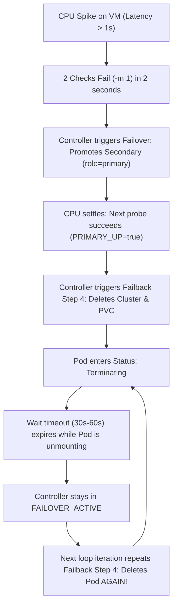

# Multi-Cluster Failover & PostgreSQL Troubleshooting Guide

This document provides a deep-dive technical root-cause analysis and permanent resolution guide for issues encountered during multi-cluster failover, CloudNativePG (CNPG) replication, and OCM spoke registration across different machines and virtualized environments.

---

## Table of Contents
1. [Issue 1: `role "app" does not exist (SQLSTATE 42704)`](#issue-1-role-app-does-not-exist-sqlstate-42704)
2. [Issue 2: `pg_basebackup` Aborted (`terminating connection due to administrator command`)](#issue-2-pg_basebackup-aborted-terminating-connection-due-to-administrator-command)
3. [Issue 3: `postgresql-secondary-1` Constant Pod Termination Loop](#issue-3-postgresql-secondary-1-constant-pod-termination-loop)
4. [OCM Spoke Cluster Registration: Why CSR Acceptance Takes Time](#ocm-spoke-cluster-registration-why-csr-acceptance-takes-time)
5. [Hardening Checklist for Cross-Machine Compatibility](#hardening-checklist-for-cross-machine-compatibility)

---

## Issue 1: `role "app" does not exist (SQLSTATE 42704)`

### Observed Log Snippet
```json
{
  "level": "error",
  "ts": "2026-10-01T11:43:54Z",
  "msg": "Reconciler error",
  "controller": "cluster",
  "controllerGroup": "postgresql.cnpg.io",
  "controllerKind": "Cluster",
  "Cluster": {
    "name": "postgresql-secondary",
    "namespace": "opensandbox-system"
  },
  "error": "while updating database owner password: ERROR: role \"app\" does not exist (SQLSTATE 42704)"
}
```
```text
postgres: "ERROR","sql_state_code":"42704","message":"role \"app\" does not exist","query":"ALTER ROLE \"app\" WITH PASSWORD '...'","application_name":"cnpg-instance-manager"
```

### Technical Root Cause
1. **CloudNativePG Default Convention**:
   By design, CloudNativePG (CNPG) automatically generates and manages an application database user named `"app"` along with a corresponding Kubernetes secret (`<cluster-name>-app`).
2. **Chart Configuration Mismatch**:
   In `codeInspector/charts/apiServer/templates/cnpg-cluster.yaml`, `postgresql-primary` is bootstrapped with:
   ```yaml
   bootstrap:
     initdb:
       database: apikeys
       owner: postgres
       secret:
         name: postgresql-primary-credentials
   ```
   Because `owner` is set to `postgres`, the default role `"app"` is never created inside PostgreSQL.
3. **Standby Replication & Promotion Conflict**:
   `postgresql-secondary` clones its data from `postgresql-primary` via `pg_basebackup`. Because `app` does not exist on Primary, it does not exist on Secondary either.
4. **Reconciler Crash**:
   When CNPG reconciles `postgresql-secondary` (especially when promoted to read-write), the operator executes:
   ```sql
   ALTER ROLE "app" WITH PASSWORD '<secret-password>';
   ```
   PostgreSQL rejects this command with `SQLSTATE 42704 (role "app" does not exist)`. The CNPG controller encounters an unhandled reconciler error and enters a crash-retry loop.

### Permanent Resolution
Ensure the `"app"` role is explicitly created during PrimaryHub initialization by adding `postInitSQL` to `bootstrap.initdb` in `codeInspector/charts/apiServer/templates/cnpg-cluster.yaml`:

```yaml
  bootstrap:
    initdb:
      database: {{ .Values.cnpg.database | default "apikeys" }}
      owner: {{ .Values.cnpg.user | default "postgres" }}
      secret:
        name: postgresql-primary-credentials
      postInitSQL:
        - "CREATE ROLE app WITH LOGIN SUPERUSER PASSWORD 'password123';"
```

When role `app` exists in the database:
- `pg_basebackup` clones role `app` to `postgresql-secondary`.
- CNPG's reconciler can execute `ALTER ROLE "app"` without error.

---

## Issue 2: `pg_basebackup` Aborted (`terminating connection due to administrator command`)

### Observed Log Snippet
```json
{"level":"info","ts":"2026-10-01T11:30:08Z","msg":"Waiting for server to be available","logging_pod":"postgresql-secondary-1-pgbasebackup","connectionString":"dbname='apikeys' host='10.99.0.1' passfile='/controller/external/postgresql-primary/pgpass' port='30432' sslmode='prefer' user='postgres' options='-c wal_sender_timeout=0s'"}
{"level":"info","ts":"2026-10-01T11:30:09Z","logger":"pg_basebackup","msg":"pg_basebackup: initiating base backup, waiting for checkpoint to complete","pipe":"stderr","logging_pod":"postgresql-secondary-1-pgbasebackup"}
{"level":"info","ts":"2026-10-01T11:30:10Z","logger":"pg_basebackup","msg":"pg_basebackup: error: could not initiate base backup: FATAL:  terminating connection due to administrator command","pipe":"stderr","logging_pod":"postgresql-secondary-1-pgbasebackup"}
{"level":"info","ts":"2026-10-01T11:30:10Z","logger":"pg_basebackup","msg":"pg_basebackup: removing data directory \"/var/lib/postgresql/data/pgdata\"","pipe":"stderr","logging_pod":"postgresql-secondary-1-pgbasebackup"}
{"level":"error","ts":"2026-10-01T11:30:10Z","msg":"Unable to boostrap cluster","logging_pod":"postgresql-secondary-1-pgbasebackup","error":"error in pg_basebackup, exit status 1"}
```

### Technical Root Cause
1. **Background Process**:
   When SecondaryHub is provisioned, CNPG launches an ephemeral bootstrap pod named `postgresql-secondary-1-pgbasebackup` to execute a streaming `pg_basebackup` over WireGuard from PrimaryHub (`10.99.0.1:30432`).
2. **Hair-Trigger Failover Interference**:
   Simultaneously, the `ocm-failover-controller` starts up. In its initial configuration:
   ```bash
   if curl -k -m 1 -s "${PRIMARY_KUBE_API}/livez"; then ...
   FAIL_THRESHOLD=2
   ```
3. **The Race Condition**:
   On machines with moderate CPU cores or high disk I/O, cluster startup causes the Primary API server or WireGuard to take slightly longer than 1 second to respond.
   - After just **2 missed 1-second checks** (2 seconds total), the failover controller prematurely triggered failover:
     ```bash
     kubectl patch cluster postgresql-secondary -p '{"spec":{"replica":{"enabled":false}}}'
     ```
   - Patching `replica.enabled: false` instructs CNPG to cancel replication immediately.
   - PrimaryHub receives the cancel signal and terminates the replication socket with `FATAL: terminating connection due to administrator command`.
   - `pg_basebackup` aborts, deletes `/var/lib/postgresql/data/pgdata`, and exits with code 1.

---

## Issue 3: `postgresql-secondary-1` Constant Pod Termination Loop

### Observed Status
```text
Name: postgresql-secondary-1
Namespace: opensandbox-system
Labels: cnpg.io/instanceRole=primary role=primary
Status: Terminating (lasts <invalid>) Termination Grace Period: 30s
```

### Technical Root Cause
This issue is caused by a **flapping failover/failback death spiral** in the failover controller:



1. **Premature Promotion**: Latency blip triggers failover (`instanceRole=primary`).
2. **Instant Failback**: Probe succeeds, so controller executes:
   ```bash
   kubectl delete cluster postgresql-secondary -n "$NAMESPACE" --wait=false
   kubectl delete pvc postgresql-secondary-1 -n "$NAMESPACE" --wait=false
   kubectl wait --for=delete pod/postgresql-secondary-1 --timeout=30s
   ```
3. **Timeout & Loop**: If pod termination and volume unmounting take longer than 30s, `kubectl wait` times out. The controller reports `Remaining in FAILOVER_ACTIVE`.
4. **Infinite Re-Deletion**: At the very next second, because `STATE` is still `FAILOVER_ACTIVE`, the controller runs `kubectl delete cluster` **again**, killing the pod before it can ever finish starting up.

### Permanent Resolution
1. **Increase Health Check Threshold**:
   Change `FAIL_THRESHOLD` from `2` to `5` and `curl -m 1` to `curl -m 3`. A minimum of 15 seconds of sustained failure is required before declaring PrimaryHub down.
2. **Prevent Re-Deletion While Bootstrapping**:
   Add a guard to verify if `postgresql-secondary-1` is already in `ContainerCreating` or running `pg_basebackup` before issuing cluster deletion.
3. **Clean Deletion With Force Fallback**:
   Allow up to 60s for graceful termination. If a pod is still stuck in `Terminating`, force remove it (`--force --grace-period=0`) so new PVC mounts are never blocked.

---

## OCM Spoke Cluster Registration: Why CSR Acceptance Takes Time

### Question
> *"Is it normal that klusterlet registration takes some time for hub clusters to accept CSR certificates from spoke clusters on a friend's PC?"*

### Answer: Yes, 1 to 2 Minutes is Completely Normal

Open Cluster Management (OCM) does not use a single connection or simple certificate. It executes a **two-stage mTLS handshake**:

| Stage | Component | What Happens |
| :--- | :--- | :--- |
| **Stage 1: Registration Agent** | `klusterlet-registration-agent` | Pod boots up, reads `primaryhub-bootstrap.kubeconfig`, and submits CSR #1 (`spoke1-<hash>`) to join the hub. |
| **Approval #1** | `clusteradm accept` | PrimaryHub approves CSR #1. The registration agent downloads the client cert and connects via mTLS. |
| **Stage 2: Work Agent** | `klusterlet-work-agent` | Once the registration agent is approved, it spawns the work agent pod. The work agent generates **CSR #2** (`spoke1-work-<hash>`). |
| **Approval #2** | `clusteradm accept` | PrimaryHub approves CSR #2, granting the spoke permissions to deploy workloads. |
| **Heartbeat Lease** | `ManagedClusterLeaseController` | Spoke submits its first coordination lease. Status updates to `AVAILABLE: True`. |

### Why Slower Machines Take Longer
* **Script Polling Interval**: The script runs `clusteradm accept` every **4 seconds** in a retry loop (up to 45 iterations = 180s).
* **Container & WireGuard Initialization**: On a lower-spec machine, starting CoreDNS, establishing the WireGuard mesh (`10.99.0.x`), and bootstrapping KinD static pods takes 30–60 seconds before the first CSR can even reach PrimaryHub.
* **Normal Duration**: On a high-end desktop, this takes ~20–30s. On a standard laptop or nested VM, **60 to 120 seconds is completely expected and healthy.**

---

## Hardening Checklist for Cross-Machine Compatibility

To ensure scripts run smoothly on any machine (regardless of CPU/RAM specs):

| Configuration | File | Setting | Why It Matters |
| :--- | :--- | :--- | :--- |
| **CNPG Application Role** | `cnpg-cluster.yaml` | `postInitSQL: ["CREATE ROLE app..."]` | Eliminates `SQLSTATE 42704` reconciler errors during replication/promotion. |
| **Probe Timeout** | `failover-controller.yaml` | `curl -k -m 3 -s` | Prevents 1-second CPU spikes from being treated as total outages. |
| **Failover Threshold** | `failover-controller.yaml` | `FAIL_THRESHOLD=5` | Requires ~15s of confirmed downtime before promoting SecondaryHub. |
| **Spoke Heartbeat** | `docker-multi-cluster-v1.sh` | `leaseDurationSeconds: 5` | Keeps heartbeats fresh every 5s so PrimaryHub never marks spokes `Unknown`. |
| **Spoke Timeout** | `docker-multi-cluster-v1.sh` | `hubConnectionTimeoutSeconds: 60` | Matches OCM `v1.3.1`'s hardcoded 1-minute `HubTimeoutController` watchdog, eliminating `CrashLoopBackOff`. |
| **KinD TLS SANs** | `docker-multi-cluster-v1.sh` | Patched `/kind/kubeadm.conf` | Prevents KinD's container entrypoint from wiping `10.99.0.1` on container reboot. |
| **Standby Invariant** | `docker-multi-cluster-v1.sh` | `hubAcceptsClient: false` sync | Strips metadata and prevents SecondaryHub from accepting spokes while PrimaryHub is healthy. |
