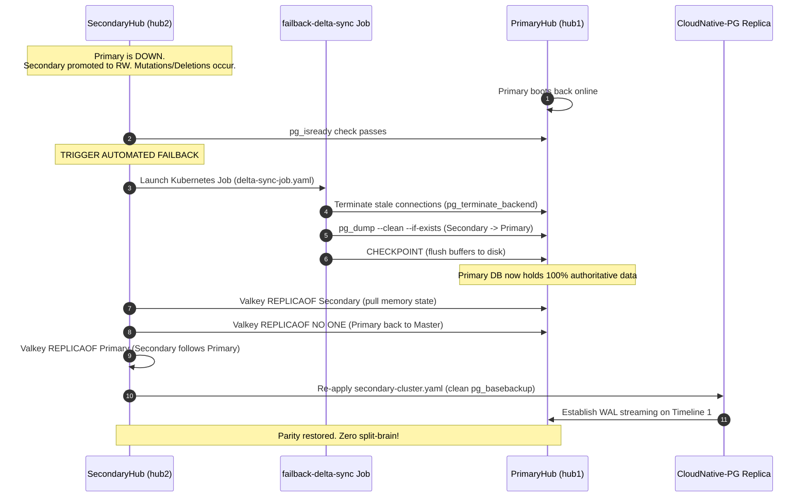

# Multi-Cluster Database Split-Brain Prevention Mechanism (failover-controller.yaml)

This document provides a comprehensive technical overview of the database split-brain issue observed during multi-cluster failover and details the automated, authoritative reconciliation mechanism implemented in `failover-controller.yaml`.

---

## 1. Executive Summary & Problem Statement

In a multi-cluster deployment featuring an active **PrimaryHub** and a standby **SecondaryHub**, high-availability failover must ensure that:
1. When **PrimaryHub** fails, **SecondaryHub** promotes its local PostgreSQL database to Read-Write mode to service inbound requests without downtime.
2. When **PrimaryHub** recovers, traffic and state must return to PrimaryHub smoothly.
3. Any data mutations (record creations, updates, and especially **deletions**) performed on SecondaryHub while PrimaryHub was offline must be authoritatively preserved.
4. Old or deleted data existing on the recovering PrimaryHub must **never resurrect** (the classic "split-brain / ghost record" problem).

---

## 2. Root Cause Analysis of the Split-Brain Bug

During failover testing, the following sequence revealed a critical split-brain flaw:
1. `primaryhub` was shut down (`docker stop primaryhub-control-plane`).
2. `secondaryhub` promoted its database to Read-Write.
3. On `secondaryhub`, existing API keys (`kamal1`, `kamal2`) were **deleted**, and a new key (`kamalsecondary`) was created.
4. When `primaryhub` was restarted, the deleted keys (`kamal1`, `kamal2`) reappeared ("resurrected") on both hubs.

### Why Did This Happen?

1. **Additive-Only Delta Synchronization**:
   The previous failback synchronization mechanism executed:
   ```bash
   # FLAWED OLD APPROACH:
   pg_dump -t api_keys --data-only --inserts --on-conflict-do-nothing | grep '^INSERT' | psql ...
   ```
   - Filtering with `grep '^INSERT'` and applying `--on-conflict-do-nothing` **only inserts new rows**.
   - It has **zero awareness of deletions**. A row deleted on SecondaryHub remained untouched in PrimaryHub's database.

2. **Timeline Re-Cloning Re-Contamination**:
   When PrimaryHub came back online, it still held the stale rows. SecondaryHub subsequently re-cloned itself from PrimaryHub using CloudNative-PG's `pg_basebackup`. As a result, PrimaryHub's stale data was cloned straight back onto SecondaryHub.

3. **In-Memory Cache (Valkey/Redis) Desynchronization**:
   Valkey memory on PrimaryHub was never updated with keys written to SecondaryHub during the outage, leaving in-memory cache out of sync with disk.

---

## 3. High-Level Architecture Flow

The solution implemented in `failover-controller.yaml` uses a declarative, authoritative state machine running on `secondaryhub`:



---

## 4. Technical Deep-Dive: The 4-Step Solution

All reconciliation logic is managed natively in Kubernetes via `failover-controller.yaml`.

### Step 1: Health Gating (`reconciler.sh`)
The controller polls both the Kubernetes API server and PostgreSQL on PrimaryHub:
```bash
for i in {1..20}; do
  if kubectl exec -n "$NAMESPACE" postgresql-secondary-1 -c postgres -- \
    pg_isready -h "$PRIMARY_HOST" -p "$PRIMARY_PORT" -U postgres >/dev/null 2>&1; then
    log "PrimaryHub PostgreSQL is UP and accepting queries!"
    PG_READY=true
    break
  fi
  sleep 1
done
```
> **Purpose**: Prevents triggering failback prematurely while PrimaryHub is still in its boot phase or replaying crash recovery WALs.

---

### Step 2: Authoritative Delta Synchronization (`delta-sync-job.yaml`)
A dedicated Kubernetes Job (`failback-delta-sync`) runs containerized using `postgres:15-alpine`:

```yaml
apiVersion: batch/v1
kind: Job
metadata:
  name: failback-delta-sync
  namespace: opensandbox-system
spec:
  ttlSecondsAfterFinished: 600
  backoffLimit: 2
  template:
    spec:
      restartPolicy: OnFailure
      containers:
      - name: delta-syncer
        image: postgres:15-alpine
        command:
        - /bin/sh
        - -c
        - |
          set -eo pipefail
          echo "[failback-sync] Terminating stale connections on PrimaryHub ($PRIMARY_HOST)..."
          psql -h "$PRIMARY_HOST" -p "$PRIMARY_PORT" -U postgres -d postgres -c \
            "SELECT pg_terminate_backend(pid) FROM pg_stat_activity WHERE datname = 'apikeys' AND pid <> pg_backend_pid();" || true

          echo "[failback-sync] Transferring full authoritative database from SecondaryHub to PrimaryHub ($PRIMARY_HOST)..."
          pg_dump -h postgresql-secondary-rw -p 5432 -U postgres -d apikeys --clean --if-exists | \
            psql -h "$PRIMARY_HOST" -p "$PRIMARY_PORT" -U postgres -d apikeys

          echo "[failback-sync] Executing CHECKPOINT on PrimaryHub..."
          psql -h "$PRIMARY_HOST" -p "$PRIMARY_PORT" -U postgres -d apikeys -c "CHECKPOINT;" || true
```

#### Why This Eliminates Split-Brain:
1. **`pg_terminate_backend(...)`**:
   Disconnects stale backend sessions on PrimaryHub so table locks do not block the incoming schema or table replacement.
2. **`pg_dump --clean --if-exists`**:
   Generates `DROP TABLE IF EXISTS` statements followed by exact `CREATE TABLE` and current row dumps.
   - Deleted rows on SecondaryHub are completely dropped on PrimaryHub.
   - Inserted and updated rows on SecondaryHub become the single source of truth on PrimaryHub.
3. **`CHECKPOINT;`**:
   Forces all modified pages to physical disk and writes a checkpoint record to WAL.

---

### Step 3: In-Memory Cache (Valkey) Bidirectional Handshake
Valkey caches active tokens and API keys in RAM. To ensure cache parity without pod restarts:

```bash
# 1. Instruct Primary Valkey to pull data from Secondary Valkey
kubectl exec -n "$NAMESPACE" deploy/valkey -- \
  valkey-cli -h "$PRIMARY_HOST" -p "$PRIMARY_VALKEY_PORT" REPLICAOF "$SECONDARY_IP" 6379 2>/dev/null || true
sleep 2

# 2. Release Primary Valkey back to standalone Master
kubectl exec -n "$NAMESPACE" deploy/valkey -- \
  valkey-cli -h "$PRIMARY_HOST" -p "$PRIMARY_VALKEY_PORT" REPLICAOF NO ONE 2>/dev/null || true

# 3. Configure Secondary Valkey to follow Primary Valkey as its replica
kubectl exec -n "$NAMESPACE" deploy/valkey -- \
  valkey-cli REPLICAOF "$PRIMARY_HOST" "$PRIMARY_VALKEY_PORT" 2>/dev/null || true
```
> **Result**: Primary Valkey ingests the fresh memory state from Secondary, becomes the authoritative master, and Secondary transitions back to a read-only follower.

---

### Step 4: PostgreSQL Timeline Parity & Continuous Streaming (`re-clone`)
In PostgreSQL, when a replica is promoted to Read-Write, its timeline history diverges (e.g., from `Timeline 1` to `Timeline 2`). It cannot simply resume streaming WAL from PrimaryHub without timeline reconciliation.

The controller resolves this declaratively:
1. Deletes the promoted `postgresql-secondary` cluster definition:
   ```bash
   kubectl delete cluster postgresql-secondary -n "$NAMESPACE" --wait=false 2>/dev/null || true
   kubectl apply -f /scripts/secondary-cluster.yaml 2>/dev/null || true
   ```
2. CloudNative-PG re-initializes `postgresql-secondary-1` via `pg_basebackup` from PrimaryHub (which now possesses the updated authoritative data from Step 2).
3. The controller verifies WAL receiver streaming:
   ```bash
   SELECT status FROM pg_stat_wal_receiver;
   # Expected output: streaming
   ```
4. Controller state machine transitions cleanly back to `STANDBY`.

---

## 5. Comparison: Old vs. New Behavior

| Dimension | Old Behavior | New Behavior (`failover-controller.yaml`) |
| :--- | :--- | :--- |
| **Sync Philosophy** | Additive only (`--on-conflict-do-nothing`) | Full Authoritative State Transfer (`--clean --if-exists`) |
| **Deletions** | Ignored (deleted records resurrected on failback) | Exact match (deleted records are removed on Primary) |
| **Updates** | Ignored on conflict | Overwritten with authoritative values |
| **Cache (Valkey)** | One-way only (Primary -> Secondary) | Bidirectional handshake (Secondary -> Primary -> Replica) |
| **Lock Handling** | Prone to transaction timeouts | Stale sessions terminated via `pg_terminate_backend` |
| **Timeline Parity** | Manual intervention required | Automated declarative re-clone via CloudNative-PG |

---

## 6. How to Verify the Fix

To verify this in the environment:

1. **Simulate Outage**:
   ```bash
   # On hub1-vm:
   docker stop primaryhub-control-plane
   ```
2. **Perform Mutations on SecondaryHub**:
   ```bash
   # On hub2-vm:
   # Delete an API key
   kubectl exec -it postgresql-secondary-1 -n opensandbox-system -c postgres -- \
     psql -U postgres -d apikeys -c "DELETE FROM api_keys WHERE name = 'test-key';"

   # Insert a new API key
   kubectl exec -it postgresql-secondary-1 -n opensandbox-system -c postgres -- \
     psql -U postgres -d apikeys -c "INSERT INTO api_keys (name, key_hash, created_at) VALUES ('new-key', 'hash123', NOW());"
   ```
3. **Restore PrimaryHub**:
   ```bash
   # On hub1-vm:
   docker start primaryhub-control-plane
   ```
4. **Inspect Failback Execution**:
   ```bash
   # On hub2-vm:
   kubectl logs -n opensandbox-system deploy/ocm-failover-controller -f
   ```
5. **Confirm Parity on PrimaryHub**:
   ```bash
   # On hub1-vm:
   kubectl exec -it postgresql-primary-1 -n opensandbox-system -c postgres -- \
     psql -U postgres -d apikeys -c "SELECT * FROM api_keys;"
   ```
   - `test-key` will **NOT** exist.
   - `new-key` **WILL** exist.
   - Replication status on `hub2-vm` will show `streaming`.
