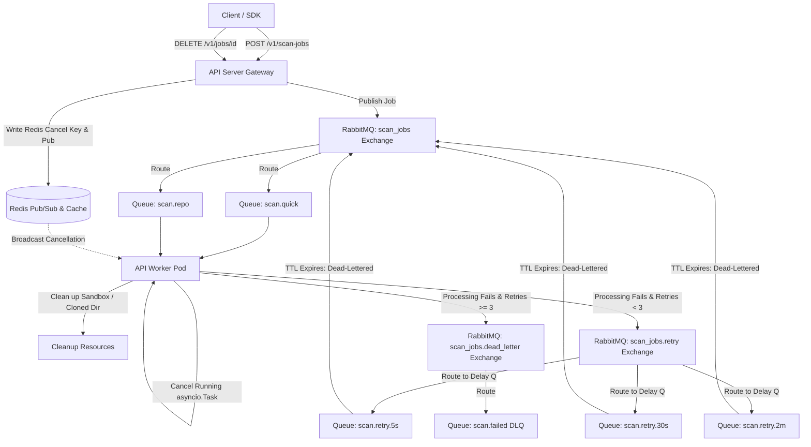

# 01-Sandbox — Improvement Backlog

> All items below are planned improvements identified after the RabbitMQ implementation.
> Items are grouped by category and ordered by priority within each group.

---

## 🔴 RabbitMQ Queue Enhancements

- [ ] **Dead Letter Queue (DLQ)** — Route failed/timed-out scan messages to a `scan.failed` queue instead of silently dropping them. Enables manual inspection, retry, and alerting on failures.
  - [ ] Declare `scan_jobs.dlx` (Direct Exchange) and `scan.failed` (Durable Queue).
  - [ ] Bind `scan.failed` to `scan_jobs.dlx` with routing key `scan.failed`.
  - [ ] Configure `x-dead-letter-exchange` and `x-dead-letter-routing-key` arguments when declaring `scan.quick` and `scan.repo` queues.
  - [ ] Update worker error boundaries to call `message.reject(requeue=False)` on unrecoverable failures.
- [ ] **Job Retry with Backoff** — Automatically re-queue a failed scan up to 3 times with increasing delays (5s → 30s → 2min) before marking the job `ERROR`.
  - [ ] Declare `scan_jobs.retry` (Direct Exchange).
  - [ ] Declare delay queues: `scan.retry.5s` (TTL: 5000ms), `scan.retry.30s` (TTL: 30000ms), `scan.retry.2m` (TTL: 120000ms), all DLX'd back to main `scan_jobs` exchange.
  - [ ] Implement retry state counter inside the job message payload.
  - [ ] Implement worker retry interceptor: increment retry count, publish to delay exchange, and ack original message.
- [ ] **Job Cancellation** — Allow users to cancel a queued or in-flight scan via `DELETE /v1/jobs/{job_id}`, removing the message from the queue before a worker picks it up.
  - [ ] Add `DELETE /v1/jobs/{job_id}` router endpoint.
  - [ ] Implement cancellation flag in Redis key `job:{job_id}:cancelled`.
  - [ ] Configure Redis Pub/Sub broadcast channel `job:cancellations` to notify running workers.
  - [ ] Track active worker asyncio tasks in `app_state.active_tasks` registry.
  - [ ] Cancel tasks dynamically and perform cleanup (killing sandboxes) upon receiving cancellation events.
- [ ] **Job Priority Levels** — Tag submissions as `high` or `low` priority so paid/urgent scans jump ahead in the queue over free-tier jobs.
- [ ] **Scan TTL (Time-to-Live)** — Auto-expire queued jobs that haven't been picked up within X minutes (e.g. 30 min), marking them `EXPIRED` instead of hanging forever.
- [ ] **Per-User Queue Limit** — Reject publish if a specific user already has 5+ jobs in the queue, preventing any single user from monopolizing the queue.
- [ ] **RabbitMQ Metrics Endpoint** — Expose a `/v1/queue/stats` API endpoint returning live queue depths, consumer counts, and throughput — viewable from the dashboard.
- [ ] **Bulk Scan Type** — New `scan.bulk` queue for scanning all repos in a GitHub organization at once, submitted in batches.
- [ ] **Webhook Notifications** — When a scan reaches `DONE` or `ERROR`, trigger an HTTP callback to a user-configured URL (e.g. Slack, CI/CD pipeline).
- [ ] **Scheduled Scans** — Allow users to schedule a repo scan at a specific time (e.g. nightly), published to the queue via a cron job instead of an HTTP request.

---

## 🔴 Reliability & Stability

- [ ] **Persistent Job Storage (PostgreSQL)** — Store job history in PostgreSQL so scan records survive pod/Redis restarts. Currently jobs live only in memory + Redis.
- [ ] **Sandbox Timeout Enforcement** — Add a global scan timeout (e.g. 10 min) that auto-aborts hanging scans and marks them `ERROR` if the sandbox never becomes ready.
- [ ] **Health Checks per Dependency** — Extend the `/health` endpoint to report the status of each component individually: `postgres`, `redis`, `rabbitmq`, `opensandbox-server`.

---

## 🟡 Security

- [ ] **API Key Expiry Notifications** — Alert users (email or dashboard banner) before their API key expires so they are not suddenly locked out.
- [ ] **Audit Logging** — Log every authenticated action (who submitted what scan, when, from which IP) to PostgreSQL for compliance and abuse detection.
- [ ] **Per-User Queue Isolation** — Enforce per-user job limits at the queue intake level so one user cannot submit 20 jobs and starve all other users.

---

## 🟠 Performance

- [ ] **Scan Result Caching** — If the same GitHub repo is scanned twice within 24 hours, return the cached result from Redis instead of re-running the full pipeline.
- [ ] **Incremental / Delta Scanning** — Track the last scanned commit hash per repo. On re-scan, only process files changed since that commit — significant time savings for large repos.
- [ ] **Parallel Language Scanning** — Languages inside `file_scanner.py` are currently scanned sequentially. Run each language's scanner concurrently using `asyncio.gather()`.

---

## 🟢 Developer Experience & Observability

- [ ] **Structured JSON Logging** — Replace all `print()` statements across the codebase with structured JSON logs `{"level": "INFO", "component": "RabbitMQ", "job_id": "..."}` — makes logs searchable in Grafana Loki or similar tools.
- [ ] **OpenTelemetry Tracing** — Add distributed tracing to track the full lifecycle of a scan (HTTP submit → RabbitMQ publish → consumer pickup → sandbox → result) as a single trace in Jaeger or Tempo.
- [ ] **Admin Dashboard API** — Add operator-only endpoints: force-drain a queue, inspect raw job state, manually re-queue a failed job, view per-user submission stats.

---

## 🔵 New Features

- [ ] **GitHub Webhook Integration** — Auto-trigger a scan on every `push` event to a registered repo, without requiring a manual API call.
- [ ] **Scan Comparison / Diff** — Compare two scan results of the same repo across different commits and highlight which vulnerabilities appeared or were resolved.
- [ ] **SARIF Export** — Export scan results in the industry-standard SARIF format for upload to GitHub Security tab or import into SonarQube/Snyk.

---

## 🛠️ Implementation Plan: Queue Enhancements (DLQ, Retry Backoff, Cancellation)

This section details the technical architecture and code modifications required to implement the Dead Letter Queue (DLQ), Job Retry with Backoff, and Job Cancellation.

### 1. System Architecture

The following diagram illustrates the lifecycle of a scan job including publishing, processing, backoff retries via TTL delay queues, routing to the DLQ, and out-of-band job cancellation via Redis Pub/Sub:



---

### 2. Feature Details

#### Feature A: Dead Letter Queue (DLQ)
- **Objective:** Prevent silent dropping of poisoned messages or permanently failed scan jobs, Routing them to `scan.failed` for analysis and manual re-queuing.
- **AMQP Setup:**
  - **Exchange:** `scan_jobs.dead_letter` (Type: `direct`, Durable).
  - **Queue:** `scan.failed` (Durable).
  - **Binding:** Bind `scan.failed` to `scan_jobs.dead_letter` with routing key `scan.failed`.
  - **Main Queues configuration:** When declaring `scan.quick` and `scan.repo` queues, inject the arguments:
    ```python
    arguments={
        "x-dead-letter-exchange": "scan_jobs.dead_letter",
        "x-dead-letter-routing-key": "scan.failed"
    }
    ```
- **Error Handling:** When a worker encounters an unrecoverable failure (e.g. malformed payload, repo does not exist) or exhausts all retry attempts, it will invoke `message.reject(requeue=False)`. RabbitMQ will automatically dead-letter the message to the `scan.failed` queue.

#### Feature B: Job Retry with Backoff
- **Objective:** Resiliently handle transient network failures or database locks by retrying scan jobs up to 3 times, with increasing delays: 5s → 30s → 2m.
- **AMQP Setup:**
  - **Exchange:** `scan_jobs.retry` (Type: `direct`, Durable).
  - **Queues:**
    1. `scan.retry.5s` (Durable, TTL: `5000`ms, Dead-Letter Exchange: `scan_jobs`)
    2. `scan.retry.30s` (Durable, TTL: `30000`ms, Dead-Letter Exchange: `scan_jobs`)
    3. `scan.retry.2m` (Durable, TTL: `120000`ms, Dead-Letter Exchange: `scan_jobs`)
  - **Delay Queue Architecture:** The delay queues do not have consumers. When a message is published to `scan.retry.5s` (using routing key `retry.5s`), it sits in the queue until the message TTL expires. At that point, RabbitMQ automatically dead-letters the message back to the main `scan_jobs` exchange, where it is routed to the original worker queue for another attempt.
- **Message Payload:**
  - Introduce metadata field: `"retries": 0` (default) and `"max_retries": 3`.
- **Worker Logic:**
  - Catch all exceptions during execution.
  - Read `retries` count from the payload.
  - If `retries < max_retries`:
    - Increment `retries`.
    - Push job event: status `RETRYING` with message `"Scan failed, retrying in {delay} (Attempt {retries}/{max_retries})"`.
    - Publish payload to `scan_jobs.retry` with routing key `retry.5s` (for attempt 1), `retry.30s` (attempt 2), or `retry.2m` (attempt 3).
    - Call `message.ack()` to complete the current message lifecycle.
  - If `retries >= max_retries`:
    - Push job event: status `ERROR` with message `"Max retries exhausted"`.
    - Call `message.reject(requeue=False)` to route the message to the DLQ.

#### Feature C: Job Cancellation
- **Objective:** Stop queued or running scans immediately upon user request via `DELETE /v1/jobs/{job_id}`.
- **API Changes:**
  - Add router handler `DELETE /v1/jobs/{job_id}`.
  - When called, check if the job is active in local state or Redis. If so:
    - Set the status of the job to `CANCELLED` in Redis.
    - Set a Redis string key `job:{job_id}:cancelled` with a TTL of 2 hours.
    - Publish a cancellation broadcast message `{"job_id": job_id}` to Redis Pub/Sub channel `job:cancellations`.
- **Worker Cancellation Loop:**
  - Maintain a global active tasks registry in `app_state.active_tasks` mapping `job_id` to its active `asyncio.Task` wrapper.
  - When starting a job inside the consumer:
    - Before beginning, check if `job:{job_id}:cancelled` exists in Redis. If it does, acknowledge the message and discard it immediately.
    - If not, wrap the pipeline call in an `asyncio.create_task` and add it to `app_state.active_tasks`.
    - Wrap execution in a `try...except asyncio.CancelledError...finally` block. The `finally` block must delete `job_id` from the active tasks registry.
  - Spin up a background service thread/task at startup (`lifespan.py`) that subscribes to the Redis Pub/Sub channel `job:cancellations`.
  - When a message is received on `job:cancellations`:
    - Extract `job_id`.
    - If `job_id` matches a key in `app_state.active_tasks`, retrieve the `asyncio.Task` object and call `task.cancel()`.
    - The active task will raise `asyncio.CancelledError`. Catch it, push status `CANCELLED` via the job tracker, and trigger teardown logic (e.g. calling `destroy_sandbox` or cleaning clone paths).

---

### 3. Proposed File Changes

#### `[MODIFY] apiServer/fastapi/core/queue/job_types.py`
- Add constants for `scan_jobs.dead_letter` and `scan_jobs.retry` exchanges.
- Update queue config schema to declare the retry delays and dead-letter arguments.

#### `[MODIFY] apiServer/fastapi/core/queue/consumer.py`
- Update `_start_single_consumer()` to:
  - Declare the DLX and DLQ queues.
  - Declare retry exchange and delay queues with their TTLs and DLX mappings.
  - Bind main queues with `x-dead-letter-exchange` arguments.
  - Update `on_message` callbacks to catch execution errors, manage the payload retry counters, route failures to retry exchanges, or reject (requeue=False) to DLQ on max retry exhaustion.

#### `[MODIFY] apiServer/fastapi/core/jobs/router.py`
- Implement endpoint `DELETE /v1/jobs/{job_id}`.
- Check authentication and validate ownership.
- Write cancellation state to Redis and publish the event to `job:cancellations` channel.

#### `[MODIFY] apiServer/fastapi/core/jobs/tracker.py`
- Add support for a `CANCELLED` step. Ensure `CANCELLED` is recorded in Redis status keys and published down the job event stream.

#### `[NEW] apiServer/fastapi/core/jobs/cancellation_listener.py`
- Background service task started during server lifespan that subscribes to Redis Pub/Sub `job:cancellations` and issues task cancellation calls locally.

#### `[MODIFY] apiServer/fastapi/core/app_state.py`
- Add registry `self.active_tasks: Dict[str, asyncio.Task] = {}` to `AppState`.

---

### 4. Verification and Manual Testing Plan

#### Verification of DLQ & Retries:
1. **Mock Transient Errors:** Modify language detection or cloning logic inside `_run_scan_pipeline` to raise a `TemporaryNetworkError` on the first two runs. Verify that the job retries, logs the backoff attempts (5s delay, then 30s delay), and successfully finishes on the third run.
2. **Mock Permanent Errors:** Cause the job to raise a permanent parsing exception. Verify the job fails, retries 3 times (with backoffs), and is eventually routed to the `scan.failed` queue (verifiable via RabbitMQ Management UI).
3. **Queue Inspection:** Use `rabbitmqctl list_queues` or the Management Web UI to check that the message payload inside `scan.failed` contains the correct retry count (`retries: 3`) and the original job configuration.

#### Verification of Cancellations:
1. **Queue-level Cancellation:** Submit a repository scan and pause the worker queue consumption (e.g., using `rabbitmqctl stop_app`). Send a `DELETE /v1/jobs/{job_id}` request. Resume the worker. Verify that the worker picks up the job, reads the cancellation key from Redis, discards the job immediately, and writes the status `CANCELLED`.
2. **In-Flight Cancellation:** Submit a large repository scan (takes > 30 seconds). While the scan is running, send a `DELETE /v1/jobs/{job_id}` request. Verify that:
   - The worker logs the cancellation request.
   - The sandbox execution is aborted and cleaned up.
   - The SSE status stream logs `CANCELLED` and closes.

