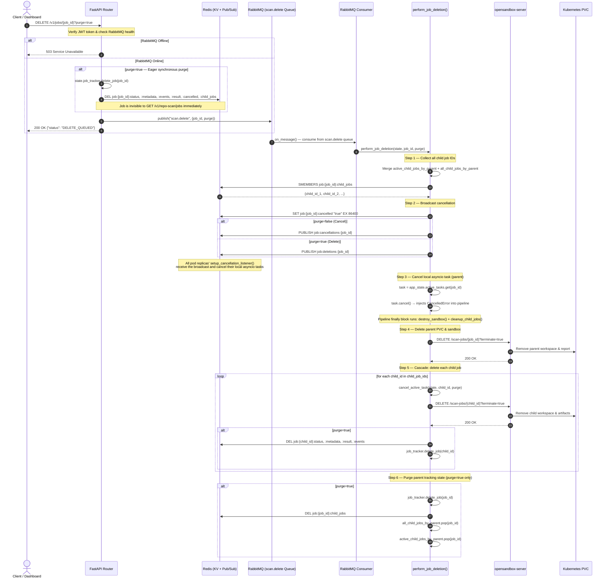

# Asynchronous Scan Deletion & Cancellation Reference Guide

This document provides a comprehensive technical overview of how scan job cancellation and deletion is implemented across the **CodeInspector & OpenSandbox** platform — covering the two-tier job hierarchy, cross-pod coordination via Redis, Kubernetes PVC teardown, and the frontend behaviour.

---

## 1. Architecture Overview

Scan job cancellation and deletion requests are processed **asynchronously** to keep HTTP response times in the sub-millisecond range and avoid blocking the event loop during potentially slow Kubernetes or PVC teardown operations.

**High-level flow:**

1. The client sends `DELETE /v1/jobs/{job_id}?purge=true` to the API Gateway.
2. When `purge=true`, the API **immediately and synchronously** wipes all Redis keys and the in-memory tracker entry for that job.
3. The API then publishes a delete task to the durable `scan.delete` RabbitMQ queue and returns `200 OK` to the client (< 1 ms).
4. A background consumer worker picks up the message, coordinates cross-pod cancellation via Redis Pub/Sub, and tears down Kubernetes sandbox pods and PVC workspaces.

If RabbitMQ is unavailable, the endpoint fails fast with `503 Service Unavailable`.

---

## 2. Two-Tier Job Hierarchy: Parent & Child Artifacts

A single repo scan creates a **two-tier hierarchy** of jobs. Understanding this is essential to understanding why deletion must cascade.

| Layer | Job ID | Where It Lives | Artifact on PVC |
|---|---|---|---|
| **Parent** | UUID assigned at `POST /v1/repo-scan` | `app_state.active_tasks` + Redis | Cloned repo under `reposcanner_<rand>/repo/` (local temp dir on API pod) |
| **Child** (one per detected language) | UUID assigned inside `_submit_scan_job()` | opensandbox-server `/scan-jobs` pipeline | Language-specific workspace + scan report in opensandbox pod PVC |

### Child Job Registration

Each child job is registered in **three places** before the language scan is submitted:

```python
# scan_repository/file_scanner.py — _submit_scan_job()
child_job_id = str(uuid4())
if parent_id:
    active_child_jobs_by_parent[parent_id].add(child_job_id)   # in-flight only
    all_child_jobs_by_parent[parent_id].add(child_job_id)       # full history
    state.redis_client.sadd(f"job:{parent_id}:child_jobs", child_job_id)
    state.redis_client.expire(f"job:{parent_id}:child_jobs", 86400)
```

When a child scan **completes**, it is removed from `active_child_jobs_by_parent` only — `all_child_jobs_by_parent` and Redis retain the full history so deletion can cascade to already-completed children whose PVC artifacts still need to be purged.

### Child ID Collection at Deletion Time

`perform_job_deletion()` (`core/delete_job.py`) merges **three sources** into a single set:

```python
child_job_ids = set()
# Source 1: in-flight children on this pod
child_job_ids.update(active_child_jobs_by_parent.get(job_id, set()))
# Source 2: all-time children on this pod
child_job_ids.update(all_child_jobs_by_parent.get(job_id, set()))
# Source 3: Redis — critical for multi-pod deployments
redis_children = state.redis_client.smembers(f"job:{job_id}:child_jobs")
child_job_ids.update(c.decode("utf-8") for c in redis_children)
```

The Redis set is the critical fallback: if the parent ran on a different replica pod than the one processing the deletion, in-memory maps are empty on that pod, but Redis still has the full child list.

---

## 3. Full Sequence Diagram



---

## 4. Why Redis is Used for Cross-Pod Coordination

In a Kubernetes deployment, `sandbox-api` scales horizontally with multiple active pod replicas. Because RabbitMQ distributes queue messages using a **competing consumer pattern**, a deletion message is delivered to **exactly one** replica — almost never the replica currently running the active scan task.

### The Problem
The pod that consumes the `scan.delete` message cannot directly reach into another pod's Python memory to cancel its running `asyncio.Task`.

### The Solution — Two Redis primitives working together

**1. The Whiteboard (Redis Key-Value)**
```python
state.redis_client.set(f"job:{job_id}:cancelled", "true", ex=86400)
```
Any pod that is about to start processing this job checks this flag first and aborts. Also polled inside `scan_single_language()` between language scans:
```python
if is_job_cancelled_or_deleted(app_state, job_id):
    raise asyncio.CancelledError()
```

**2. The Megaphone (Redis Pub/Sub)**
```python
state.redis_client.publish("job:deletions", job_id)
```
Every pod runs a background coroutine (`setup_cancellation_listener`) subscribed to `job:cancellations` and `job:deletions`. The pod running the scan receives the broadcast and cancels its local `asyncio.Task` immediately via `task.cancel()`.

### Simple Analogy
Imagine **5 security guards (API pods)** guarding a building:

- **RabbitMQ whispers to one guard:** "Cancel Job #123." But Guard A isn't running it — Guard B is.
- **The Megaphone (Redis Pub/Sub):** Guard A picks up a megaphone and shouts: _"All guards — cancel Job #123!"_ Guard B hears it and stops immediately.
- **The Whiteboard (Redis KV):** Guard A writes _"Job #123 is cancelled"_ on a central board. Any guard who is about to start Job #123 checks the board first and aborts.

---

## 5. Cancel vs. Delete — Behavioural Difference

| Behaviour | Cancel (`purge=false`) | Delete (`purge=true`) |
|---|---|---|
| Redis `job:{id}:cancelled` flag set | ✅ (24h TTL) | ✅ |
| Redis Pub/Sub channel published | `job:cancellations` | `job:deletions` |
| asyncio task cancelled | ✅ | ✅ |
| Status pushed to `CANCELLED` | ✅ | ❌ (records wiped) |
| PVC artifacts removed | ✅ (parent + all children) | ✅ (parent + all children) |
| Redis keys deleted immediately | ❌ (natural TTL expiry) | ✅ **in HTTP handler, before queue** |
| In-memory tracker cleared immediately | ❌ | ✅ **in HTTP handler, before queue** |
| Child tracking maps cleared | ❌ | ✅ (async, in queue worker) |
| Job visible in UI after action | ✅ (shown as CANCELLED) | ❌ (gone immediately) |

---

## 6. Bug Fix: Ghost Job After Cancel → Delete

### The Problem

When a job was first **cancelled** (`purge=false`) and then the user clicked the **trash icon** (delete, `purge=true`) on the cancelled entry, the job reappeared in the UI within 5 seconds.

Two bugs were conspiring:

**Bug 1 — Backend race window (primary cause)**

The original `cancel_or_delete_job` handler published straight to RabbitMQ and returned `DELETE_QUEUED`. The actual Redis key deletion happened asynchronously inside the queue worker — potentially seconds later. During that window, the UI's 5-second `GET /v1/repo-scan/jobs` poll still found `job:{id}:status = "CANCELLED"` in Redis and returned the job to the frontend, causing `syncFromServer` to re-insert it, overriding the local removal.

**Bug 2 — Frontend misclassified `CANCELLED` as active**

The mount-time SSE reconnect logic and both `syncFromServer` branches only checked `["DONE", "ERROR"]` as terminal states. A `CANCELLED` job was treated as still-active, causing the frontend to open an unnecessary SSE stream and re-insert the job when loaded from `localStorage` after a page refresh.

### Fix 1 — Eager synchronous Redis purge in the HTTP handler

**File:** [`scan_jobs/router.py`](file:///home/berrybytes/Desktop/Kamal/01-Sandbox/apiServer/fastapi/scan_jobs/router.py)

When `purge=true`, the HTTP handler now wipes all Redis keys and the in-memory tracker entry **synchronously before** publishing to the queue:

```python
if purge:
    # Wipe immediately so the next UI poll finds nothing
    state.job_tracker.delete_job(job_id)
    state.redis_client.delete(
        f"job:{job_id}:status",    f"job:{job_id}:metadata",
        f"job:{job_id}:events",    f"job:{job_id}:result",
        f"job:{job_id}:cancelled", f"job:{job_id}:child_jobs",
    )

# Queue the RabbitMQ worker for PVC/sandbox teardown (still async)
await publish("scan.delete", {"job_id": job_id, "purge": purge})
```

The RabbitMQ worker still runs to tear down PVC/sandbox artifacts — it just no longer races against the UI poll for the Redis job record.

### Fix 2 — `CANCELLED` added to terminal-state sets in the frontend

**File:** [`z1sandbox-website/src/hooks/useJobStore.ts`](file:///home/berrybytes/Desktop/Kamal/01-Sandbox/z1sandbox-website/src/hooks/useJobStore.ts)

`"CANCELLED"` was added to all three terminal-status exclusion checks:

```typescript
// Mount-time reconnect — do not reopen SSE stream for cancelled jobs on page refresh
const activeJobs = jobStore.getAll(jobType).filter(
  j => !["DONE", "ERROR", "CANCELLED"].includes(j.status)
);

// syncFromServer — do not open SSE for a newly discovered cancelled job
if (!["DONE", "ERROR", "CANCELLED"].includes(sj.status) && !esRefs.current[sj.job_id]) {
  openStream(sj.job_id, sj.eventIndex ?? 0);
}

// syncFromServer — do not reconnect SSE for an existing cancelled job
if (!["DONE", "ERROR", "CANCELLED"].includes(sj.status) && streamErrors.current[sj.job_id] < 3) {
  openStream(sj.job_id, existing.eventIndex ?? 0);
}
```

---

## 7. End-to-End Deletion Flow (Step-by-Step)

**Step 1 — UI Client-Side Eviction**
- The user clicks the trash icon on a scan job in the dashboard.
- The frontend immediately removes the job from `localStorage` (`unified_jobs_v1`), closes any open SSE stream for that job ID, and re-renders (job disappears instantly).
- It then sends `DELETE /v1/jobs/{job_id}?purge=true` to the API.

**Step 2 — Gateway Router (Eager Purge + Decoupling)**
- The FastAPI Gateway validates the auth token and checks RabbitMQ availability.
- If `purge=true`: synchronously deletes all 6 Redis keys and removes the job from the in-memory `job_tracker` — making the job invisible to the next `GET /v1/repo-scan/jobs` poll immediately.
- Publishes `{"job_id": job_id, "purge": true}` to the `scan.delete` RabbitMQ exchange.
- Returns `200 OK {"status": "DELETE_QUEUED"}` in < 1 ms.

**Step 3 — RabbitMQ Queue & Consumer Delivery**
- The delete message sits in the durable `scan.delete` queue.
- A background consumer worker receives the message and calls `handle_delete_job()` → `perform_job_deletion()`.

**Step 4 — Redis Cross-Pod Coordination (Phase 1)**
- Sets `job:{job_id}:cancelled = "true"` in Redis (24h TTL) as a poll-guard for pods about to start the job.
- Publishes to `job:deletions` Pub/Sub channel. All replica pods' `setup_cancellation_listener()` coroutines receive the broadcast and call `cancel_active_task()` on any local `asyncio.Task` for that job.

**Step 5 — Kubernetes Sandbox & PVC Cleanup (Phase 2)**
- Calls `backend.delete_scan_job(job_id, terminate=True)` which hits `opensandbox-server` to terminate the parent sandbox pod and purge its PVC workspace.
- Iterates over all collected child job IDs and sends individual `DELETE /scan-jobs/{child_id}?terminate=true` requests — removing every language-specific workspace from the PVC.

**Step 6 — Final State Purge (Phase 3, purge=true only)**
- Calls `job_tracker.delete_job(job_id)` to erase all in-memory events and status records.
- Deletes `job:{job_id}:child_jobs` from Redis and clears `all_child_jobs_by_parent` / `active_child_jobs_by_parent` maps.
- Consumer sends `msg.ack()` back to RabbitMQ, removing the deletion message from the queue.

---

## 8. Key Functions Reference

### API Entry & Queuing (Publisher)

**`cancel_or_delete_job(job_id, purge)`** — [`scan_jobs/router.py`](file:///home/berrybytes/Desktop/Kamal/01-Sandbox/apiServer/fastapi/scan_jobs/router.py)
- Serves `DELETE /v1/jobs/{job_id}`.
- When `purge=true`: synchronously wipes Redis keys and in-memory tracker before publishing to the queue.
- Returns `DELETE_QUEUED` in < 1 ms; raises `503` if RabbitMQ is offline.

**`proxy_cancel_or_delete_job(...)`** — [`proxy/router.py`](file:///home/berrybytes/Desktop/Kamal/01-Sandbox/apiServer/fastapi/proxy/router.py)
- Intercepts proxied deletion requests and publishes them to the `scan.delete` queue using the same pipeline.

### Core Deletion Orchestrator

**`perform_job_deletion(state, job_id, purge)`** — [`core/delete_job.py`](file:///home/berrybytes/Desktop/Kamal/01-Sandbox/apiServer/fastapi/core/delete_job.py)
- Merges child job IDs from all three sources (two in-memory maps + Redis).
- Broadcasts cancellation via Redis Pub/Sub.
- Cancels local asyncio task.
- Issues PVC/sandbox DELETE calls for parent and all children.
- Purges all Redis and in-memory records when `purge=true`.

**`handle_delete_job(state, job_id, purge)`** — [`core/queue/delete_handler.py`](file:///home/berrybytes/Desktop/Kamal/01-Sandbox/apiServer/fastapi/core/queue/delete_handler.py)
- Thin shim called by the RabbitMQ consumer. Delegates to `perform_job_deletion()`.

### Cross-Pod Coordination (Redis Pub/Sub)

**`setup_cancellation_listener(app_state)`** — [`core/queue/cancellation.py`](file:///home/berrybytes/Desktop/Kamal/01-Sandbox/apiServer/fastapi/core/queue/cancellation.py)
- Runs on every pod replica. Subscribes to `job:cancellations` and `job:deletions` channels. Dispatches incoming job IDs to `cancel_active_task()`.

**`cancel_active_task(app_state, job_id, purge)`** — [`core/queue/cancellation.py`](file:///home/berrybytes/Desktop/Kamal/01-Sandbox/apiServer/fastapi/core/queue/cancellation.py)
- Locates and cancels the running `asyncio.Task` for the job on this pod.
- If `purge=false`, pushes a `CANCELLED` status event via `job_tracker.push_event()`.

**`is_job_cancelled_or_deleted(app_state, job_id)`** — [`core/queue/cancellation.py`](file:///home/berrybytes/Desktop/Kamal/01-Sandbox/apiServer/fastapi/core/queue/cancellation.py)
- Checked before each language scan starts to abort mid-flight if a cancel/delete arrived during a multi-language pipeline.

### Kubernetes Sandbox Pod Cleanup

**`cleanup_child_jobs(job_ids)`** — [`scan_repository/file_scanner.py`](file:///home/berrybytes/Desktop/Kamal/01-Sandbox/apiServer/fastapi/scan_repository/file_scanner.py)
- Sends concurrent `DELETE /scan-jobs/{child_id}?terminate=true` requests to `opensandbox-server` for all active child language pods.
- Also called from the pipeline's `finally` block to clean up dangling in-flight children when the parent is cancelled.

**`delete_scan_job(job_id, terminate)`** — [`backends.py`](file:///home/berrybytes/Desktop/Kamal/01-Sandbox/apiServer/fastapi/backends.py)
- Dispatches HTTP DELETE to the remote `opensandbox-server` API to terminate the sandbox and clear PVC storage.

### Frontend Job Store

**`removeJob(jobId)`** — [`hooks/useJobStore.ts`](file:///home/berrybytes/Desktop/Kamal/01-Sandbox/z1sandbox-website/src/hooks/useJobStore.ts)
- Removes the job from `localStorage` and closes its SSE stream immediately.
- Calls `DELETE /v1/jobs/{jobId}?purge=true` on the backend.
- `CANCELLED` is now treated as a terminal state (alongside `DONE` and `ERROR`) — no SSE reconnection attempted.

---

## 9. Code Base Changes Summary

### Queue Configuration
**[`core/queue/job_types.py`](file:///home/berrybytes/Desktop/Kamal/01-Sandbox/apiServer/fastapi/core/queue/job_types.py)**
- Declared the `DELETE_SCAN` job type with `prefetch_count=5`, routing key `scan.delete`, and retry delay queues.
- Appended to `ALL_SCAN_JOB_TYPES` so consumers start automatically.

### Consumer Routing
**[`core/queue/consumer.py`](file:///home/berrybytes/Desktop/Kamal/01-Sandbox/apiServer/fastapi/core/queue/consumer.py)**
- Added branching for `delete-scan` job type → routes to `handle_delete_job()`.
- Pre-checks `is_job_cancelled_or_deleted()` before starting any job type (early discard if already flagged).

### Delete Handler & Core Orchestration
**[`core/queue/delete_handler.py`](file:///home/berrybytes/Desktop/Kamal/01-Sandbox/apiServer/fastapi/core/queue/delete_handler.py)** — **[NEW]**
- Created `handle_delete_job()` as the entry point from the consumer.

**[`core/delete_job.py`](file:///home/berrybytes/Desktop/Kamal/01-Sandbox/apiServer/fastapi/core/delete_job.py)**
- Implements `perform_job_deletion()` — the core orchestrator for child collection, Redis broadcast, task cancellation, PVC teardown, and state purging.

### Cross-Pod Coordination
**[`core/queue/cancellation.py`](file:///home/berrybytes/Desktop/Kamal/01-Sandbox/apiServer/fastapi/core/queue/cancellation.py)**
- Background Redis Pub/Sub listener subscribing to both `job:cancellations` and `job:deletions`.
- `cancel_active_task()` — cancels local asyncio task and pushes `CANCELLED` status.
- `is_job_cancelled_or_deleted()` — Redis + in-memory fallback guard checked at scan start.

### Child Sandbox Pod Cleanup
**[`scan_repository/file_scanner.py`](file:///home/berrybytes/Desktop/Kamal/01-Sandbox/apiServer/fastapi/scan_repository/file_scanner.py)**
- `_submit_scan_job()` — registers child IDs in `active_child_jobs_by_parent`, `all_child_jobs_by_parent`, and Redis `SADD`.
- `cleanup_child_jobs()` — HTTP DELETE loop for dangling in-flight children.

### API Routers
**[`scan_jobs/router.py`](file:///home/berrybytes/Desktop/Kamal/01-Sandbox/apiServer/fastapi/scan_jobs/router.py)**
- **Updated** `cancel_or_delete_job()` to perform eager synchronous Redis purge when `purge=true` before queuing the delete message.
- Returns `DELETE_QUEUED` on success; raises `503` if RabbitMQ is offline.

**[`proxy/router.py`](file:///home/berrybytes/Desktop/Kamal/01-Sandbox/apiServer/fastapi/proxy/router.py)**
- Intercepted `proxy_cancel_or_delete_job` to follow the same RabbitMQ publish pipeline.

### Frontend
**[`z1sandbox-website/src/hooks/useJobStore.ts`](file:///home/berrybytes/Desktop/Kamal/01-Sandbox/z1sandbox-website/src/hooks/useJobStore.ts)**
- `removeJob()` calls `DELETE /v1/jobs/{jobId}?purge=true`.
- `CANCELLED` added to all three terminal-state exclusion sets — prevents ghost job reappearance after cancel → delete.

---

## 10. Scaling & High-Concurrency Behaviour

When 100+ concurrent deletion requests arrive:

1. **API Ingestion (Non-blocking):** Each request completes the Redis eager purge (synchronous but fast — a single `DEL` pipeline call) and publishes to RabbitMQ in < 1 ms, keeping the API Gateway fully responsive.

2. **RabbitMQ QoS Prefetch:** The `delete-scan` consumer configures `prefetch_count=5` (configurable via `PREFETCH_DELETE_SCAN` or `MAX_DELETE_SCAN_WORKERS` env vars). Even with 100+ queued tasks, each worker pulls at most 5 at a time, preventing CPU/memory thrashing.

3. **Thread Pool Offload:** Long-running PVC and sandbox teardown calls are run via `asyncio.to_thread()`, keeping the primary asyncio event loop free for other tasks.

4. **Horizontal Scaling:** Adding more `sandbox-api` replicas increases queue throughput linearly — RabbitMQ distributes messages in competing-consumer fashion across all replicas.

---

## 11. Verification & Tests

### Automated Unit Tests

**[`tests/test_async_delete.py`](file:///home/berrybytes/Desktop/Kamal/01-Sandbox/apiServer/fastapi/tests/test_async_delete.py)**
- `test_delete_endpoint_rabbitmq_available` — validates `DELETE_QUEUED` response and RabbitMQ publish.
- `test_delete_endpoint_rabbitmq_unavailable` — validates `503` when RabbitMQ is offline.
- `test_proxy_delete_endpoint` — validates proxied delete requests follow the async pipeline.
- `test_delete_handler` — mocks scheduler state, checks task cancellation, backend cleanup, and job tracker purging.

```bash
PYTHONPATH=apiServer/fastapi pytest apiServer/fastapi/tests/test_async_delete.py
```

### Integration & Server Verification Scripts

**[`tests/test_delete_scans.py`](file:///home/berrybytes/Desktop/Kamal/01-Sandbox/apiServer/fastapi/tests/test_delete_scans.py)**
- Auto-detects all running or queued repo scan jobs on the server.
- Dispatches concurrent deletion and purge requests to the RabbitMQ queue.
- Verifies that parent jobs are cancelled, child language jobs are killed, and Kubernetes pods are fully cleaned up.

**[`tests/delete_existing_scans.py`](file:///home/berrybytes/Desktop/Kamal/01-Sandbox/apiServer/fastapi/tests/delete_existing_scans.py)**
- Targeted deletion by specific Job UUID, repository URL substring, or interactive list selection.
