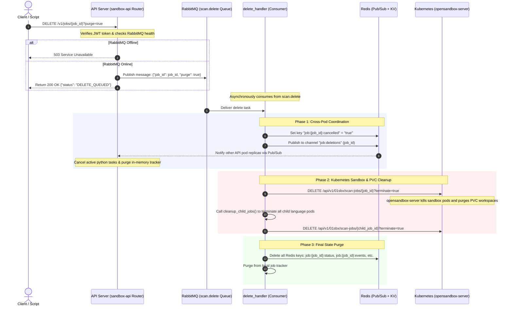

# Asynchronous Scan Deletion using RabbitMQ & Redis

This document details the architecture, implementation steps, and verification details of the asynchronous scan deletion and cancellation feature using RabbitMQ and Redis.

---

## Overview & Architecture

To improve response times, scalability, and system decoupling, scan job cancellation and deletion requests are processed asynchronously.
* When a deletion/cancellation request is made via the REST API, the API server publishes a message containing the `job_id` and `purge` flag to the RabbitMQ exchange.
* The API returns a `200 OK` status with `"status": "DELETE_QUEUED"` immediately to the client.
* RabbitMQ routes the message to the `scan.delete` queue.
* A background consumer worker receives the message, flags the job as cancelled in Redis, and publishes a deletion/cancellation event to Redis Pub/Sub.
* All scaling replicas of the `sandbox-api` pod receive the Redis Pub/Sub message, cancel their active local python scanning tasks, and purge the job from their in-memory trackers.
* The consumer worker then communicates with the `opensandbox-server` to terminate the parent sandbox pod, delete the PVC workspaces, and concurrently terminate all spawned child language sandbox pods.

If RabbitMQ is down, the deletion request fails immediately with a `503 Service Unavailable` error, ensuring predictability.



---

## Why Redis is Used in `delete_handler.py` (Cross-Pod Coordination)

In a Kubernetes deployment, the `sandbox-api` service scales horizontally with multiple active pod replicas (e.g., 5 replicas running concurrently).

Because **RabbitMQ distributes queue messages using a round-robin competing consumer pattern**, a deletion request from the `scan.delete` queue will only be delivered to **exactly one** worker replica.

This creates a distributed synchronization challenge:
* **The Problem:** The replica that consumes the `scan.delete` message from RabbitMQ is almost never the same replica that is currently executing the active scanning task (which runs as a local `asyncio.Task` on the Python event loop).
* **The Solution (Redis Pub/Sub):** To coordinate cancellation across all replicas:
  1. The consuming replica writes a persistent cancellation flag (`job:{job_id}:cancelled`) to **Redis key-value storage**. This ensures that even if a scanning task hasn't started yet, it will see the flag and abort immediately upon starting.
  2. The consuming replica publishes the `job_id` to a shared **Redis Pub/Sub channel** (`job:deletions` or `job:cancellations`).
  3. Every running replica pod runs a background listener subscribing to these channels. When they receive the message, the specific replica pod holding the active `asyncio.Task` cancels it immediately, ensuring the running scan is stopped instantly regardless of where it was running.

---

### Simple Analogy: The "Megaphone" and the "Whiteboard"

To understand how Redis solves this in simple terms, imagine you have **5 security guards (API pods)** guarding a building:

1. **RabbitMQ Whispers to One Guard:**
   * RabbitMQ is a dispatcher who whispers to **Guard A** only: *"Cancel and delete Job #123."*
   * But **Guard A** is not the one running Job #123. **Guard B** is the one running it. Guard A cannot directly touch Guard B's hands or memory.
2. **The Megaphone (Redis Pub/Sub):**
   * Guard A picks up a **megaphone (Redis Pub/Sub)** and shouts: **"Attention all guards! Cancel and delete Job #123!"**
   * Every guard in the building has a walkie-talkie tuned to this channel.
   * Guard B hears this shout, realizes they are running Job #123, and stops it immediately.
3. **The Whiteboard (Redis Key-Value):**
   * At the same time, Guard A writes *"Job #123 is cancelled"* on a **central whiteboard (Redis Key-Value store)**.
   * If any other guard is about to start Job #123 in the future, they check the whiteboard first. If they see the cancellation note, they abort immediately.

**Yes, Redis absolutely carries the `job_id` information!** The megaphone broadcast contains the `job_id`, and the whiteboard note is indexed by the `job_id`, ensuring the correct job is targeted across the entire cluster.

---

## Key Functions Reference (Deletion & Cleanup Flow)

Below is the functional map of the exact Python routines that implement the RabbitMQ-based deletion and Kubernetes sandbox pod cleanup pipeline:

### 1. API Entry & Queueing (Publisher)
* **`cancel_or_delete_job(job_id, purge)`** in [`scan_jobs/router.py`](file:///home/berrybytes/Desktop/Kamal/01-Sandbox/apiServer/fastapi/scan_jobs/router.py)
  * **Role:** Serves the `DELETE /v1/jobs/{job_id}` endpoint. It performs a lightweight health check on RabbitMQ, publishes the delete request message to the `scan.delete` queue, and immediately returns a `200 OK` response with `DELETE_QUEUED` to the client.
* **`proxy_cancel_or_delete_job(...)`** in [`proxy/router.py`](file:///home/berrybytes/Desktop/Kamal/01-Sandbox/apiServer/fastapi/proxy/router.py)
  * **Role:** Intercepts proxied deletion requests and publishes them to the RabbitMQ `scan.delete` queue.

### 2. Queue Consumer & Coordination
* **`handle_delete_job(state, job_id, purge)`** in [`core/queue/delete_handler.py`](file:///home/berrybytes/Desktop/Kamal/01-Sandbox/apiServer/fastapi/core/queue/delete_handler.py)
  * **Role:** The primary asynchronous orchestration function triggered by the RabbitMQ consumer. It sets the Redis cancellation flag, publishes cross-pod notifications, terminates the parent sandbox/PVC on `opensandbox-server`, cleans up the child language pods, and purges metadata records.

### 3. Cross-Pod Coordination (Redis Pub/Sub)
* **`setup_cancellation_listener(app_state)`** in [`core/queue/cancellation.py`](file:///home/berrybytes/Desktop/Kamal/01-Sandbox/apiServer/fastapi/core/queue/cancellation.py)
  * **Role:** Runs on every pod replica to listen to the Redis Pub/Sub channels `job:cancellations` and `job:deletions`. Decodes the bytes message payload and routes it for task cancellation.
* **`cancel_active_task(app_state, job_id, purge)`** in [`core/queue/cancellation.py`](file:///home/berrybytes/Desktop/Kamal/01-Sandbox/apiServer/fastapi/core/queue/cancellation.py)
  * **Role:** Aborts the running Python `asyncio.Task` on the current pod replica and pushes a `CANCELLED` status event.
* **`is_job_cancelled_or_deleted(app_state, job_id)`** in [`core/queue/cancellation.py`](file:///home/berrybytes/Desktop/Kamal/01-Sandbox/apiServer/fastapi/core/queue/cancellation.py)
  * **Role:** Checked periodically by active scan steps (cloning, language analysis) to abort execution mid-flight if a delete event is received.

### 4. Kubernetes Sandbox Pod Cleanup
* **`cleanup_child_jobs(state, parent_job_id)`** in [`scan_repository/file_scanner.py`](file:///home/berrybytes/Desktop/Kamal/01-Sandbox/apiServer/fastapi/scan_repository/file_scanner.py)
  * **Role:** Extracts the child language job IDs from the parent's metadata and sends concurrent `DELETE` requests to `opensandbox-server` to terminate all active child language pods on the cluster.
* **`delete_scan_job(job_id, terminate)`** in [`backends.py`](file:///home/berrybytes/Desktop/Kamal/01-Sandbox/apiServer/fastapi/backends.py)
  * **Role:** Dispatches HTTP delete requests directly to the remote `opensandbox-server` API to terminate running sandboxes and clear PVC storage workspaces.

---

## Code Base Changes

### 1. Queue Configuration

#### **[apiServer/fastapi/core/queue/job_types.py](file:///home/berrybytes/Desktop/Kamal/01-Sandbox/apiServer/fastapi/core/queue/job_types.py)**
* Declared a new `DELETE_SCAN` job type:
```python
DELETE_SCAN = ScanJobType(
    "delete-scan",
    "scan.delete",
    "scan.delete",
    5,
    ("scan.delete.5s", "scan.delete.30s", "scan.delete.2m"),
)
```
* Appended `DELETE_SCAN` to the list of `ALL_SCAN_JOB_TYPES` so the runner automatically spins up consumers for it.

---

### 2. Consumer Routing & Delete Logic

#### **[apiServer/fastapi/core/queue/delete_handler.py](file:///home/berrybytes/Desktop/Kamal/01-Sandbox/apiServer/fastapi/core/queue/delete_handler.py)**
* **[NEW]** Created `handle_delete_job(state, job_id, purge)`:
  * Leverages Redis Pub/Sub (`job:deletions` or `job:cancellations`) to coordinate cancellation across multiple pod replicas.
  * Dispatches backend sandbox/PVC resource cleanup to a separate thread executor via `asyncio.to_thread` to maintain loop performance.
  * Triggers concurrent cleanup of all active child language pods spawned in parallel.
  * Optionally clears job tracking details from the gateway state and Redis.

#### **[apiServer/fastapi/core/queue/consumer.py](file:///home/berrybytes/Desktop/Kamal/01-Sandbox/apiServer/fastapi/core/queue/consumer.py)**
* Added branching to route incoming `delete-scan` messages to the new delete handler.

---

### 3. Cross-Pod Coordination

#### **[apiServer/fastapi/core/queue/cancellation.py](file:///home/berrybytes/Desktop/Kamal/01-Sandbox/apiServer/fastapi/core/queue/cancellation.py)**
* Configured the background Redis Pub/Sub listener to subscribe to `job:cancellations` and `job:deletions`.
* When a message is received, it decodes the payload, cancels the local `asyncio.Task` if the job is running on that specific pod replica, and purges the job from its in-memory tracker.

---

### 4. Child Sandbox Pod Cleanup

#### **[apiServer/fastapi/scan_repository/file_scanner.py](file:///home/berrybytes/Desktop/Kamal/01-Sandbox/apiServer/fastapi/scan_repository/file_scanner.py)**
* Implemented `cleanup_child_jobs(state, parent_job_id)`:
  * Extracts child job IDs (the separate language scans running in parallel) from the parent's metadata.
  * Dispatches parallel `DELETE /api/v1/01sbx/scan-jobs/{child_job_id}?terminate=true` requests to `opensandbox-server` to terminate all active child language pods.

---

### 5. API Routers

#### **[apiServer/fastapi/scan_jobs/router.py](file:///home/berrybytes/Desktop/Kamal/01-Sandbox/apiServer/fastapi/scan_jobs/router.py)**
* Refactored `cancel_or_delete_job` (DELETE `/v1/jobs/{job_id}`) to check RabbitMQ connection status.
* Returns `status: "DELETE_QUEUED"` if successful, or raises a `503` exception if RabbitMQ is not available.

#### **[apiServer/fastapi/proxy/router.py](file:///home/berrybytes/Desktop/Kamal/01-Sandbox/apiServer/fastapi/proxy/router.py)**
* Intercepted `proxy_cancel_or_delete_job` delete request (DELETE `/api/{version}/{backend_id}/v1/jobs/{job_id}`) and refactored it to follow the same RabbitMQ publish pipeline.

---

## Scaling & High-Concurrency Behavior (100+ Requests)

When a burst of 100+ concurrent deletion or cancellation requests occurs, the system maintains reliability and responsiveness through the following mechanisms:

1. **API Ingestion (High Throughput & Non-blocking):**
   * The API router verifies RabbitMQ connection status in a lightweight check and immediately publishes the message to RabbitMQ's `scan.delete` queue.
   * Because it returns `DELETE_QUEUED` with a `200 OK` status immediately, the HTTP request completes in a fraction of a millisecond, leaving the API Gateway server highly responsive to incoming traffic.

2. **RabbitMQ Flow Flow Control (QoS Prefetch Limits):**
   * The `delete-scan` worker configures a prefetch count of `5` (`prefetch_count=5` by default, or configured via `MAX_DELETE_SCAN_WORKERS` environment variable).
   * Even if 100+ tasks are sent to `scan.delete` concurrently, each consumer instance only pulls a maximum of 5 messages at a time. The remaining requests reside safely in RabbitMQ, avoiding CPU/Memory thrashing on worker pods.

3. **Background Worker Concurrency:**
   * The local active task is cancelled asynchronously. Redis Pub/Sub acts as a cross-pod broadcast notification system to handle multi-replica setups.
   * Long-running operations like deleting PVC storage workspaces and destroying remote sandboxes are offloaded to an internal thread pool executor using `asyncio.to_thread()`, keeping the worker's primary asyncio event loop free to run other tasks.

4. **Horizontal Scaling:**
   * Since RabbitMQ distributes messages in a round-robin/competing-consumer fashion, scaling worker pods increases queue throughput linearly, handling large bursts of cancellations efficiently.

---

## Verification & Tests

### 1. Automated Unit Tests
The test file **[apiServer/fastapi/tests/test_async_delete.py](file:///home/berrybytes/Desktop/Kamal/01-Sandbox/apiServer/fastapi/tests/test_async_delete.py)** validates core components:
* `test_delete_endpoint_rabbitmq_available`: Validates that delete API returns `DELETE_QUEUED` and correctly publishes to RabbitMQ.
* `test_delete_endpoint_rabbitmq_unavailable`: Validates that the delete API fails with `503` if RabbitMQ is offline.
* `test_proxy_delete_endpoint`: Validates proxied delete requests behave asynchronously as well.
* `test_delete_handler`: Mocks the scheduler state, checks task cancellation, confirms backend cleanup, and validates job tracker purging.

#### Run Command:
```bash
PYTHONPATH=apiServer/fastapi pytest apiServer/fastapi/tests/test_async_delete.py
```

---

### 2. Integration & Server Verification Scripts

#### **[apiServer/fastapi/tests/test_delete_scans.py](file:///home/berrybytes/Desktop/Kamal/01-Sandbox/apiServer/fastapi/tests/test_delete_scans.py)**
* Auto-detects all currently running or queued repository scan jobs on the server.
* Dispatches concurrent deletion and purge requests to the RabbitMQ queue.
* Verifies that parent jobs are cancelled, child language jobs are killed, and Kubernetes pods are fully cleaned up.

#### **[apiServer/fastapi/tests/delete_existing_scans.py](file:///home/berrybytes/Desktop/Kamal/01-Sandbox/apiServer/fastapi/tests/delete_existing_scans.py)**
* Provides targeted deletion functionality.
* Allows deleting by a specific Job UUID, matching a repository URL substring (e.g. `fastapi`), or interactive selection from a list of current jobs.
