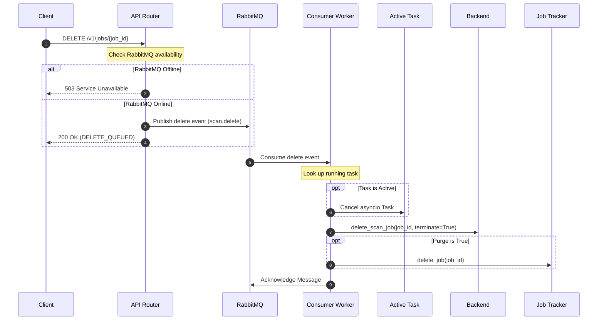

# Asynchronous Scan Deletion using RabbitMQ

This document details the architecture, implementation steps, and verification details of the asynchronous scan deletion and cancellation feature using RabbitMQ.

## Overview & Architecture

To improve response times, scalability, and system decoupling, scan job cancellation and deletion requests are processed asynchronously.
* When a deletion/cancellation request is made via the REST API, the API server publishes a message containing the `job_id` and `purge` flag to the RabbitMQ exchange.
* The API returns a `200 OK` status with `"status": "DELETE_QUEUED"` immediately to the client.
* RabbitMQ routes the message to the `scan.delete` queue.
* A background consumer worker receives the message, cancels any active processing tasks on the current node, cleans up sandbox/PVC resources on the backend, and optionally purges memory tracking details.

If RabbitMQ is down, the deletion request fails immediately with a `503 Service Unavailable` error, ensuring predictability. Redis is not utilized for deletion tracking or state coordination.



---

## Code Base Changes

### 1. Queue Configuration

#### **[apiServer/fastapi/core/queue/job_types.py](file:///home/berrybytes/Desktop/Kamal/01-Sandbox/apiServer/fastapi/core/queue/job_types.py)**
* Declared a new `DELETE_SCAN` job type:
```python
DELETE_SCAN = ScanJobType(
    "delete-scan",
    "scan.delete",
    "scan.delete",
    5,
    ("scan.delete.5s", "scan.delete.30s", "scan.delete.2m"),
)
```
* Appended `DELETE_SCAN` to the list of `ALL_SCAN_JOB_TYPES` so the runner automatically spins up consumers for it.

---

### 2. Consumer Routing & Delete Logic

#### **[apiServer/fastapi/core/queue/delete_handler.py](file:///home/berrybytes/Desktop/Kamal/01-Sandbox/apiServer/fastapi/core/queue/delete_handler.py)**
* **[NEW]** Created `handle_delete_job(state, job_id, purge)`:
  * Leverages local task cancellation (`cancel_active_task`) to stop any active scanning `asyncio.Task` safely.
  * Dispatches backend sandbox/PVC resource cleanup to a separate thread executor via `asyncio.to_thread` to maintain loop performance.
  * Optionally clears job tracking details from the gateway state.

#### **[apiServer/fastapi/core/queue/consumer.py](file:///home/berrybytes/Desktop/Kamal/01-Sandbox/apiServer/fastapi/core/queue/consumer.py)**
* Added branching to route incoming `delete-scan` messages to the new delete handler.

---

### 3. API Routers

#### **[apiServer/fastapi/scan_jobs/router.py](file:///home/berrybytes/Desktop/Kamal/01-Sandbox/apiServer/fastapi/scan_jobs/router.py)**
* Refactored `cancel_or_delete_job` (DELETE `/v1/jobs/{job_id}`) to check RabbitMQ connection status.
* Returns `status: "DELETE_QUEUED"` if successful, or raises a `503` exception if RabbitMQ is not available.

#### **[apiServer/fastapi/proxy/router.py](file:///home/berrybytes/Desktop/Kamal/01-Sandbox/apiServer/fastapi/proxy/router.py)**
* Intercepted `proxy_cancel_or_delete_job` delete request (DELETE `/api/{version}/{backend_id}/v1/jobs/{job_id}`) and refactored it to follow the same RabbitMQ publish pipeline.

---

## Verification & Tests

### Automated Unit Tests
A new test file **[apiServer/fastapi/tests/test_async_delete.py](file:///home/berrybytes/Desktop/Kamal/01-Sandbox/apiServer/fastapi/tests/test_async_delete.py)** was added to test endpoints and consumer logic:
* `test_delete_endpoint_rabbitmq_available`: Validates that delete API returns `DELETE_QUEUED` and correctly publishes to RabbitMQ.
* `test_delete_endpoint_rabbitmq_unavailable`: Validates that the delete API fails with `503` if RabbitMQ is offline.
* `test_proxy_delete_endpoint`: Validates proxied delete requests behave asynchronously as well.
* `test_delete_handler`: Mocks the scheduler state, checks task cancellation, confirms backend cleanup, and validates job tracker purging.

#### Run Tests Command:
```bash
PYTHONPATH=apiServer/fastapi pytest apiServer/fastapi/tests/test_async_delete.py
```
* **Result**: `4 passed in 0.48s`
