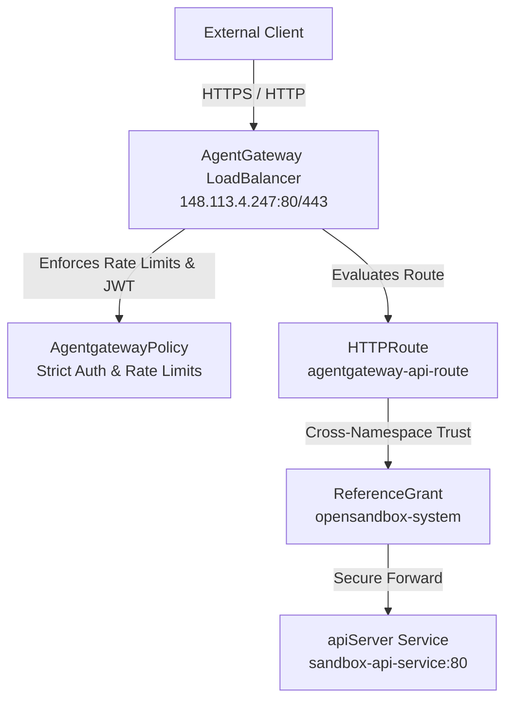

# 01Sandbox AgentGateway Technical Specifications & Rate Limiting

This document provides a comprehensive overview of the **AgentGateway** architecture within the 01Sandbox platform. It details how the gateway is provisioned, its current rate-limiting configuration, and outlines the technical debt and future hardening considerations.

---

## 1. Architectural Overview & Provisioning

The **AgentGateway** serves as the hardened, Envoy-based ingress edge proxy for the 01Sandbox ecosystem. It acts as the single point of entry, routing external client requests securely to internal platform microservices.

### Provisioning Steps & Routing Mechanics

The gateway was provisioned using the Kubernetes **Gateway API** specifications, packaged as a Helm chart under [codeInspector/charts/agentgateway](file:///home/berrybytes/Desktop/01-Sandbox/codeInspector/charts/agentgateway).



1. **Load Balancer Binding:**
   The gateway binds to the external MetalLB load-balancer IP `148.113.4.247` on ports `80` (HTTP) and `443` (HTTPS) using a custom domain (`api-sandbox.01security.com`).
2. **HTTP Route Definition:**
   The [httproute.yaml](file:///home/berrybytes/Desktop/01-Sandbox/codeInspector/charts/agentgateway/templates/httproute.yaml) evaluates the request hostname and prefix-maps requests under `/` to the backend service.
3. **Cross-Namespace Routing & Reference Grant:**
   Since the AgentGateway operates within the `agentgateway-system` namespace, and the API Server (`sandbox-api-service`) resides in the `opensandbox-system` namespace, cross-namespace routing is enabled securely. We deployed a `ReferenceGrant` inside `opensandbox-system` to explicitly trust ingress traffic originating from `agentgateway-system`.
4. **Security Policy Enforcement:**
   We attached an `AgentgatewayPolicy` resource named `apikey-auth` to the `HTTPRoute` to handle two critical concerns:
   - **JWT Validation:** Enforces strict, RS256 token verification using the Auth0 JWKS endpoint.
   - **Local Rate Limiting:** Enforces instant traffic policing directly on the proxy.

---

## 2. Rate Limiting Specification

To protect internal microservices and prevent Denial of Service (DoS) conditions, the AgentGateway implements **Local Rate Limiting** directly on the Envoy data-plane.

### The Current Configuration

The rate limit is fully templated and dynamically configured from the main [values.yaml](file:///home/berrybytes/Desktop/01-Sandbox/codeInspector/values.yaml#L38-L41) file. 

**Main Parent Configuration ([codeInspector/values.yaml](file:///home/berrybytes/Desktop/01-Sandbox/codeInspector/values.yaml#L38-L41)):**
```yaml
agentgateway:
  policy:
    rateLimit:
      requests: 7
      unit: "Minutes"
```

**Helm Chart Template ([policy.yaml](file:///home/berrybytes/Desktop/01-Sandbox/codeInspector/charts/agentgateway/templates/policy.yaml#L12-L17)):**
```yaml
  traffic:
    rateLimit:
      local:
        - requests: {{ .Values.policy.rateLimit.requests }}
          unit: {{ .Values.policy.rateLimit.unit }}
```

### Operational Mechanics
* **Window Size:** The rate limit utilizes a **1-minute window** that is continuously evaluated.
* **Request Quota:** Up to **7 requests** are permitted per client within each 1-minute window.
* **Expiration / Refill:** The rate-limiting counter resets automatically when the 1-minute window expires. If a client exceeds the limit, Envoy immediately drops the connections and returns an `HTTP 429 Too Many Requests` status code.

---

## 3. Technical Debt & Hardening Considerations

While the current local rate-limiting configuration successfully protects the ingress layer, several architectural limitations represent technical debt that must be addressed as the platform scales.

### I. Local vs. Global Consistency (Per-Instance Throttling)
> [!WARNING]
> Local rate limiting is **in-memory and pod-bound**. It is not synchronized across replicas.

* **The Problem:** The current rate limit is enforced by each individual `agentgateway-proxy` replica independently. If the gateway scales to 3 replicas under load, a client can theoretically send up to **21 requests per minute** (7 requests per pod) depending on how the load-balancer distributes the connections.
* **Resolution:** For high-precision quota enforcement, the rate limiting must be migrated from `local` to `global`. This requires deploying a Redis-backed **Global Rate Limit Service** (gRPC-based) and updating the `AgentgatewayPolicy` to reference a global backend service.

### II. Flat Route Quotas vs. Granular Client Identification
> [!IMPORTANT]
> The current rate limit applies **flatly across all clients** on the route.

* **The Problem:** A single malicious client can consume the entire 7-request quota, causing legitimate users to receive `HTTP 429` responses. This creates a vectors for Distributed Denial of Service (DDoS) against authorized users.
* **Resolution:** Refactor the policy to use **Envoy Descriptors**. This enables the gateway to track rate limits dynamically based on:
  - Client IP address (`remote_address`).
  - Request headers (e.g. `Authorization: Bearer <API-Key>`).
  - Downstream client identifiers.

### III. Rate Limiting Custom Responses
* **The Problem:** When rate-limited, Envoy returns a generic, blank `HTTP 429 Too Many Requests` page. This can result in poor user experience (UX) for client integrations.
* **Resolution:** Customize the local rate limit filter settings to return a structured JSON response (e.g. `{"error": "Rate limit exceeded. Please retry after 60 seconds."}`) along with custom header values (like `Retry-After: 60`).

---

## 4. History of Schema Fixes

During the initial deployment of the rate limiter, we resolved several schema validation errors:

1. **Array Validation Error:**
   * *Error:* `spec.traffic.rateLimit.local in body must be of type array: "object"`
   * *Fix:* Converted the `local` configuration block from an object into an array structure using YAML list tags (`-`).
2. **Missing Unit Validation Error:**
   * *Error:* `spec.traffic.rateLimit.local[0].unit: Required value`
   * *Fix:* Discovered that the CRD does not support standard nested `tokenBucket` elements at the top level of this policy schema. Transferred configuration directly to the root-level array items using `requests` and `unit`.
3. **Unsupported Time Unit Enum Casing:**
   * *Error:* `spec.traffic.rateLimit.local[0].unit: Unsupported value: "MINUTE": supported values: "Seconds", "Minutes", "Hours"`
   * *Fix:* Corrected the case-sensitive string from `MINUTE` to `"Minutes"`.
