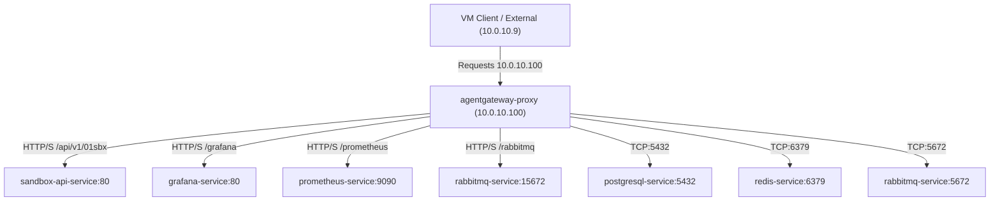

# Agent Gateway (kgateway) Documentation

This document describes the design, routing architecture, installation process, and troubleshooting steps for the `agentgateway` component in the cluster.

---

## 1. Routing Architecture

The `agentgateway` acts as the single entry point (API Gateway) for all traffic coming from the VM node (`10.0.10.9`) or other external clients. It binds to the static IP address **`10.0.10.100`** managed by MetalLB.



### Routing Tables & Exposed Ports

| Protocol | External Port | Route Path / Type | Backend Service | Destination Namespace |
| :--- | :--- | :--- | :--- | :--- |
| **HTTP** | `80` | Prefix `/api/v1/01sbx` | `sandbox-api-service:80` | `opensandbox-system` |
| **HTTP** | `80` | Prefix `/grafana` | `grafana-service:80` | `monitoring` |
| **HTTP** | `80` | Prefix `/prometheus` | `prometheus-service:9090` | `monitoring` |
| **HTTP** | `80` | Prefix `/rabbitmq` | `rabbitmq-service:15672` (Rewrite `/` -> `/`) | `opensandbox-system` |
| **HTTPS** | `443` | SSL Offloading | *Same as above* | *Same as above* |
| **TCP** | `5432` | TCP Route | `postgresql-service:5432` | `opensandbox-system` |
| **TCP** | `6379` | TCP Route | `redis-service:6379` | `opensandbox-system` |
| **TCP** | `5672` | TCP Route | `rabbitmq-service:5672` (AMQP) | `opensandbox-system` |

---

## 2. Installation & Setup Process

Follow these steps to perform a clean installation or recovery of the gateway components in the cluster.

### Step 1: Install Kubernetes Gateway API CRDs
The `agentgateway` controller relies on the Gateway API resources. Since the controller (`v1.0.1`) runs against a specific schema version, the **`v1.0.0` Experimental** CRD bundle is required to enable both HTTP and TCP route support.

```bash
kubectl apply --server-side -f https://github.com/kubernetes-sigs/gateway-api/releases/download/v1.0.0/experimental-install.yaml
```

### Step 2: Install the agentgateway Controller
The controller is distributed as an OCI artifact. Install it into the `agentgateway-system` namespace:

```bash
# Install the custom agentgateway helper CRDs
helm upgrade --install agentgateway-crds oci://cr.agentgateway.dev/agentgateway/charts/agentgateway-crds \
  --version v1.0.1 \
  --namespace agentgateway-system \
  --create-namespace

# Install the agentgateway controller
helm upgrade --install agentgateway oci://cr.agentgateway.dev/agentgateway/charts/agentgateway \
  --version v1.0.1 \
  --namespace agentgateway-system \
  --create-namespace \
  --set controller.extraEnv.KGW_ENABLE_GATEWAY_API_EXPERIMENTAL_FEATURES=true \
  --set controller.image.pullPolicy=Always
```

### Step 3: Apply GatewayClass Schema Validation Patch
To prevent validation conflicts between the API Server and the controller regarding `status.supportedFeatures`, patch the `gatewayclasses` CRD to strip the strict schema constraint:

```bash
python3 -c '
import yaml, subprocess
crd = yaml.safe_load(subprocess.check_output(["kubectl", "get", "crd", "gatewayclasses.gateway.networking.k8s.io", "-o", "yaml"]))
for v in crd.get("spec", {}).get("versions", []):
    props = v.get("schema", {}).get("openAPIV3Schema", {}).get("properties", {}).get("status", {}).get("properties", {})
    if "supportedFeatures" in props:
        del props["supportedFeatures"]
subprocess.Popen(["kubectl", "apply", "-f", "-"], stdin=subprocess.PIPE).communicate(yaml.dump(crd).encode())
'
```

After applying the patch, restart the controller deployment to ensure a clean sync state:

```bash
kubectl rollout restart deployment agentgateway -n agentgateway-system
```

### Step 4: Configure Gateway Bindings in Helm
In your main `values.yaml` file, define the Gateway configuration to request the static IP address:

```yaml
agentgateway:
  enabled: true
  namespace: agentgateway-system
  gateway:
    gatewayClassName: agentgateway
    addresses:
      - value: 10.0.10.100  # Requests this IP from MetalLB
    listeners:
      - protocol: HTTP
        port: 80
        name: http
      - protocol: HTTPS
        port: 443
        name: https
        tls:
          certificateRefs:
            - name: agentgateway-tls
      - protocol: TCP
        port: 5432
        name: postgresql
      - protocol: TCP
        port: 6379
        name: redis
      - protocol: TCP
        port: 5672
        name: rabbitmq-amqp
```

### Step 5: Deploy Gateway Resources and Routes
Deploy the Helm charts containing the Gateway, HTTPRoute, TCPRoute, and ReferenceGrant manifests:

```bash
helm upgrade --install codeinspector ./codeInspector -f ./codeInspector/values.yaml -n default
```

---

## 3. Configuration Details

### ReferenceGrants
Cross-namespace routing in Gateway API requires explicit authorization via `ReferenceGrant`. The route resources inside backend namespaces (such as `monitoring` or `opensandbox-system`) must be allowed to attach to the gateway in the `agentgateway-system` namespace.

Example `ReferenceGrant` for TCP routes in `opensandbox-system`:

```yaml
apiVersion: gateway.networking.k8s.io/v1beta1
kind: ReferenceGrant
metadata:
  name: allow-agentgateway-route
  namespace: opensandbox-system
spec:
  from:
    - group: gateway.networking.k8s.io
      kind: TCPRoute
      namespace: agentgateway-system
    - group: gateway.networking.k8s.io
      kind: HTTPRoute
      namespace: agentgateway-system
  to:
    - group: ""
      kind: Service
```

---

## 4. Troubleshooting & Verification

### Verify Services and IP Allocation
Confirm that the proxy service has successfully bound to the external IP `10.0.10.100`:

```bash
kubectl get svc -n agentgateway-system
```

### Inspect Controller Logs
If the proxy service is not created or updated, check the controller logs for validation issues:

```bash
kubectl logs -n agentgateway-system deployment/agentgateway
```
