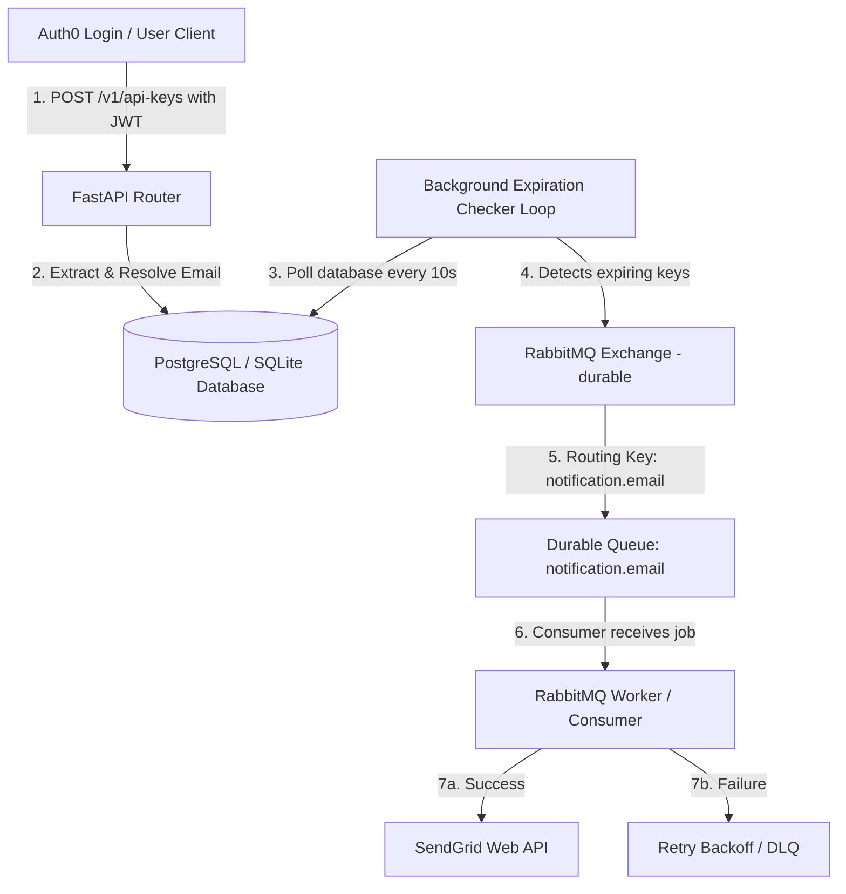

# Technical Architecture: API Key Expiration Notification System

This document outlines the architectural flow, component linkages, and implementation details of the asynchronous, fault-tolerant API key expiration warning system.

---

## 1. System Data Flow Diagram



---

## 2. File & Component Breakdown

### 2.1. Key Generation & Email Extraction
* **File:** [apiServer/fastapi/api_keys/router.py](file:///home/berrybytes/Desktop/Kamal/01-Sandbox/apiServer/fastapi/api_keys/router.py)
* **Functionality:**
  * Receives the user's Auth0 JWT token via `validate_token`.
  * Performs a dynamic scan of JWT claims to find standard (`email`) or namespaced/custom claims (e.g., `https://code-inspector.com/email`) containing the user's email address.
  * Persists the resolved email in the `user_email` column of the `api_keys` table.

### 2.2. Expiration Checker (Background Task)
* **File:** [apiServer/fastapi/services/expiry_checker.py](file:///home/berrybytes/Desktop/Kamal/01-Sandbox/apiServer/fastapi/services/expiry_checker.py)
* **Functionality:**
  * Runs continuously on a default **10-second check loop** (configurable via `KEY_EXPIRATION_CHECK_INTERVAL_SECONDS`).
  * Queries `api_keys` where `is_revoked = 0` and `expiry_notification_sent = 0`.
  * Computes the remaining time before expiration.
  * **Lead Time Notification Logic:**
    * **Keys with TTL ≤ 10 minutes:** Warnings are enqueued when remaining time is **≤ 3 minutes** (retained to keep legacy unit test assertions passing).
    * **Keys with 10 minutes < TTL ≤ 1 hour:** Warnings are enqueued when remaining time is **≤ 10 minutes**.
    * **Keys with 1 hour < TTL ≤ 24 hours:** Warnings are enqueued when remaining time is **≤ 1 hour**.
    * **Keys with 24 hours < TTL ≤ 7 days:** Warnings are enqueued when remaining time is **≤ 12 hours**.
    * **Keys with TTL > 7 days:** Warnings are enqueued when remaining time is **≤ 24 hours**.
  * Upon detection, it publishes a notification job payload to RabbitMQ and marks `expiry_notification_sent = 1` in the database to prevent duplicate notifications.

### 2.3. Message Queue Publisher
* **File:** [apiServer/fastapi/core/queue/publisher.py](file:///home/berrybytes/Desktop/Kamal/01-Sandbox/apiServer/fastapi/core/queue/publisher.py)
* **Functionality:**
  * Connects to RabbitMQ and declares the exchange with `durable=True`.
  * Publishes messages with `delivery_mode=aio_pika.DeliveryMode.PERSISTENT` (ensures they are written to disk and survive RabbitMQ service restarts).

### 2.4. Message Queue Consumer
* **File:** [apiServer/fastapi/core/queue/consumer.py](file:///home/berrybytes/Desktop/Kamal/01-Sandbox/apiServer/fastapi/core/queue/consumer.py)
* **Functionality:**
  * Registers a consumer on the `notification.email` queue.
  * Implements **Explicit Consumer Acknowledgments**:
    * If the email is successfully processed, it sends `await msg.ack()`.
    * If a transient failure occurs (e.g., network timeout or SendGrid API throttling), it calls `handle_worker_failure` to route the message through exponential backoff queues (`5s` -> `30s` -> `2m`).
    * If all 3 retry attempts fail, the message is permanently rejected (`await msg.reject(requeue=False)`) into the Dead Letter Queue (DLQ) for manual operator recovery, ensuring no notifications are silently dropped.

### 2.5. Email Dispatch Service
* **File:** [apiServer/fastapi/services/email.py](file:///home/berrybytes/Desktop/Kamal/01-Sandbox/apiServer/fastapi/services/email.py)
* **Functionality:**
  * Connects to the SendGrid Web API (`https://api.sendgrid.com/v3/mail/send`).
  * If `SENDGRID_API_KEY` is not present, falls back to **Mock Mode**, logging email details to stdout.
  * Utilizes `SENDGRID_FROM_EMAIL` (which must be verified as a Single Sender Identity in SendGrid) to dispatch the warning message.

---

## 3. Infrastructure & Deployment Configurations

### 3.1. Helm Configuration
* **File:** [codeInspector/values.yaml](file:///home/berrybytes/Desktop/Kamal/01-Sandbox/codeInspector/values.yaml)
* **Configuration:**
  * `apiServer.secret.SENDGRID_API_KEY`: Sets the base64-encoded SendGrid credential inside the Kubernetes pod environment.
  * `apiServer.configMap.SENDGRID_FROM_EMAIL`: Configures the verified sender email.

---

## 4. Testing & Validation

### 4.1. Unit and Mocked Testing
Verify the notification logic, database states, and RabbitMQ payload formatting:
```bash
PYTHONPATH=. pytest tests/test_email_notification.py -k "not test_send_real_expiry_email"
```

### 4.2. Live E2E Email Delivery Integration Test
Ensure your SendGrid API key and verified Sender Identity are configured correctly by running the integration test directly:
```bash
PYTHONPATH=. pytest tests/test_email_notification.py -k "test_send_real_expiry_email" -s
```

---

## 5. Troubleshooting & Operational Gotchas

### 5.1. Kubernetes Secrets Static Environment Variables Reloading
* **Issue**: When updating application credentials (such as the `SENDGRID_API_KEY`) via a `SealedSecret` or regular `Secret`, the updated values are injected as environment variables using `valueFrom.secretKeyRef`.
* **Important Caveat**: Kubernetes does **not** dynamically update environment variables in running containers when their source secret changes. The containers must be restarted to load the new environment state.
* **Fix**: Force a rolling update of the API pods:
  ```bash
  kubectl rollout restart deployment sandbox-api -n opensandbox-system
  ```

### 5.2. SendGrid "202 Accepted" vs. Unverified Sender Identity
* **Issue**: If you request SendGrid to send an email from an address (e.g., `sandbox@01security.com`) that has **not** been verified as a Single Sender Identity or a Verified Domain in your SendGrid Account dashboard, SendGrid's API will still return `202 Accepted`. However, SendGrid will silently drop or discard the message immediately after, and it will never be delivered to the recipient's inbox.
* **Fix**:
  1. Open your SendGrid dashboard and complete Single Sender Verification for the sender email.
  2. Configure that verified email (e.g., `kamal.tamang@berrybytes.com`) in `codeInspector/values.yaml` under `apiServer.configMap.SENDGRID_FROM_EMAIL`.
  3. Deploy the Helm upgrade and perform a rollout restart.
