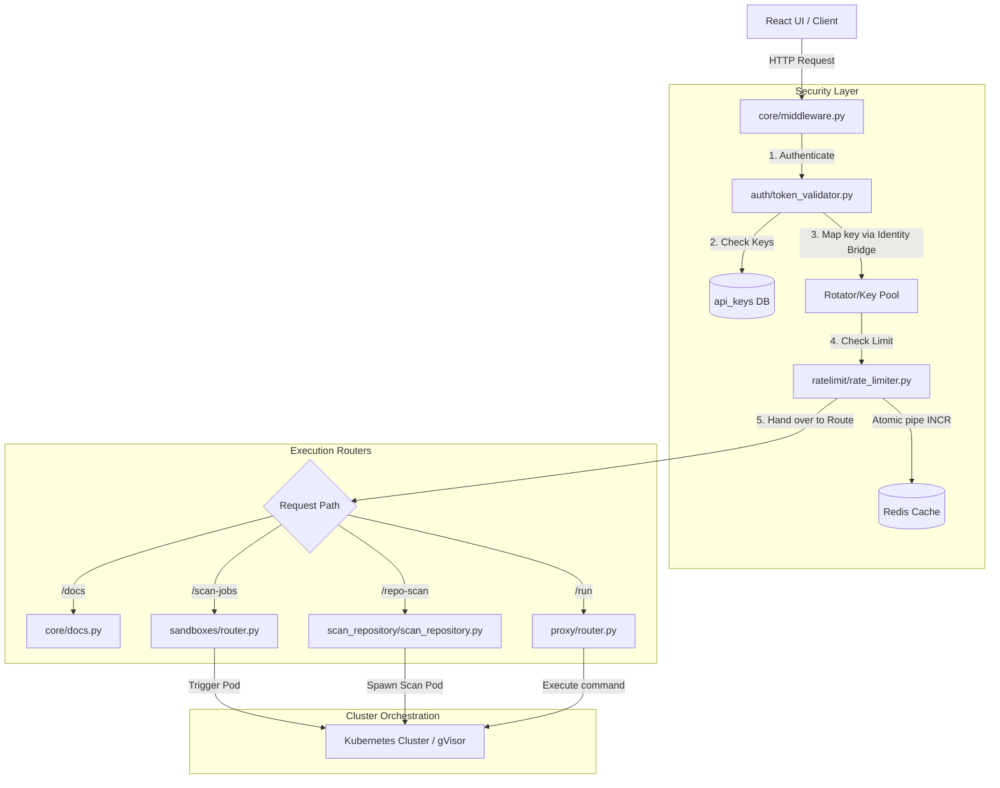

# 01Sandbox API Server Modular Architecture Technical Documentation

This document outlines the modular directory structure of the **01Sandbox FastAPI Backend (`apiServer/fastapi`)**, explaining the technical goal of each module, how they link together, and the complete step-by-step flow of requests through the system.

---

## 1. Directory Structure Overview & Core Goals

The `apiServer/fastapi` codebase is structured cleanly into functional, high-cohesion sub-packages under the FastAPI root. Each directory has a specific goal:

```
apiServer/fastapi/
├── core/             # Base App Initialization, Lifespan, Middleware, Global State
├── auth/             # Token Decoders, Remote JWKS, Identity Bridge Engine
├── ratelimit/        # Key-Specific and Client IP Fixed-Window Rate Limiter
├── api_keys/         # Developer Key CRUD Enforcements and Databases
├── sandboxes/        # gVisor Sandboxing & Quick Scan/Ingestion Routing
├── scan_repository/  # Public GitHub Clone & Multi-Tool Security Audit Pipeline
├── proxy/            # Dynamic API Gateway/Proxying to Active Sandbox Backends
└── health/           # Kubernetes Readiness/Liveness Probe Endpoints
```

### Module Breakdown & Objectives

| Directory | Technical Goal | Core Files |
| :--- | :--- | :--- |
| **`core/`** | Manages application bootstrap. Starts Uvicorn lifespan hooks, configures PostgreSQL pool, connects to Redis, and registers global middlewares (CORS, Error Handlers). | `app_state.py`, `middleware.py`, `lifespan.py` |
| **`auth/`** | Validates incoming JWTs (RS256) via Auth0 JWKS or local keys. Enforces the **Identity Bridge** mapping Auth0 logins case-insensitively to active developer API keys. | `token_validator.py` |
| **`ratelimit/`** | Implements the high-speed click-triggered fixed-window rate limiter using atomic Redis increments and local memory fallbacks. | `rate_limiter.py` |
| **`api_keys/`** | Manages API Key CRUD operations. Syncs active API key statuses globally via Redis Sets. | `router.py`, `models.py` |
| **`sandboxes/`** | Handles single-snippet scans and manual sandbox creations. Manages PVC allocation and background worker execution. | `router.py`, `models.py` |
| **`scan_repository/`** | Validates public GitHub repositories, performs asynchronous multi-stage auditing (clone -> language detect -> sandboxed Semgrep/Security Scans) and streams live steps. | `scan_repository.py`, `sandbox_provisioner.py`, `sse_manager.py` |
| **`proxy/`** | Acts as an internal API Gateway, proxying execution requests dynamically to sandbox containers. | `router.py` |
| **`health/`** | Provides endpoints for Kubernetes orchestration and uptime reporting. | `router.py` |

---

## 2. Global Architecture & Linking Flow

This sequence shows how these independent modules link together to process a request safely:



---

## 3. Step-by-Step Request Lifecycle & Linkages

### Step A: Interception & Setup (`core`)
When a request is received (e.g., `POST /v1/repo-scan`), it enters **`core/middleware.py`**. The middleware handles base security headers and pre-flight CORS logic, then invokes the global dependency: **`auth/token_validator.py`**.

### Step B: Token Verification & Dynamic Key Mappings (`auth` -> `api_keys`)
1. `auth` checks the request route.
   - If it matches a documentation route (`/docs`, `/redoc`), it bypasses strict signature checks to avoid session expiration errors, but still attempts to extract user identity (`sub`) for rate limiting.
   - If it is an execution route, it enforces a strict Bearer header token check.
2. `auth` decodes the payload. Using the Auth0 user identity (`sub`), it executes a query against **`api_keys`** (via the DB connection pooled in `core/app_state.py`) to retrieve all valid API keys created by that user.
3. **The Identity Bridge** rotates through the user's active keys and identifies the first key that is not currently rate-limited.
   - If the user has 2 keys, their overall limit scales to **10 requests per 60 seconds**.
   - The call is dynamically bound to this key ID (`jti`).

### Step C: Rate Limiting Enforcement (`auth` -> `ratelimit`)
1. Once a valid key `jti` is identified or mapped, `auth` calls `check_rate_limit(state, jti)` inside **`ratelimit/rate_limiter.py`**.
2. `ratelimit` executes an atomic Redis pipeline:
   - **`INCR`** the hit counter for `ratelimit:fixed:{jti}`.
   - **`TTL`** to determine the remaining time in the current window.
   - If this is the first hit (`count == 1`), it sets the window expiration to 60 seconds.
3. If `count` exceeds the quota (e.g., 5 requests), `ratelimit` immediately raises an `HTTPException(429, detail={"retry_after": ...})`. This bubbles up through `core/middleware.py` back to the React client, terminating the flow immediately.

### Step D: Main Execution & Pipeline Dispatch (`sandboxes` & `scan_repository`)
If the rate limit is under the budget, the request proceeds to the respective route handler:
- **`sandboxes/router.py`**: Allocates sandbox pods and writes quick scan codes to Kubernetes PVC mount paths.
- **`scan_repository/scan_repository.py`**: Executes the heavy-duty public GitHub audit:
  1. Validates the repo URL structure via `github_validator.py`.
  2. Spawns an ephemeral analysis sandbox in the cluster via `sandbox_provisioner.py`.
  3. Executes the language auto-detection sandbox script (`language_detector.py`).
  4. Runs security tools (like Semgrep) inside the sandbox against the cloned files (`file_scanner.py`).
  5. Aggregates vulnerabilities and streams execution logs to the user in real-time using `sse_manager.py` (via Redis Pub/Sub so that other pod replicas can see the stream).

---

## 4. Key Architectural Decisions & Resilience

1. **Shared Redis State Consistency**:
   Redis is used by `ratelimit` to sync rate counters, by `auth` to sync active keys globally, and by `scan_repository` to publish SSE status updates across container pod boundaries. If Redis experiences a connection blip, all modules gracefully fallback to Python local-in-memory states, ensuring the core platform does not crash.
2. **Decoupled Gateway Throttling**:
   Envoy gateway policies are configured to only act as perimeter DDoS blocks. Fine-grained business logic (e.g., key scaling and selective Swagger spec bypasses) is kept entirely inside the FastAPI server, avoiding complex and fragile configuration deployments on Kubernetes.

---

## 5. Production Deployment & API Endpoint Reference

### Deployment Topology

The production environment is hosted on a Kubernetes cluster managed via Helm. The request path from the public internet to the FastAPI pod is:

```
Client Browser / React UI
        │
        ▼
https://api-sandbox.01security.com  (Public DNS → 148.113.4.247)
        │
        ▼
Agent Gateway (agentgateway-system namespace)
  - TLS Termination (HTTPS port 443)
  - JWT Strict-Mode Enforcement
  - HTTPRoute → sandbox-api-service:80
        │
        ▼
sandbox-api-service (ClusterIP, port 80 → targetPort 8000)
        │
        ▼
FastAPI Pod (opensandbox-system namespace, port 8000)
  - codeinspectior_api.py (app entry)
  - auth/ → ratelimit/ → sandboxes/ | scan_repository/ | proxy/
        │
        ▼
opensandbox-server (internal cluster service, gVisor sandboxed pods)
```

### Route Prefix

All internal backend routes use the versioned prefix defined in `values.yaml`:

```
global.apiRoutePrefix: /api/v1/01sbx
```

---

### Production API Endpoints

**Base URL:** `https://api-sandbox.01security.com`

| Feature | Method | Endpoint | Auth Required | Rate Limited |
| :--- | :---: | :--- | :---: | :---: |
| **Swagger UI (Interactive Docs)** | `GET` | `/api/v1/01sbx/docs` | Session Cookie | ✅ Yes |
| **OpenAPI JSON Spec** | `GET` | `/api/v1/01sbx/openapi.json` | No | ❌ No |
| **ReDoc UI** | `GET` | `/api/v1/01sbx/redoc` | Session Cookie | ✅ Yes |
| **Health Check** | `GET` | `/health` | No | ❌ No |
| **Quick Scan (Ingestion Engine)** | `POST` | `/api/v1/01sbx/scan-jobs` | Bearer API Key | ✅ Yes |
| **Scan Status (polling)** | `GET` | `/api/v1/01sbx/scan-status/{job_id}` | Bearer API Key | ❌ No |
| **Scan Report** | `GET` | `/api/v1/01sbx/scan-jobs/{job_id}/report` | Bearer API Key | ❌ No |
| **Repository Scanner** | `POST` | `/v1/repo-scan` | Bearer API Key | ✅ Yes |
| **List API Keys** | `GET` | `/v1/api-keys` | Auth0 Session | ❌ No |
| **Create API Key** | `POST` | `/v1/api-keys` | Auth0 Session | ❌ No |
| **Delete API Key** | `DELETE` | `/v1/api-keys/{jti}` | Auth0 Session | ❌ No |
| **Run Code (Proxy)** | `POST` | `/api/v1/01sbx/run` | Bearer API Key | ❌ No |

> **Note:** Endpoints marked **Rate Limited** enforce a fixed-window counter per API key. The limit scales dynamically: `N active API keys × 5 requests = total allowed per 60-second window`.

### Accessing the Swagger UI in Production

1. Log in to your dashboard at **`https://sandbox.01security.com`**.
2. Navigate to **`https://api-sandbox.01security.com/api/v1/01sbx/docs`**.
3. Your `inspector_auth` session cookie is automatically read and injected as a `Bearer` token by the Swagger UI's zero-touch `autoAuthorize` JavaScript — no manual authorization step is needed.
