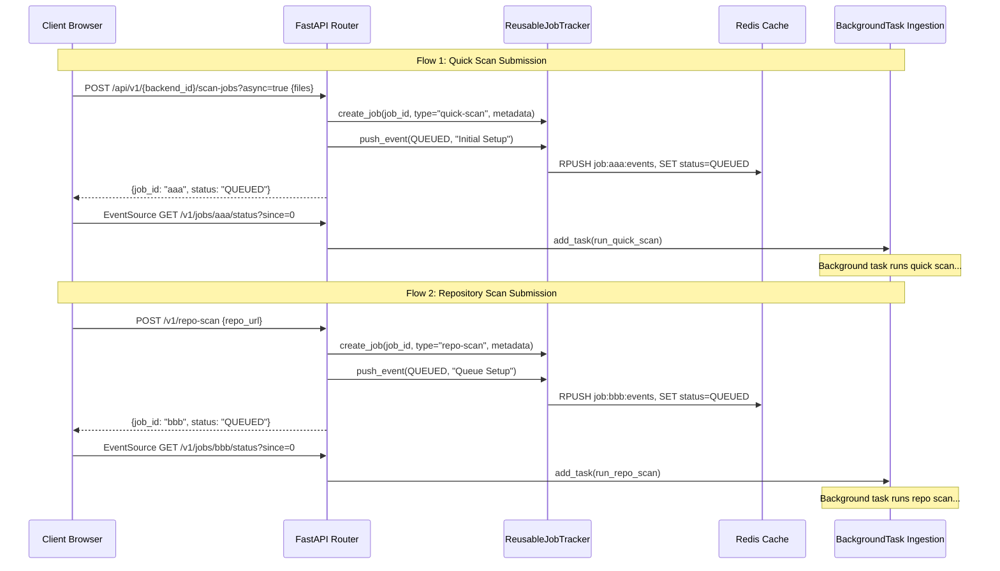

# Reusable & Modular Async Scan Pipeline — GitHub Actions-Style

## 1. Goal

Create a **modular, reusable pipeline framework** that allows multiple different scan events (e.g. "GitHub Repository Scan", "Quick Code Ingestion Scan", "Bulk Sandboxed Audits") to inherit the exact same asynchronous execution, state persistence, reconnection, and GitHub Actions-style visualization capabilities.

## Target UI Layout Schematic

Below is an ASCII representation of the premium dark-mode dashboard UI designed for the pipeline scanning interface:

```text
┌────────────────────────────────────────────────────────────────────────────────────────┐
│  🛡️  Pipeline Security Scan             [🔍 Search...]                  (AS) Actions ▾ │
├───────────────────────────────────────┬────────────────────────────────────────────────┤
│ ACTIVE SCANS                          │  webapp-frontend / main            Run #1459   │
│ ┌───────────────────────────────────┐ │ ┌────────────────────────────────────────────┐ │
│ │ 🔀 webapp-frontend                │ │ │ Repository: org/webapp-frontend            │ │
│ │   main                            │ │ │ Event: push by alicewhite                  │ │
│ │ ⟳ Scanning (72%)       12:31 / 12 │ │ │ Commit: 8a4f2b1                            │ │
│ └───────────────────────────────────┘ │ │ Duration: 12m 31s (Elapsed)                │ │
│ ┌───────────────────────────────────┐ │ │ Status: ⟳ Scanning                         │ │
│ │ 🔀 data-api                       │ │ └────────────────────────────────────────────┘ │
│ │   main                            │ │                                                │
│ │ ✓ Completed                 11:45 │ │ ┌───┐                                          │
│ └───────────────────────────────────┘ │ │ │ ✓ │ Setup Sandbox                     1m 02s │
│ ┌───────────────────────────────────┐ │ │ └───┘                                          │
│ │ 🔀 authentication-service         │ │ ┌───┐                                          │
│ │   dev                             │ │ │ ✓ │ Clone Repository                  0m 48s │
│ │ ✓ Completed                 10:55 │ │ └───┘                                          │
│ └───────────────────────────────────┘ │ ┌───┐                                          │
│ ┌───────────────────────────────────┐ │ │ ✓ │ Detect Languages                  2m 15s │
│ │ 🔀 payment-gateway                │ │ │     │ JavaScript (81.4%), HTML, CSS              │
│ │   master                          │ │ └───┘                                          │
│ │ 🟡 Queued                   08:22 │ │ ┌───┐                                          │
│ └───────────────────────────────────┘ │ │ │ ⟳ │ Security Scan                     7m 26s │
│ ┌───────────────────────────────────┐ │ │ │   │ ▬▬▬▬▬▬▬▬▬▬▬▬▬▬▬▬▬▬▬░░░░░░ 72%            │
│ │ 🔀 notification-engine            │ │ │ │   │ [INFO] Initializing scan...              │
│ │   main                            │ │ │ │   │ [INFO] Analyzing SAST vulnerabilities... │
│ │ ❌ Failed                   14:15 │ │ │ │   │ [SAST] Scanning file: src/api/handlers.js│
│ └───────────────────────────────────┘ │ │ └───┘                                          │
│                                       │ ┌───┐                                          │
│                                       │ │ ─ │ Done                              Queued │
│                                       │ └───┘                                          │
│                                       │                                                │
│                                       │ ┌───────────────┐ ┌─────────────┐ ┌──────────┐ │
│                                       │ │ 🛡️ Vulns       │ │ 🕒 Scan Time│ │ 📄 Files │ │
│                                       │ │ 8 Low | 1 Med │ │ 7m 26s      │ │ 315/437  │ │
│                                       │ └───────────────┘ └─────────────┘ └──────────┘ │
└───────────────────────────────────────┴────────────────────────────────────────────────┘
```


## 2. Architectural Paradigm: Job Type Polymorphism

Instead of duplicating status routers, event log structures, and frontend components, we parameterize the entire lifecycle using a `JobType` classification:

```
                  ┌──────────────────────────────┐
                  │      Unified SSEManager      │
                  │  (generic JobRecord / type)  │
                  └──────────────┬───────────────┘
                                 │
         ┌───────────────────────┴───────────────────────┐
         ▼                                               ▼
    [Type: repo-scan]                              [Type: quick-scan]
    - Repository URL                               - Inline Code / Sandbox
    - Steps: QUEUED → PROVISIONING →               - Steps: QUEUED → PROVISIONING →
      CLONING → DETECTING → SCANNING → DONE          SCANNING → DONE
```

### Key Modular Design Rules:
1. **Unified Storage Structure**: All jobs (independent of type) share a single Redis schema pattern: `job:{job_type}:{job_id}:[status/result/events]`.
2. **General Hook interface**: `useJobStore` becomes generic and receives `jobType` as a configuration key.
3. **Reusable View Modules**: The visual pipeline display (`PipelineView`) reads step configurations dynamically based on the job's schema configuration.

---

## 3. Detailed Component Plan

### 3.1 Backend — `core/jobs/` (Modular Job Tracking Engine)

#### `core/jobs/tracker.py`

Create a reusable job tracking engine to manage all in-memory and Redis-based job lifecycles.

```python
import asyncio
import json
import time
from typing import Optional, List, Dict
from collections import deque
from pydantic import BaseModel

class JobEvent(BaseModel):
    job_id: str
    job_type: str
    step: str
    message: str
    progress: int
    detail: Optional[dict] = None

class GenericJobRecord:
    def __init__(self, job_id: str, job_type: str, metadata: dict):
        self.job_id = job_id
        self.job_type = job_type
        self.metadata = metadata
        self.queue: asyncio.Queue = asyncio.Queue()
        self.event_log: deque = deque(maxlen=200)
        self.step: str = "QUEUED"
        self.result: Optional[dict] = None
        self.finished_at: Optional[float] = None

class ReusableJobTracker:
    def __init__(self, app_state):
        self.app_state = app_state
        self._jobs: Dict[str, GenericJobRecord] = {}

    def create_job(self, job_id: str, job_type: str, metadata: dict) -> GenericJobRecord:
        record = GenericJobRecord(job_id, job_type, metadata)
        self._jobs[job_id] = record
        return record

    def get_job(self, job_id: str) -> Optional[GenericJobRecord]:
        return self._jobs.get(job_id)

    async def push_event(self, job_id: str, step: str, message: str, progress: int, detail: Optional[dict] = None):
        job = self._jobs.get(job_id)
        event = JobEvent(job_id=job_id, job_type=job.job_type if job else "unknown",
                         step=step, message=message, progress=progress, detail=detail)
        event_json = event.json()

        # 1. Update in-memory job
        if job:
            job.step = step
            job.event_log.append(event)
            await job.queue.put(event)
            if step in ("DONE", "ERROR"):
                job.finished_at = time.monotonic()
                job.result = detail
                await job.queue.put(None)

        # 2. Update Redis
        if self.app_state.use_redis and self.app_state.redis_client:
            r = self.app_state.redis_client
            r.publish(f"job:{job_id}:chan", event_json)
            r.rpush(f"job:{job_id}:events", event_json)
            r.expire(f"job:{job_id}:events", 86400)
            r.set(f"job:{job_id}:status", step, ex=86400)
            if step in ("DONE", "ERROR") and detail:
                r.set(f"job:{job_id}:result", json.dumps(detail), ex=86400)

    async def stream(self, job_id: str, since_index: int = 0):
        job = self._jobs.get(job_id)
        if not job:
            yield f'data: {{"step":"ERROR","message":"Job not found"}}\n\n'
            return

        for event in list(job.event_log)[since_index:]:
            yield f"data: {event.json()}\n\n"

        if job.finished_at:
            return

        while True:
            try:
                event = await asyncio.wait_for(job.queue.get(), timeout=30.0)
            except asyncio.TimeoutError:
                yield ": ping\n\n"
                continue
            if event is None:
                break
            yield f"data: {event.json()}\n\n"
            if event.step in ("DONE", "ERROR"):
                break
```

---

### 3.2 Backend Endpoints — Reusable Job Router

#### `core/jobs/router.py`

This generic router exposes endpoints that operate on any `job_type`, serving as the engine for all scans.

```python
from fastapi import APIRouter, Depends, HTTPException
from fastapi.responses import StreamingResponse
# Import Generic Job Tracker singleton

router = APIRouter(prefix="/v1/jobs", tags=["Generic Jobs Infrastructure"])

@router.get("", dependencies=[Depends(validate_token)])
async def list_jobs(job_type: str):
    """Lists active/cached jobs matching a specific type."""
    # Queries Redis job:* prefix or memory filter by job_type
    ...

@router.get("/{job_id}/events", dependencies=[Depends(validate_token)])
async def get_job_events(job_id: str, since: int = 0):
    """Retrieves all past events for replay/hydration."""
    ...

@router.get("/{job_id}/status", dependencies=[Depends(validate_token)])
async def stream_job_status(job_id: str, since: int = 0):
    """Streams live events using the Generic SSE Manager."""
    ...
```

---

### 3.3 Frontend — Reusable Hooks & Types

#### `src/lib/jobStore.ts`

Make the `localStorage` key and model generic:

```typescript
export interface GenericJob<TMetadata = any, TResult = any> {
  job_id: string;
  job_type: "repo-scan" | "quick-scan";
  status: string;
  progress: number;
  stepMessage: string;
  eventIndex: number;
  metadata: TMetadata;
  result: TResult | null;
  submittedAt: string;
  completedAt: string | null;
}

export const jobStore = {
  getAll: (type?: string): GenericJob[] => {
    const list: GenericJob[] = JSON.parse(localStorage.getItem("unified_jobs_v1") || "[]");
    return type ? list.filter(j => j.job_type === type) : list;
  },
  upsert: (job: GenericJob): void => {
    const all = JSON.parse(localStorage.getItem("unified_jobs_v1") || "[]");
    const idx = all.findIndex((j: any) => j.job_id === job.job_id);
    idx >= 0 ? (all[idx] = job) : all.unshift(job);
    localStorage.setItem("unified_jobs_v1", JSON.stringify(all));
  },
  get: (id: string): GenericJob | null =>
    jobStore.getAll().find(j => j.job_id === id) ?? null,
};
```

#### `src/hooks/useJobStore.ts`

Make the hook support filters and SSE streams for any job type.

```typescript
export function useJobStore(jobType: "repo-scan" | "quick-scan", apiBase: string, apiKey: string) {
  const [jobs, setJobs] = useState<GenericJob[]>(() => jobStore.getAll(jobType));
  const esRefs = useRef<Record<string, EventSource>>({});

  const refresh = () => setJobs(jobStore.getAll(jobType));

  const addJob = (job: GenericJob) => {
    jobStore.upsert(job);
    refresh();
  };

  const openStream = (job_id: string, since = 0) => {
    esRefs.current[job_id]?.close();
    // Connect to generic SSE router endpoint
    const es = new EventSource(
      `${apiBase}/v1/jobs/${job_id}/status?since=${since}&token=${encodeURIComponent(apiKey)}`
    );
    esRefs.current[job_id] = es;

    es.onmessage = (e) => {
      const ev = JSON.parse(e.data);
      const stored = jobStore.get(job_id)!;
      jobStore.upsert({
        ...stored,
        status: ev.step,
        progress: ev.progress,
        stepMessage: ev.message,
        eventIndex: stored.eventIndex + 1,
        result: ev.step === "DONE" ? ev.detail : stored.result,
        completedAt: ev.step === "DONE" ? new Date().toISOString() : null,
      });
      refresh();
      if (["DONE", "ERROR"].includes(ev.step)) {
        es.close();
        delete esRefs.current[job_id];
      }
    };
    ...
  };

  // Reconnect active jobs on mount
  useEffect(() => {
    jobs.filter(j => !["DONE", "ERROR"].includes(j.status))
        .forEach(j => openStream(j.job_id, j.eventIndex));
  }, []);

  return { jobs, addJob, openStream, refresh };
}
```

---

### 3.4 Frontend Components — Configurable Pipeline Layout

#### `src/components/dashboard/UnifiedPipelineView.tsx`

This component renders the pipeline dynamically by parsing a step configuration schema:

```typescript
export interface PipelineStepConfig {
  key: string;
  label: string;
}

interface UnifiedPipelineViewProps {
  job: GenericJob;
  steps: PipelineStepConfig[];
  onResultRender: (result: any) => React.ReactNode;
}
```

```tsx
export function UnifiedPipelineView({ job, steps, onResultRender }: UnifiedPipelineViewProps) {
  const currentIdx = steps.findIndex(s => s.key === job.status);

  return (
    <div className="space-y-6">
      <div className="flex flex-col gap-2">
        {steps.map((step, idx) => {
          const isDone = idx < currentIdx || job.status === "DONE";
          const isActive = step.key === job.status && job.status !== "ERROR";
          const isError = job.status === "ERROR" && idx >= currentIdx;

          return (
            <div key={step.key} className={cn("flex items-center gap-3", isActive && "text-primary")}>
              <StepIndicator done={isDone} active={isActive} error={isError} />
              <span>{step.label}</span>
              {isActive && <span className="text-xs text-muted-foreground">{job.stepMessage}</span>}
            </div>
          );
        })}
      </div>
      <ProgressBar value={job.progress} isError={job.status === "ERROR"} />
      {job.status === "DONE" && job.result && onResultRender(job.result)}
    </div>
  );
}
```

---

## 4. How Scans Integrate (Examples)

### A. Repository Scanner Pipeline Configuration

- **Job Type**: `repo-scan`
- **Steps Schema**:
  ```typescript
  const REPO_STEPS = [
    { key: "QUEUED", label: "Job Queued" },
    { key: "PROVISIONING", label: "Provision Sandbox" },
    { key: "CLONING", label: "Clone Repository" },
    { key: "DETECTING", label: "Detect Languages" },
    { key: "SCANNING", label: "Security Scan" },
    { key: "DONE", label: "Complete" }
  ];
  ```

### B. Quick Scan (Code Audit) Pipeline Configuration

- **Job Type**: `quick-scan`
- **Steps Schema**:
  ```typescript
  const QUICK_STEPS = [
    { key: "QUEUED", label: "Job Queued" },
    { key: "PROVISIONING", label: "Setup Sandbox Environment" },
    { key: "SCANNING", label: "Analyze Code Structure" },
    { key: "DONE", label: "Analysis Completed" }
  ];
  ```

---

## 5. Sequence Diagram: Polymorphic Job Submission



---

## 6. Verification Plan

- **Polymorphic Retrieval**: Submit a `repo-scan` and `quick-scan`. Call `GET /v1/jobs?job_type=repo-scan` and verify it does not return the `quick-scan` job.
- **Dynamic Steps Rendering**: Render `UnifiedPipelineView` with both configurations and verify that missing steps (e.g. CLONING for Quick Scan) are correctly omitted and step numbers auto-align.
- **Cross-page State Retention**: Run a "Quick Scan" inside the Dialog, close the dialog, trigger a "Repo Scan", and verify the Quick Scan progress continues running and preserves status in localStorage.
