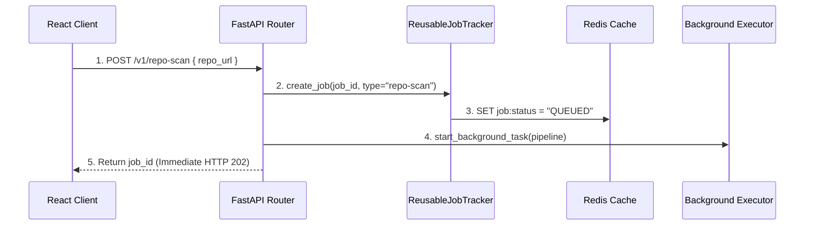

# Modular Async Scan Pipeline — Architecture Flow

This document explains the end-to-end flow of the modular asynchronous scan pipeline, including job tracking, SSE streaming, persistence, and recovery after browser refresh.

## Overview

The system solves:
- Independent scans
- Real-time progress updates
- Persistence across refreshes
- Job recovery
- Server-side event tracking

## High-Level Sequence Diagram

```plaintext
 User/UI         useJobStore      localStorage      FastAPI Backend       Redis
    │                 │                 │                  │                │
    ├─ 1. Click Scan ─►                 │                  │                │
    │                 ├───────── 2. POST /v1/repo-scan ────►                │
    │                 │                                    ├─ 3. Init Job ─►
    │                 ◄───────── 4. Return job_id ─────────┤                │
    │                 ├─ 5. upsert() ──►│                  │                │
    │                 ├──── 6. SSE: GET /status?since=0 ───────────────────►

PHASE 2: LIVE STREAMING

    │                 │                 │                  ├─ 7. Pipeline ─►
    │                 │                 │                  │    Progress
    │                 │                 │                  ├─ 8. RPUSH log ─►
    │                 ◄───────── 9. SSE Message ───────────┤                │
    │                 ├─ 10. upsert() ─►│                  │                │
    ◄─ 11. Re-render ─┤

PHASE 3: BROWSER REFRESH (RECOVERY)

    ├─ 12. Refresh ──►│
    │                 ├─ 13. getAll() ─►│
    │                 │  (Index is 14)
    │                 ├──── 14. SSE: GET /status?since=14 ─────────────────►
    │                 │                 │                  ├─ 15. Fetch ───►
    │                 │                 │                  │    Log 14+
    │                 ◄──────── 16. Fast-Forward SSE ──────┤
```

## Phase 1: The Handshake

1. User clicks scan.
2. Frontend sends POST `/v1/repo-scan`.
3. Backend initializes job and Redis tracking.
4. Backend returns `job_id`.
5. Frontend saves via `upsert()` to localStorage.
6. Frontend opens SSE stream using `?since=0`.

## Phase 2: Live Streaming

- Background worker executes scanning pipeline.
- `tracker.push_event()` pushes updates.
- Redis stores logs using RPUSH.
- SSE streams updates to UI.
- Frontend updates local state and re-renders.

## Phase 3: Browser Refresh Recovery

1. Browser refresh resets React memory.
2. `localStorage` restores state.
3. Frontend reconnects using `?since=14`.
4. Backend fetches missing Redis logs.
5. SSE fast-forwards UI without restarting scan.

## Mental Model

Think of it like Netflix resume playback:

- Frontend = Video player
- Redis = Playback history
- SSE = Live stream
- eventIndex = Timestamp
- Refresh = Reopen app
- since=14 = Resume playback


```
User/UI         useJobStore      localStorage       FastAPI Backend     Ephemeral Pod        RWX PVC
    │                 │                 │                   │                   │                │
    ├─ 1. Click Scan ─►                 │                   │                   │                │
    │                 ├────── 2. POST /v1/repo-scan ────────►                   │                │
    │                 │                                     ├─ 3. Init Job      │                │
    │                 │                                     │  (Redis State)    │                │
    │                 │                                     │                   │                │
    │                 │                                     ├─ 4. Hand off to BackgroundTasks    │
    │                 │                                     │  (Fire-and-forget thread)          │
    │                 ◄────── 5. Return job_id (Immediate) ─┤                   │                │
    │                 │                 │                   │                   │                │
    │                 ├─ 6. upsert() ──►│                   │                   │                │
    │                 │  (~100 bytes)   │                   │                   │                │
    │                 │                 │                   │                   │                │
    │                 ├──────────────── 7. SSE: GET /status?since=0 ────────────►                │
    │                 │                 │                   │                   │                │
    │                 │                 │                   │  8. Dynamic Spawn │                │
    │                 │                 │                   ├─ (Kubernetes API) ─►               │
    │                 │                 │                   │                   │                │
    │                 │                 │                   │                   │ [Runs Scan]    │
    │                 │                 │                   │                   │ ───────────┐   │
    │                 │                 │                   │                   │ │ Semgrep  │   │
    │                 │                 │                   │                   │ ◄──────────┘   │
    │                 │                 │                   │                   ├─ 9. Save JSON ─►
    │                 │                 │                   │                   │  Report File   │
    │                 │                 │                   │                   │                │
    │                 │                 │                   ◄─ 10. push_event ──┤                │
    │                 │                 │                   │   (status="DONE") │                │
    │                 │                 │                   │                   │                │
    │                 │                 │                   │                   │ [Self-Destruct]│
    │                 │                 │                   │                   X (Max 5 mins)   │
    │                 │                 │                   │                                    │
    │                 ◄──────────────── 11. SSE: "DONE" (No heavy payload) ───────────────────────┤
    │                 ├─ 12. upsert() ─►│                   │                                    │
    ◄─ 13. Render Row ┤                 │                   │                                    │
    │                 │                 │                   │                                    │
    │                 │                 │                   │                                    │
    ─── USER CLICKS HISTORICAL ROW (LAZY LOAD FROM PVC) ──────────────────────────────────────────
    │                 │                 │                   │                                    │
    ├─ 14. Select Row ─►                 │                   │                                    │
    │                 ├─────────────── 15. GET /v1/jobs/{id}/result ────────────►                │
    │                 │                                                         ├─ 16. Read File ─►
    │                 │                                                         ◄─ 17. Payload ──┤
    │                 ◄─────────────── 18. Stream raw report JSON ──────────────┤                │
    │                 │                                                                          │
    ◄─ 19. Render UI ──┤ [Held in volatile browser RAM only - completely bypasses localStorage]   │
    │                 │                                                                          │
```
---

## Technical Architecture & Code Linkages Walkthrough

To enable high-frequency, parallel, and stateful background scanning across repositories and individual files without bottlenecking server resources or crashing client browsers, we designed and implemented a **Stateful Asynchronous Job Tracking Framework**.

Below is the sequential breakdown of the system execution, linked directly to the newly established codebase.

### 1. Unified Job State & Redis Engine
The core abstraction that makes the entire pipeline possible is a thread-safe, polymorphic tracking engine. Instead of hardcoding unique routers or databases for every scan type, all jobs are managed through a unified state structure.

- **Source Code**: [tracker.py](file:///home/berrybytes/Desktop/01-Sandbox/apiServer/fastapi/core/jobs/tracker.py)
- **Key Details**:
  - `JobEvent`: A standardized Pydantic model containing `job_id`, `job_type`, `step`, `message`, `progress`, and an optional `detail` payload.
  - `GenericJobRecord`: An active job record representing an in-memory job. It uses an asynchronous event queue (`asyncio.Queue`) for live streaming and a `deque` ring-buffer to keep a rolling cache of the latest 200 events.
  - `ReusableJobTracker`: The coordinator class. It registers new tasks, updates statuses, pushes live data, and bridges state management between the in-memory FastAPI server and a Redis cluster.
- **System Integration**:
  - Registered as a global application singleton inside [app_state.py](file:///home/berrybytes/Desktop/01-Sandbox/apiServer/fastapi/core/app_state.py#L40-L60).
  - Main router routes are registered directly under the unified router inside [main.py](file:///home/berrybytes/Desktop/01-Sandbox/apiServer/fastapi/main.py).

---

### 2. Job Registration & Task Delegation (The Handshake)
When the user requests a new scan (such as scanning a GitHub Repository or submitting a file code snippet), the system avoids keeping the client waiting. It performs a "fire-and-forget" registration.



- **Source Code**:
  - Repository Scan Endpoint: [scan_repository.py](file:///home/berrybytes/Desktop/01-Sandbox/apiServer/fastapi/scan_repository/scan_repository.py#L440-L500)
  - Quick Inline Scan Endpoint: [router.py (sandboxes)](file:///home/berrybytes/Desktop/01-Sandbox/apiServer/fastapi/sandboxes/router.py#L80-L120)
- **Key Details**:
  - When the FastAPI router intercepts the request, it generates a unique `job_id` (UUID) or reads it from the gateway metadata.
  - It invokes `tracker.create_job(job_id, job_type="repo-scan", metadata={...})` to write initial metadata to Redis.
  - Using FastAPI's `BackgroundTasks`, it schedules `_run_scan_pipeline` on a background thread pool and immediately returns `HTTP 202` containing the `job_id` to the browser.

---

### 3. Asynchronous Pipeline Execution
Once the background thread fires, it executes the scan stages sequentially, computing progress percentage and publishing states.

- **Source Code**:
  - Full Scanning Sequence: [scan_repository.py](file:///home/berrybytes/Desktop/01-Sandbox/apiServer/fastapi/scan_repository/scan_repository.py#L71-L435)
  - Multi-Tool File Dispatcher: [file_scanner.py](file:///home/berrybytes/Desktop/01-Sandbox/apiServer/fastapi/scan_repository/file_scanner.py#L380-L545)
- **Technical Steps**:
  1. **Provisioning (10%)**: Spins up local temp directories. Calls `tracker.push_event(ScanStep.PROVISIONING, "Provisioning...", 10)`.
  2. **Cloning (25%)**: Fetches repository contents using standard git clone wrapper.
  3. **Detecting (45%)**: Runs language classification tools (`tokei` / `enry`) and returns language mapping.
  4. **Scanning (60% - 90%)**: Submits files categorized by languages in concurrent chunks to the `opensandbox-server` endpoint `/scan-jobs`. Progress dynamically increases per completed language.
  5. **Deduplication**: Gathers raw JSON outputs, normalizes, and filters findings to eliminate cross-language duplication.
  6. **Completion (100%)**: Clears workspace, aggregates severities (High, Medium, Low), and publishes the final `ScanStep.DONE` event alongside the complete scan result model.

---

### 4. Real-Time SSE Streams & Instant Reconnection
Instead of polling endpoints every second (which drains database connections), the system utilizes Server-Sent Events (SSE).

- **Source Code**:
  - SSE Streaming Endpoint: [router.py (jobs)](file:///home/berrybytes/Desktop/01-Sandbox/apiServer/fastapi/core/jobs/router.py#L70-L120)
  - Event Stream Manager: [tracker.py](file:///home/berrybytes/Desktop/01-Sandbox/apiServer/fastapi/core/jobs/tracker.py#L105-L175)
- **Key Details**:
  - The endpoint `GET /v1/jobs/{job_id}/status?since={index}` streams messages with the `text/event-stream` MIME type.
  - If a browser refreshes, it fetches its last known event index from localStorage and passes `since=14`.
  - The backend stream handler checks:
    - **In-Memory Cache**: If the server has the job in its active dictionary, it grabs the `event_log` deque and streams from index `14` to the end, then keeps the event queue open.
    - **Redis Hydration**: If the task was handled on a different pod replica (or the current pod restarted), the server queries the Redis list `job:{job_id}:events` via `LRANGE job_id 14 -1` to fast-forward replay the missed history. It then subscribes to the Redis Pub/Sub channel `job:{job_id}:chan` to seamlessly relay incoming live updates!

---

### 5. Frontend Local Storage & PVC Lazy-Loading
To keep the React client lightweight, the frontend divides data storage between persistent configurations and volatile RAM.

- **Source Code**:
  - Unified local store manager: [jobStore.ts](file:///home/berrybytes/Desktop/01-Sandbox/z1sandbox-website/src/lib/jobStore.ts)
  - Concurrent React SSE Hook: [useJobStore.ts](file:///home/berrybytes/Desktop/01-Sandbox/z1sandbox-website/src/hooks/useJobStore.ts)
  - Dark-mode Pipeline Visualizer: [UnifiedPipelineView.tsx](file:///home/berrybytes/Desktop/01-Sandbox/z1sandbox-website/src/components/dashboard/UnifiedPipelineView.tsx)
- **Technical Implementation**:
  - **Local Storage Optimization**: Storing raw SAST reports (which can exceed 10MB) in browser `localStorage` causes performance degradation. The `jobStore.ts` model solves this by explicitly setting `result: null` and saving only light-weight metadata (Job ID, Repo Name, Status, Timestamps, Severity Counters).
  - **Volatile React Cache**: The `useJobStore` hook holds the actual detailed scan findings in a React `volatileResults` state. This memory lives solely in volatile browser RAM.
  - **On-Demand Lazy Loading**: When a user selects a historical row in the dashboard, the system doesn't query a database. It invokes `lazyFetchResult(jobId)`, which makes an API request to `GET /v1/jobs/{job_id}/result`. The backend reads the persistent report file directly from the Read-Write-Many (RWX) PVC, returning the payload to React memory, bypassing local storage entirely.
  - **Responsive UI Actions**: The `UnifiedPipelineView.tsx` parses the job status and renders a beautiful, premium dark-mode sidebar, detailing step-by-step progress complete with animated indicators, matching the signature GitHub Actions execution aesthetic.

---

## Interconnected Code Sequence & Data Flow

Below is the step-by-step code execution flow tracing a single scan request from the **User Interface (React)**, through the **API Gateway (FastAPI)**, down into the **State Engine (Redis & Python)**, and back up to the **Browser (SSE EventSource)**.

### Step 1: Client Triggers Scan (React Frontend)
When a user clicks "Scan Repository" in the dashboard, the frontend immediately fires a `POST` request and initializes local tracking.

- **File Link**: [RepoScannerWidget.tsx](file:///home/berrybytes/Desktop/01-Sandbox/z1sandbox-website/src/components/dashboard/RepoScannerWidget.tsx)
- **Code Flow**:
```typescript
const handleStartScan = async () => {
  // 1. Submit the scan asynchronously
  const response = await fetch(`${apiBase}/v1/repo-scan`, {
    method: "POST",
    headers: { "Content-Type": "application/json", "Authorization": `Bearer ${token}` },
    body: JSON.stringify({ repo_url: inputUrl })
  });

  const data = await response.json(); // Returns { job_id: "...", status: "QUEUED" }

  // 2. Write basic metadata to localStorage
  addJob({
    job_id: data.job_id,
    job_type: "repo-scan",
    status: "QUEUED",
    progress: 10,
    stepMessage: "Initializing scan job...",
    eventIndex: 0,
    metadata: { repo_url: inputUrl, submitted_at: new Date().toISOString() },
    summary: null,
    result: null, // Always kept null to avoid bloating localStorage
    completedAt: null
  });

  // 3. Open real-time SSE stream for this job
  openStream(data.job_id, 0);
};
```

---

### Step 2: Job Ingestion & Background Task Handoff (FastAPI Router)
The backend endpoint intercepts the post request, creates a state record, delegates the heavy work to a background thread pool, and replies to the client in **milliseconds**.

- **File Link**: [scan_repository.py](file:///home/berrybytes/Desktop/01-Sandbox/apiServer/fastapi/scan_repository/scan_repository.py#L450-L485)
- **Code Flow**:
```python
@router.post("")
async def start_repository_scan(
    payload: RepoScanRequest,
    background_tasks: BackgroundTasks,
    user_data: dict = Depends(validate_token)
):
    job_id = str(uuid4())

    # 1. Register job in tracker & persistence layer
    state.job_tracker.create_job(
        job_id=job_id,
        job_type="repo-scan",
        metadata={"repo_url": payload.repo_url, "submitted_at": datetime.utcnow().isoformat()}
    )

    # 2. Emit the first status event
    await state.job_tracker.push_event(job_id, "QUEUED", "Job added to background queue", 10)

    # 3. Hand off the heavy clone & scan logic to the background thread pool
    background_tasks.add_task(
        _run_scan_pipeline,
        job_id=job_id,
        repo_url=payload.repo_url,
        owner=payload.owner,
        repo=payload.repo,
        app_state=state
    )

    # 4. Instantly return HTTP 202 to the frontend
    return {"job_id": job_id, "status": "QUEUED"}
```

---

### Step 3: State Updates & Event Multiplexing (State Tracker)
As the background scanning thread executes, it reports progress by calling `push_event`. The tracker instantly broadcasts the update to in-memory queues and Redis streams.

- **File Link**: [tracker.py](file:///home/berrybytes/Desktop/01-Sandbox/apiServer/fastapi/core/jobs/tracker.py#L58-L102)
- **Code Flow**:
```python
async def push_event(self, job_id: str, step: str, message: str, progress: int, detail: Optional[Any] = None):
    job = self._jobs.get(job_id)
    event = JobEvent(job_id=job_id, job_type=job.job_type if job else "unknown",
                     step=step, message=message, progress=progress, detail=detail)
    event_json = event.json()

    # 1. Update active Local/In-Memory Thread-Queue (For current connection)
    if job:
        job.step = step
        job.event_log.append(event)
        await job.queue.put(event) # Feeds the active stream
        if step in ("DONE", "ERROR"):
            job.finished_at = time.monotonic()
            job.result = detail
            await job.queue.put(None) # Signal stream completion

    # 2. Publish to Redis (For multi-pod cluster syncing & crash recovery)
    if self.app_state.use_redis and self.app_state.redis_client:
        r = self.app_state.redis_client
        r.publish(f"job:{job_id}:chan", event_json)     # Real-time PubSub channel
        r.rpush(f"job:{job_id}:events", event_json)     # Historic event log list
        r.set(f"job:{job_id}:status", step, ex=86400)    # Global cache status
        if step in ("DONE", "ERROR") and detail:
            r.set(f"job:{job_id}:result", json.dumps(detail), ex=86400) # Save final report
```

---

### Step 4: Real-Time SSE Status Streaming (SSE Router)
When the browser requests status updates, it calls `GET /v1/jobs/{job_id}/status`. The backend handles fast-forward replay of missed historical events and hooks into Redis or memory for live streaming.

- **File Links**: [router.py](file:///home/berrybytes/Desktop/01-Sandbox/apiServer/fastapi/core/jobs/router.py#L121-L129) & [tracker.py](file:///home/berrybytes/Desktop/01-Sandbox/apiServer/fastapi/core/jobs/tracker.py#L105-L174)
- **Code Flow**:
```python
# router.py
@router.get("/{job_id}/status")
async def stream_job_status(job_id: str, since: int = 0):
    # Returns an infinite Server-Sent Event stream
    return StreamingResponse(
        state.job_tracker.stream(job_id, since_index=since),
        media_type="text/event-stream"
    )

# tracker.py Stream Generator
async def stream(self, job_id: str, since_index: int = 0):
    job = self._jobs.get(job_id)

    # Recovery Mode: Job belongs to another cluster pod or server restarted
    if not job:
        r = self.app_state.redis_client
        # 1. Fetch missing events history from Redis List starting at index 'since_index'
        events_json = r.lrange(f"job:{job_id}:events", since_index, -1)
        for ev_str in events_json:
            yield f"data: {ev_str}\n\n" # Instant replay

        # 2. Seamlessly subscribe to Redis Pub/Sub channel for live updates
        pubsub = r.pubsub()
        pubsub.subscribe(f"job:{job_id}:chan")
        while True:
            msg = pubsub.get_message(ignore_subscribe_messages=True, timeout=1.0)
            if msg:
                yield f"data: {msg['data']}\n\n" # Relay incoming messages
            else:
                yield ": ping\n\n"

    # Memory Mode: Stream directly from local RAM fast deque
    for event in list(job.event_log)[since_index:]:
        yield f"data: {event.json()}\n\n"

    while True:
        event = await job.queue.get() # Await next item inside memory queue
        if event is None: break
        yield f"data: {event.json()}\n\n"
```

---

### Step 5: Event Consumption & UI Hydration (React Hook)
The browser receives the SSE stream events via React `useJobStore`, parses the JSON message, updates the local localStorage index, and caches large reports inside transient React memory.

- **File Link**: [useJobStore.ts](file:///home/berrybytes/Desktop/01-Sandbox/z1sandbox-website/src/hooks/useJobStore.ts#L67-L125)
- **Code Flow**:
```typescript
const openStream = (jobId: string, since = 0) => {
  const es = new EventSource(`${apiBase}/v1/jobs/${jobId}/status?since=${since}&token=${apiKey}`);

  es.onmessage = (e) => {
    const ev = JSON.parse(e.data); // Standardized JobEvent from backend
    const stored = jobStore.get(jobId);
    if (!stored) return es.close();

    const isTerminal = ["DONE", "ERROR"].includes(ev.step);

    // 1. If scan completed, save the heavy details in volatile React memory (not localStorage)
    if (ev.step === "DONE" && ev.detail) {
      setVolatileResults(prev => ({ ...prev, [jobId]: ev.detail }));
    }

    // 2. Synchronize progress metadata to localStorage database
    const updatedJob: GenericJob = {
      ...stored,
      status: ev.step,
      progress: ev.progress,
      stepMessage: ev.message,
      eventIndex: since + 1, // Advance hydration index for future refreshes
      summary: ev.step === "DONE" && ev.detail ? {
        high: ev.detail.high_count || 0,
        medium: ev.detail.medium_count || 0,
        low: ev.detail.low_count || 0
      } : stored.summary,
      completedAt: ev.step === "DONE" ? new Date().toISOString() : null
    };

    jobStore.upsert(updatedJob);
    refresh(); // Trigger React re-render

    if (isTerminal) {
      es.close(); // Gracefully terminate EventSource connection
    }
  };
};
```
