# Auth0 Configuration & Identity Bridge Reference Guide

This document provides a comprehensive technical overview of how **Auth0** is configured, integrated, and validated across both the frontend React client and the backend FastAPI server in the Z1 Sandbox (CodeInspector) platform.

---

## 1. Authentication Architecture & Flow

The platform utilizes a hybrid authentication architecture that supports both interactive browser-based users (authenticating via **Auth0**) and programmatic API access (authenticating via cryptographically-signed **Developer API Keys**).

The following Mermaid diagram illustrates the full end-to-end authentication and Identity Bridging lifecycle:

```mermaid
sequenceDiagram
    autonumber
    actor User as Developer Browser
    participant FE as React Dashboard (SPA)
    participant AG as Agent Gateway (Edge Envoy)
    participant API as FastAPI Backend
    participant Auth0 as Auth0 Tenant (OIDC)
    participant PG as PostgreSQL / Redis

    User->>FE: Click "Login"
    FE->>Auth0: Redirect / Authorize request
    Auth0-->>User: Present Login Page (Google/Email)
    User->>Auth0: Authenticate
    Auth0-->>FE: Return RS256 Access Token (JWT)
    FE->>FE: Set "inspector_auth" Session Cookie (JWT)

    rect rgb(30, 41, 59)
        note right of FE: Accessing operational routes (e.g. key listing / docs)
        FE->>AG: Request API with Bearer token (or cookie)
        AG->>API: Route Traffic to /v1/...
        API->>API: Decode JWT & Detect Issuer (Auth0 vs Internal)
        API->>Auth0: Fetch Auth0 JWKS (cached 1hr)
        API->>API: Verify RS256 signature using Auth0 public key
        API->>PG: Query active Developer Keys for Auth0 sub ID
        API-->>FE: Return data mapped to developer's sandbox identity
    end
```



---

## 2. Frontend (React) Auth0 Integration

The frontend dashboard uses the official `@auth0/auth0-react` SDK to manage user sessions, perform login redirects, and fetch access tokens silently.

### A. Auth0 Provider Configuration (`z1sandbox-website/src/App.tsx`)
The React application wraps the routing tree in `Auth0ProviderWithHistory` which dynamically reads configurations at runtime (from K8s inject-configured `window._env_`) or falls back to build-time Vite environment variables.

```tsx
import { Auth0Provider } from "@auth0/auth0-react";
import { useNavigate } from "react-router-dom";

const Auth0ProviderWithHistory = ({ children }: { children: React.ReactNode }) => {
  const navigate = useNavigate();

  // Dynamic configuration loading
  const domain = (window as any)._env_?.VITE_AUTH0_DOMAIN || import.meta.env.VITE_AUTH0_DOMAIN || "";
  const clientId = (window as any)._env_?.VITE_AUTH0_CLIENT_ID || import.meta.env.VITE_AUTH0_CLIENT_ID || "";
  const audience = (window as any)._env_?.VITE_AUTH0_AUDIENCE || import.meta.env.VITE_AUTH0_AUDIENCE || "";

  const onRedirectCallback = (appState: any) => {
    navigate(appState?.returnTo || "/dashboard");
  };

  return (
    <Auth0Provider
      domain={domain}
      clientId={clientId}
      authorizationParams={{
        redirect_uri: window.location.origin,
        audience: audience,
        scope: "openid profile email"
      }}
      onRedirectCallback={onRedirectCallback}
    >
      {children}
    </Auth0Provider>
  );
};
```

### B. Session Cookie Binding & Token Handshake (`z1sandbox-website/src/pages/Dashboard.tsx`)
To authenticate interactive requests (like loading Swagger UI docs or performing API actions), the frontend retrieves the token silently and bridges it to browser cookies:

```typescript
const { user, getAccessTokenSilently, isAuthenticated } = useAuth0();

// Fetching user-managed API keys
const fetchKeys = async () => {
  try {
    const token = await getAccessTokenSilently();
    setAuthToken(token);
    const response = await fetch(`${API_BASE_URL}/v1/api-keys`, {
      headers: { Authorization: `Bearer ${token}` },
    });
    const data = await response.json();
    if (data.keys) {
      setKeys(data.keys.filter((k: APIKey) => !k.is_revoked));
    }
  } catch (error) {
    console.error("Error fetching keys:", error);
  }
};

// Swagger Docs access cookie binding
const bindAndVisit = async (backend: string, url: string) => {
  const token = await getAccessTokenSilently();

  // Set Lax cookies to allow cross-origin credential passing for interactive Swagger consoles
  document.cookie = `inspector_auth=${token}; SameSite=Lax; Path=/; Max-Age=${60 * 60 * 24}`;
  document.cookie = `execution_token=${keyToUse}; SameSite=Lax; Path=/; Max-Age=${60 * 60 * 24 * 7}`;

  window.open(url, '_blank');
};
```

---

## 3. Backend (FastAPI) Auth0 Integration

All frontend API calls enter the application via the primary entrypoint [`apiServer/fastapi/main.py`](file:///home/berrybytes/Desktop/Kamal/01-Sandbox/apiServer/fastapi/main.py). This file initializes the FastAPI application instance and registers the domain-specific routers with the `validate_token` dependency:

```python
# apiServer/fastapi/main.py entrypoint routing:
app.include_router(get_api_keys_router(state, validate_token))
app.include_router(get_repo_scan_router(state, validate_token))
```

The backend verification engine itself lives in [`apiServer/fastapi/auth/token_validator.py`](file:///home/berrybytes/Desktop/Kamal/01-Sandbox/apiServer/fastapi/auth/token_validator.py) and is injected as a FastAPI route dependency (`Depends(validate_token)`).

### A. JWT Config Resolution (`apiServer/fastapi/config.py`)
Auth0 properties are gathered from environment variables injected into the container:

```python
def jwt_config():
    return {
        # ... Other JWT signing options for internal keys ...
        "algorithm": os.environ.get("JWT_ALGORITHM", "RS256"),
        "expiration_minutes": int(os.environ.get("JWT_EXPIRATION_MINUTES", "60")),
        "issuer": os.environ.get("JWT_ISSUER", "01 Sandbox"),
        "auth0_domain": os.environ.get("AUTH0_DOMAIN", ""),
        "auth0_audience": os.environ.get("AUTH0_AUDIENCE", "code-inspector-api"),
    }
```

### B. Remote JWKS Caching (`apiServer/fastapi/auth/token_validator.py`)
To avoid rate limits on the Auth0 endpoint and minimize request latency, the remote JSON Web Key Set (JWKS) is cached in-memory for 1 hour:

```python
import time
import httpx
import jwt

jwks_cache = {"last_updated": 0, "jwks": None}

async def get_remote_jwks(url: str):
    now = time.time()
    if jwks_cache["jwks"] and (now - jwks_cache["last_updated"] < 3600):
        return jwks_cache["jwks"]

    async with httpx.AsyncClient() as client:
        r = await client.get(url)
        r.raise_for_status()
        jwks_data = r.json()
        jwks = jwt.PyJWKSet.from_dict(jwks_data)
        jwks_cache["jwks"] = jwks
        jwks_cache["last_updated"] = now
        return jwks
```

### C. Validation & Identity Bridge Flow (`apiServer/fastapi/auth/token_validator.py`)
The `validate_token` dependency performs the cryptographic handshake and Maps Auth0 identities to Developer API Keys:

```python
async def validate_token(request: Request):
    # 1. Credential extraction (Header, Query Parameter, or Cookies)
    auth_header = request.headers.get("Authorization") or request.headers.get("authorization")
    raw_token = None

    if auth_header:
        raw_token = auth_header.replace("Bearer ", "", 1)
    else:
        # Fallback to cookies (management or execution)
        raw_token = request.cookies.get("inspector_auth") or request.cookies.get("execution_token")

    if not raw_token:
        raise HTTPException(status_code=401, detail="Authentication required")

    # 2. Signature-less decode to detect issuer and key ID
    unverified_payload = jwt.decode(raw_token, options={"verify_signature": False})
    issuer = unverified_payload.get("iss")
    header = jwt.get_unverified_header(raw_token)
    kid = header.get("kid")

    conf = jwt_config()

    # 3. Fetch public keys depending on issuer type
    if issuer and conf["auth0_domain"] and conf["auth0_domain"] in issuer:
        # Auth0 token
        target_jwks = await get_remote_jwks(f"{issuer.rstrip('/')}/.well-known/jwks.json")
        target_audience = conf["auth0_audience"]
        target_issuer = issuer
    else:
        # Internal developer API key
        jwks_data = json.loads(conf["public_jwks"])
        target_jwks = jwt.PyJWKSet.from_dict(jwks_data)
        target_audience = "code-inspector-api"
        target_issuer = conf["issuer"]

    # 4. Extract matching signing key and cryptographically verify signature
    signing_key = next((key for key in target_jwks.keys if key.key_id == kid), None)
    if not signing_key:
        raise HTTPException(status_code=401, detail="Invalid token kid")

    payload = jwt.decode(
        raw_token,
        signing_key.key,
        algorithms=[conf["algorithm"]],
        audience=target_audience,
        issuer=target_issuer,
    )

    # 5. Identity Bridge (Map Auth0 sub ID to Postgres/Redis API Keys)
    user_id = payload.get("sub")
    is_management_route = any(request.url.path.startswith(p) for p in ["/v1/api-keys", "/v1/generate-api"])

    if user_id and issuer != conf["issuer"]:
        if is_management_route:
            # Allow Auth0 users to perform key administration directly
            return payload

        # Resolve active API Keys for this Auth0 user (querying Redis cache / Postgres)
        active_keys = await get_active_developer_keys(state, user_id)
        if not active_keys:
            raise HTTPException(
                status_code=403,
                detail="No active Developer API Key found. Please generate one in the API Management tab."
            )
        # Select active, non-rate-limited key to complete operations...

    return payload
```

### D. Identity Mismatch Lockdown
To prevent security evasion where user A attempts to execute tasks using user B's API key, `validate_token` executes a session-lock comparison if both credentials are provided:

```python
if auth_header_raw and auth0_cookie:
    apikey_sub = payload.get("sub")
    cookie_payload = jwt.decode(auth0_cookie, options={"verify_signature": False})
    cookie_sub = cookie_payload.get("sub")

    if cookie_sub and apikey_sub and cookie_sub != apikey_sub:
        raise HTTPException(
            status_code=403,
            detail="Identity Lockdown: You cannot use an API key that belongs to another user."
        )
```

---

## 4. Referenced Configuration Parameters

The backend fetches the validation parameters from the environment configurations below.

### Deployment Helm Configuration (`codeInspector/values.yaml`)
In production environments, these are mapped to the `apiServer` configMap in Kubernetes:

```yaml
apiServer:
  enabled: true
  namespace: opensandbox-system
  configMap:
    # Auth0 Endpoint details
    AUTH0_DOMAIN: "dev-1u502t8piuwyzb28.us.auth0.com"
    AUTH0_AUDIENCE: "https://api-sandbox"
    JWT_ALGORITHM: "RS256"
```

*   **`AUTH0_DOMAIN`**: The domain of the Auth0 tenant where user identities are registered. The backend verifies that the token's `iss` contains this domain and fetches the corresponding JWKS endpoints from it.
*   **`AUTH0_AUDIENCE`**: Registered API Identifier. Any incoming token must declare this audience (`aud`) to be accepted by the validator.
