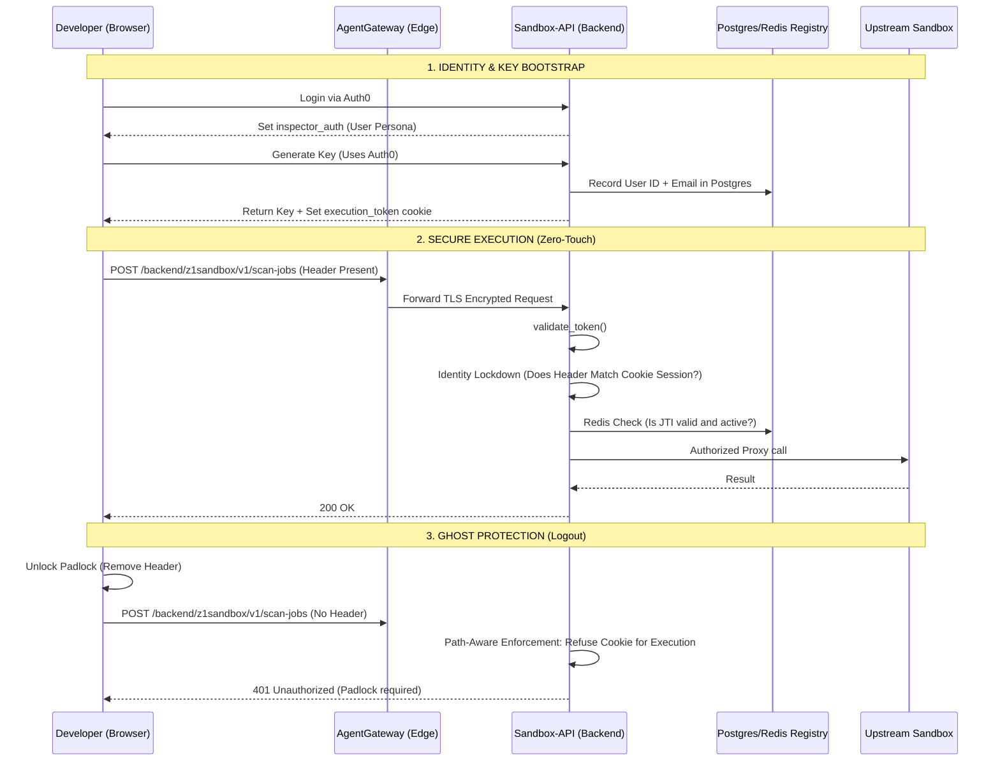

# Technical Documentation: Zero-Touch API Key & Identity Lifecycle

This document defines the high-security architecture for self-service API key management, identity bridge implementation, and cross-user protection within the CodeInspector platform.

## 1. The Multi-Phase Authentication Journey
The system implements a "Zero-Touch" flow that translates high-level management identity (Auth0) into granular, high-performance execution rights (RS256 API Keys).

### Phase 1: Identity Establishment (Auth0)
1.  **Authentication**: Users log into the Dashboard via Auth0 over an encrypted HTTPS tunnel.
2.  **Session Token**: Auth0 issues an RS256 JWT. This is stored in the browser as the `inspector_auth` cookie.
3.  **Role**: This token proves **who** the user is (`sub`) but is strictly prohibited from triggering code execution on the backends.

### Phase 2: Key Generation & Persistent Registry
1.  **Generation**: Using the Auth0 session, the user generates a Developer API Key.
2.  **Registration**: The backend verifies the Auth0 identity and creates a record in the **PostgreSQL Central Registry**.
3.  **Audit Trail**: The record is permanently bound to the user's `user_id` and `user_email`.
4.  **Instant Sync**: The Dashboard immediately synchronizes this new key to the browser's `execution_token` cookie for zero-touch documentation access.

### Phase 3: Secure Transport (AgentGateway)
1.  **Encrypted Path**: All requests flow through the **AgentGateway** at the cluster edge.
2.  **Credential Pass-Through**: The gateway acts as a transparent, high-performance pipe, forwarding all `Authorization` headers and `Cookies` directly to the backend sentry (`validate_token`).

### Phase 4: The Identity Bridge & Lockdown (Backend)
The backend sentry performs the final, hardened validation:
1.  **Execution Firewall**: For all execution routes (`/v1/run`, `/backend/z1sandbox/v1/scan-jobs`), the system **ignores cookies** and demands an explicit `Authorization` header. This prevents "Ghost Authorization" when the UI padlock is unlocked.
2.  **Identity Lockdown**: If a browser session exists, the system verifies that the claimant is the **actual owner** of the key. If User B attempts to use User A's API key, the request is blocked with a `403 Forbidden` identity mismatch.
3.  **Real-time Verification**: The Key ID (`jti`) is verified against the **Redis Distributed Allowlist** at line-rate speed.

### Phase 5: Managed Pre-Authorization
1.  **Automated Lock**: The backend renders the Swagger UI with an auto-authorization script.
2.  **Zero-Touch**: The script reads the session cookie and programmatically locks the green padlock, ensuring the user is ready to execute immediately.

## 2. Security Enforcement Grid

| Protocol | Strategy | Enforcement Layer |
| :--- | :--- | :--- |
| **Integrity** | RS256 Asymmetric Signing | Cryptographic Check |
| **Revocation** | Redis Global Set (JTI Kill-switch) | Distributed Registry |
| **Isolation** | Identity Lockdown (sub-matching) | Cross-User Protection |
| **Execution** | Mandatory Authorization Header | Path-Aware Enforcement |
| **Scoping** | Backend-specific JWT Claims | Resource Control |

## 3. End-to-End Architecture Diagram

## 4. Technical Component Breakdown
1.  **Central Registry (Postgres)**: The single source of truth for key ownership and lifecycle.
2.  **Line-Rate Cache (Redis)**: Enables sub-millisecond validation and cluster-wide revocation.
3.  **Identity Bridge**: Middleware that ensures users only use keys they own.
4.  **AgentGateway**: The high-performance entry point for the entire secure ecosystem.

---
*Last Updated: April 2026 (Version 3.0 - Identity-Locked Architecture)*
