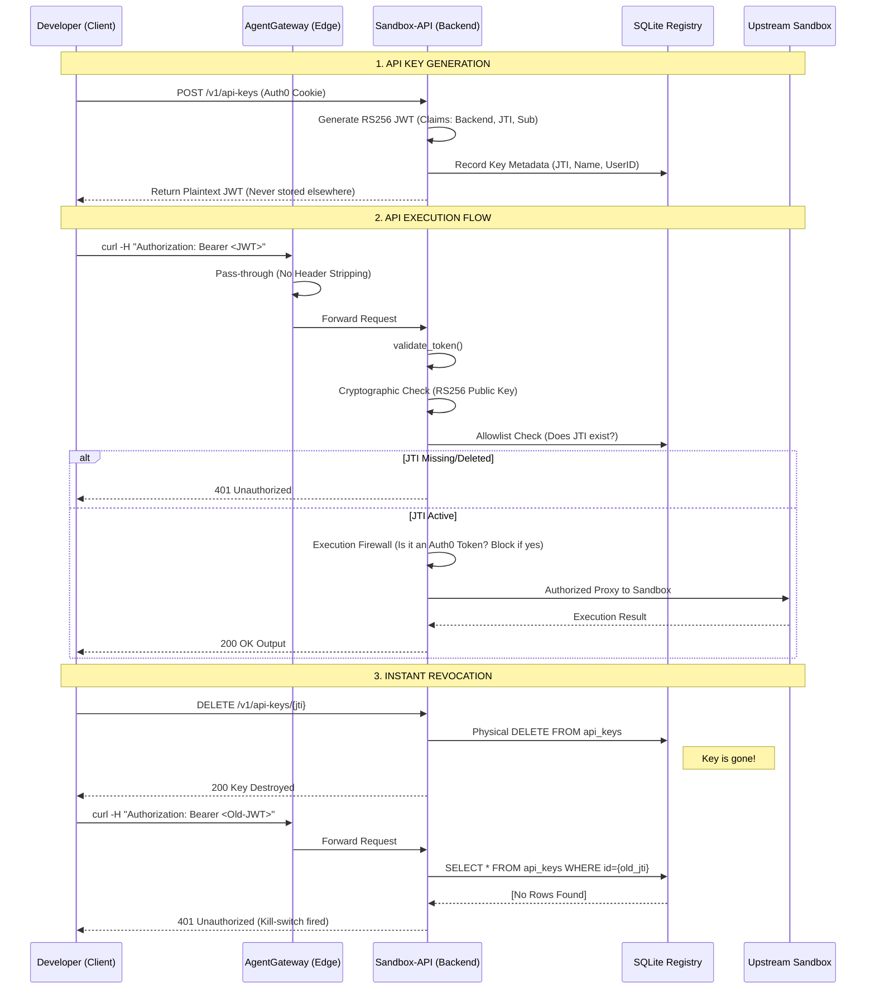

# Technical Documentation: API Key Generation & Authentication

This document outlines the technical implementation of the self-service API key management system used in the CodeInspector platform.

## 1. Generation Process
The API key generation is triggered via the developer dashboard and handled by the `POST /v1/api-keys` endpoint.

### Flow Breakdown:
1.  **Request**: The frontend sends a request containing the key `name`, `target_backend`, and `ttl_hours`.
2.  **Identity Verification**: The backend verifies the user's active Auth0 session via a `Bearer` token or browser cookie. The user's unique identity (`sub`) is extracted.
3.  **Payload Creation**: A JSON payload is constructed with the following standard and custom claims:
    *   `sub`: The Auth0 User ID.
    *   `iat`: Issued At (current UTC timestamp).
    *   `exp`: Expiration (current timestamp + selected TTL).
    *   `iss`: `code-inspector` (Issuer ID).
    *   `aud`: `code-inspector-api` (Audience ID).
    *   `jti`: A unique UUID v4 (JWT ID) used for tracking and revocation.
    *   `backend`: The designated backend scope (e.g., `Z1_SANDBOX`).
4.  **Asymmetric Signing**: The payload is signed using the **RS256** algorithm:
    *   **Private Key**: Used by the backend to sign the token.
    *   **Header**: Includes a `kid` (Key ID) used by consumers to identify the correct public key for verification.
5.  **Persistence**: The key metadata (Name, Prefix, Expiry, UserID, JTI) is saved to a SQLite database. The full signed JWT is returned to the user **once** and is never stored on the server.

## 2. Authentication Context
When an API key is presented in a request:

### Layer 1: Cryptographic Validation
The **AgentGateway** and Backend use the **Public JWKS** (JSON Web Key Set) to verify the signature. This ensures the key was created by our system and hasn't been modified.

### Layer 2: Lifecycle Management (Active Registry)
The system verifies the `jti` claim against the **Active Registry** (Allowlist). 
- If the `jti` is missing from the database, it is considered **deleted or deactivated** and rejected.
- If the `jti` exists but is marked as `is_revoked`, it is rejected.
- This ensures that mere cryptographic validity is insufficient for access; the key must be actively registered in the live database.

### Layer 3: Backend Scoping
The backend enforces the `backend` claim. If a key is scoped to `Z1_SANDBOX`, any attempt to access unauthorized backend paths will result in a `403 Forbidden`.

### Layer 4: Session Alignment
For browser-based sessions, the backend compares the `sub` claim of the API key with the `sub` claim of the active Auth0 cookie. This prevents "Key Leaking" where a user might attempt to use another developer's leaked key within their own session.

## 3. AgentGateway Enforcement
Before any request reaches the application backend, it is intercepted and validated at the edge by the **AgentGateway**.

### Edge Validation Logic:
- **Traffic Interception**: The Gateway targets the `HTTPRoute` for all API traffic using an `AgentgatewayPolicy`.
- **Pure Pass-Through**: To prevent header stripping and ensure data integrity, the Gateway is configured as a transparent pass-through. It directs the raw `Authorization` headers and `Cookies` directly to the backend for unified processing.
- **Identity Forwarding**: Successfully routed traffic is forwarded to the backend, enabling a "Defense in Depth" strategy where the backend manages granular database verification.

## 4. Hardened Security: Zero-Touch Revocation
To solve the "Ghost Access" issue (where revoked keys appeared to still function), the system was hardened with the following architecture:

### The "Execution Firewall"
To prevent Auth0 dashboard sessions (cookies) from inadvertently bypassing API key security, a hard firewall was implemented:
1. **Scope Restriction**: Auth0 session tokens (`issuer: auth0.com`) are strictly prohibited from hitting proxy execution paths like `/backend/z1sandbox/*` or `/v1/run`.
2. **Mandatory API Keys**: For code execution or backend interaction, the user **must** supply a generated internal API Key (`issuer: code-inspector`). This ensures that revoking or deleting the key results in immediate loss of execution capability, regardless of whether the user is still logged into the dashboard.

### Physical Deletion Protocol
Unlike traditional "Soft Deletes," the revocation process now uses a **Physical Deletion Protocol**:
1. **Database Purge**: When a key is revoked via the dashboard, its record is **permanently deleted** from the SQLite database.
2. **Instant Kill-Switch**: The backend validation logic uses an "Allowlist" model. Because the key record no longer exists in the registry, the next incoming request with that JWT is rejected with a `401 Unauthorized` within milliseconds of the deletion command.

### Solving Header Stripping (Gateway Fix)
We identified that CEL (Common Expression Language) transformations at the Gateway level were occasionally stripping the `Authorization` header due to case-sensitivity mismatches or complex evaluation logic.
- **Solution**: Removed native Envoy JWT transformations. 
## 5. End-to-End Architecture
The following diagram illustrates the complete lifecycle of a Developer API Key, from generation to instant revocation.

## 6. High-Scale Persistence (Production Architecture)
To support environments with **1,000+ users** and high-concurrency demands, the system transitions from local isolated storage to a distributed persistence model.

### 6.1 Centralized Metadata Registry (PostgreSQL)
- **Role**: Serves as the "Single Source of Truth."
- **Function**: Stores full key metadata including ownership (`user_id`), creation timestamps, and backend scopes. 
- **Benefit**: Ensures that API key data survives pod restarts and remains consistent across an unlimited number of horizontally scaled API instances.

### 6.2 Distributed Allowlist Cache (Redis)
- **Role**: Provides line-rate validation at sub-millisecond speeds.
- **Function**: Maintains a high-speed **Set** of all active `jti` IDs (the `active_api_keys` set).
- **Process**:
    1.  **Sync**: On startup, every API pod synchronizes with Redis to ensure its local state matches the cluster state.
    2.  **Validation**: Every incoming request triggers a `SISMEMBER` check against Redis. This replaces slow disk-based database lookups with ultra-fast memory lookups.
    3.  **Revocation**: When a key is deleted, the backend performs a synchronous `SREM` (Set Remove) in Redis. This ensures the key is blocked **globally** across all pods within milliseconds.

### 6.3 Horizontal Scalability
Because the security state is decoupled from the compute pods:
- You can scale the `sandbox-api` deployment to `N` replicas.
- Any pod can fulfill any request because they all share the same **Redistributed Allowlist**.
- There is zero "Session Stickiness" required at the Gateway level, simplifying the network architecture.

---

### Technical Component Breakdown (Scaled):

1.  **The Token (The ID Badge)**: Signed RS256 JWT containing scoped claims and a unique `jti`.
2.  **The Registry (PostgreSQL)**: The persistent guest list that survives hardware failures.
3.  **The Cache (Redis)**: The "Instant Lookup" table that ensures verification doesn't slow down the system.
4.  **The Gateway (AgentGateway)**: The high-performance entry point that acts as a pure pass-through for signed credentials.
5.  **The Firewall (Backend)**: The final sentry that combines cryptographic validation with the real-time Redis Allowlist check.

---
*Last Updated: April 2026*
