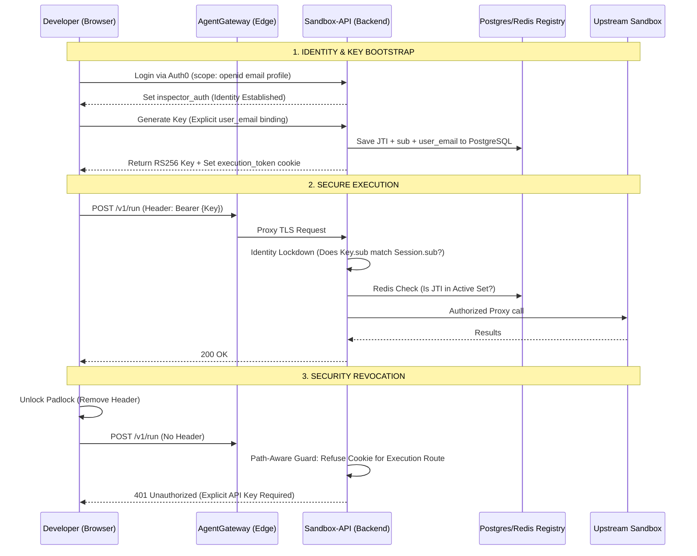

# Technical Documentation: Zero-Touch API & Identity Lockdown Architecture

This document defines the high-security architecture for self-service API key management, identity bridge implementation, and cross-user isolation within the CodeInspector platform.

---

## 1. The Zero-Touch Identity Lifecycle
The system implements a seamless authentication journey that translates high-level management identity (Auth0) into granular, high-performance execution rights (RS256 JWTs).

### Phase 1: Identity Establishment (Auth0)
*   **Protocol**: OpenID Connect (OIDC).
*   **Implementation**: Users log into the Dashboard via the Auth0 Security SDK.
*   **Result**: An `inspector_auth` session cookie is issued. This token represents the user's management persona but is strictly restricted from code execution.

### Phase 2: Key Generation & Registry Binding
*   **Operation**: The user generates a Developer API Key via the Dashboard.
*   **Registry**: The backend sentry verifies the Auth0 session and records the key metadata in the **PostgreSQL Central Registry**.
*   **Audit Trail**: Every key is physically bound to the user's `user_id` (Auth0 `sub`) and `user_email`.
*   **Instant Sync**: The Dashboard programmatically synchronizes the new key to the browser's `execution_token` cookie for zero-touch onboarding.

### Phase 3: Secure Edge Transport (AgentGateway)
*   **Role**: The AgentGateway acts as an encrypted ingress point.
*   **Policy**: It provides transparent pass-through for `Authorization` headers and `Cookies`, ensuring secondary security checks reside at the application layer (Sandbox API).

### Phase 4: Path-Aware Security Enforcement
The backend sentry (`validate_token`) enforces a strict security boundary based on the request destination:
*   **Execution Routes** (`/v1/run`, `/backend/z1sandbox/v1/scan-jobs`): These routes **MANDATORILY** require an `Authorization` header. Browser cookies are ignored to prevent "Ghost Authorization" when the UI padlock is unlocked.
*   **Management Routes** (`/docs`, `/v1/api-keys`): These allow cookie-based fallback to maintain a smooth dashboard experience without constant re-authentication.

### Phase 5: Managed Swagger UI Authorization
*   **Automation**: The backend injects a pre-authorization script into the Swagger UI docs.
*   **Synchronization**: The script reads the `execution_token` and automatically "locks" the green padlock, ensuring the user is ready to execute immediately.

---

## 2. Cross-User Isolation (Identity Path Alignment)
To prevent User A from accessing User B's resources (Key Hijacking), the system enforces **Identity Path Alignment**:

1.  **Identity Extraction**: The sentry decodes both the API Key (header) and the Auth0 Session (cookie).
2.  **Lockdown Check**: It performs a mandatory equality check: `apikey.sub == session.sub`. 
3.  **Enforcement**: If User B attempts to use User A's API Key while logged into their own dashboard, the system detects the identity mismatch and issues a `403 Forbidden` response.

---

## 3. Distributed Registry & Real-Time Revocation
The platform ensures high-scale, sub-millisecond security enforcement using a dual-layer registry:

*   **Postgres (Consistency)**: Stores the permanent audit trail and ownership records.
*   **Redis (Performance)**: Maintains an "Active Key Registry" (jti set). During every request, the backend performs a line-rate check against Redis.
*   **Kill Switch**: If a key is revoked in the Dashboard, its ID is instantly purged from Redis, terminating all active sessions for that key cluster-wide within milliseconds.

---

## 4. Security Enforcement Matrix

| Strategy | Technical Mechanism | Primary Defense |
| :--- | :--- | :--- |
| **Integrity** | RS256 Asymmetric Signing | Cryptographic Forgery |
| **Revocation** | Redis Global Kill-Switch | Compromised Token Usage |
| **Isolation** | Identity Path Alignment (`sub` match) | Cross-User Key Hijacking |
| **Execution** | Mandatory Authorization Header | Ghost/Cookie Authorization |
| **Lifecycle** | Automated Swagger UID Sync | UX friction & Deadlocks |

---

## 5. End-to-End Architecture Flow

---
*Last Updated: April 2026 (Version 4.0 - Optimized Identity Architecture)*
