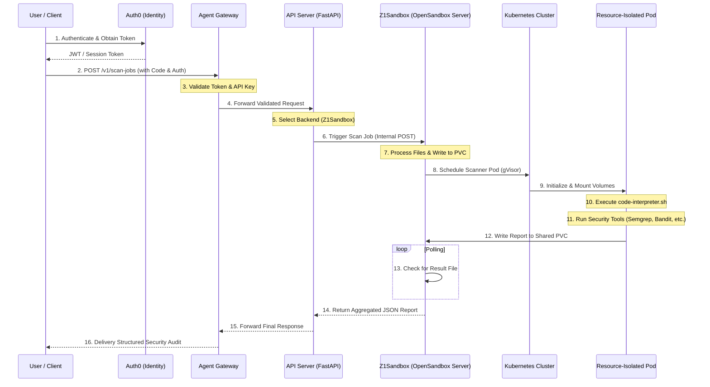

# CodeInspector End-to-End System Flow

This document details the complete request lifecycle and technical processes involved in executing a security scan job, from user authentication to the final report delivery.

## System Architecture Flow

The following diagram illustrates how a scan request travels through the various layers of the CodeInspector platform.

## Detailed Process Breakdown

### 1. Authentication (Auth0)
The user first authenticates through the Auth0 login flow. For browser-based clients, this results in a secure HTTP-only cookie containing a JWT. For CLI/API clients, a Bearer token or a custom `X-API-Key` is used.

### 2. Traffic Entry (Agent Gateway)
The `Agent Gateway` (implemented via Kubernetes Gateway API and Envoy) acts as the secure entry point.
- **TLS Termination**: Handles secure HTTPS connections.
- **Authentication Enforcement**: Rejects any request without a valid token or API key.
- **Routing**: Routes traffic destined for `/backend/z1sandbox/*` to the internal API Server.

### 3. Orchestration Layer (API Server)
The FastAPI server acts as a management layer that speaks the "Language of the Sandbox."
- **Validation**: Ensures the request body matches the expected schema (`ScanJobRequest`).
- **Backend Resolution**: Identifies which execution cluster should handle the job.
- **Request Proxying**: Forwards the scan request to the internal OpenSandbox service with a long timeout (300s) to allow for complete analysis.

### 4. Sandbox Management (Z1Sandbox API)
The `Z1Sandbox API` (OpenSandbox Server) handles the Kubernetes-native lifecycle:
- **File Decoding**: If code is sent as base64, it is decoded and placed into a workspace directory.
- **Storage Management**: Files are written to a `PersistentVolumeClaim` (PVC) shared between the API and the soon-to-be-scheduled Pod.
- **Pod Scheduling**: Orchestrates the creation of a gVisor-hardened Pod using the `code-interpreter` image.

### 5. Execution & Scanning (Scanner Pod)
The Pod starts and executes the client's code while simultaneously running a suite of security tools:
- **Static Analysis**: Tools like `Semgrep` and `Bandit` analyze source code patterns.
- **Secret Detection**: `Gitleaks` scans for hardcoded credentials.
- **Infrastructure Audit**: `Kube-linter` and `Kubeconform` validate Kubernetes manifests.
- **Result Aggregation**: All findings are written to `/reports/security_scan_report.json`.

### 6. Synchronous Delivery
To provide a seamless experience, the **Z1Sandbox API** blocks (non-blocking async wait) until the report file appears on the PVC. Once detected:
- The report is ingested and transformed into a unified JSON format.
- The response travels back through the API Server and Gateway.
- The user receives the full structured audit result in a single HTTP transaction.
