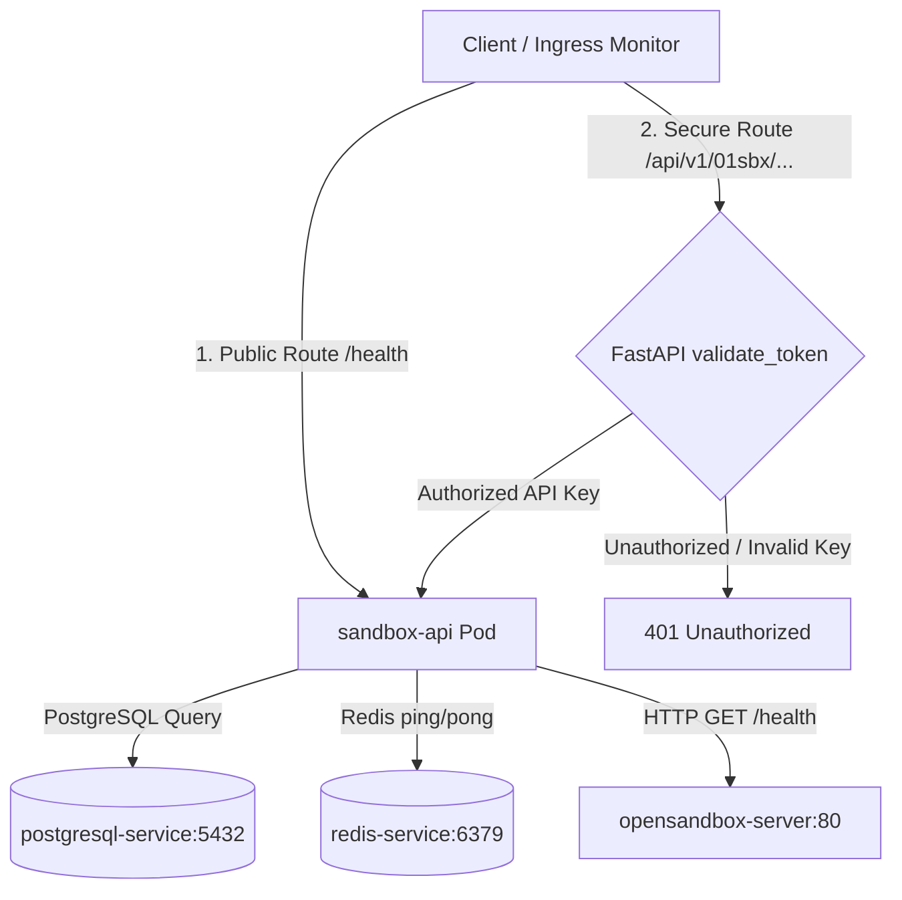
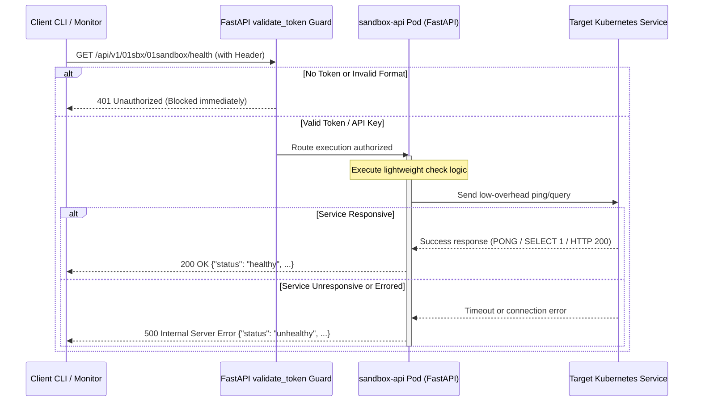

# Technical Specification: Dependency Health Checking Architecture

This document specifies the design, technical execution flow, and security layers of the health monitoring suite implemented inside the 01 Sandbox API Gateway/Server.

---

## 1. Architectural Overview

The health checking subsystem provides a modular, lightweight, and production-safe validation pipeline. It ensures all critical dependencies in the `opensandbox-system` namespace are actively monitored without generating artificial load or risking connection pooling issues.



### Modular Architecture Design

To maintain high code quality and strict separation of concerns, all health checks are encapsulated inside a standalone, dedicated [health.py](file:///home/berrybytes/Desktop/01-Sandbox/apiServer/fastapi/health.py) module. 

The main application in [codeinspectior_api.py](file:///home/berrybytes/Desktop/01-Sandbox/apiServer/fastapi/codeinspectior_api.py) imports and mounts these routes dynamically using the **Router Factory Pattern**:

```python
from health import get_health_router
app.include_router(get_health_router(state, validate_token))
```

This pattern injects global dependencies (the `state` and the `validate_token` security guard) into the routing namespace without importing the main app file directly inside the module, completely avoiding circular dependencies. 

The core connection logic for each backend service is extracted into isolated helpers:
*   `check_postgresql_health(state)`: Connects and issues a lightweight SQL ping to PostgreSQL.
*   `check_redis_health(state)`: Pings the active Redis cache/queue connection.
*   `check_opensandbox_server_health(state)`: Verifies the upstream OpenSandbox server responds correctly.

These helpers are shared between the aggregate endpoints (`/health` and `/v1/health`) and the secure individual endpoints (`/api/v1/01sbx/...`), guaranteeing identical connection logic and status reports.

---

## 2. Health Endpoint Specifications

### A. Aggregate Checks (Liveness & Readiness Probes)
*   **Public Route**: `/health`
    *   **External Production URL**: `https://sandbox.01security.com/health` (resolved externally via proxy/routing)
    *   **Internal Gateway URL**: `https://api-sandbox.01security.com/health` (direct cluster route)
*   **Protected Route**: `/v1/health`
    *   **External Production URL**: `https://sandbox.01security.com/v1/health`
    *   **Internal Gateway URL**: `https://api-sandbox.01security.com/v1/health` (requires Authorization JWT header)
*   **Behavior**: Evaluates all dependencies sequentially. If any dependency is offline, the endpoint returns `500 Internal Server Error` and sets the global state to `unhealthy`.

### B. Secured Individual Sub-Dependency Checks
*   **Required Header**: `Authorization: Bearer <DEVELOPER_API_KEY>`
*   **Endpoints**:
    *   **PostgreSQL**: `GET /api/v1/01sbx/postgresql/health`
        *   **External Production URL**: `https://sandbox.01security.com/api/v1/01sbx/postgresql/health`
        *   **Internal Gateway URL**: `https://api-sandbox.01security.com/api/v1/01sbx/postgresql/health`
    *   **Redis (Cache & Queue)**: `GET /api/v1/01sbx/redis/health`
        *   **External Production URL**: `https://sandbox.01security.com/api/v1/01sbx/redis/health`
        *   **Internal Gateway URL**: `https://api-sandbox.01security.com/api/v1/01sbx/redis/health`
    *   **01Sandbox Core Engine**: `GET /api/v1/01sbx/01sandbox/health`
        *   **External Production URL**: `https://sandbox.01security.com/api/v1/01sbx/01sandbox/health`
        *   **Internal Gateway URL**: `https://api-sandbox.01security.com/api/v1/01sbx/01sandbox/health`

---

## 3. Step-by-Step Technical Flow

### A. PostgreSQL Dependency Validation
1.  **Connection**: The API Server opens a database connection session using the configured connection pool details (`PG_HOST: postgresql-service`).
2.  **Execution**: It executes a lightweight, read-only validation statement:
    ```sql
    SELECT 1;
    ```
3.  **Clean up**: It immediately closes the cursor and releases the connection session back to the pool to prevent thread/socket exhaustion.
4.  **Error Handling**: If the database is locked, out of disk space, or offline, the driver throws a connection exception. The API Server catches this exception, marks the dependency state to `"unhealthy"`, and forwards the specific database driver error string in the `"details"` field.

---

### B. Redis Cache & Queue Validation
1.  **Connection**: The API Server references the shared connection client (`state.redis_client`).
2.  **Ping Command**: It issues a low-overhead network check:
    ```python
    state.redis_client.ping()
    ```
3.  **Evaluation**: 
    *   If Redis replies with a literal **`PONG`**, the check passes as `"healthy"`.
    *   If the request times out or throws an error (e.g. connection refused or Out Of Memory state), the check is marked `"unhealthy"`.

---

### C. 01Sandbox Core Engine Validation
1.  **Network Request**: The API Server issues a synchronous HTTP GET request targeting the upstream service's liveness endpoint:
    ```
    GET http://opensandbox-server.opensandbox-system.svc.cluster.local/health
    ```
2.  **Timeout Guard**: The request is configured with a tight **3-second timeout limit** (`timeout=3`) using the `httpx` client. This ensures that a frozen or sluggish upstream runner cannot hang the API Server's threads.
3.  **Status Code Check**: If the core engine returns an HTTP status code `< 500` within 3 seconds, it is marked `"healthy"`. Otherwise, it falls back to `"unhealthy"`.

---

## 4. Sequence & Security Execution Flow

When a client queries one of the individual endpoints, the following step-by-step process is executed:   



## 5. Kubernetes Cluster Integration (How the Server Sees and Acts on Health Statuses)

Within your RKE2 cluster, the local **`kubelet`** agent on each node uses our `/health` endpoint to drive self-healing and load balancing. Kubernetes interacts with the API through **three automated Probes** defined inside your deployment configuration:

### A. The Liveness Probe (Self-Healing / Auto-Restart)
*   **Purpose**: Determines if the API Server pod is stuck, deadlocked, or running in an unrecoverable state.
*   **Polling Frequency**: Every 15 seconds.
*   **Server Logic**:
    *   If `/health` returns **`200 OK`**, the `kubelet` does nothing.
    *   If a critical service goes offline and returns **`500 Internal Server Error`** (or times out) three consecutive times:
*   **Automated Action**: The Kubernetes control plane **instantly kills the faulty pod and provisions a fresh, running container instance** automatically.

### B. The Readiness Probe (Traffic Control)
*   **Purpose**: Validates if the pod is ready to serve live incoming user requests (e.g. running scripts, scanning code).
*   **Polling Frequency**: Every 10 seconds.
*   **Server Logic**:
    *   If `/health` returns **`200 OK`**, the pod is marked as healthy in the load balancer backend pool.
    *   If `/health` returns **`500 Internal Server Error`**:
*   **Automated Action**: The Kubernetes proxy **instantly removes the unhealthy pod from the load balancer pool**. User requests are routed only to other healthy instances, ensuring zero-downtime client operations even when internal services are recovering.

### C. The Startup Probe (Boot Protection)
*   **Purpose**: Guards the container during its initial boot sequence (e.g., establishing database pools or initializing Redis).
*   **Automated Action**: Temporarily disables liveness and readiness probe evaluations until the container finishes booting up and returns its first successful `200 OK`, protecting the starting pod from being terminated prematurely.

---

## 6. Operations & Monitoring Best Practices

1.  **Deployment Configuration Reference**:
    Ensure the following configuration block is matched in [deployment.yaml](file:///home/berrybytes/Desktop/01-Sandbox/codeInspector/charts/apiServer/templates/deployment.yaml#L80-L103):
    ```yaml
              livenessProbe:
                httpGet:
                  path: /health
                  port: 8000
                initialDelaySeconds: 10
                periodSeconds: 15
                timeoutSeconds: 5
                failureThreshold: 3

              readinessProbe:
                httpGet:
                  path: /health
                  port: 8000
                initialDelaySeconds: 5
                periodSeconds: 10
                timeoutSeconds: 3
                failureThreshold: 3
    ```
2.  **External Monitoring Alerts**:
    *   **Aggregate Probe**: Point external status checkers (e.g., UptimeRobot, Prometheus Blackbox) to the backend aggregate route `https://api-sandbox.01security.com/health` to monitor high-level availability.
    *   **Service-Level Probes**: Map alerts from secure endpoints (like `https://api-sandbox.01security.com/api/v1/01sbx/postgresql/health`) directly to your engineering notification systems (Slack, PagerDuty) to pinpoint precisely which microservice went offline.

---

## 7. Troubleshooting: Frontend vs. Backend Routing

When interacting with the health suites via a browser, you may experience a **"404 Oops! Page not found"** error. This section explains why this occurs and how to configure cross-routing properly.

### Why typing `sandbox.01security.com/health` in Chrome displays a 404 Page

1.  **Frontend React Client**: `sandbox.01security.com` hosts your external **React/Vite Website (SPA)**. When a user navigates to `/health` directly in the browser address bar, the frontend React Router attempts to capture the path client-side. Since there is no physical page corresponding to `/health` in your frontend routing, the React client displays its own custom frontend 404 page.
2.  **FastAPI Backend Domain**: The actual API server is exposed on the dedicated cluster domain **`api-sandbox.01security.com`**. Hitting the URL `https://api-sandbox.01security.com/health` queries the API server directly, returning the expected JSON payload.

### How to configure `sandbox.01security.com/health` to proxy to the health checks

If you want the production user-facing domain to serve the JSON health check or display a health status, choose one of the following methods:

#### Method A: Custom External Proxy (Nginx / Cloudflare Pages / Vercel Redirects)
If your frontend `sandbox.01security.com` is hosted on a custom web server, add a proxy rewrite or a redirect rule forwarding `/health` requests upstream to the cluster API:
*   **Nginx Proxy Rule (for custom frontend servers)**:
    ```nginx
    location /health {
        proxy_pass https://api-sandbox.01security.com/health;
        proxy_set_header Host $host;
    }
    ```
*   **Cloudflare Rules**: Create a redirect rule mapping `sandbox.01security.com/health` -> `https://api-sandbox.01security.com/health`.

#### Method B: React Frontend Status Page (⭐ FULLY IMPLEMENTED)
We have implemented a premium, high-fidelity real-time status dashboard under the `/health` route in the website frontend:
*   **Component File**: [Health.tsx](file:///home/berrybytes/Desktop/01-Sandbox/z1sandbox-website/src/pages/Health.tsx)
*   **Route Registration**: [App.tsx](file:///home/berrybytes/Desktop/01-Sandbox/z1sandbox-website/src/App.tsx)

**Features of the Status Dashboard**:
1.  **State-of-the-Art Design**: Combines dark-mode friendly card grids with glowing indicator rings for active pings and smooth borders that transition HSL color states dynamically.
2.  **Lucide Icons**: Integrates intuitive visual helpers for each dependency (e.g. Database for PostgreSQL, Zap for Redis Cache, Server for queues, and CPU for OpenSandbox).
3.  **Framer Motion Transitions**: Uses liquid-smooth slide and scale-fade micro-animations to shift between loading, success, and error states.
4.  **Auto-Refresh Engine**: Polls `https://api-sandbox.01security.com/health` every 30 seconds to keep metrics completely in sync, including a manual rotating "Refresh" trigger.
5.  **Fail-Safe Connection Handler**: If CORS or network firewalls block direct connection, it gracefully switches to an explanatory error state offering a copy-to-clipboard handler for the cluster API.
