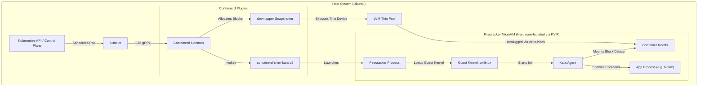

# Technical Deep Dive: Kata Containers + Firecracker on Kubernetes (RKE2)

This document provides a comprehensive technical guide on the architecture, mechanics, configuration, and verification of **Kata Containers** using the **Firecracker** hypervisor.

---

## 1. Architecture of Kata Containers + Firecracker

Unlike standard container runtimes (like `runc`) that rely on shared host kernel namespaces and cgroups, Kata Containers boots a dedicated lightweight Virtual Machine (MicroVM) for each Kubernetes Pod.

### Component Diagram



### Detailed Flow of Execution

Here is what each piece is actually doing, in the order they get invoked when a Pod is provisioned:

1. **Kubernetes API / Control Plane:**
   This is where the desired state lives — someone applies a pod spec with `runtimeClassName: kata-fc`. The API server persists that intent and the scheduler picks a node; it doesn't touch the VM machinery at all, it just decides where the pod should land.
2. **Kubelet:**
   Runs on the chosen node and is the thing that actually turns "a pod should exist here" into action. It doesn't create containers itself — it talks to `containerd` over the Container Runtime Interface (CRI), a gRPC API, asking it to create a sandbox and container using the `kata-fc` handler specified in the pod spec.
3. **Containerd Daemon:**
   The general-purpose container engine. Normally it would hand off to `runc` to build namespaces and cgroups directly on the host kernel. Because the runtime class says `kata-fc`, it instead spawns a different shim binary entirely — this is the fork in the road between a normal pod and a Kata pod.
4. **`containerd-shim-kata-v2`:**
   This is the long-running host-side process that manages the whole lifecycle of the microVM. It's the only thing standing between Kubernetes and the VM — kubelet can't see inside the VM's virtual hardware boundary, so when Kubernetes asks "is this container healthy," it's really asking the shim, which relays that question to the `kata-agent` running inside the guest and passes the answer back. It also reads `/etc/kata-containers/configuration.toml` to know which Firecracker binary, kernel, and rootfs image to use, and how many vCPUs/how much RAM to allocate.
5. **`devmapper` Snapshotter:**
   Handles storage on the host side, in parallel with the shim spawning. It takes the pulled container image layers and creates a copy-on-write block device snapshot from the LVM thin pool, then exposes that as a device node the shim can pass into the VM. This is why Kata needs `devmapper` specifically rather than the more common `overlayfs` snapshotter — the VM needs an actual block device to attach, not a filesystem overlay.
6. **LVM Thin Pool:**
   The physical backing storage `devmapper` draws from. It's a thinly-provisioned pool, meaning space is allocated on demand rather than reserved up front per container, which keeps storage overhead low across many pods.
7. **Jailer:**
   Runs before Firecracker even starts. Since Firecracker itself is just a regular host process, a VM-escape bug in it would hand an attacker the privileges of that process. The jailer locks Firecracker into a `chroot`, drops root privileges, and applies its own `cgroups` and namespaces restrictions — so even a successful escape from the VM lands the attacker in a locked-down cell on the host, not a general-purpose shell.
8. **Firecracker Process (the VMM):**
   The actual hypervisor. It talks straight to `/dev/kvm` to create virtual CPUs and memory for the microVM and expose minimal virtio devices (block, network, serial) — nothing more elaborate than that. It has zero awareness of Kubernetes, container images, or Nginx; it only knows how to boot a small virtual machine from a kernel path and a rootfs image path that the shim hands it.
9. **Guest Kernel (`vmlinux`):**
   A stripped-down Linux kernel built specifically for fast boot — most unnecessary drivers are removed, which is how boot gets down to roughly 10–30ms. It's a genuinely separate kernel from the host's, which is the core of the security claim: a Kata pod's `uname -r` reports the guest kernel version, not the host's.
10. **Kata Agent:**
    The first process the guest kernel starts (its `init`). It's the counterpart to the shim — everything the shim wants done inside the VM (mount this device, start this process, report this status) goes through the agent over a virtual serial/vsock channel. It has no visibility into anything outside the VM.
11. **Rootfs (virtio-block hotplug):**
    Once the guest is up, the block device snapshot `devmapper` created on the host gets hot-plugged into the running VM as a `virtio-block` device (using `virtio-mmio` rather than PCI, since Firecracker doesn't emulate a PCI bus). The `kata-agent` mounts it as the container's root filesystem.
12. **Networking (tap device + tc rules):**
    Alongside storage, a host-side `tap` network device is hot-plugged into the VM, and `tc` (traffic control) rules redirect packets from the host network namespace into that tap, effectively bridging the VM into whatever SDN the cluster is using (e.g., Cilium) so the pod gets normal Kubernetes networking despite living behind a hardware boundary.
13. **App Process (e.g. Nginx):**
    The `kata-agent` finally spawns the actual container process inside the guest's own process namespace. From inside, `ps aux` shows only that process and the agent — none of the host's or other pods' processes are visible, since there's no shared kernel to see them through.

**The Net Effect:** Everything up through the shim is a normal, inspectable host process; everything from Firecracker onward is walled off behind actual hardware virtualization rather than software isolation, which is the whole point relative to `runc`.
---

## 2. Core Concepts & Analogies

If you are new to hardware virtualization and container shims, these concepts can be confusing. Here is a simplified breakdown using the analogy of a **Capsule Hotel**:

*   **Traditional Containers (e.g. Docker/runc):** Like a **Shared Co-working Space**. Everyone sits at different desks in the same room. You use lightweight room dividers (Namespaces) and set rules about who can drink the coffee (Cgroups). It is fast and cheap, but if one tenant starts a fire or screams, everyone is disrupted.
*   **Traditional Virtual Machines (e.g. VMware/QEMU):** Like building **entirely separate brick houses**. Each guest gets their own plumbing, foundation, and heating system. It is extremely secure, but building a house takes a long time (slow boot) and takes up a massive amount of physical land (high memory/disk overhead).
*   **Kata Containers + Firecracker MicroVMs:** Like a **Capsule Hotel**. You build small, barebones pre-fabricated steel capsules inside a warehouse. They are tiny and inflate in milliseconds (Firecracker), but they have solid steel walls (hardware KVM isolation) so guests cannot interfere with one another.

### A. Runtime vs. Hypervisor

*   **The Hypervisor (Firecracker):** *The Capsule Builder.*
    *   **What it does:** It interacts directly with the host's CPU and RAM (via KVM) to build and power the virtual hardware container (the MicroVM). It knows nothing about Kubernetes, Docker, or container images—it only knows how to boot virtual CPUs and allocate memory.
*   **The Runtime (Kata Containers):** *The Hotel Manager.*
    *   **What it does:** Kubernetes does not speak virtual machine language. It only speaks container language (e.g., *"pull Nginx and run it"*). The Kata runtime acts as the translator: it receives the container request from Kubernetes, calls Firecracker to build the MicroVM, mounts the Nginx block storage device inside it, and starts it.

#### Division of VM Creation Responsibility:
*   **Kata Containers (The Coordinator/Runtime) is responsible for the *What* and *When*:**
    It is the orchestrator that receives the scheduling instruction from Kubernetes, determines that a dedicated VM boundary is required for the pod, gathers all resources (guest kernel path, LVM thin-pool block storage disk, network taps), and issues the command to launch the MicroVM.
*   **Firecracker (The Hypervisor/VMM) is responsible for the *How* (Actual VM Creation):**
    It receives the configuration instructions from Kata (such as number of vCPUs, RAM limits, kernel and storage paths) and directly calls the Linux host's Kernel-based Virtual Machine (**KVM** via `/dev/kvm`). KVM handles the hardware-level virtualization, while Firecracker manages the threads representing vCPUs and maps the host's physical memory pages into the newly constructed, hardware-isolated boundary.

### B. What is Shim Spawning?

*   **The Analogy:** *The Personal Butler.*
    *   Kubernetes expects to monitor every container directly. However, the container process (e.g., Nginx) runs inside a MicroVM, isolated behind virtual hardware walls. Kubelet (on the host) cannot see past the VM walls.
    *   To solve this, containerd spawns a host helper process called **`containerd-shim-kata-v2`** (the Shim).
    *   The Shim acts as a **Butler** standing outside the capsule door. When Kubernetes asks if the container is healthy, it asks the Butler. The Butler communicates over a virtual intercom connection with the **`kata-agent`** running inside the VM, gets the status, and passes it back to Kubernetes.

### C. What is the Jailer?

*   **The Analogy:** *The High-Security Vault.*
    *   Firecracker is a software program running on the host. If a malicious container manages to find a bug in Firecracker, they could theoretically escape the VM and take control of the Firecracker process on the host.
    *   To prevent this, the **Jailer** runs before Firecracker starts. It locks down a folder (a `chroot` jail), drops all root privileges, and restricts access to the rest of the host's files. It then spawns the Firecracker process inside this vault. Even if a hacker escapes the VM, they are trapped inside the vault on the host.

### D. Security Comparison: runc vs. gVisor vs. Firecracker

| Feature | `runc` (Standard) | `gVisor` (Sandboxed) | `Firecracker` / Kata (Virtualized) |
| :--- | :--- | :--- | :--- |
| **Isolation Level** | Software namespaces (Low) | Syscall intercept sandbox (High) | Hardware virtualization (Highest) |
| **Kernel Status** | Shared host kernel | Emulated user-space kernel | Dedicated guest kernel |
| **Performance** | Native speed (No overhead) | Slightly slower syscalls (Go emulation) | Near-native speed (KVM backed) |
| **Compatibility** | 100% (Supports all Linux apps) | Medium (Some complex system calls fail) | High (Supports standard Linux binaries) |
| **Best Used For** | Trusted, standard internal apps. | Untrusted code, multi-tenant web apps. | High-risk environments (untrusted user code). |

---

## 3. Storage & Boot Mechanics: Devmapper & Millisecond Booting

Unlike traditional containers that overlay filesystems on the host directory, or traditional VMs that emulate a full system motherboard, Kata + Firecracker optimizes storage and booting to reach near-instantaneous startup times.

### A. The devmapper Mandatory Requirement
Standard container runtimes stack directories using `overlayfs`. Since Firecracker is a minimalist hypervisor designed for maximum security, it does not support file-sharing mechanisms (like `virtio-fs` or `9p` sharing) out of the box.
Instead, it requires the container root filesystem to be presented as a raw virtual block device. The `devmapper` snapshotter translates the container's directory-based image layers into a virtual block device node on the host.

### B. Microsecond-Level Disk Cloning via LVM Thin-Pools
Creating, formatting, and copying files to a new virtual disk during pod creation would take seconds. To avoid this, `devmapper` uses thin-provisioning:
*   **Base Image Layout:** When a container image (e.g., Ubuntu/Nginx) is downloaded, it is unpacked onto a single parent virtual block device in the LVM thin-pool.
*   **Instant Clone:** When a pod is scheduled, `devmapper` instantly creates a **pointer-based copy-on-write (CoW) snapshot** of the parent device. No data is duplicated, allowing this creation to finish in microseconds.
*   **Copy-on-Write:** Any writes made by the container at runtime are written to newly allocated blocks in the thin-pool, leaving the base image untouched and read-only.

### C. The 10–30ms Deviceless Boot Mechanics
Traditional VMs take seconds or minutes to boot because they perform hardware self-tests, initialize virtual PCI buses, and load ACPI controllers. Firecracker eliminates these steps:
*   **No Virtual PCI Bus:** Firecracker lacks PCI controllers, ACPI tables, and legacy BIOS/UEFI firmware.
*   **Memory-Mapped I/O (`virtio-mmio`):** Devices (like the `devmapper` disk and the `tap` network interface) are mapped directly via MMIO, bypassing PCI scan overhead.
*   **Direct Memory Loading:** Firecracker directly injects the uncompressed guest kernel (`vmlinux.container`) into the VM's memory and sets the instruction pointer to the kernel entry point, starting execution immediately.

---

## 4. Installation: Under the Hood

When you install Firecracker and Kata Containers, the binaries and libraries occupy specific roles:

### A. Firecracker Binaries
*   `/usr/local/bin/firecracker`: The main Virtual Machine Monitor (VMM). It uses the Linux Kernel-based Virtual Machine (KVM) API to create and manage vCPUs, memory, and simple virtual devices (block, network, serial).
*   `/usr/local/bin/jailer`: A wrapper that runs Firecracker inside a secure chroot jail. It drops privileges, uses `cgroups` to restrict resources, and applies namespaces to protect the host if Firecracker itself is compromised.

### B. Kata Containers (opt/kata)
*   `kata-runtime`: The CLI tool used by administrators to query, check, and manage the Kata environment.
*   `containerd-shim-kata-v2`: The runtime engine. Instead of calling `runc` to create namespaces, Containerd calls this shim. The shim remains running on the host as a daemon, translating container management commands (start, stop, exec) into commands the `kata-agent` inside the VM understands.
*   `share/kata-containers/vmlinux.container`: A highly optimized guest Linux kernel stripped of unnecessary drivers to minimize boot times (~10–30ms).
*   `share/kata-containers/kata-containers.img`: The initial guest root filesystem image. It contains a minimal system environment (Busybox/systemd) and the `kata-agent` binary.

---

## 5. Configuring Kata with Firecracker

The configuration file `/etc/kata-containers/configuration.toml` defines how the host interacts with the guest. Key directives include:

```toml
[hypervisor.firecracker]
path = "/usr/local/bin/firecracker"
kernel = "/opt/kata/share/kata-containers/vmlinux.container"
image = "/opt/kata/share/kata-containers/kata-containers.img"
jailer_path = "/opt/kata/bin/jailer"
```

*   **`path`**: Directs the shim to the Firecracker binary.
*   **`kernel` & `image`**: Specifies the guest operating system kernel and agent system image that Firecracker boots.
*   **`jailer_path`**: Tells Kata to wrap the Firecracker process in a jailer sandbox.
*   **Resource settings** (defined further down in the file):
    ```toml
    default_vcpus = 1
    default_memory = 2048 # Allocates 2GB of host RAM to the microVM
    block_device_driver = "virtio-mmio"
    ```
    Since Firecracker does not support standard PCI buses, it uses **`virtio-mmio`** (memory-mapped IO) to attach network and block devices, drastically reducing emulation complexity.

---

## 6. Key Commands & Diagnostics

### A. `kata-runtime check`
Validates that the host meets the requirements for running Kata:
```bash
sudo kata-runtime check
```
*It verifies `/dev/kvm` permissions, checks if the CPU has virtualization extensions (`intel_has_vx` or `amd_svm`), and checks kernel module availability.*

### B. `kata-ctl env`
Prints the active environment configuration:
```bash
sudo kata-ctl env
```
*Shows the loaded config paths, paths to binaries, guest kernel command line parameters, and hypervisor details.*

### C. `dmsetup` and `lvdisplay`
Exposes the physical backing of the devmapper snapshotter:
```bash
sudo dmsetup ls
# Shows active device mapper devices on the host

sudo lvs
# Confirms the data/meta consumption of the LVM thin-pool
```

### D. `crictl` and `ctr`
Lower-level container inspection tools:
```bash
# Check the container details inside containerd's Kubernetes namespace
sudo crictl --runtime-endpoint unix:///run/k3s/containerd/containerd.sock ps

# Check the running tasks from containerd's perspective (RKE2 socket)
sudo ctr --address /run/k3s/containerd/containerd.sock -n k8s.io tasks ls
```

---

## 7. Verifying Security, Performance, and Orchestration

Here is how you can verify the value proposition of Kata Containers + Firecracker:

### A. Verify Hardware-Level Security (Kernel Isolation)

When describing a Kata pod using `kubectl describe pod kata-test`, Kubernetes will report a Container ID like `containerd://<hash>`. This is normal: Kubernetes communicates solely with the CRI (Containerd), which is responsible for routing the task. Under the hood, containerd intercepts the `kata-fc` runtime class and boots a dedicated MicroVM.

You can verify that a pod is running in a fully isolated MicroVM using the following methods:

#### 1. Host vs. Guest Kernel Verification (The Ultimate Proof)
Compare the kernel running on the host with the kernel running inside the pod.
*   **On the host node:**
    ```bash
    uname -r
    # Returns the host's kernel version (e.g., 6.8.0-134-generic)
    # This is the standard Ubuntu OS kernel running on the host server.
    ```
*   **Inside the Kata Container:**
    ```bash
    kubectl exec -it kata-test -- uname -r
    # Returns the custom guest kernel version (e.g., 6.12.28)
    # This is the lightweight, optimized guest kernel file (vmlinux.container)
    # provided by Kata Containers and booted in memory by Firecracker.
    # The file path is configured on the host in '/etc/kata-containers/configuration.toml'
    # under the [hypervisor.firecracker] -> kernel setting.
    ```
*   **Conclusion:** If the versions mismatch (e.g., `6.8.0-134-generic` vs `6.12.28`), the pod is running on its own dedicated guest kernel, completely isolated from the host operating system.

#### 2. Active Firecracker Process Verification
Check the host process space to find the active VM instance:
```bash
ps aux | grep firecracker
```
*   **Expected Output:** You will see a running `/firecracker` process with a unique `--id` and a path to its VM configuration file (e.g., `/fcConfig.json` or VM chroot location).

#### 3. Listing Active Containerd Tasks
Because RKE2 runs containerd on a custom socket, use the `--address` flag to query active tasks under the Kubernetes (`k8s.io`) namespace:
```bash
sudo ctr --address /run/k3s/containerd/containerd.sock -n k8s.io tasks ls
# Lists all running tasks including the kata shims
```

#### 4. Guest Container Process Space Check
Verify that the pod has its own distinct namespace where host-level processes are completely hidden. Inside the container, run:
```bash
kubectl exec kata-test -- ps aux
```
*   **Expected Output:** You will only see the application process (e.g., `nginx`) and the guest agent (`kata-agent`). None of the host's processes or other pods' processes will be visible, as there is no shared kernel.

### B. Verify Memory and Startup Overhead (Performance)
1. **Startup Time:**
   Check the event logs of your `kata-test` pod:
   ```bash
   kubectl describe pod kata-test
   ```
   Under `Events`, examine the time difference between `Scheduled`, `Pulling image`, and `Started container`. You will find that VM creation and guest boot take **less than 1 second**!
2. **Memory Footprint:**
   Find the active `firecracker` process on the host:
   ```bash
   ps -o pid,rss,command -C firecracker
   ```
   The `RSS` (Resident Set Size) shows the physical memory used by the hypervisor itself. It is typically **under 15-20 MB**, which is incredibly lightweight compared to traditional hypervisors (QEMU/KVM processes usually consume 100+ MB just to start).

### C. Verify Native Kubernetes Orchestration
Verify that networking works identically to normal pods:
1. **Expose the Pod:**
   ```bash
   kubectl expose pod kata-test --port=80 --target-port=80 --type=ClusterIP
   ```
2. **Test Access:**
   Launch a temporary shell pod and try to curl the service:
   ```bash
   kubectl run test-curl --rm -i --tty --image=curlimages/curl -- sh
   # Inside the pod:
   curl http://kata-test
   # Returns the default Nginx welcome page
   ```
   *This proves the `tcfilter` network bridging works perfectly, routing traffic through the Kubernetes SDN (Cilium) straight into the Firecracker MicroVM.*
