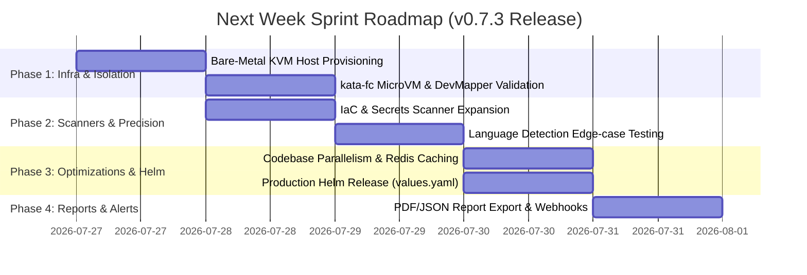
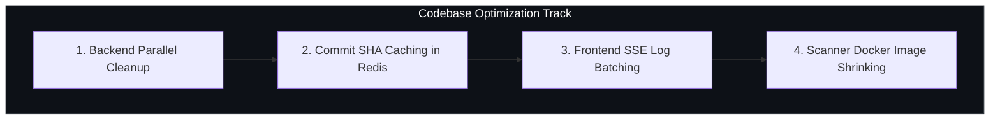

# 🚀 Milestone & Optimization Plan (Sprint Roadmap: v0.7.3 Release)

This document outlines the executive milestone goals, technical deliverables, day-by-day sprint roadmap, and codebase optimizations for the upcoming **01-Sandbox / Code Inspector (v0.7.3)** release.

---

## 📌 Milestone Goal
Successfully complete the production release of the **v0.7.3 Unified Security Scan Pipeline**, expand security scanner engines, validate multi-tenant isolation (`gvisor` & `kata-fc`), and implement performance/concurrency optimizations across the backend and frontend.

---

## 🗓️ Day-by-Day Sprint Roadmap

---

### 🟢 Phase 1: Infrastructure & Dual-Runtime Validation (Days 1 – 2)

- [ ] **OVH Dedicated / Bare-Metal KVM Migration**
  - Provision an OVH Dedicated Bare-Metal server with physical CPU VT-x/AMD-V enabled (`/dev/kvm`).
  - Set up the LVM thin-pool `devmapper` snapshotter (`ubuntu--vg-containerd--pool`) per [docs/kata-firecracker/kata-firecracker.md](file:///home/berrybytes/Desktop/Kamal/01-Sandbox/docs/kata-firecracker/kata-firecracker.md).
- [ ] **Dual-Runtime Validation Matrix**
  - Verify seamless switching between `gvisor` (for Cloud VPS) and `kata-fc` (for Bare-Metal MicroVMs) in `codeInspector/values.yaml`.
  - Validate that `autoTerminationSeconds: 0` immediately reclaims pod memory upon scan completion.

---

### 🔵 Phase 2: Scanner Engine Expansion & Language Precision (Days 2 – 3)

- [ ] **IaC & Infrastructure Scanner Expansion**
  - Integrate **Checkov** / **Terrascan** for Terraform (`.tf`, `.hcl`) and Dockerfile static analysis.
  - Route IaC findings cleanly into a new **Terraform & Infrastructure** UI section.
- [ ] **Enhanced Language Detection & Rule Customization**
  - Add tenant-customizable severity threshold filters (e.g. ignore `INFO` warnings or enforce `HIGH`/`CRITICAL` fail gates).
  - Verify language detection accuracy across complex monorepos (e.g. microservices with combined Python, Go, Java, Rust, and Helm charts).

---

### 🟣 Phase 3: Codebase Optimizations & Production Release (Day 4)

#### 1. 🚀 Backend Concurrency & Cleanup Optimization (`apiServer`)
- [ ] **Parallel Child Sandbox Teardown (`file_scanner.py`)**:
  Convert sequential `DELETE` HTTP calls for child sandbox pods in `cleanup_child_jobs()` to concurrent `asyncio.gather(*[client.delete(...) for jid in job_ids])` calls. Reduces post-scan cleanup duration by **up to 80%** when scanning multiple languages simultaneously.
- [ ] **Git Commit SHA Result Caching**:
  Cache final scan results in Redis under key `scan:cache:<owner>:<repo>:<sha>`. If an unchanged repository commit is re-scanned, return cached results in **<100ms** without launching new pods.
- [ ] **Redis TTL Retention Policies**:
  Enforce automatic 7-day TTL (`EXPIRE scan:job:<id> 604800`) on completed job keys to prevent memory growth in Redis over time.

#### 2. 🎨 Frontend UI & Memory Optimization (`z1sandbox-website`)
- [ ] **SSE Log Event Batching (`useJobStore.ts`)**:
  Implement a 100ms `requestAnimationFrame` log buffer in `useJobStore` to batch high-frequency log updates into smooth single UI repaints during heavy scans.
- [ ] **Component Memoization (`React.memo`)**:
  Wrap per-language finding cards in `RepoScannerWidget.tsx` and `SecurityScanner.tsx` with `React.memo` to prevent re-rendering collapse blocks when user toggles accordion tabs.

#### 3. 🛡️ Container Image & Security Context
- [ ] **Multi-Stage Scanner Image Shrinking**:
  Refactor Dockerfiles for `01sandbox-scanner-*` images using multi-stage builds and Alpine/Distroless bases to shrink images from ~1.1 GB to **<350 MB**, cutting pod container pull times from ~8s down to **<1.5s**.
- [ ] **Strict Non-Root Pod Security Context**:
  Enforce `runAsNonRoot: true`, `runAsUser: 10001`, and `readOnlyRootFilesystem: true` on all scanner pods.

---

### 🟡 Phase 4: Report Exporting & Alerting (Day 5)

- [ ] **Report Download & Exporting (PDF / JSON / SARIF)**
  - Implement **Download PDF Report** and **Export SARIF / JSON** buttons in `RepoScannerWidget.tsx` for developer compliance.
- [ ] **Webhook & Email Alerting Integration**
  - Configure SendGrid email notifications (`SENDGRID_FROM_EMAIL: "sandbox@01security.com"`) and Slack webhooks when `CRITICAL` vulnerabilities are detected.

---

## 📊 Deliverables & KPI Summary Matrix

| Milestone Category | Proposed Feature / Optimization | Target Impact |
| :--- | :--- | :--- |
| **Language Precision** | 100% detection of all repo extensions (`.py`, `.go`, `.yaml`, `.js`, etc.) | ✅ Completed |
| **Finding File Path Clarity** | Clean relative paths (`command-injection.py`, `L:4`) in UI cards | ✅ Completed |
| **UI Scan Completion Flow** | Zero premature toggling; holds scanning state until all pods finish | ✅ Completed |
| **Backend API** | Async Parallel Pod Teardown | **80% faster cleanup** after scans |
| **Caching Layer** | Git Commit SHA Caching in Redis | **Sub-second response** for unchanged repos |
| **Frontend UI** | SSE Log Batching (100ms window) | **Zero UI lag** during heavy scans |
| **Containers** | Multi-stage Docker image reduction | **<350MB images** (~5x faster pod pulls) |
| **Report Exporting** | PDF & SARIF export available in frontend dashboard | ⏳ Scheduled Day 5 |
