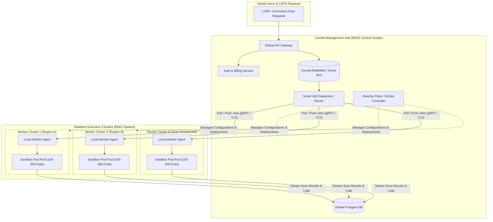
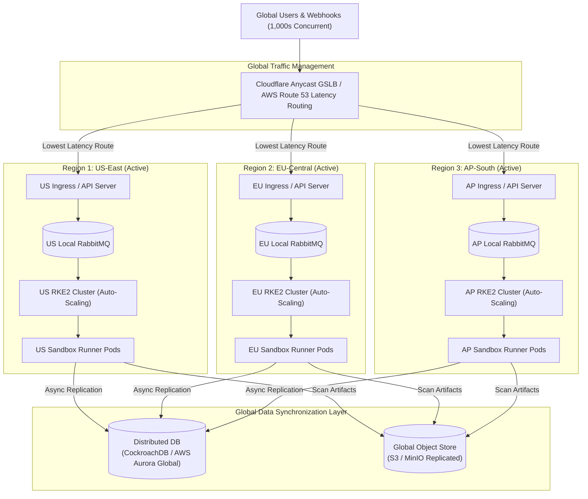

# Auto-Scaling RKE2 Architecture for High-Concurrency Code Scanning

## Executive Summary & Scaling Challenge

The **01-Sandbox** code scanning and repository security platform executes automated code analysis (Semgrep, Trivy, Bandit, custom linters) inside dynamically created, isolated Kubernetes sandbox pods within an **RKE2 cluster**.

### Current Single-Node / Single-Cluster Bottleneck
In a single-server RKE2 deployment:
* **Resource Limits:** A single 16-Core / 32 GB RAM server can only safely execute ~29 concurrent sandbox pods (assuming $0.5\text{ CPU}$ and $0.5\text{ GB RAM}$ per pod, plus system overhead reserve).
* **Concurrency Cap:** Up to ~10 concurrent active users can saturate the host, leading to `FailedScheduling` errors, high job queue latency, CPU throttling, or host OOM (Out-Of-Memory) kernel panics.
* **Control Plane Bottleneck:** High pod churn (creating and deleting hundreds of sandbox pods per minute) causes excessive `etcd` disk writes and API server CPU spikes on a single control plane.

To support **hundreds to thousands of concurrent users scanning code and GitHub repositories simultaneously** without performance degradation or system failure, the architecture must transition from a static single-server model to an **auto-scaling multi-node or multi-cluster architecture**.

This document outlines **three scalable architectural solutions**, complete with visual architecture diagrams, component breakdowns, trade-offs, and an implementation roadmap.

---

## Key System Metrics & Auto-Scaling Objectives

To support 1,000 concurrent scans:
* **Required Resource Footprint:** $1,000 \text{ pods} \times 0.5 \text{ CPU} = 500 \text{ CPU Cores}$, $1,000 \text{ pods} \times 0.5 \text{ GiB} = 500 \text{ GiB RAM}$.
* **Throughput:** ~50–100 new scans initiated per second.
* **Target Latency:** Initial scan setup < 2 seconds; execution time linear with repository size.
* **Resilience:** Zero single-point-of-failure; failure of an execution node or cluster must not disrupt remaining user scans.

---

## Solution 1: Single Cluster Auto-Scaling (Dynamic Node Pools + KEDA)

### Concept Overview
Maintain a single logical, High-Availability (HA) RKE2 cluster with a 3-node control plane, but decouple the worker nodes into dynamic **Worker Node Pools** that automatically scale compute instances up and down based on real-time RabbitMQ queue depth.

### Architecture Diagram

```mermaid
flowchart TD
    subgraph Clients["Users & Clients"]
        U1["User 1 (API / Web)"]
        U2["User 2 (GitHub Webhook)"]
        Un["User N (1000+ Concurrent)"]
    end

    subgraph Ingress Layer["Ingress & Gateway"]
        NLB["Cloud Load Balancer / NGINX Ingress"]
    end

    subgraph Control Plane["HA RKE2 Control Plane (3 Masters)"]
        API["kube-apiserver"]
        ETCD[("etcd Cluster")]
    end

    subgraph Core Services["Management Services Node Pool"]
        GW["API Gateway (01-Sandbox)"]
        MQ[("RabbitMQ Queue Cluster")]
        DB[("PostgreSQL / Redis")]
        KEDA["KEDA Controller"]
        CA["Cluster Autoscaler"]
    end

    subgraph Execution Pool["Dynamic Worker Node Pools (Auto-Scaling)"]
        direction TB
        N1["Worker Node 1\n(Sandbox Pods 1..N)"]
        N2["Worker Node 2\n(Sandbox Pods 1..N)"]
        NX["Worker Node N\n(Dynamically Provisioned)"]
    end

    U1 --> NLB
    U2 --> NLB
    Un --> NLB
    NLB --> GW
    GW --> MQ
    GW --> DB

    KEDA -- "Monitors Queue Depth" --> MQ
    KEDA -- "Triggers HPA Scale-Out" --> API
    CA -- "Monitors Pending Pods" --> API
    CA -- "Provisions Compute VMs" --> Execution Pool

    MQ -- "Consumes Scan Jobs" --> Execution Pool
    Execution Pool -- "Reports Status / Logs" --> DB
```

### Key Components & Mechanics

1. **HA RKE2 Control Plane:**
   - 3 Dedicated Master Nodes running `kube-apiserver` and `etcd` on high-IOPS NVMe drives to handle rapid pod creation/deletion events.
2. **KEDA (Kubernetes Event-driven Autoscaling):**
   - Monitors RabbitMQ queue length (`quick_scan_queue` and `repo_scan_queue`).
   - Dynamically scales `sandbox-api` worker deployment replicas from a baseline (e.g., 5 replicas) up to 100+ replicas as scan requests flood the queue.
3. **Kubernetes Cluster Autoscaler (CA):**
   - Detects unschedulable pods waiting for CPU/RAM.
   - Automatically provisions new cloud worker node VMs (AWS ASG, GCP Node Pools, or OpenStack/VMware templates) in < 60 seconds.
   - Automatically terminates idle worker nodes when scan traffic subsides.
4. **Sandbox Pod Pre-warming (Warm Pool):**
   - Keeps a baseline pool of initialized sandbox container images cached on worker nodes to eliminate docker image pull times during traffic bursts.

### Pros & Cons
* **Pros:**
  * Easiest to implement and manage; single `kubectl` context.
  * Centralized monitoring, logging, and secret management.
  * Cost-efficient scale-to-zero compute capability.
* **Cons:**
  * Control plane bottleneck (`etcd`) can occur if scaling beyond ~5,000 total pods per minute.
  * Blast radius: An outage in the single cluster impacts all active users.

---

## Solution 2: Hub-and-Spoke Multi-Cluster Architecture (Central Dispatcher + Edge Worker Clusters)

### Concept Overview
Separate the **Central Management & API Layer (Hub)** from the **Execution Clusters (Spokes)**. The Hub receives scan jobs, queues them in a central message broker, and dispatches them across a fleet of stateless, independent RKE2 worker clusters dedicated solely to executing sandbox pods.

### Architecture Diagram



### Key Components & Mechanics

1. **Central Management Hub:**
   - Handles API traffic, JWT authentication, user rate limits, billing, and global database storage.
   - Houses the **Central RabbitMQ Broker** and **Smart Job Dispatcher**.
2. **Stateless Execution Spokes (Worker Clusters):**
   - Each spoke is an independent, lightweight RKE2 cluster dedicated purely to running sandbox pods.
   - Spoke clusters do not store persistent data; they pull jobs from the central queue, execute the security scans, push results back to the Hub, and immediately recycle pod resources.
3. **Smart Job Dispatcher / Worker Pull Mechanism:**
   - Local worker agents in each cluster pull jobs based on local cluster capacity (CPU/RAM availability).
   - If Cluster 1 is at 90% utilization, the Dispatcher routes incoming jobs to Cluster 2 or spins up Cluster 3.
4. **GitOps & Fleet Management:**
   - **Rancher Fleet** or **ArgoCD** manages configurations across all spoke clusters centrally. Updating security scanning rules or container images is deployed across all clusters simultaneously.

### Pros & Cons
* **Pros:**
  * **Massive Concurrency:** Can scale horizontally to tens of thousands of concurrent scans by adding more spoke clusters.
  * **Complete Blast Radius Isolation:** Failure of one worker cluster does not impact other clusters or the central API.
  * **Control Plane Security:** High pod churn is distributed across multiple `etcd` databases, preventing control plane degradation.
* **Cons:**
  * Requires a cross-cluster management tool (e.g., Rancher / Fleet / ArgoCD).
  * Operational complexity in managing multi-cluster network routing and central metric aggregation.

---

## Solution 3: Multi-Region Global Enterprise Architecture (GSLB + Geo-Distributed Active-Active Clusters)

### Concept Overview
For enterprise global scale (thousands of global users with strict SLA requirements and geo-proximity needs), deploy independent **Active-Active RKE2 Clusters across multiple geographical regions** (e.g., US-East, US-West, EU-Central, AP-South) fronted by a Global Server Load Balancer (GSLB).

### Architecture Diagram



### Key Components & Mechanics

1. **Global Server Load Balancer (GSLB):**
   - Routes incoming user traffic and GitHub webhooks to the nearest active region based on network latency and cluster health checks.
   - If an entire region goes down, traffic automatically fails over to the next closest region instantly.
2. **Autonomous Regional RKE2 Clusters:**
   - Each region contains its own full stack: API Gateway, RabbitMQ cluster, Database read-replica, and auto-scaling RKE2 worker nodes.
   - Requests are processed completely locally in-region, reducing scan start latency to milliseconds.
3. **Global Database Synchronization:**
   - Uses a globally distributed database (**CockroachDB** or **AWS Aurora Global Database**) to sync user accounts, API keys, and scan metadata across regions.
   - Scan reports and repository artifacts are stored in multi-region object storage (S3/MinIO).

### Pros & Cons
* **Pros:**
  * **Ultra-low latency:** Users in Europe, Asia, and America get local performance.
  * **99.99% Availability:** Region-level fault tolerance; cluster failures in one continent have zero impact on others.
  * **Unlimited Concurrency:** Easily handles 10,000+ simultaneous scans across global clusters.
* **Cons:**
  * Highest infrastructure cost.
  * Requires multi-region database replication management.

---

## Detailed Solution Comparison & Decision Matrix

| Dimension | Solution 1: Single Cluster + Auto-Scaling | Solution 2: Hub-and-Spoke Multi-Cluster | Solution 3: Multi-Region Global Enterprise |
| :--- | :--- | :--- | :--- |
| **Max Concurrent Users** | 100 – 500 users | 500 – 5,000 users | 5,000 – 50,000+ users |
| **Max Concurrent Pods** | Up to 1,000 pods | Up to 10,000 pods | 50,000+ pods |
| **Implementation Effort** | Low (1 – 2 weeks) | Medium (3 – 4 weeks) | High (6 – 8 weeks) |
| **Operational Complexity**| Low (Single `kubectl` context) | Medium (Rancher/Fleet management) | High (Multi-region networking & DB) |
| **Fault Isolation** | Cluster-level risk | Worker cluster level isolation | Full regional fault isolation |
| **Etcd Load Distribution**| Single `etcd` cluster | Distributed across $N$ spoke clusters | Distributed per active region |
| **Cost Profile** | Minimal (Pay for nodes as needed) | Moderate (Hub overhead + Spoke nodes)| High (Multi-region reservation & DB) |

---

## Recommended Implementation Roadmap

### Phase 1: Immediate Quick Win (Solution 1)
1. **Deploy Control Plane HA:** Expand current single RKE2 node to a 3-master node HA cluster.
2. **Implement KEDA:** Install KEDA in the cluster linked to RabbitMQ queue metrics.
3. **Configure Cluster Autoscaler:** Enable dynamic worker node scaling (AWS ASG or cloud infrastructure provider API).
4. **Implement Pre-Warmed Container Pools:** Pre-cache core scanning container images (`semgrep`, `trivy`, `bandit`) on worker node templates to optimize start time.

### Phase 2: High Concurrency Scale (Solution 2 - Target Architecture)
1. **Decouple API & DB (Hub):** Move `apiServer`, PostgreSQL, and RabbitMQ to a dedicated Control/Hub RKE2 cluster.
2. **Deploy Spoke Worker Clusters:** Provision 2–4 lightweight stateless RKE2 execution clusters behind a central job dispatcher.
3. **Implement Fleet/GitOps Management:** Use **Rancher Fleet** to automate manifest deployments across all spoke clusters.
4. **Capacity Routing:** Configure the dispatcher to route jobs based on real-time node capacity per spoke cluster.

### Phase 3: Global Expansion (Solution 3 - Enterprise Scale)
1. Place **Cloudflare GSLB** in front of multi-region deployments.
2. Migrate single-region PostgreSQL to **CockroachDB** or multi-region database replicas.
3. Deploy regional spoke clusters in US, EU, and Asia-Pacific.
