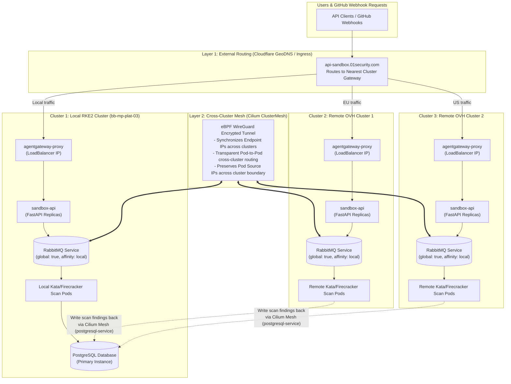
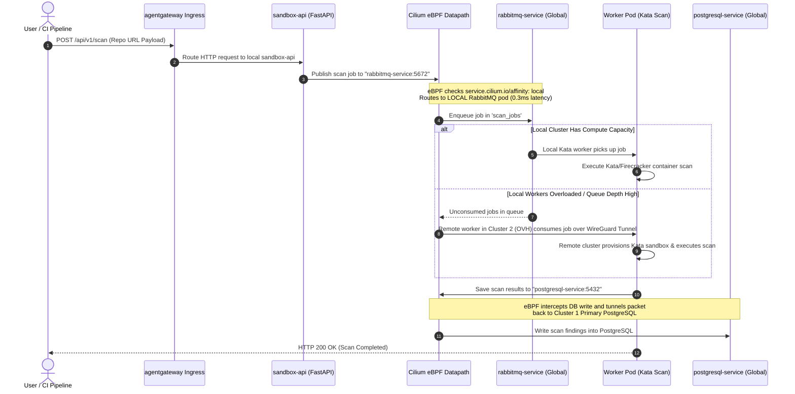

# Cilium ClusterMesh Alone: Pure eBPF Multi-Cluster Networking

> **Core Architecture Principle:** Go multi-cluster **without installing any external management control plane** (no Karmada, no Open Cluster Management, no extra etcd clusters, no custom placement CRDs).
>
> You leverage the **Cilium CNI already installed on your RKE2 cluster** to bridge pod and service networks across multiple Kubernetes clusters at the Linux kernel level (eBPF).
>
> **Application Impact:** **Zero code or configuration changes.** Your FastAPI `sandbox-api`, Python workers (`consumer.py`), RabbitMQ queues, and PostgreSQL databases connect using standard Kubernetes DNS service names (`rabbitmq-service:5672`, `postgresql-service:5432`).

---

## Table of Contents

1. [Executive Summary & Why This Approach Wins](#1-executive-summary--why-this-approach-wins)
2. [Deep Architectural & Component Breakdown](#2-deep-architectural--component-breakdown)
3. [Architecture & Topology Diagrams](#3-architecture--topology-diagrams)
4. [Mandatory Prerequisites & Network Planning](#4-mandatory-prerequisites--network-planning)
5. [Step-by-Step Installation & Configuration Guide](#5-step-by-step-installation--configuration-guide)
6. [01-Sandbox Application Integration & Manifests](#6-01-sandbox-application-integration--manifests)
7. [Traffic Execution & Sequence Flow](#7-traffic-execution--sequence-flow)
8. [High Availability & Failover Scenarios](#8-high-availability--failover-scenarios)
9. [Verification & Troubleshooting Handbook](#9-verification--troubleshooting-handbook)

---

## 1. Executive Summary & Why This Approach Wins

Most multi-cluster architectures require complex Layer 2 control planes (like Karmada or OCM) that introduce new custom resource definitions (`PropagationPolicy`, `ManifestWork`), hub-and-spoke controllers, and management state.

**Cilium ClusterMesh operates strictly at Layer 3/4/7 eBPF network level:**

```
┌──────────────────────────────────────────────────────────────────────────────┐
│                        STANDARD KUBERNETES DEPLOYMENTS                       │
│      (Deploy identical Helm chart to Cluster 1 & Cluster 2 via CI/CD)        │
└──────────────────────┬───────────────────────────────┬───────────────────────┘
                       │                               │
                       ▼                               ▼
       ┌──────────────────────────────┐  ┌──────────────────────────────┐
       │   Cluster 1 (Local RKE2)     │  │    Cluster 2 (Remote OVH)    │
       │   - sandbox-api (FastAPI)    │  │    - sandbox-api (FastAPI)   │
       │   - RabbitMQ Service         │  │    - RabbitMQ Service        │
       │   - PostgreSQL Database      │  │    - Kata/Firecracker Pods  │
       └──────────────┬───────────────┘  └──────────────┬───────────────┘
                      │                                 │
                      └───────► Cilium ClusterMesh ◄────┘
                         (Encrypted eBPF Mesh Tunnel)
```

### Why Cilium ClusterMesh Alone is Superior for `01-Sandbox`:

1. **Zero Additional Infrastructure Overhead:** No OCM Hub, no Karmada control plane, no additional virtual machines required.
2. **Zero Learning Curve for Developers:** Developers continue using standard `kubectl`, `helm`, and standard Kubernetes `Service` manifests.
3. **Kernel-Level Performance:** eBPF handles packet routing, load balancing, and encryption directly inside the Linux kernel without iptables overhead or userspace proxying.
4. **Locality-Aware Routing:** Requests automatically favor local services for ultra-low latency (< 1ms) and only cross the cluster boundary when local workers are unavailable or overloaded.

---

## 2. Deep Architectural & Component Breakdown

Cilium ClusterMesh operates by synchronizing state between independent Kubernetes clusters using a lightweight, decentralized control plane embedded directly inside Cilium.

```
                   CLUSTER 1                                      CLUSTER 2
┌──────────────────────────────────────────────┐┌──────────────────────────────────────────────┐
│                                              ││                                              │
│  ┌────────────────┐      ┌────────────────┐  ││  ┌────────────────┐      ┌────────────────┐  │
│  │ sandbox-api    │      │ Kata Worker    │  ││  │ sandbox-api    │      │ Kata Worker    │  │
│  └───────┬────────┘      └───────┬────────┘  ││  └───────┬────────┘      └───────┬────────┘  │
│          │                       │           ││          │                       │           │
│ ─────────┼───────────────────────┼────────── ││ ─────────┼───────────────────────┼────────── │
│          ▼                       ▼           ││          ▼                       ▼           │
│  ┌────────────────────────────────────────┐  ││  ┌────────────────────────────────────────┐  │
│  │           Cilium eBPF Datapath         │  ││  │           Cilium eBPF Datapath         │  │
│  └───────────────────┬────────────────────┘  ││  └───────────────────┬────────────────────┘  │
│                      │                       ││                      │                       │
│                      ▼                       ││                      ▼                       │
│  ┌────────────────────────────────────────┐  ││  ┌────────────────────────────────────────┐  │
│  │     clustermesh-apiserver (etcd)       │◄═┼┼═►│     clustermesh-apiserver (etcd)       │  │
│  └────────────────────────────────────────┘  ││  └────────────────────────────────────────┘  │
│                                              ││                                              │
└──────────────────────────────────────────────┘└──────────────────────────────────────────────┘
```

### Core Components Explained

#### 1. `clustermesh-apiserver`
* An isolated, lightweight etcd instance and API server deployed as a deployment in the `kube-system` namespace.
* **Role:** Exposes cluster state (endpoints, services, pod identities) to remote clusters. It does **NOT** touch Kubernetes resources directly; it only synchronizes networking state.

#### 2. Cilium Agent (`cilium-agent`)
* Runs as a DaemonSet on every Kubernetes node.
* **Role:** Watches the local Kubernetes API server AND remote `clustermesh-apiserver` instances. When a service is marked as global, the Cilium Agent programming the local eBPF maps inserts remote pod IPs as valid backends for the local service endpoint.

#### 3. eBPF Datapath & Mesh Tunnel
* Packet encapsulation is performed using **VXLAN** (UDP port 8472) or **Geneve**, or encrypted via **WireGuard** (UDP port 51871).
* When a pod sends a packet to `rabbitmq-service`, the eBPF socket layer intercepts the packet before it touches the TCP/IP stack, looks up the destination in eBPF maps, and tunnels it directly to the target node in Cluster 2.

#### 4. Global Services Engine (`service.cilium.io/global`)
* Merges services across multiple Kubernetes clusters into a single logical service endpoint.
* Supports **Locality Affinity** (`service.cilium.io/affinity: "local"`), ensuring pods prefer backends in their own cluster before sending traffic over the cross-cluster tunnel.

---

## 3. Architecture & Topology Diagrams

### 3.1 End-to-End Multi-Cluster Topology Diagram



---

## 4. Mandatory Prerequisites & Network Planning

Before enabling Cilium ClusterMesh, your Kubernetes clusters **MUST** satisfy 4 strict network requirements:

> [!CAUTION]
> **Rule 1: Pod CIDRs MUST NOT overlap across clusters.**
> If Cluster 1 uses `10.42.0.0/16` and Cluster 2 also uses `10.42.0.0/16`, IP routing will break because nodes cannot distinguish between local pod IPs and remote pod IPs.

### 4.1 Required Network Addressing Scheme

| Cluster Name | Cluster ID | Node Subnet | Pod CIDR (`cluster-cidr`) | Service CIDR | Cilium Overlay IP |
| :--- | :--- | :--- | :--- | :--- | :--- |
| **`rke2-local`** (Cluster 1) | `1` | `10.0.8.0/24` | `10.42.0.0/16` | `10.43.0.0/16` | `10.42.0.1` |
| **`ovh-spoke-1`** (Cluster 2) | `2` | `192.168.10.0/24` | `10.142.0.0/16` | `10.143.0.0/16` | `10.142.0.1` |
| **`ovh-spoke-2`** (Cluster 3) | `3` | `192.168.20.0/24` | `10.242.0.0/16` | `10.243.0.0/16` | `10.242.0.1` |

### 4.2 Firewall & Security Group Rules

Ensure the following ports are open between all node IPs across clusters:

| Port / Protocol | Direction | Source / Destination | Description |
| :--- | :--- | :--- | :--- |
| **`2379/TCP`** | Inbound / Outbound | All Nodes ↔ All Nodes | `clustermesh-apiserver` TLS communication |
| **`8472/UDP`** | Inbound / Outbound | All Nodes ↔ All Nodes | VXLAN Overlay Encapsulation (if native routing disabled) |
| **`51871/UDP`** | Inbound / Outbound | All Nodes ↔ All Nodes | WireGuard Encrypted Cross-Cluster Tunnels |
| **`4240/TCP`** | Inbound / Outbound | All Nodes ↔ All Nodes | Cilium Health Check agent (`cilium-health`) |

---

## 5. Step-by-Step Installation & Configuration Guide

### Step 1: Install & Configure Cilium on Cluster 1 (`rke2-local`)

If installing or upgrading Cilium on Cluster 1, specify unique `cluster.name` and `cluster.id`:

```bash
helm repo add cilium https://helm.cilium.io/
helm repo update

helm upgrade --install cilium cilium/cilium \
  --namespace kube-system \
  --set cluster.name=rke2-local \
  --set cluster.id=1 \
  --set ipam.mode=kubernetes \
  --set clustermesh.useAPIServer=true
```

### Step 2: Install & Configure Cilium on Cluster 2 (`ovh-spoke-1`)

On Cluster 2, set a **different** `cluster.name` and **different** `cluster.id`:

```bash
KUBECONFIG=/path/to/ovh-spoke-1.yaml helm upgrade --install cilium cilium/cilium \
  --namespace kube-system \
  --set cluster.name=ovh-spoke-1 \
  --set cluster.id=2 \
  --set ipam.mode=kubernetes \
  --set clustermesh.useAPIServer=true
```

### Step 3: Synchronize Root Certificate Authority (CA) Secrets

For `clustermesh-apiserver` instances to trust each other, both clusters **MUST share the same Cilium CA certificate**.

```bash
# 1. Extract Cilium CA secret from Cluster 1
kubectl --context rke2-local -n kube-system get secret cilium-ca -o yaml > cilium-ca.yaml

# 2. Modify metadata namespace/context and apply to Cluster 2
kubectl --context ovh-spoke-1 -n kube-system apply -f cilium-ca.yaml

# 3. Restart Cilium operator on Cluster 2 to pick up shared CA
kubectl --context ovh-spoke-1 -n kube-system rollout restart deployment/cilium-operator
```

### Step 4: Enable ClusterMesh on Both Clusters

Run the `cilium` CLI command to provision `clustermesh-apiserver` deployments and expose their endpoints:

```bash
# Enable ClusterMesh on Cluster 1
cilium clustermesh enable --context rke2-local --service-type LoadBalancer

# Enable ClusterMesh on Cluster 2
cilium clustermesh enable --context ovh-spoke-1 --service-type LoadBalancer
```

> [!NOTE]
> If NodePort or internal IPs are preferred instead of LoadBalancer, replace `--service-type LoadBalancer` with `--service-type NodePort`.

### Step 5: Connect the Clusters

Establish the bidirectional eBPF state synchronization and tunnel mesh:

```bash
cilium clustermesh connect \
  --context rke2-local \
  --destination-context ovh-spoke-1
```

### Step 6: Verify ClusterMesh Health

```bash
cilium clustermesh status --context rke2-local
```

**Expected Healthy Output:**
```text
✅ Service clustermesh-apiserver is ready
✅ Secret clustermesh-apiserver is ready
✅ Cluster mesh is ready
└── 1/1 clusters connected
    └── ovh-spoke-1: ready, 3 nodes, 12 services, 42 endpoints
```

---

## 6. 01-Sandbox Application Integration & Manifests

To enable multi-cluster discovery for `01-Sandbox` without modifying application source code, update your Kubernetes `Service` manifests with Cilium annotations.

### 6.1 Global RabbitMQ Service Manifest (`rabbitmq-service.yaml`)

```yaml
apiVersion: v1
kind: Service
metadata:
  name: rabbitmq-service
  namespace: opensandbox-system
  annotations:
    # 1. Marks service as shared across all connected ClusterMesh clusters
    service.cilium.io/global: "true"
    # 2. Ensures local workers query local RabbitMQ first; falls back cross-cluster if local down
    service.cilium.io/affinity: "local"
spec:
  type: ClusterIP
  ports:
    - name: amqp
      port: 5672
      targetPort: 5672
    - name: management
      port: 15672
      targetPort: 15672
  selector:
    app.kubernetes.io/name: rabbitmq
```

### 6.2 Global PostgreSQL Database Manifest (`postgresql-service.yaml`)

```yaml
apiVersion: v1
kind: Service
metadata:
  name: postgresql-service
  namespace: opensandbox-system
  annotations:
    service.cilium.io/global: "true"
    # Ensures remote workers in OVH write scan findings back to primary PostgreSQL on Local PC
    service.cilium.io/affinity: "remote"
spec:
  type: ClusterIP
  ports:
    - name: postgresql
      port: 5432
      targetPort: 5432
  selector:
    app.kubernetes.io/name: postgresql
```

### 6.3 Unmodified Python Application Configuration (`consumer.py`)

No Python code edits or environment variable modifications are required:

```python
import os
import pika

# Standard Kubernetes in-cluster DNS name — resolved transparently by Cilium ClusterMesh
RABBITMQ_HOST = os.getenv("RABBITMQ_HOST", "rabbitmq-service.opensandbox-system.svc.cluster.local")
RABBITMQ_PORT = int(os.getenv("RABBITMQ_PORT", 5672))

connection = pika.BlockingConnection(
    pika.ConnectionParameters(host=RABBITMQ_HOST, port=RABBITMQ_PORT)
)
channel = connection.channel()
channel.queue_declare(queue='scan_jobs', durable=True)
print(" [*] Waiting for scan jobs via Cilium ClusterMesh...")
```

---

## 7. Traffic Execution & Sequence Flow

This sequence diagram illustrates how a code scan request flows through the infrastructure across clusters **with zero code changes**:



---

## 8. High Availability & Failover Scenarios

### Scenario A: Local RabbitMQ Failure in Cluster 1

1. **Failure Event:** The local RabbitMQ pod crashes or node `bb-mp-plat-03` undergoes maintenance.
2. **Cilium Health Check Detection:** `cilium-health` detects that local endpoint `10.42.0.45:5672` is non-responsive within 500ms.
3. **eBPF Map Update:** Cilium automatically updates the eBPF socket load balancing map on Cluster 1 nodes, marking the local backend as `Down`.
4. **Transparent Failover:** `sandbox-api` publishes the next message to `rabbitmq-service:5672`. Cilium transparently reroutes the TCP packet across the ClusterMesh tunnel to `rabbitmq-service` running in Cluster 2 (`ovh-spoke-1`).
5. **Result:** Zero HTTP 500 errors returned to users. `sandbox-api` connection succeeds without restarting or changing IP addresses.

### Scenario B: Cross-Cluster WAN Network Partition

1. **Failure Event:** The internet tunnel between Local PC and OVH drops.
2. **Cluster Isolation:** Cilium ClusterMesh marks remote endpoints as `Unreachable`.
3. **Local Self-Healing:** Cluster 1 continues executing scan jobs using local RabbitMQ and local workers. Cluster 2 continues executing scan jobs using remote RabbitMQ and queues database writes locally until the tunnel reconnects.

---

## 9. Verification & Troubleshooting Handbook

### 9.1 Diagnostic Commands Quick Reference

```bash
# 1. Check ClusterMesh connection status
cilium clustermesh status --context rke2-local

# 2. Inspect eBPF global service routing table
kubectl --context rke2-local -n kube-system exec -it ds/cilium -- cilium service list

# 3. Run full automated cross-cluster network connectivity validation
cilium connectivity test \
  --context rke2-local \
  --multi-cluster ovh-spoke-1

# 4. View active cross-cluster WireGuard tunnel status
kubectl --context rke2-local -n kube-system exec -it ds/cilium -- cilium bpf tunnel list
```

### 9.2 Common Troubleshooting Scenarios & Fixes

#### Issue 1: `clustermesh-apiserver` connection timeout (`Dial tcp: i/o timeout`)
* **Root Cause:** Security group or firewall blocking TCP port `2379`.
* **Fix:** Verify host firewall allows inbound TCP 2379 between node public IPs:
  ```bash
  nc -zv <REMOTE_NODE_IP> 2379
  ```

#### Issue 2: Cross-cluster pod ping fails (`Destination Host Unreachable`)
* **Root Cause:** Overlapping Pod CIDRs between clusters or blocked UDP port `8472`/`51871`.
* **Fix:** Check pod subnet configuration:
  ```bash
  kubectl get nodes -o jsonpath='{.items[*].spec.podCIDR}'
  ```
  Ensure pod CIDRs are strictly disjoint across clusters.

#### Issue 3: TLS Certificate Validation Failed (`x509: certificate signed by unknown authority`)
* **Root Cause:** Cluster 1 and Cluster 2 have different Cilium Root CA certificates.
* **Fix:** Re-sync the `cilium-ca` secret from Cluster 1 to Cluster 2 as detailed in [Step 3](#step-3-synchronize-root-certificate-authority-ca-secrets).
