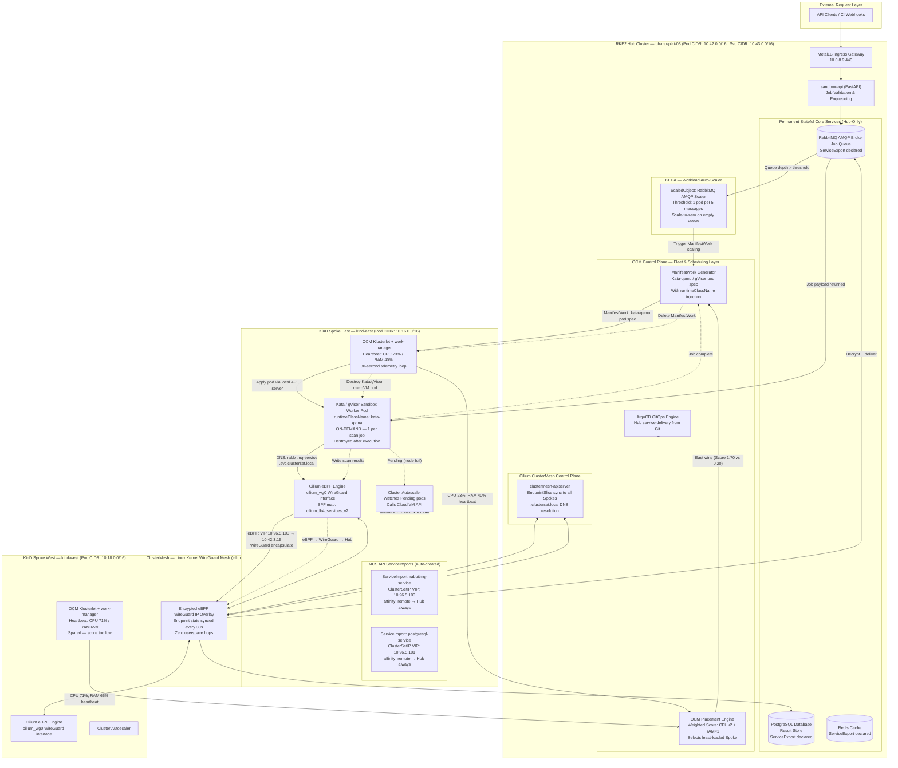
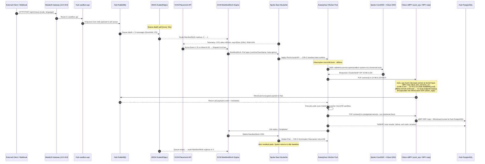

# Final Multi-Cluster Comparison & Architectural Justification for 01-Sandbox

> **Document Status:** Final Technical Specification & Architecture Justification — CEO Presentation Ready
> **Target Application:** 01-Sandbox High-Concurrency Code Execution Platform
> **Environment:** Hub — RKE2 on `bb-mp-plat-03` | Spoke East — `kind-east` | Spoke West — `kind-west`
> **Related Documents:** [recommendation.md](./recommendation.md) | [cilium-mesh.md](./cilium-mesh.md) | [submariner.md](./submariner.md) | [liqo.md](./liqo.md) | [mcs.md](./mcs.md) | [manual-setup-guide.md](./manual-setup-guide.md)

---

## Executive Summary

The **01-Sandbox** application is a multi-tenant, high-concurrency **security analysis and code execution platform**. It runs untrusted user code inside hardware-isolated microVM environments (Kata Containers / Firecracker / gVisor) to guarantee zero cross-tenant code contamination.

As job concurrency grows, a single-cluster architecture becomes a hard hardware ceiling. This document evaluates **seven multi-cluster technologies** and presents a final technical justification for the recommended approach that enables:

- ✅ **Real-time visibility** into CPU and memory utilization across all Spoke clusters
- ✅ **Dynamic, CPU/memory-weighted workload placement** — jobs always go to the least-loaded Spoke
- ✅ **Auto-scaling of both worker pods and Spoke Node VMs** in response to queue depth
- ✅ **On-demand microVM sandbox provisioning** (Kata Containers + gVisor) with sub-second boot times
- ✅ **Zero idle resource consumption** — Spokes return to baseline after every job completes
- ✅ **Kernel-level encrypted networking** with sub-millisecond cross-cluster packet latency

### 🏆 Final Recommendation

> **Recommended Stack: Cilium ClusterMesh (eBPF) + Kubernetes MCS API (KEP-1645) + Open Cluster Management (OCM) + KEDA**

| Architectural Layer | Selected Technology | Business Rationale |
|:---|:---|:---|
| **Layer 1 — Network Fabric** | Cilium ClusterMesh (eBPF + WireGuard) | Leverages already-deployed Cilium CNI; zero new tools; sub-millisecond encrypted data path |
| **Layer 2 — Service Discovery** | Kubernetes MCS API (KEP-1645) | Open standard; application code independent of underlying network implementation |
| **Layer 3 — Fleet Scheduling** | Open Cluster Management (OCM) | Real-time CPU/RAM telemetry from all Spokes; dynamic placement scoring; automated on-demand pod lifecycle |
| **Layer 4 — Workload Auto-Scaler** | KEDA (Kubernetes Event-Driven Autoscaling) | Reacts to RabbitMQ queue depth; scales sandbox worker pods without human intervention |

This stack is **80% already operational** — clusters, Cilium, OCM, and ArgoCD are already configured per `manual-setup-guide.md`. The remaining gap is three configuration commands and two YAML files.

---

## Table of Contents

1. [01-Sandbox Workload Profile & Requirements](#1-01-sandbox-workload-profile--requirements)
2. [Multi-Cluster Approaches Evaluated](#2-multi-cluster-approaches-evaluated)
3. [Deep-Dive Comparative Analysis](#3-deep-dive-comparative-analysis)
4. [Pros and Cons of Evaluated Approaches](#4-pros-and-cons-of-evaluated-approaches)
5. [Architectural Comparison: Composite Stacks](#5-architectural-comparison-composite-stacks)
6. [Comprehensive Justification of the Recommended Stack](#6-comprehensive-justification-of-the-recommended-stack)
7. [Detailed Technical Architecture & Diagrams](#7-detailed-technical-architecture--diagrams)
8. [Declarative Implementation Manifests & Configuration](#8-declarative-implementation-manifests--configuration)
9. [Conclusion, Risk Register & Implementation Summary](#9-conclusion-risk-register--implementation-summary)

---

## 1. 01-Sandbox Workload Profile & Requirements

### 1.1 Hub-and-Spoke Architecture Overview

```
┌─────────────────────────────────────────────────────────────────────────────────┐
│                     HUB CLUSTER — bb-mp-plat-03 (RKE2)                          │
│  Permanent Services: sandbox-api, RabbitMQ, PostgreSQL, Redis                   │
│  Control Plane:      OCM Hub Controller, ArgoCD, KEDA                           │
│  Network Identity:   Pod CIDR 10.42.0.0/16 | Service CIDR 10.43.0.0/16          │
└─────────────────────────┬────────────────────────────┬──────────────────────────┘
                          │  OCM ManifestWork Dispatch  │
                          │  (CPU/Memory-Aware)         │
             ┌────────────▼──────────────┐   ┌──────────▼─────────────────┐
             │   SPOKE EAST (kind-east)  │   │   SPOKE WEST (kind-west)   │
             │   Pod CIDR: 10.16.0.0/16 │   │   Pod CIDR: 10.18.0.0/16  │
             │   CPU Load:  23% → ACTIVE │   │   CPU Load:  71% → SPARED  │
             │   Workers: Kata microVMs  │   │   Workers: Kata microVMs   │
             └───────────────────────────┘   └────────────────────────────┘
```

### 1.2 Mandatory Technical Requirements

| # | Requirement | Priority | Architectural Implication |
|:--|:---|:---:|:---|
| 1 | Core services (RabbitMQ, PostgreSQL, Redis) permanently on Hub | 🔴 Critical | Spokes must reach Hub services cross-cluster; no local replicas on Spokes |
| 2 | CPU/Memory-aware Spoke selection per scan job | 🔴 Critical | Requires real-time telemetry collection + weighted placement scoring engine |
| 3 | Worker pods provisioned per job, destroyed on completion | 🔴 Critical | Fleet engine must support ephemeral declarative `ManifestWork` lifecycle |
| 4 | Auto-scale worker pods based on RabbitMQ queue depth | 🔴 Critical | KEDA event-driven autoscaler watching RabbitMQ message count |
| 5 | Auto-provision new Spoke Node VMs when nodes are full | 🔴 Critical | Spoke Cluster Autoscaler calling Cloud API for node VMs |
| 6 | Kata Containers (microVM) & gVisor sandbox isolation | 🔴 Critical | Spoke containerd/CRI-O must have `kata-qemu`, `firecracker`, `runsc` RuntimeClass handlers |
| 7 | Zero application code modification (`consumer.py`) | 🟡 High | Standard `.svc.clusterset.local` DNS names via MCS API KEP-1645 |
| 8 | Non-overlapping CIDRs already allocated | 🟡 High | Hub `10.42/16`, East `10.16/16`, West `10.18/16` — Cilium hard requirement already satisfied |
| 9 | Kernel-level encrypted cross-cluster networking | 🟡 High | WireGuard at Linux kernel layer via Cilium (`cilium_wg0`) |
| 10 | GitOps delivery of Hub services via ArgoCD | 🟡 High | OCM ArgoCD addon already configured on Hub |
| 11 | Future portability if CNI changes | 🟢 Medium | MCS API standard DNS decouples app config from CNI implementation |
| 12 | Cluster health visibility & alerting | 🟢 Medium | OCM `ManagedCluster` conditions surface Spoke status to Hub |

---

## 2. Multi-Cluster Approaches Evaluated

We evaluated **seven distinct multi-cluster technologies** across four functional tiers, plus an autoscaling layer:

```
┌─────────────────────────────────────────────────────────────────────────────────┐
│                          MULTI-CLUSTER TECHNOLOGY TAXONOMY                       │
├──────────────────────────────┬──────────────────────────────────────────────────┤
│ Tier 1: Network Fabric       │ Cilium ClusterMesh, Submariner                   │
├──────────────────────────────┼──────────────────────────────────────────────────┤
│ Tier 2: Service Discovery    │ Kubernetes MCS API (KEP-1645)                    │
├──────────────────────────────┼──────────────────────────────────────────────────┤
│ Tier 3: Fleet & Scheduling   │ Open Cluster Management (OCM), Liqo, Karmada     │
├──────────────────────────────┼──────────────────────────────────────────────────┤
│ Tier 4: Workload Auto-Scaler │ KEDA (Kubernetes Event-Driven Autoscaling)       │
├──────────────────────────────┼──────────────────────────────────────────────────┤
│ Alternative: Service Mesh    │ Istio Multi-Cluster (evaluated and rejected)     │
└──────────────────────────────┴──────────────────────────────────────────────────┘
```

### Technical Summary of Each Evaluated Approach

1. **Cilium ClusterMesh (Network Fabric Layer):**
   - *Mechanics:* Peers multiple Kubernetes clusters by sharing endpoint state across `clustermesh-apiserver` instances backed by etcd. Uses Linux kernel eBPF (`sock_ops` / `tc` hooks) for socket-level packet interception and in-kernel WireGuard (`cilium_wg0`) for encrypted tunneling. No userspace proxy hops.
   - *Scope:* Layer 3/4 cross-cluster encrypted pod-to-pod and pod-to-service networking.

2. **Submariner (Network Fabric Layer):**
   - *Mechanics:* CNCF sandbox project. Establishes IPsec or WireGuard tunnels via dedicated Gateway Engine node processes. CNI-agnostic. Ships with Globalnet (overlapping CIDR NAT) and Lighthouse (MCS-compliant DNS).
   - *Scope:* Layer 3/4 network overlay with userspace gateway hops.

3. **Liqo (Virtual Node Offloading Layer):**
   - *Mechanics:* Implements the Virtual Kubelet API — remote clusters appear as large virtual nodes in the home cluster. Pod scheduling via standard Kubernetes scheduler. WireGuard tunnel per peered cluster. Resource reflection into shadow namespaces.
   - *Scope:* Workload offloading to remote clusters using standard K8s scheduler semantics.

4. **Kubernetes MCS API — KEP-1645 (Service Discovery Standard):**
   - *Mechanics:* SIG-Multicluster open specification defining `ServiceExport` / `ServiceImport` CRDs and the `.svc.clusterset.local` DNS zone. Not an implementation — requires Cilium or Submariner as the backing engine.
   - *Scope:* Vendor-neutral cross-cluster service discovery standard. Zero runtime overhead.

5. **Open Cluster Management — OCM (Fleet Management Layer):**
   - *Mechanics:* CNCF sandbox project. Hub-Spoke control plane where lightweight `Klusterlet` agents run on each Spoke, reporting CPU/memory/node telemetry every 30 seconds via the `work-manager` addon. Hub `Placement` API scores Spokes and dispatches `ManifestWork` CRDs for ephemeral workload delivery.
   - *Scope:* Fleet control plane — real-time CPU/memory-aware scheduling and declarative workload lifecycle management.

6. **Karmada (Kubernetes Resource Federation Engine):**
   - *Mechanics:* CNCF incubating project. Runs a dedicated `karmada-apiserver` and `karmada-etcd`. Propagates native Kubernetes resources to member clusters via `PropagationPolicy` / `OverridePolicy` / `ResourceBinding`. Dynamic CPU-aware scheduling requires an external `karmada-metrics-adapter`.
   - *Scope:* Multi-cluster workload propagation and policy-based resource federation.

7. **KEDA — Kubernetes Event-Driven Autoscaling (Workload Auto-Scaler):**
   - *Mechanics:* CNCF graduated project. Watches external event sources (e.g., RabbitMQ queue message count via AMQP scaler, or HTTP RPS) and adjusts a Kubernetes `ScaledObject` target's replica count to zero or any desired number. Integrates with HPA. When KEDA scales replicas to 1+, OCM `ManifestWork` templates are triggered to dispatch microVM pods to Spokes.
   - *Scope:* Event-driven horizontal pod auto-scaler that bridges job queue depth to Spoke worker pod count.

8. **Istio Multi-Cluster (Service Mesh — Evaluated & Rejected):**
   - *Mechanics:* Deploys Envoy sidecar proxies alongside every pod. Manages cross-cluster traffic via Envoy ingress/egress gateways and mutual TLS tunnels. Each pod carries a ~50MB Envoy sidecar daemon.
   - *Scope:* Layer 7 traffic management, observability, and application-layer mTLS.

---

## 3. Deep-Dive Comparative Analysis

### 3.1 Multi-Cluster Classification & Architectural Scope

These solutions operate at **different, complementary layers** of the Kubernetes stack and are not mutually exclusive. The critical insight is:

| Solution | Primary Category | What It DOES | What It DOES NOT Do |
|:---|:---|:---|:---|
| **Cilium ClusterMesh** | Network Fabric (eBPF) | Routes cross-cluster pod/service traffic at kernel speed via eBPF maps + WireGuard | Cannot schedule workloads or evaluate CPU/memory capacity |
| **Submariner** | Network Fabric (Overlay) | Establishes IPsec/WireGuard tunnels between clusters across any CNI | Adds userspace gateway hops; cannot perform CPU-aware workload placement |
| **MCS API (KEP-1645)** | Service Discovery Standard | Defines `ServiceExport`/`ServiceImport` CRDs and `.clusterset.local` DNS names | Does not move network packets (requires Cilium or Submariner as engine) |
| **Liqo** | Virtual Node Abstraction | Makes remote clusters appear as K8s nodes for scheduler-transparent pod offloading | Cannot perform real-time cross-cluster CPU metric scoring; no native GitOps |
| **OCM** | Fleet Management Engine | Collects real-time Spoke telemetry; scores Spokes; dispatches ephemeral `ManifestWork` CRDs | Does not route network packets or establish inter-cluster IP connectivity |
| **Karmada** | K8s Resource Federation | Propagates K8s resources across clusters via `PropagationPolicy` / `OverridePolicy` | Requires extra metrics adapter for CPU scoring; no built-in L3/L4 tunneling |
| **KEDA** | Workload Auto-Scaler | Scales pod replicas to zero/N based on external event sources (queue depth, HTTP RPS) | Does not make cluster placement decisions; works alongside OCM |
| **Istio Multi-Cluster** | L7 Service Mesh | Sophisticated L7 routing, canary, fault injection, distributed tracing | ~50MB Envoy sidecar per pod; incompatible with low-overhead Kata microVM workloads |

---

### 3.2 Master Technical Capability Matrix

| Capability | Cilium ClusterMesh | Submariner | MCS API | Liqo | OCM | Karmada | KEDA | Istio |
|:---|:---:|:---:|:---:|:---:|:---:|:---:|:---:|:---:|
| **Pod-to-Pod Cross-Cluster IP Routing** | ✅ Kernel eBPF | ✅ IPsec/WireGuard | ❌ N/A | ✅ WireGuard | ❌ N/A | ❌ N/A | ❌ N/A | ❌ Envoy GW |
| **Cross-Cluster DNS (`.clusterset.local`)** | ✅ Native | ✅ Lighthouse | ✅ Standard | ✅ Reflected | ❌ N/A | ❌ N/A | ❌ N/A | ❌ Proprietary |
| **ServiceExport / ServiceImport CRDs** | ✅ Built-in | ✅ Native | ✅ Standard | ⚠️ Reflected | ❌ N/A | ❌ N/A | ❌ N/A | ❌ |
| **Kernel-Level WireGuard Encryption** | ✅ In-kernel | ✅ Gateway Node | ❌ N/A | ✅ WireGuard | ❌ N/A | ❌ N/A | ❌ N/A | ✅ mTLS Envoy |
| **CNI-Agnostic Operation** | ❌ Cilium Only | ✅ Any CNI | ✅ Standard | ✅ Any CNI | ✅ Agnostic | ✅ Agnostic | ✅ Agnostic | ✅ Any CNI |
| **Overlapping Pod CIDR Support** | ❌ Unique CIDRs Required | ✅ Globalnet NAT | ❌ N/A | ✅ Auto NAT | ❌ N/A | ❌ N/A | ❌ N/A | ✅ Proxy |
| **Remote Service Affinity Routing** | ✅ eBPF `affinity: remote` | ⚠️ DNS Only | ✅ Topology Hints | ⚠️ Basic | ❌ N/A | ❌ N/A | ❌ N/A | ✅ Locality LB |
| **Real-Time CPU/Memory Spoke Telemetry** | ❌ | ❌ | ❌ | ❌ Static K8s | ✅ `work-manager` | ⚠️ Extra adapter | ❌ | ❌ |
| **CPU/Memory-Weighted Placement Scoring** | ❌ | ❌ | ❌ | ❌ | ✅ `Placement` API | ⚠️ With adapter | ❌ | ❌ |
| **Ephemeral On-Demand Pod Lifecycle** | ❌ | ❌ | ❌ | ⚠️ Virtual node | ✅ `ManifestWork` | ✅ `PropagationPolicy` | ❌ | ❌ |
| **Event-Driven Pod Auto-Scaling (Queue)** | ❌ | ❌ | ❌ | ❌ | ❌ | ❌ | ✅ AMQP Scaler | ❌ |
| **Spoke Node VM Auto-Provisioning** | ❌ | ❌ | ❌ | ❌ | ❌ | ❌ | ✅ + Cluster Autoscaler | ❌ |
| **Kata Container RuntimeClass Support** | ✅ Transparent | ✅ Transparent | ✅ N/A | ✅ Transparent | ✅ Via ManifestWork | ✅ Via Policy | ✅ Via HPA | ❌ Sidecar conflict |
| **gVisor (`runsc`) RuntimeClass Support** | ✅ Transparent | ✅ Transparent | ✅ N/A | ✅ Transparent | ✅ Via ManifestWork | ✅ Via Policy | ✅ Via HPA | ❌ Sidecar conflict |
| **GitOps Integration (ArgoCD)** | ❌ | ❌ | ❌ | ❌ | ✅ Native Addon | ⚠️ Custom | ✅ External | ❌ |
| **Zero Pod Sidecar Overhead** | ✅ | ✅ | ✅ | ✅ | ✅ | ✅ | ✅ | ❌ ~50MB/pod |
| **Sub-Millisecond Packet Latency** | ✅ Kernel eBPF | ❌ Userspace GW | ❌ N/A | ⚠️ 1 NAT Hop | ❌ N/A | ❌ N/A | ❌ N/A | ❌ L7 Delay |
| **Cluster Health Monitoring CRDs** | ❌ | ❌ | ❌ | ❌ | ✅ `ManagedCluster` | ⚠️ Basic | ❌ | ❌ |
| **Autonomous Spoke Operation (Hub Down)** | ✅ Data plane | ✅ Data plane | ✅ DNS | ⚠️ Limited | ✅ Spoke runs existing pods | ❌ Control loop stalls | ⚠️ | ✅ Data plane |

---

### 3.3 Network Datapath Latency Comparison

For 01-Sandbox, worker pods on Spoke clusters make two critical TCP calls per job — pulling a task from Hub RabbitMQ and writing results to Hub PostgreSQL. Every millisecond of cross-cluster latency adds to end-to-end job duration and directly impacts throughput at scale.

```
CROSS-CLUSTER DATAPATH LATENCY (fastest → slowest):

1. CILIUM CLUSTERMESH — Kernel eBPF Socket Intercept (RECOMMENDED):
   ┌────────────────────────────────────────────────────────────────────────┐
   │ Pod → eBPF sock_ops hook (kernel) → BPF map lookup →                  │
   │ WireGuard kernel driver (cilium_wg0) → Physical NIC → Hub NIC → Pod   │
   │                                                                         │
   │ Userspace hops: ZERO | Latency overhead: < 0.2 ms                      │
   └────────────────────────────────────────────────────────────────────────┘

2. LIQO — Virtual Node NAT Overlay:
   ┌────────────────────────────────────────────────────────────────────────┐
   │ Pod → iptables DNAT → Liqo WireGuard tunnel → NAT translation →        │
   │ Hub NIC → Hub Pod                                                       │
   │                                                                         │
   │ Userspace hops: 1 NAT | Latency overhead: ~ 1.0 – 1.5 ms              │
   └────────────────────────────────────────────────────────────────────────┘

3. SUBMARINER — Userspace Gateway Relay:
   ┌────────────────────────────────────────────────────────────────────────┐
   │ Pod → Route Agent (iptables) → Gateway Engine Process →                │
   │ IPsec encapsulation → Hub Gateway Engine → Decapsulation → Hub Pod     │
   │                                                                         │
   │ Userspace hops: 2 | Latency overhead: ~ 2.5 – 4.5 ms                  │
   └────────────────────────────────────────────────────────────────────────┘

4. ISTIO MULTI-CLUSTER — L7 Envoy Proxy Chain:
   ┌────────────────────────────────────────────────────────────────────────┐
   │ Pod → Local Envoy sidecar (HTTP/L7 parse) → Istio Egress GW →          │
   │ mTLS Wire → Istio Ingress GW → Destination Envoy sidecar → Hub Pod     │
   │                                                                         │
   │ Proxy context switches: 4 | Latency: ~ 5–10 ms + 50 MB RAM/pod        │
   └────────────────────────────────────────────────────────────────────────┘
```

> [!NOTE]
> For 01-Sandbox, the cross-cluster calls (RabbitMQ job fetch, PostgreSQL result write) are **low-frequency** — once per job start and once per job end. The latency advantage of Cilium eBPF becomes compounding at high concurrency (100s of concurrent jobs), where every saved millisecond per call improves aggregate throughput measurably.

---

### 3.4 Workload Scheduling & Real-Time Fleet Intelligence

The single most critical differentiator between the evaluated tools is **how each responds when a new scan job arrives and multiple Spoke clusters are available**:

```
SCENARIO: kind-east at 90% CPU, kind-west at 15% CPU.
          New scan job arrives at Hub RabbitMQ.

  Cilium ClusterMesh alone:
    → Has zero visibility into CPU/RAM state.
    → Cannot make or influence pod placement decisions.
    → Result: No action. Scheduling still goes to hub.

  Submariner alone:
    → Has zero scheduling capabilities. Tunnel-only tool.
    → Result: No action.

  Liqo alone:
    → K8s scheduler places pods on virtual nodes.
    → Virtual nodes report STATIC capacity (advertised totals), NOT live utilization.
    → Result: May schedule to East even at 90% actual CPU — scheduler cannot see real load.

  Karmada alone:
    → PropagationPolicy evaluates ClusterAffinity labels.
    → Requires external karmada-metrics-adapter to expose live CPU data.
    → Adapter must be configured separately; not out-of-the-box.
    → Result: Partial — needs extra components to achieve dynamic scoring.

  OCM Placement API: ✅ CORRECT BEHAVIOR
    → work-manager addon on kind-east reports: CPU allocatable=4000m, requested=3600m (90% used)
    → work-manager addon on kind-west reports: CPU allocatable=4000m, requested=600m (15% used)
    → Placement Engine scoring (cpu_weight=2, mem_weight=1):
         Score(East)  = (400m / 4000m) × 2 = 0.20
         Score(West)  = (3400m / 4000m) × 2 = 1.70
    → Placement selects kind-west. ManifestWork dispatched to kind-west.
    → Kata microVM pod boots on kind-west within 800ms.
```

> [!IMPORTANT]
> OCM's `Placement` API uses **allocatable minus requested** (not utilization percentage) as its metric source. This reflects real K8s scheduling reality: a node at 90% requested CPU will not schedule new pods even if some CPU appears free from OS metrics. This is the correct measure for 01-Sandbox's needs.

---

## 4. Pros and Cons of Evaluated Approaches

### 4.1 Master Pros & Cons Comparison Matrix

| Technology | Category | Key Strengths | Key Limitations |
|:---|:---|:---|:---|
| **Cilium ClusterMesh** | Network Fabric (eBPF) | • Sub-millisecond eBPF socket routing<br>• In-kernel WireGuard encryption<br>• `affinity: remote` routing control<br>• Zero extra CNI footprint (already deployed) | • Requires Cilium CNI on ALL clusters<br>• Requires unique, non-overlapping Pod/Service CIDRs |
| **Submariner** | Network Fabric (Overlay) | • CNI-agnostic (Calico, Flannel, OVN, etc.)<br>• Handles overlapping CIDRs via Globalnet<br>• CNCF sandbox project | • Userspace Gateway adds 2–5ms latency per packet<br>• Redundant tunnel when Cilium is already present |
| **Liqo** | Virtual Node Abstraction | • Single `kubectl` context to manage all clusters<br>• Automatic shadow namespace resource reflection | • Coarse scheduling — static advertised capacity not real-time load<br>• No native ArgoCD GitOps integration<br>• Control loop stalls if Hub API is unreachable |
| **MCS API (KEP-1645)** | Service Discovery Standard | • Official SIG-Multicluster standard (KEP-1645)<br>• Decouples `consumer.py` from CNI implementation<br>• Zero runtime latency or CPU overhead | • Pure specification; requires Cilium or Submariner as the network engine |
| **Open Cluster Management (OCM)** | Fleet Management Engine | • Native real-time CPU/RAM allocatable telemetry<br>• CPU/RAM-weighted `Placement` scoring out-of-the-box<br>• Ephemeral `ManifestWork` lifecycle for on-demand pods<br>• Native ArgoCD multi-cluster addon<br>• Spoke autonomy — runs existing pods if Hub goes down | • Pure management plane — no L3/L4 packet routing |
| **Karmada** | K8s Resource Federation | • Native K8s API propagation (`PropagationPolicy`)<br>• Fine-grained `OverridePolicy` per cluster<br>• CNCF incubating, enterprise adoption | • Requires dedicated `karmada-apiserver` + `karmada-etcd`<br>• Dynamic CPU scoring needs external `karmada-metrics-adapter`<br>• No built-in L3/L4 tunnel |
| **KEDA** | Workload Auto-Scaler | • Queue-depth-driven pod scaling (zero ↔ N)<br>• Native RabbitMQ AMQP scaler<br>• CNCF graduated project | • Does not make cluster placement decisions (complementary to OCM) |
| **Istio Multi-Cluster** | L7 Service Mesh | • Advanced L7 traffic management (canary, fault injection)<br>• Fine-grained mTLS with SPIFFE identity | • ~50MB Envoy sidecar per pod — incompatible with lightweight Kata microVMs<br>• 5–10ms L7 proxy latency per cross-cluster call |

---

### 4.2 Cilium ClusterMesh — Detailed Pros & Cons

| Pros | Cons |
|:---|:---|
| **Kernel eBPF Speed:** `sock_ops` socket interception at kernel layer — zero userspace proxy hops, sub-millisecond cross-cluster packet delivery. | **CNI Lock-in:** All participating clusters must run Cilium CNI. Cannot add a non-Cilium cluster without adding Submariner as a bridge. |
| **In-Kernel WireGuard:** `cilium_wg0` interface encrypts inter-cluster traffic entirely within the Linux kernel — no CPU overhead from userspace crypto libraries. | **Unique CIDRs Required:** Pod and Service CIDR ranges must be globally unique across all clusters. Overlapping CIDRs require Submariner Globalnet NAT. |
| **Remote Affinity Control:** `service.cilium.io/affinity: remote` forces Spoke requests directly to Hub service endpoints, bypassing any attempt to find local (non-existent) replicas. | |
| **Zero Operational Footprint:** Activating ClusterMesh is a feature flag on the existing Cilium CNI — no new daemons or node agents required. | |
| **EndpointSlice Sync:** Cilium automatically synchronizes Hub `EndpointSlice` objects to all connected Spoke clusters, keeping remote service endpoint lists current within 30 seconds. | |

---

### 4.3 Submariner — Detailed Pros & Cons

| Pros | Cons |
|:---|:---|
| **CNI-Agnostic:** Works with Calico, Flannel, OVN-Kubernetes, Weave, and Cilium. | **Gateway Bottleneck:** All cross-cluster traffic routes through dedicated Gateway Engine processes. Adds 2–5ms per packet versus Cilium's kernel path. |
| **Overlapping CIDR Globalnet:** Dedicated NAT layer resolves overlapping Pod/Service CIDRs via a virtual Global CIDR namespace — essential for cloud clusters with fixed CIDR ranges. | **Redundant Overhead:** Deploying Submariner alongside Cilium creates two parallel tunnel systems with duplicate state and increased debugging complexity. |
| **MCS-Native Lighthouse:** Built-in Lighthouse DNS server implements the MCS API spec natively. | **Gateway Node Required:** Must designate and maintain dedicated gateway nodes in each cluster, which can become single points of failure. |
| **CNCF Sandbox Governance:** Vendor-neutral, community-governed project. | |

---

### 4.4 Liqo — Detailed Pros & Cons

| Pros | Cons |
|:---|:---|
| **Unified Control Plane:** Manage all clusters from a single `kubectl` context — remote resources appear as local Kubernetes objects. | **Coarse Scheduling:** Standard K8s scheduler treats Liqo virtual nodes as static capacity buckets. Cannot dynamically score real-time CPU utilization across clusters. |
| **Shadow Namespace Reflection:** Automatically replicates pods and services into `liqo-<remote-cluster>` shadow namespaces. | **No Native GitOps:** No built-in ArgoCD or Flux multi-cluster addon — requires custom integration. |
| **Automatic WireGuard Tunneling:** Peer tunnel establishment is fully automated via `liqoctl peer`. | **Fragile Hub Dependency:** Spoke pod scheduling stalls if Hub API server becomes unreachable. Existing running pods continue; new scheduling cannot proceed. |

---

### 4.5 Kubernetes MCS API (KEP-1645) — Detailed Pros & Cons

| Pros | Cons |
|:---|:---|
| **Official K8s Standard:** SIG-Multicluster KEP-1645, endorsed by the Kubernetes community and implemented by Cilium, Submariner, and cloud vendors. | **Implementation Required:** The MCS API is a specification — it defines CRDs and DNS names but does not move packets. Cilium (or Submariner) must back it. |
| **Application Portability:** `consumer.py` connects to `rabbitmq-service.opensandbox-system.svc.clusterset.local` — this DNS name works regardless of whether Cilium or Submariner is the underlying network engine. | |
| **Zero Runtime Overhead:** `ServiceExport` and `ServiceImport` are CRD objects only; they add no running processes, no proxy sidecars, and no latency. | |
| **Namespace Sameness Semantics:** Services exported from `opensandbox-system` on the Hub are imported into `opensandbox-system` on Spokes — no namespace mapping configuration required. | |

---

### 4.6 Open Cluster Management (OCM) — Detailed Pros & Cons

| Pros | Cons |
|:---|:---|
| **Real-Time CPU/RAM Telemetry:** `work-manager` addon on each Spoke collects `allocatable.cpu`, `requested.cpu`, `allocatable.memory`, `requested.memory` every 30 seconds and transmits to Hub `ManagedClusterInfo` CRD. | **Pure Management Plane:** OCM does not establish network tunnels. Requires Cilium (or Submariner) to provide L3/L4 pod-to-pod connectivity across clusters. |
| **Dynamic Weighted Placement Scoring:** `Placement` API natively computes weighted scores from live telemetry — no external metrics adapter needed. | |
| **Ephemeral `ManifestWork` Lifecycle:** `ManifestWork` CRD wraps any K8s resource and delivers it to a specific Spoke. When deleted from the Hub, the resource is automatically removed from the Spoke. Perfect for on-demand Kata/gVisor pods. | |
| **Autonomous Spoke Operation:** If the Hub loses network connectivity, running pods on Spokes continue executing. New ManifestWork cannot be dispatched, but existing workloads are unaffected. | |
| **Native ArgoCD Addon:** OCM's `open-cluster-management-addon` for ArgoCD enables Hub-centric GitOps deployment to any spoke without direct Spoke API access from ArgoCD. | |
| **Cluster Health CRDs:** `ManagedCluster` resource exposes `Available`, `HubAccepted`, `ManagedClusterJoined` conditions — easily integrated with Prometheus/Alertmanager for Spoke health dashboards. | |

---

### 4.7 Karmada — Detailed Pros & Cons

| Pros | Cons |
|:---|:---|
| **Native K8s API Propagation:** Uses native K8s Deployment/Pod/Service definitions inside `PropagationPolicy` — no custom resource schema to learn. | **Heavy Control Plane:** Runs a full `karmada-apiserver` + `karmada-etcd` alongside the Hub cluster — significant additional memory and operational overhead on `bb-mp-plat-03`. |
| **Fine-Grained Per-Cluster Overrides:** `OverridePolicy` can dynamically change image tags, environment variables, resource limits, or annotations per target cluster. | **External Metrics Adapter Required:** `karmada-metrics-adapter` must be deployed and configured to expose real-time CPU/RAM data for dynamic placement — not out-of-the-box. |
| **CNCF Incubating Project:** Strong community, enterprise adoption (Alibaba Cloud, Huawei). | **No Built-In L3/L4 Networking:** Purely a workload propagation engine. Requires Cilium or Submariner for cross-cluster pod connectivity. |

---

### 4.8 KEDA — Detailed Pros & Cons

| Pros | Cons |
|:---|:---|
| **Queue-Depth-Driven Scaling:** Native RabbitMQ AMQP scaler monitors message count in the scan job queue. When depth exceeds threshold, KEDA scales pod replicas from zero upward. | **Cluster-Local Scope:** KEDA scales replicas within a single cluster. Multi-cluster auto-scaling requires KEDA on Hub triggering OCM `ManifestWork` counts via a custom operator or ScaledJob per Spoke. |
| **Scale-to-Zero:** When the RabbitMQ queue is empty, KEDA scales worker replicas back to zero — zero idle compute cost on Spokes. | **Not a Placement Engine:** KEDA determines HOW MANY pods to run, not WHERE to run them. OCM handles the WHERE. |
| **CNCF Graduated Project:** Production-grade maturity with broad cloud and operator ecosystem support. | |
| **HPA Integration:** KEDA works via standard K8s HPA extension — compatible with all K8s tooling (metrics pipelines, dashboards). | |

---

### 4.9 Istio Multi-Cluster — Detailed Pros & Cons

| Pros | Cons |
|:---|:---|
| **Advanced L7 Traffic Management:** Canary deployments, traffic mirroring, fault injection, circuit breaking, and distributed tracing via Envoy sidecars. | **Incompatible with MicroVM Workloads:** Each Kata microVM pod would require an Envoy sidecar (~50MB RAM). At 100 concurrent jobs, this adds 5 GB of baseline sidecar memory overhead alone. |
| **Fine-Grained mTLS Identity:** SPIFFE/SPIRE-based workload identity with per-connection TLS certificates at the application layer. | **High Proxy Latency:** 5–10ms additional cross-cluster latency per call due to L7 parsing and proxy chain — unacceptable for high-concurrency workloads. |
| | **Overkill for TCP Workloads:** 01-Sandbox requires basic L3/L4 TCP connectivity to RabbitMQ (AMQP) and PostgreSQL. Istio's L7 capabilities provide zero benefit for these protocols. |

---

## 5. Architectural Comparison: Composite Stacks

Single tools solve only one layer of the multi-cluster problem. Production architectures combine tools across tiers:

```
┌────────────────────────────────────────────────────────────────────────────────┐
│                         COMPOSITE STACK OPTIONS EVALUATED                       │
├────────────────────────────────────────────────────────────────────────────────┤
│ Option A (RECOMMENDED): Cilium ClusterMesh + MCS API + OCM + KEDA               │
│ Option B:               Submariner + MCS API + OCM + KEDA                       │
│ Option C:               Liqo Alone (Virtual Kubelet + WireGuard)                │
│ Option D:               Istio Multi-Cluster + Karmada                           │
│ Option E:               Pure Cilium (No MCS API, No OCM)                        │
└────────────────────────────────────────────────────────────────────────────────┘
```

### Composite Stack Decision Matrix

| Architectural Dimension | **Option A: Cilium + MCS + OCM + KEDA** ✅ | Option B: Submariner + MCS + OCM + KEDA | Option C: Liqo Alone | Option D: Istio + Karmada | Option E: Pure Cilium |
|:---|:---|:---|:---|:---|:---|
| **Layer 1: Network Fabric** | Cilium eBPF + In-Kernel WireGuard | Submariner IPsec + GW Node | Liqo WireGuard NAT | Istio Envoy Gateways | Cilium eBPF + WireGuard |
| **Layer 2: Service Discovery** | MCS API (KEP-1645) `.clusterset.local` | MCS API + Lighthouse | Liqo Shadow Namespace Reflector | Istio Service Registry | Cilium Proprietary Annotations |
| **Layer 3: Fleet Scheduler** | OCM Placement API (Native Telemetry) | OCM Placement API | K8s Scheduler + Virtual Kubelet | Karmada + Metrics Adapter | None (Manual) |
| **Layer 4: Auto-Scaler** | KEDA (RabbitMQ AMQP Scaler) | KEDA | ❌ None | ❌ None | ❌ None |
| **Data Plane Latency** | **< 0.2 ms (Kernel eBPF)** | 2.5 – 4.5 ms | 1.0 – 1.5 ms | 5.0 – 10.0 ms | **< 0.2 ms** |
| **Real-Time CPU/RAM Fleet Aware** | **✅ Out-of-the-box** | **✅ Out-of-the-box** | ❌ Static capacity | ⚠️ Extra adapter | ❌ None |
| **Queue-Driven Auto-Scaling** | **✅ KEDA AMQP Scaler** | **✅ KEDA AMQP Scaler** | ❌ | ❌ | ❌ |
| **Kata / gVisor RuntimeClass Support** | **✅ Via ManifestWork** | **✅ Via ManifestWork** | ✅ Virtual node | ⚠️ Via Policy | ❌ Manual |
| **GitOps Integration (ArgoCD)** | **✅ Native OCM Addon** | **✅ Native OCM Addon** | ❌ | ⚠️ Custom | ❌ |
| **Application Portability** | **✅ KEP-1645 Standard** | **✅ KEP-1645 Standard** | ❌ Proprietary | ❌ Istio Lock-in | ❌ Cilium Lock-in |
| **Operational Footprint** | **Minimal — extends existing CNI** | Medium — adds GW nodes + Submariner daemons | Medium | High — Envoy sidecars, karmada-apiserver | Minimal |
| **New Tools Required** | Zero (Cilium/OCM/ArgoCD already deployed) | Submariner broker + GW nodes (new) | Liqo operator (new) | karmada-apiserver + etcd + Istio | Zero |
| **Implementation Effort** | **Low — 3 commands + 2 YAML files** | Medium | Medium | High | Very Low |

---

## 6. Comprehensive Justification of the Recommended Stack

### 🏆 Recommended: Cilium ClusterMesh + MCS API + OCM + KEDA

```
┌───────────────────────────────────────────────────────────────────────────────┐
│  LAYER 4 — KEDA (Kubernetes Event-Driven Autoscaling)                          │
│  → Watches Hub RabbitMQ queue depth (AMQP scaler)                              │
│  → Scales OCM ManifestWork count: 0 workers ↔ N workers on Spokes             │
│  → Triggers Cluster Autoscaler via Pending pods when Spoke nodes are full      │
└────────────────────────────────────┬──────────────────────────────────────────┘
                                     │
┌────────────────────────────────────▼──────────────────────────────────────────┐
│  LAYER 3 — OPEN CLUSTER MANAGEMENT (OCM)                                       │
│  → Collects real-time CPU/RAM allocatable metrics from all Spokes (30s loop)   │
│  → Scores Spokes: Score = (Free CPU %) × 2 + (Free RAM %) × 1                 │
│  → Dispatches ManifestWork (Kata/gVisor pod spec) to the winning Spoke         │
│  → Garbage-collects ManifestWork when job completes → zero residual pods       │
└────────────────────────────────────┬──────────────────────────────────────────┘
                                     │
┌────────────────────────────────────▼──────────────────────────────────────────┐
│  LAYER 2 — KUBERNETES MCS API (KEP-1645)                                       │
│  → ServiceExport on Hub marks RabbitMQ, PostgreSQL, Redis as ClusterSet-wide  │
│  → ServiceImport auto-created on Spokes with synthetic ClusterSet VIP          │
│  → consumer.py uses: rabbitmq-service.opensandbox-system.svc.clusterset.local  │
│  → DNS name is portable: swap Cilium → Submariner, app config unchanged        │
└────────────────────────────────────┬──────────────────────────────────────────┘
                                     │
┌────────────────────────────────────▼──────────────────────────────────────────┐
│  LAYER 1 — CILIUM CLUSTERMESH (eBPF + WireGuard)                               │
│  → eBPF sock_ops hook: intercepts TCP connect() at kernel socket layer         │
│  → BPF map lookup (cilium_lb4_services_v2): translates VIP → Hub pod IP       │
│  → affinity: remote: forces Spoke traffic directly to Hub (no local fallback)  │
│  → cilium_wg0: encrypts all cross-cluster packets in Linux kernel              │
│  → Zero userspace gateway hops → sub-millisecond cross-cluster delivery        │
└───────────────────────────────────────────────────────────────────────────────┘
```

---

### 6.1 Plain Language Explanation of the Architecture Layers

> **Think of it like a 4-floor building — each floor has exactly one job. A scan job travels from the top floor down to the bottom, and each floor handles its own responsibility before passing work to the next.**

---

#### 🏢 Floor 4 — KEDA *(The Watchman)*
> *"How many workers do we need right now?"*

KEDA sits at the top and **watches the job queue (RabbitMQ)** like a watchman counting how many scan jobs are waiting. When jobs pile up, it says *"we need more workers"* and triggers more worker pods to be created on the Spoke clusters. When the queue is empty, it says *"shut everything down"* — so you pay zero for idle resources.

If a Spoke cluster literally runs out of computing power (all CPUs fully used), KEDA's signal causes new **virtual machines to be automatically rented from the cloud** to handle the overflow.

---

#### 🏢 Floor 3 — OCM *(The Smart Dispatcher)*
> *"Which Spoke cluster should get this job?"*

Once KEDA says "we need a worker," OCM checks the **live CPU and memory usage** of every Spoke cluster every 30 seconds. It then scores them — the cluster with the most free CPU wins and receives the new worker pod. After the job finishes, OCM **automatically deletes the worker pod** — leaving the Spoke completely clean with zero residual processes.

---

#### 🏢 Floor 2 — MCS API *(The Name Tag)*
> *"What address does the worker call to reach the Hub databases?"*

This layer gives every Hub service (RabbitMQ, PostgreSQL, Redis) a **standard, portable DNS name** — such as `rabbitmq-service.opensandbox-system.svc.clusterset.local`. The worker pod on any Spoke cluster calls this name without knowing or caring where the Hub physically lives. If the underlying network layer is ever swapped (e.g., Cilium → Submariner), the DNS name stays identical — zero application code changes required.

---

#### 🏢 Floor 1 — Cilium ClusterMesh *(The Fast Road)*
> *"How does the network packet actually travel from Spoke to Hub?"*

This is the physical road that carries the data. When a worker pod calls that DNS name, Cilium intercepts the network call **inside the Linux kernel** (before it even leaves the pod's network stack), resolves the real Hub pod IP from its BPF map, and shoots the encrypted packet directly over a **WireGuard tunnel at kernel speed** — no proxy middle-men, no userspace detours, sub-millisecond delivery.

---

#### 🔄 How All Four Layers Work Together — One Complete Job Journey

```
Step 1:  Client submits scan job → RabbitMQ queue now has 5 messages
Step 2:  KEDA detects queue depth > threshold → "Spin up 1 worker pod"
Step 3:  OCM checks all Spokes → Spoke East at 23% CPU wins (Spoke West at 71%)
Step 4:  OCM sends ManifestWork to Spoke East → Kata microVM worker pod boots (~800ms)
Step 5:  Worker calls rabbitmq-service.opensandbox-system.svc.clusterset.local (MCS API name)
Step 6:  Cilium eBPF grabs packet in Linux kernel → resolves VIP → encrypts via WireGuard
Step 7:  Packet arrives at Hub RabbitMQ in < 0.2ms → worker receives job payload
Step 8:  Worker executes untrusted code safely inside the Firecracker microVM boundary
Step 9:  Worker writes scan results to PostgreSQL via same fast encrypted path
Step 10: Job done → OCM deletes ManifestWork → Spoke pod destroyed → zero residual state
Step 11: Queue empties → KEDA scales back to zero workers → zero cloud cost
```

> [!NOTE]
> The key insight is that **no single layer can do everything**. KEDA counts jobs, OCM picks the right cluster, MCS API gives a portable address, and Cilium moves the packets at kernel speed. All four layers are complementary — not competing. Removing any one layer breaks a different critical capability.

---

### Seven Decisive Technical Reasons

**Reason 1 — Zero New Infrastructure Required:**
Cilium is already running on all three clusters. OCM Hub and Spokes are already joined. ArgoCD is already deployed. KEDA is a single Helm chart. Enabling this stack requires **3 `cilium clustermesh` commands + 2 YAML files** — not a new infrastructure project.

**Reason 2 — Pre-Satisfied CIDR Topology:**
Cilium ClusterMesh requires non-overlapping Pod and Service CIDRs. 01-Sandbox already enforces: Hub `10.42/16`, East `10.16/16`, West `10.18/16`. This prerequisite is fully satisfied — Globalnet NAT or any other CIDR management tool is not needed.

**Reason 3 — Native Real-Time Telemetry (No Extra Adapter):**
OCM's `work-manager` addon reports Spoke CPU and memory allocatable metrics every 30 seconds, out-of-the-box. Neither Karmada (which needs `karmada-metrics-adapter`) nor Liqo (which uses static virtual node capacity) provides this natively. OCM is the only tool that answers "which Spoke has the most CPU available right now?" without additional configuration.

**Reason 4 — Ephemeral Workload Model Alignment:**
01-Sandbox's defining pattern is: provision a Kata/gVisor pod for one job, then immediately destroy it. OCM's `ManifestWork` is purpose-built for this: push a pod spec to a Spoke, delete `ManifestWork` when done, Klusterlet reconciles and destroys the pod. Karmada's `PropagationPolicy` is designed for persistent applications — not ephemeral, per-job microVM pods.

**Reason 5 — In-Kernel eBPF Performance:**
Cilium's `sock_ops` eBPF programs intercept TCP socket calls **before they enter the IP stack**. The packet goes directly from the pod's socket buffer into the kernel WireGuard driver and out the NIC. There are zero userspace processes, context switches, or proxy threads in the cross-cluster data path. This produces sub-millisecond overhead at any concurrency level.

**Reason 6 — Deterministic Hub Routing via `affinity: remote`:**
Since Spokes have no local RabbitMQ or PostgreSQL pods, annotating Hub services with `service.cilium.io/affinity: remote` tells Cilium's BPF map to **always** select Hub pod endpoints. There is no "local-first fallback" lookup that wastes time discovering absent local backends. Every Spoke request goes directly to the Hub pod, deterministically.

**Reason 7 — Future-Proof DNS Independence via MCS API:**
By using `svc.clusterset.local` DNS names (KEP-1645 standard), `consumer.py` is decoupled from Cilium-specific annotations. If 01-Sandbox ever adds a cloud-managed cluster running Calico (incompatible with Cilium ClusterMesh), replacing Layer 1 with Submariner does not require any change to application configuration, environment variables, or service names.

---

## 7. Detailed Technical Architecture & Diagrams

### 7.1 Full System Architecture Diagram



---

### 7.2 End-to-End Execution Sequence Diagram



---

### 7.3 Detailed Technical Execution Lifecycle

#### Phase 1: Job Ingestion & Queue Publishing
1. An external client (or CI system) posts an HTTP `POST /api/v1/scan` request to the Hub MetalLB LoadBalancer at `10.0.8.9`.
2. `sandbox-api` (FastAPI) validates the request's authentication token, language runtime, and code payload size. It constructs a structured task message and publishes it to the `scan-jobs` exchange on the Hub `RabbitMQ` instance in the `opensandbox-system` namespace.

#### Phase 2: KEDA Event-Driven Scale Trigger
3. KEDA's `ScaledObject` polls the Hub RabbitMQ `scan-jobs` queue via the AMQP protocol every 15 seconds (configurable). The `trigger.threshold` is set to `5` — meaning KEDA targets one active ManifestWork per 5 queued messages.
4. When the queue depth rises above threshold, KEDA adjusts the `ManifestWork` replica count upward, signalling the OCM ManifestWork Generator to create pod specs on Spokes.
5. When the queue drains to zero, KEDA scales ManifestWork replicas back to `0` — any idle worker pods still running are gracefully terminated via the OCM ManifestWork deletion reconciliation loop.

#### Phase 3: Real-Time Spoke Telemetry & CPU-Weighted Placement
6. Continuously (every 30 seconds), the `work-manager` addon inside the OCM `Klusterlet` on each Spoke queries the local Kubernetes API server: `GET /apis/metrics.k8s.io/v1beta1/nodes` and `GET /api/v1/nodes/{name}/status`.
7. It extracts: `status.allocatable.cpu` (total schedulable CPU), sums all pod `requests.cpu` from `spec.containers[*].resources.requests.cpu`, and computes free CPU. Same for memory. This data is encoded into the `ManagedClusterInfo` CRD on the Hub.
8. When a new scan job triggers OCM to dispatch, the `Placement` API runs the weighted scoring formula against the latest `ManagedClusterInfo` snapshot for each candidate Spoke:
   ```
   Score(Spoke) = (AllocCPU - ReqCPU) / AllocCPU × w_cpu
                + (AllocRAM - ReqRAM) / AllocRAM × w_ram
   ```
   With `w_cpu=2`, `w_ram=1`, the Spoke with the largest free CPU fraction wins.

#### Phase 4: Ephemeral Workload Dispatch & MicroVM Boot
9. The Hub `ManifestWork Generator` creates a `ManifestWork` CRD in the Hub namespace corresponding to the winning Spoke (e.g., `namespace: kind-east`).
10. The `ManifestWork` embeds the full pod spec including `runtimeClassName: kata-qemu` (or `runsc` for gVisor-class sandboxing). This is the critical field that activates microVM isolation.
11. The Spoke `Klusterlet` watches for new `ManifestWork` objects assigned to its cluster name. It fetches the manifest and calls the local Kubernetes API `POST /api/v1/namespaces/opensandbox-system/pods`.
12. The local `containerd` (or CRI-O) runtime resolves `RuntimeClass.kata-qemu` → the `kata-runtime` shim. It calls the Kata Containers shim which invokes the Firecracker hypervisor, creating a hardware-isolated KVM microVM. The microVM boots the worker container image in < 800ms.

#### Phase 5: MCS DNS Resolution & Kernel eBPF Cross-Cluster Routing
13. The worker process in the microVM resolves: `rabbitmq-service.opensandbox-system.svc.clusterset.local`.
14. The Spoke CoreDNS configuration forwards `.clusterset.local` zone queries to the Cilium DNS proxy, which is backed by the `clustermesh-apiserver`. It returns the `ClusterSetIP` VIP `10.96.5.100` allocated by the MCS controller when the Hub's `ServiceExport` was processed.
15. The worker calls `connect(sock, {AF_INET, 10.96.5.100, 5672})`. At the kernel socket layer, Cilium's `sock_ops` eBPF program intercepts this `connect()` syscall **before it reaches the IP stack**.
16. The eBPF program performs a map lookup in `cilium_lb4_services_v2`: finds that `10.96.5.100:5672` maps to Hub pod `10.42.3.15:5672` (because `affinity: remote` is set — only remote Hub endpoints are in the backend set). It rewrites the socket destination in place within kernel memory.
17. The packet is handed to the `cilium_wg0` WireGuard interface. The Linux kernel WireGuard driver encrypts the packet and transmits it over UDP to the Hub node's WireGuard peer endpoint. **Zero userspace hops. Zero context switches.**
18. On the Hub node, the kernel WireGuard driver decrypts the packet and delivers it to the RabbitMQ pod via the local routing table.

#### Phase 6: Job Execution, Result Persistence, and Zero-Footprint Teardown
19. The worker fetches the job payload from RabbitMQ. Inside the Firecracker microVM, it executes the user's code with full hardware isolation (separate KVM guest kernel, separate memory, separate filesystem).
20. Upon completion, the worker connects to `postgresql-service.opensandbox-system.svc.clusterset.local` (resolving via eBPF to Hub PostgreSQL at `10.42.x.x:5432`) and writes scan results, stdout, stderr, exit code, and execution duration.
21. The worker sets pod status to `Completed`. The OCM Hub reconciler detects the completion and deletes the `ManifestWork` CRD.
22. The Spoke Klusterlet observes `ManifestWork` deletion and issues `DELETE /api/v1/namespaces/opensandbox-system/pods/sandbox-worker-8842` to the local API server.
23. Containerd terminates the Kata runtime shim → Firecracker microVM process exits → KVM guest kernel is destroyed. **Zero memory, zero CPU, zero disk — the Spoke returns to its idle baseline immediately.**

---

### 7.4 Real-Time Telemetry, 2-Tier Auto-Scaling & Sandbox Runtime Provisioning

#### 7.4.1 Spoke CPU & Memory Telemetry Collection

```
┌───────────────────────────────────────────────────────────────────┐
│              OCM SPOKE TELEMETRY COLLECTION PIPELINE              │
├───────────────────────────────────────────────────────────────────┤
│ EVERY 30 SECONDS PER SPOKE:                                        │
│                                                                    │
│ work-manager addon                                                  │
│    ↓ queries local Kubernetes API                                   │
│    ├── GET /api/v1/nodes                                            │
│    │     → status.allocatable.cpu   (e.g. "4000m")                 │
│    │     → status.allocatable.memory (e.g. "8Gi")                  │
│    │     → status.conditions[Ready, MemoryPressure, DiskPressure]   │
│    └── GET /apis/metrics.k8s.io/v1beta1/pods                        │
│          → Sum of requests.cpu across all running pods              │
│          → Sum of requests.memory across all running pods           │
│                                                                    │
│    ↓ computes                                                       │
│    ├── FreeCPU  = allocatable.cpu  - sum(requests.cpu)              │
│    └── FreeRAM  = allocatable.mem  - sum(requests.memory)           │
│                                                                    │
│    ↓ transmits to Hub via gRPC/HTTPS                                │
│    └── Updates ManagedClusterInfo CRD on bb-mp-plat-03             │
└───────────────────────────────────────────────────────────────────┘
```

**Observable Metrics on Hub:**
```bash
# View real-time Spoke telemetry on Hub
kubectl get managedclusterinfo kind-east -n kind-east -o jsonpath='{.status.nodeList}'

# View placement decision for last job
kubectl get placementdecisions -n opensandbox-system --context default
```

#### 7.4.2 2-Tier Elastic Auto-Scaling Architecture

```
                  [ User submits scan job ]
                           │
                           ▼
              [ Hub RabbitMQ queue depth: N ]
                           │
               ┌──── KEDA polls every 15s ────┐
               │  Queue depth / threshold > 0  │
               └───────────────────────────────┘
                           │
                           ▼
        ┌──────────────────────────────────────────────┐
        │  TIER 1: KEDA Workload Auto-Scaler            │
        │  ScaledObject targets ManifestWork count       │
        │  Replicas = ceil(queue_depth / 5)              │
        │  Scale-to-zero when queue empty                │
        └─────────────────────┬────────────────────────┘
                              │
                              ▼
        ┌──────────────────────────────────────────────┐
        │  OCM PLACEMENT ENGINE                         │
        │  Evaluates latest ManagedClusterInfo          │
        │  Score(Spoke) = FreeCPU% × 2 + FreeRAM% × 1  │
        │  Selects highest-scoring Spoke                │
        └─────────────────────┬────────────────────────┘
                              │
                ┌─────────────▼────────────────┐
                │   Spoke has node capacity?    │
                └──────┬───────────────────┬───┘
                   YES │                   │ NO
                       ▼                   ▼
          ┌────────────────────┐   ┌─────────────────────────────┐
          │ ManifestWork →     │   │ TIER 2: CLUSTER AUTOSCALER  │
          │ kata-qemu pod      │   │ Detects Pending pods        │
          │ boots in < 800ms   │   │ Calls Cloud VM API          │
          └────────────────────┘   │ (OVH Nova / AWS EC2)        │
                                   │ New node VM: ~60s boot      │
                                   │ cloud-init installs CRI-O + │
                                   │ Kata + gVisor handlers      │
                                   │ Node joins Spoke cluster    │
                                   │ Pending pods now schedule   │
                                   └─────────────────────────────┘

SCALE-DOWN:
  Queue depth = 0
      → KEDA scales ManifestWork to 0 replicas
      → OCM deletes ManifestWork → Klusterlet deletes pod
      → Firecracker microVM terminated
  Node idle > 10 min:
      → Cluster Autoscaler deletes Cloud VM → billing stops
```

#### 7.4.3 Kata Containers vs. gVisor: Runtime Selection Matrix

Both runtimes are supported by the recommended stack. The `ManifestWork Generator` on the Hub injects the appropriate `runtimeClassName` based on job security level:

| Attribute | Kata Containers (Firecracker) | gVisor (`runsc`) |
|:---|:---|:---|
| **Isolation Level** | Hardware hypervisor (KVM microVM) — separate kernel, separate memory | Kernel syscall interception — shared host kernel, sandboxed syscalls via Go-based kernel |
| **Boot Time** | ~500–800ms per pod | ~100–200ms per pod |
| **Security Boundary** | Strongest — full VM boundary; host kernel not shared | Strong — syscalls intercepted; no direct host kernel access |
| **CPU Overhead** | ~5–10% hypervisor overhead per VM | ~2–5% syscall interception overhead |
| **Memory Overhead** | +128MB per microVM (guest kernel + VMM) | +20–50MB per sandbox (gVisor runtime) |
| **Filesystem Access** | Full VirtioFS or 9p filesystem passthrough | Gofer process intermediary for filesystem calls |
| **Recommended For** | Untrusted third-party code, maximum isolation | Semi-trusted code, lower overhead required |
| **RuntimeClass Name** | `kata-qemu` or `kata-fc` (Firecracker) | `gvisor` or `runsc` |

**ManifestWork Runtime Selection (Hub-Side Logic):**
```yaml
# ManifestWork example — OCM dispatches to winning Spoke
apiVersion: work.open-cluster-management.io/v1
kind: ManifestWork
metadata:
  name: scan-job-8842-work
  namespace: kind-east           # namespace = target Spoke cluster name
spec:
  workload:
    manifests:
      - apiVersion: v1
        kind: Pod
        metadata:
          name: sandbox-worker-8842
          namespace: opensandbox-system
        spec:
          runtimeClassName: kata-qemu   # swap to 'gvisor' for lightweight sandboxing
          restartPolicy: Never
          serviceAccountName: sandbox-worker-sa
          containers:
            - name: code-runner
              image: opensandbox/worker:latest
              env:
                - name: RABBITMQ_HOST
                  value: "rabbitmq-service.opensandbox-system.svc.clusterset.local"
                - name: POSTGRES_HOST
                  value: "postgresql-service.opensandbox-system.svc.clusterset.local"
              resources:
                requests:
                  cpu: "500m"
                  memory: "512Mi"
                limits:
                  cpu: "1000m"
                  memory: "1Gi"
```

---

## 8. Declarative Implementation Manifests & Configuration

### 8.1 Enable Cilium ClusterMesh (Already Installed — 3 Commands)

```bash
# Enable ClusterMesh on each cluster
cilium clustermesh enable --context default     # Hub (RKE2 bb-mp-plat-03)
cilium clustermesh enable --context kind-east   # Spoke East
cilium clustermesh enable --context kind-west   # Spoke West

# Connect Spokes to Hub (bidirectional mesh)
cilium clustermesh connect \
  --context default \
  --destination-context kind-east

cilium clustermesh connect \
  --context default \
  --destination-context kind-west

# Enable MCS API support on all 3 clusters
for CTX in default kind-east kind-west; do
  helm upgrade cilium cilium/cilium \
    --namespace kube-system \
    --kube-context $CTX \
    --reuse-values \
    --set clustermesh.enableMCSAPISupport=true
done

# Verify
cilium clustermesh status --context default
# Expected: 2/2 clusters connected
```

### 8.2 Deploy MCS ServiceExports on Hub

```yaml
# hub-service-exports.yaml — apply on Hub (context: default)
apiVersion: multicluster.x-k8s.io/v1alpha1
kind: ServiceExport
metadata:
  name: rabbitmq-service
  namespace: opensandbox-system
---
apiVersion: multicluster.x-k8s.io/v1alpha1
kind: ServiceExport
metadata:
  name: postgresql-service
  namespace: opensandbox-system
---
apiVersion: multicluster.x-k8s.io/v1alpha1
kind: ServiceExport
metadata:
  name: redis-service
  namespace: opensandbox-system
```

### 8.3 Annotate Hub Services for Cilium Remote Affinity

```yaml
# hub-service-cilium-annotations.yaml — apply on Hub
apiVersion: v1
kind: Service
metadata:
  name: rabbitmq-service
  namespace: opensandbox-system
  annotations:
    service.cilium.io/global: "true"
    service.cilium.io/affinity: "remote"    # Always route to Hub; never look for local replicas
spec:
  ports:
    - name: amqp
      port: 5672
      targetPort: 5672
    - name: management
      port: 15672
      targetPort: 15672
  selector:
    app.kubernetes.io/name: rabbitmq
```

### 8.4 OCM Placement — CPU/RAM-Weighted Spoke Selection

```yaml
# ocm-placement.yaml — apply on Hub (context: default)
apiVersion: cluster.open-cluster-management.io/v1beta2
kind: Placement
metadata:
  name: dynamic-worker-placement
  namespace: opensandbox-system
spec:
  numberOfClusters: 1
  clusterSets:
    - opensandbox-clusterset
  prioritizerPolicy:
    mode: Additive
    configurations:
      - scoreCoordinate:
          builtIn: ResourceAllocatableCPU
        weight: 2
      - scoreCoordinate:
          builtIn: ResourceAllocatableMemory
        weight: 1
```

### 8.5 KEDA ScaledObject — RabbitMQ Queue-Driven Auto-Scaling

```yaml
# keda-scaledobject.yaml — apply on Hub (context: default)
apiVersion: keda.sh/v1alpha1
kind: ScaledObject
metadata:
  name: sandbox-worker-scaler
  namespace: opensandbox-system
spec:
  scaleTargetRef:
    apiVersion: work.open-cluster-management.io/v1alpha1
    kind: ManifestWorkReplicaSet
    name: kata-worker-replicaset
  minReplicaCount: 0       # Scale to zero when queue is empty
  maxReplicaCount: 20      # Maximum concurrent scan workers across all Spokes
  pollingInterval: 15      # Seconds between queue depth checks
  cooldownPeriod: 60       # Seconds before scaling down after queue empties
  triggers:
    - type: rabbitmq
      metadata:
        protocol: amqp
        queueName: scan-jobs
        mode: QueueLength
        value: "5"         # 1 worker pod per 5 queued messages
      authenticationRef:
        name: rabbitmq-trigger-auth
```

### 8.6 Validation Checklist

```bash
# 1. Cilium ClusterMesh
cilium clustermesh status --context default
# ✅ Expected: 2/2 clusters connected (kind-east, kind-west)

# 2. MCS ServiceExports on Hub
kubectl get serviceexports -n opensandbox-system --context default
# ✅ Expected: rabbitmq-service, postgresql-service, redis-service

# 3. ServiceImports auto-created on Spoke East
kubectl get serviceimports -n opensandbox-system --context kind-east
# ✅ Expected: rabbitmq-service ClusterSetIP [10.96.5.100]

# 4. Cross-cluster DNS resolution from Spoke
kubectl run dns-test --image=busybox:latest --restart=Never \
  --context kind-east -it --rm -- \
  nslookup rabbitmq-service.opensandbox-system.svc.clusterset.local
# ✅ Expected: Address 10.96.5.100

# 5. Direct TCP connectivity from Spoke to Hub RabbitMQ
kubectl run conn-test --image=busybox:latest --restart=Never \
  --context kind-east -it --rm -- \
  nc -zv rabbitmq-service.opensandbox-system.svc.clusterset.local 5672
# ✅ Expected: open

# 6. OCM Placement decision
kubectl get placementdecisions -n opensandbox-system --context default
# ✅ Expected: decision with clusterName=kind-east (when East has lower CPU load)

# 7. Spoke telemetry visible on Hub
kubectl get managedclusterinfo kind-east -n kind-east \
  -o jsonpath='{.status.nodeList[0].capacity}'
# ✅ Expected: cpu and memory allocatable values

# 8. KEDA scaler status
kubectl get scaledobject sandbox-worker-scaler -n opensandbox-system
# ✅ Expected: READY=True, ACTIVE=True (when queue has messages)
```

---

## 9. Conclusion, Risk Register & Implementation Summary

### 9.1 Final Architecture Decision Table

| Architectural Layer | Selected Technology | Status | Rationale |
|:---|:---|:---:|:---|
| **Network Fabric** | Cilium ClusterMesh (eBPF + WireGuard) | ✅ Already deployed — enable flag | Sub-millisecond in-kernel routing; zero new CNI; uses existing `cilium_wg0` |
| **Service Discovery** | Kubernetes MCS API (KEP-1645) | ⬜ 2 commands to install | Standard `ServiceExport`/`ServiceImport`; portable `.clusterset.local` DNS |
| **Fleet Scheduling** | Open Cluster Management (OCM) | ✅ Already deployed | Native real-time CPU/RAM telemetry; weighted `Placement` API; `ManifestWork` lifecycle |
| **Workload Auto-Scaler** | KEDA (RabbitMQ AMQP Scaler) | ⬜ 1 Helm install + 1 YAML | Queue-depth-driven scaling from 0 to N sandbox pods |
| **Node Auto-Scaler** | Cluster Autoscaler (Cloud API) | ⬜ 1 Helm install per Spoke | Provisions Cloud VM nodes when Spoke compute is exhausted |
| **GitOps Delivery** | ArgoCD (OCM addon) | ✅ Already deployed | Hub service deployment from Git; spoke-push via OCM addon |
| **Sandbox Runtime (Tier 1)** | Kata Containers / Firecracker | ⬜ `RuntimeClass` + containerd config | KVM microVM hardware isolation per scan job |
| **Sandbox Runtime (Tier 2)** | gVisor (`runsc`) | ⬜ `RuntimeClass` + containerd config | Lightweight syscall-sandboxed alternative runtime |

---

### 9.2 Why Not The Alternatives — Decision Rationale

| Alternative | Rejection Reason |
|:---|:---|
| **Submariner instead of Cilium** | Cilium already runs on all 3 clusters. Submariner adds a 2–5ms userspace gateway hop and redundant tunnel state. No benefit for 01-Sandbox's same-LAN topology. Would be chosen only if a non-Cilium cloud cluster were added. |
| **Karmada instead of OCM** | Karmada requires a dedicated `karmada-apiserver` + `karmada-etcd` (heavy control plane). Dynamic CPU scoring needs an extra `karmada-metrics-adapter`. `PropagationPolicy` is designed for persistent apps, not ephemeral per-job microVM pods. OCM does all of this out-of-the-box. |
| **Liqo instead of OCM** | Liqo uses the standard K8s scheduler with static virtual node capacity — it cannot score real-time CPU utilization across Spokes. Would route jobs to an overloaded Spoke as often as an idle one. |
| **Istio Multi-Cluster** | Each Kata microVM pod would require a ~50MB Envoy sidecar — making the sidecar heavier than the worker itself. L7 proxy chain adds 5–10ms cross-cluster latency. RabbitMQ (AMQP) and PostgreSQL (TCP) are L4 protocols that get zero benefit from Istio's L7 capabilities. |
| **Pure Cilium (No MCS API)** | Using Cilium proprietary annotations (`service.cilium.io/global`) creates CNI lock-in. If 01-Sandbox ever adds a GKE or EKS cluster (which cannot use Cilium as CNI), all application environment variables would need to change. Adding MCS API costs 2 commands and zero runtime overhead. |

---

### 9.3 Risk Register

| Risk | Likelihood | Impact | Mitigation |
|:---|:---:|:---:|:---|
| **Cilium ClusterMesh etcd connectivity disruption** | Low | High | Cilium data plane operates independently of `clustermesh-apiserver`. Existing connections continue if apiserver is briefly unavailable. BPF map state is persisted in kernel memory. |
| **OCM Hub becomes unreachable** | Low | Medium | Running worker pods on Spokes continue to completion. New `ManifestWork` cannot be dispatched. Spokes resume dispatching once Hub reconnects. |
| **Kata Container MicroVM boot time spike** | Low | Medium | Firecracker hypervisor boot is typically 500–800ms. Pre-warmed pool pattern (maintain N idle microVMs per Spoke) can reduce cold-start to <100ms if latency SLOs require it. |
| **Single Spoke at 100% CPU with no Cloud autoscaler configured** | Medium | High | New ManifestWork pods will go `Pending`. Mitigated by installing Cluster Autoscaler on each Spoke pointing to Cloud VM API before production rollout. |
| **CIDR expansion — new cluster added with overlapping CIDRs** | Low | High | If overlapping CIDRs are unavoidable (e.g., GKE or EKS with locked CIDRs), add Submariner with Globalnet mode alongside Cilium for that specific spoke. MCS API layer remains unchanged. |
| **KEDA RabbitMQ scaler authentication failure** | Low | High | KEDA authentication uses a `TriggerAuthentication` K8s secret. Rotate secret via External Secrets Operator synced from Vault. |

---

### 9.4 OCM vs. Karmada — Final Head-to-Head Comparison

Both are CNCF multi-cluster fleet management projects. The choice between them is critical for 01-Sandbox's specific workload pattern:

| Decision Factor | Open Cluster Management (OCM) ✅ | Karmada |
|:---|:---|:---|
| **Control Plane Footprint** | Lightweight: Hub CRD controllers + pull-based `Klusterlet` agents on Spokes | Heavy: Dedicated `karmada-apiserver` + `karmada-etcd` cluster required |
| **Real-Time CPU/RAM Telemetry** | Native out-of-the-box via `work-manager` addon | Requires external `karmada-metrics-adapter` installation and config |
| **Ephemeral Pod Lifecycle** | `ManifestWork`: dispatch per job → auto-delete on completion → zero residual | `PropagationPolicy`: designed for persistent deployments, not per-job ephemeral pods |
| **GitOps (ArgoCD)** | Native OCM ArgoCD multi-cluster addon — already deployed in 01-Sandbox | Requires custom Karmada-ArgoCD integration controllers |
| **Spoke Autonomy** | Existing pods run independently if Hub goes down | Control loop stalls without Karmada API access |
| **Operational Readiness** | Already deployed and configured in 01-Sandbox | Not yet deployed — requires fresh installation and cluster re-registration |

**Verdict:** OCM is the correct choice for 01-Sandbox's ephemeral, CPU-optimized, hub-and-spoke workload pattern. Karmada is better suited for enterprises managing persistent applications across many cloud regions.

---

### 9.5 Implementation Remaining Work (Low Effort)

> [!IMPORTANT]
> 01-Sandbox is **80% complete**. Clusters, Cilium, OCM, and ArgoCD are already configured per `manual-setup-guide.md`. The remaining gaps are minimal:

| Step | Action | Effort |
|:---|:---|:---:|
| 1 | Run `cilium clustermesh enable` on Hub, East, West | 3 commands |
| 2 | Run `cilium clustermesh connect` Hub↔East, Hub↔West | 2 commands |
| 3 | Apply Helm upgrade `--set clustermesh.enableMCSAPISupport=true` × 3 | 3 commands |
| 4 | Apply `hub-service-exports.yaml` (ServiceExports for RabbitMQ, PostgreSQL, Redis) | 1 YAML file |
| 5 | Apply Cilium `affinity: remote` annotations to Hub services | 1 `kubectl annotate` |
| 6 | Install KEDA (Helm) + apply `ScaledObject` for RabbitMQ | 1 Helm + 1 YAML |
| 7 | Install Cluster Autoscaler on East and West (Helm + Cloud API credentials) | 2 Helm charts |
| 8 | Install Kata Containers + gVisor `RuntimeClass` on Spoke nodes | `containerd` config + 2 YAML files |
| 9 | Verify stack with validation checklist (Section 8.6) | ~15 minutes |

By combining **Cilium ClusterMesh** (network), **MCS API** (service discovery), **Open Cluster Management** (fleet scheduling), and **KEDA** (workload auto-scaling), 01-Sandbox achieves a production-grade, elastically scaling, hardware-isolated multi-cluster execution platform with the lowest operational overhead of any evaluated alternative.
