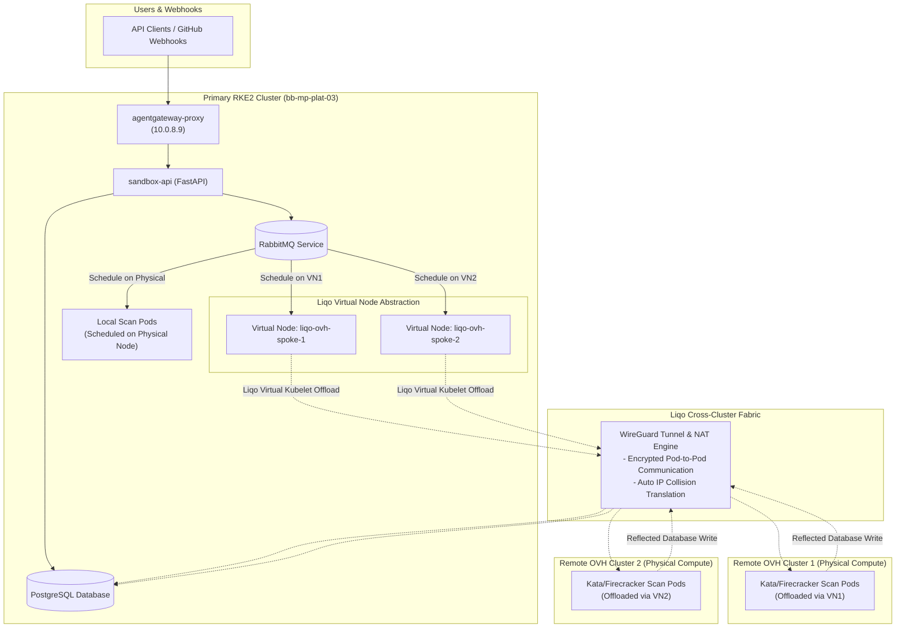
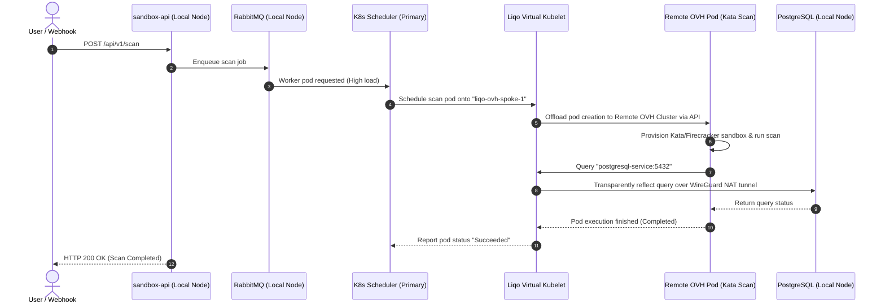

# Liqo Multi-Cluster: Virtual Node Topology & Automated Pod Offloading

> **Core Architecture Principle:** Peer independent Kubernetes clusters into a **single unified virtual cluster** without installing complex policy engines (no Karmada, no OCM).
>
> Remote Kubernetes clusters are presented to your primary control plane as **Virtual Nodes**. To Kubernetes and standard schedulers, remote clusters look like standard high-capacity worker nodes (`node-ovh-spoke-1`).
>
> **Application Impact:** **Zero code or configuration changes.** Your FastAPI `sandbox-api`, Python workers (`consumer.py`), RabbitMQ queues, and PostgreSQL databases connect using standard Kubernetes DNS service names (`rabbitmq-service:5672`, `postgresql-service:5432`). You deploy manifests to a single Kubernetes cluster as usual.

---

## Table of Contents

1. [Executive Summary & Why Liqo Wins](#1-executive-summary--why-liqo-wins)
2. [Deep Architectural & Component Breakdown](#2-deep-architectural--component-breakdown)
3. [Architecture & Topology Diagrams](#3-architecture--topology-diagrams)
4. [Prerequisites & Cluster Requirements](#4-prerequisites--cluster-requirements)
5. [Step-by-Step Installation & Configuration Guide](#5-step-by-step-installation--configuration-guide)
6. [01-Sandbox Namespace Offloading & Placement](#6-01-sandbox-namespace-offloading--placement)
7. [Traffic Execution & Sequence Flow](#7-traffic-execution--sequence-flow)
8. [Resource & Network Reflection Mechanics](#8-resource--network-reflection-mechanics)
9. [Verification & Troubleshooting Handbook](#9-verification--troubleshooting-handbook)

---

## 1. Executive Summary & Why Liqo Wins

Traditional multi-cluster solutions require managing multiple Kubernetes API endpoints, writing custom placement policies (`PropagationPolicy`), and maintaining complex hub-and-spoke state.

**Liqo abstracts remote clusters into Virtual Nodes inside your primary cluster:**

```
┌─────────────────────────────────────────────────────────────────────────────┐
│                       PRIMARY RKE2 KUBERNETES CONTROL PLANE                 │
│              (You interact with 1 single API Server via kubectl)            │
└──────────────────────────────────────┬──────────────────────────────────────┘
                                       │
            ┌──────────────────────────┴──────────────────────────┐
            ▼                                                     ▼
┌───────────────────────┐                             ┌───────────────────────┐
│   PHYSICAL NODE       │                             │   LIQO VIRTUAL NODE   │
│   (bb-mp-plat-03)     │                             │   (liqo-ovh-spoke-1)  │
│   - sandbox-api       │                             │   - Kata Scan Pods    │
│   - RabbitMQ          │                             │   - Remote Workers    │
│   - PostgreSQL        │                             │                       │
└───────────────────────┘                             └───────────┬───────────┘
                                                                  │
                                                        WireGuard │ Tunnel
                                                                  ▼
                                                      ┌───────────────────────┐
                                                      │  REMOTE OVH CLUSTER   │
                                                      │  (Physical Compute)   │
                                                      └───────────────────────┘
```

### Key Advantages of Liqo for `01-Sandbox`:

1. **Single Control Plane Management:** You deploy Helm charts and Kubernetes manifests to **one** cluster. The Kubernetes scheduler handles placing pods onto physical or virtual nodes.
2. **Automatic IP Collision Resolution:** Unlike standard network meshes that fail if Pod CIDRs overlap, Liqo includes built-in NAT translation. It connects clusters with overlapping `10.42.0.0/16` subnets automatically!
3. **Selective Namespace Offloading:** You control granularly which namespaces (e.g. `opensandbox-system`) offload pods to remote clusters, while database and control components remain local.
4. **No Custom Placement YAMLs:** Standard Kubernetes `nodeSelector`, `tolerations`, and `nodeAffinity` rules work out of the box.

---

## 2. Deep Architectural & Component Breakdown

Liqo operates via four primary architectural subsystems running on each peered cluster:

```
                  PRIMARY CLUSTER                                     REMOTE CLUSTER
┌──────────────────────────────────────────────┐┌──────────────────────────────────────────────┐
│                                              ││                                              │
│  ┌────────────────┐      ┌────────────────┐  ││  ┌────────────────┐      ┌────────────────┐  │
│  │ sandbox-api    │      │ Virtual Node   │  ││  │ Actual Pod     │      │ Actual Pod     │  │
│  └───────┬────────┘      └───────┬────────┘  ││  └───────▲────────┘      └───────▲────────┘  │
│          │                       │           ││          │                       │           │
│ ─────────┼───────────────────────┼────────── ││ ─────────┼───────────────────────┼────────── │
│          ▼                       ▼           ││          │                       │           │
│  ┌────────────────────────────────────────┐  ││  ┌───────┴────────────────────────┴───────┐  │
│  │      Liqo Resource Reflector           │◄═┼┼═►│       Liqo Remote Controller           │  │
│  └───────────────────┬────────────────────┘  ││  └───────────────────┬────────────────────┘  │
│                      │                       ││                      │                       │
│                      ▼                       ││                      ▼                       │
│  ┌────────────────────────────────────────┐  ││  ┌────────────────────────────────────────┐  │
│  │     Liqo Network Fabric (WireGuard)    │◄═┼┼═►│     Liqo Network Fabric (WireGuard)    │  │
│  └────────────────────────────────────────┘  ││  └────────────────────────────────────────┘  │
│                                              ││                                              │
└──────────────────────────────────────────────┘└──────────────────────────────────────────────┘
```

### Subsystems Explained

#### 1. Virtual Kubelet
* An implementation of the Kubernetes Virtual Kubelet interface.
* **Role:** Registers as a node (`liqo-ovh-spoke-1`) in the primary cluster. When the primary Kubernetes scheduler assigns a pod to this node, the Virtual Kubelet intercepts the create request and forwards it to the remote cluster's API server.

#### 2. Resource Reflector
* Synchronizes essential Kubernetes objects between the primary and remote cluster.
* **Role:** Replicates `Pods`, `Services`, `ConfigMaps`, `Secrets`, and `Endpoints`. When a service is created in the primary cluster, the reflector ensures remote worker pods on virtual nodes can discover and connect to it.

#### 3. Network Fabric & IPAM
* Establishes eBPF-assisted **WireGuard** tunnels between clusters (UDP port 51820).
* **Role:** Manages dynamic NAT mapping. If both primary and remote clusters use `10.42.0.0/16`, Liqo translates pod IPs on the fly so cross-cluster communication never collides.

#### 4. Authentication Engine
* Handles mutual TLS handshake and cluster registration token exchange during `liqoctl peer`.

---

## 3. Architecture & Topology Diagrams

### 3.1 End-to-End Topology with Liqo Virtual Nodes



---

## 4. Prerequisites & Cluster Requirements

### 4.1 Cluster Requirements

1. **Primary Cluster:** Kubernetes v1.24+ (RKE2, K3s, or standard K8s).
2. **Remote Cluster(s):** Kubernetes v1.24+ (OVH Managed Kubernetes, RKE2, or VPS K8s).
3. **CLI Installation:** `liqoctl` binary installed on your workstation.

### 4.2 Firewall & Network Port Requirements

Ensure the following port is open on the remote cluster nodes:

| Port / Protocol | Direction | Description |
| :--- | :--- | :--- |
| **`51820/UDP`** | Inbound / Outbound | Liqo WireGuard VPN Tunnel Endpoint |
| **`6443/TCP`** | Outbound | Access to target Cluster API Servers |

---

## 5. Step-by-Step Installation & Configuration Guide

### Step 1: Install `liqoctl` CLI

```bash
curl --fail -sS https://get.liqo.io | bash
sudo mv liqoctl /usr/local/bin/
liqoctl version
```

### Step 2: Install Liqo on Primary Cluster (`rke2-local`)

Install Liqo control plane components onto your primary RKE2 cluster:

```bash
liqoctl install k3s \
  --context default \
  --cluster-name rke2-local
```

### Step 3: Install Liqo on Remote Cluster (`ovh-spoke-1`)

Install Liqo onto the remote OVH cluster:

```bash
liqoctl install k3s \
  --context ovh-spoke-1 \
  --cluster-name ovh-spoke-1
```

### Step 4: Peer the Clusters

Generate authentication token from remote cluster and run peer command on primary cluster:

```bash
# 1. Generate peer command on Remote Cluster
PEER_CMD=$(liqoctl generate peer-command --context ovh-spoke-1)

# 2. Execute peer command on Primary Cluster
eval $PEER_CMD --context default
```

### Step 5: Verify Virtual Node Creation

Check that the remote cluster is now listed as a **Virtual Node** in your primary cluster:

```bash
kubectl --context default get nodes
```

**Output:**
```text
NAME                 STATUS   ROLES                   AGE   VERSION
bb-mp-plat-03        Ready    control-plane,master   10d   v1.28.4+rke2r1
liqo-ovh-spoke-1     Ready    agent                   2m    v1.28.4 (virtual-kubelet)
```

---

## 6. 01-Sandbox Namespace Offloading & Placement

To make standard deployments run across both physical and virtual nodes, enable namespace offloading.

### Step 1: Offload the `opensandbox-system` Namespace

```bash
liqoctl offload namespace opensandbox-system \
  --context default \
  --pod-offloading-strategy LocalAndRemote \
  --naming-strategy Same
```

### 6.1 Offloading Strategies Explained

| Strategy Flag | Behavior for `01-Sandbox` |
| :--- | :--- |
| **`LocalAndRemote`** | Schedulers spread pods across local physical nodes AND remote virtual nodes. |
| **`RemoteOnly`** | All pods in namespace are forced onto remote virtual nodes (saves local CPU/RAM). |
| **`LocalOnly`** | Pods run exclusively on physical local nodes (used for PostgreSQL database). |

### 6.2 Application Manifest Examples with Node Placement

#### Primary Services Manifest (`control-plane-apps.yaml`)

Forces control components (PostgreSQL, RabbitMQ, FastAPI) to stay on physical local nodes:

```yaml
apiVersion: apps/v1
kind: Deployment
metadata:
  name: sandbox-api
  namespace: opensandbox-system
spec:
  replicas: 2
  template:
    metadata:
      labels:
        app: sandbox-api
    spec:
      nodeSelector:
        # Ensures API server stays on physical local machine
        node-role.kubernetes.io/master: "true"
      containers:
        - name: sandbox-api
          image: 01security/sandbox-api:latest
          env:
            - name: RABBITMQ_HOST
              value: "rabbitmq-service.opensandbox-system.svc.cluster.local"
```

#### Worker Pod Placement (`kata-worker-deployment.yaml`)

Allows Kata scan worker pods to be scheduled onto remote Virtual Nodes dynamically:

```yaml
apiVersion: apps/v1
kind: Deployment
metadata:
  name: sandbox-scan-worker
  namespace: opensandbox-system
spec:
  replicas: 10
  template:
    metadata:
      labels:
        app: scan-worker
    spec:
      affinity:
        nodeAffinity:
          preferredDuringSchedulingIgnoredDuringExecution:
            - weight: 100
              preference:
                matchExpressions:
                  - key: type
                    operator: In
                    values:
                      - virtual-node
      tolerations:
        - key: "virtual-node.liqo.io/building"
          operator: "Exists"
          effect: "NoSchedule"
      containers:
        - name: scanner
          image: 01security/repo-scanner:latest
          resources:
            requests:
              cpu: "500m"
              memory: "512Mi"
```

---

## 7. Traffic Execution & Sequence Flow

This diagram illustrates how a code scan job executes on a Liqo Virtual Node **without code changes**:



---

## 8. Resource & Network Reflection Mechanics

When a pod runs on a Liqo Virtual Node, Liqo transparently handles resource reflection:

```
PRIMARY CLUSTER                                      REMOTE CLUSTER
┌────────────────────────┐                          ┌────────────────────────┐
│ Secret: db-credentials │───── Reflected Secret───►│ Secret: db-credentials │
│ ConfigMap: app-config  │───── Reflected Config───►│ ConfigMap: app-config  │
│ Service: postgresql    │───── Reflected Endpoint─►│ Endpoint: 10.250.0.15   │
└────────────────────────┘                          └────────────────────────┘
```

1. **Services & Endpoints:** A synthetic service endpoint is registered inside the remote cluster pointing to the Liqo WireGuard IP of the primary cluster's PostgreSQL database.
2. **Secrets & ConfigMaps:** Automatically synchronized so offloaded worker pods can access API keys and environment configs without manual copying.
3. **Storage Volumes:** PersistentVolumeClaims can be reflected using Liqo's storage fabric (`liqo-storage-class`).

---

## 9. Verification & Troubleshooting Handbook

### 9.1 Diagnostic Commands Quick Reference

```bash
# 1. Check overall Liqo peering status
liqoctl status --context default

# 2. Check namespace offloading health
liqoctl status namespace opensandbox-system --context default

# 3. View virtual node capacity and metrics
kubectl describe node liqo-ovh-spoke-1

# 4. Check active WireGuard tunnels
kubectl -n liqo get pods -l app.kubernetes.io/component=network-gateway
```

### 9.2 Common Troubleshooting Scenarios & Fixes

#### Issue 1: Peering fails (`Connection Refused on port 51820`)
* **Root Cause:** Firewall blocking UDP port `51820`.
* **Fix:** Open UDP 51820 in OVH cloud firewall:
  ```bash
  sudo ufw allow 51820/udp
  ```

#### Issue 2: Offloaded Pods stuck in `ContainerCreating`
* **Root Cause:** Image pull failure or secret reflection delay on remote cluster.
* **Fix:** Inspect remote pod status directly using `liqoctl`:
  ```bash
  kubectl get pods -n opensandbox-system -o wide
  # View events for offloaded pod
  kubectl describe pod <pod-name> -n opensandbox-system
  ```

#### Issue 3: Virtual Node status shows `NotReady`
* **Root Cause:** Virtual Kubelet controller lost connection to remote API server.
* **Fix:** Restart Liqo controller manager pod:
  ```bash
  kubectl -n liqo rollout restart deployment/liqo-controller-manager
  ```
