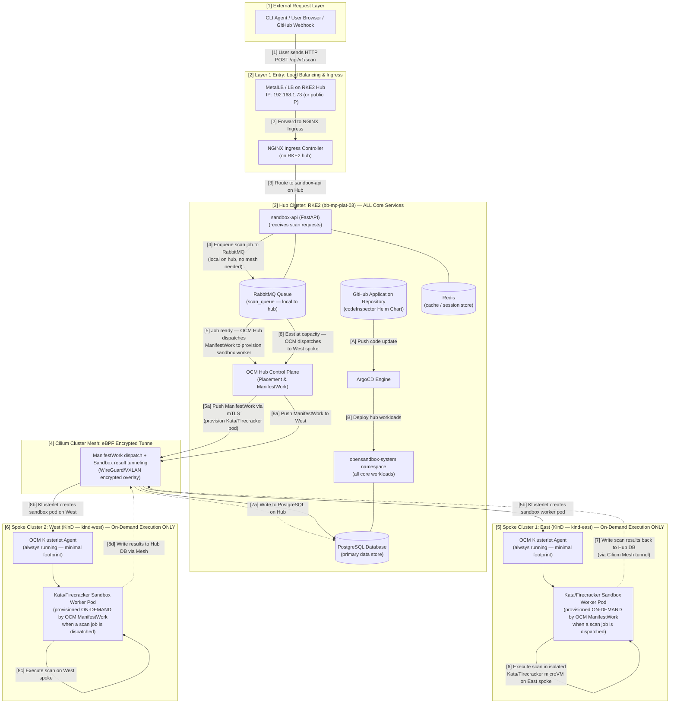
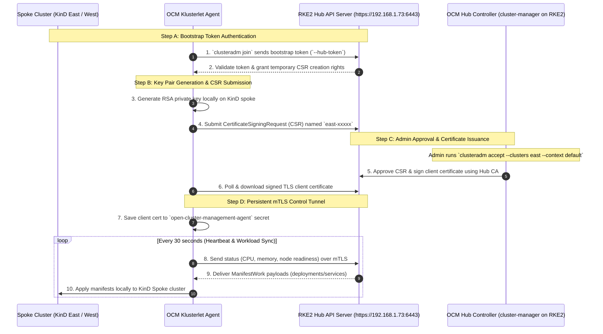
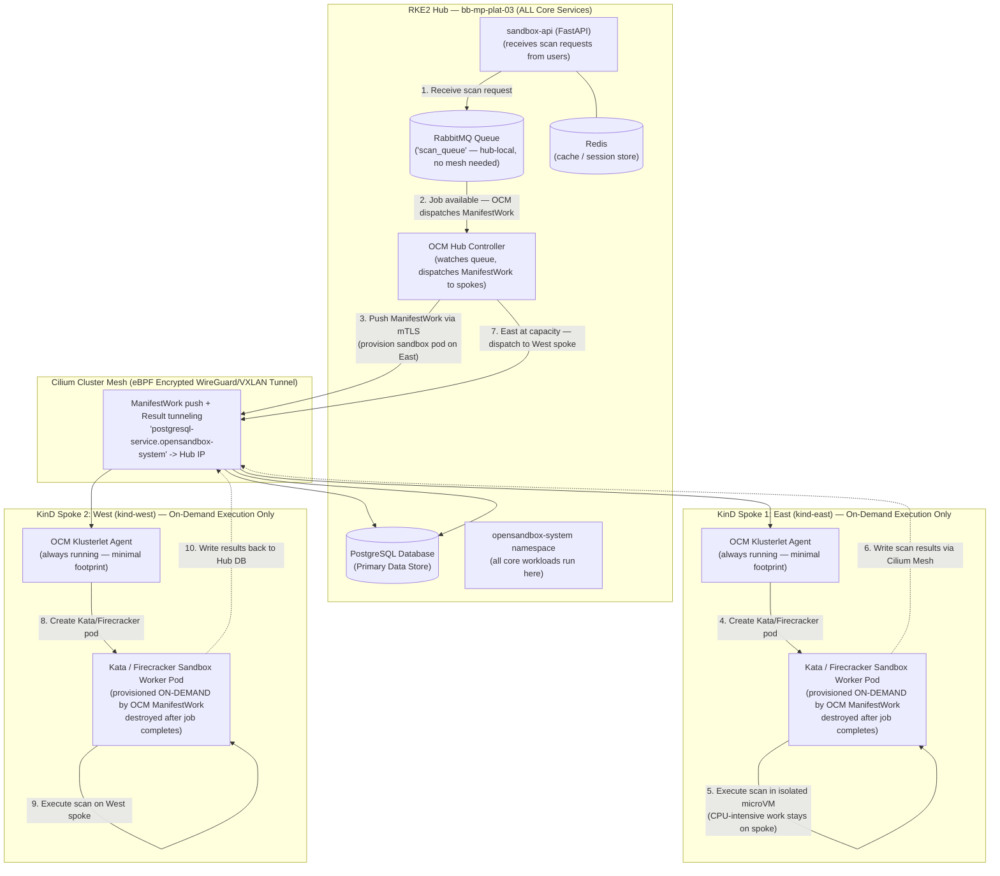
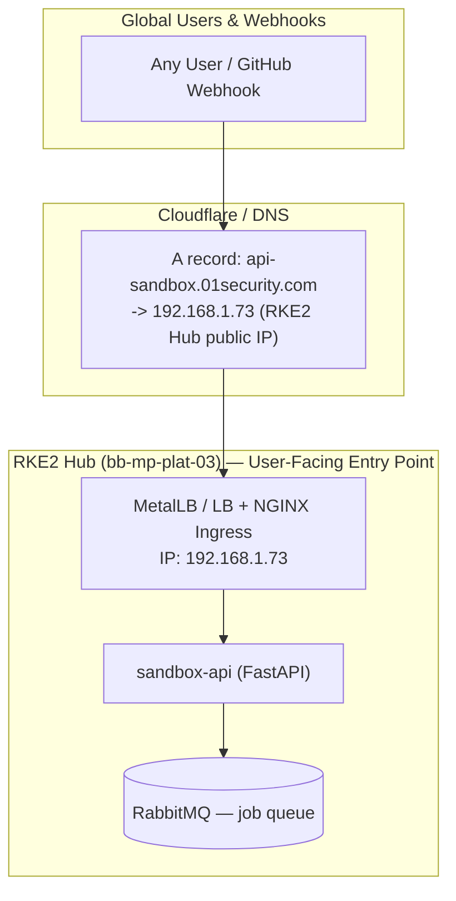
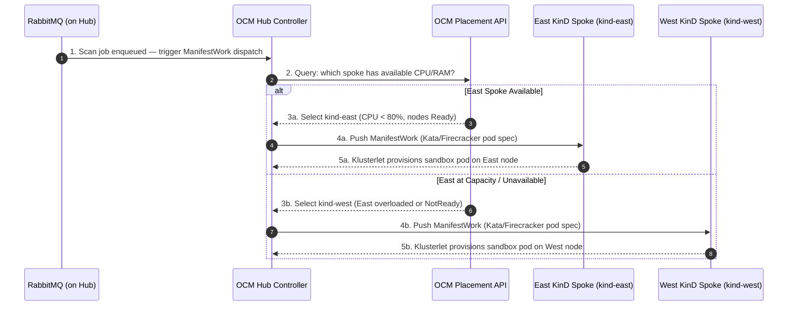

# Manual Setup Guide: k8s-multicluster-handbook (No Script)

> **Goal:** Use the existing **RKE2 cluster as the OCM Hub**, and create **east** and **west** as KinD spoke clusters — step by step, without running the bootstrap script.
>
> **Topology:**
> - **Hub** → RKE2 cluster on `bb-mp-plat-03` (context: `default`) — OCM + ArgoCD + **all core application services** live here (`sandbox-api`, `PostgreSQL`, `Redis`, `RabbitMQ`, `opensandbox-system`)
> - **East** → KinD spoke cluster (context: `kind-east`) — **on-demand sandbox execution only** (Kata/Firecracker workers, provisioned by OCM per job)
> - **West** → KinD spoke cluster (context: `kind-west`) — **on-demand sandbox execution only** (Kata/Firecracker workers, provisioned by OCM per job)
>
> **Your environment:**
> - RKE2 running on local PC (`bb-mp-plat-03`, context: `default`) — **this IS the hub**
> - Cilium + MetalLB already on RKE2 — these are SEPARATE from KinD Cilium/MetalLB
> - `KUBECONFIG=~/.kube/config` (after symlink fix)
> - `kind` installed, Docker running

---

## Before You Start: Prerequisites Check

```bash
# 1. Confirm KUBECONFIG points to user-owned file (NOT /etc/rancher/...)
echo $KUBECONFIG
# Must be: /home/berrybytes/.kube/config

# If still wrong, fix it now:
export KUBECONFIG=~/.kube/config

# 2. Confirm RKE2 is reachable
kubectl --context default get nodes
# bb-mp-plat-03   Ready   ...

# 3. Confirm KinD is installed
kind version

# 4. Confirm Docker is running
docker info | grep "Server Version"

# 5. Confirm Helm is installed
helm version --short

# 6. Confirm Cilium CLI is installed
cilium version

# 7. Confirm clusteradm is installed (for OCM)
clusteradm version
# If not installed:
# curl -L https://raw.githubusercontent.com/open-cluster-management-io/clusteradm/main/install.sh | bash
```

---

## Phase 1: Create the Two KinD Spoke Clusters

> **Note:** The RKE2 cluster (`bb-mp-plat-03`, context: `default`) is already running and will serve as the **OCM Hub**. You only need to create the two spoke clusters here.

Each KinD spoke cluster needs:
- Unique Pod CIDR (so Cilium Cluster Mesh doesn't confuse pod IPs)
- Unique Service CIDR
- Unique API server port (both share the same host machine)
- `disableDefaultCNI: true` — we install Cilium manually in Phase 3

### 1A — Create the East Cluster (Spoke 1)

```bash
cat > /tmp/east.config <<EOF
kind: Cluster
apiVersion: kind.x-k8s.io/v1alpha4
networking:
  podSubnet: "10.16.0.0/16"
  serviceSubnet: "10.17.0.0/16"
  disableDefaultCNI: true
  apiServerAddress: "127.0.0.1"
  apiServerPort: 7443
nodes:
- role: control-plane
  kubeadmConfigPatches:
  - |
    kind: ClusterConfiguration
    apiServer:
      certSANs:
      - "127.0.0.1"
      - "192.168.1.73"
EOF

kind create cluster --name east --config /tmp/east.config
```

Verify:
```bash
kubectl --context kind-east get nodes
# east-control-plane   NotReady   control-plane   ...
# NotReady is EXPECTED — Cilium not installed yet
```

---

### 1B — Create the West Cluster (Spoke 2)

```bash
cat > /tmp/west.config <<EOF
kind: Cluster
apiVersion: kind.x-k8s.io/v1alpha4
networking:
  podSubnet: "10.18.0.0/16"
  serviceSubnet: "10.19.0.0/16"
  disableDefaultCNI: true
  apiServerAddress: "127.0.0.1"
  apiServerPort: 8443
nodes:
- role: control-plane
  kubeadmConfigPatches:
  - |
    kind: ClusterConfiguration
    apiServer:
      certSANs:
      - "127.0.0.1"
      - "192.168.1.73"
EOF

kind create cluster --name west --config /tmp/west.config
```

Verify both spoke clusters exist:
```bash
kind get clusters
# east
# west

kubectl config get-contexts
# kind-east, kind-west should both be present
# Your RKE2 "default" context is STILL there — that is the HUB
```

---

## Phase 2: Install MCS API CRDs on All Clusters

MCS CRDs provide ServiceExport and ServiceImport — the Kubernetes standard for
announcing that a service should be shared across clusters.

Install on the **RKE2 hub** and **both KinD spokes**:

```bash
for ctx in default kind-east kind-west; do
  echo "==> Installing MCS CRDs on $ctx"

  kubectl apply \
    -f https://raw.githubusercontent.com/kubernetes-sigs/mcs-api/master/config/crd/multicluster.x-k8s.io_serviceexports.yaml \
    --context $ctx

  kubectl apply \
    -f https://raw.githubusercontent.com/kubernetes-sigs/mcs-api/master/config/crd/multicluster.x-k8s.io_serviceimports.yaml \
    --context $ctx
done
```

Verify on the RKE2 hub:
```bash
kubectl --context default get crd | grep multicluster
# serviceexports.multicluster.x-k8s.io
# serviceimports.multicluster.x-k8s.io
```

---

## Phase 3: Install Cilium CNI on Each KinD Spoke Cluster

> **Note:** The RKE2 hub cluster already has Cilium installed. You only need to install Cilium on the two KinD spoke clusters here.

Each spoke cluster gets Cilium with a UNIQUE cluster.id and cluster.name.
This is what Cilium Cluster Mesh uses to identify which cluster a service belongs to.

```bash
helm repo add cilium https://helm.cilium.io/
helm repo update
```

> The RKE2 cluster should already have `cluster.name=rke2-hub` and `cluster.id=1` set in its Cilium configuration. Verify with:
> ```bash
> kubectl --context default -n kube-system get cm cilium-config -o yaml | grep -E 'cluster-name|cluster-id'
> ```
> If not set, upgrade the existing RKE2 Cilium installation to add those values before continuing.

### 3A — East: cluster.name=kind-east, cluster.id=2

```bash
helm install cilium cilium/cilium \
  --version 1.17.3 \
  --namespace kube-system \
  --kube-context kind-east \
  --set cluster.name=kind-east \
  --set cluster.id=2 \
  --set operator.replicas=1 \
  --set clustermesh.useAPIServer=true \
  --set clustermesh.maxConnectedClusters=255 \
  --set clustermesh.enableMCSAPISupport=true \
  --set ipam.mode=kubernetes \
  --set kubeProxyReplacement=true \
  --set securityContext.capabilities.ciliumAgent="{CHOWN,KILL,NET_ADMIN,NET_RAW,IPC_LOCK,SYS_ADMIN,SYS_RESOURCE,DAC_OVERRIDE,FOWNER,SETGID,SETUID}" \
  --set securityContext.capabilities.cleanCiliumState="{NET_ADMIN,SYS_ADMIN,SYS_RESOURCE}" \
  --set cgroup.autoMount.enabled=false \
  --set cgroup.hostRoot=/sys/fs/cgroup \
  --set k8sServiceHost=east-control-plane \
  --set k8sServicePort=6443

kubectl --context kind-east get nodes
# east-control-plane   Ready   control-plane   ...
```

### 3B — West: cluster.name=kind-west, cluster.id=3

```bash
helm install cilium cilium/cilium \
  --version 1.17.3 \
  --namespace kube-system \
  --kube-context kind-west \
  --set cluster.name=kind-west \
  --set cluster.id=3 \
  --set operator.replicas=1 \
  --set clustermesh.useAPIServer=true \
  --set clustermesh.maxConnectedClusters=255 \
  --set clustermesh.enableMCSAPISupport=true \
  --set ipam.mode=kubernetes \
  --set kubeProxyReplacement=true \
  --set securityContext.capabilities.ciliumAgent="{CHOWN,KILL,NET_ADMIN,NET_RAW,IPC_LOCK,SYS_ADMIN,SYS_RESOURCE,DAC_OVERRIDE,FOWNER,SETGID,SETUID}" \
  --set securityContext.capabilities.cleanCiliumState="{NET_ADMIN,SYS_ADMIN,SYS_RESOURCE}" \
  --set cgroup.autoMount.enabled=false \
  --set cgroup.hostRoot=/sys/fs/cgroup \
  --set k8sServiceHost=west-control-plane \
  --set k8sServicePort=6443
```

> **Note on `--set operator.replicas=1`:** Single-node clusters require 1 operator replica. The default is 2 replicas with pod anti-affinity, which causes a second replica to stay `Pending` on single-node dev environments.

Verify Cilium health on all clusters:
```bash
cilium status --context default      # RKE2 hub (already running)
cilium status --context kind-east
cilium status --context kind-west
```

---

## Phase 4: Install MetalLB on Each KinD Spoke Cluster

> **Note:** MetalLB is already installed on the RKE2 hub cluster. You only need to install MetalLB on the two KinD spoke clusters here.

MetalLB lets LoadBalancer services get real IPs inside KinD.
KinD clusters use Docker bridge networks (172.18.x.x / 172.19.x.x range typically).

```bash
# Install MetalLB on spoke clusters only
for ctx in kind-east kind-west; do
  echo "==> MetalLB install on $ctx"
  kubectl apply \
    -f https://raw.githubusercontent.com/metallb/metallb/v0.13.5/config/manifests/metallb-native.yaml \
    --context $ctx

  kubectl wait --for=condition=Available deployment/controller \
    -n metallb-system --timeout=120s --context $ctx
  echo "==> MetalLB ready on $ctx"
done
```

Find your KinD Docker network subnet:
```bash
docker network inspect kind -f '{{range .IPAM.Config}}{{.Subnet}} {{end}}'
# Output: fc00:f853:ccd:e793::/64 172.19.0.0/16  <-- IPv4 Subnet is 172.19.0.0/16
```

Apply IP pools (use distinct `/24` ranges from your Docker subnet for each spoke):
```bash
# East Cluster Pool (172.19.201.0/24)
KUBECONFIG=~/.kube/config kubectl apply --context kind-east -f - <<EOF
apiVersion: metallb.io/v1beta1
kind: IPAddressPool
metadata:
  name: kind-pool
  namespace: metallb-system
spec:
  addresses:
  - 172.19.201.0/24
---
apiVersion: metallb.io/v1beta1
kind: L2Advertisement
metadata:
  name: kind-l2
  namespace: metallb-system
EOF

# West Cluster Pool (172.19.202.0/24)
KUBECONFIG=~/.kube/config kubectl apply --context kind-west -f - <<EOF
apiVersion: metallb.io/v1beta1
kind: IPAddressPool
metadata:
  name: kind-pool
  namespace: metallb-system
spec:
  addresses:
  - 172.19.202.0/24
---
apiVersion: metallb.io/v1beta1
kind: L2Advertisement
metadata:
  name: kind-l2
  namespace: metallb-system
EOF
```

---

## Phase 5: Install NGINX Ingress Controller

> **Note:** Install NGINX Ingress on the RKE2 hub and both KinD spokes. The RKE2 hub may already have an Ingress controller; verify before installing.

```bash
helm repo add ingress-nginx https://kubernetes.github.io/ingress-nginx
helm repo update

# Install on all three clusters (hub + spokes)
for ctx in default kind-east kind-west; do
  helm upgrade --install ingress-nginx ingress-nginx/ingress-nginx \
    --namespace ingress-nginx \
    --create-namespace \
    --kube-context $ctx \
    --set controller.service.type=LoadBalancer \
    --wait --timeout=3m
  echo "==> NGINX Ingress ready on $ctx"
done
```

Verify ingress gets an external IP (from MetalLB on KinD, from existing LB on RKE2):
```bash
kubectl --context default get svc -n ingress-nginx       # RKE2 hub
kubectl --context kind-east get svc -n ingress-nginx
kubectl --context kind-west get svc -n ingress-nginx
# ingress-nginx-controller  LoadBalancer  ...  <EXTERNAL-IP>  ...
```

---

## Phase 6: Install ArgoCD on the RKE2 Hub

ArgoCD runs on the **RKE2 hub** and manages deployments to spokes via OCM addon.

```bash
kubectl create namespace argocd --context default

# Use --server-side to prevent annotation size limit warnings on large CRDs
kubectl apply --server-side \
  -n argocd \
  -f https://raw.githubusercontent.com/argoproj/argo-cd/stable/manifests/install.yaml \
  --context default

# Wait for server to be ready (~2-3 min)
kubectl wait --for=condition=Available deployment/argocd-server \
  -n argocd --timeout=300s --context default
```

Access:
```bash
# Get admin password
kubectl --context default -n argocd get secret argocd-initial-admin-secret \
  -o jsonpath="{.data.password}" | base64 -d && echo

# Port-forward in a new terminal
kubectl --context default port-forward svc/argocd-server -n argocd 8080:443
# Open: https://localhost:8080 | admin / <password above>
```

---

## Phase 7: Initialize OCM Hub on RKE2

OCM is the multi-cluster control plane. We install it on the **RKE2 cluster**, which becomes the hub that registers and manages the east and west KinD spoke clusters.

```bash
clusteradm init --wait --context default
```

Output will include a token like:
```
clusteradm join --hub-token eyJhbGc... --hub-apiserver https://192.168.1.73:6443 ...
```

> **Note on the hub API server address:** The RKE2 API server listens on port `6443`. The `clusteradm get token` command will display your host's LAN IP (`192.168.1.73:6443`). Use this IP when joining KinD spoke clusters — do **NOT** use `127.0.0.1` because inside a KinD Docker container, `127.0.0.1` refers to the container's own localhost, not the host machine.

Verify OCM is running on the RKE2 hub:
```bash
kubectl --context default get pods -n open-cluster-management
# cluster-manager-...   Running
```

---

## Phase 8: Join East and West Spokes to the RKE2 OCM Hub

> **Important Note on `--hub-apiserver`:**
> Use your host machine's LAN IP (e.g. `192.168.1.73:6443`) as shown in `clusteradm get token`.
> Do **NOT** use `127.0.0.1:6443` because `127.0.0.1` inside a KinD spoke cluster (Docker container)
> refers to the container's own localhost, which causes `connection refused`.

```bash
# Get the full join command generated by clusteradm (it includes your host IP):
clusteradm get token --context default
```

Example output:
`clusteradm join --hub-token <TOKEN> --hub-apiserver https://192.168.1.73:6443 --cluster-name <cluster_name>`

**Join East:**
```bash
TOKEN=$(KUBECONFIG=~/.kube/config clusteradm get token --context default | grep -o 'token=[^ ]*' | cut -d= -f2)

KUBECONFIG=~/.kube/config clusteradm join \
  --hub-token $TOKEN \
  --hub-apiserver https://192.168.1.73:6443 \
  --cluster-name east \
  --context kind-east \
  --force-internal-endpoint-lookup
```

**Join West:**
```bash
KUBECONFIG=~/.kube/config clusteradm join \
  --hub-token $TOKEN \
  --hub-apiserver https://192.168.1.73:6443 \
  --cluster-name west \
  --context kind-west \
  --force-internal-endpoint-lookup
```

**Wait 10-15 seconds for CertificateSigningRequests (CSRs) to register, then accept both from the RKE2 hub:**
```bash
sleep 15
KUBECONFIG=~/.kube/config clusteradm accept --clusters east,west --context default
```

**Verify both spoke clusters are Joined and Available:**
```bash
KUBECONFIG=~/.kube/config kubectl --context default get managedclusters
# NAME   HUB ACCEPTED   JOINED   AVAILABLE   AGE
# east   true           True     True        30s
# west   true           True     True        30s
```

---

## Phase 9: Label Clusters for Placement Policies

All `ManagedCluster` labeling is performed **on the RKE2 hub** (`--context default`).

```bash
# Create ClusterSet to group east + west spokes
kubectl apply --context default -f - <<EOF
apiVersion: cluster.open-cluster-management.io/v1beta2
kind: ManagedClusterSet
metadata:
  name: location-es
EOF

# Label both spoke clusters
kubectl --context default label managedcluster east \
  cluster.open-cluster-management.io/clusterset=location-es \
  location=east --overwrite

kubectl --context default label managedcluster west \
  cluster.open-cluster-management.io/clusterset=location-es \
  location=west --overwrite

kubectl --context default get managedclusters --show-labels
```

---

## Phase 10: Enable ArgoCD Addon on Spoke Clusters

This pushes an ArgoCD agent to each spoke so the **RKE2 hub's** ArgoCD can deploy there.

```bash
# Switch to the RKE2 hub context
kubectl config use-context default

clusteradm install hub-addon --names argocd
clusteradm addon enable --names argocd --clusters east,west

# Wait and verify
kubectl --context default get managedclusteraddons -A
# east   argocd   True
# west   argocd   True

kubectl --context kind-east get pods -n argocd
kubectl --context kind-west get pods -n argocd
```

---

## Phase 11: Connect Cilium Cluster Mesh

Final networking step — after this, services in any cluster are reachable from
any other cluster, with local-first routing.

```bash
# Enable cluster mesh on the RKE2 hub and both KinD spokes
cilium clustermesh enable --context default
cilium clustermesh enable --context kind-east
cilium clustermesh enable --context kind-west

# Wait for mesh API servers to come up
cilium clustermesh status --context default   --wait
cilium clustermesh status --context kind-east --wait
cilium clustermesh status --context kind-west --wait

# Connect all clusters bidirectionally
cilium clustermesh connect --context default  --destination-context kind-east
cilium clustermesh connect --context default  --destination-context kind-west
cilium clustermesh connect --context kind-east --destination-context kind-west
```

Verify:
```bash
cilium clustermesh status --context default
# ClusterMesh: 2/2 remote clusters ready
# ✅ Cluster kind-east is connected
# ✅ Cluster kind-west is connected
```

---

## Final Health Check: All Components

```bash
echo "=== 1. KinD Spoke Clusters ==="
kind get clusters
# east
# west

echo "=== 2. RKE2 Hub Node Ready ==="
kubectl --context default get nodes
# bb-mp-plat-03   Ready   ...

echo "=== 3. KinD Spoke Nodes Ready ==="
for ctx in kind-east kind-west; do
  echo "--- $ctx ---"
  kubectl --context $ctx get nodes
done

echo "=== 4. OCM Managed Clusters (on RKE2 Hub) ==="
kubectl --context default get managedclusters
# NAME   HUB ACCEPTED   JOINED   AVAILABLE
# east   true           True     True
# west   true           True     True

echo "=== 5. ArgoCD Addons on Spokes ==="
kubectl --context default get managedclusteraddons -A

echo "=== 6. Cilium Cluster Mesh Status (from Hub) ==="
cilium clustermesh status --context default

echo "=== 7. OCM Hub System Pods ==="
kubectl --context default get pods -n open-cluster-management
kubectl --context default get pods -n opensandbox-system | head -10
```

---

# 🔬 In-Depth Component Architecture & Technical Purpose Guide

This section explains the exact technical role, inner workings, and purpose of **every single component** configured across the 11 phases of the setup guide.

---

## 1. Component Technical Breakdown

### Component 1: KinD (Kubernetes in Docker) — Spoke Clusters Only
- **Phase Installed:** Phase 1
- **Layer:** Infrastructure / Node Runtime
- **Technical Purpose:**
  - Emulates full multi-cluster Kubernetes spoke environments locally on a single machine, running alongside the RKE2 hub.
  - Runs Kubernetes control-plane components (`kube-apiserver`, `etcd`, `kube-controller-manager`, `kube-scheduler`) and worker nodes inside Docker containers using `containerd`.
  - **Network Isolation:** Configured with isolated Pod CIDRs (`10.16.0.0/16`, `10.18.0.0/16`) and custom host API server ports (`7443`, `8443`) so both spoke clusters run on the same physical host without IP/port collisions with the RKE2 hub (which uses port `6443`).

---

### Component 2: MCS API CRDs (`multicluster.x-k8s.io`)
- **Phase Installed:** Phase 2
- **Layer:** Kubernetes SIG Multi-Cluster Standard API
- **Technical Purpose:**
  - Installs the CNCF Kubernetes SIG standard Custom Resource Definitions: `ServiceExport` and `ServiceImport`.
  - **`ServiceExport`:** Declares that a Service (e.g. `rabbitmq-service`) should be made accessible outside its local cluster.
  - **`ServiceImport`:** Automatically instantiated by Cilium on remote clusters to register virtual endpoints pointing across the cluster boundary.

---

### Component 3: Cilium CNI (eBPF Kernel Networking)
- **Phase Installed:** Phase 3 (spokes) / Pre-existing (hub)
- **Layer:** CNI / Data Plane
- **Technical Purpose:**
  - Replaces traditional `iptables`/`kube-proxy` with **eBPF (Extended Berkeley Packet Filter)** programs loaded directly into Linux kernel sockets and traffic control (`tc`) hooks.
  - **IPAM (IP Address Management):** Allocates Pod IPs within each cluster's unique subnet.
  - **Cluster Identification:** Assigned a unique `cluster.id` (`1` for the RKE2 hub, `2` for east, `3` for west) and `cluster.name` so eBPF packet headers can identify source/destination clusters across tunnels.

---

### Component 4: MetalLB (L2 LoadBalancer Provider)
- **Phase Installed:** Phase 4
- **Layer:** Bare-Metal / VPS LoadBalancer Controller
- **Technical Purpose:**
  - In cloud providers (AWS/GCP), `Type: LoadBalancer` automatically provisions an external cloud load balancer. In bare-metal, OVH VPS, or KinD, `Type: LoadBalancer` stays stuck in `<pending>` forever.
  - **MetalLB Controller & L2Advertisement:** Listens for `Type: LoadBalancer` services and assigns IP addresses from a pre-configured pool (`172.19.200.0/24`, `172.19.201.0/24`, `172.19.202.0/24`). It responds to ARP requests on the Docker bridge network to route external traffic to node ports.

---

### Component 5: NGINX Ingress Controller
- **Phase Installed:** Phase 5
- **Layer:** Layer 7 Ingress / Reverse Proxy
- **Technical Purpose:**
  - Operates as the entry point for external HTTP/HTTPS traffic.
  - Binds to MetalLB's assigned LoadBalancer IP on port 80/443.
  - Evaluates `Ingress` rules (hostnames, HTTP paths like `/api/v1/scan`) and proxies incoming requests to internal target pods (`sandbox-api`).

---

### Component 6: ArgoCD (GitOps Engine)
- **Phase Installed:** Phase 6 (Hub Only)
- **Layer:** Continuous Delivery / Declarative GitOps
- **Technical Purpose:**
  - Acts as the single source of truth engine for application state.
  - Watches your GitHub repository storing Helm charts / Kubernetes manifests.
  - Automatically compares desired Git state against live cluster state and performs automated sync/reconcile operations.

---

### Component 7: OCM Hub Control Plane (`registration-operator` & `cluster-manager`)
- **Phase Installed:** Phase 7 (RKE2 Hub)
- **Layer:** Multi-Cluster Fleet Management (Control Plane)
- **Technical Purpose:**
  - Installed on the **RKE2 cluster** (`bb-mp-plat-03`), extending its Kubernetes API with multi-cluster management primitives (`ManagedCluster`, `Placement`, `ManifestWork`).
  - Generates bootstrap tokens and handles CertificateSigningRequest (CSR) approvals for the KinD spoke clusters.
  - Tracks real-time cluster health, capacity, and availability across all registered spokes.

---

### Component 8: OCM Klusterlet Agent (Spokes)
- **Phase Installed:** Phase 8 (KinD Spoke Clusters)
- **Layer:** Multi-Cluster Agent (Data/Management Agent)
- **Technical Purpose:**
  - Deployed on KinD spoke clusters (`east`, `west`).
  - Establishes a secure outbound mTLS connection to the RKE2 OCM Hub (`https://192.168.1.73:6443`).
  - Periodically sends heartbeats, reports cluster capabilities/labels, and executes `ManifestWork` deployment instructions sent by the Hub.

---

### Component 9: OCM `ManagedClusterSet` & `Placement` API
- **Phase Installed:** Phase 9 (Hub Only)
- **Layer:** Workload Scheduling & Policy Engine
- **Technical Purpose:**
  - **`ManagedClusterSet`:** Defines logical groupings of clusters (e.g. `location-es`).
  - **`Placement` API:** Formulates dynamic scheduling queries (e.g. *"Select 3 healthy clusters from location-es with label location=east"*). OCM generates `PlacementDecisions` which tell ArgoCD/ManifestWork where to deploy applications.

---

### Component 10: OCM ArgoCD Hub Addon (`managedclusteraddons`)
- **Phase Installed:** Phase 10
- **Layer:** GitOps-Fleet Bridge Integration
- **Technical Purpose:**
  - Bridges OCM cluster registration with ArgoCD.
  - Automatically injects registered OCM spoke cluster credentials into ArgoCD's target cluster registry (`argocd-secret`).
  - Allows ArgoCD on the Hub to deploy Helm charts directly to spoke clusters without manual cluster registration in ArgoCD.

---

### Component 11: Cilium Cluster Mesh (`clustermesh-apiserver` & eBPF Tunnels)
- **Phase Installed:** Phase 11
- **Layer:** Multi-Cluster Encrypted Overlay Network
- **Technical Purpose:**
  - Deploys `clustermesh-apiserver` on each cluster and exchanges mTLS etcd credentials across cluster boundaries.
  - Creates eBPF Encrypted Tunnels (VXLAN/WireGuard) connecting pod networks across clusters.
  - **Global Service Affinity (`service.cilium.io/affinity: local`):** Synchronizes `EndpointSlices` across clusters. Ensures a pod calling `rabbitmq-service` routes to the **local cluster pod first**, falling back to cross-cluster tunnels only if local pods are unavailable or overloaded.

---

# 📶 Numbered Architecture & Traffic Flow Diagram

The diagram below maps the complete end-to-end flow of user requests, workload distribution, and cross-cluster sandbox execution using **numbered traffic paths `[1]` through `[9]`**.

> **Key Architecture Rule:**
> - **Hub (RKE2)** → hosts all core services: `sandbox-api`, `PostgreSQL`, `Redis`, `RabbitMQ`, `opensandbox-system`, OCM, ArgoCD
> - **East/West (KinD spokes)** → host **only** on-demand Kata/Firecracker sandbox worker pods, provisioned per job by OCM `ManifestWork` — nothing else runs permanently on spokes



---

## 2. Step-by-Step Numbered Traffic Flow Breakdown

> **Architecture Rule:**
> - The **RKE2 hub** hosts ALL core services: `sandbox-api`, `PostgreSQL`, `Redis`, `RabbitMQ`, `opensandbox-system` workloads, OCM, and ArgoCD.
> - **East/West KinD spokes** are pure sandbox execution targets — only the `OCM Klusterlet Agent` runs permanently. **All other pods are provisioned on-demand** by OCM `ManifestWork` when a scan job is dispatched.

| Step | Component | Action & Technical Mechanics |
|:---|:---|:---|
| **`[1]`** | **Client / Webhook** | User or GitHub Webhook sends an HTTP `POST` request to `api-sandbox.01security.com` with repository scan parameters. |
| **`[2]`** | **MetalLB / LB on Hub** | The RKE2 hub's load balancer receives traffic on its public/LAN IP and forwards packets to NGINX Ingress running on the hub. |
| **`[3]`** | **NGINX Ingress (Hub)** | Evaluates URL path `/api/v1/scan`, performs TLS termination, and routes the HTTP request to `sandbox-api` **running on the hub cluster**. |
| **`[4]`** | **sandbox-api (FastAPI) on Hub** | Processes the scan payload, stores request metadata in **Redis** (hub-local), and enqueues the scan job to **RabbitMQ** (hub-local, no mesh needed). |
| **`[5]`** | **OCM Hub Dispatches ManifestWork** | The OCM Hub controller detects a pending job and creates a `ManifestWork` object targeting an available spoke (East or West). This pushes a Kata/Firecracker sandbox worker pod definition to the klusterlet agent on the target spoke via mTLS. |
| **`[5b]`** | **OCM Klusterlet (Spoke)** | The `klusterlet` agent on the spoke receives the `ManifestWork` and **provisions the Kata/Firecracker sandbox worker pod on-demand** on the spoke node. |
| **`[6]`** | **Kata/Firecracker Pod (Spoke)** | The sandbox worker pod executes the untrusted code analysis inside an isolated Kata Containers / Firecracker microVM **entirely on the spoke node** — heavy CPU/RAM work never touches the hub. |
| **`[7]`** | **PostgreSQL Write (via Cilium Mesh)** | After execution, the sandbox worker writes scan findings to `postgresql-service:5432`. Cilium routes this over the encrypted WireGuard/VXLAN tunnel back to the **PostgreSQL database on the RKE2 hub**. |
| **`[8]`** | **Scale-Out to West Spoke** | If East spoke is at capacity (CPU/RAM), OCM dispatches a new `ManifestWork` to the **West spoke** instead, following the same pattern. West's sandbox pod writes results back to the hub DB via Cilium Mesh. |
| **`[A-B]`** | **GitOps Management** | Developer pushes updates to GitHub `[A]`. ArgoCD deploys updated hub workloads (`sandbox-api`, config, schemas) directly to the hub namespace `[B]`. OCM handles spoke-targeted `ManifestWork` objects for sandbox pod templates. |

---

## 3. Deep-Dive 1: How Spoke Clusters Register to the Hub (OCM Registration Mechanics)

Many engineers wonder: *How does the Hub cluster actually discover, authenticate, and control spoke clusters securely?*

Here is the exact mTLS (Mutual TLS) step-by-step registration flow that occurs during `clusteradm join` and `clusteradm accept`:



### Technical Security Guarantees:
1. **Outbound-Only Connections:** KinD spoke clusters initiate outbound HTTPS connections to the RKE2 hub (`192.168.1.73:6443`). You do **NOT** need to open inbound firewall ports on the spoke Docker hosts.
2. **Short-Lived Bootstrap Tokens:** Tokens expire after 24 hours. Once joined, spokes use permanent client certificates rotated automatically by OCM.
3. **Least-Privilege RBAC:** Spoke agents only have permissions to access their own `ManagedCluster` objects on the Hub.

---

## 4. Deep-Dive 2: On-Demand Sandbox Execution on Spokes

### The Core Question:
> *"All core services (`sandbox-api`, `PostgreSQL`, `Redis`, `RabbitMQ`, `opensandbox-system`) run on the RKE2 hub. The spoke clusters run nothing permanently except the OCM klusterlet agent. How and when do sandbox worker pods get provisioned on the spokes?"*

### The Technical Answer: OCM ManifestWork On-Demand Dispatch + Cilium Mesh Result Tunneling

When a scan job arrives at the hub's `sandbox-api`, the **OCM Hub controller dynamically provisions a Kata/Firecracker sandbox worker pod on a spoke cluster** via `ManifestWork`. The spoke executes the untrusted code scan in an isolated microVM and writes results back to the hub's PostgreSQL via Cilium Mesh. Once the job completes, the sandbox pod is torn down — **spokes consume resources only while a scan is actively running**.

Here is the exact data-plane execution mechanics:



### Step-by-Step Mechanics:

1. **Hub Hosts All Core Services:**
   The RKE2 hub runs `sandbox-api`, `RabbitMQ`, `PostgreSQL`, `Redis`, and the `opensandbox-system` namespace workloads. **All user-facing traffic, queueing, and data persistence happen on the hub.**
2. **Spokes Are Idle Until a Job Arrives:**
   The only thing permanently running on each KinD spoke is the **OCM Klusterlet Agent** — a lightweight controller that polls the hub for `ManifestWork` assignments. No `sandbox-api`, no database, no queue.
3. **OCM ManifestWork Provisions the Sandbox On-Demand:**
   When `sandbox-api` enqueues a job, the OCM Hub controller creates a `ManifestWork` object targeting the most available spoke cluster (based on `Placement` rules — CPU availability, node readiness). The klusterlet on the target spoke receives the manifest and **provisions the Kata/Firecracker sandbox worker pod on the fly**.
4. **Isolated Execution on the Spoke Node:**
   The sandbox pod runs the untrusted code scan inside a Kata Containers / Firecracker microVM. The heavy CPU/RAM computation happens **entirely on the spoke node**, offloading the hub.
5. **Result Written Back via Cilium Mesh:**
   When the scan completes, the sandbox pod writes results to `postgresql-service:5432`. Cilium routes this SQL connection across the encrypted WireGuard/VXLAN tunnel to the **PostgreSQL database on the RKE2 hub**.
6. **Pod Teardown After Completion:**
   Once the job is done and results are persisted, the sandbox worker pod is **deleted from the spoke** (by the OCM `ManifestWork` lifecycle or a TTL controller). The spoke returns to idle state, freeing resources.
7. **Scale-Out to West:**
   If East is at capacity, the OCM Placement API selects the West spoke instead, repeating the same on-demand provisioning pattern.

---

## 5. Deep-Dive 3: Intelligent Geo-Routing (How Sandbox Execution is Distributed Across Spokes)

### The Core Question:
> *"All user traffic goes to the RKE2 hub (where `sandbox-api` runs). So how does the system intelligently dispatch sandbox execution to East or West spoke clusters for load distribution and isolation?"*

Routing happens across **two independent layers**:

```
Layer 1: External Routing (Cloudflare Anycast / DNS)  --> Directs USER HTTP traffic to the RKE2 Hub
Layer 2: OCM Placement API + ManifestWork dispatch    --> Distributes SANDBOX EXECUTION to East or West spoke
```

---

### Layer 1: External User-to-Hub Routing

All user traffic is directed to the **RKE2 hub** where `sandbox-api` runs. Cloudflare (or your DNS) resolves `api-sandbox.01security.com` to the hub's public/LAN IP.



#### How User Traffic Reaches the Hub:
1. **Single Entry Point:** `api-sandbox.01security.com` resolves to the RKE2 hub's IP. All scan requests land here first.
2. **Hub processes the request:** `sandbox-api` validates the payload, stores metadata in Redis, and enqueues the scan job to RabbitMQ — all hub-local operations.
3. **No geo-routing for user traffic:** Since all core services are on the hub, there is no need to geo-distribute the API layer. The hub handles all incoming requests.

---

### Layer 2: OCM Placement API — Dispatching Sandbox Execution to Spokes

Once a job is queued on the hub's RabbitMQ, how does the system decide which spoke runs the sandbox?

The **OCM Placement API** evaluates registered spoke clusters and selects the best target based on resource availability:



#### How OCM Placement Dispatches Sandbox Pods:
1. **Placement Rules:** OCM evaluates `ManagedClusterSet` and `Placement` objects that describe scheduling criteria (e.g., `location=east`, CPU utilisation thresholds, node readiness).
2. **ManifestWork Push:** OCM creates a `ManifestWork` containing the sandbox pod spec (Kata/Firecracker container, resource limits, job payload environment variables) and pushes it to the target spoke's klusterlet via mTLS.
3. **On-Demand Pod Creation:** The klusterlet applies the manifest, creating the sandbox worker pod only when needed — **no pod runs on spokes when there are no active jobs**.
4. **Result Tunneling:** The sandbox pod writes results back to the hub's PostgreSQL via the Cilium Cluster Mesh eBPF tunnel (`postgresql-service` annotated with `service.cilium.io/global: "true"`).
5. **Pod Cleanup:** After the job completes, OCM deletes the `ManifestWork` (or a TTL controller triggers cleanup), removing the sandbox pod from the spoke and reclaiming resources.

---

## 6. Summary: Routing Layers in This Architecture

| Layer | Mechanism | Purpose | Decision Maker |
|:---|:---|:---|:---|
| **Layer 1** | DNS / Cloudflare | Route user HTTP traffic to RKE2 hub (`sandbox-api`) | DNS A record → hub IP |
| **Layer 2** | OCM Placement API + `ManifestWork` | Dispatch sandbox execution to East or West spoke on-demand | OCM Placement rules (CPU, readiness, labels) |
| **Layer 3** | Cilium Cluster Mesh eBPF Tunnel | Route spoke sandbox pod writes back to hub PostgreSQL | `service.cilium.io/global: true` BPF map |
| **Layer 4** | ArgoCD GitOps | Deploy / update hub workloads (API, config, schemas) | Git push → ArgoCD sync |

---

## Cleanup

Delete the KinD spoke clusters when you are done:

```bash
kind delete cluster --name east
kind delete cluster --name west

# Verify RKE2 hub is still alive and untouched
kubectl --context default get nodes
# bb-mp-plat-03   Ready   ...

# Optionally clean up OCM from the RKE2 hub
# clusteradm clean-hub --context default
```
