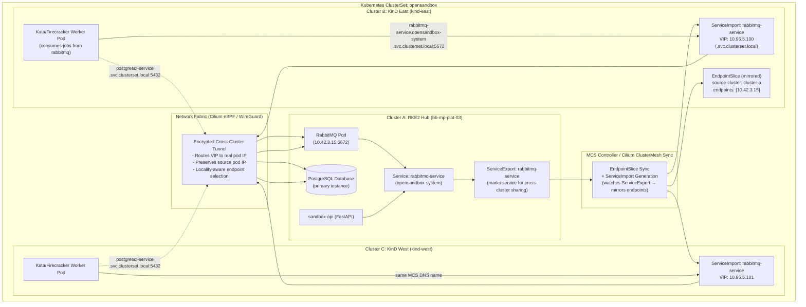
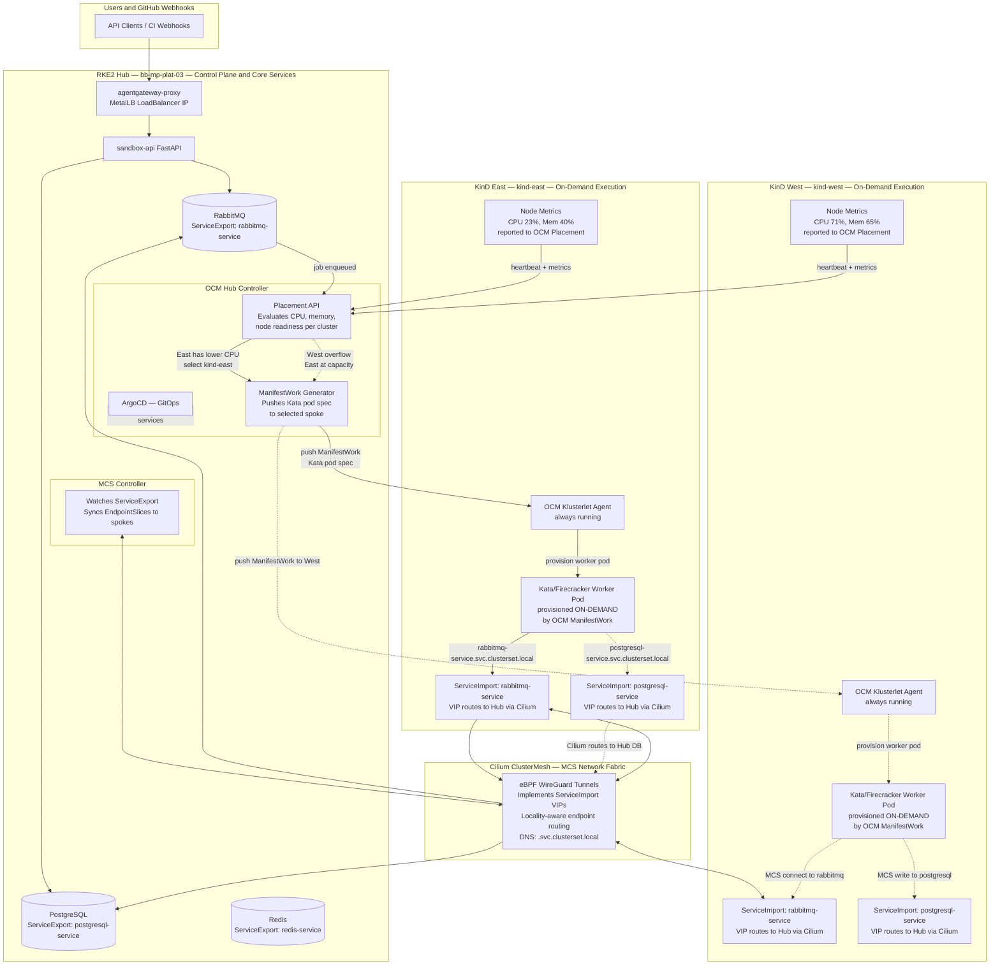
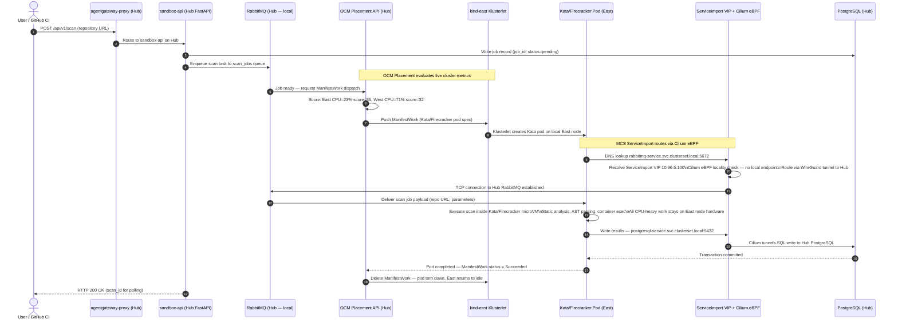

# Multi-Cluster Services (MCS) API: Service Discovery, Locality-Aware Routing & Its Limits

> **Core Question:** Cilium ClusterMesh solves *networking* — pod-to-pod reachability and service endpoint synchronization. But it has no awareness of CPU utilisation, memory pressure, GPU availability, node latency, or pod affinity rules. Does the **Multi-Cluster Services (MCS) API** fill this gap? And what does fill it?
>
> **Short Answer:**
> - **MCS API** = a Kubernetes-standard contract for *service discovery and reachability* across clusters. It solves service export/import. It does **not** schedule workloads.
> - **Fleet management + locality-aware scheduling** = requires a separate orchestration layer: **OCM Placement API**, **Karmada**, or **Admiralty** on top of MCS.
> - The full solution for `01-Sandbox` is **MCS + Cilium (networking) + OCM (scheduling)** working in concert.

---

## Table of Contents

1. [What is the MCS API?](#1-what-is-the-mcs-api)
2. [How MCS Works: ServiceExport & ServiceImport](#2-how-mcs-works-serviceexport--serviceimport)
3. [Architecture Diagrams](#3-architecture-diagrams)
4. [What MCS Does NOT Do: The Scheduling Gap](#4-what-mcs-does-not-do-the-scheduling-gap)
5. [Locality-Aware Routing: How MCS Handles It](#5-locality-aware-routing-how-mcs-handles-it)
6. [Filling the Gap: MCS + OCM for Full Fleet Management](#6-filling-the-gap-mcs--ocm-for-full-fleet-management)
7. [MCS vs Cilium ClusterMesh vs OCM: Capability Matrix](#7-mcs-vs-cilium-clustermesh-vs-ocm-capability-matrix)
8. [01-Sandbox Integration: ServiceExport/Import Manifests](#8-01-sandbox-integration-serviceexportimport-manifests)
9. [Step-by-Step: Installing MCS API CRDs](#9-step-by-step-installing-mcs-api-crds)
10. [End-to-End Traffic & Scheduling Flow](#10-end-to-end-traffic--scheduling-flow)

---

## 1. What is the MCS API?

The **Multi-Cluster Services API** is a Kubernetes SIG-Multicluster standard defined in [KEP-1645](https://github.com/kubernetes/enhancements/tree/master/keps/sig-multicluster/1645-multi-cluster-services-api). It defines two new Custom Resource Definitions (CRDs) that give services a **standard, portable identity across cluster boundaries**:

| CRD | Created By | Purpose |
|:---|:---|:---|
| `ServiceExport` | Cluster operator | Marks a local Service as available for consumption by other clusters in the same `ClusterSet` |
| `ServiceImport` | MCS controller (automatic) | Appears in every consuming cluster; provides a virtual IP representing the exported service across clusters |

### What Problem MCS Solves

Without MCS, cross-cluster service discovery is ad-hoc — each networking tool (Cilium, Submariner, Liqo) has its own proprietary annotations. A service exported via Cilium annotations (`service.cilium.io/global: "true"`) will not work if you switch to Submariner tomorrow.

**MCS standardises the contract:**

```
┌─────────────────────────────────────────────────────────────────┐
│                    Kubernetes ClusterSet                         │
│                                                                 │
│  Cluster A                         Cluster B                    │
│  ┌───────────────────┐             ┌───────────────────┐        │
│  │ Service: rabbitmq │             │ (no local rabbitmq│        │
│  │ ServiceExport:    │  ────────►  │  ServiceImport:   │        │
│  │   rabbitmq        │  MCS Sync   │   rabbitmq        │        │
│  └───────────────────┘             │  VIP: 10.96.5.100 │        │
│                                    └───────────────────┘        │
└─────────────────────────────────────────────────────────────────┘
```

Any pod in Cluster B can call `rabbitmq.opensandbox-system.svc.clusterset.local` and reach Cluster A's RabbitMQ — using the **standard `.clusterset.local` DNS domain**, not a proprietary annotation.

### MCS is a Specification, Not an Implementation

MCS defines *what* the API looks like. The *how* is implemented by the networking layer beneath it:

| MCS Implementation | Networking Backend | Notes |
|:---|:---|:---|
| **Cilium ClusterMesh** | eBPF + WireGuard | Native MCS support via `--set clustermesh.enableMCSAPISupport=true` |
| **Submariner** | IPsec / WireGuard tunnels | MCS-native, designed around ServiceExport/Import |
| **Admiralty** | Virtual nodes (like Liqo) | MCS-aware scheduling proxy |
| **Skupper** | AMQP proxy layer | Lightweight, no CNI requirement |

---

## 2. How MCS Works: ServiceExport & ServiceImport

### Step 1: Export a Service from Cluster A

You create a `ServiceExport` object in the same namespace as your Service:

```yaml
# Applied to Cluster A (where rabbitmq actually runs)
apiVersion: multicluster.x-k8s.io/v1alpha1
kind: ServiceExport
metadata:
  name: rabbitmq-service
  namespace: opensandbox-system
```

That is the entire export declaration. The MCS controller watches for `ServiceExport` objects and begins synchronising the Service's endpoint data across the ClusterSet.

### Step 2: ServiceImport Appears Automatically in Cluster B

The MCS controller automatically creates a `ServiceImport` in every other cluster in the `ClusterSet`:

```yaml
# Auto-created in Cluster B by the MCS controller — do not create manually
apiVersion: multicluster.x-k8s.io/v1alpha1
kind: ServiceImport
metadata:
  name: rabbitmq-service
  namespace: opensandbox-system
spec:
  type: ClusterSetIP        # Virtual IP assigned within the ClusterSet
  ips:
    - 10.96.5.100           # VIP auto-assigned by MCS controller
  ports:
    - name: amqp
      port: 5672
      protocol: TCP
```

### Step 3: DNS Resolution via `.clusterset.local`

MCS adds a new DNS domain alongside the standard `.cluster.local`. Pods in any cluster in the ClusterSet can resolve:

| DNS Name | Resolves To | Behaviour |
|:---|:---|:---|
| `rabbitmq-service.opensandbox-system.svc.cluster.local` | Local cluster endpoints only | Standard Kubernetes DNS — fails if no local Service |
| `rabbitmq-service.opensandbox-system.svc.clusterset.local` | All endpoints across all clusters | MCS DNS — routes to local first if available, cross-cluster otherwise |

### The Endpoint Synchronisation Flow

```
Cluster A                                Cluster B
─────────────────────────────────────    ─────────────────────────────────────
Service: rabbitmq-service                ServiceImport: rabbitmq-service
  Endpoints: [10.42.3.15:5672]   ───►     EndpointSlice (mirrored):
ServiceExport: rabbitmq-service              - addressType: IPv4
                                             - endpoints: [{10.42.3.15}]
                                             - clusterName: cluster-a
                                           VIP: 10.96.5.100 → tunnel → 10.42.3.15
```

The MCS controller continuously syncs `EndpointSlice` objects tagged with `multicluster.kubernetes.io/source-cluster` so each cluster always knows the current healthy backends.

---

## 3. Architecture Diagrams

### 3.1 MCS Service Export / Import Topology



---

### 3.2 The Scheduling Gap: What MCS Controls vs What It Cannot See

```mermaid
flowchart LR
    subgraph MCSScope["What MCS API Controls"]
        direction TB
        SE["ServiceExport\n(which services are shared)"]
        SI["ServiceImport\n(virtual IPs across clusters)"]
        DNS["DNS: .clusterset.local\n(standard cross-cluster resolution)"]
        EP["EndpointSlice Sync\n(which pod IPs are healthy)"]
        LA["Locality-Aware Routing\n(prefer local endpoints in\nsame cluster or region)"]
    end

    subgraph Gap["Outside MCS Scope — The Scheduling Gap"]
        direction TB
        CPU["CPU Utilisation per Cluster\n(which cluster has spare capacity?)"]
        MEM["Memory Pressure\n(avoid OOM-risk clusters)"]
        GPU["GPU Availability\n(ML workload placement)"]
        LAT["Node or Region Latency\n(network RTT between clusters)"]
        AFF["Pod Affinity and Anti-Affinity\n(co-location and spread rules)"]
        FLEET["Fleet Workload Orchestration\n(push deployments to which clusters?)"]
    end

    subgraph Filler["What Fills the Gap"]
        direction TB
        OCM["OCM Placement API\n(CPU/memory-aware cluster selection)"]
        KARMADA["Karmada PropagationPolicy\n(replica weighting across clusters)"]
        KEDA["KEDA ScaledObject\n(autoscale on queue depth)"]
        TOPO["Topology-Aware Routing\n(Kubernetes-native zone hints)"]
    end

    MCSScope --> Gap
    Gap --> Filler
```



---

### 3.3 Full Stack: MCS + OCM + Cilium Architecture for 01-Sandbox



---

## 4. What MCS Does NOT Do: The Scheduling Gap

This is the most important section to understand. The question correctly identifies a real architectural gap:

> *"Cilium Mesh may address network-level challenges, but it lacks inherent awareness of factors critical to scheduling, such as CPU utilization, GPU availability, memory, node latency, and pod affinity/anti-affinity."*

**MCS shares this exact same limitation.** MCS is a networking and service discovery API — it is strictly a Layer 3/4/7 concern. Here is precisely what falls outside MCS's scope:

### What MCS Cannot See or Control

| Scheduling Factor | MCS Awareness | Consequence If Ignored |
|:---|:---:|:---|
| **CPU utilisation per cluster** | ❌ None | Workers dispatched to already-saturated clusters, causing job timeouts |
| **Memory pressure / OOM risk** | ❌ None | Worker pods OOMKilled on pressured clusters, jobs lost |
| **GPU availability** | ❌ None | ML scan jobs queued on CPU-only clusters, never executed |
| **Network RTT between clusters** | ❌ None | Jobs dispatched to high-latency clusters, DB writes slow |
| **Pod affinity / anti-affinity** | ❌ None | Co-location constraints ignored across cluster boundary |
| **Node taints and tolerations** | ❌ None | Pods land on nodes they should avoid |
| **PodDisruptionBudget awareness** | ❌ None | Rolling updates break service SLA cross-cluster |
| **Resource quotas per namespace** | ❌ None | Runaway workloads exhaust remote cluster quota |
| **Fleet workload distribution** | ❌ None | No mechanism to say "run 3 replicas on East, 2 on West" |

### What MCS CAN See (Network Layer Only)

| Network Factor | MCS Awareness | Detail |
|:---|:---:|:---|
| **Endpoint health** | ✅ Yes | Failed pods removed from EndpointSlice, traffic rerouted |
| **Service reachability** | ✅ Yes | VIP removed from DNS if no healthy backends |
| **Local vs remote endpoints** | ✅ Yes | `topologyKey` hints, locality-aware routing |
| **Number of healthy pod replicas** | ✅ Partial | Visible as EndpointSlice count — not load metrics |

---

## 5. Locality-Aware Routing: How MCS Handles It

MCS **does** provide a mechanism for preferring local endpoints before crossing the cluster boundary — but it operates at the **request routing level**, not the scheduling level. It cannot prevent a pod from being scheduled on the wrong cluster; it only ensures that once a pod is running, its service calls go to the nearest available backend.

### 5.1 Topology-Aware EndpointSlices

MCS uses Kubernetes `topologyKey` hints embedded in `EndpointSlice` objects:

```yaml
apiVersion: discovery.k8s.io/v1
kind: EndpointSlice
metadata:
  name: rabbitmq-service-east-abc12
  namespace: opensandbox-system
  labels:
    multicluster.kubernetes.io/source-cluster: "kind-east"
    multicluster.kubernetes.io/service-name: "rabbitmq-service"
addressType: IPv4
endpoints:
  - addresses:
      - "10.16.3.22"
    conditions:
      ready: true
    hints:
      forZones:
        - name: "us-east-1"       # zone hint — kube-proxy / Cilium prefers same zone
    nodeName: east-node-01
    zone: us-east-1
ports:
  - name: amqp
    port: 5672
    protocol: TCP
```

When a pod in `kind-east` calls `rabbitmq-service.svc.clusterset.local`, the DNS resolver and eBPF load balancer check zone hints:

1. **Local zone endpoints first** — if a healthy endpoint exists in the same zone, route there (sub-millisecond latency)
2. **Remote zone fallback** — if the local zone's RabbitMQ is down, route to the hub cluster's endpoint over WireGuard (5–15ms)

### 5.2 Cilium MCS Locality Affinity

When Cilium implements MCS, it additionally honours `service.cilium.io/affinity` on `ServiceImport` objects:

```yaml
apiVersion: multicluster.x-k8s.io/v1alpha1
kind: ServiceImport
metadata:
  name: rabbitmq-service
  namespace: opensandbox-system
  annotations:
    service.cilium.io/affinity: "local"      # prefer same cluster endpoints first
    service.cilium.io/topology-mode: "auto"  # auto-detect zone topology
```

This instructs Cilium's eBPF datapath to:
- Always prefer endpoints with `source-cluster == current-cluster`
- Only forward cross-cluster if no local healthy endpoints remain

### 5.3 The Critical Distinction: Request Locality vs Scheduling Locality

```
Locality-Aware ROUTING  (MCS handles this ✅)
  → A running pod's service calls go to the nearest healthy backend
  → Cross-cluster only when local is unavailable
  → Sub-millisecond eBPF decision at the kernel socket layer

Locality-Aware SCHEDULING  (MCS does NOT handle this ❌)
  → Deciding which cluster a new pod should be created on
  → Evaluating CPU/memory/GPU before dispatching
  → Ensuring heavy workloads do not cross regions unnecessarily
  → This requires OCM Placement API or Karmada PropagationPolicy
```

---

## 6. Filling the Gap: MCS + OCM for Full Fleet Management

The complete solution combines three distinct layers, each solving a non-overlapping concern:

```
┌──────────────────────────────────────────────────────────────────────┐
│  Layer 3: Fleet Orchestration — OCM Placement API                    │
│  "Which cluster should this pod run on, based on CPU/memory/GPU?"    │
└─────────────────────────────┬────────────────────────────────────────┘
                              │ selects cluster → dispatches ManifestWork
┌─────────────────────────────▼────────────────────────────────────────┐
│  Layer 2: Service Discovery — MCS API (ServiceExport / ServiceImport)│
│  "How does a pod in Cluster B reach a service in Cluster A?"         │
└─────────────────────────────┬────────────────────────────────────────┘
                              │ provides .clusterset.local DNS + VIPs
┌─────────────────────────────▼────────────────────────────────────────┐
│  Layer 1: Network Fabric — Cilium ClusterMesh (eBPF / WireGuard)     │
│  "How are packets physically moved between clusters, securely?"       │
└──────────────────────────────────────────────────────────────────────┘
```

### 6.1 OCM Placement API: Resource-Aware Cluster Selection

OCM's `Placement` resource evaluates registered spoke clusters using **real-time resource metrics** before dispatching a `ManifestWork`:

```yaml
apiVersion: cluster.open-cluster-management.io/v1beta2
kind: Placement
metadata:
  name: sandbox-worker-placement
  namespace: opensandbox-system
spec:
  numberOfClusters: 1            # pick the single best cluster
  clusterSets:
    - name: opensandbox-clusterset
  predicates:
    - requiredClusterSelector:
        labelSelector:
          matchLabels:
            feature.open-cluster-management.io/addon-work-manager: "available"
  prioritizerPolicy:
    mode: Exact
    configurations:
      # Prefer clusters with more allocatable CPU
      - scoreCoordinate:
          builtIn: ResourceAllocatableCPU
        weight: 2
      # Prefer clusters with more free memory
      - scoreCoordinate:
          builtIn: ResourceAllocatableMemory
        weight: 1
      # Penalise clusters already running many workloads
      - scoreCoordinate:
          builtIn: Steady
        weight: -1
```

**How OCM gathers these metrics — the klusterlet pipeline:**

```
Each Spoke Cluster
└── OCM Klusterlet Agent (always running — minimal footprint)
    └── work-manager addon
        └── Reports every 30 seconds to Hub:
            - Allocatable CPU (cores remaining)
            - Allocatable Memory (bytes remaining)
            - GPU count (via node labels: nvidia.com/gpu)
            - Node count and readiness status
            - Current workload / ManifestWork count
```

The OCM Hub's Placement controller aggregates these scores and selects the highest-scoring cluster. When a new `ManifestWork` must be dispatched (e.g. a new sandbox job), the best-scoring available cluster receives it.

### 6.2 How OCM + MCS Work Together for 01-Sandbox

```
1. sandbox-api on hub enqueues scan job → RabbitMQ (hub-local)

2. OCM Hub detects job, queries Placement API:
   → kind-east: CPU=23%, Memory=40%  → Placement score: 85
   → kind-west: CPU=71%, Memory=65%  → Placement score: 32
   → DECISION: dispatch to kind-east (higher score)

3. OCM creates ManifestWork → delivered to kind-east klusterlet
   → Klusterlet provisions Kata/Firecracker pod on East node

4. Kata pod connects to RabbitMQ:
   → DNS: rabbitmq-service.opensandbox-system.svc.clusterset.local
   → MCS ServiceImport VIP: 10.96.5.100
   → Cilium eBPF: VIP → WireGuard tunnel → Hub RabbitMQ (10.42.3.15:5672)
   → Job payload delivered

5. Kata pod executes scan (CPU-intensive on East node's hardware)

6. Kata pod writes results:
   → DNS: postgresql-service.opensandbox-system.svc.clusterset.local
   → MCS ServiceImport VIP: 10.96.5.101
   → Cilium eBPF: VIP → WireGuard tunnel → Hub PostgreSQL (10.42.4.20:5432)

7. OCM deletes ManifestWork → Kata pod torn down on East
   → East cluster returns to idle, CPU freed
```

### 6.3 KEDA: Autoscaling ManifestWork Count Based on Queue Depth

**KEDA** (Kubernetes Event-Driven Autoscaling) can auto-trigger OCM `ManifestWork` objects based on RabbitMQ queue depth — creating more spoke workers as jobs accumulate:

```yaml
apiVersion: keda.sh/v1alpha1
kind: ScaledObject
metadata:
  name: sandbox-worker-scaler
  namespace: opensandbox-system
spec:
  scaleTargetRef:
    name: sandbox-worker-manifestwork-template
  minReplicaCount: 0     # zero idle workers when queue is empty
  maxReplicaCount: 20    # max 20 concurrent workers across spokes
  triggers:
    - type: rabbitmq
      metadata:
        host: amqp://rabbitmq-service.opensandbox-system.svc.cluster.local:5672
        queueName: scan_jobs
        queueLength: "5"   # trigger 1 new worker per 5 queued jobs
```

When queue depth hits 50 jobs → KEDA triggers 10 ManifestWork objects → OCM distributes them across East and West based on Placement scores → 10 Kata pods run across both spokes simultaneously.

---

## 7. MCS vs Cilium ClusterMesh vs OCM: Capability Matrix

| Capability | MCS API | Cilium ClusterMesh | OCM Placement API |
|:---|:---:|:---:|:---:|
| **Cross-cluster service DNS (`.clusterset.local`)** | ✅ Defines | ✅ Implements | ❌ N/A |
| **EndpointSlice synchronisation** | ✅ Defines | ✅ Implements | ❌ N/A |
| **Locality-aware request routing** | ✅ Topology hints | ✅ `affinity: local` eBPF | ❌ N/A |
| **Encrypted cross-cluster network tunnel** | ❌ N/A | ✅ WireGuard/VXLAN | ❌ N/A |
| **Pod-to-pod connectivity across clusters** | ❌ N/A | ✅ eBPF datapath | ❌ N/A |
| **Automatic IP collision / NAT** | ❌ N/A | ❌ Requires unique CIDRs | ❌ N/A |
| **CPU-aware cluster selection** | ❌ | ❌ | ✅ |
| **Memory-aware cluster selection** | ❌ | ❌ | ✅ |
| **GPU-aware cluster selection** | ❌ | ❌ | ✅ Via node labels |
| **Pod affinity / anti-affinity cross-cluster** | ❌ | ❌ | ✅ Placement predicates |
| **Fleet workload deployment (ManifestWork)** | ❌ | ❌ | ✅ |
| **GitOps integration** | ❌ | ❌ | ✅ ArgoCD addon |
| **Cluster health monitoring** | ❌ | ❌ | ✅ ManagedCluster conditions |
| **Namespace access policy** | ❌ | ❌ | ✅ ManagedClusterSetBinding |
| **Zero application code changes** | ✅ Standard DNS | ✅ Proprietary annotations | ✅ Standard Kubernetes |
| **Kubernetes-native open standard** | ✅ KEP-1645 SIG-MC | ❌ Cilium-proprietary | ❌ OCM-proprietary |
| **Works with any CNI** | ✅ CNI-agnostic | ❌ Requires Cilium | ✅ CNI-agnostic |

### Decision Guide

```
Use MCS API when:
  ✅ You want a vendor-neutral, portable service export/import standard
  ✅ You may switch networking backends (Cilium → Submariner → Skupper)
  ✅ You need .clusterset.local DNS for zero-code service discovery
  ✅ You want a Kubernetes-upstream standard (not proprietary)

Use Cilium ClusterMesh when:
  ✅ You need kernel-level encrypted packet routing between clusters
  ✅ All clusters already run Cilium as CNI
  ✅ You want eBPF-level locality-affinity routing

Use OCM Placement API when:
  ✅ You need CPU/memory/GPU-aware workload placement decisions
  ✅ You want fleet management: push deployments, policies, config to spokes
  ✅ You need on-demand pod provisioning that scales to zero between jobs

Use ALL THREE together when:
  ✅ Running 01-Sandbox in production (hub-hosted services + on-demand spoke workers)
  ✅ You need the full stack: networking + service discovery + scheduling
  ✅ Avoiding vendor lock-in at any single layer
```

---

## 8. 01-Sandbox Integration: ServiceExport/Import Manifests

Apply these manifests to the **hub cluster** to export all core services to the ClusterSet, making them reachable by Kata worker pods on spoke clusters via the standard `.clusterset.local` DNS domain.

### 8.1 Export RabbitMQ (Hub → Spokes Consume Jobs)

```yaml
# Step 1: Annotate the existing RabbitMQ Service for Cilium MCS
apiVersion: v1
kind: Service
metadata:
  name: rabbitmq-service
  namespace: opensandbox-system
  annotations:
    service.cilium.io/global: "true"        # expose across Cilium ClusterMesh
    service.cilium.io/affinity: "local"     # prefer local endpoint if available
spec:
  type: ClusterIP
  ports:
    - name: amqp
      port: 5672
      targetPort: 5672
    - name: management
      port: 15672
      targetPort: 15672
  selector:
    app.kubernetes.io/name: rabbitmq
---
# Step 2: MCS ServiceExport — makes it available via .svc.clusterset.local on ALL clusters
apiVersion: multicluster.x-k8s.io/v1alpha1
kind: ServiceExport
metadata:
  name: rabbitmq-service
  namespace: opensandbox-system
```

### 8.2 Export PostgreSQL (Spokes Write Results Back to Hub)

```yaml
apiVersion: v1
kind: Service
metadata:
  name: postgresql-service
  namespace: opensandbox-system
  annotations:
    service.cilium.io/global: "true"
    service.cilium.io/affinity: "remote"   # spokes always write to hub — no local replica
spec:
  type: ClusterIP
  ports:
    - name: postgresql
      port: 5432
      targetPort: 5432
  selector:
    app.kubernetes.io/name: postgresql
---
apiVersion: multicluster.x-k8s.io/v1alpha1
kind: ServiceExport
metadata:
  name: postgresql-service
  namespace: opensandbox-system
```

### 8.3 Export Redis (Spokes Read Cache from Hub)

```yaml
apiVersion: v1
kind: Service
metadata:
  name: redis-service
  namespace: opensandbox-system
  annotations:
    service.cilium.io/global: "true"
    service.cilium.io/affinity: "remote"
spec:
  type: ClusterIP
  ports:
    - name: redis
      port: 6379
      targetPort: 6379
  selector:
    app.kubernetes.io/name: redis
---
apiVersion: multicluster.x-k8s.io/v1alpha1
kind: ServiceExport
metadata:
  name: redis-service
  namespace: opensandbox-system
```

### 8.4 Worker Pod DNS — Zero Code Change Required

The Kata/Firecracker worker pod running on a spoke can use either DNS form:

```python
# consumer.py — zero application code changes needed

# Option A: Standard .cluster.local — Cilium ClusterMesh resolves cross-cluster transparently
RABBITMQ_HOST = "rabbitmq-service.opensandbox-system.svc.cluster.local"
POSTGRES_HOST = "postgresql-service.opensandbox-system.svc.cluster.local"

# Option B: MCS-standard .clusterset.local — portable across any MCS implementation
RABBITMQ_HOST = "rabbitmq-service.opensandbox-system.svc.clusterset.local"
POSTGRES_HOST = "postgresql-service.opensandbox-system.svc.clusterset.local"
REDIS_HOST    = "redis-service.opensandbox-system.svc.clusterset.local"
```

The `.clusterset.local` form is preferred for portability — it works regardless of which MCS implementation backs the networking (Cilium, Submariner, etc.).

---

## 9. Step-by-Step: Installing MCS API CRDs

MCS CRDs must be installed on **every cluster** in the ClusterSet. The CRDs are lightweight — they define the API schema only. The actual controller logic is provided by Cilium (or another MCS implementation).

### Install MCS CRDs on All Clusters

```bash
# MCS CRD manifest URLs (kubernetes-sigs/mcs-api)
MCS_EXPORT_URL="https://raw.githubusercontent.com/kubernetes-sigs/mcs-api/master/config/crd/multicluster.x-k8s.io_serviceexports.yaml"
MCS_IMPORT_URL="https://raw.githubusercontent.com/kubernetes-sigs/mcs-api/master/config/crd/multicluster.x-k8s.io_serviceimports.yaml"

# Apply to hub and all spokes
for ctx in default kind-east kind-west; do
  echo "==> Installing MCS CRDs on: $ctx"
  kubectl apply -f $MCS_EXPORT_URL --context $ctx
  kubectl apply -f $MCS_IMPORT_URL --context $ctx
done

# Verify
kubectl get crd | grep multicluster
# multicluster.x-k8s.io_serviceexports    2026-...
# multicluster.x-k8s.io_serviceimports    2026-...
```

### Enable MCS in Cilium ClusterMesh

```bash
# Enable MCS API support in Cilium (upgrade in-place, non-disruptive)
for ctx in default kind-east kind-west; do
  helm upgrade cilium cilium/cilium \
    --namespace kube-system \
    --kube-context $ctx \
    --reuse-values \
    --set clustermesh.enableMCSAPISupport=true
done
```

When `enableMCSAPISupport=true`, Cilium's `clustermesh-apiserver` will:
1. Watch all namespaces for `ServiceExport` objects
2. Automatically generate `ServiceImport` objects in remote clusters
3. Register `.svc.clusterset.local` DNS entries via CoreDNS plugin
4. Apply locality-aware eBPF routing based on `ServiceImport` topology hints

### Verify MCS is Functioning

```bash
# 1. Check ServiceImport was auto-created on spoke cluster
kubectl get serviceimports -n opensandbox-system --context kind-east
# NAME                   TYPE          IP                AGE
# rabbitmq-service       ClusterSetIP  ["10.96.5.100"]   2m
# postgresql-service     ClusterSetIP  ["10.96.5.101"]   2m
# redis-service          ClusterSetIP  ["10.96.5.102"]   2m

# 2. Check mirrored EndpointSlices
kubectl get endpointslices -n opensandbox-system --context kind-east \
  -l multicluster.kubernetes.io/source-cluster
# NAME                           ADDRESSTYPE   PORTS   ENDPOINTS   AGE
# rabbitmq-service-hub-abc12    IPv4          5672    10.42.3.15  2m

# 3. Test DNS resolution from inside a spoke pod
kubectl run dns-test --image=busybox:1.36 --restart=Never \
  --context kind-east -it --rm \
  -- nslookup rabbitmq-service.opensandbox-system.svc.clusterset.local
# Server:    10.96.0.10
# Name:      rabbitmq-service.opensandbox-system.svc.clusterset.local
# Address 1: 10.96.5.100   ← ServiceImport VIP resolved successfully

# 4. Test actual TCP connectivity to hub RabbitMQ from spoke
kubectl run conn-test --image=busybox:1.36 --restart=Never \
  --context kind-east -it --rm \
  -- nc -zv rabbitmq-service.opensandbox-system.svc.clusterset.local 5672
# rabbitmq-service.opensandbox-system.svc.clusterset.local (10.96.5.100:5672) open
```

---

## 10. End-to-End Traffic & Scheduling Flow



---

## Summary

| Layer | Technology | Concern Solved |
|:---|:---|:---|
| **Network Fabric** | Cilium ClusterMesh (eBPF + WireGuard) | Encrypted pod-to-pod connectivity, endpoint health sync |
| **Service Discovery** | MCS API (`ServiceExport` / `ServiceImport`) | Vendor-neutral cross-cluster DNS (`.clusterset.local`), portable service identity |
| **Locality Routing** | Cilium `affinity: local` + MCS topology hints | Prefer local cluster endpoints — cross-cluster only on failure or overflow |
| **Fleet Scheduling** | OCM Placement API + ManifestWork | CPU/memory/GPU-aware cluster selection for on-demand workload dispatch |
| **Autoscaling** | KEDA + RabbitMQ queue trigger | Scale ManifestWork count based on queue depth — zero idle workers |
| **GitOps Delivery** | ArgoCD on Hub | Deploy and update hub services (API, config, schemas) from Git |

> **Takeaway:** MCS API solves service *identity and discoverability* across clusters in a Kubernetes-standard, CNI-agnostic way. It intentionally does **not** replace fleet management. The production stack for 01-Sandbox requires all three layers working together — **Cilium (networking) + MCS (service discovery) + OCM (scheduling)** — each solving a distinct, non-overlapping concern. Using any one layer in isolation leaves critical gaps.
