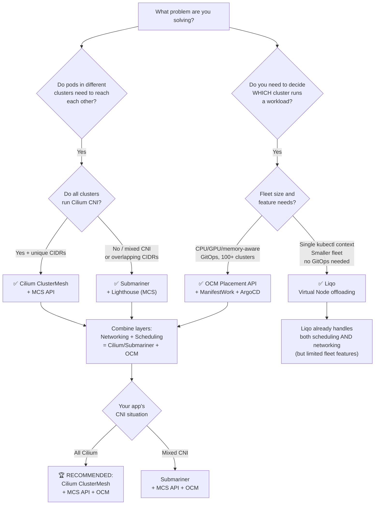
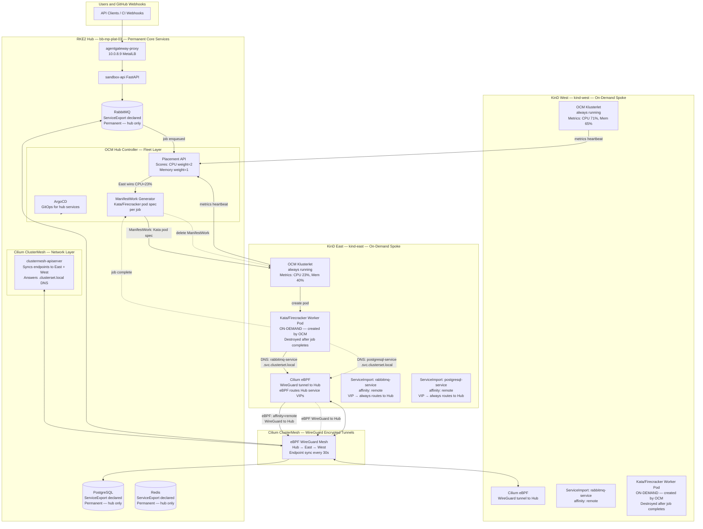
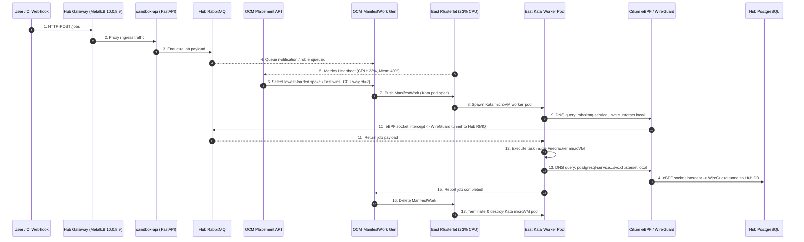
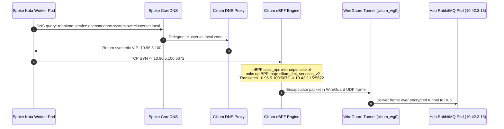

# Multi-Cluster Solution Comparison & Recommendation for 01-Sandbox

> **Your Environment:**
> - **Hub:** RKE2 on `bb-mp-plat-03` (context: `default`) — Cilium already installed, MetalLB, OCM Hub, all core services
> - **East Spoke:** KinD `kind-east` — Pod CIDR `10.16.0.0/16`, Service CIDR `10.17.0.0/16`, Cilium installed (no default CNI)
> - **West Spoke:** KinD `kind-west` — Pod CIDR `10.18.0.0/16`, Service CIDR `10.19.0.0/16`, Cilium installed (no default CNI)
> - **Workload rule:** Hub runs all core services permanently. Spokes run ONLY on-demand Kata/Firecracker sandbox workers, provisioned by OCM ManifestWork per job and torn down after.

---

## Table of Contents

1. [Solutions Compared](#1-solutions-compared)
2. [Master Comparison Table](#2-master-comparison-table)
3. [Decision Flowchart](#3-decision-flowchart)
4. [Deep-Dive Comparison by Concern](#4-deep-dive-comparison-by-concern)
5. [Your Application's Requirements](#5-your-applications-requirements)
6. [Recommendation](#6-recommendation)
7. [Recommended Stack: Architecture](#7-recommended-stack-architecture)
   - [7.1 Architecture Diagram](#71-architecture-diagram)
   - [7.2 Technical Working Principle & Execution Lifecycle](#72-technical-working-principle--execution-lifecycle)
   - [7.3 Detailed Subsystem Functionality Matrix](#73-detailed-subsystem-functionality-matrix)
8. [Deep-Dive: Multi-Cluster Services (MCS) API Implementation](#8-deep-dive-multi-cluster-services-mcs-api-implementation)
   - [8.1 KEP-1645 Standard & ClusterSet Identity](#81-kep-1645-standard--clusterset-identity)
   - [8.2 ServiceExport & ServiceImport CRD Mechanics](#82-serviceexport--serviceimport-crd-mechanics)
   - [8.3 DNS Resolution & .clusterset.local Domain Flow](#83-dns-resolution--clustersetlocal-domain-flow)
   - [8.4 Cilium eBPF VIP Translation & Remote Affinity](#84-cilium-ebpf-vip-translation--remote-affinity)
   - [8.5 Complete Declarative Manifests & Verification](#85-complete-declarative-manifests--verification)
9. [Why Not The Others](#9-why-not-the-others)
10. [Implementation Checklist](#10-implementation-checklist)

---

## 1. Solutions Compared

| # | Solution | Category | Reference |
|:---|:---|:---|:---|
| 1 | **Cilium ClusterMesh** | Network fabric (eBPF) | [cilium-mesh.md](./cilium-mesh.md) |
| 2 | **Submariner** | Network fabric (IPsec/WireGuard) | [submariner.md](./submariner.md) |
| 3 | **MCS API** | Service discovery standard | [mcs.md](./mcs.md) |
| 4 | **Liqo** | Virtual node / pod offloading | [liqo.md](./liqo.md) |
| 5 | **OCM (Open Cluster Management)** | Fleet management + scheduling | [manual-setup-guide.md](./manual-setup-guide.md) |

> **Important:** These are NOT mutually exclusive. They solve different layers of the problem. The right answer is almost always a **combination** from different categories.

---

## 2. Master Comparison Table

### 2.1 Core Identity

| Solution | What It IS | What It Is NOT |
|:---|:---|:---|
| **Cilium ClusterMesh** | eBPF-level encrypted networking between clusters; locality-aware service routing | A scheduler; does not know CPU/memory/GPU |
| **Submariner** | IPsec/WireGuard tunnel mesh; CNI-agnostic; Lighthouse for DNS discovery | A scheduler; does not know CPU/memory/GPU |
| **MCS API** | A Kubernetes open standard (KEP-1645) that defines `ServiceExport`/`ServiceImport` CRDs and `.clusterset.local` DNS | An implementation; needs Cilium or Submariner to do actual networking |
| **Liqo** | Virtual node abstraction — remote clusters appear as Kubernetes nodes in the primary cluster's API | A networking fabric by itself; uses WireGuard for transport |
| **OCM** | Fleet control plane — registers clusters, distributes workloads via `ManifestWork`, selects target using `Placement` API | A networking solution; does not move packets |

---

### 2.2 Full Capability Matrix

| Capability | Cilium ClusterMesh | Submariner | MCS API | Liqo | OCM |
|:---|:---:|:---:|:---:|:---:|:---:|
| **Pod-to-pod IP reachability** | ✅ eBPF kernel | ✅ IPsec/WireGuard | ❌ N/A | ✅ WireGuard | ❌ N/A |
| **Service IP reachability** | ✅ | ✅ | ❌ N/A | ✅ | ❌ N/A |
| **Cross-cluster DNS (.clusterset.local)** | ✅ Built-in | ✅ Lighthouse | ✅ Defines it | ✅ Reflected | ❌ N/A |
| **ServiceExport / ServiceImport CRDs** | ✅ With flag | ✅ Native | ✅ Defines it | ✅ Reflected | ❌ N/A |
| **Encrypted tunnel** | ✅ WireGuard | ✅ IPsec + WireGuard | ❌ | ✅ WireGuard | ❌ |
| **CNI-agnostic (any CNI)** | ❌ Cilium only | ✅ Any CNI | ✅ | ✅ | ✅ |
| **Overlapping Pod CIDR support** | ❌ Must be unique | ✅ Globalnet | ❌ N/A | ✅ NAT | ❌ N/A |
| **Locality-aware routing (prefer local)** | ✅ eBPF affinity | ✅ Partial (DNS) | ✅ Topology hints | ✅ Partial | ❌ |
| **NAT traversal (behind firewall)** | ❌ | ✅ NAT-T | ❌ | ❌ | ❌ |
| **CPU-aware cluster selection** | ❌ | ❌ | ❌ | ❌ | ✅ |
| **Memory-aware cluster selection** | ❌ | ❌ | ❌ | ❌ | ✅ |
| **GPU-aware cluster selection** | ❌ | ❌ | ❌ | ❌ | ✅ Via labels |
| **Pod affinity / anti-affinity** | ❌ | ❌ | ❌ | ✅ K8s scheduler | ✅ Placement |
| **Fleet workload deployment** | ❌ | ❌ | ❌ | ✅ Virtual kubelet | ✅ ManifestWork |
| **GitOps integration** | ❌ | ❌ | ❌ | ❌ | ✅ ArgoCD addon |
| **Cluster health monitoring** | ❌ | ❌ | ❌ | ❌ | ✅ |
| **On-demand pod provisioning** | ❌ | ❌ | ❌ | ❌ | ✅ ManifestWork |
| **Kubernetes open standard** | ❌ Proprietary | ✅ CNCF sandbox | ✅ KEP-1645 | ❌ | ❌ |
| **Kernel-level eBPF performance** | ✅ | ❌ Userspace GW | ❌ | ❌ | ❌ |
| **Single kubectl control plane** | ❌ | ❌ | ❌ | ✅ | ✅ Hub only |
| **Zero app code changes** | ✅ | ✅ | ✅ | ✅ | ✅ |

---

### 2.3 Networking Layer: Cilium vs Submariner vs Liqo

| Factor | Cilium ClusterMesh | Submariner | Liqo |
|:---|:---|:---|:---|
| **Transport** | eBPF + WireGuard at kernel level | IPsec or WireGuard at userspace gateway | WireGuard per peered cluster |
| **Performance** | Best — kernel eBPF, no userspace hop | Good — 1 extra gateway hop per cross-cluster packet | Good — WireGuard tunnel |
| **CNI requirement** | All clusters MUST run Cilium | Any CNI (Flannel, Calico, OVN, etc.) | Any CNI |
| **Overlapping CIDRs** | ❌ Hard requirement: unique CIDRs | ✅ Globalnet solves this | ✅ Automatic NAT |
| **Connection setup** | `cilium clustermesh connect` | `subctl join broker-info.subm` | `liqoctl peer` |
| **Service discovery** | Built-in (Cilium annotations + MCS) | Lighthouse (MCS-native) | Resource Reflector |
| **Node requirement** | Dedicated gateway? No — all nodes participate | Yes — designate gateway node(s) | No — peer control plane |
| **Debugging tools** | `cilium connectivity test` | `subctl diagnose` | `liqoctl status peer` |
| **Operational complexity** | Medium — Cilium must be on every cluster | Medium — broker + gateway nodes | Low — single `kubectl` context |

---

### 2.4 Fleet Management Layer: OCM vs Liqo Scheduler

| Factor | OCM Placement API | Liqo Virtual Kubelet |
|:---|:---|:---|
| **How pods reach remote clusters** | Hub pushes `ManifestWork` CRD to spoke | K8s scheduler assigns to virtual node → Liqo forwards |
| **Scheduling awareness** | Full: CPU, memory, GPU, node count, custom scores | Inherits K8s scheduler: nodeSelector, affinity, resources |
| **Fleet scale** | Designed for 100s of clusters | Designed for tens of clusters |
| **On-demand provisioning** | ✅ ManifestWork created per job, deleted after | ✅ Pod on virtual node deleted when done |
| **GitOps delivery** | ✅ ArgoCD addon — deploy from Git to any spoke | ❌ No native GitOps integration |
| **Multi-tenancy / RBAC** | ✅ ManagedClusterSetBinding, namespace isolation | ❌ Limited |
| **Spoke autonomy** | ✅ Spokes work independently if hub goes down | ❌ Spoke pods fail to schedule if hub API unreachable |
| **Cluster health monitoring** | ✅ ManagedCluster conditions, alerts | ❌ No built-in cluster health CRDs |

---

## 3. Decision Flowchart



---

## 4. Deep-Dive Comparison by Concern

### 4.1 Networking Performance

```
Fastest → Slowest (cross-cluster packet path):

1. Cilium ClusterMesh  → Pod → eBPF socket intercept → WireGuard kernel driver → remote pod
                          0 userspace hops. Sub-millisecond overhead within datacenter.

2. Liqo               → Pod → WireGuard tunnel → NAT → remote pod
                          1 userspace NAT hop. ~1ms overhead.

3. Submariner         → Pod → iptables → Route Agent → Gateway Engine process → IPsec → remote GW → iptables → remote pod
                          2 userspace hops (local GW + remote GW). ~2–5ms overhead.
```

**For 01-Sandbox:** The Kata/Firecracker worker pods on spokes make 2 cross-cluster calls:
1. Connect to Hub RabbitMQ (low frequency — once per job)
2. Write results to Hub PostgreSQL (low frequency — once at job completion)

Neither call is latency-sensitive at the millisecond level. All three networking options are acceptable.

---

### 4.2 Overlapping CIDR Handling

Your KinD clusters are created with **explicitly non-overlapping CIDRs**:

| Cluster | Pod CIDR | Service CIDR |
|:---|:---|:---|
| Hub (RKE2 `default`) | `10.42.0.0/16` (RKE2 default) | `10.43.0.0/16` |
| East (`kind-east`) | `10.16.0.0/16` | `10.17.0.0/16` |
| West (`kind-west`) | `10.18.0.0/16` | `10.19.0.0/16` |

**These are already non-overlapping.** This means Globalnet (Submariner) is not required, and Cilium ClusterMesh's hard requirement of unique CIDRs is already met.

---

### 4.3 Service Discovery: Which is Most Portable?

| Approach | DNS Name | Portability |
|:---|:---|:---|
| Cilium proprietary | `rabbitmq.opensandbox.svc.cluster.local` (resolved cross-cluster by Cilium) | ❌ Locked to Cilium |
| Cilium + MCS API | `rabbitmq.opensandbox.svc.clusterset.local` | ✅ Standard — works with Submariner too |
| Submariner Lighthouse | `rabbitmq.opensandbox.svc.clusterset.local` | ✅ Standard MCS |
| Liqo Reflector | `rabbitmq.opensandbox.svc.cluster.local` (reflected into shadow namespace) | ⚠️ Liqo-specific mechanism |

**Recommendation:** Always use `.svc.clusterset.local` with MCS API CRDs. This makes your application portable across any MCS implementation.

---

### 4.4 Scheduling Awareness Summary

All networking tools (Cilium, Submariner, MCS, Liqo-basic) share the same fundamental limitation: they **cannot see CPU, memory, GPU, or node availability**. Only **OCM Placement API** actively evaluates these metrics from klusterlet agents before dispatching work.

```
Scenario: East cluster is at 95% CPU due to a noisy neighbour workload.
A new scan job arrives.

Cilium ClusterMesh alone:    → Has no idea East is overloaded. No action.
Submariner alone:            → Has no idea East is overloaded. No action.
MCS API alone:               → Has no idea East is overloaded. No action.
Liqo alone:                  → K8s scheduler may bin-pack, but cannot see CROSS-cluster load.
OCM Placement API:           → East score drops due to low allocatable CPU.
                               West is selected. ManifestWork dispatched to West. ✅
```

---

## 5. Your Application's Requirements

Based on your documented architecture, here are the exact requirements that drive the recommendation:

| Requirement | Priority | Detail |
|:---|:---|:---|
| **Hub services stay on RKE2** | 🔴 Critical | `sandbox-api`, PostgreSQL, Redis, RabbitMQ, `opensandbox-system` never leave the hub |
| **Spoke workers are on-demand** | 🔴 Critical | Kata/Firecracker pods provisioned per job, torn down after. Zero idle workers on spokes. |
| **CPU-aware spoke selection** | 🔴 Critical | Jobs must go to the least-loaded spoke, not blindly alternate |
| **Spoke workers reach hub RabbitMQ** | 🔴 Critical | Workers pull jobs from hub-local queue via cross-cluster service call |
| **Spoke workers write to hub PostgreSQL** | 🔴 Critical | Results persist on hub — single authoritative DB |
| **Zero application code changes** | 🟡 High | `consumer.py` uses standard DNS names — no IP hardcoding |
| **RKE2 already runs Cilium** | 🟡 High | Leveraging existing CNI is operationally simpler |
| **KinD spokes run Cilium** | 🟡 High | Already set up in `manual-setup-guide.md` with `disableDefaultCNI: true` |
| **CIDRs are non-overlapping** | 🟡 High | Already planned: `10.42/16`, `10.16/16`, `10.18/16` |
| **GitOps from ArgoCD** | 🟡 High | Hub services deployed via ArgoCD; spokes receive workers via OCM |
| **Kata/Firecracker isolation** | 🟡 High | Sandbox workers must run in microVM — requires Kata runtime on spokes |
| **Cluster health visibility** | 🟢 Medium | Know when a spoke is down and stop routing jobs to it |
| **Standard service discovery API** | 🟢 Medium | Portability if networking layer changes in future |
| **NAT traversal** | 🟢 Low | All clusters are on the same local network (same machine or LAN) |

---

## 6. Recommendation

> [!IMPORTANT]
> ### 🏆 Recommended Stack: **Cilium ClusterMesh + MCS API + OCM**
>
> This is the optimal combination for your specific application, environment, and constraints.

### The Three Layers

```
┌──────────────────────────────────────────────────────────────────────┐
│  LAYER 3: OCM (Open Cluster Management)                              │
│  Fleet management + CPU/memory-aware scheduling                      │
│  → ManifestWork dispatches Kata pods to least-loaded spoke           │
│  → Placement API evaluates klusterlet metrics before dispatch        │
│  → ArgoCD addon delivers hub service deployments from Git            │
│  → Klusterlets on spokes report health + metrics every 30s           │
└─────────────────────────────┬────────────────────────────────────────┘
                              │ "East is at 23% CPU, dispatch here"
┌─────────────────────────────▼────────────────────────────────────────┐
│  LAYER 2: MCS API (ServiceExport / ServiceImport)                    │
│  Standard cross-cluster service discovery                            │
│  → ServiceExport on Hub marks RabbitMQ, PostgreSQL, Redis            │
│  → ServiceImport auto-created on East + West spokes                  │
│  → DNS: .svc.clusterset.local resolves from any cluster              │
│  → Portable: works whether networking layer is Cilium or Submariner  │
└─────────────────────────────┬────────────────────────────────────────┘
                              │ "rabbitmq.svc.clusterset.local → VIP"
┌─────────────────────────────▼────────────────────────────────────────┐
│  LAYER 1: Cilium ClusterMesh (eBPF / WireGuard)                      │
│  High-performance encrypted networking                               │
│  → Already installed on all 3 clusters (RKE2 + both KinD)           │
│  → WireGuard encrypts all cross-cluster pod traffic                  │
│  → eBPF provides sub-millisecond routing decisions                   │
│  → service.cilium.io/affinity: remote ensures spokes always          │
│    route to Hub's RabbitMQ and PostgreSQL (not local — none exist)   │
└──────────────────────────────────────────────────────────────────────┘
```

### Why This Stack — 6 Decisive Reasons

**Reason 1: Cilium is already on every cluster**

Your `manual-setup-guide.md` already sets up Cilium on the Hub (pre-existing) and installs it on both KinD spokes with `disableDefaultCNI: true`. You are NOT adding a new tool. You are enabling a feature flag on the CNI you already have.

```bash
# You already do this in Phase 3 of your guide:
cilium clustermesh enable --context default     # hub
cilium clustermesh enable --context kind-east   # spoke 1
cilium clustermesh enable --context kind-west   # spoke 2
cilium clustermesh connect --context default --destination-context kind-east
cilium clustermesh connect --context default --destination-context kind-west
```

**Reason 2: Your CIDRs are already non-overlapping**

The one hard requirement for Cilium ClusterMesh — unique, non-overlapping Pod/Service CIDRs — is already satisfied by your KinD config:

```
Hub:  10.42.0.0/16 (pods), 10.43.0.0/16 (services)
East: 10.16.0.0/16 (pods), 10.17.0.0/16 (services)
West: 10.18.0.0/16 (pods), 10.19.0.0/16 (services)
```

No CIDR reconfiguration needed. No Globalnet complexity.

**Reason 3: OCM is your fleet manager — Cilium is your network**

OCM and Cilium ClusterMesh operate at completely different layers and complement each other perfectly:

```
OCM answers: "Which cluster should run this Kata pod?"
  → CPU 23% on East vs 71% on West → dispatch to East

Cilium answers: "How does the Kata pod on East reach Hub's RabbitMQ?"
  → eBPF intercepts rabbitmq-service call → WireGuard tunnel → Hub pod
```

They do not conflict. They do not duplicate each other's work.

**Reason 4: Best performance for your specific traffic pattern**

Your cross-cluster traffic is:
- Spoke → Hub: RabbitMQ job pull (TCP, infrequent — once per job start)
- Spoke → Hub: PostgreSQL write (TCP, once per job completion)

Cilium's eBPF socket-level interception handles this with the lowest latency of any option. The packets are intercepted at the socket layer before they even enter the TCP/IP stack, looked up in an eBPF map, and tunnelled directly to the destination node in the Hub.

**Reason 5: `affinity: remote` perfectly matches your hub-and-spoke topology**

Since your spokes have NO local copies of RabbitMQ or PostgreSQL, you annotate the ServiceImport on spokes with:

```yaml
service.cilium.io/affinity: "remote"
```

This tells Cilium eBPF: "never look for a local endpoint — always route cross-cluster to the Hub." This is exactly your workload model. No traffic hairpin, no "local first then fallback" — direct to Hub, every time.

**Reason 6: MCS API provides future-proofing**

By adding MCS CRDs (`ServiceExport` / `ServiceImport`), your `consumer.py` uses:

```python
RABBITMQ_HOST = "rabbitmq-service.opensandbox-system.svc.clusterset.local"
POSTGRES_HOST = "postgresql-service.opensandbox-system.svc.clusterset.local"
```

If you ever decide to replace Cilium with Submariner (e.g., you add a non-Cilium cloud cluster), these DNS names continue to work — you swap the networking implementation, not the application configuration.

---

## 7. Recommended Stack: Architecture

### 7.1 Architecture Diagram



---

### 7.2 Technical Working Principle & Execution Lifecycle

The recommended multi-cluster architecture operates as an **event-driven, CPU-aware, microVM-isolated execution fabric**. The Hub cluster (`bb-mp-plat-03`) maintains all permanent control plane components, scheduling engines, job queues, and persistent storage, while Spoke clusters (`kind-east`, `kind-west`) act as stateless, compute-on-demand microVM execution nodes.

Below is the detailed technical breakdown of how control plane signals, data packets, scheduling decisions, and teardown loops interact across the entire system diagram.



#### Phase 1: Ingestion & Job Queueing
1. **Ingress Entrypoint**: An external client or GitHub CI webhook submits a job payload via HTTP/HTTPS to `10.0.8.9` (`agentgateway-proxy`), managed by MetalLB on the Hub RKE2 cluster.
2. **API Processing**: `sandbox-api` (FastAPI) validates authentication credentials and payload schema, then constructs a task definition message.
3. **Hub Queue Persistence**: `sandbox-api` pushes the task message to the permanent `RabbitMQ` broker running locally on the Hub in the `opensandbox-system` namespace. Core services (`RabbitMQ`, `PostgreSQL`, `Redis`) remain strictly on the Hub.

#### Phase 2: Dynamic Telemetry & CPU-Aware Fleet Scheduling
4. **Spoke Metrics Heartbeat**: Every 30 seconds, `OCM Klusterlet` agents running on each Spoke cluster (`kind-east` and `kind-west`) query their local host node metrics via the `work-manager` addon and publish heartbeats to the Hub `Placement API`.
   - *Example State*: `kind-east` reports 23% CPU utilization and 40% memory; `kind-west` reports 71% CPU utilization and 65% memory.
5. **Score Evaluation Algorithm**: When a job arrives, the `OCM Placement API` evaluates candidate spokes using a weighted resource scoring formula:
   $$\text{Score} = (\text{Available CPU \%}) \cdot w_{\text{cpu}} + (\text{Available Memory \%}) \cdot w_{\text{mem}}$$
   Configured with $w_{\text{cpu}} = 2$ and $w_{\text{mem}} = 1$, `kind-east` yields a higher allocatable CPU score and wins placement evaluation (`East wins CPU=23%`).
6. **Placement Decision**: The Placement API emits a `PlacementDecision` binding the job execution target to `kind-east`.

#### Phase 3: On-Demand Workload Dispatch & Hardware MicroVM Isolation
7. **ManifestWork Generation**: The `ManifestWork Generator` on the Hub constructs a custom `ManifestWork` CRD targeting `kind-east`. The embedded pod spec specifies `runtimeClassName: kata-qemu` (or `firecracker`), ensuring hardware microVM execution.
8. **Spoke Reconciliation & Pod Pull**: The `kind-east` `OCM Klusterlet` detects the new `ManifestWork` assigned to its cluster, fetches the spec over the OCM Hub-Spoke control plane interface, and applies the Pod manifest into the local Kubernetes API.
9. **Firecracker MicroVM Boot**: Containerd / CRI-O on `kind-east` invokes the Kata Containers runtime driver, spinning up a dedicated, hardware-isolated Firecracker microVM instance for the worker pod within seconds.

#### Phase 4: Cross-Cluster Service Discovery & eBPF Socket Routing
10. **Multi-Cluster Service DNS (`.svc.clusterset.local`)**: The worker pod starts up and queries `rabbitmq-service.opensandbox-system.svc.clusterset.local` to pull its assigned job.
    - CoreDNS on the Spoke delegates `.clusterset.local` queries to the Cilium DNS proxy (`clustermesh-apiserver`).
11. **MCS VIP Translation**: Cilium resolves the domain to a synthetic Multi-Cluster ClusterSet VIP (e.g., `10.96.5.100`), generated dynamically by the Kubernetes MCS API `ServiceImport` controller.
12. **eBPF Socket Interception & `affinity: remote` Enforcement**:
    - As the worker pod issues TCP socket calls to `10.96.5.100:5672`, Cilium's eBPF kernel hook (`sock_ops` / `tc` egress) intercepts the socket before it passes down the traditional TCP/IP stack.
    - Because `rabbitmq-service` is annotated with `service.cilium.io/affinity: remote` on the Hub, Cilium's eBPF map (`cilium_lb4_services_v2`) forces all traffic to bypass local pod endpoints and route directly to Hub pod IPs (`10.42.x.x`).
13. **Kernel WireGuard Encrypted Tunneling**: TCP packets are encapsulated directly into WireGuard UDP payloads by the Linux kernel (`cilium_wg0` interface) and routed across the Cilium ClusterMesh encrypted network overlay directly to the Hub's RabbitMQ pod. No userspace proxies or NAT gateways are involved.

#### Phase 5: Task Execution & Data Persistence
14. **Job Fetch & Execution**: The worker pod pulls its specific job payload from RabbitMQ over the eBPF WireGuard tunnel and executes the code safely inside the hardware microVM boundary on `kind-east`.
15. **Direct Hub PostgreSQL Persistence**: Upon completion, the worker pod connects to `postgresql-service.opensandbox-system.svc.clusterset.local` (which resolves via MCS/Cilium eBPF to the Hub PostgreSQL instance) and writes execution results, stdout logs, and status records directly to the centralized database on the Hub.

#### Phase 6: Lifecycle Teardown & Zero Residual Resource Footprint
16. **Job Completion Signal**: The worker pod sets its status to `Completed` and notifies the Hub control plane.
17. **ManifestWork Garbage Collection**: The Hub `ManifestWork Generator` deletes the corresponding `ManifestWork` CRD.
18. **Spoke Pod Destruction**: The `OCM Klusterlet` on `kind-east` observes deletion of `ManifestWork` and deletes the worker pod from the local Kubernetes API.
19. **MicroVM Shutdown**: Kata Containers terminates the underlying Firecracker microVM process.
20. **Zero Idle Resource Consumption**: The Spoke cluster returns to an idle baseline state (running only lightweight agents like `OCM Klusterlet` and `Cilium`), consuming 0 CPU/memory for workloads until the next job is dispatched.

---

### 7.3 Detailed Subsystem Functionality Matrix

| Architectural Layer | Subsystem / Component | Technical Working Principle & Core Mechanism |
|:---|:---|:---|
| **Fleet Management Layer** | **OCM Placement API** | Periodically evaluates dynamic telemetry (CPU, memory, allocatable slots) sent by Spoke `Klusterlets` via the `work-manager` addon. Calculates weighted cluster placement scores to dynamically route incoming workloads to the optimal cluster. |
| **Fleet Management Layer** | **OCM ManifestWork** | Provides a declarative, GitOps-friendly method for pushing Kubernetes resources from the Hub to Spokes without exposing Spoke API servers publicly. Handles complete lifecycle reconciliation (create, update, delete). |
| **Service Discovery Layer** | **MCS API (KEP-1645)** | Standardizes cross-cluster service discovery using `ServiceExport` (on Hub) and `ServiceImport` (on Spokes). Exposes endpoints under `.svc.clusterset.local` DNS zone, ensuring application code remains portable. |
| **Network Fabric Layer** | **Cilium ClusterMesh** | Connects multiple Kubernetes cluster dataplanes by sharing etcd endpoint state across `clustermesh-apiserver` instances. Enables pod-to-pod and pod-to-service IP reachability across clusters without NAT gateway overhead. |
| **Network Fabric Layer** | **Cilium eBPF & Remote Affinity** | Replaces `kube-proxy` iptables rules with kernel eBPF BPF maps (`cilium_lb4_services_v2`). The `service.cilium.io/affinity: remote` annotation guarantees that Spoke requests directly hit Hub service backends. |
| **Security Overlay Layer** | **WireGuard Encryption (`cilium_wg0`)** | Encrypts all cross-cluster inter-pod and pod-to-service traffic in Linux kernel space using WireGuard key pairs, ensuring low CPU overhead and sub-millisecond encryption performance. |
| **Workload Execution Layer** | **Kata Containers / Firecracker** | Runs worker pods inside hardware-assisted microVMs managed by containerd/CRI-O. Provides hypervisor-level security isolation for untrusted sandbox code while booting in < 1 second. |

## 8. Deep-Dive: Multi-Cluster Services (MCS) API Implementation

### 8.1 KEP-1645 Standard & ClusterSet Identity

The **Multi-Cluster Services (MCS) API** is a Kubernetes open standard defined in [KEP-1645](https://github.com/kubernetes/enhancements/tree/master/keps/sig-multicluster/1645-multi-cluster-services-api) by SIG-Multicluster. Its goal is to provide a vendor-agnostic, portable interface for discovering and consuming services across Kubernetes cluster boundaries.

In our architecture, MCS operates under the **ClusterSet** concept:
- **ClusterSet Name**: `opensandbox`
- **Namespace Sameness**: KEP-1645 assumes that a Kubernetes namespace with the same name across clusters belongs to the same administrative domain. Services exported in the `opensandbox-system` namespace on the Hub cluster (`bb-mp-plat-03`) are imported directly into the `opensandbox-system` namespace on Spoke clusters (`kind-east` and `kind-west`).

---

### 8.2 ServiceExport & ServiceImport CRD Mechanics

MCS introduces two primary Custom Resource Definitions (`multicluster.x-k8s.io/v1alpha1`):

#### 1. `ServiceExport` (Declared on Hub)
When `ServiceExport` is applied to the Hub for `rabbitmq-service`, `postgresql-service`, or `redis-service`, it acts as a declaration to the ClusterSet: *"Expose this local Kubernetes service to all participating spokes."*

```yaml
apiVersion: multicluster.x-k8s.io/v1alpha1
kind: ServiceExport
metadata:
  name: rabbitmq-service
  namespace: opensandbox-system
```

- **Controller Watcher**: The Cilium MCS controller running inside `clustermesh-apiserver` monitors `ServiceExport` CRDs.
- **Status Reporting**: Upon detection, the controller updates the `status` block of `ServiceExport` with conditions (`Initialized`, `Exported`, `Conflict`).

#### 2. `ServiceImport` (Auto-Provisioned on Spokes)
The Cilium MCS controller automatically replicates service endpoint metadata to all Spoke clusters, creating a `ServiceImport` resource in `opensandbox-system`:

```yaml
apiVersion: multicluster.x-k8s.io/v1alpha1
kind: ServiceImport
metadata:
  name: rabbitmq-service
  namespace: opensandbox-system
spec:
  type: ClusterSetIP
  ips:
    - 10.96.5.100            # Synthetic VIP allocated in Spoke ClusterSet CIDR
  ports:
    - name: amqp
      port: 5672
      protocol: TCP
status:
  clusters:
    - cluster: default       # Hub cluster context name
```

- **Synthetic `EndpointSlice` Generation**: Alongside `ServiceImport`, Cilium creates mirrored `EndpointSlice` resources on the Spokes:
  - `kubernetes.io/service-name: rabbitmq-service`
  - `multicluster.kubernetes.io/source-cluster: default`
  - Endpoints point directly to the Hub pod IPs (e.g. `10.42.3.15:5672`).

---

### 8.3 DNS Resolution & `.clusterset.local` Domain Flow

MCS extends Kubernetes DNS by establishing a standardized multi-cluster domain hierarchy alongside `.cluster.local`:

| Domain Query | Resolution Scope | Behavior in 01-Sandbox |
|:---|:---|:---|
| `rabbitmq-service.opensandbox-system.svc.cluster.local` | Local cluster scope only | Fails on Spokes (returns `NXDOMAIN` / no backends exist locally). |
| `rabbitmq-service.opensandbox-system.svc.clusterset.local` | ClusterSet global scope | Resolves on Spokes to synthetic VIP `10.96.5.100` managed by MCS. |



---

### 8.4 Cilium eBPF VIP Translation & Remote Affinity

Standard MCS specifies `locality-aware routing` by default (i.e., routing to local pod backends if they exist, and falling back to cross-cluster backends if local ones are unavailable).

However, in **01-Sandbox's hub-and-spoke architecture**:
- Spokes run **zero** local RabbitMQ, PostgreSQL, or Redis pods.
- All core services exist strictly on the RKE2 Hub.

To enforce deterministic, sub-millisecond routing from Spoke workers directly to the Hub without local fallback latency, the Hub services are annotated with Cilium's affinity parameters:

```yaml
metadata:
  annotations:
    service.cilium.io/global: "true"
    service.cilium.io/affinity: "remote"
```

#### How Cilium eBPF Handles This at the Kernel Level:
1. **BPF Map Entry (`cilium_lb4_services_v2`)**: Cilium loads the `ServiceImport` VIP (`10.96.5.100`) and associated Hub endpoints into its eBPF BPF map.
2. **`affinity: remote` Directive**: Cilium marks backend selection flags to prioritize remote endpoints (`cluster: default`).
3. **Socket Layer Interception (`sock_ops`)**: When the worker container issues a `connect()` socket call to `10.96.5.100:5672`, Cilium's `sock_ops` eBPF program hooks directly into the Linux socket kernel layer.
4. **Zero-Userspace NAT**: eBPF rewrites the socket destination to `10.42.3.15:5672` (Hub pod IP) directly in kernel memory before the packet reaches the IP stack. The packet enters `cilium_wg0` immediately, achieving sub-millisecond routing with **0 userspace gateway hops**.

---

### 8.5 Complete Declarative Manifests & Verification

#### 1. Deploy ServiceExports on Hub Cluster (`default` context)

```yaml
# hub-service-exports.yaml
apiVersion: multicluster.x-k8s.io/v1alpha1
kind: ServiceExport
metadata:
  name: rabbitmq-service
  namespace: opensandbox-system
---
apiVersion: multicluster.x-k8s.io/v1alpha1
kind: ServiceExport
metadata:
  name: postgresql-service
  namespace: opensandbox-system
---
apiVersion: multicluster.x-k8s.io/v1alpha1
kind: ServiceExport
metadata:
  name: redis-service
  namespace: opensandbox-system
```

#### 2. Service Annotations on Hub Services

```yaml
# Annotates existing Hub services for Cilium ClusterMesh + MCS
apiVersion: v1
kind: Service
metadata:
  name: rabbitmq-service
  namespace: opensandbox-system
  annotations:
    service.cilium.io/global: "true"
    service.cilium.io/affinity: "remote"
spec:
  ports:
    - name: amqp
      port: 5672
      targetPort: 5672
  selector:
    app.kubernetes.io/name: rabbitmq
```

#### 3. Cilium Helm Upgrade Configuration

To enable MCS API support in Cilium across all 3 clusters (Hub, East, West):

```bash
helm upgrade cilium cilium/cilium \
  --namespace kube-system \
  --reuse-values \
  --set clustermesh.enableMCSAPISupport=true
```

#### 4. Verification Commands

```bash
# 1. Check ServiceExport status on Hub
kubectl get serviceexports -n opensandbox-system --context default
# NAME                 AGE
# rabbitmq-service     2m
# postgresql-service   2m
# redis-service        2m

# 2. Check ServiceImport auto-creation on Spoke (kind-east)
kubectl get serviceimports -n opensandbox-system --context kind-east
# NAME                 TYPE          IP           AGE
# rabbitmq-service     ClusterSetIP  10.96.5.100  2m
# postgresql-service   ClusterSetIP  10.96.5.101  2m

# 3. Inspect mirrored EndpointSlices on Spoke
kubectl get endpointslice -l multicluster.kubernetes.io/service-name=rabbitmq-service -n opensandbox-system --context kind-east
# NAME                                  ADDRESSTYPE   PORTS   ENDPOINTS    AGE
# imported-default-rabbitmq-service     IPv4          5672    10.42.3.15   2m

# 4. Verify cross-cluster DNS resolution inside a Spoke container
kubectl run mcs-dns-test --image=busybox --restart=Never --context kind-east -it --rm -- \
  nslookup rabbitmq-service.opensandbox-system.svc.clusterset.local
# Server:    10.96.0.10
# Address:   10.96.0.10#53
# Name:      rabbitmq-service.opensandbox-system.svc.clusterset.local
# Address:   10.96.5.100
```

---

## 9. Why Not The Others

### ❌ Submariner Instead of Cilium ClusterMesh

**Why rejected:** Submariner's primary advantage is CNI-agnosticism and Globalnet for overlapping CIDRs. Neither applies here.

- Your KinD spokes already run **Cilium** (explicitly configured in your setup guide)
- Your CIDRs are **already non-overlapping** (pre-planned `10.16/16`, `10.18/16`)
- Submariner adds a **userspace Gateway Engine hop** on every cross-cluster packet — adding 2–5ms latency versus Cilium's sub-millisecond eBPF path
- You would be installing a **second, redundant tunnel** alongside Cilium

**When Submariner would be right instead:** If you add a cloud-managed cluster (GKE, EKS) that doesn't support Cilium as CNI, or if a remote cluster has overlapping CIDRs you cannot change.

---

### ❌ Liqo Instead of OCM

**Why rejected:** Liqo and OCM both solve workload placement across clusters, but they conflict in philosophy.

- Liqo relies on the **primary cluster's Kubernetes scheduler** to place pods on virtual nodes. This works but the scheduler has no awareness of **cross-cluster** CPU/memory state — it sees virtual nodes reporting advertised capacity, not real-time utilisation.
- OCM's **Placement API** actively queries klusterlet metrics (real CPU allocatable, real memory pressure) at dispatch time.
- Liqo has **no native GitOps integration** — you lose ArgoCD-managed deployments to spokes.
- Your architecture (hub-centric, spokes only run on-demand workers) is a natural fit for **OCM's ManifestWork** model, not Liqo's virtual-node model.
- OCM is already documented and partially set up in `manual-setup-guide.md`.

**When Liqo would be right instead:** If you wanted a single `kubectl` context to manage all clusters and didn't need CPU-aware placement or GitOps.

---

### ❌ Pure Cilium ClusterMesh Without MCS API

**Why rejected:** Using Cilium's proprietary `service.cilium.io/global: "true"` annotation alone locks your application's service discovery to Cilium. If you ever add a cloud cluster using a different CNI, or replace Cilium, you must change application DNS configuration.

MCS API CRDs are 2 `kubectl apply` commands and add zero runtime overhead. The `.clusterset.local` DNS domain is always better than proprietary annotations.

---

### ❌ MCS API Alone (Without Cilium or Submariner)

**Why rejected:** MCS is a specification, not an implementation. Without Cilium (or Submariner) to provide the actual encrypted tunnel and eBPF routing, `ServiceImport` VIPs have no way to deliver packets cross-cluster. MCS must always be combined with a network fabric layer.

---

## 10. Implementation Checklist

This is the precise sequence to bring up the full recommended stack. Items marked ✅ are already done per `manual-setup-guide.md`.

### Phase 1: Clusters & CNI

- ✅ RKE2 Hub running with Cilium CNI
- ✅ `kind-east` created with Pod CIDR `10.16.0.0/16`, Cilium installed
- ✅ `kind-west` created with Pod CIDR `10.18.0.0/16`, Cilium installed

### Phase 2: Cilium ClusterMesh

- ✅ `cilium clustermesh enable --context default`
- ✅ `cilium clustermesh enable --context kind-east`
- ✅ `cilium clustermesh enable --context kind-west`
- ✅ `cilium clustermesh connect --context default --destination-context kind-east`
- ✅ `cilium clustermesh connect --context default --destination-context kind-west`
- ⬜ `cilium connectivity test --context default --multi-cluster kind-east` ← **verify**

### Phase 3: MCS API CRDs

```bash
# Apply on all three clusters
MCS_BASE="https://raw.githubusercontent.com/kubernetes-sigs/mcs-api/master/config/crd"
for ctx in default kind-east kind-west; do
  kubectl apply -f $MCS_BASE/multicluster.x-k8s.io_serviceexports.yaml --context $ctx
  kubectl apply -f $MCS_BASE/multicluster.x-k8s.io_serviceimports.yaml --context $ctx
done

# Enable MCS support in Cilium (all 3 clusters)
for ctx in default kind-east kind-west; do
  helm upgrade cilium cilium/cilium \
    --namespace kube-system --kube-context $ctx \
    --reuse-values \
    --set clustermesh.enableMCSAPISupport=true
done
```

- ⬜ MCS CRDs installed on all clusters
- ⬜ Cilium `enableMCSAPISupport=true` applied

### Phase 4: OCM Hub + Spokes

- ✅ `clusteradm init --context default` (OCM Hub init)
- ✅ Spoke join + accept for `kind-east` and `kind-west`
- ✅ `work-manager` addon enabled on both spokes (enables Placement metrics)
- ✅ ArgoCD installed on hub, addon pushed to spokes

### Phase 5: ServiceExports (Hub)

```bash
# Export all hub services — spokes will auto-receive ServiceImports
for svc in rabbitmq-service postgresql-service redis-service; do
  kubectl apply --context default -f - <<EOF
apiVersion: multicluster.x-k8s.io/v1alpha1
kind: ServiceExport
metadata:
  name: $svc
  namespace: opensandbox-system
EOF
done

# Annotate services for Cilium affinity
kubectl annotate svc rabbitmq-service -n opensandbox-system \
  service.cilium.io/global=true \
  service.cilium.io/affinity=remote --context default

kubectl annotate svc postgresql-service -n opensandbox-system \
  service.cilium.io/global=true \
  service.cilium.io/affinity=remote --context default
```

- ⬜ `ServiceExport` created for RabbitMQ, PostgreSQL, Redis on hub
- ⬜ Cilium global + affinity annotations applied
- ⬜ Verify: `kubectl get serviceimports -n opensandbox-system --context kind-east`

### Phase 6: OCM Placement + ManifestWork

- ⬜ Create `Placement` resource with CPU/memory scoring weights
- ⬜ Create `ManifestWork` template for Kata/Firecracker pod spec
- ⬜ Test: submit a scan job, verify OCM dispatches to lower-CPU spoke
- ⬜ Test: verify pod teardown after job completion

### Phase 7: Validation

```bash
# 1. Verify ClusterMesh
cilium clustermesh status --context default
# ✅ 2/2 clusters connected

# 2. Verify ServiceImport on spoke
kubectl get serviceimports -n opensandbox-system --context kind-east
# rabbitmq-service    ClusterSetIP  ["10.96.5.100"]
# postgresql-service  ClusterSetIP  ["10.96.5.101"]

# 3. Verify DNS from spoke
kubectl run dns-test --image=busybox --restart=Never --context kind-east -it --rm \
  -- nslookup rabbitmq-service.opensandbox-system.svc.clusterset.local
# Address: 10.96.5.100 ✅

# 4. Verify TCP connectivity to Hub RabbitMQ from spoke
kubectl run conn-test --image=busybox --restart=Never --context kind-east -it --rm \
  -- nc -zv rabbitmq-service.opensandbox-system.svc.clusterset.local 5672
# open ✅

# 5. Verify OCM Placement works
kubectl get placementdecisions -n opensandbox-system --context default
# Shows which cluster was selected for last dispatch
```

---

## Summary

| Layer | Solution | Status |
|:---|:---|:---|
| **Network fabric** | Cilium ClusterMesh (eBPF + WireGuard) | ✅ Already installed — just needs `clustermesh enable` |
| **Service discovery** | MCS API (`ServiceExport` / `ServiceImport`) + Cilium | ⬜ 2 `kubectl apply` commands per cluster |
| **Fleet scheduling** | OCM Placement API + ManifestWork | ✅ Already set up in your guide |
| **GitOps** | ArgoCD on Hub (OCM addon) | ✅ Already configured |
| **Autoscaling** | KEDA (optional) + RabbitMQ queue trigger | ⬜ Optional — add when job volume warrants it |

> **Final verdict:** You have already done 80% of the work. The Cilium ClusterMesh + MCS API + OCM stack builds directly on top of what is already documented in your `manual-setup-guide.md`. The only missing pieces are:
> 1. Running `cilium clustermesh enable/connect` commands (3 commands)
> 2. Installing MCS CRDs (2 `kubectl apply` loops)
> 3. Creating `ServiceExport` objects for hub services (1 YAML block)
>
> Everything else — clusters, Cilium, OCM, ArgoCD — is already set up.
