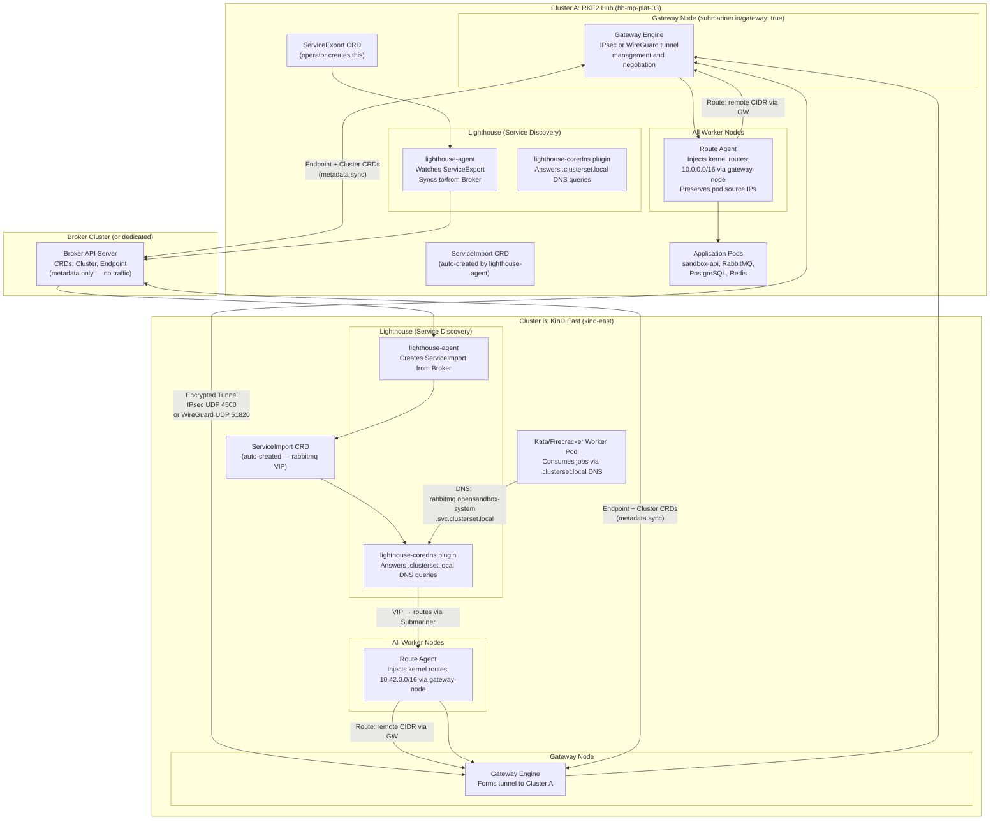
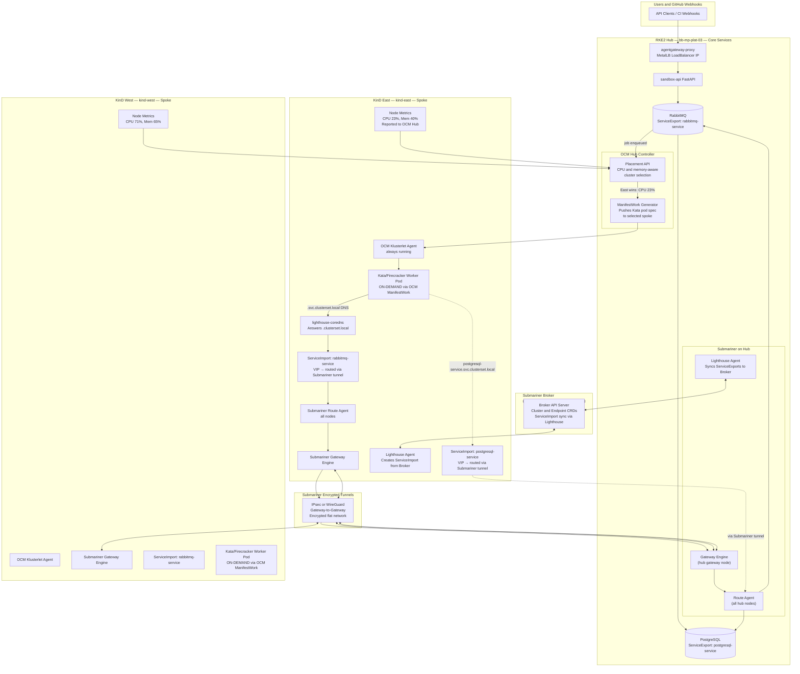
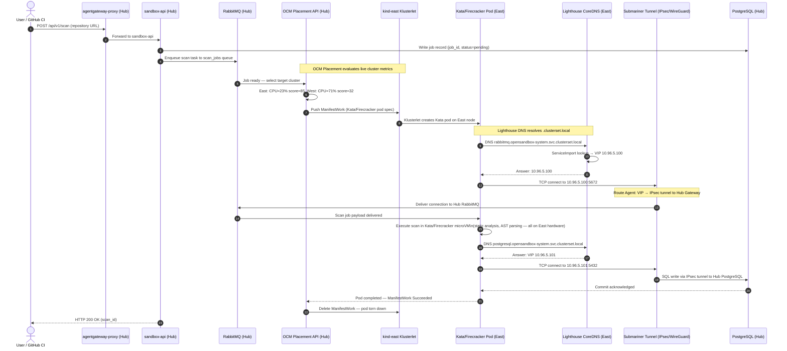

# Submariner: Multi-Cluster Networking, Service Discovery & Its Limits

> **Source:** [submariner.io/getting-started/architecture](https://submariner.io/getting-started/architecture/)
>
> **Core Question:** Does Submariner handle networking, service discovery, and endpoint reachability? Does it have any awareness of factors critical to scheduling — CPU utilisation, GPU availability, memory, node latency, pod affinity/anti-affinity?
>
> **Short Answer:**
> - **Yes** — Submariner is a dedicated multi-cluster **networking and service discovery** solution. It flattens pod/service networks across clusters and provides DNS-based service discovery via its Lighthouse component.
> - **No** — Like Cilium ClusterMesh and the MCS API, Submariner is a **pure network-layer tool**. It has zero awareness of CPU, GPU, memory, latency, or scheduling constraints. It does not orchestrate workloads.
> - **What fills the gap** — Submariner provides the network fabric (Layer 3/4). Fleet management and resource-aware scheduling still requires **OCM Placement API** or **Karmada** on top.

---

## Table of Contents

1. [What is Submariner?](#1-what-is-submariner)
2. [Core Architecture Components](#2-core-architecture-components)
3. [Architecture Diagrams](#3-architecture-diagrams)
4. [What Submariner Does: Networking & Service Discovery](#4-what-submariner-does-networking--service-discovery)
5. [What Submariner Does NOT Do: The Scheduling Gap](#5-what-submariner-does-not-do-the-scheduling-gap)
6. [Globalnet: Overlapping CIDR Support](#6-globalnet-overlapping-cidr-support)
7. [Submariner vs Cilium ClusterMesh vs MCS: Capability Matrix](#7-submariner-vs-cilium-clustermesh-vs-mcs-capability-matrix)
8. [Filling the Gap: Submariner + OCM for Full Fleet Management](#8-filling-the-gap-submariner--ocm-for-full-fleet-management)
9. [01-Sandbox Integration: ServiceExport Manifests](#9-01-sandbox-integration-serviceexport-manifests)
10. [Step-by-Step: Installing Submariner](#10-step-by-step-installing-submariner)
11. [End-to-End Flow: Request Journey with Submariner](#11-end-to-end-flow-request-journey-with-submariner)

---

## 1. What is Submariner?

Submariner is a **CNCF sandbox project** that connects multiple independent Kubernetes clusters into a single flat network. It was purpose-built to solve two problems that block multi-cluster deployments in production:

1. **Network isolation** — by default, pods and services in different clusters cannot reach each other at all
2. **Service opacity** — pods cannot resolve DNS names for services running in other clusters

Submariner fixes both by:
- **Flattening pod and service networks** across clusters using encrypted tunnels (IPsec or WireGuard)
- **Providing cross-cluster DNS discovery** via its Lighthouse component using the MCS-standard `.clusterset.local` domain

```
Without Submariner:
  Pod in Cluster A → rabbitmq.opensandbox-system.svc.cluster.local → NXDOMAIN (fails)
  Pod in Cluster A → 10.42.3.15 (Cluster B pod IP) → unreachable

With Submariner:
  Pod in Cluster A → rabbitmq.opensandbox-system.svc.clusterset.local → resolves ✅
  Pod in Cluster A → 10.42.3.15 (Cluster B pod IP) → routed via encrypted tunnel ✅
```

### Key Design Principle: CNI-Agnostic

Unlike Cilium ClusterMesh which requires Cilium as the CNI on every cluster, Submariner is **CNI-agnostic**. It works with:
- Flannel
- Calico
- Weave
- Canal
- OVN-Kubernetes
- OpenShift SDN

This makes Submariner the preferred choice when clusters run different CNI plugins — for example, your RKE2 hub runs Cilium but the remote OVH clusters run Calico.

---

## 2. Core Architecture Components

Submariner is composed of **5 components**, each with a distinct responsibility. Understanding each one is essential to understanding what Submariner can and cannot do.

### 2.1 Gateway Engine (`submariner-gateway`)

- **Runs as:** DaemonSet, but only activates on nodes labelled `submariner.io/gateway: "true"`
- **Role:** Manages the encrypted tunnel to the Gateway Engines in other clusters. Handles tunnel negotiation, key exchange, and keepalives.
- **Tunnel protocols supported:**
  - **IPsec (VXLAN over IPsec)** — default, UDP port `4500`
  - **WireGuard** — optional, UDP port `51820`
  - **VXLAN** — non-encrypted, for trusted networks
- **What it does:** When a packet is destined for a pod IP in a remote cluster, the Gateway Engine encapsulates and routes it through the tunnel to the remote cluster's Gateway Engine, which decapsulates and delivers it locally.

```
Cluster A Node          Gateway Engine A        Gateway Engine B        Cluster B Node
Pod → iptables/IPVS → encapsulate (IPsec) → WAN tunnel → decapsulate → deliver to Pod
```

### 2.2 Route Agent (`submariner-routeagent`)

- **Runs as:** DaemonSet on **every node** in the cluster (including non-gateway nodes)
- **Role:** Maintains routing tables and iptables/nftables rules on each worker node so that cross-cluster traffic is forwarded to the active Gateway Engine node, rather than dropped.
- **Why needed:** Without the Route Agent, a pod on `node-03` sending traffic to a remote cluster pod has no route. The Route Agent injects a kernel route: `10.42.0.0/16 via gateway-node-ip`.
- **Also handles:** Source IP preservation for pods (uses UDP port `4800` for encapsulation between worker nodes and gateway nodes — required for non-OVN CNI plugins).

### 2.3 Broker

- **Runs as:** A Kubernetes API server deployment, on one designated cluster (can be the hub, or a separate dedicated cluster)
- **Role:** Acts as the **shared metadata exchange point** for all participating clusters. It does NOT carry actual pod/service traffic — only metadata.
- **What it syncs via CRDs:**
  - `Cluster` — registers participating clusters and their Pod/Service CIDRs
  - `Endpoint` — defines the public IP and tunnel endpoint for each cluster's Gateway Engine
- **How it works:** Each cluster's Gateway Engine watches the Broker's CRDs. When a new cluster joins, its Endpoint CRD appears on the Broker, all other Gateway Engines see it and automatically form tunnels.

```
Cluster A Gateway Engine ──watch/update──► Broker API Server ◄──watch/update── Cluster B Gateway Engine
                                               (CRDs: Cluster, Endpoint)
                           ◄──────────────────────────────────────────────────►
                                          Auto-tunnel formation
```

### 2.4 Service Discovery — Lighthouse

- **Runs as:** `lighthouse-agent` DaemonSet + `lighthouse-coredns` Deployment
- **Role:** Provides **MCS-standard DNS discovery** across clusters
- **Implements:** Kubernetes Multi-Cluster Services (MCS) API ([KEP-1645](https://github.com/kubernetes/enhancements/tree/master/keps/sig-multicluster/1645-multi-cluster-services-api))
- **DNS domain added:** `.svc.clusterset.local` (in addition to existing `.svc.cluster.local`)

#### How Lighthouse Works

1. An operator creates a `ServiceExport` CRD on Cluster A where a Service exists
2. The `lighthouse-agent` watches for `ServiceExport` objects and syncs them to the Broker
3. `lighthouse-agent` on Cluster B pulls the synced data and creates a `ServiceImport` locally
4. `lighthouse-coredns` plugin reads `ServiceImport` objects and answers DNS queries for `.clusterset.local` names
5. Pods in Cluster B resolve `rabbitmq.opensandbox-system.svc.clusterset.local` → get the VIP → traffic routed via the Submariner tunnel to Cluster A's real RabbitMQ pod

#### DNS Resolution Modes

| DNS Name | Resolves To | Behaviour |
|:---|:---|:---|
| `rabbitmq.opensandbox-system.svc.cluster.local` | Local cluster endpoints only | Standard DNS — fails if no local Service |
| `rabbitmq.opensandbox-system.svc.clusterset.local` | All exported endpoints across ClusterSet | Lighthouse DNS — uses Submariner tunnel to reach remote cluster |
| `pod-name.cluster-id.rabbitmq.opensandbox-system.svc.clusterset.local` | Specific pod in specific cluster | Headless Service — direct pod access |

### 2.5 Globalnet Controller (Optional)

- **Role:** Enables Submariner to connect clusters with **overlapping Pod/Service CIDRs** — a scenario that Submariner's standard mode cannot handle
- **How it works:** Assigns each cluster a unique `GlobalCIDR` (e.g. `242.0.0.0/8`). Pods are remapped to GlobalCIDR IPs on the wire. Remote clusters route to GlobalCIDR IPs, which Globalnet NATs back to real pod IPs on the destination cluster.
- **When to use:** When you cannot reconfigure Pod CIDRs on existing clusters (e.g. managed cloud clusters with fixed CIDR allocation)

> [!NOTE]
> Globalnet introduces additional iptables rules and adds ~1–3ms of NAT overhead per cross-cluster packet. Prefer non-overlapping CIDRs in new deployments.

---

## 3. Architecture Diagrams

### 3.1 Submariner Internal Component Architecture



---

### 3.2 The Scheduling Gap: What Submariner Controls vs What It Cannot See

```mermaid
flowchart LR
    subgraph SubmarinerScope["What Submariner Controls"]
        direction TB
        T["Encrypted Tunnel\nIPsec or WireGuard\nbetween Gateway Engines"]
        R["Route Agent\nKernel routing tables\non every node"]
        B["Broker\nMetadata exchange\nCluster and Endpoint CRDs"]
        DNS["Lighthouse DNS\n.svc.clusterset.local\nService discovery"]
        EP["Endpoint Health\nGateway keepalives\nfailover to backup gateway"]
        GN["Globalnet (optional)\nOverlapping CIDR NAT"]
    end

    subgraph Gap["Outside Submariner Scope — The Scheduling Gap"]
        direction TB
        CPU["CPU Utilisation per Cluster\nWhich cluster has spare capacity?"]
        MEM["Memory Pressure\nAvoid OOM-risk clusters"]
        GPU["GPU Availability\nML workload placement"]
        LAT["Pod Scheduling Latency\nWhich cluster is least loaded?"]
        AFF["Pod Affinity and Anti-Affinity\nCo-location and spread rules"]
        FLEET["Fleet Workload Orchestration\nPush deployments to which clusters?"]
    end

    subgraph Filler["What Fills the Gap"]
        direction TB
        OCM["OCM Placement API\nCPU and memory-aware cluster selection"]
        KARMADA["Karmada PropagationPolicy\nReplica weighting across clusters"]
        KEDA["KEDA ScaledObject\nAutoscale on queue depth"]
    end

    SubmarinerScope --> Gap
    Gap --> Filler
```



---

### 3.3 Full Stack: Submariner + OCM + Lighthouse for 01-Sandbox



---

## 4. What Submariner Does: Networking & Service Discovery

Here is a precise list of what Submariner actively handles, sourced from the official architecture documentation:

### ✅ Layer 3: Pod-to-Pod IP Reachability

Submariner creates a **flat routed network** across clusters. Any pod IP in any connected cluster becomes directly reachable from any other cluster's pods — no NAT, no proxying, just IP routing over the encrypted tunnel.

```bash
# Pod in Cluster A can ping a pod in Cluster B by its real pod IP
kubectl exec -it pod-in-cluster-a -- ping 10.16.3.22   # Cluster B pod IP
# PING 10.16.3.22 (10.16.3.22): 56 data bytes
# 64 bytes from 10.16.3.22: icmp_seq=0 ttl=63 time=4.2 ms  ← works via tunnel
```

### ✅ Layer 3: Service IP Reachability

ClusterIP services in remote clusters are also reachable by their ClusterIP — Submariner injects routes for the entire remote Service CIDR:

```bash
# Pod in Cluster A can reach Cluster B's ClusterIP service directly
kubectl exec -it pod-in-cluster-a -- curl http://10.17.5.50:5672  # Cluster B Service IP
```

### ✅ Layer 7: DNS Service Discovery (Lighthouse)

Via the `ServiceExport` / `ServiceImport` workflow and the Lighthouse CoreDNS plugin:

```bash
# From any cluster in the ClusterSet
nslookup rabbitmq.opensandbox-system.svc.clusterset.local
# → ServiceImport VIP → Submariner tunnel → real pod in exporting cluster
```

### ✅ Encrypted Transport

All cross-cluster pod and service traffic travels through encrypted tunnels:
- **IPsec (default):** Industry-standard encryption, UDP `4500`. Full hardware offload support on modern NICs.
- **WireGuard (optional):** Modern cryptography, UDP `51820`. Lower CPU overhead than IPsec at equivalent security.
- **VXLAN (non-encrypted):** For trusted private networks where encryption is offloaded to the cloud provider.

### ✅ Gateway High Availability

Each cluster can have **multiple gateway nodes** designated. If the active gateway fails, Submariner automatically promotes a standby gateway and re-establishes all tunnels without manual intervention.

### ✅ NAT Traversal

Submariner supports clusters behind NAT (corporate firewalls, cloud NAT gateways). Uses UDP port `4490` for NAT-T discovery and falls back to custom ports if standard ports are blocked.

---

## 5. What Submariner Does NOT Do: The Scheduling Gap

Submariner's scope is unambiguously the **network layer**. The official documentation describes Submariner as a tool that *"connects multiple Kubernetes clusters in a way that is secure and performant"* and *"flattens the networks between connected clusters"*. It makes no claims about scheduling, orchestration, or resource awareness.

### Exact Capabilities Submariner Lacks

| Scheduling Factor | Submariner Awareness | Impact If Ignored |
|:---|:---:|:---|
| **CPU utilisation per cluster** | ❌ None | Worker pods dispatched to 100% CPU clusters — jobs timeout |
| **Memory pressure / OOM risk** | ❌ None | Workers OOMKilled mid-scan — jobs lost |
| **GPU availability** | ❌ None | GPU scan jobs queued on CPU-only clusters indefinitely |
| **Network round-trip latency** | ❌ None | Jobs dispatched to high-latency (far) clusters — DB writes are slow |
| **Pod affinity / anti-affinity** | ❌ None | Co-location requirements ignored across cluster boundary |
| **Node taints and tolerations** | ❌ None | Pods can land on nodes they should avoid |
| **Resource quotas per namespace** | ❌ None | Unchecked workloads exhaust remote cluster quota |
| **Fleet workload distribution** | ❌ None | No "run N replicas on cluster A, M on cluster B" mechanism |
| **GitOps delivery to clusters** | ❌ None | No mechanism to push YAML manifests to remote clusters |
| **Cross-cluster pod affinity** | ❌ None | Cannot express "this pod must run near that pod in cluster B" |

### What Submariner Sees vs What OCM Sees

```
Submariner's view of the world:
  → Cluster A has gateway at 203.0.113.10, Pod CIDR 10.42.0.0/16
  → Cluster B has gateway at 198.51.100.5, Pod CIDR 10.16.0.0/16
  → Tunnel is UP, keepalive OK
  → rabbitmq-service exported from Cluster A

OCM's view of the world (what Submariner cannot see):
  → Cluster A: 12/16 CPU cores used (75%), 28GB/32GB RAM used (87%)
  → Cluster B: 4/8 CPU cores used (50%), 8GB/16GB RAM used (50%)
  → Cluster B has 2 GPU nodes with 0 running GPU workloads
  → Cluster A has 3 ManifestWork objects running, Cluster B has 0
  → DECISION: dispatch next Kata pod to Cluster B
```

Submariner knows nothing about what OCM tracks. They are complementary layers, not competitors.

---

## 6. Globalnet: Overlapping CIDR Support

This is one of Submariner's most significant advantages over Cilium ClusterMesh. Cilium requires non-overlapping Pod CIDRs across all clusters — a hard requirement that is impossible to meet with existing managed cloud clusters (GKE, EKS, AKS all default to `10.0.0.0/8` ranges).

Submariner's **Globalnet Controller** solves this:

```
Without Globalnet (fails with overlapping CIDRs):
  Cluster A: Pod CIDR 10.42.0.0/16
  Cluster B: Pod CIDR 10.42.0.0/16  ← SAME — routing ambiguity!

  Pod in Cluster A → 10.42.3.15 → Is this Cluster A local pod or Cluster B remote pod?
  → AMBIGUOUS. Submariner cannot route correctly.

With Globalnet (works with overlapping CIDRs):
  Cluster A: Pod CIDR 10.42.0.0/16, GlobalCIDR 242.0.0.0/8
  Cluster B: Pod CIDR 10.42.0.0/16, GlobalCIDR 243.0.0.0/8

  Pod in Cluster A → 243.42.3.15 (GlobalCIDR IP for Cluster B's 10.42.3.15)
  → Globalnet NAT: 243.42.3.15 → 10.42.3.15 on Cluster B
  → No ambiguity. Routing works.
```

### Network Addressing with Globalnet for 01-Sandbox

| Cluster | Pod CIDR (actual) | GlobalCIDR (Submariner overlay) |
|:---|:---|:---|
| `default` (RKE2 Hub) | `10.42.0.0/16` | `242.0.0.0/8` |
| `kind-east` | `10.42.0.0/16` (KinD default) | `243.0.0.0/8` |
| `kind-west` | `10.42.0.0/16` (KinD default) | `244.0.0.0/8` |

> [!IMPORTANT]
> If your KinD clusters use the same Pod CIDR as your RKE2 cluster (both default to `10.42.0.0/16`), you **must** enable Globalnet when deploying Submariner. Without it, Submariner's standard routing will be ambiguous and fail silently.

---

## 7. Submariner vs Cilium ClusterMesh vs MCS: Capability Matrix

| Capability | Submariner | Cilium ClusterMesh | MCS API (standard) |
|:---|:---:|:---:|:---:|
| **Encrypted cross-cluster tunnels** | ✅ IPsec + WireGuard | ✅ WireGuard only | ❌ N/A (spec only) |
| **Pod-to-pod IP reachability** | ✅ Full flat network | ✅ eBPF routing | ❌ N/A |
| **Service IP reachability** | ✅ Full Service CIDR routing | ✅ Global service VIPs | ❌ N/A |
| **DNS discovery (`.clusterset.local`)** | ✅ Lighthouse | ✅ Built-in | ✅ Defines standard |
| **ServiceExport / ServiceImport CRDs** | ✅ Native MCS support | ✅ With flag enabled | ✅ Defines standard |
| **Overlapping Pod CIDR support** | ✅ Globalnet | ❌ Requires unique CIDRs | ❌ N/A |
| **CNI-agnostic (any CNI plugin)** | ✅ Yes | ❌ Requires Cilium CNI | ✅ Yes |
| **Locality-aware routing** | ✅ Partial (local-first DNS) | ✅ eBPF `affinity: local` | ✅ Topology hints |
| **Gateway HA / failover** | ✅ Multi-gateway support | ✅ Auto-failover | ❌ N/A |
| **NAT traversal (behind firewalls)** | ✅ NAT-T support | ❌ Requires direct gateway IP | ❌ N/A |
| **CPU-aware cluster selection** | ❌ | ❌ | ❌ |
| **Memory-aware cluster selection** | ❌ | ❌ | ❌ |
| **GPU-aware cluster selection** | ❌ | ❌ | ❌ |
| **Fleet workload deployment** | ❌ | ❌ | ❌ |
| **Pod affinity/anti-affinity cross-cluster** | ❌ | ❌ | ❌ |
| **GitOps integration** | ❌ | ❌ | ❌ |
| **Kubernetes-native open standard** | ✅ CNCF sandbox | ❌ Cilium-proprietary | ✅ KEP-1645 |
| **eBPF kernel-level performance** | ❌ Userspace gateway | ✅ Kernel eBPF | ❌ N/A |

### Decision Guide: Submariner vs Cilium ClusterMesh

```
Choose Submariner when:
  ✅ Clusters run different CNI plugins (Calico, Flannel, OVN, Weave)
  ✅ Clusters have overlapping Pod/Service CIDRs (use Globalnet)
  ✅ Clusters are behind NAT/corporate firewalls
  ✅ You want CNCF-backed, CNI-agnostic multi-cluster networking
  ✅ You need MCS-standard ServiceExport/Import without requiring Cilium

Choose Cilium ClusterMesh when:
  ✅ All clusters already run Cilium as CNI
  ✅ You want kernel-level eBPF performance (no userspace gateway hop)
  ✅ You have non-overlapping Pod CIDRs (can guarantee unique ranges)
  ✅ You want locality-aware eBPF load balancing at the socket level
```

---

## 8. Filling the Gap: Submariner + OCM for Full Fleet Management

The same three-layer model applies with Submariner as the network fabric, replacing Cilium:

```
┌──────────────────────────────────────────────────────────────────────┐
│  Layer 3: Fleet Orchestration — OCM Placement API                    │
│  "Which cluster should this pod run on, based on CPU/memory/GPU?"    │
└─────────────────────────────┬────────────────────────────────────────┘
                              │ selects cluster → dispatches ManifestWork
┌─────────────────────────────▼────────────────────────────────────────┐
│  Layer 2: Service Discovery — Submariner Lighthouse                  │
│  "How does a pod in Cluster B reach a service in Cluster A?"         │
│  (MCS-standard: ServiceExport / ServiceImport / .clusterset.local)   │
└─────────────────────────────┬────────────────────────────────────────┘
                              │ provides DNS + routed VIPs
┌─────────────────────────────▼────────────────────────────────────────┐
│  Layer 1: Network Fabric — Submariner (IPsec or WireGuard tunnels)   │
│  "How are packets physically moved between clusters, securely?"       │
└──────────────────────────────────────────────────────────────────────┘
```

### How OCM + Submariner Work Together for 01-Sandbox

```
1. sandbox-api on Hub enqueues scan job → RabbitMQ (hub-local)

2. OCM Hub queries Placement API:
   → kind-east: CPU=23%, Memory=40%  → score: 85 (selected)
   → kind-west: CPU=71%, Memory=65%  → score: 32

3. OCM creates ManifestWork → delivered to kind-east klusterlet
   → Klusterlet provisions Kata/Firecracker pod on East node

4. Kata pod connects to RabbitMQ via Lighthouse DNS:
   → rabbitmq.opensandbox-system.svc.clusterset.local
   → Lighthouse CoreDNS answers with ServiceImport VIP
   → Route Agent routes VIP via IPsec tunnel to Hub Gateway Engine
   → Hub Gateway Engine delivers to local RabbitMQ pod

5. Kata pod executes scan on East hardware

6. Kata pod writes results:
   → postgresql.opensandbox-system.svc.clusterset.local
   → Same Lighthouse + Submariner tunnel path to Hub PostgreSQL

7. OCM ManifestWork deleted → Kata pod torn down
```

---

## 9. 01-Sandbox Integration: ServiceExport Manifests

Apply on the **Hub cluster** to export core services via Submariner Lighthouse:

### Export RabbitMQ

```bash
# Option 1: Using subctl CLI (recommended)
subctl export service rabbitmq-service -n opensandbox-system --context default

# Option 2: Manual ServiceExport CRD
kubectl apply --context default -f - <<EOF
apiVersion: multicluster.x-k8s.io/v1alpha1
kind: ServiceExport
metadata:
  name: rabbitmq-service
  namespace: opensandbox-system
EOF
```

### Export PostgreSQL

```bash
subctl export service postgresql-service -n opensandbox-system --context default
```

### Export Redis

```bash
subctl export service redis-service -n opensandbox-system --context default
```

### Verify ServiceImport Created on Spoke

```bash
# Check on kind-east after export
kubectl get serviceimports -n opensandbox-system --context kind-east
# NAME                   TYPE          IP                AGE
# rabbitmq-service       ClusterSetIP  ["10.96.5.100"]   1m
# postgresql-service     ClusterSetIP  ["10.96.5.101"]   1m

# Test DNS resolution from spoke
kubectl run test --image=busybox --restart=Never --context kind-east -it --rm \
  -- nslookup rabbitmq.opensandbox-system.svc.clusterset.local
# Server:    10.96.0.10 (Lighthouse CoreDNS)
# Name:      rabbitmq.opensandbox-system.svc.clusterset.local
# Address 1: 10.96.5.100  ← ServiceImport VIP

# Test actual connectivity
kubectl run conn-test --image=busybox --restart=Never --context kind-east -it --rm \
  -- nc -zv rabbitmq.opensandbox-system.svc.clusterset.local 5672
# rabbitmq.opensandbox-system.svc.clusterset.local (10.96.5.100:5672) open ✅
```

---

## 10. Step-by-Step: Installing Submariner

### Prerequisites

| Requirement | Value |
|:---|:---|
| Kubernetes version | `>= 1.19` (service discovery requires `>= 1.21`) |
| Gateway node access | Clusters must have IP reachability between gateway nodes |
| Encapsulation port | UDP `4500` (IPsec) or `51820` (WireGuard) open between gateway nodes |
| Pod encapsulation port | UDP `4800` open across all nodes within each cluster |
| Architecture | x86-64 or ARM64 |
| Non-overlapping CIDRs | Required in standard mode. Use Globalnet if CIDRs overlap |

### Step 1: Install `subctl` CLI

```bash
curl -Ls https://get.submariner.io | bash
sudo mv ~/.local/bin/subctl /usr/local/bin/
subctl version
```

### Step 2: Deploy the Broker on the Hub Cluster

```bash
subctl deploy-broker --context default
# ✅ Broker deployed to hub cluster
# ✅ broker-info.subm file created (contains connection credentials)
```

### Step 3: Join the Hub Cluster to the Broker

```bash
subctl join broker-info.subm \
  --context default \
  --clusterid rke2-hub \
  --natt=false  # if gateway nodes have direct IP reachability (no NAT)
```

### Step 4: Join East Spoke to the Broker

```bash
subctl join broker-info.subm \
  --context kind-east \
  --clusterid kind-east \
  --natt=false
```

### Step 5: Join West Spoke to the Broker

```bash
subctl join broker-info.subm \
  --context kind-west \
  --clusterid kind-west \
  --natt=false
```

### Step 6: Verify Tunnels are UP

```bash
subctl show connections --context default
# GATEWAY             CLUSTER        REMOTE IP        NAT  CABLE DRIVER  SUBNETS              STATUS
# rke2-hub            rke2-hub       203.0.113.10     no   libreswan      10.42.0.0/16         connected
# kind-east-gw        kind-east      192.168.100.2    no   libreswan      10.16.0.0/16         connected
# kind-west-gw        kind-west      192.168.100.3    no   libreswan      10.18.0.0/16         connected
```

### Step 7: Enable Globalnet (if CIDRs overlap)

```bash
# If your KinD spokes use the same Pod CIDR as Hub (10.42.0.0/16):
subctl deploy-broker --context default --globalnet
subctl join broker-info.subm --context default  --clusterid rke2-hub  --globalnet-cidr 242.0.0.0/8
subctl join broker-info.subm --context kind-east --clusterid kind-east --globalnet-cidr 243.0.0.0/8
subctl join broker-info.subm --context kind-west --clusterid kind-west --globalnet-cidr 244.0.0.0/8
```

---

## 11. End-to-End Flow: Request Journey with Submariner



---

## Summary

| Layer | Technology | Concern Solved |
|:---|:---|:---|
| **Network Fabric** | Submariner (IPsec/WireGuard tunnels + Route Agent) | Encrypted pod/service IP reachability across clusters; NAT traversal; Globalnet for overlapping CIDRs |
| **Service Discovery** | Submariner Lighthouse (MCS: ServiceExport/Import) | Standard `.clusterset.local` DNS; cross-cluster service name resolution without code changes |
| **Fleet Scheduling** | OCM Placement API + ManifestWork | CPU/memory/GPU-aware cluster selection; on-demand pod provisioning to spokes |
| **Autoscaling** | KEDA + RabbitMQ trigger | Scale ManifestWork count based on queue depth |
| **GitOps Delivery** | ArgoCD on Hub | Deploy and update hub services from Git |

> **Takeaway:** Submariner is a **pure networking and service discovery tool**. It excels at connecting clusters with different CNIs, overlapping CIDRs, and NAT-traversal requirements — areas where Cilium ClusterMesh falls short. But like Cilium ClusterMesh and the MCS API, it has zero awareness of CPU, memory, GPU, or scheduling constraints. The complete production stack for 01-Sandbox needs all layers: **Submariner (networking) + Lighthouse (service discovery) + OCM (scheduling)**.
