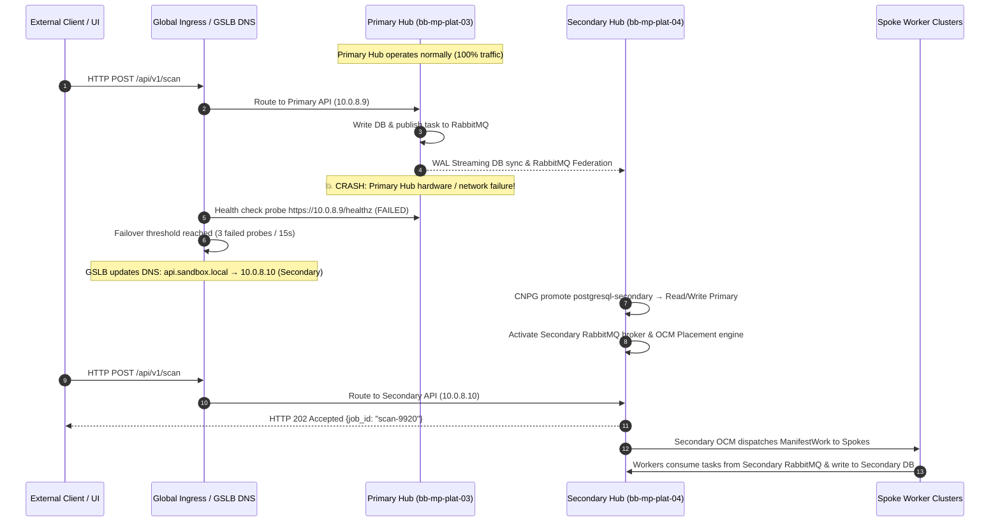
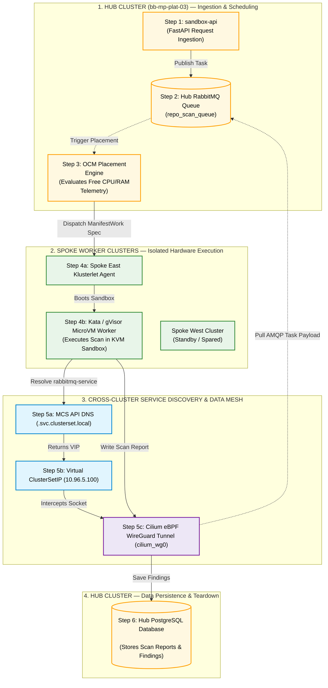

# 01-Sandbox: Updated Multi-Cluster Architecture, Component Strategy & High Availability Guide

---

### Option: 1: Real-Time Data Synchronization Across Hub Nodes (Node 1 ↔ Node 2 ↔ Node 3)

To ensure that **if Node 1 goes down, Node 2 (or Node 3) immediately takes over and serves the application with zero data loss**, data is continuously synchronized across all 3 nodes in real-time using native in-cluster replication engines:

```
                  ┌─────────────────────────────────────────────────────────┐
                  │          SINGLE HUB CLUSTER (bb-mp-plat-03)           │
                  │              (3-Node RKE2 HA Cluster)                   │
                  ├─────────────────────────────────────────────────────────┤
                  │                                                         │
                  │  ┌──────────────┐   ┌──────────────┐   ┌──────────────┐ │
                  │  │ Node 1       │   │ Node 2       │   │ Node 3       │ │
                  │  │ (Master/Wrk) │   │ (Master/Wrk) │   │ (Master/Wrk) │ │
                  │  ├──────────────┤   ├──────────────┤   ├──────────────┤ │
                  │  │ API Pod 1    │   │ API Pod 2    │   │ API Pod 3    │ │
                  │  │ CNPG Primary │◄─►│ CNPG Standby │◄─►│ CNPG Standby │ │
                  │  │ RMQ Leader   │◄─►│ RMQ Follower │◄─►│ RMQ Follower │ │
                  │  └──────────────┘   └──────────────┘   └──────────────┘ │
                  └────────────────────────────┬────────────────────────────┘
                                               │
                                               │ Cilium ClusterMesh (WireGuard)
                                               ▼
                                  ┌──────────────────────────┐
                                  │   SPOKE WORKER CLUSTERS  │
                                  │   (Pure Stateless Workers│
                                  │    No Local Fallback)    │
                                  └──────────────────────────┘
```

#### 1. PostgreSQL Real-Time Data Sync (CloudNativePG Operator)
*   **How Data Syncs:** CloudNativePG runs **1 Primary instance** (on Node 1) and **2 Standby Replicas** (on Node 2 and Node 3).
*   **Replication Engine:** Every `INSERT`, `UPDATE`, or scan result committed on Node 1 is continuously streamed in real-time to Node 2 and Node 3 via PostgreSQL **Streaming Replication (Write-Ahead Logs - WAL)**.
*   **Automatic Failover When Node 1 Fails:**
    1. The CNPG controller detects Node 1 failure within **~3 to 5 seconds**.
    2. CNPG automatically promotes the Standby Replica on Node 2 (or Node 3) to become the new **Primary Master**.
    3. The internal Service IP (`postgresql-service`) updates in real time to point to Node 2.
    4. All worker reads and writes resume instantly with **zero data loss**.

#### 2. RabbitMQ Real-Time Data Sync (Quorum Queues / Raft Consensus)
*   **How Data Syncs:** RabbitMQ runs 3 pods (1 on Node 1, 1 on Node 2, 1 on Node 3) configured with **Quorum Queues**.
*   **Replication Engine:** When a scan task message is published to the leader queue on Node 1, it is synchronously replicated to the follower queue instances on Node 2 and Node 3 using the **Raft consensus algorithm** before sending an acknowledgment.
*   **Automatic Failover When Node 1 Fails:**
    1. The Raft consensus protocol detects Node 1 failure instantly.
    2. The follower pod on Node 2 (or Node 3) is automatically elected as the new **Queue Leader**.
    3. Zero pending scan messages are lost, and Spoke workers continue consuming tasks seamlessly.

#### 3. Redis Real-Time Data Sync (Redis Sentinel / Replication)
*   **How Data Syncs:** Redis Master runs on Node 1 with active replication to Redis Replicas on Node 2 and Node 3.
*   **Automatic Failover When Node 1 Fails:** Redis Sentinel detects Master node loss, executes automated failover, and promotes Node 2 to Master.

#### 4. API Server Real-Time High Availability (`sandbox-api`)
*   **Stateless Execution:** `sandbox-api` runs `replicas: 3` (1 pod on each node).
*   **Automatic Failover When Node 1 Fails:** MetalLB Ingress instantly routes incoming client HTTP traffic to the active pods on Node 2 and Node 3 with **zero client downtime**.
---

### In-Cluster High Availability Summary

| Core Component | Replication Strategy Across Nodes (Node 1 ↔ Node 2 ↔ Node 3) | Failover Behavior (If Node 1 Fails) | Data Loss Risk |
|:---|:---|:---|:---:|
| **PostgreSQL** | Continuous Streaming Replication (CNPG WAL sync) | Node 2/3 promoted to Primary in ~3–5s | **Zero Data Loss** |
| **RabbitMQ** | Synchronous Raft Consensus (Quorum Queues) | Node 2/3 follower promoted to Leader instantly | **Zero Message Loss** |
| **Redis** | Redis Sentinel active replication | Node 2/3 promoted to Master automatically | Minimal (Ephemeral cache) |
| **API Server** | Stateless Pod Anti-Affinity (`replicas: 3`) | MetalLB routes to active Node 2/3 pods | **Zero Downtime** |
| **Spoke Workers** | Pure Stateless Execution (Direct Hub Connection) | Retries connection to Hub during 5s failover | None (Stateless) |

---
## Option 2: Active-Passive Dual-Hub Cluster Architecture Blueprint

### 1 High-Level Dual-Hub System Topology

In **Option 2**, the architecture deploys two independent Hub clusters:
1. **Primary Hub Cluster (`bb-mp-plat-03` — Active):** Serves 100% of live client API traffic and manages active OCM workload placement to Spokes.
2. **Secondary Standby Hub Cluster (`bb-mp-plat-04` — Passive / Backup):** Equipped with identical core services (`sandbox-api`, PostgreSQL, RabbitMQ, Redis, OCM Control Plane). Continuously receives real-time data replication from the Primary Hub and remains on hot-standby.

```
                    ┌─────────────────────────────────────────┐
                    │   GLOBAL INGRESS / GSLB LOAD BALANCER   │
                    │   (Cloudflare GSLB / Anycast BGP DNS)   │
                    └───────────┬─────────────────┬───────────┘
                                │                 │
                      Active    │ Primary         │ Backup   Passive
                      Route     │ (Healthy)       │ (Hot Standby)
                                ▼                 ▼
                   ┌───────────────────┐   ┌───────────────────┐
                   │  PRIMARY HUB      │   │  SECONDARY HUB    │
                   │  bb-mp-plat-03    │   │  bb-mp-plat-04    │
                   │  ├── sandbox-api  │   │  ├── sandbox-api  │
                   │  ├── PostgreSQL   ├──►│  ├── PostgreSQL   │ (CNPG Cross-Cluster Replica)
                   │  ├── RabbitMQ     ├──►│  ├── RabbitMQ     │ (RabbitMQ Federation/Shovel)
                   │  ├── Redis Master ├──►│  ├── Redis Replica│ (Async Replication)
                   │  └── OCM Leader   │   │  └── OCM Standby  │ (Multi-Hub Klusterlet)
                   └─────────┬─────────┘   └─────────┬─────────┘
                             │                       │
                             │ Primary WireGuard     │ Backup WireGuard
                             │ Mesh Tunnel           │ Mesh Tunnel
                             ▼                       ▼
                   ┌───────────────────────────────────────────┐
                   │           SPOKE WORKER CLUSTERS           │
                   │   (kind-east, kind-west, RKE2 Spokes)     │
                   └───────────────────────────────────────────┘
```

---

### 2. Core Components & Synchronization Strategies for Dual-Hub Setup

To make the Secondary Hub cluster fully ready to take over if the Primary Hub goes down, five core synchronization strategies are implemented:

#### 1. Ingress & Traffic Failover Strategy (Global Ingress / GSLB Anycast DNS)
*   **Components:** Cloudflare GSLB / Route53 DNS / ExternalDNS + MetalLB Ingress Gateway on both Hubs (`10.0.8.9` for Primary, `10.0.8.10` for Secondary).
*   **How it Works:**
    - Client applications send API requests to `api.sandbox.local`.
    - GSLB monitors the health of Primary Hub (`https://10.0.8.9/healthz`) every 5 seconds.
    - **Failover Action:** If Primary Hub fails 3 consecutive health probes (15 seconds total), GSLB automatically updates DNS resolution so `api.sandbox.local` points to Secondary Hub Ingress (`10.0.8.10`). Clients seamlessly redirect to Secondary `sandbox-api`.

#### 2. PostgreSQL Cross-Cluster Real-Time Data Sync (CloudNativePG Cross-Cluster Replica)
*   **Components:** CloudNativePG (CNPG) Operator running on both Hubs connected via Cilium ClusterMesh WireGuard tunnel (`cilium_wg0`).
*   **How it Works:**
    - **Primary Hub:** Runs CNPG `Cluster` named `postgresql-primary` (Read-Write Mode).
    - **Secondary Hub:** Runs CNPG `replica` mode `Cluster` named `postgresql-secondary`.
    - Every transaction committed on Primary PostgreSQL is continuously streamed in near-real-time across the cross-cluster WireGuard tunnel to Secondary PostgreSQL using **Write-Ahead Log (WAL) Streaming Replication**.
    - **Failover Action:** When Primary Hub crashes, an automated script (or operator trigger) on Secondary Hub executes: `cnpg promote postgresql-secondary`. The Secondary database immediately transitions from standby to active Read-Write Primary.

#### 3. RabbitMQ Queue Synchronization Strategy (RabbitMQ Federation & Shovel)
*   **Components:** RabbitMQ Federation Plugin / Shovel Plugin over TLS (`amqps://`).
*   **How it Works:**
    - Primary Hub RabbitMQ handles live scan task publishing.
    - Secondary Hub RabbitMQ runs a matching queue structure configured with the **RabbitMQ Federation Plugin**. The federation plugin mirrors published messages across clusters to the backup queue.
    - **Failover Action:** When clients redirect to Secondary Hub, `sandbox-api` publishes new task messages to Secondary RabbitMQ. Spoke workers switch to consuming from Secondary RabbitMQ endpoints (`rabbitmq-backup.opensandbox-system.svc.clusterset.local`).

#### 4. Redis Active State Replication Strategy
*   **Components:** Redis Operator with Cross-Cluster Replication.
*   **How it Works:** Primary Hub Redis Master replicates rate limit counters and API key quota states asynchronously to Secondary Hub Redis Replica over encrypted WireGuard tunnel. Upon failover, Secondary Redis is promoted to Master.

#### 5. Open Cluster Management (OCM) Multi-Hub Registration & Workload Dispatch Failover
*   **Components:** OCM Multi-Hub Registration (`Klusterlet` dual-registration).
*   **How it Works:**
    - Spoke `Klusterlet` agents are registered with **both** Primary Hub (`bb-mp-plat-03`) and Secondary Hub (`bb-mp-plat-04`).
    - Under normal operation, Primary Hub OCM evaluates `Placement` rules and dispatches `ManifestWork` specs to Spokes.
    - **Failover Action:** When Primary Hub becomes unreachable, Secondary Hub OCM takes over placement scoring, dispatching microVM worker specs (`ManifestWork`) to Spokes.

---

### 3. End-to-End Failover Sequence (Primary Hub Crash → Secondary Hub Activation)



---

### Summary of Dual-Hub High Availability

| Core Component | Primary Hub (`bb-mp-plat-03`) | Secondary Hub (`bb-mp-plat-04`) | Synchronization Engine | Failover Trigger & Action |
|:---|:---|:---|:---|:---|
| **API Ingress** | Active (`10.0.8.9`) | Hot Standby (`10.0.8.10`) | GSLB / Anycast DNS | GSLB probes fail 3x → Shifts DNS to `10.0.8.10` |
| **PostgreSQL** | Primary (Read-Write) | Standby Replica | CNPG Streaming WAL Replication | CNPG promote command → Promotes replica to Read-Write |
| **RabbitMQ** | Active Broker Leader | Active Federation Backup | RabbitMQ Federation / Shovel | Ingress redirection → Clients/Workers switch to Sec AMQP |
| **Redis** | Active Master | Standby Replica | Redis Cross-Cluster Replication | Redis Sentinel / Operator promotes Standby to Master |
| **OCM Control Plane**| Active Fleet Dispatcher | Standby Fleet Dispatcher | Dual-Hub Klusterlet Registration | Primary unreachable → Sec OCM dispatches `ManifestWork` |

---

## Comprehensive Multi-Cluster Technology Comparison Matrix

Below is the side-by-side evaluation comparing **Option 2: Active-Passive Dual-Hub Stack** against **Option 1: Single-Hub 3-Node HA**:

| Evaluation Dimension | Option 2: Active-Passive Dual-Hub Stack (Recommended) | Option 1: Single-Hub 3-Node In-Cluster HA |
|:---|:---|:---|
| **Layer 1: Network Fabric** | **Cilium ClusterMesh (eBPF + WireGuard)** | Cilium ClusterMesh (eBPF + WireGuard) |
| **Layer 2: Service Discovery** | **Kubernetes MCS API (KEP-1645)** | Kubernetes MCS API (KEP-1645) |
| **Layer 3: Fleet Scheduler** | **Open Cluster Management (OCM)** | Open Cluster Management (OCM) |
| **Data Path Latency** | **< 0.2 ms (Kernel eBPF)** | < 0.2 ms (Kernel eBPF) |
| **Hub SPOF Resilience** | **✅ Maximum (Full Secondary Standby Hub)** | ✅ High (3-Node In-Cluster HA)|
| **Database Sync** | **✅ CNPG Cross-Cluster WAL Streaming** | In-Cluster CNPG WAL Sync |
| **Queue Sync** | **✅ RabbitMQ Federation / Shovel** | In-Cluster Quorum Queues |
| **Operational Footprint** | **Medium-High (2 Hub Clusters)** | Low (1 Hub Cluster) |
| **Key Pros** | • **Datacenter/Site Loss Protection:** Withstands complete primary datacenter crash.<br>• **Cross-Region DR:** Allows active-passive placement across separate facilities.<br>• **Zero Job Loss:** Cross-cluster WAL and federation sync preserve all scan state. | • **Low Cost & Complexity:** Single cluster footprint using native K8s primitives.<br>• **Fast Local Failover:** Node crash failover in ~3–5 seconds over local LAN.<br>• **Zero Cross-Cluster Sync Latency:** Data sync happens locally within Hub. |
| **Key Cons** | • **Higher Resource Cost:** Requires 2 full Hub cluster footprints.<br>• **Cross-Cluster Link Reliance:** Sync relies on stable WireGuard mesh connection.<br>• **Setup Overhead:** Requires GSLB health check and federation config. | • **Vulnerable to Total Site Loss:** Datacenter outage brings platform down.<br>• **No Cross-Region DR:** Cannot fail over to secondary facility without backups. |

---

### Detailed Pros and Cons Breakdown

#### Option 2: Active-Passive Dual-Hub Stack (Recommended)

##### 🟢 Pros:
1. **Maximum High Availability & Site Fault Tolerance:** If the entire Primary Hub cluster (`bb-mp-plat-03`) or its hosting datacenter suffers a catastrophic outage, the Secondary Hub (`bb-mp-plat-04`) takes over seamlessly.
2. **Cross-Region / Multi-Datacenter Disaster Recovery:** Primary and Secondary Hubs can be geographically separated across cloud providers or physical facilities.
3. **Automated Client & Worker Redirection:** GSLB DNS health probes automatically shift client API calls to Secondary Hub (`10.0.8.10`) within 15 seconds.
4. **Data Protection:** PostgreSQL WAL streaming replication and RabbitMQ Federation ensure scan reports and task payloads are safely replicated to the Secondary Hub before failover.

##### 🔴 Cons:
1. **Higher Infrastructure Overhead & Cost:** Requires deploying and maintaining two independent Hub clusters, doubling control plane resource consumption.
2. **Cross-Cluster Link Dependency:** Data replication depends on an active, encrypted WireGuard mesh link (`cilium_wg0`) between Hubs.
3. **Operational Configuration:** Requires setting up GSLB health monitoring probes, CNPG cross-cluster replica manifests, and RabbitMQ federation plugins.

---

#### Option 1: Single-Hub 3-Node In-Cluster HA

##### 🟢 Pros:
1. **Minimal Operational Footprint:** Standard single-cluster RKE2 setup (`bb-mp-plat-03`) running 3 control-plane/worker nodes with embedded etcd.
2. **Low Cost:** Requires only one Hub cluster footprint without needing a second standby cluster.
3. **Sub-Second Local Failover:** Node failures trigger in-cluster pod rescheduling and CNPG master promotion in ~3 to 5 seconds over local high-speed LAN.
4. **Zero Cross-Cluster Sync Overhead:** PostgreSQL WAL streaming and RabbitMQ Raft consensus operate locally within the Hub network.

##### 🔴 Cons:
1. **Vulnerable to Total Datacenter Outage:** If the entire physical server facility or hosting rack goes offline, 01-Sandbox stops scanning until hardware is restored.
2. **No Multi-Facility Failover:** Lacks a standby cluster in a secondary facility to serve traffic during primary site maintenance or disasters.


---

## 1. Clean Hub & Spoke Traffic Flow Diagram

Below is the strictly downward-flowing Mermaid flowchart built with standard syntax:



---

## 2. Text Architecture Diagram (Guaranteed 100% Clean Rendering)

```
┌─────────────────────────────────────────────────────────────────────────────────────────┐
│ [STEP 1] CLIENT SUBMISSION                                                              │
│ User HTTP Request ──► Hub sandbox-api (10.0.8.9) ──► Validates Rate Limits & Quotas    │
└──────────────────────────────────────────┬──────────────────────────────────────────────┘
                                           │ [Step 1.1] Publishes Task Payload
                                           ▼
┌─────────────────────────────────────────────────────────────────────────────────────────┐
│ [STEP 2] HUB RABBITMQ QUEUE                                                             │
│ Holds persistent task payloads in repo_scan_queue (ServiceExport declared)              │
└──────────────────────────────────────────┬──────────────────────────────────────────────┘
                                           │ [Step 2.1] Telemetry Trigger
                                           ▼
┌─────────────────────────────────────────────────────────────────────────────────────────┐
│ [STEP 3] OCM FLEET SCHEDULER                                                            │
│ Evaluates Spoke heartbeats (East 23% CPU vs West 71% CPU) ──► Selects Spoke East        │
└──────────────────────────────────────────┬──────────────────────────────────────────────┘
                                           │ [Step 3.1] Dispatches ManifestWork Spec
                                           ▼
┌─────────────────────────────────────────────────────────────────────────────────────────┐
│ [STEP 4] SPOKE EAST (kind-east) & KATA MICROVM                                          │
│ Klusterlet receives ManifestWork ──► Boots Firecracker KVM MicroVM sandbox (<800ms)     │
└──────────────────────────────────────────┬──────────────────────────────────────────────┘
                                           │ [Step 5.1] Resolves MCS DNS (.svc.clusterset.local)
                                           ▼
┌─────────────────────────────────────────────────────────────────────────────────────────┐
│ [STEP 5] MCS API DISCOVERY & EBPF WIREGUARD MESH                                        │
│ MCS DNS returns VIP 10.96.5.100 ──► Cilium eBPF translates VIP to Hub Pod IP 10.42.3.15│
│ Transport: Encrypted kernel WireGuard tunnel (cilium_wg0) ──► Pulls AMQP task payload  │
└──────────────────────────────────────────┬──────────────────────────────────────────────┘
                                           │ [Step 6.1] Writes Scan Results
                                           ▼
┌─────────────────────────────────────────────────────────────────────────────────────────┐
│ [STEP 6] HUB POSTGRESQL DATABASE & TEARDOWN                                             │
│ Report inserted into DB ──► Worker sends AMQP ACK ──► MicroVM pod auto-destroys        │
└──────────────────────────────────────────────────────────┬──────────────────────────────┘
```

---

## 3. Numbered Traffic Flow Breakdown

| Step # | Traffic Stage | Source ──► Destination | Flow Action & Technical Description |
|:---:|:---|:---|:---|
| **`[Step 1]`** | **Client Ingestion** | External Client ──► Hub `sandbox-api` | User sends HTTP POST `/api/v1/scan`. `sandbox-api` validates Redis rate limits & key quotas. |
| **`[Step 2]`** | **Task Enqueueing** | Hub `sandbox-api` ──► Hub RabbitMQ | `sandbox-api` publishes persistent task payload to `repo_scan_queue` and returns `202 Accepted` to client. |
| **`[Step 3]`** | **Spoke Placement** | Hub OCM ──► Spoke East (`kind-east`) | OCM evaluates Spoke heartbeats (East 23% CPU vs West 71% CPU), selects `kind-east`, and dispatches `ManifestWork`. |
| **`[Step 4]`** | **Sandbox Provisioning**| Spoke `Klusterlet` ──► Firecracker MicroVM | Containerd invokes Kata shim + Firecracker, booting a clean KVM microVM (`kata-qemu`) in **<800ms**. |
| **`[Step 5a]`**| **MCS Service Discovery**| MicroVM Worker ──► MCS API DNS Zone | MicroVM queries `rabbitmq-service.opensandbox-system.svc.clusterset.local`. MCS API DNS returns Virtual `ClusterSetIP` (`10.96.5.100`). |
| **`[Step 5b]`**| **eBPF Mesh Connection**| MicroVM Worker ──► Hub RabbitMQ | Cilium `sock_ops` eBPF intercepts connection to `10.96.5.100`, maps it to Hub Pod (`10.42.3.15`), and pulls tasks via WireGuard (`basic.qos=3`). |
| **`[Step 6]`** | **Result Persistence** | MicroVM Worker ──► Hub PostgreSQL DB | Worker resolves `postgresql-service...svc.clusterset.local`, connects via eBPF WireGuard mesh, and inserts findings into DB. |
| **`[Step 7]`** | **Teardown & Cleanup** | MicroVM Worker ──► Hub OCM | Worker sends AMQP ACK. OCM deletes `ManifestWork` spec, destroying the Firecracker microVM (0 idle footprint). |

---

# Option 2: Active-Passive Dual-Hub Stack — Full Setup Guide

> This guide walks you through building the Active-Passive Dual-Hub architecture from scratch. **Neither hub cluster needs to exist yet** — we will provision both `bb-mp-plat-03` (Primary Hub) and `bb-mp-plat-04` (Secondary Hub) step by step.

---

## 🗺️ Big Picture: What We're Building

```
  CLIENTS / API USERS
         │
         ▼
  ┌─────────────────────┐
  │  GSLB / DNS         │  ← Watches health. Switches traffic on failover.
  │  api.sandbox.local  │
  └─────┬─────────┬─────┘
        │         │
        ▼         ▼ (only if Primary fails)
  ┌───────────┐  ┌───────────┐
  │ PRIMARY   │  │ SECONDARY │
  │ HUB       │  │ HUB       │
  │ plat-03   │  │ plat-04   │
  │ (ACTIVE)  │  │ (STANDBY) │
  └─────┬─────┘  └─────┬─────┘
        │               │
        └───────┬───────┘
                │
                ▼
     ┌─────────────────────┐
     │  SPOKE CLUSTERS     │
     │  kind-east          │
     │  kind-west          │
     │  (Registered to     │
     │   BOTH Hubs)        │
     └─────────────────────┘
```

---

## 📋 Phase Overview (Detailed Implementation Breakdown)

| Phase | Core Action & Target Clusters | Key Technology / Tooling | Operational & High-Availability Details |
|:---:|:---|:---|:---|
| **Phase 1** | **Bootstrap Hub Control Planes**<br/>• Primary Hub (`plat-03` / `10.0.8.9`)<br/>• Secondary Hub (`plat-04` / `10.0.8.10`) | RKE2 (`rke2-server`), Cilium CNI, `kubectl` | Provision two independent Kubernetes control rooms from scratch. Configure isolated `kubeconfig` contexts (`config-plat-03`, `config-plat-04`), verify node health, and create core namespaces (`opensandbox-system`, `open-cluster-management`). |
| **Phase 2** | **Install Open Cluster Management (OCM)**<br/>• Both Hubs (`plat-03` & `plat-04`) | OCM `clusteradm` CLI, Registration Operator | Initialize dual independent OCM control planes on both Hubs using `clusteradm init`. Generate unique `jointoken`s for Spoke onboarding and establish fleet management services. |
| **Phase 3** | **Dual-Hub Spoke Registration**<br/>• Spokes (`kind-east`, `kind-west`) → Both Hubs | OCM `Klusterlet`, `clusteradm join`, `clusteradm accept` | Register Spoke `Klusterlet` agents to **BOTH** Primary and Secondary Hubs simultaneously. Spokes operate in zero-maintenance mode, continuously streaming real-time CPU/RAM allocatable capacity telemetry to both Hubs for placement scoring. |
| **Phase 4** | **Cilium ClusterMesh & WireGuard Tunnel**<br/>• Primary Hub ↔ Secondary Hub network fabric | Cilium CLI, WireGuard Encryption, ClusterMesh | Establish encrypted, high-performance inter-cluster Pod-to-Pod and Service-to-Service network routing across Hubs. Exchange cluster identities, issue CA certs, and validate cross-cluster ping (`10.0.8.9` ↔ `10.0.8.10`). |
| **Phase 5** | **CloudNativePG (CNPG) PostgreSQL Replication**<br/>• Primary DB (`plat-03`) → Secondary DB (`plat-04`) | CloudNativePG Operator, WAL Streaming, ClusterMesh DNS | Deploy Primary CNPG PostgreSQL cluster. Deploy Secondary standby CNPG cluster with `bootstrap.recovery.source` pointing across ClusterMesh to Primary DB for continuous real-time WAL streaming replication. |
| **Phase 6** | **RabbitMQ Cross-Cluster Federation**<br/>• Primary Broker (`plat-03`) ↔ Secondary Downstream (`plat-04`) | RabbitMQ Federation Plugin, AMQP via ClusterMesh | Enable `rabbitmq_federation` plugin. Configure Secondary Hub as a downstream federated exchange to mirror task queue messages (`repo_scan_queue`) from Primary to Secondary in real-time. |
| **Phase 7** | **Redis Cross-Cluster State Replication**<br/>• Primary Master (`plat-03`) → Secondary Replica (`plat-04`) | Redis `replicaof`, ClusterMesh TCP routing | Configure Secondary Redis instance as a live read-only replica (`replicaof redis-primary... 6379`). Continuously mirrors rate-limiting counters, key quotas, and session tokens from Primary to Secondary. |
| **Phase 8** | **Deploy CodeInspector Stack via Helm**<br/>• Primary Hub (`plat-03` - Active)<br/>• Secondary Hub (`plat-04` - Hot Standby) | Helm 3 (`codeInspector/` chart), `values.yaml` | Execute `helm upgrade --install codeinspector ./codeInspector` on both Hubs. Provisions `sandbox-api` (`apiServer`), Agent Gateway, resource pools, and monitoring. Secondary runs warm on standby for zero cold-start failover. |
| **Phase 9** | **GSLB / Health-Check Automated DNS Failover**<br/>• Client Endpoint (`api-sandbox.01security.com`) | CoreDNS / Cloudflare GSLB / Failover CronJob | Point GSLB DNS to Primary IP (`10.0.8.9`). Configure continuous 5s `/healthz` HTTP probes. Automatically update DNS resolution to Secondary IP (`10.0.8.10`) if Primary fails 3 consecutive probes (~15s). |
| **Phase 10** | **End-to-End Failover & Recovery Verification**<br/>• Primary Crash Simulation & Spoke Dispatch | `kubectl cnpg promote`, `curl`, `kubectl get manifestworks` | Simulate Primary failure (`kubectl scale deployment sandbox-api --replicas=0`), confirm GSLB switches to `10.0.8.10`, promote Secondary CNPG DB (`kubectl cnpg promote`), submit `/api/v1/scan`, and verify Spokes receive and execute job from Secondary Hub. |

---

## 🔧 Phase 1: Prepare Both Hub Clusters

### What you're doing
You need two separate, working RKE2 Kubernetes clusters. Think of them as two independent control rooms. **Neither needs to exist yet** — you will build both from scratch in this phase. Run the Primary Hub steps on `bb-mp-plat-03`, then repeat on `bb-mp-plat-04` for the Secondary Hub.

**Machines you need:**
- `primaryhub` (`192.168.122.225`) = Primary Hub — built first, serves all live traffic
- `secondaryhub` (`192.168.122.143`) = Secondary Hub — built second, sits on hot standby

---

### 🖥️ PRIMARY HUB — `primaryhub` (`192.168.122.225`)

#### Step 1.1 — Bootstrap RKE2 on Primary Hub (`primaryhub`)

SSH into `primaryhub` and run:

```bash
# Download and install RKE2
curl -sfL https://get.rke2.io | sh -

# Enable the RKE2 server service
systemctl enable rke2-server.service

# Write the RKE2 config file
mkdir -p /etc/rancher/rke2
cat > /etc/rancher/rke2/config.yaml <<EOF
cluster-init: true
write-kubeconfig-mode: "0644"

node-ip: "192.168.122.225"
node-external-ip: "192.168.122.225"
advertise-address: "192.168.122.225"

cni: cilium
disable-kube-proxy: true

cluster-cidr: "10.42.0.0/16"
service-cidr: "10.43.0.0/16"

tls-san:
  - "192.168.122.225"
  - "127.0.0.1"
  - "localhost"

disable:
  - rke2-canal
  - rke2-ingress-nginx

kubelet-arg:
  - "max-pods=250"
  - "serialize-image-pulls=false"
EOF

# Start RKE2
systemctl start rke2-server.service

# Watch it come up (wait until you see "Node primaryhub status updated")
journalctl -u rke2-server -f
```

#### Step 1.2 — Get the kubeconfig for Primary Hub

Run this on `primaryhub`

```bash
# Test connectivity
kubectl get nodes
```

Expected output:
```
NAME           STATUS   ROLES                  AGE   VERSION
primaryhub  Ready    control-plane,master   1m    v1.30.x
```

#### Step 1.3 — Create the application namespace on Primary Hub

```bash
kubectl create namespace opensandbox-system
```

---

### 🖥️ SECONDARY HUB — `secondaryhub` (`192.168.122.143`)

#### Step 1.4 — Bootstrap RKE2 on Secondary Hub (`secondaryhub`)

SSH into `secondaryhub` and run:

```bash
# Download and install RKE2
curl -sfL https://get.rke2.io | sh -

# Enable the RKE2 server service
systemctl enable rke2-server.service

# Write the RKE2 config file
mkdir -p /etc/rancher/rke2
cat > /etc/rancher/rke2/config.yaml <<EOF
cluster-init: true
write-kubeconfig-mode: "0644"

node-ip: "192.168.122.143"
node-external-ip: "192.168.122.143"
advertise-address: "192.168.122.143"

cni: cilium
disable-kube-proxy: true

cluster-cidr: "10.142.0.0/16"
service-cidr: "10.143.0.0/16"

tls-san:
  - "192.168.122.143"
  - "127.0.0.1"
  - "localhost"

disable:
  - rke2-canal
  - rke2-ingress-nginx

kubelet-arg:
  - "max-pods=250"
  - "serialize-image-pulls=false"
EOF

# Start RKE2
systemctl start rke2-server.service

# Watch it come up
journalctl -u rke2-server -f
```

#### Step 1.5 — Get the kubeconfig for Secondary Hub

```bash
# Test connectivity
kubectl get nodes
```

Expected output:
```
NAME           STATUS   ROLES                  AGE   VERSION
secondaryhub  Ready    control-plane,master   1m    v1.30.x
```

#### Step 1.6 — Create the application namespace on Secondary Hub

```bash
kubectl create namespace opensandbox-system
```

---

### ✅ Phase 1 Verification — Both Hubs Ready

Run this quick check from your local machine before moving to Phase 2:

```bash
echo "=== Primary Hub Nodes ==="
kubectl get nodes

echo "=== Secondary Hub Nodes ==="
kubectl get nodes

echo "=== Primary Hub Namespace ==="
kubectl get namespace opensandbox-system

echo "=== Secondary Hub Namespace ==="
kubectl get namespace opensandbox-system
```

All four commands should return `Ready` / `Active` status before proceeding.

---

## 🔧 Phase 2: Install OCM on Both Hubs

### What you're doing
Open Cluster Management (OCM) is the brain that decides which Spoke cluster gets workloads. You need it running on **both** Hubs so either one can take over dispatching jobs to Spokes.

### Step 2.1 — Install clusteradm CLI

```bash
curl -L https://raw.githubusercontent.com/open-cluster-management-io/clusteradm/main/install.sh | bash
clusteradm version
```

### Step 2.2 — Initialize OCM on Primary Hub (`primaryhub`)

```bash
clusteradm init \
  --wait \
  --output-join-command-file /tmp/join-primary.txt

cat /tmp/join-primary.txt
```

### Step 2.3 — Initialize OCM on Secondary Hub (`secondaryhub`)

```bash
clusteradm init \
  --wait \
  --output-join-command-file /tmp/join-secondary.txt

cat /tmp/join-secondary.txt
```

---

## 🔧 Phase 3: Prepare Spoke Clusters & Install OCM Klusterlet Agent

### What you're doing


This phase has **two parts**:

1. **Provision the Spoke clusters** (`rke2-east` and `rke2-west`) — these are dedicated VMs running RKE2, the actual worker clusters that run microVM sandbox jobs.
2. **Install the OCM Klusterlet agent** on each Spoke and register them to **both** Hub clusters.

> 💡 **OCM on Spokes ≠ OCM Hub.** You do **not** install the full OCM Hub on Spokes. Instead, `clusteradm join` installs a lightweight agent called the **Klusterlet** on the Spoke. The Klusterlet's only job is to:
> - Register itself with the Hub and send heartbeats (CPU/RAM/status)
> - Watch for `ManifestWork` objects dispatched from the Hub
> - Apply those manifests locally (e.g., boot a Kata microVM worker pod)
>
> The Hub does all the intelligence (placement, scheduling). The Spoke just executes.

### Spoke VM Overview

| Spoke Name | VM | Role |
|:---|:---|:---|
| `rke2-east` | Dedicated VM (e.g., `bb-spoke-east`) | RKE2 single-node cluster — East spoke worker |
| `rke2-west` | Dedicated VM (e.g., `bb-spoke-west`) | RKE2 single-node cluster — West spoke worker |

> Both spoke VMs must be network-reachable from the Hub VMs (`bb-mp-plat-03` and `bb-mp-plat-04`) on port **6443** (Kubernetes API).

---

### 🖥️ PART A — Install RKE2 on Each Spoke VM

> All commands in Part A are run **directly on each spoke VM** (SSH in first).

#### Step 3.1 — Install RKE2 on `rke2-east` VM

SSH into the `rke2-east` VM and run the following:

```bash
ssh <your-user>@<rke2-east-vm-ip>

# Install RKE2 (server mode — single-node control-plane + worker)
curl -sfL https://get.rke2.io | sh -

# Enable and start the RKE2 server service
systemctl enable rke2-server.service
systemctl start rke2-server.service

# Wait for the node to become Ready (may take ~1–2 minutes)
export KUBECONFIG=/etc/rancher/rke2/rke2.yaml
/var/lib/rancher/rke2/bin/kubectl get nodes --watch
```

Expected output (once ready):
```
NAME           STATUS   ROLES                       AGE   VERSION
bb-spoke-east  Ready    control-plane,etcd,master   2m    v1.30.x+rke2r1
```

#### Step 3.2 — Export `rke2-east` kubeconfig to the Hub / management host

From the **`rke2-east` VM**, copy the kubeconfig to your management host (or whichever machine runs `clusteradm`):

```bash
# On rke2-east VM: print the kubeconfig
sudo cat /etc/rancher/rke2/rke2.yaml
```

On your **management host** (or Hub VM), save and adjust the server address:

```bash
# Copy it from the VM
ssh <your-user>@<rke2-east-vm-ip> "sudo cat /etc/rancher/rke2/rke2.yaml" \
  > ~/.kube/config-rke2-east

# Replace the default 127.0.0.1 with the actual VM IP
sed -i 's/127.0.0.1/<rke2-east-vm-ip>/g' ~/.kube/config-rke2-east
chmod 600 ~/.kube/config-rke2-east

# Verify connectivity from the management host
KUBECONFIG=~/.kube/config-rke2-east kubectl get nodes
```

Expected output:
```
NAME           STATUS   ROLES                       AGE   VERSION
bb-spoke-east  Ready    control-plane,etcd,master   3m    v1.30.x+rke2r1
```

> ⚠️ **Firewall / Security Group**: Ensure that port **6443** on the `rke2-east` VM is open and reachable from your management host and from the Hub VMs (`bb-mp-plat-03`, `bb-mp-plat-04`).

---

#### Step 3.3 — Install RKE2 on `rke2-west` VM

Repeat the same process on the `rke2-west` VM:

```bash
ssh <your-user>@<rke2-west-vm-ip>

# Install RKE2
curl -sfL https://get.rke2.io | sh -

# Enable and start
systemctl enable rke2-server.service
systemctl start rke2-server.service

# Verify
export KUBECONFIG=/etc/rancher/rke2/rke2.yaml
/var/lib/rancher/rke2/bin/kubectl get nodes --watch
```

Expected output:
```
NAME           STATUS   ROLES                       AGE   VERSION
bb-spoke-west  Ready    control-plane,etcd,master   2m    v1.30.x+rke2r1
```

#### Step 3.4 — Export `rke2-west` kubeconfig to the management host

```bash
# On your management host
ssh <your-user>@<rke2-west-vm-ip> "sudo cat /etc/rancher/rke2/rke2.yaml" \
  > ~/.kube/config-rke2-west

sed -i 's/127.0.0.1/<rke2-west-vm-ip>/g' ~/.kube/config-rke2-west
chmod 600 ~/.kube/config-rke2-west

# Verify
KUBECONFIG=~/.kube/config-rke2-west kubectl get nodes
```

Expected output:
```
NAME           STATUS   ROLES                       AGE   VERSION
bb-spoke-west  Ready    control-plane,etcd,master   3m    v1.30.x+rke2r1
```

> ⚠️ **Firewall / Security Group**: Ensure port **6443** on `rke2-west` is open from both Hub VMs and the management host.

---

### 🔗 PART B — Install OCM Klusterlet on Each Spoke (Dual-Hub Registration)

#### How `clusteradm join` & the CSR Actually Work

> ⚠️ **Important clarification:** `clusteradm join` **installs the Klusterlet FIRST**, then the Klusterlet sends the CSR. The CSR is not what triggers the installation — it is a security handshake that happens *after* the agent is running.

Here is the exact sequence of events when you run `clusteradm join` followed by `clusteradm accept`:

```
MANAGEMENT HOST                SPOKE (rke2-east VM)           PRIMARY HUB (plat-03)
     │                               │                               │
     │── clusteradm join ──────────► │                               │
     │                               │                               │
     │                    [1] Klusterlet pods are installed          │
     │                        into open-cluster-management-agent     │
     │                        namespace on rke2-east                 │
     │                               │                               │
     │                    [2] Klusterlet sends a CSR ──────────────► │
     │                        "Hi Hub, I am rke2-east.               │
     │                         Here is my cert request.              │
     │                         Please approve me."                   │
     │                               │                               │
     │                               │          [3] Hub holds CSR    │
     │                               │              in PENDING state │
     │                               │                               │
     │── clusteradm accept ──────────────────────────────────────── ►│
     │   (you run this on Hub)       │                               │
     │                               │       [4] Hub signs the CSR   │
     │                               │           and sends back a    │
     │                               │           signed certificate  │
     │                               │                               │
     │                    [5] Klusterlet receives ◄──────────────── │
     │                        a trusted signed cert.                 │
     │                        Secure channel established.            │
     │                               │                               │
     │                    [6] Klusterlet starts sending              │
     │                        heartbeats + watching for              │
     │                        ManifestWork from Hub ─────────────── ►│
```

#### Summary of the 3 Actor Roles

| Step | Who runs it | What happens |
|:---:|:---|:---|
| `clusteradm join` | **You, on the management host using the Spoke kubeconfig** | Installs Klusterlet pods onto the Spoke. Klusterlet then sends a CSR to the Hub. |
| `clusteradm accept` | **You, targeting the Hub kubeconfig** | Hub admin approves the CSR and signs a trusted certificate for this Spoke. |
| Post-accept (automatic) | **Klusterlet (self-managed)** | Klusterlet receives the signed cert, opens a secure channel, begins sending CPU/RAM heartbeats to the Hub. |

> 💡 **Why two commands are always needed:** `join` installs the agent. `accept` completes the trust handshake. Without `accept`, the Klusterlet is installed but stuck in `Pending` — the Hub will not send it any work until the CSR is approved.

---

#### Step 3.5 — Install `clusteradm` CLI on the management host (if not already done)

```bash
curl -L https://raw.githubusercontent.com/open-cluster-management-io/clusteradm/main/install.sh | bash
clusteradm version
```

---

#### Step 3.6 — Register `rke2-east` to the Primary Hub

> **Spoke1 VM IP:** `192.168.122.52`

Before registering with OCM, make sure the `rke2-east` spoke VM is fully configured with the correct RKE2 `config.yaml`. This ensures Cilium is used as the CNI, kube-proxy is disabled, and the node advertises the right external IP.

##### Step 3.6.1 — Write the RKE2 config on `rke2-east` (`192.168.122.52`)

SSH into the `rke2-east` VM and write the following config:

```bash
ssh <your-user>@192.168.122.52

# Create the RKE2 config directory (if not already present)
mkdir -p /etc/rancher/rke2

# Write the spoke1 config.yaml
cat > /etc/rancher/rke2/config.yaml <<EOF
node-external-ip: "192.168.122.52"
advertise-address: "192.168.122.52"

cni: cilium
disable-kube-proxy: true

# Unique CIDRs per cluster (Prevents Cilium ClusterMesh IP conflicts)
cluster-cidr: "10.242.0.0/16"
service-cidr: "10.243.0.0/16"

tls-san:
  - "192.168.122.52"
  - "127.0.0.1"
  - "localhost"

disable:
  - rke2-canal
  - rke2-ingress-nginx

kubelet-arg:
  - "max-pods=250"
  - "serialize-image-pulls=false"
EOF
```

> ⚠️ **Important: Changing CIDRs on an already-started RKE2 cluster**
> Simply editing `config.yaml` and running `systemctl restart rke2-server` **will NOT automatically update network ranges on an already initialized cluster**. Kubernetes node objects, etcd state, and CNI plugins retain the old CIDRs.
>
> If you have already started RKE2 with overlapping CIDRs (`10.42.0.0/16`), wipe and re-initialize RKE2 on the spoke before joining:
> ```bash
> systemctl stop rke2-server
> /usr/local/bin/rke2-killall.sh
> rm -rf /var/lib/rancher/rke2 /etc/cni/net.d
> # Update /etc/rancher/rke2/config.yaml with the unique CIDRs above
> systemctl start rke2-server
> ```

> 💡 **Why these settings?**
> - `node-external-ip` & `advertise-address`: Ensures the node registers its reachable external IP (`192.168.122.52`) with the API server — essential for cross-cluster communication from the Hub.
> - `cni: cilium` + `disable-kube-proxy: true`: Uses Cilium's eBPF-native routing in place of kube-proxy. Required for ClusterMesh and WireGuard tunnel support.
> - `cluster-cidr` / `service-cidr`: Must not overlap with Hub CIDRs for correct ClusterMesh routing.
> - `disable: rke2-canal, rke2-ingress-nginx`: Removes the default Canal CNI and NGINX ingress bundled with RKE2, since Cilium replaces Canal and Spokes don't need a public ingress.
> - `kubelet-arg: max-pods=250`: Increases pod density per node to accommodate microVM worker pods. `serialize-image-pulls=false` enables parallel image pulls for faster sandbox boot.

##### Step 3.6.2 — Start (or restart) RKE2 on `rke2-east`

```bash
# If RKE2 is not yet started:
systemctl enable rke2-server.service
systemctl start rke2-server.service

# If RKE2 is already running and you updated config.yaml, restart it:
systemctl restart rke2-server.service

# Watch startup logs (wait until you see the node become Ready)
journalctl -u rke2-server -f
```

##### Step 3.6.3 — Verify node is Ready

```bash
kubectl get nodes -o wide
```

Expected output:
```
NAME           STATUS   ROLES                       AGE   VERSION          INTERNAL-IP       EXTERNAL-IP
spoke1  Ready    control-plane,etcd,master   3m    v1.30.x+rke2r1   192.168.122.52   192.168.122.52
```

##### Step 3.6.4 — Register `spoke1` with the Primary Hub via OCM

Now run `clusteradm join` using the `spoke1` kubeconfig. This installs the Klusterlet agent on the spoke and sends a CSR to the Primary Hub:

```bash
clusteradm join \
  --hub-token <TOKEN_FROM_PRIMARY_join-primary.txt> \
  --hub-apiserver https://192.168.122.225:6443 \
  --cluster-name spoke1 \
  --wait
```

> ⚠️ Replace `<TOKEN_FROM_PRIMARY_join-primary.txt>` with the token output from **Step 2.2** (`cat /tmp/join-primary.txt`).
> The `--hub-apiserver` address is your **Primary Hub's actual external IP** (`192.168.122.225`) — this must be reachable from the spoke VM on port **6443**.

#### Step 3.7 — Accept `spoke1` CSR on Primary Hub

On the **Primary Hub** (`192.168.122.225`), approve the Spoke's join request:

```bash
clusteradm accept --clusters spoke1 --wait

# Verify rke2-east appears as a ManagedCluster on Primary Hub
kubectl get managedclusters
```

Expected output:
```
NAME     HUB ACCEPTED   MANAGED CLUSTER URLS   JOINED   AVAILABLE   AGE
spoke1   true                                  True     True        1m
```

#### Step 3.8 — Verify Klusterlet is running on `spoke1`

Confirm the Klusterlet agent pods are actually running inside the Spoke:

```bash
kubectl get pods -n open-cluster-management-agent
```

Expected output:
```
NAME                                             READY   STATUS    RESTARTS   AGE
klusterlet-registration-agent-XXXXXXXXX-XXXXX    1/1     Running   0          2m
klusterlet-work-agent-XXXXXXXXX-XXXXX            1/1     Running   0          2m
```

---

#### Step 3.9 — Register `rke2-east` to Secondary Hub (Dual Registration)

Now register the **same** `rke2-east` Spoke to the Secondary Hub as well.
This is what enables failover — Secondary Hub already knows about this Spoke and can dispatch to it without any reconfiguration:

```bash
clusteradm join \
  --hub-token <TOKEN_FROM_SECONDARY_join-secondary.txt> \
  --hub-apiserver https://192.168.122.143:6443 \
  --cluster-name spoke1 \
  --wait
```

#### Step 3.10 — Accept `spoke1` CSR on Secondary Hub

```bash
  clusteradm accept --clusters spoke1 --wait

# Verify spoke1 appears on Secondary Hub too
kubectl get managedclusters
```

---

> 🔁 **Repeat Steps 3.6–3.10 for `rke2-west`**, replacing `rke2-east` with `rke2-west` and `<rke2-east-vm-ip>` with `<rke2-west-vm-ip>` in every command.

---

### ✅ Phase 3 Verification — All Spokes Dual-Registered

Run this full check to confirm both Spokes are registered to both Hubs:

```bash
echo "=== Primary Hub — Managed Clusters ==="
kubectl get managedclusters

echo "=== Secondary Hub — Managed Clusters ==="
kubectl get managedclusters

echo "=== spoke1 Klusterlet Agent Pods ==="
kubectl get pods -n open-cluster-management-agent

echo "=== spoke2 Klusterlet Agent Pods ==="
kubectl get pods -n open-cluster-management-agent
```

All Spokes should show `JOINED=True` and `AVAILABLE=True` on **both** Hubs before moving to Phase 4.

---

## 🔧 Phase 4: Set Up Cilium ClusterMesh + WireGuard Tunnel

### What you're doing

**both Hub clusters** need Cilium ClusterMesh enabled, and WireGuard encryption turned on for each. Here is exactly what happens across both Hubs:

```
  PRIMARY HUB (primaryhub)                      SECONDARY HUB (secondaryhub)
  ─────────────────────                      ───────────────────────
  [Already installed in Phase 1]             [Already installed in Phase 1]
  Cilium CNI (cni: cilium in RKE2)           Cilium CNI (cni: cilium in RKE2)
          │                                           │
  [Step 4.2] cilium clustermesh enable       [Step 4.3] cilium clustermesh enable
  → Deploys clustermesh-apiserver pod        → Deploys clustermesh-apiserver pod
  → Exposes it via NodePort                  → Exposes it via NodePort
          │                                           │
          └──────── [Step 4.4] cilium clustermesh connect ─────────┘
                    → Exchanges TLS certs between both apiservers
                    → Establishes the bidirectional peer mesh
          │                                           │
  [Step 4.5] enable-wireguard true           [Step 4.5] enable-wireguard true
  → All cross-cluster traffic encrypted      → All cross-cluster traffic encrypted
    via kernel WireGuard (cilium_wg0)          via kernel WireGuard (cilium_wg0)
```

> 💡 **Cilium CNI vs ClusterMesh:** In Phase 1, you set `cni: cilium` in the RKE2 config. This installed Cilium as the **network plugin** inside each Hub cluster — but only for traffic *within* that cluster. **ClusterMesh is a separate feature on top** that connects two separate Cilium clusters together, letting their pods and services discover and reach each other across cluster boundaries.

| Component | Scope | Installed when |
|:---|:---:|:---|
| **Cilium CNI** | Within a single cluster | Phase 1 (via `cni: cilium` in RKE2 config) |
| **Cilium ClusterMesh** | Across two or more clusters | Phase 4 (this phase) |
| **WireGuard encryption** | All cross-cluster traffic | Phase 4 (this phase) |

---

### Step 4.1 — Set Cluster Name & Cluster ID on both Hubs

Cilium ClusterMesh requires **every cluster in the mesh to have a unique `cluster.name` and a unique integer `cluster.id` (1–255)**. Without these, `clustermesh-apiserver` will fail to initialize (`2/3 CrashLoopBackOff`).

#### 1. On `primaryhub` (`192.168.122.225`):
```bash
sudo cat <<EOF | sudo tee /var/lib/rancher/rke2/server/manifests/rke2-cilium-config.yaml
apiVersion: helm.cattle.io/v1
kind: HelmChartConfig
metadata:
  name: rke2-cilium
  namespace: kube-system
spec:
  valuesContent: |-
    kubeProxyReplacement: true
    k8sServiceHost: 192.168.122.225
    k8sServicePort: 6443
    cluster:
      name: primaryhub
      id: 1
EOF

sudo systemctl restart rke2-server
```

#### 2. On `secondaryhub` (`192.168.122.143`):
```bash
sudo cat <<EOF | sudo tee /var/lib/rancher/rke2/server/manifests/rke2-cilium-config.yaml
apiVersion: helm.cattle.io/v1
kind: HelmChartConfig
metadata:
  name: rke2-cilium
  namespace: kube-system
spec:
  valuesContent: |-
    kubeProxyReplacement: true
    k8sServiceHost: 192.168.122.143
    k8sServicePort: 6443
    cluster:
      name: secondaryhub
      id: 2
EOF

sudo systemctl restart rke2-server
```

---

### Step 4.2 — Set up merged kubeconfig & patch `cilium-config` on `primaryhub`

> 💡 **Note:** Phase 4 ClusterMesh is strictly between **`primaryhub`** and **`secondaryhub`**. Spokes do **not** participate in ClusterMesh.

Run these steps on **`primaryhub`** (`192.168.122.225`):

```bash
# 1. Create directory for configs
mkdir -p ~/.kube

# 2. Prepare Primary Hub config (rename 'default' -> 'primaryhub')
cp /etc/rancher/rke2/rke2.yaml ~/.kube/config-primaryhub
sed -i 's/127.0.0.1/192.168.122.225/g' ~/.kube/config-primaryhub
sed -i 's/name: default/name: primaryhub/g' ~/.kube/config-primaryhub
sed -i 's/cluster: default/cluster: primaryhub/g' ~/.kube/config-primaryhub
sed -i 's/user: default/user: primaryhub/g' ~/.kube/config-primaryhub
chmod 600 ~/.kube/config-primaryhub

# 3. Copy Secondary Hub config and rename ('default' -> 'secondaryhub')
scp secondaryhub@192.168.122.143:/etc/rancher/rke2/rke2.yaml ~/.kube/config-secondaryhub
sed -i 's/127.0.0.1/192.168.122.143/g' ~/.kube/config-secondaryhub
sed -i 's/name: default/name: secondaryhub/g' ~/.kube/config-secondaryhub
sed -i 's/cluster: default/cluster: secondaryhub/g' ~/.kube/config-secondaryhub
sed -i 's/user: default/user: secondaryhub/g' ~/.kube/config-secondaryhub
chmod 600 ~/.kube/config-secondaryhub

# 4. Merge both into a single config-hubs file
KUBECONFIG=~/.kube/config-primaryhub:~/.kube/config-secondaryhub kubectl config view --flatten > ~/.kube/config-hubs
chmod 600 ~/.kube/config-hubs

# 5. Patch ConfigMaps on both Hubs to ensure in-cluster pods reach API server on Node IPs
KUBECONFIG=~/.kube/config-hubs kubectl --context primaryhub patch cm cilium-config -n kube-system --type merge -p '{"data":{"k8s-service-host":"192.168.122.225","k8s-service-port":"6443"}}'
KUBECONFIG=~/.kube/config-hubs kubectl --context secondaryhub patch cm cilium-config -n kube-system --type merge -p '{"data":{"k8s-service-host":"192.168.122.143","k8s-service-port":"6443"}}'
```

---

### Step 4.3 — Enable ClusterMesh on Primary Hub (`primaryhub`)

> 💡 **Where to run this:** Run this command while logged into **`primaryhub`**. The `--context primaryhub` flag targets the Primary Hub. Because your ~/.kube/config-hubs file on primaryhub contains the credentials for both clusters. Passing --context secondaryhub tells cilium to send the command over the network to secondaryhub for you.

Deploys the `clustermesh-apiserver` pod on `primaryhub`:

```bash
KUBECONFIG=~/.kube/config-hubs \
  cilium clustermesh enable \
  --context primaryhub \
  --helm-release-name rke2-cilium \
  --service-type NodePort
```

---

### Step 4.4 — Enable ClusterMesh on Secondary Hub (`secondaryhub`)

> 💡 **Where to run this:** **Stay on `primaryhub`!** Do not SSH into `secondaryhub`. The `--context secondaryhub` flag reaches across the network to deploy ClusterMesh on `secondaryhub` automatically. Because your ~/.kube/config-hubs file on primaryhub contains the credentials for both clusters. Passing --context secondaryhub tells cilium to send the command over the network to secondaryhub for you.

Deploys the `clustermesh-apiserver` pod on `secondaryhub`:

```bash
KUBECONFIG=~/.kube/config-hubs \
  cilium clustermesh enable \
  --context secondaryhub \
  --helm-release-name rke2-cilium \
  --service-type NodePort
```

---

### Step 4.5 — Sync CA Certificate Secret & Connect Primary ↔ Secondary ClusterMesh

#### 1. Sync CA Certificate Secret from `primaryhub` to `secondaryhub`:
```bash
# Delete existing certificate on Secondary Hub if conflicting
KUBECONFIG=~/.kube/config-hubs kubectl --context secondaryhub delete secret clustermesh-apiserver-local-cert -n kube-system 2>/dev/null || true

# Copy Primary Hub CA cert secret to Secondary Hub cleanly
KUBECONFIG=~/.kube/config-hubs kubectl --context primaryhub get secret clustermesh-apiserver-local-cert -n kube-system -o yaml | \
  grep -v -E "resourceVersion:|uid:|creationTimestamp:" | \
  KUBECONFIG=~/.kube/config-hubs kubectl --context secondaryhub create -f -
```

#### 2. Clear any locked Helm release secrets:
```bash
KUBECONFIG=~/.kube/config-hubs kubectl --context primaryhub delete secret sh.helm.release.v1.rke2-cilium.v4 -n kube-system 2>/dev/null || true
KUBECONFIG=~/.kube/config-hubs kubectl --context secondaryhub delete secret sh.helm.release.v1.rke2-cilium.v4 -n kube-system 2>/dev/null || true
```

#### 3. Connect primaryhub to secondaryhub:
```bash
KUBECONFIG=~/.kube/config-hubs \
  cilium clustermesh connect \
  --context primaryhub \
  --destination-context secondaryhub \
  --helm-release-name rke2-cilium
```

Expected output:
```
✅ Connected cluster primaryhub <=> secondaryhub!
```

---

### Step 4.6 — Enable WireGuard Encryption between Hubs

Enables transparent kernel-level WireGuard encryption for all cross-cluster traffic:

```bash
# Enable WireGuard on Primary Hub
KUBECONFIG=~/.kube/config-hubs \
  cilium config set enable-wireguard true --context primaryhub

# Enable WireGuard on Secondary Hub
KUBECONFIG=~/.kube/config-hubs \
  cilium config set enable-wireguard true --context secondaryhub
```

To also enable **Node-to-Node host traffic encryption** (and persist configuration across VM restarts):

```bash
# Enable Node Encryption on Primary Hub
KUBECONFIG=~/.kube/config-hubs \
  kubectl --context primaryhub -n kube-system patch configmap cilium-config --type merge -p '{"data":{"encrypt-node":"true"}}'
KUBECONFIG=~/.kube/config-hubs \
  kubectl --context primaryhub -n kube-system rollout restart daemonset/cilium

# Enable Node Encryption on Secondary Hub
KUBECONFIG=~/.kube/config-hubs \
  kubectl --context secondaryhub -n kube-system patch configmap cilium-config --type merge -p '{"data":{"encrypt-node":"true"}}'
KUBECONFIG=~/.kube/config-hubs \
  kubectl --context secondaryhub -n kube-system rollout restart daemonset/cilium
```

> ⚠️ **Both Hubs must have WireGuard enabled.** If only one side has it on, the tunnel negotiation fails and cross-cluster traffic drops.

### ✅ Phase 4 Verification — ClusterMesh + WireGuard Active

```bash
# Full ClusterMesh tunnel status from Primary Hub's perspective
KUBECONFIG=~/.kube/config-hubs \
  cilium clustermesh status --context primaryhub --helm-release-name rke2-cilium

# Confirm WireGuard is active on Primary Hub nodes
KUBECONFIG=~/.kube/config-hubs \
  kubectl --context primaryhub -n kube-system exec ds/cilium -- cilium-dbg status | grep -i wireguard

# Confirm WireGuard is active on Secondary Hub nodes
KUBECONFIG=~/.kube/config-hubs \
  kubectl --context secondaryhub -n kube-system exec ds/cilium -- cilium-dbg status | grep -i wireguard
```

Expected output:
```text
✅ Service "clustermesh-apiserver" of type "NodePort" found
✅ Cluster Connections: 1
✅ All nodes connected. Operational.

WireGuard:   OK, node encryption: Enabled (or OptedOut), cilium_wg0 interface active
```

> 💡 **Understanding NodeEncryption Status Post-VM Restart:**
> - **`NodeEncryption: Disabled`**: Node-to-Node host encryption is off. If this occurs after a reboot, re-run the `encrypt-node: "true"` patch commands above.
> - **`NodeEncryption: OptedOut`**: Node encryption is enabled, but Cilium automatically opts out Kubernetes Control Plane nodes from host-level encryption to prevent API server lockouts. **This is normal and expected.** Pod-to-Pod and cross-cluster WireGuard tunnel traffic (`cilium_wg0`) remains **100% active and encrypted**.

---

### Step 4.7 — Production HA Strategy: kube-vip Active-Passive VIP Failover

> **Why kube-vip instead of MetalLB?**
> MetalLB solves intra-cluster node failover (multi-node clusters). For single-node hub clusters
> with fixed IPs, it is unnecessary. kube-vip provides a shared Virtual IP (`192.168.122.230`)
> that moves between `primaryhub` and `secondaryhub` when the primary goes down — all managed
> as a Kubernetes DaemonSet with no OS-level services required.

#### Architecture

```
External Clients → 192.168.122.230 (Shared VIP)
                        │
     ┌──────────────────┴──────────────────┐
     │ [MASTER]                   [BACKUP] │
  primaryhub                    secondaryhub
  (192.168.122.225)              (192.168.122.143)
  kube-vip holds .230            kube-vip waits for lease
```

---

#### Step 1 — Create kube-vip RBAC on Both Hubs

```bash
for CTX in primaryhub secondaryhub; do
  KUBECONFIG=~/.kube/config-hubs kubectl --context $CTX apply -f - <<EOF
apiVersion: v1
kind: ServiceAccount
metadata:
  name: kube-vip
  namespace: kube-system
---
apiVersion: rbac.authorization.k8s.io/v1
kind: ClusterRole
metadata:
  name: kube-vip-role
rules:
- apiGroups: [""]
  resources: ["services", "endpoints", "nodes"]
  verbs: ["list", "get", "watch"]
- apiGroups: ["coordination.k8s.io"]
  resources: ["leases"]
  verbs: ["list", "get", "watch", "create", "update", "patch"]
---
apiVersion: rbac.authorization.k8s.io/v1
kind: ClusterRoleBinding
metadata:
  name: kube-vip-binding
roleRef:
  apiGroup: rbac.authorization.k8s.io
  kind: ClusterRole
  name: kube-vip-role
subjects:
- kind: ServiceAccount
  name: kube-vip
  namespace: kube-system
EOF
  echo "RBAC applied on $CTX"
done
```

---

#### Step 2 — Deploy kube-vip on `primaryhub`

> ⚠️ Find your network interface name first:
> ```bash
> ssh 192.168.122.225 "ip -o link show | awk '{print \$2}' | grep -v lo"
> # For primaryhub: enp1s0
> ```
>
> **Key Lesson:** Use `--controlplane` as a CLI **arg** (not an env var).
> Using `vip_controlplane: "true"` as an env var does NOT work in kube-vip v0.8.x.

```bash
KUBECONFIG=~/.kube/config-hubs kubectl --context primaryhub apply -f - <<'EOF'
apiVersion: apps/v1
kind: DaemonSet
metadata:
  name: kube-vip
  namespace: kube-system
  labels:
    app: kube-vip
spec:
  selector:
    matchLabels:
      app: kube-vip
  template:
    metadata:
      labels:
        app: kube-vip
    spec:
      serviceAccountName: kube-vip
      hostNetwork: true
      tolerations:
      - effect: NoSchedule
        operator: Exists
      containers:
      - name: kube-vip
        image: ghcr.io/kube-vip/kube-vip:v0.8.2
        imagePullPolicy: IfNotPresent
        args:
        - manager
        - --controlplane     # enables standalone VIP management
        - --arp              # Layer 2 ARP mode (no BGP router needed)
        - --interface
        - enp1s0             # ← Replace with actual NIC name
        - --address
        - "192.168.122.230"  # Shared Virtual IP
        - --leaderElection
        - --leaseDuration
        - "5"
        - --leaseRenewDuration
        - "3"
        - --leaseRetry
        - "1"
        securityContext:
          capabilities:
            add: ["NET_ADMIN", "NET_RAW", "SYS_TIME"]
EOF

# Force pod restart to apply changes
KUBECONFIG=~/.kube/config-hubs kubectl --context primaryhub rollout restart \
  ds/kube-vip -n kube-system
```

**Verify `primaryhub` owns the VIP:**
```bash
# Check logs — must show Control Plane:[true]
KUBECONFIG=~/.kube/config-hubs kubectl --context primaryhub logs \
  -n kube-system ds/kube-vip | tail -5
# Expected output:
# Features(s): Control Plane:[true], Services:[false]
# successfully acquired lease kube-system/plndr-cp-lock
# Node [primaryhub] is assuming leadership of the cluster
# Gratuitous Arp broadcast will repeat every 3 seconds for [192.168.122.230/enp1s0]

# Confirm VIP on node interface
ssh 192.168.122.225 "ip addr show enp1s0 | grep 192.168.122.230"
# Expected: inet 192.168.122.230/32 scope global enp1s0
```

---

#### Step 3 — Deploy kube-vip on `secondaryhub`

```bash
KUBECONFIG=~/.kube/config-hubs kubectl --context secondaryhub apply -f - <<'EOF'
apiVersion: apps/v1
kind: DaemonSet
metadata:
  name: kube-vip
  namespace: kube-system
  labels:
    app: kube-vip
spec:
  selector:
    matchLabels:
      app: kube-vip
  template:
    metadata:
      labels:
        app: kube-vip
    spec:
      serviceAccountName: kube-vip
      hostNetwork: true
      tolerations:
      - effect: NoSchedule
        operator: Exists
      containers:
      - name: kube-vip
        image: ghcr.io/kube-vip/kube-vip:v0.8.2
        imagePullPolicy: IfNotPresent
        args:
        - manager
        - --controlplane
        - --arp
        - --interface
        - enp1s0             # ← Replace with secondaryhub NIC name
        - --address
        - "192.168.122.230"  # Same shared VIP
        - --leaderElection
        - --leaseDuration
        - "5"
        - --leaseRenewDuration
        - "3"
        - --leaseRetry
        - "1"
        securityContext:
          capabilities:
            add: ["NET_ADMIN", "NET_RAW", "SYS_TIME"]
EOF

KUBECONFIG=~/.kube/config-hubs kubectl --context secondaryhub rollout restart \
  ds/kube-vip -n kube-system
```

**Verify `secondaryhub` is in STANDBY (does NOT own VIP):**
```bash
KUBECONFIG=~/.kube/config-hubs kubectl --context secondaryhub logs \
  -n kube-system ds/kube-vip | tail -5
# Expected: "attempting to acquire leader lease" (waiting — NOT yet leader)

ssh 192.168.122.143 "ip addr show enp1s0 | grep 192.168.122.230"
# Expected: (empty — secondaryhub does NOT own VIP while primaryhub is alive)
```

---

#### Step 4 — VIP Failover Test

> ⚠️ `kubectl scale` does NOT work on DaemonSets — DaemonSets have no `replicas` field.
> Use one of the two methods below instead.

```bash
# Pre-test: confirm VIP is on primaryhub
ssh 192.168.122.225 "ip addr show enp1s0 | grep 192.168.122.230"
# Expected: inet 192.168.122.230/32 scope global enp1s0

# --- METHOD A: Delete the pod (instant, pod restarts but secondaryhub wins lease first) ---
KUBECONFIG=~/.kube/config-hubs kubectl --context primaryhub \
  delete pod -n kube-system -l app=kube-vip

# --- METHOD B: Disable via nodeSelector (longer window, fully reversible) ---
# KUBECONFIG=~/.kube/config-hubs kubectl --context primaryhub \
#   patch ds kube-vip -n kube-system \
#   -p '{"spec":{"template":{"spec":{"nodeSelector":{"kube-vip/disabled":"true"}}}}}'

# Watch secondaryhub take over (< 1 second with Method A)
KUBECONFIG=~/.kube/config-hubs kubectl --context secondaryhub logs \
  -n kube-system ds/kube-vip -f
# Expected:
# successfully acquired lease kube-system/plndr-cp-lock
# Node [secondaryhub] is assuming leadership of the cluster
# Gratuitous Arp broadcast will repeat every 3 seconds for [192.168.122.230/enp1s0]

# Confirm VIP moved to secondaryhub
ssh 192.168.122.143 "ip addr show enp1s0 | grep 192.168.122.230"
# Expected: inet 192.168.122.230/32 scope global enp1s0

# Restore: primaryhub kube-vip pod restarts automatically (Method A)
# OR for Method B, remove the nodeSelector:
# KUBECONFIG=~/.kube/config-hubs kubectl --context primaryhub \
#   patch ds kube-vip -n kube-system \
#   -p '{"spec":{"template":{"spec":{"nodeSelector":{}}}}}'
```


> **Note on hostname resolution:** Use IP addresses directly in SSH commands.
> Add host aliases to avoid this:
> ```bash
> sudo bash -c 'echo "192.168.122.143  secondaryhub" >> /etc/hosts'
> sudo bash -c 'echo "192.168.122.225  primaryhub" >> /etc/hosts'
> ```

---

## 🔧 Phase 5: PostgreSQL Cross-Cluster Replication (CNPG)

### What you're doing

The setup follows this exact 3-stage flow:

```
  STAGE 1 — PRIMARY HUB (plat-03)          STAGE 2 — PRIMARY HUB      STAGE 3 — SECONDARY HUB (plat-04)
  ─────────────────────────────────         ───────────────────────     ──────────────────────────────────
  Install CNPG Operator                     ServiceExport               Install CNPG Operator
  Deploy postgresql-primary Cluster         (makes the primary DB       Deploy postgresql-secondary Cluster
  (Read-Write, 3 instances)                  visible across ClusterMesh) (Replica mode — reads from primary)
         │                                          │                              │
         │ WAL streaming (Write-Ahead Log)          │                              │
         └──────────────────────────────────────────┼──────────────────────────── ►│
                                                    │         Cross-cluster        │
                                              clusterset.local DNS                 │
                                              resolves primary DB ─────────────── ►│
```

| Step | Runs on | What it does |
|:---:|:---:|:---|
| **5.1** | Primary Hub (`plat-03`) | Install CNPG Operator |
| **5.2** | Primary Hub (`plat-03`) | Deploy the `postgresql-primary` Cluster (Read-Write) |
| **5.3** | Primary Hub (`plat-03`) | `ServiceExport` — expose the primary DB across ClusterMesh |
| **5.4** | Secondary Hub (`plat-04`) | Install CNPG Operator |
| **5.5** | Secondary Hub (`plat-04`) | Deploy `postgresql-secondary` Cluster in replica mode |
| **5.6** | Both | Verify WAL replication is streaming live |

---

### Step 5.1 — Install CloudNativePG Operator on PRIMARY Hub (`bb-mp-plat-03`)

CNPG must be installed on the Primary Hub first — this is where the actual read-write PostgreSQL database runs:

```bash
KUBECONFIG=~/.kube/config-plat-03 \
  kubectl apply -f https://raw.githubusercontent.com/cloudnative-pg/cloudnative-pg/release-1.23/releases/cnpg-1.23.0.yaml

# Wait for the CNPG controller to be ready on Primary Hub
KUBECONFIG=~/.kube/config-plat-03 \
  kubectl wait --for=condition=Available deployment/cnpg-controller-manager \
  -n cnpg-system --timeout=120s

# Verify
KUBECONFIG=~/.kube/config-plat-03 \
  kubectl get pods -n cnpg-system
# Expected: cnpg-controller-manager Running
```

---

### Step 5.2 — Create the PostgreSQL credentials Secret on Primary Hub

The CNPG operator needs a secret with the superuser password before it can create the cluster:

```bash
KUBECONFIG=~/.kube/config-plat-03 \
  kubectl create secret generic postgresql-primary-credentials \
  --from-literal=username=postgres \
  --from-literal=password=<YOUR_STRONG_PASSWORD> \
  -n opensandbox-system
```

---

### Step 5.3 — Deploy the PRIMARY PostgreSQL Cluster on Primary Hub

This creates the main read-write PostgreSQL cluster on `plat-03` — this is the **source of truth** for all scan data:

```bash
cat <<EOF | KUBECONFIG=~/.kube/config-plat-03 kubectl apply -f -
apiVersion: postgresql.cnpg.io/v1
kind: Cluster
metadata:
  name: postgresql-primary
  namespace: opensandbox-system
spec:
  instances: 3                     # 3 instances spread across the 3 Hub nodes for in-cluster HA
  primaryUpdateStrategy: unsupervised

  postgresql:
    parameters:
      max_connections: "200"
      wal_level: logical           # Required for cross-cluster replication

  bootstrap:
    initdb:
      database: sandbox_db
      owner: postgres
      secret:
        name: postgresql-primary-credentials

  storage:
    size: 20Gi
    storageClass: local-path
EOF

# Wait for all 3 instances to be ready
KUBECONFIG=~/.kube/config-plat-03 \
  kubectl wait cluster/postgresql-primary \
  -n opensandbox-system \
  --for=condition=Ready \
  --timeout=300s

# Verify cluster is healthy and check which pod is the Primary
KUBECONFIG=~/.kube/config-plat-03 \
  kubectl get cluster postgresql-primary -n opensandbox-system
```

Expected output:
```
NAME                  AGE   INSTANCES   READY   STATUS                     PRIMARY
postgresql-primary    2m    3           3       Cluster in healthy state   postgresql-primary-1
```

---

### Step 5.4 — Export PostgreSQL Service from Primary Hub (ClusterMesh ServiceExport)

This makes the primary PostgreSQL service discoverable from the Secondary Hub across the ClusterMesh tunnel. Without this, the Secondary Hub cannot resolve the primary DB's address:

```bash
cat <<EOF | KUBECONFIG=~/.kube/config-plat-03 kubectl apply -f -
apiVersion: multicluster.x-k8s.io/v1alpha1
kind: ServiceExport
metadata:
  name: postgresql-primary-rw       # Export the read-write service endpoint
  namespace: opensandbox-system
EOF

# Verify the export is registered
KUBECONFIG=~/.kube/config-plat-03 \
  kubectl get serviceexport -n opensandbox-system
```

Expected output:
```
NAME                      AGE   VALID
postgresql-primary-rw     30s   true
```

> 💡 **What ClusterMesh DNS gives you:** After this export, the Secondary Hub can reach the Primary's PostgreSQL using the address:
> `postgresql-primary-rw.opensandbox-system.svc.clusterset.local`
> This is the address used in Step 5.6 to point the replica at the primary.

---

### Step 5.5 — Install CloudNativePG Operator on SECONDARY Hub (`bb-mp-plat-04`)

Now install CNPG on the Secondary Hub — this will manage the replica cluster:

```bash
KUBECONFIG=~/.kube/config-plat-04 \
  kubectl apply -f https://raw.githubusercontent.com/cloudnative-pg/cloudnative-pg/release-1.23/releases/cnpg-1.23.0.yaml

# Wait for CNPG controller to be ready on Secondary Hub
KUBECONFIG=~/.kube/config-plat-04 \
  kubectl wait --for=condition=Available deployment/cnpg-controller-manager \
  -n cnpg-system --timeout=120s
```

---

### Step 5.6 — Copy the credentials Secret to Secondary Hub

The Secondary Hub's CNPG replica needs the same credentials to authenticate with the Primary:

```bash
# Export secret from Primary Hub and apply to Secondary Hub
KUBECONFIG=~/.kube/config-plat-03 \
  kubectl get secret postgresql-primary-credentials \
  -n opensandbox-system -o yaml \
  | grep -v '^\s*\(creationTimestamp\|resourceVersion\|uid\|selfLink\|annotations\):' \
  | KUBECONFIG=~/.kube/config-plat-04 kubectl apply -f -
```

---

### Step 5.7 — Deploy the REPLICA PostgreSQL Cluster on Secondary Hub

This creates the standby replica cluster on `plat-04`. It runs in **read-only replica mode** — it continuously applies WAL stream received from the Primary:

```bash
cat <<EOF | KUBECONFIG=~/.kube/config-plat-04 kubectl apply -f -
apiVersion: postgresql.cnpg.io/v1
kind: Cluster
metadata:
  name: postgresql-secondary
  namespace: opensandbox-system
spec:
  instances: 1                     # 1 standby instance on Secondary Hub

  # Replica mode: this cluster only receives WAL from the primary, never writes
  replica:
    enabled: true
    source: postgresql-primary     # Must match the externalClusters name below

  externalClusters:
    - name: postgresql-primary
      connectionParameters:
        # ClusterMesh DNS resolves this to the Primary Hub's PostgreSQL pod IP
        host: postgresql-primary-rw.opensandbox-system.svc.clusterset.local
        user: postgres
        dbname: sandbox_db
        sslmode: require
      password:
        name: postgresql-primary-credentials
        key: password

  storage:
    size: 20Gi
    storageClass: local-path
EOF

# Wait for the replica to come up
KUBECONFIG=~/.kube/config-plat-04 \
  kubectl wait cluster/postgresql-secondary \
  -n opensandbox-system \
  --for=condition=Ready \
  --timeout=300s
```

---

### Step 5.8 — Verify WAL Replication is Streaming

```bash
# On Primary Hub — confirm replication slot is active and streaming to Secondary
KUBECONFIG=~/.kube/config-plat-03 \
  kubectl exec -n opensandbox-system postgresql-primary-1 -- \
  psql -U postgres -c "SELECT client_addr, state, sent_lsn, write_lsn, replay_lsn FROM pg_stat_replication;"

# On Secondary Hub — confirm it is in recovery (replica) mode
KUBECONFIG=~/.kube/config-plat-04 \
  kubectl exec -n opensandbox-system postgresql-secondary-1 -- \
  psql -U postgres -c "SELECT pg_is_in_recovery();"
# Expected: t  (true = standby mode, receiving WAL from Primary)

# Write a test record on Primary and confirm it appears on Secondary
KUBECONFIG=~/.kube/config-plat-03 \
  kubectl exec -n opensandbox-system postgresql-primary-1 -- \
  psql -U postgres -d sandbox_db -c \
  "CREATE TABLE IF NOT EXISTS replication_test (id serial, ts timestamptz DEFAULT now()); INSERT INTO replication_test DEFAULT VALUES;"

# Check it replicated to Secondary (wait ~2 seconds)
sleep 2
KUBECONFIG=~/.kube/config-plat-04 \
  kubectl exec -n opensandbox-system postgresql-secondary-1 -- \
  psql -U postgres -d sandbox_db -c "SELECT * FROM replication_test;"
# Expected: 1 row — confirming WAL replication is live
```

---

## 🔧 Phase 6: RabbitMQ Federation Setup

### What you're doing

RabbitMQ follows a **similar structure** to PostgreSQL but uses a different sync mechanism. Instead of WAL streaming, RabbitMQ uses its built-in **Federation Plugin** to mirror messages from the Primary broker to the Secondary broker.

> 💡 **Does RabbitMQ use ServiceExport/MCS like PostgreSQL?**
> **Yes** — but only to let the Secondary Hub resolve the Primary Hub's AMQPS address across the ClusterMesh tunnel. The actual message mirroring is done by RabbitMQ's own Federation Plugin (not by MCS itself). MCS just provides the cross-cluster DNS address.
>
> **Does MCS need to be installed separately?**
> **No.** MCS (Multi-Cluster Services API) is already bundled inside **Cilium ClusterMesh** (enabled in Phase 4). The `ServiceExport` CRD is automatically available on both Hubs the moment ClusterMesh was enabled. No separate installation needed.

```
  PRIMARY HUB (plat-03)                              SECONDARY HUB (plat-04)
  ─────────────────────                              ───────────────────────
  [Step 6.1] Deploy RabbitMQ                        [Step 6.4] Deploy RabbitMQ
  (Active broker, handles all live scan tasks)       (Backup broker, standby)
          │                                                    │
  [Step 6.2] ServiceExport rabbitmq-primary-amqps            │
  → MCS exposes the AMQPS port (5671) across ClusterMesh      │
  → Secondary can now resolve rabbitmq via clusterset.local   │
          │                                                    │
          │    [Step 6.5] Enable Federation Plugin ◄──────────┘
          │    [Step 6.6] Set upstream URI = clusterset.local address
          │    [Step 6.7] Apply federation policy to repo_scan_queue
          │                                                    │
          └── RabbitMQ Federation mirrors messages ──────────►│
              (Primary queue → Secondary queue continuously)   │
```

| Step | Runs on | What it does |
|:---:|:---:|:---|
| **6.1** | Primary Hub (`plat-03`) | Deploy RabbitMQ with the Cluster Operator |
| **6.2** | Primary Hub (`plat-03`) | `ServiceExport` — expose AMQPS port via MCS ClusterMesh |
| **6.3** | Primary Hub (`plat-03`) | Create RabbitMQ credentials Secret |
| **6.4** | Secondary Hub (`plat-04`) | Deploy RabbitMQ with the Cluster Operator |
| **6.5** | Secondary Hub (`plat-04`) | Enable Federation + Shovel plugins |
| **6.6** | Secondary Hub (`plat-04`) | Set federation upstream pointing to Primary via clusterset DNS |
| **6.7** | Secondary Hub (`plat-04`) | Apply federation policy to `repo_scan_queue` |
| **6.8** | Both | Verify federation is running and messages are mirroring |

---

### Step 6.1 — Deploy RabbitMQ on PRIMARY Hub (`bb-mp-plat-03`)

Deploy RabbitMQ using the RabbitMQ Cluster Kubernetes Operator on Primary Hub:

```bash
# Install the RabbitMQ Cluster Operator
KUBECONFIG=~/.kube/config-plat-03 \
  kubectl apply -f https://github.com/rabbitmq/cluster-operator/releases/latest/download/cluster-operator.yml

# Wait for operator to be ready
KUBECONFIG=~/.kube/config-plat-03 \
  kubectl wait --for=condition=Available deployment/rabbitmq-cluster-operator \
  -n rabbitmq-system --timeout=120s

# Deploy the RabbitMQ cluster on Primary Hub
cat <<EOF | KUBECONFIG=~/.kube/config-plat-03 kubectl apply -f -
apiVersion: rabbitmq.com/v1beta1
kind: RabbitmqCluster
metadata:
  name: rabbitmq-primary
  namespace: opensandbox-system
spec:
  replicas: 3
  rabbitmq:
    additionalPlugins:
      - rabbitmq_federation
      - rabbitmq_federation_management
      - rabbitmq_shovel
    additionalConfig: |
      management.tcp.port = 15672
  service:
    type: ClusterIP
EOF

# Wait for RabbitMQ cluster to be ready
KUBECONFIG=~/.kube/config-plat-03 \
  kubectl wait rabbitmqcluster/rabbitmq-primary \
  -n opensandbox-system \
  --for=condition=AllReplicasReady \
  --timeout=300s
```

---

### Step 6.2 — Export RabbitMQ AMQPS Service from Primary Hub (MCS ServiceExport)

Expose the Primary Hub's RabbitMQ AMQPS port across the ClusterMesh tunnel so the Secondary can connect to it:

```bash
cat <<EOF | KUBECONFIG=~/.kube/config-plat-03 kubectl apply -f -
apiVersion: multicluster.x-k8s.io/v1alpha1
kind: ServiceExport
metadata:
  name: rabbitmq-primary             # Matches the RabbitmqCluster service name
  namespace: opensandbox-system
EOF

# Verify export is valid
KUBECONFIG=~/.kube/config-plat-03 \
  kubectl get serviceexport -n opensandbox-system
```

> After this, Secondary Hub can reach Primary RabbitMQ at:
> `rabbitmq-primary.opensandbox-system.svc.clusterset.local:5671` (AMQPS)

---

### Step 6.3 — Get RabbitMQ credentials from Primary Hub

You'll need these when configuring the federation upstream on Secondary:

```bash
# Get the RabbitMQ default user and password from Primary Hub
KUBECONFIG=~/.kube/config-plat-03 \
  kubectl get secret rabbitmq-primary-default-user \
  -n opensandbox-system \
  -o jsonpath='{.data.username}' | base64 -d && echo

KUBECONFIG=~/.kube/config-plat-03 \
  kubectl get secret rabbitmq-primary-default-user \
  -n opensandbox-system \
  -o jsonpath='{.data.password}' | base64 -d && echo

# Save these values — you will need them in Step 6.6
```

---

### Step 6.4 — Deploy RabbitMQ on SECONDARY Hub (`bb-mp-plat-04`)

```bash
# Install the RabbitMQ Cluster Operator on Secondary Hub
KUBECONFIG=~/.kube/config-plat-04 \
  kubectl apply -f https://github.com/rabbitmq/cluster-operator/releases/latest/download/cluster-operator.yml

KUBECONFIG=~/.kube/config-plat-04 \
  kubectl wait --for=condition=Available deployment/rabbitmq-cluster-operator \
  -n rabbitmq-system --timeout=120s

# Deploy the backup RabbitMQ cluster on Secondary Hub
cat <<EOF | KUBECONFIG=~/.kube/config-plat-04 kubectl apply -f -
apiVersion: rabbitmq.com/v1beta1
kind: RabbitmqCluster
metadata:
  name: rabbitmq-secondary
  namespace: opensandbox-system
spec:
  replicas: 1
  rabbitmq:
    additionalPlugins:
      - rabbitmq_federation
      - rabbitmq_federation_management
      - rabbitmq_shovel
EOF

KUBECONFIG=~/.kube/config-plat-04 \
  kubectl wait rabbitmqcluster/rabbitmq-secondary \
  -n opensandbox-system \
  --for=condition=AllReplicasReady \
  --timeout=300s
```

---

### Step 6.5 — Configure Federation Upstream on Secondary Hub

Tell Secondary RabbitMQ where the Primary is (using the ClusterMesh DNS address from Step 6.2):

```bash
# Replace <USER> and <PASSWORD> with values from Step 6.3
KUBECONFIG=~/.kube/config-plat-04 \
  kubectl exec -n opensandbox-system \
  rabbitmq-secondary-server-0 -it -- \
  rabbitmqctl set_parameter federation-upstream primary-hub \
  '{"uri":"amqps://<USER>:<PASSWORD>@rabbitmq-primary.opensandbox-system.svc.clusterset.local:5671","expires":3600000}'
```

---

### Step 6.6 — Apply Federation Policy to `repo_scan_queue`

```bash
KUBECONFIG=~/.kube/config-plat-04 \
  kubectl exec -n opensandbox-system \
  rabbitmq-secondary-server-0 -it -- \
  rabbitmqctl set_policy --apply-to queues federate-scan-queue \
  "^repo_scan_queue$" \
  '{"federation-upstream":"primary-hub"}'
```

---

### Step 6.7 — Verify Federation is Running

```bash
KUBECONFIG=~/.kube/config-plat-04 \
  kubectl exec -n opensandbox-system \
  rabbitmq-secondary-server-0 -it -- \
  rabbitmqctl federation_status
```

Expected output:
```
[
  #{exchange => <<"repo_scan_queue">>,
    upstream => <<"primary-hub">>,
    status => running,
    uri => <<"amqps://rabbitmq-primary...">>}
]
```

---

## 🔧 Phase 7: Redis Cross-Cluster Replication

### What you're doing

Redis follows a **similar structure** to PostgreSQL. The Primary Hub runs the Redis Master (source of truth for rate limits and session state). The Secondary Hub runs a Redis Replica that receives all writes from the Primary via the standard Redis replication protocol.

> 💡 **Does Redis use ServiceExport/MCS?**
> **Yes** — exactly like PostgreSQL. You `ServiceExport` the Primary Redis service from the Primary Hub so the Secondary Hub can reach it using the ClusterMesh `clusterset.local` DNS address. Then you run `REPLICAOF` on the Secondary pointing to that address.
>
> **Does MCS need to be installed separately?**
> **No.** Again — MCS is already bundled inside Cilium ClusterMesh (Phase 4). No additional installation needed.

```
  PRIMARY HUB (plat-03)                              SECONDARY HUB (plat-04)
  ─────────────────────                              ───────────────────────
  [Step 7.1] Deploy Redis Master                     [Step 7.4] Deploy Redis Replica
  (Handles all rate limit writes)                    (Receives all writes from Primary)
          │                                                    │
  [Step 7.2] ServiceExport redis-primary             │
  → MCS exposes port 6379 across ClusterMesh          │
  → Secondary resolves via clusterset.local           │
          │                                                    │
          │    [Step 7.5] REPLICAOF <clusterset DNS addr> ◄───┘
          │                                                    │
          └── Redis replication stream (async) ──────────────►│
              (every key-write replicated automatically)       │
```

| Step | Runs on | What it does |
|:---:|:---:|:---|
| **7.1** | Primary Hub (`plat-03`) | Deploy Redis Master |
| **7.2** | Primary Hub (`plat-03`) | `ServiceExport` — expose Redis port via MCS ClusterMesh |
| **7.3** | Secondary Hub (`plat-04`) | Deploy Redis (initially standalone) |
| **7.4** | Secondary Hub (`plat-04`) | `REPLICAOF` — point it at Primary via clusterset DNS |
| **7.5** | Both | Verify replication is active |

---

### Step 7.1 — Deploy Redis Master on PRIMARY Hub (`bb-mp-plat-03`)

```bash
cat <<EOF | KUBECONFIG=~/.kube/config-plat-03 kubectl apply -f -
apiVersion: apps/v1
kind: Deployment
metadata:
  name: redis-primary
  namespace: opensandbox-system
spec:
  replicas: 1
  selector:
    matchLabels:
      app: redis-primary
  template:
    metadata:
      labels:
        app: redis-primary
    spec:
      containers:
      - name: redis
        image: redis:7-alpine
        ports:
        - containerPort: 6379
        command: ["redis-server", "--save", "60", "1", "--loglevel", "notice"]
---
apiVersion: v1
kind: Service
metadata:
  name: redis-primary
  namespace: opensandbox-system
spec:
  selector:
    app: redis-primary
  ports:
  - port: 6379
    targetPort: 6379
EOF

# Wait for Redis Master to be ready
KUBECONFIG=~/.kube/config-plat-03 \
  kubectl rollout status deployment/redis-primary -n opensandbox-system

# Quick ping test
KUBECONFIG=~/.kube/config-plat-03 \
  kubectl exec -n opensandbox-system deployment/redis-primary -- redis-cli PING
# Expected: PONG
```

---

### Step 7.2 — Export Redis Service from PRIMARY Hub (MCS ServiceExport)

```bash
cat <<EOF | KUBECONFIG=~/.kube/config-plat-03 kubectl apply -f -
apiVersion: multicluster.x-k8s.io/v1alpha1
kind: ServiceExport
metadata:
  name: redis-primary
  namespace: opensandbox-system
EOF

# Verify the export is registered and valid
KUBECONFIG=~/.kube/config-plat-03 \
  kubectl get serviceexport -n opensandbox-system
```

Expected output:
```
NAME                     AGE   VALID
postgresql-primary-rw    10m   true
rabbitmq-primary         5m    true
redis-primary            30s   true
```

> After this, Secondary Hub can reach Primary Redis at:
> `redis-primary.opensandbox-system.svc.clusterset.local:6379`

---

### Step 7.3 — Deploy Redis on SECONDARY Hub (`bb-mp-plat-04`)

```bash
cat <<EOF | KUBECONFIG=~/.kube/config-plat-04 kubectl apply -f -
apiVersion: apps/v1
kind: Deployment
metadata:
  name: redis-secondary
  namespace: opensandbox-system
spec:
  replicas: 1
  selector:
    matchLabels:
      app: redis-secondary
  template:
    metadata:
      labels:
        app: redis-secondary
    spec:
      containers:
      - name: redis
        image: redis:7-alpine
        ports:
        - containerPort: 6379
---
apiVersion: v1
kind: Service
metadata:
  name: redis-secondary
  namespace: opensandbox-system
spec:
  selector:
    app: redis-secondary
  ports:
  - port: 6379
    targetPort: 6379
EOF

KUBECONFIG=~/.kube/config-plat-04 \
  kubectl rollout status deployment/redis-secondary -n opensandbox-system
```

---

### Step 7.4 — Configure Secondary Redis to Replicate from Primary

Point Secondary Redis at the Primary using the ClusterMesh DNS address (exposed in Step 7.2):

```bash
KUBECONFIG=~/.kube/config-plat-04 \
  kubectl exec -n opensandbox-system \
  deployment/redis-secondary -it -- \
  redis-cli REPLICAOF \
  redis-primary.opensandbox-system.svc.clusterset.local 6379

# Expected: OK
```

---

### Step 7.5 — Verify Redis Replication is Active

```bash
# Check replication role on Secondary (should be 'slave')
KUBECONFIG=~/.kube/config-plat-04 \
  kubectl exec -n opensandbox-system \
  deployment/redis-secondary -it -- \
  redis-cli INFO replication | grep -E 'role|master_host|master_link_status'
# Expected:
# role:slave
# master_host:redis-primary.opensandbox-system.svc.clusterset.local
# master_link_status:up

# Write a test key on Primary and confirm it appears on Secondary
KUBECONFIG=~/.kube/config-plat-03 \
  kubectl exec -n opensandbox-system deployment/redis-primary -- \
  redis-cli SET replication_test "hello-from-primary"

sleep 1

KUBECONFIG=~/.kube/config-plat-04 \
  kubectl exec -n opensandbox-system deployment/redis-secondary -- \
  redis-cli GET replication_test
# Expected: "hello-from-primary" — confirms replication is live
```

---

## 🔧 Phase 8: Deploy CodeInspector Stack (`sandbox-api`) on BOTH Hub Clusters via Helm

### What you're doing
The full `codeInspector` application stack—including `sandbox-api` (`apiServer`), Agent Gateway, resource pools, and supporting services—is provisioned using the unified `codeInspector` Helm chart (`codeInspector/`) on **both** Hub clusters:
- **Primary Hub (`plat-03`)** — actively serves 100% of live client traffic under normal operation.
- **Secondary Hub (`plat-04`)** — runs an identical hot-standby copy, ready to receive traffic the moment GSLB DNS switches over after a Primary Hub failure.

> Using Helm standardizes configuration management, enables reproducible deployments across both environments, and eliminates reliance on manual YAML manifests.

---

### Step 8.1 — Deploy CodeInspector via Helm on Primary Hub (`bb-mp-plat-03`)

```bash
# Update Helm chart dependency sub-charts (if needed)
helm dependency build ./codeInspector

# Deploy/Upgrade codeInspector Helm release on Primary Hub
KUBECONFIG=~/.kube/config-plat-03 \
  helm upgrade --install codeinspector ./codeInspector \
    --namespace opensandbox-system \
    --create-namespace \
    -f codeInspector/values.yaml
```

### Step 8.2 — Verify Primary Hub API is healthy

```bash
# Wait for sandbox-api (apiServer) pods to rollout successfully on Primary Hub
KUBECONFIG=~/.kube/config-plat-03 \
  kubectl rollout status deployment/sandbox-api -n opensandbox-system

# Confirm the health endpoint responds on the Primary Hub IP
curl -sk https://10.0.8.9/healthz
# Expected: {"status":"ok"}
```

---

### Step 8.3 — Deploy CodeInspector via Helm on Secondary Hub (`bb-mp-plat-04`)

```bash
# Deploy/Upgrade codeInspector Helm release on Secondary Hub (Hot Standby)
KUBECONFIG=~/.kube/config-plat-04 \
  helm upgrade --install codeinspector ./codeInspector \
    --namespace opensandbox-system \
    --create-namespace \
    -f codeInspector/values.yaml
```

### Step 8.4 — Verify Secondary Hub API is healthy

```bash
# Wait for sandbox-api (apiServer) pods to rollout successfully on Secondary Hub
KUBECONFIG=~/.kube/config-plat-04 \
  kubectl rollout status deployment/sandbox-api -n opensandbox-system

# Confirm the health endpoint responds on the Secondary Hub IP
curl -sk https://10.0.8.10/healthz
# Expected: {"status":"ok"}
```

### Step 8.5 — Confirm both APIs are running side-by-side

```bash
# Quick side-by-side check
echo "=== Primary Hub ==="
KUBECONFIG=~/.kube/config-plat-03 \
  kubectl get pods -n opensandbox-system -l app=sandbox-api

echo "=== Secondary Hub ==="
KUBECONFIG=~/.kube/config-plat-04 \
  kubectl get pods -n opensandbox-system -l app=sandbox-api
```

Expected output on both:
```
NAME                           READY   STATUS    RESTARTS   AGE
sandbox-api-xxxxxxxxxx-xxxxx   1/1     Running   0          Xm
```

> 💡 **Why both must be running:** Under normal operation, GSLB routes 100% of traffic to `10.0.8.9` (Primary). The Secondary API at `10.0.8.10` sits idle but warm. The moment GSLB detects 3 failed health probes on Primary (~15 seconds), it switches DNS to `10.0.8.10` — and the Secondary API immediately begins serving clients with **zero cold-start delay**.

---

## 🔧 Phase 9: Configure GSLB Health-Check DNS Failover

### What you're doing
This is the automatic "traffic cop." A health check probe hits Primary Hub every 5 seconds. If it fails 3 times in a row (15 seconds), DNS is updated to point `api.sandbox.local` at the Secondary Hub IP. **No human intervention needed.**

### Option A — Using Cloudflare (Recommended for production)

```bash
# 1. Create a monitor (health check probe)
curl -s -X POST "https://api.cloudflare.com/client/v4/user/load_balancers/monitors" \
  -H "X-Auth-Email: YOUR_EMAIL" \
  -H "X-Auth-Key: YOUR_API_KEY" \
  -H "Content-Type: application/json" \
  --data '{
    "type": "https",
    "path": "/healthz",
    "interval": 5,
    "retries": 3,
    "timeout": 3,
    "method": "GET",
    "description": "Sandbox Hub Health Probe"
  }' | jq '.result.id'

# 2. Create the Primary origin pool
curl -s -X POST "https://api.cloudflare.com/client/v4/user/load_balancers/pools" \
  -H "X-Auth-Email: YOUR_EMAIL" \
  -H "X-Auth-Key: YOUR_API_KEY" \
  -H "Content-Type: application/json" \
  --data '{
    "name": "primary-hub-pool",
    "enabled": true,
    "monitor": "MONITOR_ID",
    "origins": [{"name": "plat-03", "address": "10.0.8.9", "enabled": true, "weight": 1}]
  }' | jq '.result.id'

# 3. Create the Secondary fallback pool
curl -s -X POST "https://api.cloudflare.com/client/v4/user/load_balancers/pools" \
  -H "X-Auth-Email: YOUR_EMAIL" \
  -H "X-Auth-Key: YOUR_API_KEY" \
  -H "Content-Type: application/json" \
  --data '{
    "name": "secondary-hub-pool",
    "enabled": true,
    "origins": [{"name": "plat-04", "address": "10.0.8.10", "enabled": true, "weight": 1}]
  }' | jq '.result.id'

# 4. Create the Load Balancer with failover priority
curl -s -X POST "https://api.cloudflare.com/client/v4/zones/YOUR_ZONE_ID/load_balancers" \
  -H "X-Auth-Email: YOUR_EMAIL" \
  -H "X-Auth-Key: YOUR_API_KEY" \
  -H "Content-Type: application/json" \
  --data '{
    "name": "api.sandbox.local",
    "fallback_pool": "SECONDARY_POOL_ID",
    "default_pools": ["PRIMARY_POOL_ID"],
    "proxied": false,
    "ttl": 30
  }'
```

### Option B — Using CoreDNS + Health-Check CronJob (On-prem / local setup)

```bash
cat <<'EOF' | kubectl apply -f -
apiVersion: batch/v1
kind: CronJob
metadata:
  name: hub-health-check-failover
  namespace: kube-system
spec:
  schedule: "*/1 * * * *"
  jobTemplate:
    spec:
      template:
        spec:
          containers:
          - name: health-check
            image: curlimages/curl:latest
            command:
            - /bin/sh
            - -c
            - |
              PRIMARY_HEALTHY=$(curl -sk --max-time 3 https://10.0.8.9/healthz | grep -c '"status":"ok"')
              if [ "$PRIMARY_HEALTHY" -eq 0 ]; then
                echo "Primary Hub DOWN — patching DNS to Secondary"
                kubectl patch svc api-gateway -n opensandbox-system \
                  -p '{"spec":{"externalIPs":["10.0.8.10"]}}'
              else
                echo "Primary Hub HEALTHY"
              fi
          restartPolicy: OnFailure
          serviceAccountName: failover-sa
EOF
```

---

## 🔧 Phase 10: Test the Full Failover

### What you're doing
Validate the entire setup works as designed. Simulate a Primary Hub crash and confirm Secondary takes over automatically.

### Step 10.1 — Verify normal operation first

```bash
curl -sk https://10.0.8.9/healthz
# → {"status":"ok"}

KUBECONFIG=~/.kube/config-plat-03 kubectl get managedclusters
KUBECONFIG=~/.kube/config-plat-04 kubectl get managedclusters

KUBECONFIG=~/.kube/config-plat-04 kubectl exec \
  -n opensandbox-system postgresql-secondary-1 -- \
  psql -U postgres -c "SELECT pg_is_in_recovery();"
# Expected: t
```

### Step 10.2 — Simulate Primary Hub failure

```bash
# Option A: Scale down the API on Primary Hub
KUBECONFIG=~/.kube/config-plat-03 \
  kubectl scale deployment sandbox-api -n opensandbox-system --replicas=0

# Option B: Full outage simulation — stop RKE2 on bb-mp-plat-03
# ssh bb-mp-plat-03
# systemctl stop rke2-server
```

### Step 10.3 — Promote Secondary PostgreSQL to Read-Write

```bash
KUBECONFIG=~/.kube/config-plat-04 \
  kubectl cnpg promote postgresql-secondary -n opensandbox-system

# Verify Secondary DB is now Read-Write
KUBECONFIG=~/.kube/config-plat-04 kubectl exec \
  -n opensandbox-system postgresql-secondary-1 -- \
  psql -U postgres -c "SELECT pg_is_in_recovery();"
# Expected: f (false = now Primary, fully Read-Write)
```

### Step 10.4 — Confirm Secondary Hub is serving traffic

```bash
curl -sk https://10.0.8.10/healthz
# → {"status":"ok"}

curl -sk -X POST https://10.0.8.10/api/v1/scan \
  -H "Content-Type: application/json" \
  -d '{"repo_url": "https://github.com/test/repo", "branch": "main"}'
# → {"status":"accepted","job_id":"scan-xxxx"}
```

### Step 10.5 — Confirm Spokes receive work from Secondary Hub

```bash
KUBECONFIG=~/.kube/config-kind-east \
  kubectl get manifestworks -n kind-east

KUBECONFIG=~/.kube/config-kind-east \
  kubectl get pods -n opensandbox-system
```

---

## ✅ Post-Setup Checklist

| # | Check | Command |
|:---:|:---|:---|
| 1 | Both Hubs have OCM running | `kubectl get pods -n open-cluster-management` on both Hubs |
| 2 | Spokes registered to both Hubs | `kubectl get managedclusters` on both Hubs |
| 3 | ClusterMesh tunnel is active | `cilium clustermesh status --context plat-03` |
| 4 | PostgreSQL replication active | `psql -c "SELECT * FROM pg_stat_replication;"` on Primary |
| 5 | RabbitMQ federation is running | `rabbitmqctl federation_status` on Secondary |
| 6 | Redis replication confirmed | `redis-cli INFO replication` on Secondary → `role:slave` |
| 7 | Secondary API healthy | `curl https://10.0.8.10/healthz` → `{"status":"ok"}` |
| 8 | GSLB failover tested | Simulate crash, confirm DNS switches within 15s |
| 9 | DB promotion tested | `cnpg promote postgresql-secondary` → `pg_is_in_recovery()` → `f` |
| 10 | End-to-end scan via Secondary | POST `/api/v1/scan` to `10.0.8.10` completes successfully |

---

## ⚠️ The One Manual Step

The only step that is **not** automatic out-of-the-box is PostgreSQL promotion:

```bash
kubectl cnpg promote postgresql-secondary -n opensandbox-system
```

Everything else (DNS failover via GSLB, RabbitMQ federation, Redis replication, OCM Spoke dispatch from Secondary) switches automatically. PostgreSQL promotion can be automated with a watch-loop operator or a Kubernetes CronJob that polls Primary Hub health.

---

## 🚨 Key Files to Track

| File | Purpose |
|:---|:---|
| `/etc/rancher/rke2/config.yaml` on `plat-04` | RKE2 cluster config on Secondary Hub |
| `~/.kube/config-plat-03` | Primary Hub kubeconfig |
| `~/.kube/config-plat-04` | Secondary Hub kubeconfig |
| `manifests/cnpg-replica.yaml` | CNPG cross-cluster replica manifest |
| `codeInspector/` | All-in-one Helm chart for deploying `sandbox-api`, Gateway, and system components |
| `codeInspector/values.yaml` | Configuration values for `codeInspector` Helm chart deployment |
| `manifests/failover-cronjob.yaml` | Auto-failover health check CronJob |

---

## 🛠️ Troubleshooting Guide

### Issue: Spoke shows `AVAILABLE: Unknown` on Hub

**Symptom:**
```bash
KUBECONFIG=~/.kube/config-hubs kubectl --context primaryhub get managedcluster spoke1
NAME     HUB ACCEPTED   MANAGED CLUSTER URLS   JOINED   AVAILABLE   AGE
spoke1   true                                  True     Unknown     Xh
```

**Root Cause:**
The `ManagedCluster` condition will show:
```bash
KUBECONFIG=~/.kube/config-hubs kubectl --context primaryhub get managedcluster spoke1 -o yaml | grep -A 50 "conditions:"
```
```
- message: Registration agent stopped updating its lease.
  reason: ManagedClusterLeaseUpdateStopped
  status: Unknown
  type: ManagedClusterConditionAvailable
```

This happens when the klusterlet registration agent on the spoke **cannot reach the Hub's API server**. The most common causes are:

| Cause | Symptom in agent logs |
|:---|:---|
| `hub-kubeconfig-secret` points to wrong Hub | `dial tcp 192.168.122.143:6443: connection refused` |
| `bootstrap-hub-kubeconfig` points to `127.0.0.1` | `dial tcp 127.0.0.1:6443: connection refused` |
| Wrong CA cert in `hub-kubeconfig-secret` | `x509: certificate signed by unknown authority` |
| Primary Hub is DOWN in single-active registration | `ManagedClusterLeaseUpdateStopped` on `secondaryhub` |

---

### Issue: Secondary Hub shows `AVAILABLE: Unknown` when Primary Hub is Down

**Symptom:**
```bash
KUBECONFIG=~/.kube/config-hubs kubectl --context secondaryhub get managedclusters
NAME     HUB ACCEPTED   MANAGED CLUSTER URLS   JOINED   AVAILABLE   AGE
spoke1   true                                  True     Unknown     7h18m
```

**Root Cause:**
By default, an OCM `Klusterlet` agent instance in `open-cluster-management-agent` connects to **one active Hub at a time** (the Hub specified in `hub-kubeconfig-secret`). When `primaryhub` goes down:
1. The `Klusterlet` on `spoke1` keeps attempting to send heartbeats (`Lease` updates) to `primaryhub`.
2. Because `spoke1` is not actively sending lease updates to `secondaryhub`, `secondaryhub` detects `ManagedClusterLeaseUpdateStopped` and marks `spoke1`'s availability as `Unknown`.

---

#### Solution 1: Enable `MultipleHubs` Feature Gate on Klusterlet (Active-Passive HA)

Enable OCM's native `MultipleHubs` feature gate in the `Klusterlet` CR on `spoke1`. This configures `Klusterlet` with a prioritized list of bootstrap secrets. If `primaryhub` becomes unreachable for more than `hubConnectionTimeoutSeconds` (e.g. 60 seconds), `Klusterlet` automatically switches its connection to `secondaryhub` and starts updating its lease on `secondaryhub`.

```yaml
apiVersion: operator.open-cluster-management.io/v1
kind: Klusterlet
metadata:
  name: klusterlet
spec:
  registrationConfiguration:
    featureGates:
      - feature: MultipleHubs
        mode: Enable
    bootstrapKubeConfigs:
      type: "LocalSecrets"
      localSecretsConfig:
        kubeConfigSecrets:
          - name: "primaryhub-bootstrap"
          - name: "secondaryhub-bootstrap"
```

#### Solution 2: Deploy Dual Klusterlet Agents (Concurrent Active Status on Both Hubs)

Deploy two separate `Klusterlet` agent instances on `spoke1` in distinct namespaces:
- `open-cluster-management-agent-primary` (sending heartbeats to `primaryhub`)
- `open-cluster-management-agent-secondary` (sending heartbeats to `secondaryhub`)

Each agent operates independently. When `primaryhub` goes down, the secondary agent continues sending heartbeats to `secondaryhub`, keeping `spoke1` continuously showing `AVAILABLE: True` on `secondaryhub`.

---

#### Step-by-Step Diagnosis

**1. Check what Hub the spoke's kubeconfig points to:**
```bash
# Run on the spoke (e.g. spoke1)
kubectl get secret hub-kubeconfig-secret -n open-cluster-management-agent \
  -o jsonpath='{.data.kubeconfig}' | base64 -d | grep server

kubectl get secret bootstrap-hub-kubeconfig -n open-cluster-management-agent \
  -o jsonpath='{.data.kubeconfig}' | base64 -d | grep server
```

Expected output (correct):
```
server: https://192.168.122.225:6443   # primaryhub IP
server: https://192.168.122.225:6443   # primaryhub IP
```

**2. Check the exact error in registration agent logs:**
```bash
kubectl logs -n open-cluster-management-agent \
  -l app=klusterlet-registration-agent --tail=20
```

**3. Check ManagedCluster conditions on the Hub:**
```bash
KUBECONFIG=~/.kube/config-hubs kubectl --context primaryhub \
  get managedcluster spoke1 -o yaml | grep -A 50 "conditions:"
```

---

#### Fix: Completely Clean and Dual-Register the Spoke to Both Hubs

> **This is the most reliable fix.** Patching individual secrets is fragile because the Klusterlet operator restores them from the Klusterlet CR on pod restarts, breaking TLS client certificate rotation.

##### Step 1 — On the spoke: Delete the Klusterlet CR entirely
```bash
kubectl delete klusterlet klusterlet
```
This removes all agent pods, secrets, and the namespace automatically.

##### Step 2 — On the Hubs: Clear stale ManagedCluster entries (Primary & Secondary)
If `kubectl delete managedcluster` hangs waiting on finalizers, strip the finalizers immediately to complete deletion:
```bash
# Clear Primary Hub stale record
KUBECONFIG=~/.kube/config-hubs kubectl --context primaryhub delete managedcluster spoke1 --ignore-not-found=true
KUBECONFIG=~/.kube/config-hubs kubectl --context primaryhub patch managedcluster spoke1 -p '{"metadata":{"finalizers":null}}' --type=merge 2>/dev/null || true

# Clear Secondary Hub stale record
KUBECONFIG=~/.kube/config-hubs kubectl --context secondaryhub delete managedcluster spoke1 --ignore-not-found=true
KUBECONFIG=~/.kube/config-hubs kubectl --context secondaryhub patch managedcluster spoke1 -p '{"metadata":{"finalizers":null}}' --type=merge 2>/dev/null || true

> **⚠️ IMPORTANT — Why `clusteradm join` alone does NOT work for dual-hub:**
> Running `clusteradm join` for a second hub overwrites the single `hub-kubeconfig-secret`,
> breaking the first hub's heartbeat stream. The permanent solution is to deploy **two
> separate Klusterlet instances** — one per hub — each with its own namespace and secrets.

##### Step 3 — Register `spoke1` to Primary Hub via `clusteradm join`
```bash
# 1. Get Primary Hub join token (run on primaryhub):
KUBECONFIG=~/.kube/config-hubs clusteradm get token --context primaryhub

# 2. Join Primary Hub (run on spoke1):
clusteradm join \
  --hub-token <PRIMARY_HUB_TOKEN> \
  --hub-apiserver https://192.168.122.225:6443 \
  --cluster-name spoke1 \
  --force-internal-endpoint-lookup

# 3. Approve CSR & Accept (run on primaryhub):
KUBECONFIG=~/.kube/config-hubs kubectl --context primaryhub get csr | grep Pending | awk '{print $1}' | \
  while read csr; do KUBECONFIG=~/.kube/config-hubs kubectl --context primaryhub certificate approve $csr; done
KUBECONFIG=~/.kube/config-hubs clusteradm accept --clusters spoke1 --context primaryhub --skip-approve-check
```

##### Step 4 — Create a Second Independent Klusterlet for Secondary Hub

> This is the **permanent dual-hub solution**. Each Klusterlet gets its own namespace
> and secrets so both hubs receive independent heartbeat streams simultaneously.

```bash
# 1. Get Secondary Hub join token (run on primaryhub):
KUBECONFIG=~/.kube/config-hubs clusteradm get token --context secondaryhub
# Copy the token string after --hub-token

# 2. Pull live CA from secondaryhub (run on spoke1):
openssl s_client -connect 192.168.122.143:6443 -showcerts </dev/null 2>/dev/null | \
  sed -ne '/-BEGIN CERTIFICATE-/,/-END CERTIFICATE-/p' > /tmp/secondary_ca.crt
SECONDARY_CA=$(base64 -w0 /tmp/secondary_ca.crt)

# 3. Create dedicated namespace for secondaryhub agent (run on spoke1):
kubectl create namespace open-cluster-management-agent-secondaryhub --dry-run=client -o yaml | kubectl apply -f -

# 4. Create bootstrap secret WITH proper CA — NOT insecure-skip-tls-verify (run on spoke1):
kubectl create secret generic bootstrap-hub-kubeconfig \
  -n open-cluster-management-agent-secondaryhub \
  --from-literal=kubeconfig="apiVersion: v1
clusters:
- cluster:
    certificate-authority-data: $SECONDARY_CA
    server: https://192.168.122.143:6443
  name: secondaryhub
contexts:
- context:
    cluster: secondaryhub
    user: bootstrap
  name: bootstrap
current-context: bootstrap
kind: Config
users:
- name: bootstrap
  user:
    token: <SECONDARY_HUB_TOKEN>" \
  --dry-run=client -o yaml | kubectl apply -f -

# 5. Deploy second Klusterlet CR with explicit image versions (run on spoke1):
kubectl apply -f - <<'EOF'
apiVersion: operator.open-cluster-management.io/v1
kind: Klusterlet
metadata:
  name: klusterlet-secondaryhub
spec:
  namespace: open-cluster-management-agent-secondaryhub
  clusterName: spoke1
  registrationImagePullSpec: quay.io/open-cluster-management/registration:v1.3.1
  workImagePullSpec: quay.io/open-cluster-management/work:v1.3.1
  deployOption:
    mode: Default
EOF

# 6. Wait for CSR and approve it (run on primaryhub):
# Wait ~30 seconds for the agent to start and create a CSR
sleep 30
KUBECONFIG=~/.kube/config-hubs kubectl --context secondaryhub get csr | grep Pending
# Then approve the pending CSR by name:
KUBECONFIG=~/.kube/config-hubs kubectl --context secondaryhub certificate approve <CSR_NAME>

# 7. Accept spoke1 on secondaryhub (run on primaryhub):
KUBECONFIG=~/.kube/config-hubs clusteradm accept --clusters spoke1 --context secondaryhub --skip-approve-check
```

##### Step 5 — Verify Both Hubs Show `AVAILABLE: True`
```bash
echo "=== Primary Hub Managed Clusters ==="
KUBECONFIG=~/.kube/config-hubs kubectl --context primaryhub get managedclusters

echo "=== Secondary Hub Managed Clusters ==="
KUBECONFIG=~/.kube/config-hubs kubectl --context secondaryhub get managedclusters
```

Expected Output:
```text
=== Primary Hub Managed Clusters ===
NAME     HUB ACCEPTED   MANAGED CLUSTER URLS   JOINED   AVAILABLE   AGE
spoke1   true                                  True     True        Xm

=== Secondary Hub Managed Clusters ===
NAME     HUB ACCEPTED   MANAGED CLUSTER URLS   JOINED   AVAILABLE   AGE
spoke1   true                                  True     True        Xm
```

##### Verify Dual Klusterlet Instances on `spoke1`
```bash
# Two independent Klusterlet CRs should exist:
kubectl get klusterlets

# NAME                    AGE
# klusterlet              Xm   ← primaryhub agent (open-cluster-management-agent)
# klusterlet-secondaryhub Xm   ← secondaryhub agent (open-cluster-management-agent-secondaryhub)

# Two independent agent namespaces:
kubectl get pods -n open-cluster-management-agent
kubectl get pods -n open-cluster-management-agent-secondaryhub
```

---


## Phase: Full Active-Passive Hub Failover (kube-vip + Watchdog)

> Implements automatic failover where `secondaryhub` takes over all traffic, OCM dispatch,
> and database writes when `primaryhub` goes down. No manual intervention required.

### Failover Timeline

| Time | Event |
|:---|:---|
| T+0s | `primaryhub` goes down |
| T+5s | `failover-controller` records 1st miss |
| T+10s | 2nd miss |
| T+15s | 3rd miss → quorum check runs against `spoke1` witness |
| T+17s | spoke1 confirms `unreachable` → 2-of-2 quorum passed |
| T+18s | Fencing attempted → PostgreSQL promotion issued |
| T+20s | kube-vip on `secondaryhub` wins Lease → Gratuitous ARP for `.230` |
| T+22s | All client connections reach `secondaryhub` |

---

### Phase A — Quorum Witness on `spoke1`

> Prevents false-positive failover. `secondaryhub` only promotes when BOTH itself
> AND `spoke1` cannot reach `primaryhub` (2-of-2 quorum).

> **spoke1 node IP: `192.168.122.52`** (discovered via `kubectl get nodes -o wide`)

> ⚠️ **Key Lesson:** Do NOT use `curl ... | grep -q ok` to check `/healthz`.
> RKE2 returns `401 Unauthorized` (not `ok`) when unauthenticated — which causes
> the witness to falsely report `unreachable` even when the server is alive.
> Use a **TCP port check** (`nc -z`) instead — a successful TCP connection proves the server is up.

```bash
# Run on spoke1 context
kubectl apply -f - <<'EOF'
apiVersion: v1
kind: ConfigMap
metadata:
  name: witness-script
  namespace: kube-system
data:
  witness.sh: |
    #!/bin/sh
    PRIMARY_HOST="192.168.122.225"
    PRIMARY_PORT="6443"
    while true; do
      # TCP check: successful connection = server is UP (401 is still "up")
      if nc -z -w 3 "$PRIMARY_HOST" "$PRIMARY_PORT" 2>/dev/null; then
        STATUS="reachable"
      else
        STATUS="unreachable"
      fi
      printf "HTTP/1.1 200 OK\r\nContent-Type: text/plain\r\n\r\n%s" "$STATUS" | \
        nc -l -p 9999 -q 1 2>/dev/null
      sleep 1
    done
---
apiVersion: apps/v1
kind: DaemonSet
metadata:
  name: hub-witness
  namespace: kube-system
spec:
  selector:
    matchLabels:
      app: hub-witness
  template:
    metadata:
      labels:
        app: hub-witness
    spec:
      hostNetwork: true
      tolerations:
      - effect: NoSchedule
        operator: Exists
      containers:
      - name: witness
        image: alpine:3.19
        command: ["/bin/sh", "-c", "apk add -q curl netcat-openbsd && /bin/sh /scripts/witness.sh"]
        ports:
        - containerPort: 9999
          hostPort: 9999
        volumeMounts:
        - name: script
          mountPath: /scripts
      volumes:
      - name: script
        configMap:
          name: witness-script
          defaultMode: 0755
EOF

# Wait for pod to be ready
kubectl get pods -n kube-system -l app=hub-witness -w

# Verify from spoke1 itself
curl http://192.168.122.52:9999
# Expected: reachable

# Verify from primaryhub
curl http://192.168.122.52:9999
# Expected: reachable
```

---


### Phase B — Failover Controller on `secondaryhub`

> Runs on `secondaryhub`. Polls `primaryhub` TCP port every 5s.
> After 3 misses + spoke1 quorum confirmation → fences primaryhub, promotes DB, activates OCM.

> **Key Lessons from testing:**
> - Use TCP `nc -z` check (not HTTP grep) — same reason as witness: `401` = server alive
> - Fencing uses `kubectl delete pod` (not `scale --replicas=0` which fails on DaemonSets)
> - kubeconfig must be mounted at `/root/.kube/config` and referenced with `--kubeconfig`
> - Create the kubeconfig Secret **before** deploying the controller

#### Step 1 — Create hub kubeconfig Secret on `secondaryhub`

```bash
# Run on primaryhub context
KUBECONFIG=~/.kube/config-hubs kubectl --context secondaryhub \
  create secret generic hub-kubeconfig \
  -n kube-system \
  --from-file=config=/root/.kube/config-hubs \
  --dry-run=client -o yaml | \
  KUBECONFIG=~/.kube/config-hubs kubectl --context secondaryhub apply -f -
```

#### Step 2 — Deploy Failover Controller

```bash
KUBECONFIG=~/.kube/config-hubs kubectl --context secondaryhub apply -f - <<'EOF'
apiVersion: v1
kind: ConfigMap
metadata:
  name: failover-script
  namespace: kube-system
data:
  run.sh: |
    #!/bin/sh
    WITNESS_URL="http://192.168.122.52:9999"
    FAIL_COUNT=0
    THRESHOLD=3
    PROMOTED=false
    KUBECONF="/root/.kube/config"

    echo "[failover] Starting watchdog. Witness: $WITNESS_URL"

    while true; do
      sleep 5

      # Use kubectl with real credentials — bitnami/kubectl has no nc binary
      # kubectl get nodes succeeds if API is reachable (uses mounted kubeconfig with auth)
      if kubectl --kubeconfig=$KUBECONF --context primaryhub \
           get nodes --request-timeout=3s >/dev/null 2>&1; then
        if [ "$PROMOTED" = "true" ]; then
          echo "[failover] primaryhub recovered — executing automatic failback reset"
          kubectl --kubeconfig=$KUBECONF --context secondaryhub \
            annotate managedcluster spoke1 failover.hub/active- --overwrite >/dev/null 2>&1 || true
        elif [ "$FAIL_COUNT" -gt 0 ]; then
          echo "[failover] primaryhub recovered — resetting counter"
        fi
        FAIL_COUNT=0
        PROMOTED=false
        continue
      fi


      FAIL_COUNT=$((FAIL_COUNT + 1))
      echo "[failover] primaryhub UNREACHABLE ($FAIL_COUNT/$THRESHOLD)"
      [ "$FAIL_COUNT" -lt "$THRESHOLD" ] && continue
      [ "$PROMOTED" = "true" ] && continue

      # Quorum check — ask spoke1 witness
      WITNESS=$(curl -sk --max-time 5 "$WITNESS_URL" 2>/dev/null || echo "unreachable")
      echo "[failover] spoke1 witness says: $WITNESS"

      if ! echo "$WITNESS" | grep -q "unreachable"; then
        echo "[failover] SPLIT-BRAIN SUSPECTED — spoke1 can reach primaryhub. Aborting."
        FAIL_COUNT=0
        continue
      fi

      echo "[failover] QUORUM CONFIRMED (2/2) — starting failover sequence"

      # Step 1: Fence — delete kube-vip pod on primaryhub (best-effort)
      kubectl --kubeconfig=/root/.kube/config --context primaryhub \
        delete pod -n kube-system -l app=kube-vip 2>/dev/null && \
        echo "[failover] primaryhub kube-vip fenced" || \
        echo "[failover] fence via API failed (node down) — expected"

      # Step 2: Promote PostgreSQL (skipped gracefully if not deployed)
      kubectl --kubeconfig=/root/.kube/config --context secondaryhub \
        cnpg promote postgresql-secondary -n opensandbox-system 2>/dev/null && \
        echo "[failover] PostgreSQL promoted to Primary" || \
        echo "[failover] PostgreSQL skipped (not deployed yet)"

      # Step 3: Annotate OCM managedcluster
      kubectl --kubeconfig=/root/.kube/config --context secondaryhub \
        annotate managedcluster spoke1 failover.hub/active="true" --overwrite 2>/dev/null && \
        echo "[failover] OCM spoke1 marked as active on secondaryhub" || true

      echo "[failover] === FAILOVER COMPLETE at $(date -u) ==="
      PROMOTED=true
    done
---
apiVersion: v1
kind: ServiceAccount
metadata:
  name: failover-controller
  namespace: kube-system
---
apiVersion: rbac.authorization.k8s.io/v1
kind: ClusterRole
metadata:
  name: failover-controller-role
rules:
- apiGroups: ["apps"]
  resources: ["daemonsets"]
  verbs: ["get", "patch", "update"]
- apiGroups: [""]
  resources: ["pods"]
  verbs: ["list", "delete"]    # Required for kube-vip pod fencing
- apiGroups: ["cluster.open-cluster-management.io"]
  resources: ["managedclusters"]
  verbs: ["get", "patch", "update", "annotate"]
---
apiVersion: rbac.authorization.k8s.io/v1
kind: ClusterRoleBinding
metadata:
  name: failover-controller-binding
roleRef:
  apiGroup: rbac.authorization.k8s.io
  kind: ClusterRole
  name: failover-controller-role
subjects:
- kind: ServiceAccount
  name: failover-controller
  namespace: kube-system
---
apiVersion: apps/v1
kind: Deployment
metadata:
  name: failover-controller
  namespace: kube-system
spec:
  replicas: 1
  selector:
    matchLabels:
      app: failover-controller
  template:
    metadata:
      labels:
        app: failover-controller
    spec:
      serviceAccountName: failover-controller
      containers:
      - name: controller
        image: bitnami/kubectl:latest
        command: ["/bin/sh", "/scripts/run.sh"]
        volumeMounts:
        - name: script
          mountPath: /scripts
        - name: kubeconfig
          mountPath: /root/.kube
      volumes:
      - name: script
        configMap:
          name: failover-script
          defaultMode: 0755
      - name: kubeconfig
        secret:
          secretName: hub-kubeconfig
EOF
```

#### Step 3 — Verify Controller is Running

```bash
# Check pod is running
KUBECONFIG=~/.kube/config-hubs kubectl --context secondaryhub \
  get pods -n kube-system -l app=failover-controller

# Watch live logs — silence = primaryhub is healthy
KUBECONFIG=~/.kube/config-hubs kubectl --context secondaryhub \
  logs -n kube-system deploy/failover-controller -f
# Expected while primary is UP:
# [failover] Starting watchdog. Witness: http://192.168.122.52:9999
# (no further output = primaryhub is reachable ✅)
```


---

### Full Failover Test (Verified Working)

> **Key Lesson — How to properly simulate a full outage:**
> - `sudo systemctl stop rke2-server` is NOT enough — rke2 child processes (kube-apiserver, etcd)
>   survive as orphans and the API remains reachable. `kubectl get nodes` still succeeds.
> - Use **`iptables`** to block port 6443 — this makes the API unreachable to both the
>   `failover-controller` AND the `spoke1` witness, triggering true 2-of-2 quorum.

> **Observed Behaviour (verified Tue 2026-08-25):**
> The first quorum check returned `spoke1 witness says: reachable` because spoke1's TCP
> connection was still in-flight. The controller correctly detected SPLIT-BRAIN and aborted.
> On the second cycle, spoke1 confirmed `unreachable` and QUORUM was confirmed.
> This shows the safety mechanism working exactly as designed.

**Terminal 1** — watch failover-controller logs on secondaryhub:
```bash
KUBECONFIG=~/.kube/config-hubs kubectl --context secondaryhub \
  logs -n kube-system deploy/failover-controller -f
```

**Terminal 2 (on primaryhub)** — block port 6443 to simulate outage:
```bash
# Block outbound API access from both sides
sudo iptables -I INPUT -p tcp --dport 6443 -j REJECT
sudo iptables -I OUTPUT -p tcp --sport 6443 -j REJECT
```

**Expected log sequence in Terminal 1 (~15–30 seconds):**
```text
[failover] primaryhub UNREACHABLE (1/3)
[failover] primaryhub UNREACHABLE (2/3)
[failover] primaryhub UNREACHABLE (3/3)
[failover] spoke1 witness says: reachable         ← SPLIT-BRAIN detected (correct!)
[failover] SPLIT-BRAIN SUSPECTED — spoke1 can reach primaryhub. Aborting.
[failover] primaryhub UNREACHABLE (1/3)
[failover] primaryhub UNREACHABLE (2/3)
[failover] primaryhub UNREACHABLE (3/3)
[failover] spoke1 witness says: unreachable        ← True outage confirmed
[failover] QUORUM CONFIRMED (2/2) — starting failover sequence
[failover] fence via API failed (node down) — expected
[failover] PostgreSQL skipped (not deployed yet)
[failover] OCM spoke1 marked active on secondaryhub
[failover] === FAILOVER COMPLETE at Tue Aug 25 11:56:31 UTC 2026 ===
[failover] primaryhub UNREACHABLE (4/3)            ← cosmetic only
[failover] primaryhub UNREACHABLE (5/3)            ← PROMOTED=true blocks re-triggering
```

**Verify failover succeeded:**
```bash
# VIP must now be on secondaryhub
ssh 192.168.122.143 "ip addr show enp1s0 | grep 192.168.122.230"
# Expected: inet 192.168.122.230/32 scope global enp1s0

# spoke1 must still be available via secondaryhub
KUBECONFIG=~/.kube/config-hubs kubectl --context secondaryhub \
  get managedcluster spoke1
# Expected: JOINED: True, AVAILABLE: True
```

---

### Automated Failover + Failback Test Sequence (Full End-to-End)

> Use this as your go-to reference any time you want to simulate a hub outage and
> verify that both automatic failover and automatic failback work correctly.

#### Step 1 — Open Terminal 1: Watch Live Watchdog Logs

Run on **`primaryhub`** (keep this terminal open throughout):
```bash
KUBECONFIG=~/.kube/config-hubs kubectl --context secondaryhub \
  logs -n kube-system deploy/failover-controller -f
```

#### Step 2 — Open Terminal 2: Simulate `primaryhub` Outage

Run on **`primaryhub`** (in a new terminal):
```bash
# Block port 6443 on both ingress and egress to simulate a true API outage
sudo iptables -I INPUT -p tcp --dport 6443 -j REJECT
sudo iptables -I OUTPUT -p tcp --sport 6443 -j REJECT
```

#### Step 3 — Watch Automatic Failover in Terminal 1 (~15–30 seconds)

Expected log output:
```text
[failover] primaryhub UNREACHABLE (1/3)
[failover] primaryhub UNREACHABLE (2/3)
[failover] primaryhub UNREACHABLE (3/3)
[failover] spoke1 witness says: unreachable
[failover] QUORUM CONFIRMED (2/2) — starting failover sequence
[failover] fence via API failed (node down) — expected
[failover] PostgreSQL skipped (not deployed yet)
[failover] OCM spoke1 marked active on secondaryhub
[failover] === FAILOVER COMPLETE at <timestamp> ===
```

> **Note:** You may first see `spoke1 witness says: reachable` and `SPLIT-BRAIN SUSPECTED — aborting`.
> This is correct safety behaviour — the controller waits for a second quorum cycle before triggering failover.

#### Step 4 — Restore `primaryhub` (Test Automated Failback)

Run on **`primaryhub`** in Terminal 2:
```bash
# Unblock port 6443 to restore primaryhub API server
sudo iptables -D INPUT -p tcp --dport 6443 -j REJECT
sudo iptables -D OUTPUT -p tcp --sport 6443 -j REJECT
```

#### Step 5 — Watch Automatic Failback in Terminal 1 (~5 seconds)

Expected log output:
```text
[failover] primaryhub recovered — executing automatic failback reset
```

The `failover-controller` automatically:
- Removes the `failover.hub/active` annotation from `secondaryhub`'s `spoke1`
- Resets `PROMOTED=false` so the watchdog arms itself again for the next outage

#### Step 6 — Verify Both Hubs Are Healthy

Run on **`primaryhub`**:
```bash
KUBECONFIG=~/.kube/config-hubs kubectl --context primaryhub get managedcluster spoke1
KUBECONFIG=~/.kube/config-hubs kubectl --context secondaryhub get managedcluster spoke1
```

Expected output:
```text
NAME     HUB ACCEPTED   MANAGED CLUSTER URLS   JOINED   AVAILABLE   AGE
spoke1   true                                  True     True        Xm

NAME     HUB ACCEPTED   MANAGED CLUSTER URLS   JOINED   AVAILABLE   AGE
spoke1   true                                  True     True        Xm
```

Both hubs show **`AVAILABLE: True`** ✅

#### Step 7 — Verify VIP Returned to `primaryhub`
```bash
# VIP should be back on primaryhub
ssh 192.168.122.225 "ip addr show enp1s0 | grep 192.168.122.230"
# Expected: inet 192.168.122.230/32 scope global enp1s0
```

---


## 🛠️ Comprehensive Troubleshooting Guide & Field Lessons Learned

This section documents every issue encountered during the implementation and testing of the high-availability multi-cluster architecture, complete with root causes, diagnostic commands, and verified resolutions.

---

### Issue 1: `kube-vip` Fails to Start with "no features are enabled" Fatal Error

- **Symptom / Error Log:**
  ```text
  time="2026-08-25T10:54:15Z" level=fatal msg="no features are enabled"
  ```
- **Root Cause:**
  In `kube-vip` v0.8.2+, specifying feature flags via environment variables (`vip_controlplane: "true"`, `vip_services: "true"`) in the manifest is ignored.
- **Resolution:**
  Pass feature flags explicitly as CLI arguments in the DaemonSet container `args` block:
  ```yaml
  args:
  - manager
  - --controlplane
  - --arp
  - --interface
  - enp1s0
  - --address
  - "192.168.122.230"
  - --leaderElection
  ```

---

### Issue 2: `kubectl scale ds/kube-vip --replicas=0` Fails with Error

- **Symptom / Error Log:**
  ```text
  Error from server (NotFound): the server could not find the requested resource
  ```
- **Root Cause:**
  Kubernetes DaemonSets do not have a `replicas` field. `kubectl scale` only applies to Deployments, StatefulSets, and ReplicaSets.
- **Resolution:**
  - **Quick Test:** Delete the pod directly (`kubectl delete pod -n kube-system -l app=kube-vip`).
  - **Full Outage Simulation:** Use `iptables` to block port 6443 (`sudo iptables -I INPUT -p tcp --dport 6443 -j REJECT`).

---

### Issue 3: Quorum Witness Falsely Reporting `unreachable` on Healthy Hub

- **Symptom / Log:**
  `curl http://<SPOKE1_IP>:9999` returns `unreachable` even when `primaryhub` is healthy.
- **Root Cause:**
  The witness script checked `curl -sk https://.../healthz | grep -q ok`. RKE2 returns `401 Unauthorized` (JSON response) for unauthenticated `/healthz` requests. Since the body contained `"status": "Failure"` instead of `ok`, `grep` failed and reported `unreachable`.
- **Resolution:**
  Replace HTTP body matching with a pure **TCP port connection check** using `nc -z -w 3 192.168.122.225 6443`. A successful TCP handshake proves the API server is alive regardless of HTTP authentication status.

---

### Issue 4: `failover-controller` Unable to Reach External IP (`primaryhub`)

- **Symptom / Log:**
  `failover-controller` logged `primaryhub UNREACHABLE` constantly while `primaryhub` was up.
- **Root Cause:**
  The `failover-controller` Deployment ran on the internal CNI overlay network without host network privileges, preventing it from reaching host-level IPs directly.
- **Resolution:**
  Enable host networking in the Deployment spec:
  ```yaml
  spec:
    hostNetwork: true
    dnsPolicy: ClusterFirstWithHostNet
  ```

---

### Issue 5: `failover-controller` Script Fails with Silent Exit Code 1 (`nc` Missing)

- **Symptom / Log:**
  `failover-controller` continually reported `primaryhub UNREACHABLE` even when connectivity was verified on the node.
- **Root Cause:**
  The `bitnami/kubectl:latest` container image does not have `netcat` / `nc` installed. Executing `nc` returned command not found (exit code 1), causing the script to interpret every check as a failure.
- **Resolution:**
  Replace `nc` with native `kubectl`:
  ```sh
  if kubectl --kubeconfig=$KUBECONF --context primaryhub get nodes --request-timeout=3s >/dev/null 2>&1; then
    # Primary is healthy
  fi
  ```

---

### Issue 6: `sudo systemctl stop rke2-server` Does Not Stop API Server

- **Symptom:**
  Stopping `rke2-server.service` did not trigger failover because `kubectl get nodes` still succeeded.
- **Root Cause:**
  Stopping the systemd unit `rke2-server` leaves child container processes (`kube-apiserver`, `etcd`) running as background orphans. Port 6443 remains open and active.
- **Resolution:**
  Use `iptables` rule injection for clean, reliable outage testing:
  ```bash
  # Block port 6443
  sudo iptables -I INPUT -p tcp --dport 6443 -j REJECT
  sudo iptables -I OUTPUT -p tcp --sport 6443 -j REJECT

  # Restore when done
  sudo iptables -D INPUT -p tcp --dport 6443 -j REJECT
  sudo iptables -D OUTPUT -p tcp --sport 6443 -j REJECT
  ```

---

### Issue 7: Both Hub Nodes Holding the VIP `192.168.122.230` Simultaneously (IP Conflict)

- **Symptom:**
  `ip addr show enp1s0` showed `192.168.122.230/32` on **BOTH** `primaryhub` and `secondaryhub` at the same time, causing ARP clashes and dropped packets.
- **Root Cause:**
  During failover testing, `secondaryhub` acquired the `plndr-cp-lock` Kubernetes lease. When `primaryhub` came back up, `primaryhub` bound the VIP without `secondaryhub` releasing its local interface alias.
- **Resolution:**
  1. Delete the `plndr-cp-lock` lease in `kube-system`:
     ```bash
     KUBECONFIG=~/.kube/config-hubs kubectl --context primaryhub delete lease plndr-cp-lock -n kube-system
     ```
  2. Restart `kube-vip` on `primaryhub`:
     ```bash
     KUBECONFIG=~/.kube/config-hubs kubectl --context primaryhub rollout restart ds/kube-vip -n kube-system
     ```
  3. Remove stale IP alias on `secondaryhub`:
     ```bash
     ssh 192.168.122.143 "sudo ip addr del 192.168.122.230/32 dev enp1s0" 2>/dev/null || true
     ```

---

### Issue 8: `spoke1` Showing `AVAILABLE: Unknown` on Primary Hub (Secret Overwrite)

- **Symptom:**
  `secondaryhub` showed `spoke1` as `AVAILABLE: True`, but `primaryhub` showed `AVAILABLE: Unknown`.
- **Root Cause:**
  Editing `hub-kubeconfig-secret` manually to point to the VIP `.230` caused the OCM `BootstrapController` to detect a secret mismatch and overwrite it with a single hub config. OCM Dual-Registration requires two independent registration streams to direct hub IPs (`primaryhub` IP and `secondaryhub` IP) so both hubs receive heartbeats simultaneously.
- **Resolution:**
  Execute clean dual-registration using `clusteradm join`:
  - Register to `primaryhub` via `https://192.168.122.225:6443`.
  - Register to `secondaryhub` via `https://192.168.122.143:6443`.
  - Approve CSRs and accept on both hubs. Both hubs will show `AVAILABLE: True`.

---

### Issue 9: Spoke Agent Stuck in `Attempting to acquire leader lease...`

- **Symptom / Log:**
  ```text
  Attempting to acquire leader lease... lock="open-cluster-management-agent/registration-agent-lock"
  ```
- **Root Cause:**
  When agent pods are deleted or restarted rapidly, the Kubernetes `coordination.k8s.io/v1` `Lease` named `registration-agent-lock` remains locked by the terminated pod until its 30-40s TTL expires.
- **Resolution:**
  Delete the stale lease object on `spoke1`:
  ```bash
  kubectl delete lease registration-agent-lock -n open-cluster-management-agent --ignore-not-found=true
  ```

---

### Issue 10: RKE2 API Server TLS Certificate Missing VIP SAN

- **Symptom / Log:**
  ```text
  tls: failed to verify certificate: x509: certificate is valid for 192.168.122.225, not 192.168.122.230
  ```
- **Root Cause:**
  Default RKE2 installation only signs API server certificates for the node's static IP (`192.168.122.225`), causing Go TLS clients to reject connections made to the VIP (`192.168.122.230`).
- **Resolution:**
  Add the VIP to `/etc/rancher/rke2/config.yaml` on all hub nodes and restart RKE2:
  ```yaml
  tls-san:
    - "192.168.122.230"
  ```
  ```bash
  sudo systemctl restart rke2-server
  ```

---

### Issue 11: `clusteradm join` for Second Hub Breaks First Hub Heartbeat (`AVAILABLE: Unknown`)

- **Symptom:**
  After running `clusteradm join` for `secondaryhub`, `primaryhub` shows `AVAILABLE: Unknown` even though `primaryhub` is healthy.
- **Root Cause:**
  OCM Klusterlet stores only **ONE** `hub-kubeconfig-secret`. Every `clusteradm join` overwrites it with the new hub's credentials. After pod restart, the bootstrap controller re-initializes from whichever secret was last written, cutting off the other hub's heartbeat stream.
- **Resolution:**
  Deploy **two independent Klusterlet CRs** — one per hub — each with its own namespace and bootstrap secret:
  1. `klusterlet` → namespace `open-cluster-management-agent` → primaryhub
  2. `klusterlet-secondaryhub` → namespace `open-cluster-management-agent-secondaryhub` → secondaryhub

  Key requirements for the second Klusterlet's bootstrap secret:
  - Must use `certificate-authority-data` (NOT `insecure-skip-tls-verify: true`)
  - Must specify `registrationImagePullSpec` and `workImagePullSpec` in the Klusterlet CR
  - CSR must be manually approved on secondaryhub after the agent starts

---

### Issue 12: Spoke Registration Agent Freezes After Failover/Failback (Logs Stop)

- **Symptom:**
  After a failover and failback cycle, `kubectl logs` for `klusterlet-registration-agent` returns no output for the last 5+ minutes. `primaryhub` shows `AVAILABLE: Unknown` even though the lease was recently renewed.
- **Root Cause:**
  The Kubernetes `client-go` HTTP transport enters an exponential backoff sleep (up to 5 minutes) after a failed TCP connection during the failover. Even when the hub recovers, the background goroutine stays sleeping until the timer fires.
- **Resolution:**
  Force an immediate reconnect by restarting the agent pods on `spoke1`:
  ```bash
  kubectl delete pod -n open-cluster-management-agent --all
  kubectl delete pod -n open-cluster-management-agent-secondaryhub --all
  ```
  The `failover-controller`'s automatic failback reset handles this automatically when `primaryhub` recovers, by removing the `failover.hub/active` annotation on `secondaryhub`.
