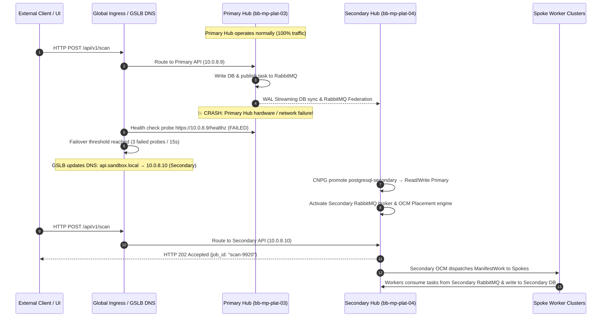
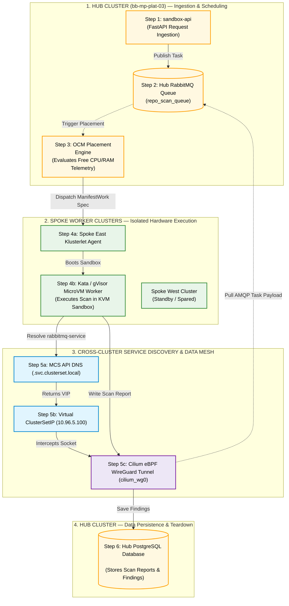

# 01-Sandbox: Updated Multi-Cluster Architecture, Component Strategy & High Availability Guide

---

### Option: 1: Real-Time Data Synchronization Across Hub Nodes (Node 1 ↔ Node 2 ↔ Node 3)

To ensure that **if Node 1 goes down, Node 2 (or Node 3) immediately takes over and serves the application with zero data loss**, data is continuously synchronized across all 3 nodes in real-time using native in-cluster replication engines:

```
                  ┌─────────────────────────────────────────────────────────┐
                  │          SINGLE HUB CLUSTER (bb-mp-plat-03)           │
                  │              (3-Node RKE2 HA Cluster)                   │
                  ├─────────────────────────────────────────────────────────┤
                  │                                                         │
                  │  ┌──────────────┐   ┌──────────────┐   ┌──────────────┐ │
                  │  │ Node 1       │   │ Node 2       │   │ Node 3       │ │
                  │  │ (Master/Wrk) │   │ (Master/Wrk) │   │ (Master/Wrk) │ │
                  │  ├──────────────┤   ├──────────────┤   ├──────────────┤ │
                  │  │ API Pod 1    │   │ API Pod 2    │   │ API Pod 3    │ │
                  │  │ CNPG Primary │◄─►│ CNPG Standby │◄─►│ CNPG Standby │ │
                  │  │ RMQ Leader   │◄─►│ RMQ Follower │◄─►│ RMQ Follower │ │
                  │  └──────────────┘   └──────────────┘   └──────────────┘ │
                  └────────────────────────────┬────────────────────────────┘
                                               │
                                               │ Cilium ClusterMesh (WireGuard)
                                               ▼
                                  ┌──────────────────────────┐
                                  │   SPOKE WORKER CLUSTERS  │
                                  │   (Pure Stateless Workers│
                                  │    No Local Fallback)    │
                                  └──────────────────────────┘
```

#### 1. PostgreSQL Real-Time Data Sync (CloudNativePG Operator)
*   **How Data Syncs:** CloudNativePG runs **1 Primary instance** (on Node 1) and **2 Standby Replicas** (on Node 2 and Node 3).
*   **Replication Engine:** Every `INSERT`, `UPDATE`, or scan result committed on Node 1 is continuously streamed in real-time to Node 2 and Node 3 via PostgreSQL **Streaming Replication (Write-Ahead Logs - WAL)**.
*   **Automatic Failover When Node 1 Fails:**
    1. The CNPG controller detects Node 1 failure within **~3 to 5 seconds**.
    2. CNPG automatically promotes the Standby Replica on Node 2 (or Node 3) to become the new **Primary Master**.
    3. The internal Service IP (`postgresql-service`) updates in real time to point to Node 2.
    4. All worker reads and writes resume instantly with **zero data loss**.

#### 2. RabbitMQ Real-Time Data Sync (Quorum Queues / Raft Consensus)
*   **How Data Syncs:** RabbitMQ runs 3 pods (1 on Node 1, 1 on Node 2, 1 on Node 3) configured with **Quorum Queues**.
*   **Replication Engine:** When a scan task message is published to the leader queue on Node 1, it is synchronously replicated to the follower queue instances on Node 2 and Node 3 using the **Raft consensus algorithm** before sending an acknowledgment.
*   **Automatic Failover When Node 1 Fails:**
    1. The Raft consensus protocol detects Node 1 failure instantly.
    2. The follower pod on Node 2 (or Node 3) is automatically elected as the new **Queue Leader**.
    3. Zero pending scan messages are lost, and Spoke workers continue consuming tasks seamlessly.

#### 3. Redis Real-Time Data Sync (Redis Sentinel / Replication)
*   **How Data Syncs:** Redis Master runs on Node 1 with active replication to Redis Replicas on Node 2 and Node 3.
*   **Automatic Failover When Node 1 Fails:** Redis Sentinel detects Master node loss, executes automated failover, and promotes Node 2 to Master.

#### 4. API Server Real-Time High Availability (`sandbox-api`)
*   **Stateless Execution:** `sandbox-api` runs `replicas: 3` (1 pod on each node).
*   **Automatic Failover When Node 1 Fails:** MetalLB Ingress instantly routes incoming client HTTP traffic to the active pods on Node 2 and Node 3 with **zero client downtime**.
---

### In-Cluster High Availability Summary

| Core Component | Replication Strategy Across Nodes (Node 1 ↔ Node 2 ↔ Node 3) | Failover Behavior (If Node 1 Fails) | Data Loss Risk |
|:---|:---|:---|:---:|
| **PostgreSQL** | Continuous Streaming Replication (CNPG WAL sync) | Node 2/3 promoted to Primary in ~3–5s | **Zero Data Loss** |
| **RabbitMQ** | Synchronous Raft Consensus (Quorum Queues) | Node 2/3 follower promoted to Leader instantly | **Zero Message Loss** |
| **Redis** | Redis Sentinel active replication | Node 2/3 promoted to Master automatically | Minimal (Ephemeral cache) |
| **API Server** | Stateless Pod Anti-Affinity (`replicas: 3`) | MetalLB routes to active Node 2/3 pods | **Zero Downtime** |
| **Spoke Workers** | Pure Stateless Execution (Direct Hub Connection) | Retries connection to Hub during 5s failover | None (Stateless) |

---
## Option 2: Active-Passive Dual-Hub Cluster Architecture Blueprint

### 1 High-Level Dual-Hub System Topology

In **Option 2**, the architecture deploys two independent Hub clusters:
1. **Primary Hub Cluster (`bb-mp-plat-03` — Active):** Serves 100% of live client API traffic and manages active OCM workload placement to Spokes.
2. **Secondary Standby Hub Cluster (`bb-mp-plat-04` — Passive / Backup):** Equipped with identical core services (`sandbox-api`, PostgreSQL, RabbitMQ, Redis, OCM Control Plane). Continuously receives real-time data replication from the Primary Hub and remains on hot-standby.

```
                    ┌─────────────────────────────────────────┐
                    │   GLOBAL INGRESS / GSLB LOAD BALANCER   │
                    │   (Cloudflare GSLB / Anycast BGP DNS)   │
                    └───────────┬─────────────────┬───────────┘
                                │                 │
                      Active    │ Primary         │ Backup   Passive
                      Route     │ (Healthy)       │ (Hot Standby)
                                ▼                 ▼
                   ┌───────────────────┐   ┌───────────────────┐
                   │  PRIMARY HUB      │   │  SECONDARY HUB    │
                   │  bb-mp-plat-03    │   │  bb-mp-plat-04    │
                   │  ├── sandbox-api  │   │  ├── sandbox-api  │
                   │  ├── PostgreSQL   ├──►│  ├── PostgreSQL   │ (CNPG Cross-Cluster Replica)
                   │  ├── RabbitMQ     ├──►│  ├── RabbitMQ     │ (RabbitMQ Federation/Shovel)
                   │  ├── Redis Master ├──►│  ├── Redis Replica│ (Async Replication)
                   │  └── OCM Leader   │   │  └── OCM Standby  │ (Multi-Hub Klusterlet)
                   └─────────┬─────────┘   └─────────┬─────────┘
                             │                       │
                             │ Primary WireGuard     │ Backup WireGuard
                             │ Mesh Tunnel           │ Mesh Tunnel
                             ▼                       ▼
                   ┌───────────────────────────────────────────┐
                   │           SPOKE WORKER CLUSTERS           │
                   │   (kind-east, kind-west, RKE2 Spokes)     │
                   └───────────────────────────────────────────┘
```

---

### 2. Core Components & Synchronization Strategies for Dual-Hub Setup

To make the Secondary Hub cluster fully ready to take over if the Primary Hub goes down, five core synchronization strategies are implemented:

#### 1. Ingress & Traffic Failover Strategy (Global Ingress / GSLB Anycast DNS)
*   **Components:** Cloudflare GSLB / Route53 DNS / ExternalDNS + MetalLB Ingress Gateway on both Hubs (`10.0.8.9` for Primary, `10.0.8.10` for Secondary).
*   **How it Works:**
    - Client applications send API requests to `api.sandbox.local`.
    - GSLB monitors the health of Primary Hub (`https://10.0.8.9/healthz`) every 5 seconds.
    - **Failover Action:** If Primary Hub fails 3 consecutive health probes (15 seconds total), GSLB automatically updates DNS resolution so `api.sandbox.local` points to Secondary Hub Ingress (`10.0.8.10`). Clients seamlessly redirect to Secondary `sandbox-api`.

#### 2. PostgreSQL Cross-Cluster Real-Time Data Sync (CloudNativePG Cross-Cluster Replica)
*   **Components:** CloudNativePG (CNPG) Operator running on both Hubs connected via Cilium ClusterMesh WireGuard tunnel (`cilium_wg0`).
*   **How it Works:**
    - **Primary Hub:** Runs CNPG `Cluster` named `postgresql-primary` (Read-Write Mode).
    - **Secondary Hub:** Runs CNPG `replica` mode `Cluster` named `postgresql-secondary`.
    - Every transaction committed on Primary PostgreSQL is continuously streamed in near-real-time across the cross-cluster WireGuard tunnel to Secondary PostgreSQL using **Write-Ahead Log (WAL) Streaming Replication**.
    - **Failover Action:** When Primary Hub crashes, an automated script (or operator trigger) on Secondary Hub executes: `cnpg promote postgresql-secondary`. The Secondary database immediately transitions from standby to active Read-Write Primary.

#### 3. RabbitMQ Queue Synchronization Strategy (RabbitMQ Federation & Shovel)
*   **Components:** RabbitMQ Federation Plugin / Shovel Plugin over TLS (`amqps://`).
*   **How it Works:**
    - Primary Hub RabbitMQ handles live scan task publishing.
    - Secondary Hub RabbitMQ runs a matching queue structure configured with the **RabbitMQ Federation Plugin**. The federation plugin mirrors published messages across clusters to the backup queue.
    - **Failover Action:** When clients redirect to Secondary Hub, `sandbox-api` publishes new task messages to Secondary RabbitMQ. Spoke workers switch to consuming from Secondary RabbitMQ endpoints (`rabbitmq-backup.opensandbox-system.svc.clusterset.local`).

#### 4. Redis Active State Replication Strategy
*   **Components:** Redis Operator with Cross-Cluster Replication.
*   **How it Works:** Primary Hub Redis Master replicates rate limit counters and API key quota states asynchronously to Secondary Hub Redis Replica over encrypted WireGuard tunnel. Upon failover, Secondary Redis is promoted to Master.

#### 5. Open Cluster Management (OCM) Multi-Hub Registration & Workload Dispatch Failover
*   **Components:** OCM Multi-Hub Registration (`Klusterlet` dual-registration).
*   **How it Works:**
    - Spoke `Klusterlet` agents are registered with **both** Primary Hub (`bb-mp-plat-03`) and Secondary Hub (`bb-mp-plat-04`).
    - Under normal operation, Primary Hub OCM evaluates `Placement` rules and dispatches `ManifestWork` specs to Spokes.
    - **Failover Action:** When Primary Hub becomes unreachable, Secondary Hub OCM takes over placement scoring, dispatching microVM worker specs (`ManifestWork`) to Spokes.

---

### 3. End-to-End Failover Sequence (Primary Hub Crash → Secondary Hub Activation)



---

### Summary of Dual-Hub High Availability

| Core Component | Primary Hub (`bb-mp-plat-03`) | Secondary Hub (`bb-mp-plat-04`) | Synchronization Engine | Failover Trigger & Action |
|:---|:---|:---|:---|:---|
| **API Ingress** | Active (`10.0.8.9`) | Hot Standby (`10.0.8.10`) | GSLB / Anycast DNS | GSLB probes fail 3x → Shifts DNS to `10.0.8.10` |
| **PostgreSQL** | Primary (Read-Write) | Standby Replica | CNPG Streaming WAL Replication | CNPG promote command → Promotes replica to Read-Write |
| **RabbitMQ** | Active Broker Leader | Active Federation Backup | RabbitMQ Federation / Shovel | Ingress redirection → Clients/Workers switch to Sec AMQP |
| **Redis** | Active Master | Standby Replica | Redis Cross-Cluster Replication | Redis Sentinel / Operator promotes Standby to Master |
| **OCM Control Plane**| Active Fleet Dispatcher | Standby Fleet Dispatcher | Dual-Hub Klusterlet Registration | Primary unreachable → Sec OCM dispatches `ManifestWork` |

---

## Comprehensive Multi-Cluster Technology Comparison Matrix

Below is the side-by-side evaluation comparing **Option 2: Active-Passive Dual-Hub Stack** against **Option 1: Single-Hub 3-Node HA**:

| Evaluation Dimension | Option 2: Active-Passive Dual-Hub Stack (Recommended) | Option 1: Single-Hub 3-Node In-Cluster HA |
|:---|:---|:---|
| **Layer 1: Network Fabric** | **Cilium ClusterMesh (eBPF + WireGuard)** | Cilium ClusterMesh (eBPF + WireGuard) |
| **Layer 2: Service Discovery** | **Kubernetes MCS API (KEP-1645)** | Kubernetes MCS API (KEP-1645) |
| **Layer 3: Fleet Scheduler** | **Open Cluster Management (OCM)** | Open Cluster Management (OCM) |
| **Data Path Latency** | **< 0.2 ms (Kernel eBPF)** | < 0.2 ms (Kernel eBPF) |
| **Hub SPOF Resilience** | **✅ Maximum (Full Secondary Standby Hub)** | ✅ High (3-Node In-Cluster HA)|
| **Database Sync** | **✅ CNPG Cross-Cluster WAL Streaming** | In-Cluster CNPG WAL Sync |
| **Queue Sync** | **✅ RabbitMQ Federation / Shovel** | In-Cluster Quorum Queues |
| **Operational Footprint** | **Medium-High (2 Hub Clusters)** | Low (1 Hub Cluster) |
| **Key Pros** | • **Datacenter/Site Loss Protection:** Withstands complete primary datacenter crash.<br>• **Cross-Region DR:** Allows active-passive placement across separate facilities.<br>• **Zero Job Loss:** Cross-cluster WAL and federation sync preserve all scan state. | • **Low Cost & Complexity:** Single cluster footprint using native K8s primitives.<br>• **Fast Local Failover:** Node crash failover in ~3–5 seconds over local LAN.<br>• **Zero Cross-Cluster Sync Latency:** Data sync happens locally within Hub. |
| **Key Cons** | • **Higher Resource Cost:** Requires 2 full Hub cluster footprints.<br>• **Cross-Cluster Link Reliance:** Sync relies on stable WireGuard mesh connection.<br>• **Setup Overhead:** Requires GSLB health check and federation config. | • **Vulnerable to Total Site Loss:** Datacenter outage brings platform down.<br>• **No Cross-Region DR:** Cannot fail over to secondary facility without backups. |

---

### Detailed Pros and Cons Breakdown

#### Option 2: Active-Passive Dual-Hub Stack (Recommended)

##### 🟢 Pros:
1. **Maximum High Availability & Site Fault Tolerance:** If the entire Primary Hub cluster (`bb-mp-plat-03`) or its hosting datacenter suffers a catastrophic outage, the Secondary Hub (`bb-mp-plat-04`) takes over seamlessly.
2. **Cross-Region / Multi-Datacenter Disaster Recovery:** Primary and Secondary Hubs can be geographically separated across cloud providers or physical facilities.
3. **Automated Client & Worker Redirection:** GSLB DNS health probes automatically shift client API calls to Secondary Hub (`10.0.8.10`) within 15 seconds.
4. **Data Protection:** PostgreSQL WAL streaming replication and RabbitMQ Federation ensure scan reports and task payloads are safely replicated to the Secondary Hub before failover.

##### 🔴 Cons:
1. **Higher Infrastructure Overhead & Cost:** Requires deploying and maintaining two independent Hub clusters, doubling control plane resource consumption.
2. **Cross-Cluster Link Dependency:** Data replication depends on an active, encrypted WireGuard mesh link (`cilium_wg0`) between Hubs.
3. **Operational Configuration:** Requires setting up GSLB health monitoring probes, CNPG cross-cluster replica manifests, and RabbitMQ federation plugins.

---

#### Option 1: Single-Hub 3-Node In-Cluster HA

##### 🟢 Pros:
1. **Minimal Operational Footprint:** Standard single-cluster RKE2 setup (`bb-mp-plat-03`) running 3 control-plane/worker nodes with embedded etcd.
2. **Low Cost:** Requires only one Hub cluster footprint without needing a second standby cluster.
3. **Sub-Second Local Failover:** Node failures trigger in-cluster pod rescheduling and CNPG master promotion in ~3 to 5 seconds over local high-speed LAN.
4. **Zero Cross-Cluster Sync Overhead:** PostgreSQL WAL streaming and RabbitMQ Raft consensus operate locally within the Hub network.

##### 🔴 Cons:
1. **Vulnerable to Total Datacenter Outage:** If the entire physical server facility or hosting rack goes offline, 01-Sandbox stops scanning until hardware is restored.
2. **No Multi-Facility Failover:** Lacks a standby cluster in a secondary facility to serve traffic during primary site maintenance or disasters.


---

## 1. Clean Hub & Spoke Traffic Flow Diagram

Below is the strictly downward-flowing Mermaid flowchart built with standard syntax:



---

## 2. Text Architecture Diagram (Guaranteed 100% Clean Rendering)

```
┌─────────────────────────────────────────────────────────────────────────────────────────┐
│ [STEP 1] CLIENT SUBMISSION                                                              │
│ User HTTP Request ──► Hub sandbox-api (10.0.8.9) ──► Validates Rate Limits & Quotas    │
└──────────────────────────────────────────┬──────────────────────────────────────────────┘
                                           │ [Step 1.1] Publishes Task Payload
                                           ▼
┌─────────────────────────────────────────────────────────────────────────────────────────┐
│ [STEP 2] HUB RABBITMQ QUEUE                                                             │
│ Holds persistent task payloads in repo_scan_queue (ServiceExport declared)              │
└──────────────────────────────────────────┬──────────────────────────────────────────────┘
                                           │ [Step 2.1] Telemetry Trigger
                                           ▼
┌─────────────────────────────────────────────────────────────────────────────────────────┐
│ [STEP 3] OCM FLEET SCHEDULER                                                            │
│ Evaluates Spoke heartbeats (East 23% CPU vs West 71% CPU) ──► Selects Spoke East        │
└──────────────────────────────────────────┬──────────────────────────────────────────────┘
                                           │ [Step 3.1] Dispatches ManifestWork Spec
                                           ▼
┌─────────────────────────────────────────────────────────────────────────────────────────┐
│ [STEP 4] SPOKE EAST (kind-east) & KATA MICROVM                                          │
│ Klusterlet receives ManifestWork ──► Boots Firecracker KVM MicroVM sandbox (<800ms)     │
└──────────────────────────────────────────┬──────────────────────────────────────────────┘
                                           │ [Step 5.1] Resolves MCS DNS (.svc.clusterset.local)
                                           ▼
┌─────────────────────────────────────────────────────────────────────────────────────────┐
│ [STEP 5] MCS API DISCOVERY & EBPF WIREGUARD MESH                                        │
│ MCS DNS returns VIP 10.96.5.100 ──► Cilium eBPF translates VIP to Hub Pod IP 10.42.3.15│
│ Transport: Encrypted kernel WireGuard tunnel (cilium_wg0) ──► Pulls AMQP task payload  │
└──────────────────────────────────────────┬──────────────────────────────────────────────┘
                                           │ [Step 6.1] Writes Scan Results
                                           ▼
┌─────────────────────────────────────────────────────────────────────────────────────────┐
│ [STEP 6] HUB POSTGRESQL DATABASE & TEARDOWN                                             │
│ Report inserted into DB ──► Worker sends AMQP ACK ──► MicroVM pod auto-destroys        │
└──────────────────────────────────────────────────────────┬──────────────────────────────┘
```

---

## 3. Numbered Traffic Flow Breakdown

| Step # | Traffic Stage | Source ──► Destination | Flow Action & Technical Description |
|:---:|:---|:---|:---|
| **`[Step 1]`** | **Client Ingestion** | External Client ──► Hub `sandbox-api` | User sends HTTP POST `/api/v1/scan`. `sandbox-api` validates Redis rate limits & key quotas. |
| **`[Step 2]`** | **Task Enqueueing** | Hub `sandbox-api` ──► Hub RabbitMQ | `sandbox-api` publishes persistent task payload to `repo_scan_queue` and returns `202 Accepted` to client. |
| **`[Step 3]`** | **Spoke Placement** | Hub OCM ──► Spoke East (`kind-east`) | OCM evaluates Spoke heartbeats (East 23% CPU vs West 71% CPU), selects `kind-east`, and dispatches `ManifestWork`. |
| **`[Step 4]`** | **Sandbox Provisioning**| Spoke `Klusterlet` ──► Firecracker MicroVM | Containerd invokes Kata shim + Firecracker, booting a clean KVM microVM (`kata-qemu`) in **<800ms**. |
| **`[Step 5a]`**| **MCS Service Discovery**| MicroVM Worker ──► MCS API DNS Zone | MicroVM queries `rabbitmq-service.opensandbox-system.svc.clusterset.local`. MCS API DNS returns Virtual `ClusterSetIP` (`10.96.5.100`). |
| **`[Step 5b]`**| **eBPF Mesh Connection**| MicroVM Worker ──► Hub RabbitMQ | Cilium `sock_ops` eBPF intercepts connection to `10.96.5.100`, maps it to Hub Pod (`10.42.3.15`), and pulls tasks via WireGuard (`basic.qos=3`). |
| **`[Step 6]`** | **Result Persistence** | MicroVM Worker ──► Hub PostgreSQL DB | Worker resolves `postgresql-service...svc.clusterset.local`, connects via eBPF WireGuard mesh, and inserts findings into DB. |
| **`[Step 7]`** | **Teardown & Cleanup** | MicroVM Worker ──► Hub OCM | Worker sends AMQP ACK. OCM deletes `ManifestWork` spec, destroying the Firecracker microVM (0 idle footprint). |
