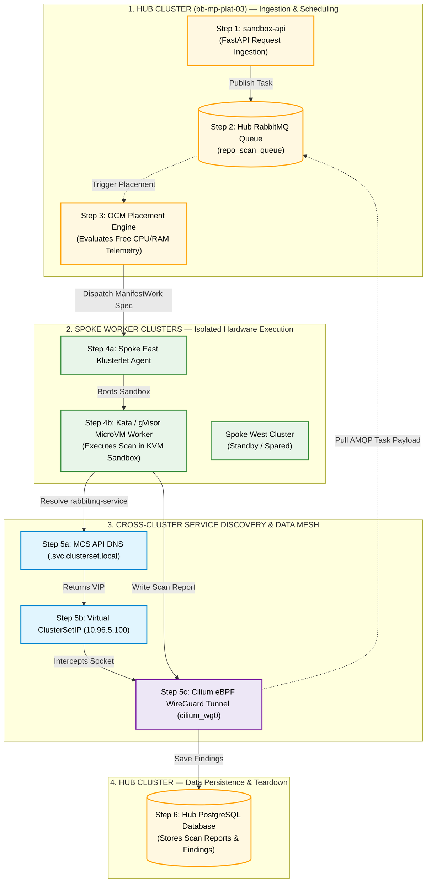

# 01-Sandbox: Simplified Hub and Spoke Architecture & High Availability Guide

> **Document Status:** High-Level Technical Specification & Visual Architecture Blueprint
> **Target Application:** 01-Sandbox High-Concurrency Code Execution Platform
> **Environment:** Hub Cluster (`bb-mp-plat-03`) | KinD Spoke East (`kind-east`) | KinD Spoke West (`kind-west`)
> **Design Philosophy:** Standard, universally compatible Mermaid syntax rendering seamlessly across all IDE Markdown preview engines.

---

## Executive Summary

The **01-Sandbox** platform uses a **Hub-and-Spoke Multi-Cluster Architecture**:
* **Hub Cluster (`bb-mp-plat-03`):** Hosts all stateful core services (`sandbox-api`, RabbitMQ queue, PostgreSQL result database) and fleet scheduling (Open Cluster Management).
* **Service Discovery (MCS API KEP-1645):** Uses standard Kubernetes `ServiceExport` and `ServiceImport` CRDs to expose Hub services across clusters under the `.svc.clusterset.local` DNS domain.
* **Spoke Worker Clusters (`kind-east`, `kind-west`):** Pure stateless execution nodes running hardware-isolated microVM sandboxes (Kata Containers / gVisor).
* **Cross-Cluster Data Mesh:** **Cilium ClusterMesh (eBPF + WireGuard)** delivers kernel-level encrypted packet transport with sub-0.2ms latency.

---

## 1. Clean Hub & Spoke Traffic Flow Diagram

Below is the strictly downward-flowing Mermaid flowchart built with standard syntax:



---

## 2. Text Architecture Diagram (Guaranteed 100% Clean Rendering)

```
┌─────────────────────────────────────────────────────────────────────────────────────────┐
│ [STEP 1] CLIENT SUBMISSION                                                              │
│ User HTTP Request ──► Hub sandbox-api (10.0.8.9) ──► Validates Rate Limits & Quotas    │
└──────────────────────────────────────────┬──────────────────────────────────────────────┘
                                           │ [Step 1.1] Publishes Task Payload
                                           ▼
┌─────────────────────────────────────────────────────────────────────────────────────────┐
│ [STEP 2] HUB RABBITMQ QUEUE                                                             │
│ Holds persistent task payloads in repo_scan_queue (ServiceExport declared)              │
└──────────────────────────────────────────┬──────────────────────────────────────────────┘
                                           │ [Step 2.1] Telemetry Trigger
                                           ▼
┌─────────────────────────────────────────────────────────────────────────────────────────┐
│ [STEP 3] OCM FLEET SCHEDULER                                                            │
│ Evaluates Spoke heartbeats (East 23% CPU vs West 71% CPU) ──► Selects Spoke East        │
└──────────────────────────────────────────┬──────────────────────────────────────────────┘
                                           │ [Step 3.1] Dispatches ManifestWork Spec
                                           ▼
┌─────────────────────────────────────────────────────────────────────────────────────────┐
│ [STEP 4] SPOKE EAST (kind-east) & KATA MICROVM                                          │
│ Klusterlet receives ManifestWork ──► Boots Firecracker KVM MicroVM sandbox (<800ms)     │
└──────────────────────────────────────────┬──────────────────────────────────────────────┘
                                           │ [Step 5.1] Resolves MCS DNS (.svc.clusterset.local)
                                           ▼
┌─────────────────────────────────────────────────────────────────────────────────────────┐
│ [STEP 5] MCS API DISCOVERY & EBPF WIREGUARD MESH                                        │
│ MCS DNS returns VIP 10.96.5.100 ──► Cilium eBPF translates VIP to Hub Pod IP 10.42.3.15│
│ Transport: Encrypted kernel WireGuard tunnel (cilium_wg0) ──► Pulls AMQP task payload  │
└──────────────────────────────────────────┬──────────────────────────────────────────────┘
                                           │ [Step 6.1] Writes Scan Results
                                           ▼
┌─────────────────────────────────────────────────────────────────────────────────────────┐
│ [STEP 6] HUB POSTGRESQL DATABASE & TEARDOWN                                             │
│ Report inserted into DB ──► Worker sends AMQP ACK ──► MicroVM pod auto-destroys        │
└─────────────────────────────────────────────────────────────────────────────────────────┘
```

---

## 3. Numbered Traffic Flow Breakdown

| Step # | Traffic Stage | Source ──► Destination | Flow Action & Technical Description |
|:---:|:---|:---|:---|
| **`[Step 1]`** | **Client Ingestion** | External Client ──► Hub `sandbox-api` | User sends HTTP POST `/api/v1/scan`. `sandbox-api` validates Redis rate limits & key quotas. |
| **`[Step 2]`** | **Task Enqueueing** | Hub `sandbox-api` ──► Hub RabbitMQ | `sandbox-api` publishes persistent task payload to `repo_scan_queue` and returns `202 Accepted` to client. |
| **`[Step 3]`** | **Spoke Placement** | Hub OCM ──► Spoke East (`kind-east`) | OCM evaluates Spoke heartbeats (East 23% CPU vs West 71% CPU), selects `kind-east`, and dispatches `ManifestWork`. |
| **`[Step 4]`** | **Sandbox Provisioning**| Spoke `Klusterlet` ──► Firecracker MicroVM | Containerd invokes Kata shim + Firecracker, booting a clean KVM microVM (`kata-qemu`) in **<800ms**. |
| **`[Step 5a]`**| **MCS Service Discovery**| MicroVM Worker ──► MCS API DNS Zone | MicroVM queries `rabbitmq-service.opensandbox-system.svc.clusterset.local`. MCS API DNS returns Virtual `ClusterSetIP` (`10.96.5.100`). |
| **`[Step 5b]`**| **eBPF Mesh Connection**| MicroVM Worker ──► Hub RabbitMQ | Cilium `sock_ops` eBPF intercepts connection to `10.96.5.100`, maps it to Hub Pod (`10.42.3.15`), and pulls tasks via WireGuard (`basic.qos=3`). |
| **`[Step 6]`** | **Result Persistence** | MicroVM Worker ──► Hub PostgreSQL DB | Worker resolves `postgresql-service...svc.clusterset.local`, connects via eBPF WireGuard mesh, and inserts findings into DB. |
| **`[Step 7]`** | **Teardown & Cleanup** | MicroVM Worker ──► Hub OCM | Worker sends AMQP ACK. OCM deletes `ManifestWork` spec, destroying the Firecracker microVM (0 idle footprint). |
