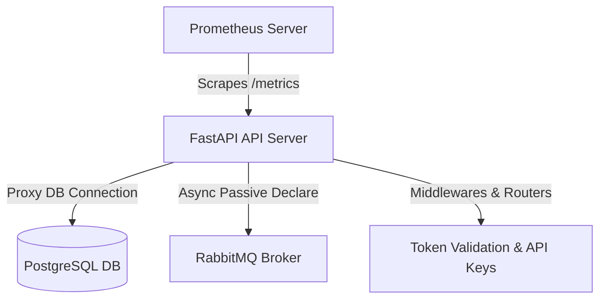

# Prometheus Telemetry & Observability Reference

This document provides technical details on the Prometheus metrics system implemented in the CodeInspector API Server. It explains the metrics design, instrumented modules, scrape configuration, and how to verify metric states.

---

## 1. Metrics Architecture Overview

The API server utilizes a pull-based metrics architecture. Metrics are exposed via a `/metrics` route, which is scraped periodically by Prometheus.



To optimize resource utilization, the metrics registry combines:
1. **Push-Style Instrumentation (Counters/Histograms):** In-memory accumulators that are incremented/observed inline with active code paths (HTTP requests, authentication checks, DB connection requests, database errors).
2. **Pull-Style Dynamic Instrumentation (Gauges):** Right before generating the scraping payload, the `/metrics` endpoint runs non-blocking async checks (e.g. passive queue declaration against RabbitMQ) to update active stats dynamically.

---

## 2. Metrics Reference Table

### Core Application Metrics

| Metric Name | Metric Type | Labels | Description |
| :--- | :--- | :--- | :--- |
| `http_requests_total` | Counter | `method`, `path`, `status_code` | Total HTTP requests processed by the API gateway (excluding `/metrics`). |
| `http_request_duration_seconds` | Histogram | `method`, `path` | HTTP request execution latency in seconds. |
| `job_execution_total` | Counter | `job_type`, `status` | Total number of scan jobs processed by workers (`success`, `failure`, `retry`, `cancelled`). |
| `job_execution_duration_seconds` | Histogram | `job_type` | Scan job execution latency in seconds. |

### Advanced Infrastructure & Operations Metrics

| Metric Name | Metric Type | Labels | Description |
| :--- | :--- | :--- | :--- |
| `db_connections_active` | Gauge | *None* | Count of concurrent active PostgreSQL or SQLite database connections. |
| `queue_depth_jobs` | Gauge | `queue_name` | Live message count pending in RabbitMQ queues (`scan.quick`, `scan.repo`, `scan.failed`). |
| `repo_clone_duration_seconds` | Histogram | `repo_host` | Time taken to clone Git repositories (e.g., github.com, gitlab.com). |
| `sandbox_provision_duration_seconds`| Histogram | *None* | Latency of dynamic sandbox folder allocation. |

### Security & Error Metrics

| Metric Name | Metric Type | Labels | Description |
| :--- | :--- | :--- | :--- |
| `api_key_requests_total` | Counter | `api_key_id` | Total requests successfully validated and mapped to a specific API Key ID. |
| `auth_failures_total` | Counter | `reason` | Total authentication failures classified by cause (e.g., `expired_key`, `revoked_key`). |
| `application_errors_total` | Counter | `status_code`, `path` | Count of unhandled exceptions or HTTP status >= 500 errors. |

---

## 3. Telemetry Implementation Details

### A. Database Connection Tracking
Instead of static count variables, a proxy wrapper pattern is applied in `core/app_state.py`:
- `InstrumentedConnection` acts as a pass-through proxy wrapping the raw DB connection (`psycopg2` or `sqlite3`).
- **On open:** `db_connections_active.inc()` is called.
- **On close:** `db_connections_active.dec()` is executed safely, preventing double-decrements via a closed flag tracker.

### B. Authentication Failure Classifications (`auth_failures_total`)
The `validate_token` method classifies rejects with the following labels:
* `missing_token`: Client did not provide cookies or an `Authorization` header.
* `missing_kid`: Token format is correct but the JWT header is missing key identifiers.
* `invalid_token_format`: Parser failed to unpack token bytes.
* `no_active_developer_keys`: User session exists but has no active developer API keys.
* `missing_jti`: Token payload missing unique JTI identifier.
* `deactivated_key`: Target Key ID not found in database records.
* `revoked_key`: Key exists but is marked as revoked in Postgres.
* `expired_key`: Key has passed its ISO expiration timestamp.
* `identity_mismatch`: Security lockout where user tries to authenticate using another user's key.
* `token_expired_signature` / `invalid_token_signature`: JWT signature parsing issues.

### C. Live RabbitMQ Queue Monitoring
In `observability/metrics.py`, the endpoint `/metrics` is configured as an `async def` route. When scraped:
1. It retrieves the active `aio-pika` connection.
2. It loops through active queues (`scan.quick`, `scan.repo`, `scan.failed`).
3. It opens an ephemeral channel and uses a non-destructive **passive declaration** (`declare_queue(passive=True)`) to query queue parameters without mutating state.
4. It extracts `message_count` and updates `queue_depth_jobs` dynamically before the Prometheus text exposition document is compiled.

---

## 4. Scraping Configuration (Kubernetes / Prometheus)

Prometheus scrapes the API server by discovering Kubernetes pods annotated with:
```yaml
prometheus.io/scrape: "true"
prometheus.io/port: "8000"
```
The Kubernetes service discovery relabeling logic automatically translates these annotations to direct pod IP scraping at route `/metrics`.
