# Technical Presentation: Asynchronous Bulk Security Scanning

## 🚀 Presentation Slide 1: Executive Summary & The 504 Timeout Crisis

### The Legacy Problem: Synchronous Blocking Scans
* **The Flow**: In the legacy design, bulk scans processed file payloads synchronously. The HTTP connection was held open while the backend scheduled, initialized, and ran security scanning tools (such as Bandit, Semgrep, Trivy) inside gVisor sandboxes.
* **The Failure**: Because heavy scans take from 30 seconds to over 15 minutes, edge load balancers, proxies, and gateway ingress controllers (Nginx, Cloudflare) forcefully killed connections after 60-120 seconds, returning generic **`504 Gateway Timeout`** errors.
* **The Consequence**: The UI froze or crashed, and developers lost visibility into the status of active scan jobs.

### The Modern Solution: Non-Blocking Asynchronous Polling
* Refactored the core ingestion and polling architecture into a decoupled **"Fire-and-Forget + background thread polling"** model.
* Enabled rapid sequential job submissions spaced exactly **2 seconds apart**, running in parallel and monitored concurrently via non-blocking react state loops.

---

## 🏗️ Presentation Slide 2: Asynchronous Non-Blocking Flow

The diagram below outlines the sequence of the asynchronous bulk scanning process:

```mermaid
sequenceDiagram
    autonumber
    actor Dev as React UI / Client
    participant API as API Server (FastAPI)
    participant Worker as Background Task
    participant OS as OpenSandbox Server
    participant Storage as PVC (Shared Storage)

    rect rgb(24, 28, 38)
        note right of API: Phase 1: Ingestion & Fast Acknowledgment
        Dev->>API: POST /scan-jobs?async=true (Ingests Payload)
        API->>API: Intercept via create_scan_job_alias Endpoint
        API->>API: Generate unique job_id & Spin up FastAPI BackgroundTask
        API-->>Dev: Return HTTP 200 { "job_id": "...", "status": "PROCESSING" } (within <100ms)
    end

    rect rgb(30, 24, 34)
        note right of OS: Phase 2: Secure gVisor Sandbox Execution
        Worker->>OS: Execute blocking POST /v1/scan-jobs to schedule sandbox
        OS->>OS: Schedule gVisor (runsc) Pod on K8s Node
        OS->>Storage: Mount job sub-directory and execute security scan
    end

    rect rgb(24, 34, 28)
        note right of API: Phase 3: Non-Blocking Polling Loop
        loop Every 5 Seconds (UI Polling Thread)
            Dev->>API: GET /scan-jobs/{job_id}/report
            API->>Storage: Locate aggregated report file
            alt Report File Not Created Yet
                Storage-->>API: File Not Found (404)
                API-->>Dev: Return HTTP 404 Not Found (Job in progress)
                note right of Dev: Sleeps for 5 seconds and retries
            else Report File is Ready
                Storage-->>API: aggregated_report.json found
                API-->>Dev: Return HTTP 200 with full JSON scan report
                note right of Dev: Update item status to CLEAN or RISKS in UI
            end
        end
    end
```



---

## ⚡ Presentation Slide 3: Advanced Execution Controls & UX Polish

To deliver a premium, enterprise-grade developer experience, we layered several advanced capabilities on top of the async engine:

### 1. Dynamic Stop & Abort Action
* **Immediate Stop**: When a bulk scan is active, a red animated "Stop" button appears.
* **Ingestion Cancellation**: Clicking "Stop" sets a mutable `bulkScanCancelledRef.current = true`.
* **Flow Break**: The orchestrator checks this ref before starting any subsequent scan or inside the active polling loops. If `true`, it immediately breaks the loops, aborts all pending API requests, and terminates background pings, restoring the dashboard state instantly.

### 2. Smart Skip Logic (Resume Scanning)
* **The Challenge**: If a developer updates a batch of files, re-scanning the entire project wastes massive backend compute resources.
* **The Optimization**: Before queueing any item, the React orchestrator checks if the item's status is already `'clean'` or `'risks'`. If so, it is bypassed, instantly resuming execution from the first pending or newly added target!

### 3. Dynamic Rate-Limit Cooldown Sync (429 Integration)
> [!IMPORTANT]
> Because parallel polling and sequential dispatches can trigger backend limits (which were raised from 7 to 100 requests/min), the frontend dynamically reads the `retry_after` response header during any HTTP 429 error.
> It sets a global `rateLimitUntil` timestamp, pausing all concurrent dispatches and polling loops with a dynamic countdown: `Rate limit hit. Retrying in Xs...` until the cooldown expires.

---

## 📂 Presentation Slide 4: Frontend-to-Backend Symlink Standardization

### Addressing colloquial multi-language specifications:
To ensure security tools (such as Bandit, Semgrep, ShellCheck, py_compile) execute flawlessly across both Quick Scan and Bulk Scan, we implemented an end-to-end normalization layer:

```
[COLLOQUIAL PAYLOAD]                 [FRONTEND STANDARDIZATION]          [BACKEND SYMLINK RECOVERY]
  python    ----------> Parser ----------> .py    ----------> Upload -------> Symlink Creation (.python -> .py)
  golang    ----------> Normalize -------> .go    ----------> Payload ------> Symlink Creation (.golang -> .go)
  bash      ----------> Routine ---------> .sh    ----------> Validation ----> Symlink Creation (.bash -> .sh)
```

### End-to-End Standardization Layers:
1. **Frontend Normalization**: The raw multi-block `.txt` ingestion parser translates informal user input (e.g., `python`, `golang`, `kubernetes`, `bash`) into official extensions (`.py`, `.go`, `.yaml`, `.sh`) during ingestion.
2. **Backend Symlink Recovery**: In `scanner_orchestrator.py`, the backend scans for any uploaded colloquial extensions and dynamically symlinks them to standard file extensions before launching container security linters.

---

## 🛡️ Presentation Slide 5: Informational Kube-Score Best-Practices

### The Issue
Traditional scans flagged low-severity container configurations (such as missing resource limits or read-only root filesystems) as `HIGH` or `MEDIUM` security threats. This marked healthy, functional Kubernetes manifests with scary **`RISKS`** badges, frustrating developers.

### The Fix
We reclassified these general layout recommendations as informational rules:

```yaml
# Inside scanner_orchestrator.py (scan_kubescore)
severity: "info"
has_issues: False
```

### The Presentation:
* **Green Badges**: Best practices no longer trigger risk counts, enabling standard Kubernetes files to achieve a clean green **`CLEAN`** status badge.
* **Remediation checklists**: Developers can still click the file to view the full Kube-Score remediation checklist, preserving the learning curve without cluttering security metrics!
