# Technical Presentation: Key-Specific Sliding-Window Rate Limiting

## 🚀 Presentation Slide 1: Executive Summary & Objective

### The Problem
* **Ingress-Level Throttling (Legacy)**: Flat rate limiting at the ingress proxy (`agentgateway`) blocked entire routes or user groups, resulting in massive disruption for active developers when a single client exceeded quotas.
* **Lack of Isolation**: High-frequency testing from one client environment routinely starved or blocked other legitimate developer workflows.

### The Solution: Decoupled & Intelligent Rate Limiting
* Moved rate-limiting enforcement entirely inside the **FastAPI Application Server** (`apiServer`).
* Implemented a highly precise **Key-Specific Sliding-Window Rate-Limiter** using **Redis Sorted Sets (ZSET)**.
* **Envoy Bypass**: The Ingress edge proxy was reconfigured with a massive local ceiling (10,000 req/min) to act purely as a network-level perimeter guard, delegating fine-grained control to the backend application brain.

---

## 🏗️ Presentation Slide 2: High-Level Architectural Flow

Below is the complete request lifecycle and rate-limiting validation workflow:

```mermaid
sequenceDiagram
    autonumber
    actor Developer as React UI / Client
    participant GW as Agent Gateway (Proxy/Edge)
    participant API as API Server (FastAPI)
    participant DB as Postgres DB (SSOT)
    participant Cache as Redis (Shared Cache)

    Developer->>GW: Dispatch Request (Session Cookie / Bearer Token)
    GW->>API: Route Request (transparent reverse-proxying)

    rect rgb(24, 28, 38)
        note right of API: Step 1: validate_token & Identity Bridge
        API->>API: Decode Token & Extract auth0/user_id (sub)
        API->>DB: Query: Get active, unrevoked keys for user (LOWER query)
        DB-->>API: Active Key Pool: [Key_A, Key_B, ...]
    end

    rect rgb(30, 24, 34)
        note right of API: Step 2: Active Key Rotation Loop
        loop For each Candidate Key in Pool
            API->>Cache: Query active requests in sliding window for Candidate Key
            Cache-->>API: Returns request count in window
            note right of API: Is current count < quota (7)?
        end
        alt Found Non-Limited Key (e.g. Key_B)
            API->>API: Bind request dynamically to Key_B (jti)
        else All Keys Rate-Limited
            API->>API: Fallback to Key_A (will trigger block)
        end
    end

    rect rgb(24, 34, 28)
        note right of API: Step 3: ratelimit.py Enforcement
        API->>Cache: Retrieve active window count & oldest timestamp for Bound Key
        Cache-->>API: Returns count & oldest timestamp

        alt Count < Quota
            API->>Cache: Append current timestamp to ZSET (ratelimit:{jti})
            API->>API: Process actual operation (Quick Scan / Docs)
            API-->>Developer: 200 OK Response
        else Count >= Quota (Blocked)
            API->>API: Calculate precise Retry-After delay (60s - oldest request age)
            API-->>Developer: 429 Too Many Requests (Retry-After Header)
        end
    end
```

---

## ⚡ Presentation Slide 3: Core Technical Pillars

### 1. Dynamic Key-Specific Scaling (Identity Bridge)
* **The Concept**: To scale quota dynamically, a developer can generate multiple API keys (e.g., 1 key = 7 req/min, 2 keys = 14 req/min, 5 keys = 35 req/min).
* **The Process**:
  1. decodes the incoming token and extracts the Auth0 subject (`sub`).
  2. Queries Postgres using case-insensitive validation `LOWER(user_id)`.
  3. Filters active keys using Python-side timezone-aware UTC parsing to avoid database timezone bugs.
  4. Automatically rotates requests across valid keys, binding the operation to the first key with available quota.

### 2. Precise Sliding-Window Algorithm
* **Sliding Window vs. Fixed Window**: Fixed window (resets at clock minute) is vulnerable to double-rate bursts (e.g., 7 requests at 11:59:59 and 7 at 12:00:01). The sliding window continuously shifts: `[now - 60s, now]`.
* **Timestamps Cleanup**: On check, any timestamps older than `now - 60 seconds` are evicted, counting only the remaining elements.

### 3. Tarpitting & Penalty Prevention
> [!IMPORTANT]
> If a request is blocked (429), **no new timestamp is appended** to Redis or local memory. This ensures client spamming does not lock the developer out indefinitely; the lockout window naturally clears as time passes.

### 4. Single-Slot Button Enforcements
> [!TIP]
> Clicking "View Documentation" triggers `/docs` (HTML) and `/openapi.json` (Swagger Spec). Previously, both consumed slots, depleting the rate limit twice as fast. We explicitly **excluded `/openapi.json` from rate limiting**, guaranteeing exactly **1 slot per click**.

---

## 📂 Presentation Slide 4: Technology Stack Integration

The platform leverages **PostgreSQL** and **Redis** to balance consistency and performance:

| Metric / Feature | Persistent Storage (PostgreSQL) | High-Speed Cache (Redis) | Fallback Mode (Local Memory) |
| :--- | :--- | :--- | :--- |
| **Responsibility** | Single Source of Truth (SSOT) for key existence, ownership, and revoking. | Tracks active sliding-window timestamps in real-time. | Handles rate-limiting when Redis is offline. |
| **Data Structure** | Relational `api_keys` table. | **Redis Sorted Sets (ZSET)** under `ratelimit:{jti}` keys. | Local thread-safe dictionary (`state.local_rate_limits`). |
| **Storage Element** | Rows containing `id`, `user_id`, `expires_at`, `is_revoked`. | Members are `timestamp:uuid`, scores are epoch timestamps. | Keys map to lists of float timestamps. |
| **Operation Type** | `SELECT` query on validation. | Atomic pipeline (`ZREMRANGEBYSCORE`, `ZCARD`, `ZADD`, `EXPIRE`). | List comprehension slices: `[t for t in ts if t > clear_before]`. |
| **Self-Healing** | Manual revocation updates. | Key expires (`EXPIRE`) after `window_secs * 2` to prevent memory leaks. | Background cleanup routine triggered when dictionary size > 1000 items. |

---

## 🛠️ Presentation Slide 5: Architectural Decisions & Why Ingress Rate Limiting Failed

### Why Envoy/Agent Gateway Local Rate Limiting Was Bypassed:

1. **No Database Access (PostgreSQL)**
   * **The Limit**: The gateway is a lightweight reverse proxy that cannot maintain connection pools or execute SQL queries.
   * **The Consequence**: It cannot validate if a key is revoked (`is_revoked = 1`) or dynamic key rotation pools, which requires Python-side identity lookup.

2. **No Custom Logic Runtime**
   * **The Limit**: proxies rely on static yaml configurations.
   * **The Consequence**: They cannot execute timezone-aware checks, dynamically scale limits based on the number of keys a user possesses, or perform procedural key rotation.

3. **Path and State Blindness**
   * **The Limit**: Excluding internal components or specs like `/openapi.json` to prevent double-depletion requires complex route rewrites in Envoy that are highly fragile during API upgrades.

### Decoupled Responsibility Model
* **Agent Gateway (Proxy Ingress)**: Handles TLS termination, routing, session preservation, and brute DDoS perimeter protection (e.g., flat ceiling of 10,000 req/min).
* **API Server (Application Brain)**: Enforces business-logic-aware rate-limiting (dynamic developer key pools, active user rotation, sliding window verification, and dynamic `Retry-After` header calculations).
