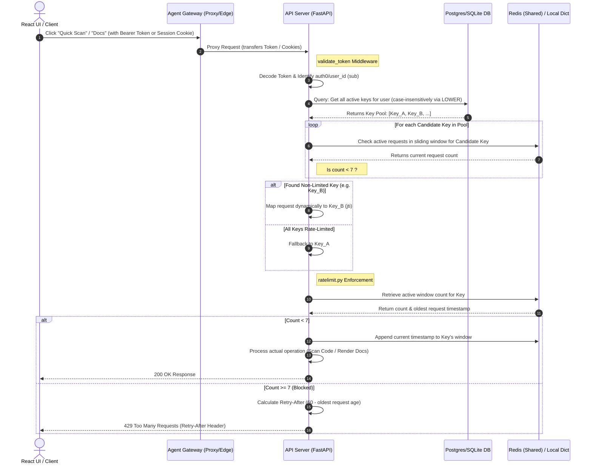

# 01Sandbox Key-Specific Rate Limiting Technical Specifications

This document outlines the architecture, design patterns, and operational guidelines for the **API-Key-Specific Rate Limiting System** implemented in the 01Sandbox platform.

---

## 1. Architectural Overview & Workflow

To prevent Abuse and protect platform resources, traffic is rate-limited. However, flat rate-limiting at the ingress layer (gatekeeper) blocks entire tenants or routes, causing legitimate unique users to be blocked if a single client environment generates high volume.

To resolve this, we transitioned the rate-limiting architecture from a **Flat Gateway-Level Policy** to a **Granular, Dynamic, and Key-Specific sliding-window rate limit** enforced inside the FastAPI backend while bypassing blocking at the Envoy gateway proxy.

### Complete Request Lifecycle & Rate-Limiting Workflow

The diagram below details the complete lifecycle of a request as it passes through the Agent Gateway, the Identity Bridge mapping step, and the sliding-window evaluator inside the FastAPI server:



By decoupling rate-limiting from the gateway proxy and executing it inside the FastAPI backend, we achieve:
1. **Strict Isolation**: Each unique API Key (`jti`) operates in its own independent bucket.
2. **Dynamic Key-Specific Scaling**: A developer's total limit scales dynamically with the number of keys they hold (e.g., 2 keys = 14 requests/min, 5 keys = 35 requests/min).
3. **No Cross-User Blockage**: A rate-limited key has **zero impact** on other users' unique keys.
4. **Cluster Consistency**: A shared Redis cache coordinates call limits instantly across all Kubernetes replicas.

---

## 2. Ingress Layer Configurations (Agent Gateway)

To satisfy the `AgentgatewayPolicy` custom resource validator, the `traffic` block must always be present under `spec` (the schema requires at least one of `traffic`, `frontend`, or `backend` to be defined).

To cleanly bypass the gateway-level throttling, we configure the Envoy policy template to automatically substitute a massive fallback threshold of **10,000 requests per minute** when the rate limit is disabled. This passes schema validation perfectly while guaranteeing zero routing blocks at the proxy layer.

### Modified Files:
*   [policy.yaml](file:///home/berrybytes/Desktop/01-Sandbox/codeInspector/charts/agentgateway/templates/policy.yaml):
    ```yaml
    spec:
      targetRefs:
        - group: gateway.networking.k8s.io
          kind: HTTPRoute
          name: agentgateway-api-route
      traffic:
        rateLimit:
          local:
            - requests: {{ if .Values.policy.rateLimit.enabled }}{{ .Values.policy.rateLimit.requests }}{{ else }}10000{{ end }}
              unit: {{ if .Values.policy.rateLimit.enabled }}{{ .Values.policy.rateLimit.unit }}{{ else }}"Minutes"{{ end }}
    ```
*   [agentgateway/values.yaml](file:///home/berrybytes/Desktop/01-Sandbox/codeInspector/charts/agentgateway/values.yaml) & parent [values.yaml](file:///home/berrybytes/Desktop/01-Sandbox/codeInspector/values.yaml): Dispatched `enabled: false` by default:
    ```yaml
    rateLimit:
      enabled: false
      requests: 7
      unit: "Minutes"
    ```

---

## 3. Backend Rate Limiting Module (`ratelimit.py`)

All rate-limiting logical checks, sliding window operations, and memory tracking are encapsulated in the dedicated module [ratelimit.py](file:///home/berrybytes/Desktop/01-Sandbox/apiServer/fastapi/ratelimit.py).

### Configurations & Thresholds
Limits are loaded dynamically from environment variables, which are driven directly through the main [values.yaml](file:///home/berrybytes/Desktop/01-Sandbox/codeInspector/values.yaml) inside the `codeInspector` directory under the `apiServer.configMap` section:
```yaml
apiServer:
  configMap:
    RATE_LIMIT_REQUESTS: "7"
    RATE_LIMIT_WINDOW_SECS: "60"
```
*   `RATE_LIMIT_REQUESTS` (Default: `7`): Maximum number of requests allowed in a window.
*   `RATE_LIMIT_WINDOW_SECS` (Default: `60` seconds): Duration of the sliding window.

This enables seamless, cluster-wide rate-limit updates without rebuilding the application Docker image or modifying the source code!

---

## 4. Working Principles & Core Technical Pillars

### A. Location & Gateway Role (Is it in `agentgateway`?)
* **No, the rate limiter is handled entirely by the API Server (`apiServer/fastapi`).**
* **The Agent Gateway (Edge Gateway)** acts as a transparent reverse proxy and session transformation layer. It handles initial routing, TLS termination, and secure cookie promotion, but **does not block requests when the rate limit is exceeded**.
* When the limit is reached, the **API Server** raises a `429 Too Many Requests` exception. This response is bubbled back up through the Agent Gateway directly to the React UI, which displays a user-friendly retry warning.

### B. Dynamic Key-Specific Scaling (Identity Bridge)
To allow developers to scale their limits by creating multiple API keys, the system employs an **Identity Bridge & Active Key Rotation** pipeline during token validation:
1. **Subject Extraction**: The backend decodes the incoming token and extracts the creator's `sub` claim (their Auth0 user ID).
2. **Key Pool Retrieval**: It executes a case-insensitive query against the central database:
   ```sql
   SELECT id, expires_at FROM api_keys
   WHERE LOWER(user_id) = LOWER(:user_id) AND is_revoked = 0
   ```
3. **Python-Side Date Safety**: It filters the retrieved keys in memory using timezone-aware UTC datetime parsing. This eliminates any potential SQLite/Postgres timezone comparison bugs.
4. **Key Rotation Loop**: It iterates through the active keys and queries their current sliding-window counts in Redis or local memory.
5. **Dynamic Selection**: The request is dynamically bound to the **first candidate key** that has not hit its rate limit (count < 7). If all keys are rate-limited, it routes to the first key to return a clean `429` block.

### C. Precise Sliding-Window Algorithm
Unlike a **Fixed Window** algorithm (which resets at the beginning of each clock minute and is vulnerable to double-rate bursts), the **Sliding Window** is continuously moving:
* The active window range is defined dynamically as `[now - 60 seconds, now]`.
* When a rate limit check is made:
  1. The system removes all timestamps older than `now - 60`.
  2. It counts the remaining elements in the window.
  3. If the count is within the quota, the new timestamp (`now`) is appended, and the action proceeds.
  4. If the count is exceeded, the oldest active timestamp is used to compute a precise, dynamic `Retry-After` delay (how many seconds until the oldest request ages out of the window).

### D. Tarpitting / Penalty Prevention
* If a request is blocked (429), **no new timestamp is appended** to the database or Redis window.
* This ensures that a client spamming blocked requests does not keep resetting or indefinitely extending their lockout window. The window continues to clear naturally as time passes.

### E. Single-Slot button Enforcements (Prevention of Double-Depletion)
* Clicking **"View Documentation"** in the browser triggers a page load (`GET /docs`), which in turn triggers a request for the Swagger specification (`GET /openapi.json`).
* Previously, both paths were rate-limited. This caused a single click to instantly consume **2 slots** (reducing the effective click allowance to 3-4 per minute).
* We updated the path routing to **exclude `/openapi.json` from rate limiting**. Only `/docs` and `POST /v1/scan-jobs` (Quick Scan) consume rate-limit slots. Each click now consumes exactly **1 slot**, delivering a flawless 7 actions per minute per key.

---

## 5. Technology Stack Integration

The platform leverages **PostgreSQL** and **Redis** in a highly complementary manner to ensure that rate-limiting is both persistent/consistent and ultra-fast:

### A. The Role of PostgreSQL (Persistent State Store)
PostgreSQL is the **Single Source of Truth (SSOT)** for credential authority.
* **Active Key Validation**: When a request hits the Identity Bridge, the backend queries the `api_keys` table to retrieve all active developer keys belonging to the user (`LOWER(user_id) = LOWER(?)`).
* **Dynamic Scaling Engine**: By retrieving the list of valid key records (including expiration datetimes), the backend dynamically constructs a pool of eligible candidate keys. This makes it possible to scale rate limits based on database records.
* **Security Decoupling**: If a key is revoked in PostgreSQL (`is_revoked = 1`), it is instantly dropped from the candidate key pool, resulting in immediate termination of access without waiting for cached token expirations.

### B. The Role of Redis (High-Speed Distributed Cache)
Redis is the **in-memory caching engine** used to track sliding-window request timestamps and evaluate counts in real-time.
* **Sorted Sets (ZSET)**: For each active key, a Redis ZSET is maintained under `ratelimit:{jti}` where elements are `timestamp:uuid` and scores are epoch timestamps.
* **Why Redis is preferred over PostgreSQL for Rate Checks**:
  - **Latency**: Querying PostgreSQL on every incoming request would introduce high database latency and connection pool exhaustion under heavy traffic. Redis handles thousands of operations per second with sub-millisecond latency.
  - **Cluster Synchronization**: Redis coordinates rate-limiting states globally across multiple API Server pod replicas in a Kubernetes cluster, preventing split-brain bypasses.
  - **Self-Healing TTLs**: Redis keys are set to auto-expire (`EXPIRE`) after `window_secs * 2`, ensuring old, unused rate-limiting logs are automatically cleared from memory.

### C. Storage Integration Matrix

| Feature | Production Mode (`use_redis = True`) | Fallback / Local Mode (`use_redis = False`) |
| :--- | :--- | :--- |
| **Sliding Window Storage** | **Redis Sorted Sets (ZSET)** under `ratelimit:{jti}` keys. Members are `timestamp:uuid` and scores are epoch timestamps. | Local dictionary (`state.local_rate_limits`) mapping `jti` to lists of float timestamps. |
| **Atomic Cleanup** | Pipeline executing `ZREMRANGEBYSCORE` and `ZCARD` concurrently. | List slicing filter: `[ts for ts in timestamps if ts > clear_before]`. |
| **Self-Healing** | Redis keys are set to auto-expire (`EXPIRE`) after `window_secs * 2` to prevent memory leaks. | Self-cleaning routine cleans local dictionary entries when size exceeds 1000 items. |

---

## 6. Verification & Testing Guide

### A. Programmatic Verification
Run the comprehensive test script [test_ratelimit.py](file:///home/berrybytes/.gemini/antigravity/brain/e30d2714-549a-4d82-b7e4-c7a17323e004/scratch/test_ratelimit.py) to simulate multiple requests across unique API keys:
```bash
python3 test_ratelimit.py
```
This script validates:
1.  **Dynamic Tuning**: Setting window timeframes and quotas in mock state.
2.  **Strict Isolation**: Proving that rate-limiting `Key A` does **not** block `Key B`.
3.  **Sliding Windows**: Ensuring requests are restored automatically after the window expires.
4.  **Path Routing Enforcements**: Proving that `/openapi.json` and background key management calls correctly bypass the rate-limiter.

---

## 7. Architectural Decisions: Gateway vs. API Server

A frequent engineering question is: *Why can't the `agentgateway` enforce this rate-limiting directly at the Ingress Edge?*

Enforcing dynamic, key-specific sliding-window rate limiting at the ingress gateway layer is highly discouraged due to the following technical constraints:

### A. Lack of Database Integration (PostgreSQL)
* **The Constraint**: The `agentgateway` is a lightweight, ultra-high-speed reverse proxy (built on Envoy). It does **not** maintain connection pools or have drivers to query the central PostgreSQL/SQLite database.
* **The Impact**: To perform active key validation and rotation, the system must query PostgreSQL (`SELECT id FROM api_keys WHERE LOWER(user_id) = LOWER(?) AND is_revoked = 0`). Embedding SQL query drivers at the Ingress Edge is a major security vulnerability and performance anti-pattern.

### B. Lack of Custom Logic Runtime
* **The Constraint**: Ingress proxies match requests using simple declarative rules (e.g. headers, request paths, regex). They do **not** run a dynamic runtime capable of procedurally evaluating variables, handling loops, or executing timezone-aware date logic.
* **The Impact**: The complex **Identity Bridge** must dynamically check every candidate key in the user's pool, verify its expiration date in UTC, and route the call to the first available non-rate-limited slot. This procedural iteration requires the Python/FastAPI execution layer.

### C. Context & Path Awareness
* **The Constraint**: Gateways are blind to background application state.
* **The Impact**: In the API Server, we easily exclude assets and specs (like `/openapi.json`) to prevent double-depletion of rate-limit slots on single button clicks. Managing such micro-path exceptions at the proxy layer results in highly complex, fragile route configurations that are prone to breakage during API upgrades.

### Architectural Division of Labor
* **Agent Gateway (Proxy Ingress)**: Best for **structural perimeter protection** (e.g. flat rate limits of 10,000 requests/min to protect the cluster from raw DDoS/network flooding attacks).
* **API Server (Application Brain)**: Best for **business-logic-aware rate limiting** (e.g. dynamic developer key pools, active user rotation, sliding window verification, and dynamic Retry-After computation).
