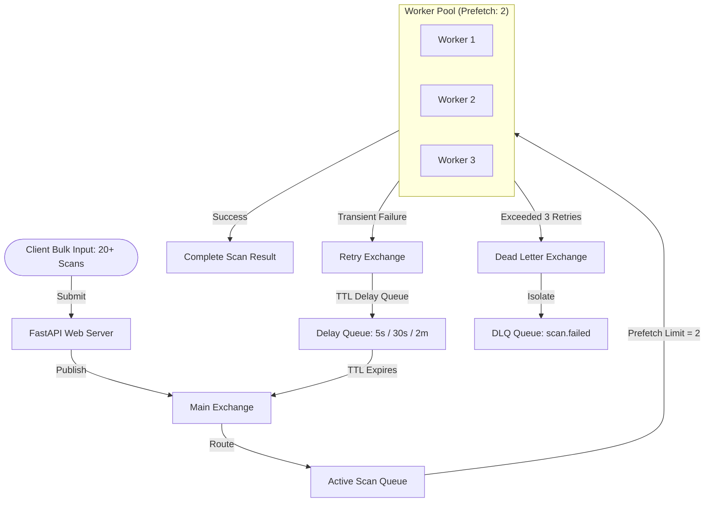

# Enterprise Demo Guide: Scalability & Fault Tolerance with RabbitMQ

This guide serves as a presentation script and walkthrough that you can use to demo the application's queue infrastructure to potential clients. It covers how the system supports **massive parallel bulk scans (20+ repos)**, handles **concurrency controls** to prevent server crashes, and manages **automatic retries and quarantine (DLQ)**.

---

## 1. The Core Business Value (What to Pitch)

When presenting to clients, focus on these three core engineering benefits:

1. **Crash Prevention (Queue Buffering):** Instead of processing all 20+ repository scans instantly (which would freeze or crash any server), we buffer them in an enterprise message queue (RabbitMQ). The scans wait safely in line without losing any requests.
2. **Predictable Resource Costs (Prefetch Limits):** We control exactly how many scans run concurrently based on the client's budget and server specifications. This ensures 100% server uptime even under extreme load.
3. **Self-Healing Infrastructure (Retries & DLQ):** If a scan fails due to a network glitch, the system automatically retries with a delay. If it fails permanently (e.g. incorrect credentials), it is isolated in a Dead Letter Queue (DLQ) so it doesn't block the rest of the queue.

---

## 2. Interactive Terminal Demonstration

To make this tangible for your client, you can run the live terminal simulator which creates a temporary sandbox namespace in RabbitMQ and showcases these exact mechanics.

### How to Run the Demo:
Run this command on a machine with python and connection to your RabbitMQ broker (or port-forward your Kubernetes RabbitMQ port 5672 to localhost):
```bash
python3 demo_rabbitmq.py
```
*(If running in K8s, specify the connection string: `python3 demo_rabbitmq.py amqp://admin:changeme@<rabbitmq-service-ip>:5672/`)*

---

## 3. Demo Walkthrough Script (Step-by-Step)

### PART 1: The Bulk Scan & Concurrency Demo
Run the script and point to the output of **DEMO 1**:

* **What the client sees on screen:**
  20 repository scan requests are submitted instantly. The console displays:
  ```text
  ✔ Successfully queued 20 scan jobs in queue: 'demo.scan.repo'
  ⚡ Processing: ['repo-01', 'repo-02', 'repo-03'] | Queued Buffer: 17 jobs remaining
  ```
* **Your Talking Points (Medium Technical):**
  > *"Here, we are simulating a user submitting a batch of 20 repositories for security scanning at the same time. On a standard API design, spawning 20 concurrent scan pods would overload the server's CPU, trigger Kubernetes scheduler failures, and crash the website.*
  >
  > *Instead, our architecture buffers all 20 jobs in RabbitMQ. We set a **concurrency limit (Prefetch Count) of 3**. As you can see, the worker picks up exactly 3 scans to process in parallel. The other 17 remain securely buffered in the queue. As soon as one scan completes, the next one is immediately pulled in. This guarantees 100% server stability and smooth operation, even under heavy bulk load."*

---

### PART 2: The Failure, Retry & DLQ Demo
Point to the output of **DEMO 2**:

* **What the client sees on screen:**
  A scan for a private repository starts and fails due to missing credentials. The console displays:
  ```text
  ❌ Scan failed: Private repository requires authentication credentials.
  ↳ Scheduling retry 1/3 with 2s backoff...
  ...
  ↳ ☠ Max retries exceeded! Rejecting message to move it to DLQ...
  ✔ Confirmed: The failing message was successfully isolated in the DLQ.
  ```
* **Your Talking Points (Medium Technical):**
  > *"Now, let's look at how the platform handles unexpected failures. Here, we submitted a repository scan that fails. In many traditional systems, a failing job might loop infinitely, consuming CPU resources, or get lost entirely, leaving the user with a perpetual loading screen.*
  >
  > *Our system implements an **Exponential Backoff Retry Loop**. On failure, the job is moved to a temporary 'Retry Queue' with a built-in time-to-live delay (5 seconds, 30 seconds, then 2 minutes). Once the delay expires, it automatically retries.*
  >
  > *If it continues to fail after 3 attempts, we classify it as a hard failure. The system automatically rejects the message, routing it to the **Dead Letter Queue (DLQ)**. This isolates the bad scan immediately, ensuring that a single faulty repository never blocks or slows down the scans of other clients in the system."*

---

## 4. Architectural Summary & Diagram

### The Core Platform Architecture
The platform is built on a distributed, decoupled, and containerized microservices architecture running inside Kubernetes:
* **API Server Gateway (`apiServer`)**: A high-performance FastAPI web server that handles client REST requests, rate-limiting, and job submission.
* **Message Broker (`RabbitMQ`)**: The asynchronous backbone that buffers incoming scan jobs, protecting the server from crash-inducing spikes in concurrent traffic.
* **Cache & State Store (`Redis`)**: Used for rate-limiting, active job tracking, and worker orchestration (such as broadcasting job cancellations via Redis Pub/Sub).
* **Hardened Sandbox Manager (`OpenSandbox`)**: Coordinates dynamic, isolated sandbox runner pods. Each sandbox is constrained in resources (CPU/Memory) and runs code analysis tools (Semgrep, Trivy, Git Clone) securely.

### Capacity & Resource Allocation (8 GB RAM Configuration)
Based on the platform's mathematical capacity formula, the system ensures 100% stability under load by reserving a buffer for system overhead and bottleneck limits:
* **System Overhead Reserve**: $1.5\text{ CPU Cores}$ and $2.5\text{ GiB RAM}$ (for PostgreSQL, Redis, RabbitMQ, and Gateway).
* **Free Resources (on a 4 Core / 8 GB Node)**: $2.5\text{ Cores}$ and $5.5\text{ GiB RAM}$.
* **Sandbox Runner Footprint**: Each dynamic sandbox pod requests $0.5\text{ CPU}$ and $0.5\text{ GiB RAM}$.
* **Bottleneck Calculation**: Max safe parallel scans = $\min(2.5 / 0.5, 5.5 / 0.5) = \mathbf{5}$ concurrent sandboxes.
* **Scalable Configuration Applied**:
  * **API Replicas ($R = 2$)**: Ensures high availability and zero-downtime rolling upgrades.
  * **Prefetch Workers ($P = 2$)**: Limits each worker pod to processing a maximum of 2 parallel scans (`maxRepoScanWorkers` and `maxQuickScanWorkers`).
  * **Total Concurrency**: $\text{Replicas (2)} \times \text{Prefetch (2)} = \mathbf{4}$ parallel scans. This utilizes the cluster optimally while staying safely under the 5-pod safety limit to prevent scheduler failures or node out-of-memory (OOM) crashes.

### Asynchronous Job Lifecycle & Resilience Diagram
You can share this flow chart with the client to summarize how tasks move through the system:


