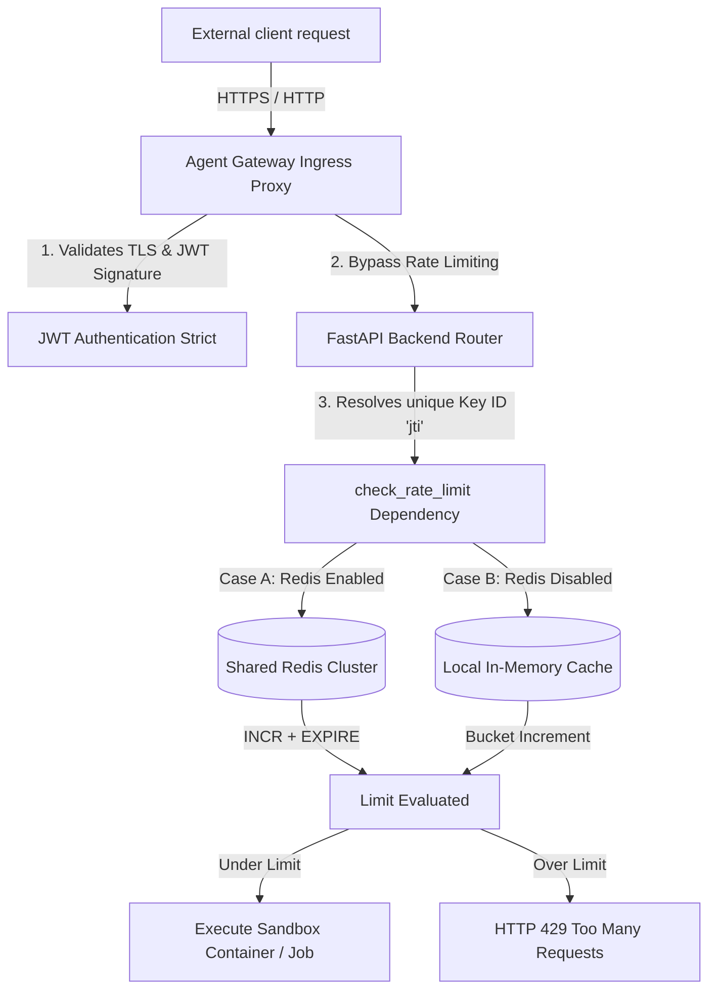
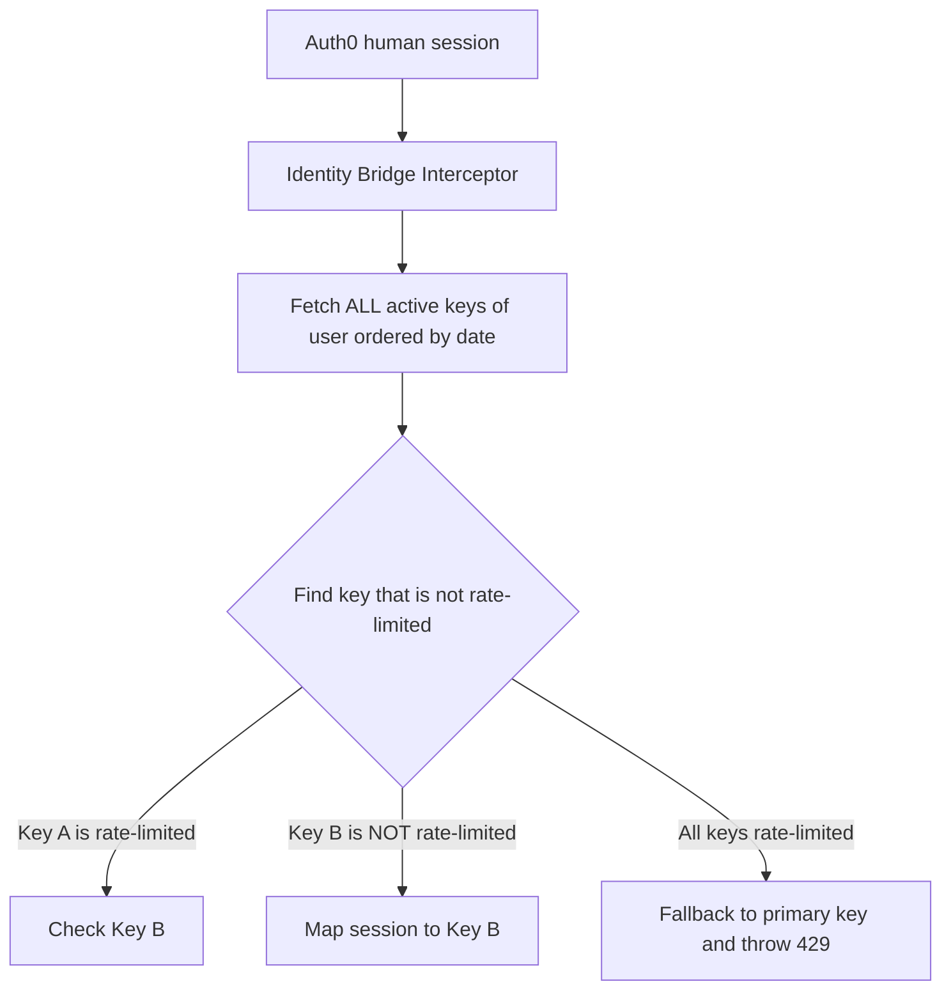

# 01Sandbox Key-Specific Rate Limiting Technical Specifications

This document outlines the architecture, design patterns, and operational guidelines for the **API-Key-Specific Rate Limiting System** implemented across the 01Sandbox gateway and backend API services.

---

## 1. Architectural Overview

To prevent Denial of Service (DoS) and protect platform resources, traffic must be rate-limited. However, flat rate-limiting at the ingress layer (gatekeeper) blocks entire tenants or routes, causing legitimate unique users to be blocked if a single client environment generates high volume.

To resolve this, we transitioned the rate-limiting architecture from a **Flat Gateway-Level Policy** to a **Granular API-Key-Specific Policy**:



By decoupling rate-limiting from the Gateway proxy and implementing it inside the FastAPI backend, we achieve:
1.  **Strict Isolation**: Each unique API Key (`jti`) operates in its own independent bucket.
2.  **No Cross-User Blockage**: A rate-limited key has **zero impact** on other users' unique keys.
3.  **Dynamic Thresholds**: Limits can be customized at runtime via standard environment variables.
4.  **Cluster Consistency**: A shared Redis cache coordinates call limits instantly across all Kubernetes replicas.

---

## 2. Ingress Layer Configurations (Agent Gateway)

To satisfy the `AgentgatewayPolicy` custom resource validator, the `traffic` block must always be present under `spec` (the schema requires at least one of `traffic`, `frontend`, or `backend` to be defined). 

To cleanly bypass the gateway-level throttling, we configure the template to automatically substitute a massive fallback threshold of **10,000 requests per minute** when the rate limit is disabled. This passes schema validation perfectly while guaranteeing zero routing blocks at the proxy layer.

### Modified Files:
*   [policy.yaml](file:///home/berrybytes/Desktop/01-Sandbox/codeInspector/charts/agentgateway/templates/policy.yaml):
    ```yaml
    spec:
      targetRefs:
        - group: gateway.networking.k8s.io
          kind: HTTPRoute
          name: agentgateway-api-route
      traffic:
        rateLimit:
          local:
            - requests: {{ if .Values.policy.rateLimit.enabled }}{{ .Values.policy.rateLimit.requests }}{{ else }}10000{{ end }}
              unit: {{ if .Values.policy.rateLimit.enabled }}{{ .Values.policy.rateLimit.unit }}{{ else }}"Minutes"{{ end }}
    ```
*   [agentgateway/values.yaml](file:///home/berrybytes/Desktop/01-Sandbox/codeInspector/charts/agentgateway/values.yaml) & parent [values.yaml](file:///home/berrybytes/Desktop/01-Sandbox/codeInspector/values.yaml): Dispatched `enabled: false` by default:
    ```yaml
    rateLimit:
      enabled: false
      requests: 7
      unit: "Minutes"
    ```

---

## 3. Backend Rate Limiting Module (`ratelimit.py`)

All rate-limiting logical checks, configurations, and memory tracking are encapsulated in the dedicated module [ratelimit.py](file:///home/berrybytes/Desktop/01-Sandbox/apiServer/fastapi/ratelimit.py).

### Configurations & Thresholds
Limits are loaded dynamically from environment variables, allowing fast tuning without rebuilding Docker images:
*   `RATE_LIMIT_REQUESTS` (Default: `7`): Maximum number of requests allowed in a window.
*   `RATE_LIMIT_WINDOW_SECS` (Default: `60` seconds): Duration of the fixed-window bucket.

### Implementation Strategies:

#### A. Shared Redis Cluster (Production)
For high-availability clusters, rate limits are stored globally. This ensures that if a client makes 3 requests to Pod A and 5 requests to Pod B, the aggregate limit (8) is correctly evaluated.
*   **Key Design**: `ratelimit:{jti}:{window_bucket}` where `window_bucket = timestamp // window_secs`.
*   **Atomic Pipeline**: Uses a Redis pipeline to perform `INCR` and `EXPIRE` in a single network round-trip, preventing race conditions and guaranteeing database integrity:
    ```python
    pipe = state.redis_client.pipeline()
    pipe.incr(rl_key)
    pipe.expire(rl_key, window_secs * 2)
    results = pipe.execute()
    current_count = int(results[0])
    ```

#### B. Local In-Memory Fallback (Local Development & Testing)
If the backend detects that Redis is disabled (`state.use_redis = False`), it automatically switches to an in-memory dictionary `state.local_rate_limits`.
*   **Self-Cleaning Engine**: To prevent memory bloat, the dictionary automatically flushes stale keys from previous time buckets when the tracker grows:
    ```python
    if len(state.local_rate_limits) > 1000:
        state.local_rate_limits = {k: v for k, v in state.local_rate_limits.items() if k.endswith(str(window_bucket))}
    ```

### Custom Exception Handler (HTTP 429)
When a key exceeds the threshold, the system raises an `HTTPException` with status code `429 Too Many Requests` containing rich diagnostic details and standard retry-after headers:
```json
{
  "detail": {
    "error": "Rate limit exceeded",
    "jti": "your-api-key-uuid",
    "requests_limit": 7,
    "window_seconds": 60,
    "retry_after": 45
  }
}
```

---

## 4. Middleware Integration

We integrated the check directly within the JWT authentication interceptor inside [codeinspectior_api.py](file:///home/berrybytes/Desktop/01-Sandbox/apiServer/fastapi/codeinspectior_api.py):

```python
# 1. Signature Verification & Identity Bridges completed...
print(f"[DEBUG SECURITY] SUCCESS: Session Verified (Key ID: {jti})")

# 2. Enforce dynamic key-specific rate limiting
from ratelimit import check_rate_limit
await check_rate_limit(state, jti)

# 3. Proceed to update metadata & execute sandbox jobs...
asyncio.create_task(update_last_used(jti))
```

---

## 5. Verification & Testing Guide

### A. Programmatic Verification
Run the comprehensive test script [test_rate_limit.py](file:///home/berrybytes/.gemini/antigravity/brain/32412ae5-abdc-4da4-9f91-7c277abc0cf1/scratch/test_rate_limit.py) to simulate multiple requests across unique API keys:
```bash
python3 test_rate_limit.py
```
This script validates:
1.  **Dynamic Tuning**: Setting window timeframes and quotas in mock state.
2.  **Strict Isolation**: Proving that rate-limiting `Key A` does **not** block `Key B`.
3.  **Sliding Windows**: Ensuring requests are restored automatically after the window expires.

### B. Manual Verification (cURL pings)
Perform rapid cURL calls using your unique keys:
```bash
# Key A - Call 1 to 7: HTTP 200 OK. Call 8: HTTP 429 Too Many Requests
curl -i -H "Authorization: Bearer <API_KEY_A>" https://api-sandbox.01security.com/api/v1/01sbx/postgresql/health

# Key B - Instant execution: HTTP 200 OK (Unaffected by Key A's block)
curl -i -H "Authorization: Bearer <API_KEY_B>" https://api-sandbox.01security.com/api/v1/01sbx/postgresql/health
```

---

## 6. Web Session Dynamic Key Rotation (Identity Bridge)

To deliver a premium, seamless user experience in the web dashboard and swagger interface, we implemented an **Automatic Active Key Rotation** system within the Identity Bridge:



### Architectural Benefits:
1.  **Dashboard Scaling**: If a user creates 5 active API keys, their browser/swagger workspace will automatically rotate through their active key pool, allowing them to click, test, and run up to **35 requests per minute** in the UI without getting blocked!
2.  **Zero Overhead**: Preemptive checks (`is_key_rate_limited`) perform zero-write read checks directly against the fast-cache Redis database, maintaining sub-millisecond execution speeds.
3.  **Strict Security**: This rotation only affects human sessions (Auth0). Requests using raw API key tokens remain bound strictly to their specific token context.
