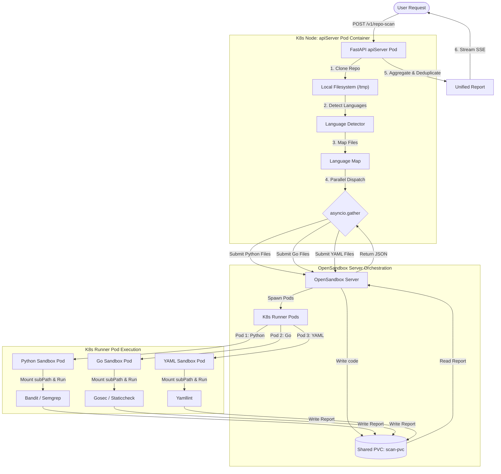
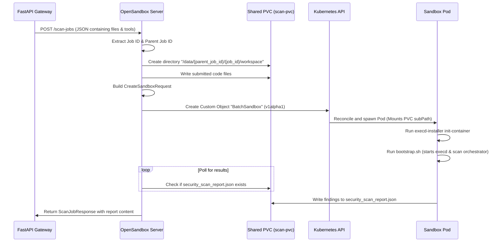

# Repository Scanner: Multilingual Sandbox Provisioning Technical Architecture

This document provides a comprehensive technical overview of how the multi-language repository scanning pipeline orchestrates sandbox pod provisioning, handles isolation using Kubernetes custom resources, and executes targeted security analysis tools.

---

## 1. High-Level Architecture Overview

When a user submits a GitHub repository, the system avoids running a single heavy, monolithic scan. Instead, it clones the repository, automatically detects all constituent programming languages, and **provisions dedicated, isolated container sandboxes** (pods) for each detected language concurrently.

The pipeline architecture is split into three main components:
1. **API Server Gateway (FastAPI)**: Coordinates the parent scan workflow, parses languages, schedules parallel sub-tasks, and aggregates findings.
2. **OpenSandbox Server**: Manages the lifecycle of isolated sandbox pods (Kubernetes-backed container sandboxes).
3. **Scanner Orchestrator**: The engine running inside each child sandbox pod that invokes specific security tools against the uploaded files.



---

## 2. Step-by-Step Execution Journey

### Step 2.1: Repository Ingest & Pre-validation
1. The user makes an request to `POST /v1/repo-scan` with the repository URL and credentials.
2. The FastAPI controller parses the GitHub URL (using `github_validator.py`) and registers a parent job ID in the `job_tracker`.
3. The scan job is delegated to `_run_scan_pipeline` in `scan_repository.py`.

### Step 2.2: Workspace Creation & Git Clone
1. **Local Workspace Provisioning**: The parent worker calls `provision_sandbox()` inside [sandbox_provisioner.py](file:///home/berrybytes/Desktop/Kamal/01-Sandbox/apiServer/fastapi/scan_repository/sandbox_provisioner.py). Despite its name, this functions as a **temporary directory** created directly on the local filesystem (ephemeral container storage) of the running `apiServer` pod itself (using `tempfile.mkdtemp` to produce `/tmp/reposcanner_abc123`).
2. **Local Shallow Clone**: The repository is cloned directly into this temporary folder `/tmp/reposcanner_abc123/repo` using an `asyncio` subprocess running `git clone --depth=1` inside the `apiServer` container.

> [!IMPORTANT]
> **Why is cloning done locally inside the `apiServer` Pod instead of inside a dedicated Kubernetes Sandbox Pod?**
>
> The OpenSandbox server is designed as a secure sandbox execution runtime and does not expose generic shell or command execution endpoints (like `/exec`).
> Therefore:
> 1. The repository must first be cloned inside the running `apiServer` pod's own container filesystem so that the application can read and analyze its structure.
> 2. This local copy is used to run language classification tools (like GitHub Linguist or Tokei) directly within the `apiServer` container to map the files.
> 3. Once files are grouped by language, only the relevant source code files (excluding massive `.git/` history, assets, and binaries) are read into memory and sent to the OpenSandbox server via `POST /scan-jobs`. The OpenSandbox server then writes them to the shared PVC and provisions the dedicated Kubernetes sandbox runner pods to perform the scan.

### Step 2.3: Multilingual Detection Phase
Before launching any sandboxes, the system runs local tools inside the API pod's workspace via `detect_languages` (in `language_detector.py`). It evaluates detection tools in the following priority:
1. **`github-linguist`**: Runs `linguist <repo_path> --breakdown --json` to get file-level breakdowns.
2. **`tokei`**: If Linguist is unavailable, runs `tokei <repo_path> --output json`.
3. **`enry`**: If Tokei is unavailable, runs `enry <repo_path>` and correlates files.
4. **Fallback Extension Walk**: A pure-Python file walking heuristic that classifies files based on their extensions.

This outputs a language map mapping canonical language names to their matching absolute file paths:
```json
{
  "Python": ["/tmp/reposcanner_abc/repo/src/app.py"],
  "Go": ["/tmp/reposcanner_abc/repo/main.go"],
  "YAML": ["/tmp/reposcanner_abc/repo/k8s/deployment.yaml"]
}
```

---

## 3. Parallel Sandbox Pod Provisioning & Scanning

Once the languages are mapped, the orchestrator begins the parallel scanning phase. It utilizes `asyncio.gather(*tasks)` to run language scanners concurrently.

### Step 3.1: Language Dispatching Heuristics
For each detected language, the system calls `scan_language()` in `file_scanner.py`.

> [!NOTE]
> **LoC-Only Languages**: Languages like JSON, Markdown, Text, TOML, XML, and Dockerfiles skip security scanning. The system merely calculates their Lines of Code (LoC) locally without requesting new sandbox resources.
>
> **YAML Partitioning**: YAML files are inspected via a heuristic (`_is_k8s_yaml`) and partitioned:
> - **Plain YAML**: Submitted for standard style/configuration check (`yamllint`).
> - **Kubernetes YAML**: Submitted for Kubernetes manifest security validations (`kubelinter`, `kubescore`, `kubeconform`).

### Step 3.2: Pod Provisioning via `/scan-jobs`
For each eligible language:
1. A **Files Payload** is constructed. The files of that specific language are read from the local clone, capped at **100 files** (maximum) and **200 KB per file** (to safeguard pod memory limits).
2. The payload is sent as an HTTP POST request to the **`POST /scan-jobs`** endpoint of the OpenSandbox server.
3. **Container Sandbox Provisioning**: The OpenSandbox server spawns a new isolated pod (code-interpreter container image) dedicated solely to this sub-job. If a repository has Python, Go, and Kubernetes YAML, **3 distinct container pods will run concurrently**.
4. **Tool Hints Routing**: The request includes tool hints. The server-side orchestrator uses these hints to determine which tools to run inside the pod.

| Language | Security Tools Initiated | Purpose |
| :--- | :--- | :--- |
| **Python** | `bandit`, `semgrep`, `gitleaks`, `trivy` | AST security vulnerability checking, custom syntax rules, credentials & dependency checks. |
| **Go** | `gosec`, `staticcheck`, `golangci_lint`, `go_build`, `semgrep`, `gitleaks`, `trivy` | Go vulnerability checks, compiler checks, meta-linters. |
| **YAML** | `yamllint`, `gitleaks`, `trivy` | YAML syntax check, exposed credentials. |
| **Kubernetes YAML** | `kubelinter`, `kubeconform`, `kubescore`, `gitleaks`, `trivy` | Kubernetes schema validity, resource compliance, best-practice configuration checks. |
| **JavaScript / TypeScript** | `semgrep`, `gitleaks`, `trivy` | SAST syntax matching, credentials and lockfile scanning. |
| **Shell / Bash** | `shellcheck`, `semgrep`, `gitleaks`, `trivy` | Script vulnerabilities, syntax errors. |

---

## 4. Aggregation and Cascade Cleanup

### Step 4.1: Cross-Language Finding Filtering
Because general-purpose tools (e.g., `semgrep` or `gitleaks`) might examine files outside the targeted language if they are present in a workspace, the API server applies a strict filter:
- `_filter_findings_to_submitted_files` retains only findings that map exactly to the file paths submitted to that specific pod.
- This prevents findings from one language leaking into the report of another.

### Step 4.2: Cascading Deletions & Resource Cleanup
To prevent container pod leakage and disk clutter:
- **Immediate Pod Termination**: After the pod returns its report, the OpenSandbox server terminates the container instance.
- **Cascading Child Job Cleanup**: In the `finally` block of the parent pipeline, the system fetches all child job IDs associated with the parent (both in memory and in Redis). It calls `cleanup_child_jobs()`, sending a `DELETE /scan-jobs/{job_id}` query to the OpenSandbox server to ensure no dangling pods are left running in the cluster.
- **Local Disk Purge**: The cloned temp directory is completely deleted using `shutil.rmtree(sandbox_id)`.

---

## 5. OpenSandbox Lifecycle: Deep Dive into `/scan-jobs` Pod Spawning

When the gateway makes a `POST /scan-jobs` request to OpenSandbox server, the backend performs file mapping, directory structuring on a shared PersistentVolumeClaim (PVC), and interfaces directly with the Kubernetes API using a custom resource wrapper called `BatchSandbox`.



### 5.1 Payload Format: How OpenSandbox Server Receives Files

The FastAPI gateway formats the HTTP POST request to `/scan-jobs` as JSON matching the `ScanJobRequest` model. The files are passed as a dictionary under the `files` key, where keys are relative file paths and values are the string content of the files.

**Example HTTP Request Payload:**
```json
{
  "files": {
    "src/main.py": "import os\nprint('Scanning python code')",
    "src/utils.py": "def helper():\n    return True"
  },
  "metadata": {
    "job_id": "8b9e67d2-7fb6-4552-bfbc-87c17d23a492",
    "parent_job_id": "786e76d7-e9a2-4272-9140-2029400e10a1"
  },
  "tools": ["bandit", "semgrep"],
  "timeout": 300
}
```

If a file contains binary characters or special symbols, the gateway Base64-encodes the content. The OpenSandbox server parses this JSON payload inside `lifecycle.py` and tries to decode it as Base64, falling back to writing it as plain-text if decoding fails:

```python
# Decoding logic in OpenSandbox server
try:
    decoded_content = base64.b64decode(content, validate=True)
    with open(file_path, "wb") as f:
        f.write(decoded_content)
except Exception:
    with open(file_path, "w") as f:
        f.write(content)
```

---

### 5.2 Step-by-Step Backend Lifecycle Code Implementation

#### 1. Ingestion and Shared Directory Initialization
The endpoint handler `/scan-jobs` receives the payload, structures the directory on the shared PVC, and saves the target language files.

```python
# Defined in opensandbox-server/docker-build/src/api/lifecycle.py
@router.post(
    "/scan-jobs",
    response_model=ScanJobResponse,
    status_code=status.HTTP_201_CREATED,
    tags=["Security Scan Pipeline"],
)
async def create_scan_job(
    request: Request,
    x_request_id: Optional[str] = Header(None, alias="X-Request-ID"),
) -> ScanJobResponse:
    # ...
    # 1. Parse JSON body payload containing code files
    body_bytes = await request.body()
    body_str = body_bytes.decode("utf-8")

    # ... (robust parsing of ScanJobRequest, generating job_id)
    job_id = metadata.get("job_id", str(uuid4()))
    parent_job_id = metadata.get("parent_job_id")
    subpath_prefix = f"{parent_job_id}/{job_id}" if parent_job_id else job_id

    # 2. Establish directories on the shared PVC (/data)
    data_root = os.environ.get("SCAN_DATA_ROOT", "/data")
    job_dir = os.path.join(data_root, subpath_prefix, "workspace")
    reports_dir = os.path.join(data_root, subpath_prefix, "reports")

    os.makedirs(job_dir, exist_ok=True)
    os.makedirs(reports_dir, exist_ok=True)

    # 3. Write target language source files to the workspace path
    for filename, content in files_to_save.items():
        safe_filename = os.path.basename(filename)
        file_path = os.path.join(job_dir, safe_filename)
        # Decodes base64 content, otherwise writes plain text
        try:
            decoded_content = base64.b64decode(content, validate=True)
            with open(file_path, "wb") as f:
                f.write(decoded_content)
        except Exception:
            with open(file_path, "w") as f:
                f.write(content)
```

#### 2. Building the Sandbox Specification with PVC Isolation
Once the files are persistent on the shared volume, a detailed `CreateSandboxRequest` is constructed. It isolations the scan context by mounting **specific subpaths** of the shared volume claim (`scan-pvc`) to `/workspace` and `/reports` inside the container:

```python
    # Constructing sandbox specification
    sandbox_req = CreateSandboxRequest(
        image=ImageSpec(uri=sandbox_image),
        resourceLimits=SchemaResourceLimits(
            root={
                "cpu": os.environ.get("SANDBOX_CPU", "200m"),
                "memory": os.environ.get("SANDBOX_MEMORY", "512Mi"),
            }
        ),
        entrypoint=["/opt/opensandbox/code-interpreter.sh"],
        timeout=scan_request.timeout if scan_request and scan_request.timeout else 300,
        env={
            "SCAN_DIR": "/workspace",
            "SCAN_REPORT": "/reports/security_scan_report.json",
            "SCAN_TOOLS": ",".join(scan_request.tools) if scan_request and scan_request.tools else "",
        },
        volumes=[
            Volume(
                name="workspace",
                pvc=PVC(claimName="scan-pvc"),
                mountPath="/workspace",
                subPath=f"{subpath_prefix}/workspace",  # Mounts ONLY this job's workspace files
            ),
            Volume(
                name="reports",
                pvc=PVC(claimName="scan-pvc"),
                mountPath="/reports",
                subPath=f"{subpath_prefix}/reports",    # Mounts ONLY this job's output directory
            ),
        ],
        metadata=metadata,
    )

    # Request sandbox provisioning from service layer
    created_sandbox = sandbox_service.create_sandbox(sandbox_req)
    sandbox_id = created_sandbox.id
```

#### 3. Resolving Workload Provider & Constructing the CRD manifest
Inside `KubernetesSandboxService` (defined in `src/services/k8s/kubernetes_service.py`), the request is received. The class generates a unique sandbox ID, metadata labels, and passes it to the `workload_provider` (`BatchSandboxProvider`):

```python
# Defined in opensandbox-server/docker-build/src/services/k8s/batchsandbox_provider.py
def create_workload(
    self,
    sandbox_id: str,
    namespace: str,
    image_spec: ImageSpec,
    entrypoint: List[str],
    env: Dict[str, str],
    resource_limits: Dict[str, str],
    labels: Dict[str, str],
    expires_at: Optional[datetime],
    execd_image: str,
    extensions: Optional[Dict[str, str]] = None,
    network_policy: Optional[NetworkPolicy] = None,
    egress_image: Optional[str] = None,
    volumes: Optional[List[Volume]] = None,
) -> Dict[str, Any]:
    # ...
    # 1. Build an init container that installs the daemon agent 'execd' into a shared emptyDir
    init_container = self._build_execd_init_container(execd_image)

    # 2. Build the main scan container
    main_container = self._build_main_container(
        image_spec=image_spec,
        entrypoint=entrypoint,
        env=env,
        resource_limits=resource_limits,
        has_network_policy=network_policy is not None,
    )

    # 3. Compile Pod Specification structure
    pod_spec: Dict[str, Any] = {
        "initContainers": [self._container_to_dict(init_container)],
        "containers": [self._container_to_dict(main_container)],
        "volumes": [{"name": "opensandbox-bin", "emptyDir": {}}],
    }

    # 4. Bind persistent volumes (applies PVC mounts for this job)
    if volumes:
        apply_volumes_to_pod_spec(pod_spec, volumes)

    # 5. Build the Custom Resource (CRD) payload for BatchSandbox
    runtime_manifest = {
        "apiVersion": "sandbox.opensandbox.io/v1alpha1",
        "kind": "BatchSandbox",
        "metadata": {
            "name": sandbox_id,
            "namespace": namespace,
            "labels": labels,
        },
        "spec": {
            "replicas": 1,
            "template": {
                "spec": pod_spec,
            },
            "expireTime": expires_at.isoformat() if expires_at else None
        },
    }

    # 6. Post custom resource object directly to the Kubernetes API server
    created = self.k8s_client.create_custom_object(
        group="sandbox.opensandbox.io",
        version="v1alpha1",
        namespace=namespace,
        plural="batchsandboxes",
        body=runtime_manifest,
    )
    return {"name": created["metadata"]["name"], "uid": created["metadata"]["uid"]}
```

#### 4. The Daemon Initialization & Execution Wrapper (`execd`)
To monitor the sandboxes reliably, the container execution flow utilizes `execd` (daemon process) and an init container:
- **`execd-installer` (Init Container)**: Pre-warmed Kubernetes pods run an init container before the main scanner container. This container copies the `execd` daemon and `bootstrap.sh` launcher to a shared, high-speed `emptyDir` volume mounted at `/opt/opensandbox/bin`.
- **`bootstrap.sh` (Command Wrapper)**: The main container executes `/opt/opensandbox/bin/bootstrap.sh` rather than the tool entrypoint directly. This script spawns the background `execd` daemon (which handles stdout/stderr streaming, heartbeats, and process lifecycle events) and then uses standard shell `exec` to invoke `/opt/opensandbox/code-interpreter.sh` (or language tool executables).

---

### 5.3 Kubernetes `subPath` Isolation Mechanics

To run scans for multiple programming languages concurrently without file conflicts or cross-language data contamination, the OpenSandbox server relies on Kubernetes **`subPath` volume mounts** referencing a single PersistentVolumeClaim (`scan-pvc`).

#### 1. Volume Helper Translation (`volume_helper.py`)
When the `BatchSandboxProvider` builds the container spec, it delegates volume configuration to `apply_volumes_to_pod_spec`. This function maps the request's volume definitions into Kubernetes `volumeMounts`:

```python
# Defined in src/services/k8s/volume_helper.py
mount = {
    "name": pvc_to_volume_name[pvc_claim_name],
    "mountPath": vol.mount_path,
    "readOnly": vol.read_only,
}
if vol.sub_path:
    mount["subPath"] = vol.sub_path
mounts.append(mount)
```

#### 2. Generated Kubernetes Pod Specification
This translates into a Kubernetes pod spec containing `subPath` mappings for both `/workspace` and `/reports`:

```yaml
apiVersion: v1
kind: Pod
metadata:
  name: sandbox-python-job
spec:
  volumes:
  - name: job-volume
    persistentVolumeClaim:
      claimName: scan-pvc
  containers:
  - name: sandbox
    image: scanner-orchestrator-image
    volumeMounts:
    - name: job-volume
      mountPath: /workspace                         # Target directory inside container
      subPath: parent-job-id/child-job-id/workspace  # Isolated directory on the PVC
    - name: job-volume
      mountPath: /reports                           # Output directory inside container
      subPath: parent-job-id/child-job-id/reports    # Isolated output path on the PVC
```

#### 3. How Kubernetes Enforces the Isolation
When the kubelet receives this Pod spec:
1. **PVC Mount**: It mounts the shared storage volume (the PVC `scan-pvc`) to a global mount path on the host node (e.g. `/var/lib/kubelet/pods/<pod-uid>/volumes/kubernetes.io~pvc/job-volume`).
2. **SubPath Resolution**: It resolves the subpath directory path on the host node, appending the `subPath` value (e.g., `/var/lib/kubelet/pods/<pod-uid>/volumes/kubernetes.io~pvc/job-volume/parent-job-id/child-job-id/workspace`).
3. **Container Bind Mount**: During container runtime creation, it performs a **Linux bind mount** targeting *only* that resolved subpath directory to `/workspace` inside the container's mount namespace.

As a result, the tool processes running inside the container see a standard directory tree at `/workspace`, but have absolutely no visibility into the parent directories or other child job workspaces sharing the same PVC. This achieves secure, lightweight directory isolation without the overhead of creating distinct Persistent Volumes for every single language scan job.
