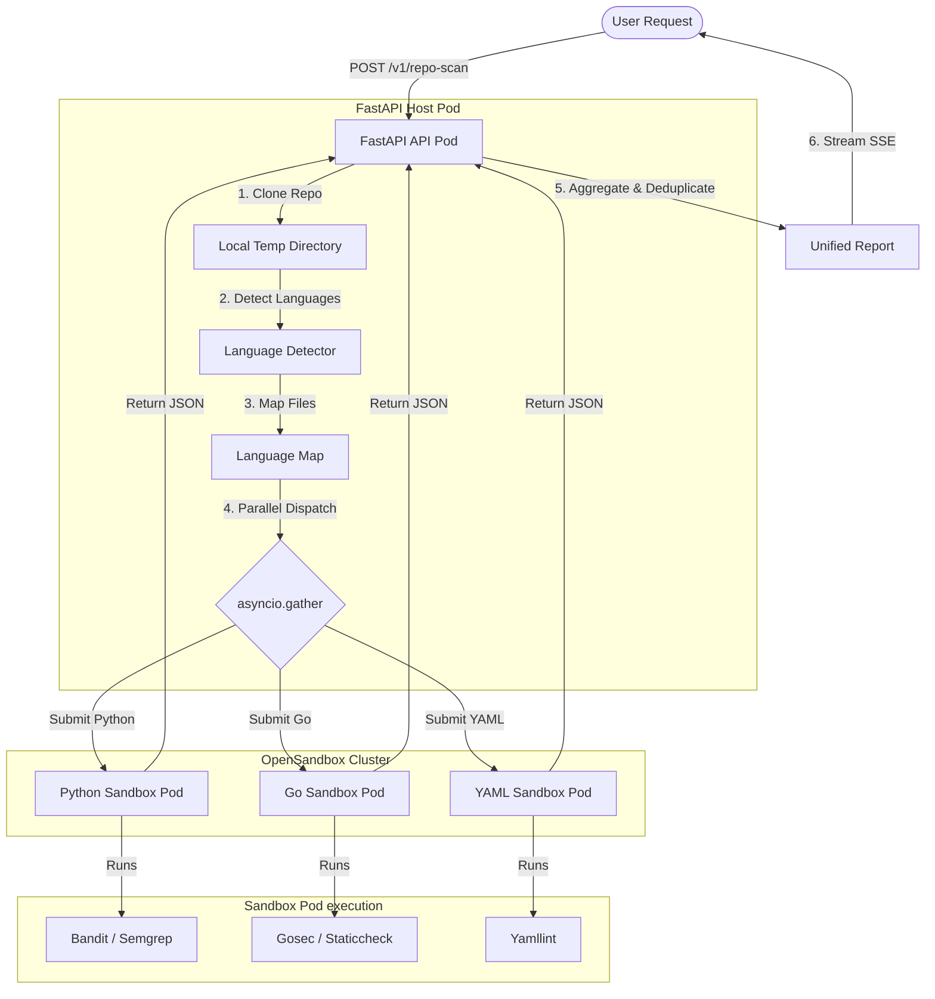

# Repository Scanner: Multilingual Sandbox Provisioning Technical Architecture

This document provides a comprehensive technical overview of how the multi-language repository scanning pipeline orchestrates sandbox pod provisioning and executes targeted security analysis tools.

---

## 1. High-Level Architecture Overview

When a user submits a GitHub repository, the system avoids running a single heavy, monolithic scan. Instead, it clones the repository, automatically detects all constituent programming languages, and **provisions dedicated, isolated container sandboxes** (pods) for each detected language concurrently.

The pipeline architecture is split into three main components:
1. **API Server Gateway (FastAPI)**: Coordinates the parent scan workflow, parses languages, schedules parallel sub-tasks, and aggregates findings.
2. **OpenSandbox Server**: Manages the lifecycle of isolated sandbox pods (Kubernetes-backed container sandboxes).
3. **Scanner Orchestrator**: The engine running inside each child sandbox pod that invokes specific security tools against the uploaded files.



---

## 2. Step-by-Step Execution Journey

### Step 2.1: Repository Ingest & Pre-validation
1. The user makes an authenticated request to `POST /v1/repo-scan` with the repository URL and optional credentials.
2. The FastAPI controller parses the GitHub URL (using [github_validator.py](file:///home/berrybytes/Desktop/Kamal/01-Sandbox/apiServer/fastapi/scan_repository/github_validator.py)) and registers a parent job ID in the `job_tracker` (synchronized via Redis for multi-pod environments).
3. The scan job is delegated to `_run_scan_pipeline` in [scan_repository.py](file:///home/berrybytes/Desktop/Kamal/01-Sandbox/apiServer/fastapi/scan_repository/scan_repository.py).

### Step 2.2: Workspace Creation & Git Clone
1. **Local Sandbox Provisioning**: The parent worker calls `provision_sandbox()` inside [sandbox_provisioner.py](file:///home/berrybytes/Desktop/Kamal/01-Sandbox/apiServer/fastapi/scan_repository/sandbox_provisioner.py), which creates a temporary directory on the API pod (e.g. `/tmp/reposcanner_abc123`).
2. **Shallow Clone**: The repository is cloned into this workspace with `--depth=1` to minimize resource consumption and download speed.

### Step 2.3: Multilingual Detection Phase
Before launching any sandboxes, the system runs local tools inside the API pod's workspace via `detect_languages` (in [language_detector.py](file:///home/berrybytes/Desktop/Kamal/01-Sandbox/apiServer/fastapi/scan_repository/language_detector.py)). It evaluates detection tools in the following priority:
1. **`github-linguist`**: Runs `linguist <repo_path> --breakdown --json` to get file-level breakdowns.
2. **`tokei`**: If Linguist is unavailable, runs `tokei <repo_path> --output json`.
3. **`enry`**: If Tokei is unavailable, runs `enry <repo_path>` and correlates files.
4. **Fallback Extension Walk**: A pure-Python file walking heuristic that classifies files based on their extensions.

This outputs a language map mapping canonical language names to their matching absolute file paths:
```json
{
  "Python": ["/tmp/reposcanner_abc/repo/src/app.py"],
  "Go": ["/tmp/reposcanner_abc/repo/main.go"],
  "YAML": ["/tmp/reposcanner_abc/repo/k8s/deployment.yaml"]
}
```

---

## 3. Parallel Sandbox Pod Provisioning & Scanning

Once the languages are mapped, the orchestrator begins the parallel scanning phase. It utilizes `asyncio.gather(*tasks)` to run language scanners concurrently.

### Step 3.1: Language Dispatching Heuristics
For each detected language, the system calls `scan_language()` in [file_scanner.py](file:///home/berrybytes/Desktop/Kamal/01-Sandbox/apiServer/fastapi/scan_repository/file_scanner.py).

> [!NOTE]
> **LoC-Only Languages**: Languages like JSON, Markdown, Text, TOML, XML, and Dockerfiles skip security scanning. The system merely calculates their Lines of Code (LoC) locally without requesting new sandbox resources.
>
> **YAML Partitioning**: YAML files are inspected via a heuristic (`_is_k8s_yaml`) and partitioned:
> - **Plain YAML**: Submitted for standard style/configuration check (`yamllint`).
> - **Kubernetes YAML**: Submitted for Kubernetes manifest security validations (`kubelinter`, `kubescore`, `kubeconform`).

### Step 3.2: Pod Provisioning via `/scan-jobs`
For each eligible language:
1. A **Files Payload** is constructed. The files of that specific language are read from the local clone, capped at **100 files** (maximum) and **200 KB per file** (to safeguard pod memory limits).
2. The payload is sent as an HTTP POST request to the **`POST /scan-jobs`** endpoint of the OpenSandbox server.
3. **Container Sandbox Provisioning**: The OpenSandbox server spawns a new isolated pod (code-interpreter container image) dedicated solely to this sub-job. If a repository has Python, Go, and Kubernetes YAML, **3 distinct container pods will run concurrently**.
4. **Tool Hints Routing**: The request includes tool hints. The server-side orchestrator uses these hints to determine which tools to run inside the pod.

| Language | Security Tools Initiated | Purpose |
| :--- | :--- | :--- |
| **Python** | `bandit`, `semgrep`, `gitleaks`, `trivy` | AST security vulnerability checking, custom syntax rules, credentials & dependency checks. |
| **Go** | `gosec`, `staticcheck`, `golangci_lint`, `go_build`, `semgrep`, `gitleaks`, `trivy` | Go vulnerability checks, compiler checks, meta-linters. |
| **YAML** | `yamllint`, `gitleaks`, `trivy` | YAML syntax check, exposed credentials. |
| **Kubernetes YAML** | `kubelinter`, `kubeconform`, `kubescore`, `gitleaks`, `trivy` | Kubernetes schema validity, resource compliance, best-practice configuration checks. |
| **JavaScript / TypeScript** | `semgrep`, `gitleaks`, `trivy` | SAST syntax matching, credentials and lockfile scanning. |
| **Shell / Bash** | `shellcheck`, `semgrep`, `gitleaks`, `trivy` | Script vulnerabilities, syntax errors. |

---

## 4. Aggregation and Cascade Cleanup

### Step 4.1: Cross-Language Finding Filtering
Because general-purpose tools (e.g., `semgrep` or `gitleaks`) might examine files outside the targeted language if they are present in a workspace, the API server applies a strict filter:
- `_filter_findings_to_submitted_files` retains only findings that map exactly to the file paths submitted to that specific pod.
- This prevents findings from one language leaking into the report of another.

### Step 4.2: Cascading Deletions & Resource Cleanup
To prevent container pod leakage and disk clutter:
- **Immediate Pod Termination**: After the pod returns its report, the OpenSandbox server terminates the container instance.
- **Cascading Child Job Cleanup**: In the `finally` block of the parent pipeline, the system fetches all child job IDs associated with the parent (both in memory and in Redis). It calls `cleanup_child_jobs()`, sending a `DELETE /scan-jobs/{job_id}` query to the OpenSandbox server to ensure no dangling pods are left running in the cluster.
- **Local Disk Purge**: The cloned temp directory is completely deleted using `shutil.rmtree(sandbox_id)`.

---

> [!TIP]
> This split-concurrency model optimizes performance. Instead of running a single long-running pod that carries the overhead of all language runtimes and scanning tools, resources are requested dynamically and run in parallel, returning aggregated results much faster.
