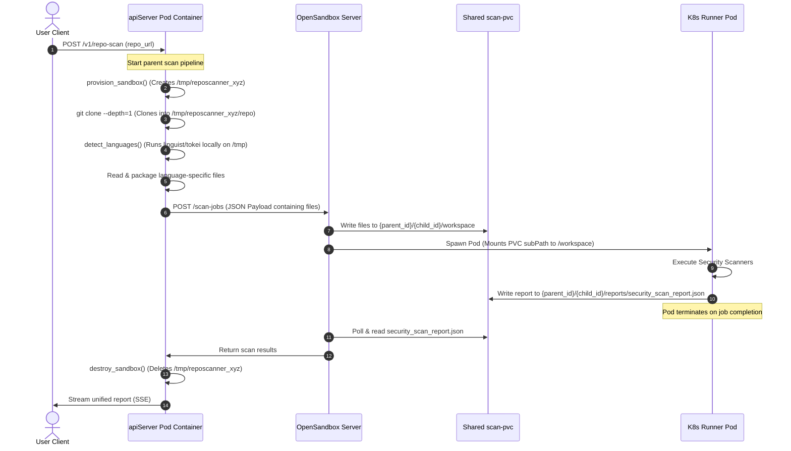

# Workspace Provisioning and K8s Mount Isolation Analysis

This document details the mechanics of local workspace provisioning, repository cloning, and the isolation properties of OpenSandbox jobs running on Kubernetes.

---

## 1. Local Workspace Provisioning & Cloning

The GitHub repository is **not** cloned inside a Kubernetes pod directly. Instead, the cloning and analysis pipeline executes in two distinct phases.

### 1.1 End-to-End Execution Sequence (Request to Local Cleanup)

Below is the chronological sequence of actions that occur for local workspace provisioning, repository cloning, and transition to remote scanning:



#### Step 1: User Request Ingestion
The user triggers the pipeline by making an HTTP POST request to `POST /v1/repo-scan` with the repository URL and credentials. The FastAPI controller registers a parent job ID.

#### Step 2: Provisioning Local Directory
The parent orchestrator calls `provision_sandbox()` in `sandbox_provisioner.py`. This issues a call to `tempfile.mkdtemp()`, creating a dedicated directory (e.g., `/tmp/reposcanner_abc123`) on the ephemeral storage of the running `apiServer` pod container.

#### Step 3: Performing the Local Clone
The system executes a local git subprocess to perform a shallow clone:
```bash
git clone --depth=1 <repo_url> /tmp/reposcanner_abc123/repo
```
This shallow clone downloads only the latest commit, minimizing memory usage and network bandwidth on the `apiServer` container disk.

#### Step 4: Local Language Mapping
The language classification engine walks the files in `/tmp/reposcanner_abc123/repo` and runs analysis tools (like Tokei or Linguist) directly inside the `apiServer` pod. It compiles a language map correlating languages to their respective code files.

#### Step 5: Packaging & Forwarding
The `apiServer` reads the contents of the detected files into memory, filters out binaries or oversized files, and structures the JSON payload for the OpenSandbox service. It sends a `POST /scan-jobs` request.

#### Step 6: Spawning the Remote Runner Pod
The OpenSandbox server receives the JSON, writes the files to the shared PVC, and spawns the isolated `BatchSandbox` pod using the specific PVC `subPath` directory containing only the target files.

#### Step 7: Local Workspace Destruction
To prevent local disk leakage, once the scanning pipeline finishes (or aborts due to timeouts, errors, or cancellation), the `apiServer` runs `destroy_sandbox()` inside a **`finally` block**. This invokes `shutil.rmtree(sandbox_id)` which deletes the entire `/tmp/reposcanner_abc123` workspace folder from the `apiServer` pod disk.

### 1.2 Deep Dive: Where does the "Local Sandbox Provisioning" happen and how is it deleted?
It happens locally on the **ephemeral filesystem (container storage) of the running `apiServer` pod**.

* **Creation**:
  The function `provision_sandbox()` inside [sandbox_provisioner.py](file:///home/berrybytes/Desktop/Kamal/01-Sandbox/apiServer/fastapi/scan_repository/sandbox_provisioner.py) uses standard Python temporary folder creation:
  ```python
  tmpdir = await loop.run_in_executor(None, tempfile.mkdtemp, None, "reposcanner_")
  ```

* **Guarantee of Deletion**:
  The deletion is wrapped in a robust `try...finally` structure inside the main pipeline executor of [scan_repository.py](file:///home/berrybytes/Desktop/Kamal/01-Sandbox/apiServer/fastapi/scan_repository/scan_repository.py):
  ```python
  try:
      # ... Perform clone, classification, and submit parallel scan jobs ...
  finally:
      if sandbox_id:
          log("CLEANUP", f"Destroying sandbox: {sandbox_id}")
          await destroy_sandbox(sandbox_id)
  ```

* **Deletion Execution**:
  In [sandbox_provisioner.py](file:///home/berrybytes/Desktop/Kamal/01-Sandbox/apiServer/fastapi/scan_repository/sandbox_provisioner.py), the `destroy_sandbox()` function calls Python's `shutil.rmtree` to perform a recursive folder deletion:
  ```python
  async def destroy_sandbox(sandbox_id: str) -> None:
      try:
          loop = asyncio.get_event_loop()
          await loop.run_in_executor(None, shutil.rmtree, sandbox_id, True)
      except Exception as exc:
          print(f"WARNING: failed to destroy sandbox {sandbox_id}: {exc}")
  ```


### 1.3 Architecture Rationale: Why is the repository not cloned directly inside a Kubernetes pod?
As noted in the codebase:
> *"Since the OpenSandbox server has no `/exec` endpoint, we clone the repository locally on the API pod using a subprocess git clone, store cloned files in a local temp directory, and run tools via the existing POST `/scan-jobs` pipeline."*

If the system tried to clone directly inside a Kubernetes pod:
- It would have to deploy a generic container, run the git clone, and then somehow run language classification (Linguist, Tokei) remotely across the container.
- Because the OpenSandbox server acts as a clean, single-purpose job executor without a generic shell execution `/exec` API, the API server must do the cloning and language analysis first.

---

## 2. Under the Hood: Container Filesystem Boundaries

* **`apiServer` Runs inside a Kubernetes Pod**:
  The FastAPI backend server is itself packaged as a Docker image and runs as a container inside a Kubernetes Pod (e.g., `apiserver-7c85c49b-abcde`).
* **Every Container Has Local Storage (Ephemeral Disk)**:
  Even though a pod is ephemeral, it has its own container root filesystem (the ephemeral disk layer inside that specific running container). Any files written to `/tmp` inside the container exist locally on that container pod's disk.
* **Writing and Cloning Happens Inside the `apiServer` Container**:
  When the Python script running inside the `apiServer` container calls `tempfile.mkdtemp()`, the OS creates a directory like `/tmp/reposcanner_abc123` inside the `apiServer` container's filesystem. When the `git clone` command runs, it clones the repository straight into `/tmp/reposcanner_abc123/repo` on the `apiServer` container's disk. The language detection tools (like `github-linguist` or `tokei`) run directly inside the `apiServer` container, scanning that local `/tmp` path.
* **Wiping and Sending**:
  Once language detection finishes, the `apiServer` reads the relevant files into memory, packages them up, and deletes the temporary directory (`shutil.rmtree`) from its container filesystem. It then shoots the files payload via HTTP to the OpenSandbox server, which mounts a shared PVC (`scan-pvc`) and spawns the separate, isolated runner pods (like Python, Go, or YAML pods) to do the security scanning.

---

## 3. Payload Format for `POST /scan-jobs`

The OpenSandbox server receives the files in a JSON payload where the `files` key contains a dictionary of file names mapping to their raw code content as a string. If the files contain binary or special characters, they are Base64 encoded by the API gateway:

```json
{
  "files": {
    "src/main.py": "import os\nprint('Scanning python code')",
    "src/utils.py": "def helper():\n    return True"
  },
  "metadata": {
    "job_id": "8b9e67d2-7fb6-4552-bfbc-87c17d23a492",
    "parent_job_id": "786e76d7-e9a2-4272-9140-2029400e10a1"
  },
  "tools": ["bandit", "semgrep"],
  "timeout": 300
}
```

The OpenSandbox server's `lifecycle.py` attempts to decode this using Base64, falling back to writing it as a plain-text file if decoding fails:

```python
try:
    decoded_content = base64.b64decode(content, validate=True)
    with open(file_path, "wb") as f:
        f.write(decoded_content)
except Exception:
    with open(file_path, "w") as f:
        f.write(content)
```

---

## 4. How the `BatchSandbox` Pod Mounts Only That Specific Subpath

Kubernetes natively supports isolating subdirectories using the `subPath` configuration on a container's `volumeMounts`.

### Volume Spec Formulation
In [volume_helper.py](file:///home/berrybytes/Desktop/Kamal/01-Sandbox/opensandbox-server/docker-build/src/services/k8s/volume_helper.py), the `apply_volumes_to_pod_spec` function builds the volume mounts for the container and appends `subPath` dynamically:

```python
mount = {
    "name": pvc_to_volume_name[pvc_claim_name],
    "mountPath": vol.mount_path,
    "readOnly": vol.read_only,
}
if vol.sub_path:
    mount["subPath"] = vol.sub_path
```

### Generated Pod YAML
This results in a Pod spec containing:

```yaml
volumeMounts:
- name: job-volume
  mountPath: /workspace                         # Target path inside container
  subPath: parent-job-id/child-job-id/workspace  # Specific subpath directory on PVC
```

### Linux Namespace Mount Isolation
When the Kubernetes `kubelet` schedules the Pod on a node:
1. It mounts the shared `scan-pvc` PersistentVolume locally onto the host node.
2. It appends the `subPath` value to the mount path on the host.
3. Using a **Linux bind mount**, it attaches *only* that specific subdirectory to `/workspace` inside the container’s mount namespace.

As a result, processes inside the runner pod see a normal directory at `/workspace`, but have no access or visibility to other directories or files belonging to other scan jobs on the same PVC.
