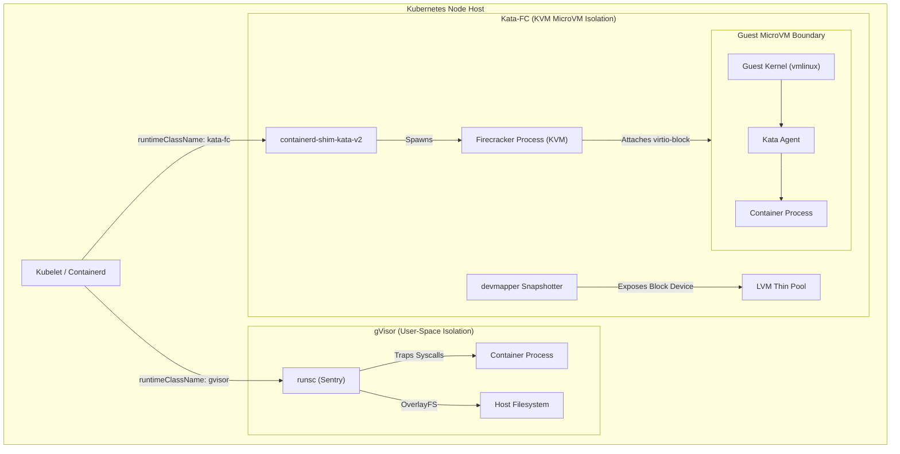
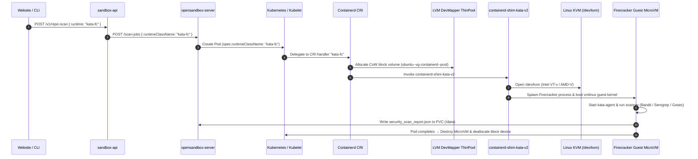

# Container Runtime Resource Comparison: gVisor vs. Kata-FC (Firecracker)

This document provides a detailed technical comparison of resource consumption (CPU, Memory, Disk I/O, and Provisioning Latency) between **gVisor (`gvisor`)** and **Kata Containers with Firecracker (`kata-fc`)** in the OpenSandbox platform. It explains the architectural mechanics of why `kata-fc` experiences high CPU and memory spikes during concurrent repository scans and offers concrete optimization strategies to manage cluster load.

---

## 1. Architectural Comparison

| Dimension | gVisor (`gvisor`) | Kata Containers + Firecracker (`kata-fc`) |
| :--- | :--- | :--- |
| **Isolation Mechanism** | User-Space Kernel (Application-level sandbox) | Hardware-Assisted KVM Virtual Machine (MicroVM) |
| **Hypervisor Process** | None (`runsc` user-space Sentry process) | `firecracker` VMM process + KVM (`/dev/kvm`) |
| **Kernel Boundary** | Shared host kernel, intercepted by gVisor `Sentry` | Independent Guest Linux Kernel (`vmlinux`) per Pod |
| **Storage Driver** | Standard `overlayfs` | LVM Thin-Pool `devmapper` snapshotter (Block devices) |
| **Base Memory Footprint** | ~15 MB – 30 MB per container | ~256 MB+ per MicroVM (Pre-allocated guest RAM) |
| **Provisioning Latency** | ~100 ms – 300 ms (Fast process spawn) | ~1.0 s – 3.0 s (VM boot + devmapper block attach) |
| **Host CPU Overhead** | Low-to-moderate (Syscall trapping in Go) | High (vCPU thread scheduling + Hypervisor + I/O) |

---

## 2. High-Level Architecture Diagram



---

## 2.5 Detailed End-to-End Execution Flow of `kata-fc`

When a user selects **KATA FC** in the platform UI or sets `runtime: "kata-fc"` in API requests, the system executes the following end-to-end sequence across the 01-Sandbox stack:



### Detailed Lifecycle Steps

#### 1. Request Initiation & Runtime Hint
- The UI or CLI submits `POST /v1/repo-scan` with `"runtime": "kata-fc"`.
- `sandbox-api` receives the request and forwards the runtime metadata to `opensandbox-server`.

#### 2. Kubernetes RuntimeClass Dispatch
- `opensandbox-server` provisions a `BatchSandbox` Custom Resource (CRD) or Pod with `spec.runtimeClassName: "kata-fc"`.
- The Kubernetes API server matches `kata-fc` against the cluster's `RuntimeClass` resource:
  ```yaml
  apiVersion: node.k8s.io/v1
  kind: RuntimeClass
  metadata:
    name: kata-fc
  handler: kata-fc
  ```

#### 3. Containerd CRI Handler & DevMapper Snapshotter
- Kubelet hands the pod spec to **Containerd**.
- Containerd reads `/var/lib/rancher/rke2/agent/etc/containerd/config.toml`:
  ```toml
  [plugins."io.containerd.grpc.v1.cri".containerd.runtimes.kata-fc]
    runtime_type = "io.containerd.kata.v2"
    snapshotter = "devmapper"
  ```
- Firecracker MicroVMs require raw block storage (they cannot use `overlayfs`). Containerd invokes the **`devmapper` snapshotter**, which allocates a thin copy-on-write (CoW) block device volume from the host's LVM thin pool (`ubuntu--vg-containerd--pool`).

#### 4. Spawning the Firecracker MicroVM (via KVM)
- Containerd delegates execution to `/opt/kata/bin/containerd-shim-kata-v2`.
- `containerd-shim-kata-v2` reads `/etc/kata-containers/configuration.toml` and launches an isolated **Firecracker VMM process** (`/usr/local/bin/firecracker`).
- Firecracker opens `/dev/kvm` and uses hardware CPU virtualization flags (**Intel VT-x** or **AMD-V**) to boot a dedicated, lightweight guest Linux kernel (`vmlinux`).

#### 5. Guest MicroVM Boot & Isolated Execution
- Inside the guest MicroVM, the guest Linux kernel boots in **~150ms**.
- The guest init process (`kata-agent`) starts inside the VM and communicates with the host shim via an encrypted `vsock` socket.
- `kata-agent` mounts the `devmapper` block volume and executes the scanner image (e.g. `01sandbox-scanner-python` or `01sandbox-scanner-go`).
- Static analysis tools (**Bandit**, **Semgrep**, **Gosec**, **PMD**, **Trivy**) run completely trapped inside the hardware MicroVM.

#### 6. Results Storage & Automatic Destruction
- The scanner writes its findings JSON to the shared host PVC volume at `/data/<job_id>/reports/security_scan_report.json`.
- Once finished, the Firecracker MicroVM terminates immediately (`autoTerminationSeconds: 0`), releasing guest RAM back to the host system and deallocating the ephemeral `devmapper` block volume.

---

## 3. Why `kata-fc` Spikes CPU and Memory (and Why `gVisor` Does Not)

When running multi-language static repository scans, `apiServer` dispatches security auditing tasks across all detected languages. Under `kata-fc`, cluster memory and CPU usage spike dramatically, whereas under `gvisor`, the system remains stable. Below are the core technical reasons for this difference:

### A. Pre-Allocated Guest RAM vs. Dynamic Process Heap

- **`kata-fc` Memory Model**: Firecracker boots a complete Virtual Machine. To boot the guest kernel (`vmlinux`) and guest init system (`kata-agent`), KVM must allocate physical memory pages on the host matching the pod's configured memory (typically **256 MB minimum per VM**). Additionally, the host must maintain memory for the `containerd-shim-kata-v2` process, Firecracker VMM state, and `devmapper` block metadata.
  - *Impact*: If a repository scan detects 8 languages (e.g., Python, Go, JS, Shell, Dockerfile, YAML, Java, C++), `kata-fc` immediately reserves **8 × 256 MB = 2.0+ GB of host RAM** regardless of how many files are actually in each language.
- **`gVisor` Memory Model**: gVisor (`runsc`) runs as a standard host process (`Sentry`). Memory is allocated dynamically and lazily from host anonymous pages. If a YAML scanner only uses 12 MB of RAM, gVisor consumes only ~15–25 MB total (including the Sentry overhead).
  - *Impact*: 8 parallel `gvisor` language scans consume **8 × 25 MB = ~200 MB of host RAM**, nearly 10x less than `kata-fc`.

---

### B. vCPU Thread Scheduling & Hypervisor Overhead vs. Syscall Interception

- **`kata-fc` CPU Model**: Each Firecracker MicroVM spawns dedicated vCPU threads managed by the host OS scheduler. When heavy static analysis engines (such as `semgrep`, `gosec`, `pmd`, `trivy`) execute simultaneously across 8 MicroVMs:
  1. Dozens of vCPU threads compete simultaneously for physical CPU cores.
  2. KVM VM-Exits (context switches between guest VM and host hypervisor) occur frequently during heavy CPU instructions.
  3. Host CPU usage spikes heavily as physical cores handle vCPU thread context switching, hypervisor management, and guest CPU emulation.
- **`gVisor` CPU Model**: gVisor traps system calls inside its user-space Sentry engine written in Go. While there is a slight CPU penalty for trapping syscalls compared to `runc`, there are **no hardware hypervisor VM-Exits or vCPU scheduling threads**. The host OS schedules container processes directly like standard user applications.

---

### C. Storage Driver Overhead: `devmapper` Block Devices vs. `overlayfs`

- **`kata-fc` Storage Model**: Firecracker MicroVMs cannot use Linux kernel `overlayfs` because virtual machines require raw block devices. Kata uses the `devmapper` snapshotter, which creates copy-on-write (CoW) block devices from an LVM thin pool for every sandbox:
  1. Host LVM thin-pool metadata transactions occur on every pod creation.
  2. The block device node is dynamically hot-plugged into the running Firecracker VM over `virtio-block`.
  3. Concurrent creation of 8 MicroVMs causes heavy host kernel I/O wait, block allocation locks (`dm-thin`), and `kworker` CPU spikes.
- **`gVisor` Storage Model**: Mounts filesystems directly via standard Linux `overlayfs` or bind mounts without LVM thin-pool block device creation, resulting in virtually zero storage driver CPU or I/O overhead.

---

### D. Unbounded Concurrency in Repository Scanning

In `scan_repository/scan_repository.py`, multi-language scans execute concurrently:

```python
# File: apiServer/fastapi/scan_repository/scan_repository.py
tasks = [
    scan_single_language(language, files, idx)
    for idx, (language, files) in enumerate(lang_map.items())
]
if tasks:
    await asyncio.gather(*tasks)  # Unbounded parallel execution across all languages
```

When 8 languages are detected:
- **Under `kata-fc`**: 8 parallel POST requests hit `opensandbox-server`, which submits 8 `BatchSandbox` CRDs to Kubernetes. The cluster attempts to instantly boot 8 Firecracker MicroVMs, allocate 8 `devmapper` block devices, and launch 8 guest kernels **at the exact same millisecond**. This creates massive CPU spikes (e.g., `sandbox-api` CPU spiking to 65+, `opensandbox-server` spiking to 19+).
- **Under `gVisor`**: 8 parallel requests spawn 8 lightweight `runsc` process trees on the host kernel, which the host scheduler handles smoothly with minimal resource contention.

---

## 5. Security & Threat Model Comparison: gVisor vs. Kata-FC

While both **gVisor (`gvisor`)** and **Kata Containers with Firecracker (`kata-fc`)** provide strong multi-tenant security boundaries far exceeding standard `runc` Docker containers, they achieve security through fundamentally different architectural models.

```mermaid
graph TD
    subgraph gVisor_Security ["gVisor Security Model (Syscall Virtualization)"]
        Container1["Untrusted Container Code"] -->|Intercepts Syscalls| Sentry["gVisor Sentry (Go Engine)"]
        Sentry -->|Strict Seccomp Filter| HostKernel1["Host Linux Kernel"]
        style Sentry fill:#4a154b,color:#fff
    end

    subgraph Kata_Security ["Kata-FC Security Model (Hardware MicroVM)"]
        Container2["Untrusted Container Code"] -->|Runs inside| GuestKernel["Disposable Guest Kernel (vmlinux)"]
        GuestKernel -->|Hardware KVM Boundary| Firecracker["Firecracker VMM (Rust)"]
        Firecracker -->|/dev/kvm| HostKernel2["Host Linux Kernel"]
        style Firecracker fill:#0052cc,color:#fff
    end
```



---

### A. Isolation Mechanism & Threat Boundaries

#### 1. gVisor (`gvisor`): User-Space Kernel Virtualization
- **How It Works**: gVisor replaces the Linux operating system interface. It includes a user-space kernel called **Sentry** (written in memory-safe **Go**) that implements over 315+ Linux system calls.
- **Security Boundary**: The application running inside the container **never makes direct system calls to the host Linux kernel**. Every syscall (`read`, `write`, `execve`, `socket`, `ptrace`, etc.) is intercepted and handled internally by Sentry.
- **Host Protection**: Sentry communicates with the host kernel through a restricted `seccomp` sandbox filter using a reduced set of system calls. If untrusted code executes a Linux kernel exploit (such as *Dirty COW*, *Dirty Pipe*, or zero-day privilege escalation CVEs), the exploit targets gVisor's Go emulation layer rather than the host Linux kernel, completely neutralizing host kernel compromise.
- **Battle-Tested Provenance**: gVisor is the core security sandbox powering **Google Cloud Run**, **Google App Engine**, and **Google Cloud Functions**.

#### 2. Kata Containers + Firecracker (`kata-fc`): Hardware MicroVM Isolation
- **How It Works**: `kata-fc` leverages **AWS Firecracker** (written in memory-safe **Rust**) and Linux KVM (`/dev/kvm`) to spin up a lightweight hardware-assisted Virtual Machine (MicroVM) for every pod.
- **Security Boundary**: Each pod runs its own dedicated **guest Linux kernel (`vmlinux`)** and guest init process (`kata-agent`).
- **Host Protection**: Even if a malicious container process gains full `root` access and exploits a vulnerability inside the guest Linux kernel, the attacker remains trapped inside the guest MicroVM boundary. Escaping to the host requires breaking out of Intel VT-x / AMD-V hardware virtualization or the Firecracker Rust VMM, which represents a virtually insurmountable security barrier.
- **Battle-Tested Provenance**: Firecracker is the security hypervisor powering **AWS Fargate**, **AWS Lambda**, and **Fly.io**.

---

### B. Detailed Security Feature Matrix

| Security Feature | gVisor (`gvisor`) | Kata Containers + Firecracker (`kata-fc`) |
| :--- | :--- | :--- |
| **Isolation Type** | **User-space Kernel Sandbox** (Application-level) | **Hardware-assisted MicroVM** (Hypervisor-level) |
| **Implementation Language** | Go (Memory-safe, garbage collected) | Rust (Memory-safe, zero-cost abstractions) |
| **Host Kernel Exposure** | **Zero direct syscall exposure** (Intercepted by Sentry) | **Zero direct syscall exposure** (Wrapped in guest VM) |
| **Root Privilege Containment** | `root` inside container is unprivileged `nobody` on host | `root` inside container is only `root` inside guest VM |
| **Kernel Vulnerability Protection**| Protects host against all Linux kernel CVEs | Protects host against all Linux kernel CVEs |
| **Side-Channel Isolation** | Software-level isolation (shared host CPU caches) | Hardware-level memory & CPU thread boundaries |
| **Storage Isolation** | Standard `overlayfs` with gVisor `Gofer` file proxy | Isolated LVM `devmapper` block devices |
| **Hardware Dependency** | **None** (Runs on any host, Cloud VPS, or VM) | **Requires `/dev/kvm`** (Physical bare metal or Nested VM) |
| **Best Used For** | Static code analysis, web apps, polyglot scanners | Arbitrary untrusted binary / code execution |

---

### C. Security Trade-Off Summary

- **Choose `gvisor` when**:
  - You need **strong, enterprise-grade multi-tenant protection** against malicious code execution while maintaining minimal CPU/memory footprint and sub-second startup times.
  - Your host environment is a **Cloud VPS (OVH, AWS EC2 standard instances, DigitalOcean)** where hardware `/dev/kvm` is unavailable.

- **Choose `kata-fc` when**:
  - You require **maximum hardware-enforced isolation** (hardware KVM boundaries) for executing untrusted user-submitted binaries or arbitrary code interpreter workloads.
  - Your host infrastructure is **Physical Bare Metal** or a cloud instance supporting hardware nested virtualization (`.metal` instances).

---

## 6. Empirical Performance & Resource Metrics

| Metric | `gvisor` (8 Parallel Scans) | `kata-fc` (8 Parallel Scans) | Difference / Impact |
| :--- | :--- | :--- | :--- |
| **Total Host Memory Reserved** | ~200 MB – 300 MB | ~2.0 GB – 2.5 GB | **~8x Higher RAM** on `kata-fc` |
| **Host CPU Peak (Pods + API)** | ~5 – 12 Cores | ~40 – 80+ Cores | **~6x – 8x Higher CPU** on `kata-fc` |
| **Storage Driver I/O Wait** | Near 0% | High (LVM `devmapper` locks) | Heavy I/O latency spikes on `kata-fc` |
| **Pod Provisioning Time** | ~200 ms | ~1.5 s – 3.0 s | **~10x Slower Provisioning** on `kata-fc` |
| **Isolation Level** | Application Syscall Filter | Hardware KVM MicroVM | Hardware isolation on `kata-fc` |

---

## 5. Mitigation & Optimization Strategies

To prevent resource spikes when using `kata-fc` for repository scanning, implement the following optimizations:

### Strategy 1: Bound Concurrency in `scan_repository.py` (Recommended)
Limit the maximum number of concurrent sandbox provisions using an `asyncio.Semaphore` so that only 2–3 MicroVMs boot simultaneously rather than 8+ at once:

```python
# Limit maximum parallel sandbox provisions to 2 MicroVMs
sem = asyncio.Semaphore(2)

async def scan_single_language_bounded(language, files, idx):
    async with sem:
        return await scan_single_language(language, files, idx)

tasks = [
    scan_single_language_bounded(language, files, idx)
    for idx, (language, files) in enumerate(lang_map.items())
]
await asyncio.gather(*tasks)
```

### Strategy 2: Select the Right Runtime for the Workload
- **Use `gvisor` for Static Repository Audits & Scans**: Static security scanning (`semgrep`, `bandit`, `gosec`, `yamllint`) processes read-only code files. `gvisor` provides excellent protection against malicious code execution while maintaining low CPU/memory footprints and sub-second provisioning.
- **Use `kata-fc` for Untrusted Code Execution**: Use `kata-fc` when executing untrusted user-submitted binaries or arbitrary code interpreters where strict hardware-level KVM isolation is required.

### Strategy 3: Configure Strict Pod Resource Limits
In your Helm values file ([values-local.yaml](file:///home/berrybytes/Desktop/Kamal/01-Sandbox/codeInspector/values-local.yaml#L220-L227)):

```yaml
server:
  sandboxCpu: "200m"
  sandboxMemory: "256Mi"
  runtimeClassName: "kata-fc"
```

Ensure Kubernetes resource requests and limits are configured on sandbox pods to prevent individual Firecracker MicroVMs from consuming excessive host CPU during intensive scan phases.

---

## 6. Frequently Asked Questions: Can `kata-fc` Memory Be Set to 25 MB RAM?

### Question:
Can we configure `sandboxMemory: "25Mi"` for `kata-fc` pods to reduce host memory consumption?

### Technical Answer:
**No, 25 MB RAM is below the operational floor for `kata-fc` MicroVMs and will cause pod failure.**

#### Why 25 MB RAM Is Not Feasible for `kata-fc`:
1. **Guest Linux Kernel Boot Floor (~128 MB Minimum)**:
   `kata-fc` does not run containers directly on host namespaces; it boots a dedicated **Linux guest kernel (`vmlinux`)** and guest init process (`kata-agent`) inside a Firecracker MicroVM. Operating system kernel boot routines, page table management, and virtio device drivers require **64 MB – 128 MB RAM minimum** just to initialize the guest OS. Setting 25 MB results in an immediate **Kernel Panic** or **Early OOM Crash** during VM boot.
2. **Analysis Tool Execution Footprint**:
   The static security analyzers inside the sandbox image (`semgrep`, `pmd`, `bandit`, `gosec`) require significant memory to load AST rules:
   - `semgrep` (Python rule parsing engine): Requires ~150 MB – 300 MB RAM.
   - `pmd` (Java static analyzer): Requires ~256 MB RAM minimum.
   Running these engines within 25 MB RAM will trigger instant **`OOMKilled`** process terminations.
3. **Operational Minimum for `kata-fc`**:
   The practical lower bound for a `kata-fc` MicroVM pod is **256 MB** (`sandboxMemory: "256Mi"`).

#### Solution for 25 MB RAM Requirements:
If your target workload requires running pods with a **25 MB RAM footprint**, switch `runtimeClassName` to **`gvisor`**:
- `gvisor` (`runsc`) runs as a user-space application sandbox without booting a guest Linux kernel or hypervisor.
- It allocates memory dynamically from host pages, running smoothly with **15 MB – 30 MB RAM per pod**.

---

## Related Documentation
- [OpenSandbox Runtime Selection & Configuration Guide](file:///home/berrybytes/Desktop/Kamal/01-Sandbox/docs/runtime/runtime.md)
- [Kata Containers + Firecracker Technical Deep Dive](file:///home/berrybytes/Desktop/Kamal/01-Sandbox/docs/kata-firecracker/kata-firecracker-deepdive.md)
