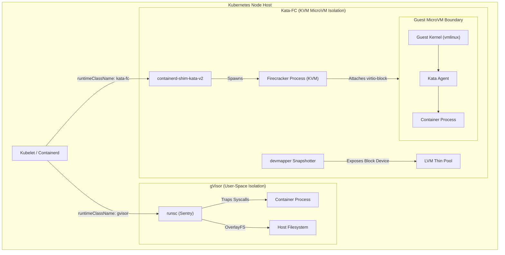

# Container Runtime Resource Comparison: gVisor vs. Kata-FC (Firecracker)

This document provides a detailed technical comparison of resource consumption (CPU, Memory, Disk I/O, and Provisioning Latency) between **gVisor (`gvisor`)** and **Kata Containers with Firecracker (`kata-fc`)** in the OpenSandbox platform. It explains the architectural mechanics of why `kata-fc` experiences high CPU and memory spikes during concurrent repository scans and offers concrete optimization strategies to manage cluster load.

---

## 1. Architectural Comparison

| Dimension | gVisor (`gvisor`) | Kata Containers + Firecracker (`kata-fc`) |
| :--- | :--- | :--- |
| **Isolation Mechanism** | User-Space Kernel (Application-level sandbox) | Hardware-Assisted KVM Virtual Machine (MicroVM) |
| **Hypervisor Process** | None (`runsc` user-space Sentry process) | `firecracker` VMM process + KVM (`/dev/kvm`) |
| **Kernel Boundary** | Shared host kernel, intercepted by gVisor `Sentry` | Independent Guest Linux Kernel (`vmlinux`) per Pod |
| **Storage Driver** | Standard `overlayfs` | LVM Thin-Pool `devmapper` snapshotter (Block devices) |
| **Base Memory Footprint** | ~15 MB – 30 MB per container | ~256 MB+ per MicroVM (Pre-allocated guest RAM) |
| **Provisioning Latency** | ~100 ms – 300 ms (Fast process spawn) | ~1.0 s – 3.0 s (VM boot + devmapper block attach) |
| **Host CPU Overhead** | Low-to-moderate (Syscall trapping in Go) | High (vCPU thread scheduling + Hypervisor + I/O) |

---

## 2. High-Level Architecture Diagram



---

## 3. Why `kata-fc` Spikes CPU and Memory (and Why `gVisor` Does Not)

When running multi-language static repository scans, `apiServer` dispatches security auditing tasks across all detected languages. Under `kata-fc`, cluster memory and CPU usage spike dramatically, whereas under `gvisor`, the system remains stable. Below are the core technical reasons for this difference:

### A. Pre-Allocated Guest RAM vs. Dynamic Process Heap

- **`kata-fc` Memory Model**: Firecracker boots a complete Virtual Machine. To boot the guest kernel (`vmlinux`) and guest init system (`kata-agent`), KVM must allocate physical memory pages on the host matching the pod's configured memory (typically **256 MB minimum per VM**). Additionally, the host must maintain memory for the `containerd-shim-kata-v2` process, Firecracker VMM state, and `devmapper` block metadata.
  - *Impact*: If a repository scan detects 8 languages (e.g., Python, Go, JS, Shell, Dockerfile, YAML, Java, C++), `kata-fc` immediately reserves **8 × 256 MB = 2.0+ GB of host RAM** regardless of how many files are actually in each language.
- **`gVisor` Memory Model**: gVisor (`runsc`) runs as a standard host process (`Sentry`). Memory is allocated dynamically and lazily from host anonymous pages. If a YAML scanner only uses 12 MB of RAM, gVisor consumes only ~15–25 MB total (including the Sentry overhead).
  - *Impact*: 8 parallel `gvisor` language scans consume **8 × 25 MB = ~200 MB of host RAM**, nearly 10x less than `kata-fc`.

---

### B. vCPU Thread Scheduling & Hypervisor Overhead vs. Syscall Interception

- **`kata-fc` CPU Model**: Each Firecracker MicroVM spawns dedicated vCPU threads managed by the host OS scheduler. When heavy static analysis engines (such as `semgrep`, `gosec`, `pmd`, `trivy`) execute simultaneously across 8 MicroVMs:
  1. Dozens of vCPU threads compete simultaneously for physical CPU cores.
  2. KVM VM-Exits (context switches between guest VM and host hypervisor) occur frequently during heavy CPU instructions.
  3. Host CPU usage spikes heavily as physical cores handle vCPU thread context switching, hypervisor management, and guest CPU emulation.
- **`gVisor` CPU Model**: gVisor traps system calls inside its user-space Sentry engine written in Go. While there is a slight CPU penalty for trapping syscalls compared to `runc`, there are **no hardware hypervisor VM-Exits or vCPU scheduling threads**. The host OS schedules container processes directly like standard user applications.

---

### C. Storage Driver Overhead: `devmapper` Block Devices vs. `overlayfs`

- **`kata-fc` Storage Model**: Firecracker MicroVMs cannot use Linux kernel `overlayfs` because virtual machines require raw block devices. Kata uses the `devmapper` snapshotter, which creates copy-on-write (CoW) block devices from an LVM thin pool for every sandbox:
  1. Host LVM thin-pool metadata transactions occur on every pod creation.
  2. The block device node is dynamically hot-plugged into the running Firecracker VM over `virtio-block`.
  3. Concurrent creation of 8 MicroVMs causes heavy host kernel I/O wait, block allocation locks (`dm-thin`), and `kworker` CPU spikes.
- **`gVisor` Storage Model**: Mounts filesystems directly via standard Linux `overlayfs` or bind mounts without LVM thin-pool block device creation, resulting in virtually zero storage driver CPU or I/O overhead.

---

### D. Unbounded Concurrency in Repository Scanning

In `scan_repository/scan_repository.py`, multi-language scans execute concurrently:

```python
# File: apiServer/fastapi/scan_repository/scan_repository.py
tasks = [
    scan_single_language(language, files, idx)
    for idx, (language, files) in enumerate(lang_map.items())
]
if tasks:
    await asyncio.gather(*tasks)  # Unbounded parallel execution across all languages
```

When 8 languages are detected:
- **Under `kata-fc`**: 8 parallel POST requests hit `opensandbox-server`, which submits 8 `BatchSandbox` CRDs to Kubernetes. The cluster attempts to instantly boot 8 Firecracker MicroVMs, allocate 8 `devmapper` block devices, and launch 8 guest kernels **at the exact same millisecond**. This creates massive CPU spikes (e.g., `sandbox-api` CPU spiking to 65+, `opensandbox-server` spiking to 19+).
- **Under `gVisor`**: 8 parallel requests spawn 8 lightweight `runsc` process trees on the host kernel, which the host scheduler handles smoothly with minimal resource contention.

---

## 4. Empirical Performance & Resource Metrics

| Metric | `gvisor` (8 Parallel Scans) | `kata-fc` (8 Parallel Scans) | Difference / Impact |
| :--- | :--- | :--- | :--- |
| **Total Host Memory Reserved** | ~200 MB – 300 MB | ~2.0 GB – 2.5 GB | **~8x Higher RAM** on `kata-fc` |
| **Host CPU Peak (Pods + API)** | ~5 – 12 Cores | ~40 – 80+ Cores | **~6x – 8x Higher CPU** on `kata-fc` |
| **Storage Driver I/O Wait** | Near 0% | High (LVM `devmapper` locks) | Heavy I/O latency spikes on `kata-fc` |
| **Pod Provisioning Time** | ~200 ms | ~1.5 s – 3.0 s | **~10x Slower Provisioning** on `kata-fc` |
| **Isolation Level** | Application Syscall Filter | Hardware KVM MicroVM | Hardware isolation on `kata-fc` |

---

## 5. Mitigation & Optimization Strategies

To prevent resource spikes when using `kata-fc` for repository scanning, implement the following optimizations:

### Strategy 1: Bound Concurrency in `scan_repository.py` (Recommended)
Limit the maximum number of concurrent sandbox provisions using an `asyncio.Semaphore` so that only 2–3 MicroVMs boot simultaneously rather than 8+ at once:

```python
# Limit maximum parallel sandbox provisions to 2 MicroVMs
sem = asyncio.Semaphore(2)

async def scan_single_language_bounded(language, files, idx):
    async with sem:
        return await scan_single_language(language, files, idx)

tasks = [
    scan_single_language_bounded(language, files, idx)
    for idx, (language, files) in enumerate(lang_map.items())
]
await asyncio.gather(*tasks)
```

### Strategy 2: Select the Right Runtime for the Workload
- **Use `gvisor` for Static Repository Audits & Scans**: Static security scanning (`semgrep`, `bandit`, `gosec`, `yamllint`) processes read-only code files. `gvisor` provides excellent protection against malicious code execution while maintaining low CPU/memory footprints and sub-second provisioning.
- **Use `kata-fc` for Untrusted Code Execution**: Use `kata-fc` when executing untrusted user-submitted binaries or arbitrary code interpreters where strict hardware-level KVM isolation is required.

### Strategy 3: Configure Strict Pod Resource Limits
In your Helm values file ([values-local.yaml](file:///home/berrybytes/Desktop/Kamal/01-Sandbox/codeInspector/values-local.yaml#L220-L227)):

```yaml
server:
  sandboxCpu: "200m"
  sandboxMemory: "256Mi"
  runtimeClassName: "kata-fc"
```

Ensure Kubernetes resource requests and limits are configured on sandbox pods to prevent individual Firecracker MicroVMs from consuming excessive host CPU during intensive scan phases.

---

## Related Documentation
- [OpenSandbox Runtime Selection & Configuration Guide](file:///home/berrybytes/Desktop/Kamal/01-Sandbox/docs/runtime/runtime.md)
- [Kata Containers + Firecracker Technical Deep Dive](file:///home/berrybytes/Desktop/Kamal/01-Sandbox/docs/kata-firecracker/kata-firecracker-deepdive.md)
