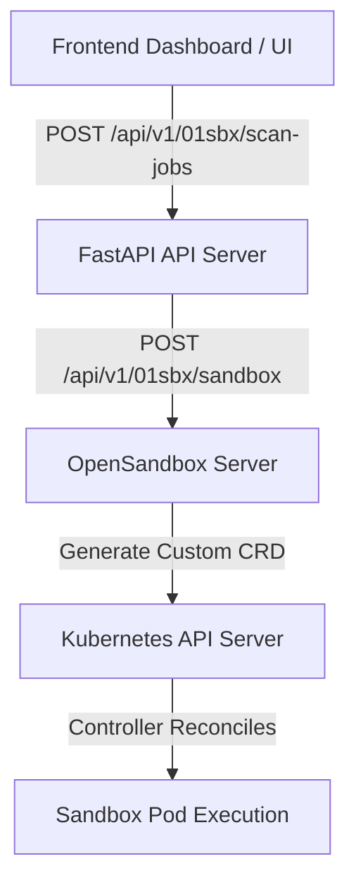

# OpenSandbox Container Runtime Selection & Configuration Guide

This guide documents the architecture, request flow, template merging mechanics, and step-by-step instructions for configuring and verifying container runtimes (e.g., `gvisor`, `kata-fc`) in the OpenSandbox platform.

---

## 1. Architectural Overview

The selection of a container runtime allows users/scanners to execute untrusted code under custom sandbox isolation technologies. The lifecycle of a runtime selection is as follows:



1. **Frontend (UI Selection)**: The developer selects the isolation runtime (`gvisor` or `kata-fc`) in the scan widgets. The selection is packaged into the request `metadata`.
2. **API Server Gateway**: Receives the scan job request, verifies identity (optionally using `ALLOW_MOCK_KEYS` in local dev), and maps the metadata to the downstream sandbox request.
3. **OpenSandbox Server (Backend)**: Reads the runtime metadata from request `extensions`, merges it with a base sandbox pod spec template, and submits a `BatchSandbox` or `AgentSandbox` Custom Resource (CR) to the Kubernetes API.
4. **Kubernetes Cluster Scheduler**: The cluster schedules the Pod inside a MicroVM (Kata/Firecracker) or under user-space kernel isolation (gVisor) depending on the resolved `runtimeClassName` field.

---

## 2. Request Parsing (FastAPI to OpenSandbox Server)

### A. Gateway Mapping (`lifecycle.py`)
When a scan job request arrives at the API server, `apiServer/fastapi/scan_repository/file_scanner.py` forwards the user's runtime choice inside the `metadata` dictionary of the payload. The endpoint `create_scan_job` in `opensandbox-server/docker-build/src/api/lifecycle.py` parses the metadata:

```python
# Extracting runtime choice from metadata
extensions = {}
if metadata:
    if metadata.get("runtime"):
        extensions["runtimeClassName"] = metadata.get("runtime")
    elif metadata.get("runtime_class"):
        extensions["runtimeClassName"] = metadata.get("runtime_class")
    elif metadata.get("secure_runtime"):
        extensions["secure_runtime"] = metadata.get("secure_runtime")
```

This ensures the target runtime class is stored inside `extensions["runtimeClassName"]` within the payload.

### B. Workspace Resolution (`batchsandbox_provider.py`)
Inside `BatchSandboxProvider.create_workload`, the `extensions` dictionary is read. If the user explicitly requested a runtime (e.g., `"runtimeClassName": "kata-fc"`), it overrides the default cluster setting:

```python
# Inject runtimeClassName if secure runtime is configured or overridden in extensions
runtime_class = self.runtime_class
if extensions and "runtimeClassName" in extensions:
    runtime_class = extensions["runtimeClassName"]
elif extensions and "runtime_class" in extensions:
    runtime_class = extensions["runtime_class"]
elif extensions and "secure_runtime" in extensions:
    sr = extensions["secure_runtime"]
    if sr == "gvisor":
        runtime_class = "gvisor"
    elif sr in ("kata-fc", "firecracker"):
        runtime_class = "kata-fc"
    elif sr in ("kata", "kata-qemu"):
        runtime_class = "kata-qemu"

logger.info("[DEBUG RUNTIME] extensions=%s, self.runtime_class=%s, resolved runtime_class=%s", extensions, self.runtime_class, runtime_class)

if runtime_class:
    pod_spec["runtimeClassName"] = runtime_class
```

---

## 3. Template Merging Logic

### A. Base ConfigMap Template (`server.yaml`)
The default pod template is loaded into the `opensandbox-server-config` ConfigMap from the Helm chart (specifically `codeInspector/charts/opensandbox/templates/server.yaml`). This template defaults the runtime class to `gvisor`:

```yaml
  example.batchsandbox-template.yaml: |
    metadata:
      labels:
        app.kubernetes.io/name: opensandbox
    spec:
      replicas: 1
      template:
        metadata:
          labels:
            app: opensandbox-sandbox
        spec:
          runtimeClassName: gvisor
          restartPolicy: Never
          tolerations:
            - operator: "Exists"
          containers:
          - name: main
            image: {{ .Values.server.sandboxImage | quote }}
            ...
```

### B. Deep Merging Algorithm (`template_manager.py`)
To prevent the static ConfigMap defaults from locking the runtime to `gvisor`, the backend uses a recursive dictionary merging utility. When a key exists in both the base template and the dynamic workload request, the dynamic value replaces it:

```python
def _deep_merge(base: Dict[str, Any], override: Dict[str, Any]) -> Dict[str, Any]:
    result = base.copy()
    for key, override_value in override.items():
        if override_value is None:
            continue
        if key not in result:
            result[key] = BaseSandboxTemplateManager._deep_copy(override_value)
        elif isinstance(result[key], dict) and isinstance(override_value, dict):
            result[key] = BaseSandboxTemplateManager._deep_merge(result[key], override_value)
        else:
            # Overwrites lists or primitive values (like string runtimeClassName)
            result[key] = BaseSandboxTemplateManager._deep_copy(override_value)
    return result
```

Because `runtimeClassName` is a primitive string, the `_deep_merge` algorithm overwrites `"gvisor"` with the dynamically resolved value (e.g. `"kata-fc"`) before submitting the `BatchSandbox` resource to the cluster.

---

## 4. Local Development Configurations

### A. Bypassing External Authentication
For local development, verify that mock API keys are permitted. The environment variable `ALLOW_MOCK_KEYS` must be set to `true` inside `/codeInspector/values-local.yaml`:

```yaml
# codeInspector/values-local.yaml (under apiServer.configMap)
apiServer:
  configMap:
    ALLOW_MOCK_KEYS: "true"
```

This allows developers to bypass JWT signature verification on the local API by passing mock tokens starting with `"z1_"`.

---

## 5. Development Build & Deployment Workflow

Whenever changes are made to the `opensandbox-server` backend codebase, use the following sequence to build, push, and upgrade the local cluster:

### Step 1: Build the Docker Image
```bash
# Navigate to the docker-build context
cd opensandbox-server/docker-build

# Build the local development image
docker build -f Dockerfile -t 199012118961/01sandbox-opensandbox-server:dev .
```

### Step 2: Push to Local / Development Registry
```bash
# Push the updated image tag to registry
docker push 199012118961/01sandbox-opensandbox-server:dev
```

### Step 3: Upgrade local Helm Release
```bash
# Apply updated values and ConfigMaps
helm upgrade --install codeinspector ./codeInspector \
  -f ./codeInspector/values-local.yaml \
  -n opensandbox-system \
  --set apiServer.sealedSecrets.enabled=false
```

### Step 4: Force Rollout Restart
```bash
# Restart the backend to pull the latest tag immediately
kubectl rollout restart deployment/opensandbox-server -n opensandbox-system
kubectl rollout status deployment/opensandbox-server -n opensandbox-system
```

---

## 6. Verification & Troubleshooting

To verify that the custom runtime was correctly configured and applied, submit a test scan request and inspect the pod:

```bash
# 1. Trigger the scan job via CLI using a Bearer token
curl -X POST http://10.0.8.9/api/v1/01sbx/scan-jobs?async=true \
  -H "Content-Type: application/json" \
  -H "Authorization: Bearer <TOKEN>" \
  -d '{"files": {"main.py": "print(\"hello\")"}, "metadata": {"runtime": "kata-fc"}}'

# 2. Get the active sandbox pods
kubectl get pods -n opensandbox-system

# 3. Output the yaml schema for the sandbox pod and check the runtimeClassName
kubectl get pod <POD_NAME> -n opensandbox-system -o yaml | grep runtimeClassName
```

**Expected Output:**
```yaml
  runtimeClassName: kata-fc
```

---

## 7. Runtime Resolution Walkthrough (Historical Fix Details)

This section details the historical diagnostic steps, specific code modifications, and integration details that were applied to resolve the default runtime selection behavior.

### A. Root Cause Analysis
1. **Hardcoded Base Template**: The Kubernetes `BatchSandbox` and `AgentSandbox` workloads merge dynamic pod specs with a base template defined in a Helm ConfigMap (`example.batchsandbox-template.yaml`). The template explicitly defines `runtimeClassName: gvisor` as the base default.
2. **Missing Local Deployments**: While the backend server had the capability to parse the frontend metadata and resolve it to the `extensions["runtimeClassName"]` dict, the local RKE2 cluster was running an older, cached Docker image (`199012118961/01sandbox-opensandbox-server:dev`) that did not register/run these recent codebase changes.
3. **Correct Merge Algorithm**: Analysis of the merge utility (`_deep_merge` in `template_manager.py`) confirmed that if `runtimeClassName` is dynamically injected into the `runtime_manifest` specification, it correctly overrides the base template's hardcoded `runtimeClassName: gvisor`.

### B. Changes Applied

#### 1. Instrumentation & Backend Diagnostics
Logging tracepoints were added in `/opensandbox-server/docker-build/src/services/k8s/batchsandbox_provider.py` to print:
- Resolved metadata extensions
- Resolved `runtimeClassName`
- Merged spec payload just before CRD creation

```python
logger.info("[DEBUG RUNTIME] extensions=%s, self.runtime_class=%s, resolved runtime_class=%s", extensions, self.runtime_class, runtime_class)
...
logger.info("[DEBUG RUNTIME] final runtimeClassName=%s", batchsandbox.get("spec", {}).get("template", {}).get("spec", {}).get("runtimeClassName"))
```

#### 2. Local Development Helpers
Updated `/codeInspector/values-local.yaml` to include `ALLOW_MOCK_KEYS: "true"` inside `apiServer.configMap`, which allows for easier token mock bypass during local development.

#### 3. Build & Deploy
Rebuilt and pushed the updated server image, then performed a rollout restart and upgraded the Helm release:
```bash
# Rebuild the Docker image
cd opensandbox-server/docker-build
docker build -f Dockerfile -t 199012118961/01sandbox-opensandbox-server:dev .

# Push to the local repository
docker push 199012118961/01sandbox-opensandbox-server:dev

# Upgrade Helm chart configurations
helm upgrade --install codeinspector ./codeInspector \
  -f ./codeInspector/values-local.yaml \
  -n opensandbox-system \
  --set apiServer.sealedSecrets.enabled=false
```

### C. Verification
Submitted a new scan job payload via API specifying `"runtime": "kata-fc"` inside metadata:

```bash
curl -X POST http://10.0.8.9/api/v1/01sbx/scan-jobs?async=true \
  -H "Content-Type: application/json" \
  -H "Authorization: Bearer <TOKEN>" \
  -d '{"files": {"main.py": "print(\"hello\")"}, "metadata": {"runtime": "kata-fc"}}'
```

#### Server Logs Output
The server logs showed the correct dynamic override being merged:
```text
src.services.k8s.batchsandbox_provider: [DEBUG RUNTIME] extensions={'runtimeClassName': 'kata-fc'}, self.runtime_class=None, resolved runtime_class=kata-fc
src.services.k8s.batchsandbox_provider: [DEBUG RUNTIME] final runtimeClassName=kata-fc
```

#### Kubernetes Pod Spec Verification
Inspecting the newly created pod spec confirms `runtimeClassName` has successfully switched to `kata-fc`:
```yaml
spec:
  restartPolicy: Never
  runtimeClassName: kata-fc
  schedulerName: default-scheduler
```

---

## Related Documentation
- [Container Runtime Resource Comparison: gVisor vs. Kata-FC](file:///home/berrybytes/Desktop/Kamal/01-Sandbox/docs/runtime/gvisor-katafc.md)
- [Kata Containers + Firecracker Technical Deep Dive](file:///home/berrybytes/Desktop/Kamal/01-Sandbox/docs/kata-firecracker/kata-firecracker-deepdive.md)
