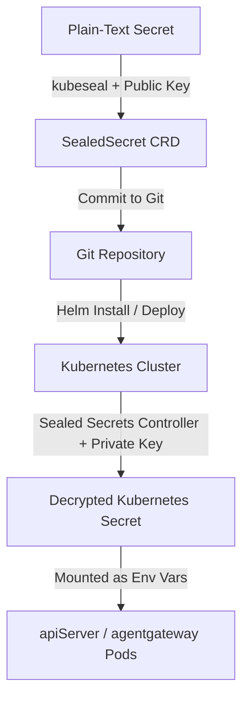

# CodeInspector Sealed Secrets Guide

This guide describes how to manage and deploy sensitive application credentials (secrets) securely using **Bitnami Sealed Secrets** in the `codeInspector` Helm chart.

---

## 1. How it Works



1. **Local Encryption**: You encrypt plain-text credentials locally using the `kubeseal` CLI tool and the cluster controller's **Public Key**.
2. **Safe Version Control**: You copy the encrypted values into `values.yaml` and commit them to Git.
3. **On-Cluster Decryption**: The cluster-side Sealed Secrets controller decrypts the values at deploy-time using its **Private Key**, creating a standard `Secret` that pods mount as environment variables.

---

## 2. CLI Installation (`kubeseal`)

To encrypt secrets locally, you must install the `kubeseal` CLI matching your OS:

### Linux
```bash
KUBESEAL_VERSION="0.26.0"
curl -L "https://github.com/bitnami-labs/sealed-secrets/releases/download/v${KUBESEAL_VERSION}/kubeseal-${KUBESEAL_VERSION}-linux-amd64.tar.gz" -o kubeseal.tar.gz
tar -xvzf kubeseal.tar.gz kubeseal
sudo install -m 0755 kubeseal /usr/local/bin/kubeseal
rm kubeseal.tar.gz kubeseal
```

### macOS (via Homebrew)
```bash
brew install kubeseal
```

---

## 3. Retrieve Cluster Public Certificate

To encrypt values without active access to the cluster's API server, fetch and save the public certificate once:

```bash
kubeseal --fetch-cert \
  --controller-name=sealed-secrets \
  --controller-namespace=kube-system \
  > pub-cert.pem
```

Keep `pub-cert.pem` on your local machine. It does not contain any sensitive information and can be shared.

---

## 4. Encrypting Secrets

To encrypt a raw string (e.g. your SendGrid API key) for `values.yaml`:

```bash
echo -n "SG.your-actual-api-key" | kubeseal \
  --raw \
  --from-file=/dev/stdin \
  --cert pub-cert.pem \
  --name sandbox-api-secret \
  --namespace opensandbox-system
```
*Output:* `AgB3+14A9...`

> [!IMPORTANT]
> The `--name` and `--namespace` flags determine the **encryption scope**. By default (strict mode), the encrypted string can *only* be decrypted if the final `Secret` has that exact name and is placed in that exact namespace.

---

## 5. Helm Configuration (`values.yaml`)

Paste the encrypted output strings into the `sealedSecrets` configuration section in `values.yaml`:

```yaml
sealedSecrets:
  enabled: true
  apiServer:
    encryptedData:
      E2B_API_KEY: "AgB3..."
      JWT_PRIVATE_KEY: "AgB3..."
      JWT_PUBLIC_JWKS: "AgB3..."
      SENDGRID_API_KEY: "AgB3..."
  agentgateway:
    encryptedData:
      signing-key: "AgB3..."
```

When `sealedSecrets.enabled` is `true`, standard plain-text secret templates are omitted, and `SealedSecret` resources are rendered instead.

---

## 6. Disaster Recovery: Backing Up the Cluster Private Key

If your Kubernetes cluster is completely deleted or recreated, the Sealed Secrets controller will automatically generate a **new** private key on startup, rendering your existing `SealedSecrets` in Git unreadable.

To prevent this, you **must** back up the controller's active private key.

### Export the Active Private Key
Retrieve the encryption key secret from the cluster namespace where the controller is running (usually `kube-system` or `opensandbox-system` depending on your deployment):

```bash
kubectl get secret -n kube-system \
  -l sealedsecrets.bitnami.com/sealed-secrets-key=active \
  -o yaml > sealed-secrets-private-key.yaml
```

Keep `sealed-secrets-private-key.yaml` in a secure location (e.g. a password manager or secure vault). **Never commit the private key to Git.**

### Restore the Private Key
When deploying to a new cluster, apply the private key secret **before** installing the Sealed Secrets helm chart:

```bash
kubectl apply -f sealed-secrets-private-key.yaml
```

Once the Sealed Secrets controller starts up, it will locate this secret and reuse the original key pair, allowing all previously encrypted `SealedSecrets` to decrypt successfully.
