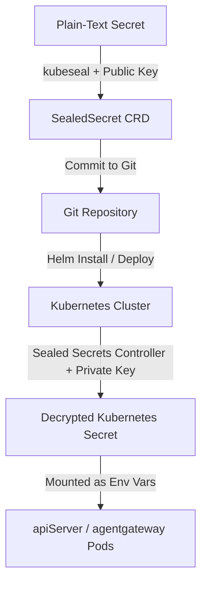

# CodeInspector Sealed Secrets Guide

This guide describes how to manage and deploy sensitive application credentials (secrets) securely using **Bitnami Sealed Secrets** in the `codeInspector` Helm chart.

---

## 1. How it Works



1. **Local Encryption**: You encrypt plain-text credentials locally using the `kubeseal` CLI tool and the cluster controller's **Public Key** (`pub-cert.pem`).
2. **Safe Version Control**: You copy the encrypted values into `values.yaml` and commit them to Git.
3. **On-Cluster Decryption**: The cluster-side Sealed Secrets controller decrypts the values at deploy-time using its **Private Key**, creating a standard `Secret` that pods mount as environment variables.

---

## 2. Issues Encountered & Fixes Applied

During the initial integration of Sealed Secrets, two main issues caused the Helm deployments to fail:

### Issue A: "No matches for kind 'SealedSecret' in version 'bitnami.com/v1alpha1'"
* **Root Cause**: Helm only installs Custom Resource Definitions (CRDs) located in a subchart's `crds/` directory during the **first installation** of a release. Because the release already existed on the cluster, adding the subchart did not register the new `SealedSecret` CRD.
* **Fix**: The `SealedSecret` CRD was applied manually to the cluster via SSH, and a copy of the CRD was placed in the top-level `codeInspector/crds/` folder to ensure it is automatically installed on fresh environments.

### Issue B: "Failed to unseal: no key could decrypt secret" & Deployment Timeout
* **Root Cause 1 (Certificate Mismatch)**: The secrets were originally encrypted using a local cluster's public certificate instead of the certificate from the target production server (`10.0.10.9`).
* **Root Cause 2 (Empty Fields)**: The Sealed Secrets controller tries to decrypt every key present in the `spec.encryptedData` map. If a key is empty (`""`), it fails to decrypt it and halts the decryption of the entire `SealedSecret` resource. Consequently, the standard `Secret` `sandbox-api-secret` is never created, causing the API pods to wait indefinitely and causing the Helm deployment to time out.
* **Fix**:
  1. Updated the `sealedsecret.yaml` template file to conditionally render keys under `encryptedData` only if they contain non-empty values.
  2. Fetched the correct production certificate from the cluster and re-encrypted the populated secrets (`SENDGRID_API_KEY`, `PG_PASSWORD`, and `RABBITMQ_PASSWORD`).

---

## 3. CLI Installation (`kubeseal`)

To encrypt secrets locally, you must install the `kubeseal` CLI matching your OS:

### Linux
```bash
KUBESEAL_VERSION="0.26.0"
curl -L "https://github.com/bitnami-labs/sealed-secrets/releases/download/v${KUBESEAL_VERSION}/kubeseal-${KUBESEAL_VERSION}-linux-amd64.tar.gz" -o kubeseal.tar.gz
tar -xvzf kubeseal.tar.gz kubeseal
sudo install -m 0755 kubeseal /usr/local/bin/kubeseal
rm kubeseal.tar.gz kubeseal
```

### macOS (via Homebrew)
```bash
brew install kubeseal
```

---

## 4. Retrieving the Cluster Public Certificate

To encrypt values without active access to the cluster's API server, fetch the production public certificate from the running controller:

```bash
# Execute this to fetch the certificate from the production server
ssh ktamang@10.0.10.9 "kubeseal --fetch-cert --controller-name=codeinspector-sealed-secrets --controller-namespace=default" > codeInspector/pub-cert.pem
```

*Note: The `pub-cert.pem` file does not contain sensitive details and is safe to commit to Git.*

---

## 5. Step-by-Step: Encrypting and Deploying Secrets

Follow these steps when you need to add or update secrets:

### Step 1: Encrypt the secret locally
Use `kubeseal` with your `pub-cert.pem` certificate. **Ensure you specify the correct `--name` and `--namespace` matching the target deployment.**

```bash
# Encrypt SENDGRID_API_KEY
echo -n "SG.your-sendgrid-api-key" | kubeseal \
  --raw \
  --cert codeInspector/pub-cert.pem \
  --name sandbox-api-secret \
  --namespace opensandbox-system
```

*Example Output:* `AgBRhr1QxjZx/aceOMphA...`

### Step 2: Update `codeInspector/values.yaml`
Paste the generated output string into the `apiServer.sealedSecrets.encryptedData` map:

```yaml
apiServer:
  sealedSecrets:
    enabled: true
    encryptedData:
      E2B_API_KEY: ""
      JWT_PRIVATE_KEY: ""
      JWT_PUBLIC_JWKS: ""
      SENDGRID_API_KEY: "AgB3..."  # <-- Paste here
      PG_PASSWORD: "AgB3..."
      REDIS_PASSWORD: ""
      RABBITMQ_PASSWORD: "AgB3..."
```

*Note: Unconfigured keys should be left as `""`. They will be automatically omitted from the deployment manifest to prevent decryption errors.*

### Step 3: Verify templates render correctly
Run a Helm template check locally:
```bash
helm template ./codeInspector --values ./codeInspector/values.yaml
```

### Step 4: Commit and Push to Git
```bash
git add .
git commit -m "chore: update encrypted secrets in values.yaml"
git push origin <your-branch>
```

### Step 5: Deploy to the Cluster
Pull the latest changes on the production node and upgrade the release:
```bash
# Pull on remote server
ssh ktamang@10.0.10.9 "cd 01-Sandbox && git pull"

# Perform Helm Upgrade
ssh ktamang@10.0.10.9 "cd 01-Sandbox && helm upgrade --install codeinspector ./codeInspector -n default --timeout 5m0s --create-namespace --atomic --values ./codeInspector/values.yaml"
```

---

## 6. Disaster Recovery: Backing Up the Cluster Private Key

If your Kubernetes cluster is completely deleted or recreated, the Sealed Secrets controller will automatically generate a **new** private key on startup, rendering your existing `SealedSecrets` in Git unreadable.

To prevent this, you **must** back up the controller's active private key.

### Export the Active Private Key
Retrieve the encryption key secret from the namespace where the controller is running (`default`):

```bash
kubectl get secret -n default \
  -l sealedsecrets.bitnami.com/sealed-secrets-key=active \
  -o yaml > sealed-secrets-private-key.yaml
```

Keep `sealed-secrets-private-key.yaml` in a secure location (e.g. a password manager or secure vault). **Never commit the private key to Git.**

### Restore the Private Key
When deploying to a new cluster, apply the private key secret **before** installing the Sealed Secrets helm chart:

```bash
kubectl apply -f sealed-secrets-private-key.yaml
```
