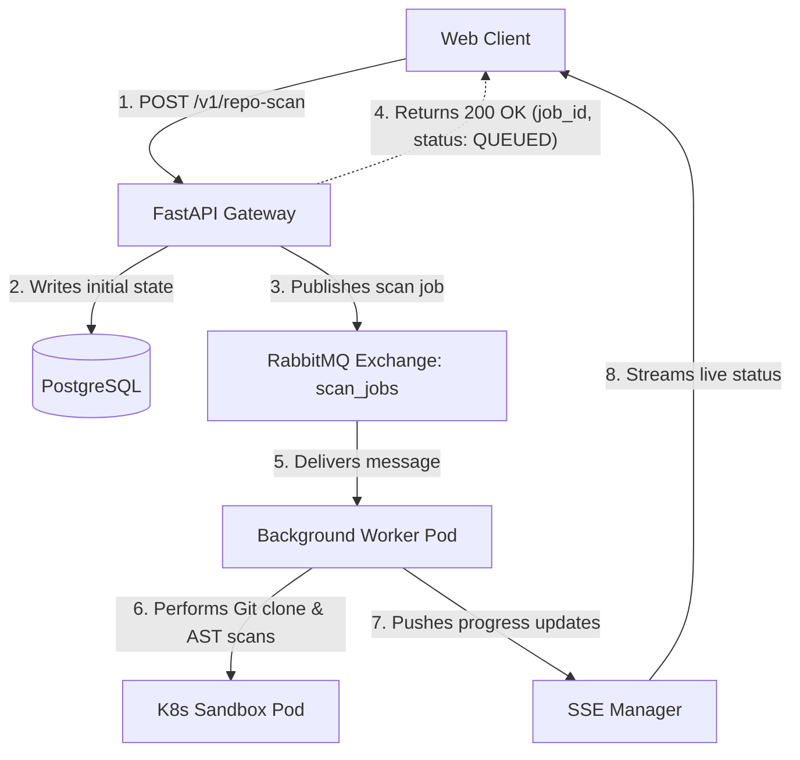
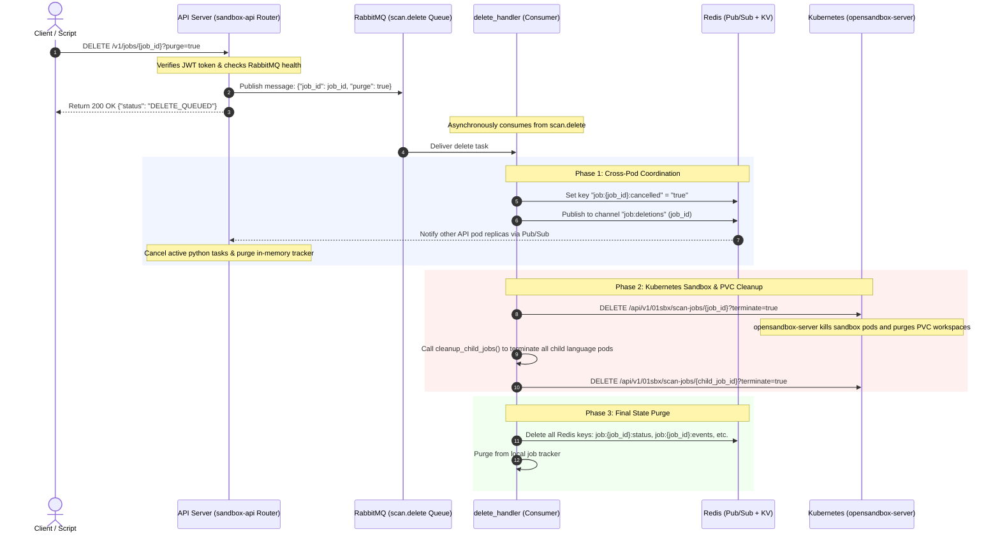

# Technical Presentation Guide: Platform Engineering & Architectural Milestones
**Date:** June 26, 2026
**Project:** CodeInspector & OpenSandbox Microservices Platform

---

## Executive Summary

This guide outlines the six foundational pillars implemented to elevate the **CodeInspector & OpenSandbox** platforms to a highly secure, observable, fault-tolerant, and horizontally scalable microservices architecture.

```
┌─────────────────────────────────────────────────────────────────────────┐
│                        PLATFORM CORE SYNERGY                            │
├───────────────────┬───────────────────┬─────────────────────────────────┤
│    SECURITY       │   OBSERVABILITY   │          SCALABILITY            │
├───────────────────┼───────────────────┼─────────────────────────────────┤
│  • Sealed Secrets │ • Prometheus      │ • RabbitMQ Async Execution      │
│  • Zero-Db Private│   Telemetry       │ • RabbitMQ Async Deletion       │
│    Repo Scanning  │ • Ingress Policies│ • Redis Pub/Sub Coordination    │
│                   │                   │ • Durable Expiry Notification   │
└───────────────────┴───────────────────┴─────────────────────────────────┘
```

---

## 1. Asynchronous Scan Execution Pipeline (RabbitMQ & Server-Sent Events)

### 💡 The Problem
Scanning a repository involves resource-intensive tasks: cloning Git repositories, provisioning isolated containers, running AST parsers, and processing static analysis. If these operations run synchronously within the web request context, HTTP clients will time out, server threads will be exhausted, and the gateway will crash under load.

### ⚙️ How It Works (The Core Principle)
We built an event-driven, decoupled scan execution pipeline. When a user requests a repository scan, the request is validated, enqueued onto a durable message broker, and processed asynchronously by background worker pods. Real-time feedback is streamed back to the client via Server-Sent Events (SSE).



### 👥 Roles in the Pipeline: Who does what?

To clarify the decoupled nature of the queue architecture, here are the defined roles:

* **The Publisher (FastAPI Gateway Router):**
  * **File Reference:** [`apiServer/fastapi/scan_repository/scan_repository.py`](file:///home/berrybytes/Desktop/Kamal/01-Sandbox/apiServer/fastapi/scan_repository/scan_repository.py#L599) (`submit_repo_scan()`)
  * **Role:** Acts as the **Sender**. When a client triggers `POST /v1/repo-scan`, this router generates the `job_id`, builds the JSON payload, and publishes it to the exchange.
* **The Message Broker (RabbitMQ):**
  * **Role:** Acts as the **Post Office**. It does not run or parse the scan. It safely stores the task payload in the `scan.repo` queue, routes it based on binding keys, and handles delivery limits (prefetch QoS) and failures (retries/DLQ).
* **The Consumer (Background Worker Process):**
  * **File Reference:** [`apiServer/fastapi/core/queue/consumer.py`](file:///home/berrybytes/Desktop/Kamal/01-Sandbox/apiServer/fastapi/core/queue/consumer.py#L95) (`on_message()`)
  * **Role:** Acts as the **Recipient**. A background loop in the `sandbox-api` service pulls the task from RabbitMQ, calls `_run_scan_pipeline` to run the scans inside sandbox pods, and sends a final acknowledgment (`msg.ack()`) back to the broker once complete.

---

### 🛠️ Detailed Scan Flow for GitHub Repositories
Here is the step-by-step breakdown of how a repository (such as a private or public GitHub repo) is scanned asynchronously:

1. **Ingestion & Validation:**
   * The client submits a `POST /v1/repo-scan` request with the target `repo_url` (and optional credentials like `git_token` or `ssh_key`).
   * The API router parses the URL to extract the `owner` and `repo` names.
   * A unique UUID `job_id` is generated, and a job record is created in the global `job_tracker`.

2. **Durable RabbitMQ Queuing & Resilience Fallback:**
   * The gateway checks broker availability using `is_available()`.
   * **RabbitMQ Online (Primary):** The gateway publishes a message to the `scan.repo` queue containing the job metadata and ephemeral credentials. It immediately returns a `200 OK` response with `status: "QUEUED"` in less than 1 millisecond.
   * **RabbitMQ Offline (Resilient Fallback):** If RabbitMQ is down, the system automatically falls back to registering the job as a FastAPI local `BackgroundTasks` thread, ensuring the system remains functional.

3. **Background Consumption & Execution:**
   * A background consumer worker pod pulls the message from the `scan.repo` queue.
   * The worker first triggers **repository accessibility prechecks** using `validate_github_repo()`.
   * The worker invokes the remote `opensandbox-server` to provision a clean, isolated **workspace directory (sandbox)** with a Persistent Volume Claim (PVC).

4. **Secure In-Memory Cloning:**
   * The worker runs `clone_repo()`. If a private key or token is supplied, it writes the SSH key to a temporary file (restricted with `0600` permissions) or rewrites the git target URL with the PAT token in-memory.
   * It performs a shallow git clone (`--depth=1`) of the GitHub repository directly into the sandbox workspace and deletes all temporary credential files immediately in an unconditional `finally` block.

5. **Parallel Component Scanning:**
   * The worker detects the languages present in the repository.
   * Using Python's `asyncio.gather`, it concurrently triggers language-specific AST tools (e.g. bandit, semgrep, eslint) in separate code-interpreter sandbox pods, processing scans in parallel rather than sequentially.

6. **Progress Streaming (SSE):**
   * Throughout the scan, the worker updates the `job_tracker` with progress increments (`CLONING`, `SCANNING_PYTHON`, `COMPLETED`).
   * The frontend client subscribes to the `/v1/repo-scan/{job_id}/status` endpoint, which streams these progress events live.

---

## 2. Asynchronous Scan Deletion & Cancellation Pipeline

### 💡 The Problem
In a clustered environment, terminating running scan jobs synchronously is slow and unreliable. Directly invoking Kubernetes APIs from HTTP threads blocks the event loop. Furthermore, in a horizontally scaled deployment with multiple replica pods, a cancel request sent to one pod cannot easily stop a scanning thread running on a different pod.

### ⚙️ How It Works (The Core Principle)
We decoupled deletion by routing requests through a durable **RabbitMQ** queue and utilizing **Redis Pub/Sub** for cross-pod coordination and task cancellation.



### ⚙️ End-to-End Deletion Working Principle (Flow)

Here is the complete, end-to-end working principle of the scan job deletion pipeline, detailing how the frontend UI, API gateway, RabbitMQ, Redis, and Kubernetes collaborate to perform a clean deletion:

* **Step 1: The User Interface (Client-Side Eviction)**
  * The user clicks the **Delete** button next to a scan job on the frontend dashboard.
  * The frontend immediately updates optimistically:
    * It deletes the job ID from the browser's local cache (`localStorage` key `unified_jobs_v1`).
    * It immediately closes any open EventSource (SSE) streaming connections for that job ID.
    * The UI re-renders, and the job disappears from the dashboard view instantly.
  * The frontend then sends a `DELETE /v1/jobs/{job_id}?purge=true` HTTP request to the API Gateway.
* **Step 2: The Gateway Router (Decoupling)**
  * The FastAPI Gateway router (`apiServer/fastapi/scan_jobs/router.py`) receives the request.
  * It validates the user's authorization token and checks if the RabbitMQ broker is reachable.
  * It publishes a JSON delete task `{"job_id": job_id, "purge": true}` to the RabbitMQ exchange under the routing key `scan.delete`.
  * The router immediately returns a `200 OK` response with `{"status": "DELETE_QUEUED"}` to the client (taking less than 1 millisecond, freeing the HTTP thread).
* **Step 3: RabbitMQ Queue & Consumer Delivery**
  * The delete message sits in the durable RabbitMQ queue (`scan.delete`).
  * The background worker consumer loop (running on an API replica pod) receives the message and triggers `handle_delete_job()` in `delete_handler.py`.
* **Step 4: Redis Cross-Pod Coordination (Phase 1)**
  * To stop any active Python scan task executing anywhere in the cluster, the worker utilizes Redis:
    * **The Whiteboard (Redis Key-Value):** The worker sets a key in Redis (`job:{job_id}:cancelled` = `"true"`). If a replica pod is about to start this job, it checks this key first and aborts immediately.
    * **The Megaphone (Redis Pub/Sub):** The worker publishes the `job_id` to the `job:deletions` channel. All replica pods listen to this channel; the pod currently running the scan hears this broadcast, locates its active Python asyncio Task for that job ID, and cancels it (`task.cancel()`) immediately.
* **Step 5: Kubernetes Pod & Workspace Cleanup (Phase 2)**
  * Once the running Python code is stopped, the consumer worker cleans up the physical cluster resources:
    * **Primary Pod & Workspace Cleanup:**
      * The worker makes an HTTP DELETE call to the internal OpenSandbox Server (`opensandbox-server`).
      * The `opensandbox-server` talks to the Kubernetes API server to delete all sandbox containers and persistent workspace volumes (PVC) associated with that `job_id`.
    * **Child Pod Cleanup:**
      * The worker runs `cleanup_child_jobs()` which scans the job metadata to find all child language scan IDs.
      * It fires concurrent HTTP DELETE calls to the `opensandbox-server` to terminate all spawned child language sandbox pods in parallel.
* **Step 6: Final Memory State Purging (Phase 3)**
  * If `purge=true` is requested, the worker calls the local `job_tracker` to erase all in-memory events, logs, and status records for that `job_id`.
  * The worker deletes the job status keys from the Redis Key-Value cache database.
  * The consumer sends a success acknowledgment (`msg.ack()`) back to RabbitMQ to remove the deletion message from the queue, completing the lifecycle.

---

### 🏗️ Two-Tier Job Hierarchy: Parent & Child Artifacts

A single repo scan spawns a **two-tier hierarchy** of jobs. Understanding this is essential to understanding why deletion must cascade.

| Layer | Job ID | Where It Lives | Artifact on PVC |
|---|---|---|---|
| **Parent** | UUID assigned at `POST /v1/repo-scan` | `app_state.active_tasks` + Redis | Cloned repo under `reposcanner_<rand>/repo/` (local temp dir) |
| **Child** (one per language) | UUID assigned inside `_submit_scan_job()` | opensandbox-server `/scan-jobs` pipeline | Language workspace + scan report in opensandbox pod PVC |

**Child job tracking — three sources (merged at deletion time):**

- `active_child_jobs_by_parent[parent_id]` — in-memory set, tracks only in-flight children (discarded when a child scan completes).
- `all_child_jobs_by_parent[parent_id]` — in-memory set, retains all children ever registered, including completed ones.
- Redis `SMEMBERS job:{parent_id}:child_jobs` — persisted for 24 hours, the critical source for multi-pod deployments where the parent ran on a different replica than the one processing the delete.

At deletion time, `perform_job_deletion()` (`core/delete_job.py`) merges all three into a single set and issues an individual `DELETE /scan-jobs/{child_id}?terminate=true` to the `opensandbox-server` for every child — regardless of whether the child is still running or already completed. This guarantees every language-specific workspace is wiped from the PVC.

---

### 🐛 Bug Fix: Ghost Job After Cancel → Delete

#### The Problem

When a user **cancelled** a running scan and then **deleted** the same cancelled job via the trash icon, the job reappeared in the UI within 5 seconds. Two bugs were conspiring:

**Bug 1 — Backend race window (primary cause)**

The original `cancel_or_delete_job` HTTP handler only published a message to RabbitMQ and returned immediately. The actual Redis key deletion happened asynchronously inside the queue worker — potentially seconds later. During that window, the UI's 5-second poll (`GET /v1/repo-scan/jobs`) still found `job:{id}:status = "CANCELLED"` in Redis and returned the job to the frontend, causing `syncFromServer` to re-insert it, overriding the local removal.

**Bug 2 — Frontend misclassified CANCELLED as active**

The mount-time SSE reconnect logic and both `syncFromServer` branches only treated `["DONE", "ERROR"]` as terminal states. A `CANCELLED` job was treated as still-active, causing the frontend to attempt re-subscribing to a dead SSE stream — and meaning a cancelled job loaded from `localStorage` on page refresh would unnecessarily reconnect.

#### The Fix

**Fix 1 — Eager synchronous Redis purge in the HTTP handler** (`scan_jobs/router.py`)

When `purge=true`, the router now deletes all Redis keys and the in-memory tracker entry **synchronously before** publishing to the queue or returning the response:

```python
if purge:
    state.job_tracker.delete_job(job_id)           # remove from _jobs dict
    state.redis_client.delete(                     # wipe all 6 Redis keys at once
        f"job:{job_id}:status",   f"job:{job_id}:metadata",
        f"job:{job_id}:events",   f"job:{job_id}:result",
        f"job:{job_id}:cancelled", f"job:{job_id}:child_jobs",
    )
# Only then queue the RabbitMQ message for async PVC teardown
await publish("scan.delete", {"job_id": job_id, "purge": purge})
```

The RabbitMQ worker still runs to tear down PVC/sandbox artifacts — but it no longer races with the UI poll for the Redis job record. The next 5-second sync returns zero results for that job.

**Fix 2 — CANCELLED added to terminal-state sets in the frontend** (`hooks/useJobStore.ts`)

Added `"CANCELLED"` to all three terminal-status exclusion checks so the frontend treats cancelled jobs the same way it treats completed ones:

```typescript
// Prevents reconnecting SSE streams for cancelled jobs on page refresh
const activeJobs = jobStore.getAll(jobType).filter(
  j => !["DONE", "ERROR", "CANCELLED"].includes(j.status)
);

// Prevents opening a new SSE stream for any cancelled job discovered via sync
if (!["DONE", "ERROR", "CANCELLED"].includes(sj.status) && !esRefs.current[sj.job_id]) {
  openStream(sj.job_id, sj.eventIndex ?? 0);
}
```

#### Updated Cancel vs. Delete Behaviour

| Behaviour | Cancel (`purge=false`) | Delete (`purge=true`) |
|---|---|---|
| Redis cancelled flag set | ✅ (24h TTL) | ✅ |
| Redis Pub/Sub channel | `job:cancellations` | `job:deletions` |
| asyncio task cancelled | ✅ | ✅ |
| Status pushed to CANCELLED | ✅ | ❌ (records wiped) |
| PVC artifacts removed | ✅ (parent + all children) | ✅ (parent + all children) |
| Redis keys deleted immediately | ❌ (natural TTL expiry) | ✅ **in HTTP handler, before queue** |
| In-memory tracker cleared immediately | ❌ | ✅ **in HTTP handler, before queue** |
| Child tracking maps cleared | ❌ | ✅ (async, in queue worker) |
| Job visible in UI after action | ✅ (shown as CANCELLED) | ❌ (gone immediately) |

---

### 📢 Simple Analogy: The "Megaphone" & "Whiteboard"
* **RabbitMQ Whispers to One Guard:** RabbitMQ is a dispatcher who whispers to **Guard A** (Pod A) only: *"Cancel and delete Job #123."* But **Guard B** (Pod B) is the one actually running it.
* **The Megaphone (Redis Pub/Sub):** Guard A picks up a **megaphone (Redis Pub/Sub)** and shouts: **"Attention all guards! Cancel and delete Job #123!"** Guard B hears this shout and terminates the scan immediately.
* **The Whiteboard (Redis Key-Value):** Simultaneously, Guard A writes *"Job #123 is cancelled"* on a **central whiteboard (Redis Key-Value store)**. If any guard is about to start Job #123 in the future, they check the whiteboard first and abort.

### 📁 Key Code References
* **Publisher & Eager Purge:** [`scan_jobs/router.py`](file:///home/berrybytes/Desktop/Kamal/01-Sandbox/apiServer/fastapi/scan_jobs/router.py) → `cancel_or_delete_job()` — on `purge=true`, immediately wipes Redis keys and in-memory tracker before queuing deletion via RabbitMQ.
* **Consumer Handler:** [`core/queue/delete_handler.py`](file:///home/berrybytes/Desktop/Kamal/01-Sandbox/apiServer/fastapi/core/queue/delete_handler.py) → `handle_delete_job()` — coordinates Redis cancellation, schedules Kubernetes teardown via `asyncio.to_thread`, and cleans up child language sandbox pods.
* **Core Deletion Orchestrator:** [`core/delete_job.py`](file:///home/berrybytes/Desktop/Kamal/01-Sandbox/apiServer/fastapi/core/delete_job.py) → `perform_job_deletion()` — merges child job IDs from in-memory maps and Redis, broadcasts cancellation, and cascades PVC deletion to all children.
* **Cross-Pod Thread Listener:** [`core/queue/cancellation.py`](file:///home/berrybytes/Desktop/Kamal/01-Sandbox/apiServer/fastapi/core/queue/cancellation.py) → `setup_cancellation_listener()` & `cancel_active_task()` — subscribes to channels, receives the broadcasted `job_id`, and stops the local asyncio Task.
* **Child Pod Cleanup:** [`scan_repository/file_scanner.py`](file:///home/berrybytes/Desktop/Kamal/01-Sandbox/apiServer/fastapi/scan_repository/file_scanner.py) → `cleanup_child_jobs()` — collects all spawned child language scan job IDs and terminates them concurrently on Kubernetes.
* **Frontend Job Store:** [`z1sandbox-website/src/hooks/useJobStore.ts`](file:///home/berrybytes/Desktop/Kamal/01-Sandbox/z1sandbox-website/src/hooks/useJobStore.ts) → `removeJob()` calls `purge=true`; `CANCELLED` is now treated as a terminal state alongside `DONE` and `ERROR`.

---


## 3. Prometheus Telemetry & Observability Engine

### 💡 The Problem
A production gateway requires deep operational visibility. Administrators need to track HTTP latencies, background worker queue congestion, active database connections, sandbox allocations, and authentication failures without degrading API performance.

### ⚙️ How It Works (The Core Principle)
We built a dual-registry Prometheus telemetry collector exposed at `/metrics` that combines **Push-Style Accumulation** (counters and histograms updated inline with requests) and **Pull-Style Dynamic Instrumentation** (gauges computed asynchronously right at scrape time).

```
[Prometheus Server]
      │ (Pulls every 15s)
      ▼
┌────────────────────────────────────────────────────────┐
│ /metrics Endpoint (FastAPI)                            │
├───────────────────────────┬────────────────────────────┤
│  In-Memory Accumulators   │   Dynamic Scrape Logic     │
├───────────────────────────┼────────────────────────────┤
│ • http_requests_total     │ • queue_depth_jobs         │
│ • auth_failures_total     │   (Ephemerally queries     │
│ • db_connections_active   │    RabbitMQ via passive    │
│ • repo_clone_duration     │    declarations)           │
└───────────────────────────┴────────────────────────────┘
```

### 🛠️ Key Architectural Details
* **Database Connection Tracking:** Utilizes a proxy wrapper pattern (`InstrumentedConnection` in `core/app_state.py`). On open, `db_connections_active.inc()` is called; on close, it decrements, preventing connection leaks.
* **Authentication Failure Classification (`auth_failures_total`):** Categorizes rejects into highly specific error labels (e.g., `expired_key`, `revoked_key`, `deactivated_key`, `missing_kid`, `identity_mismatch`), simplifying security auditing.
* **Live RabbitMQ Queue Monitoring:** Rather than maintaining active counts, the `/metrics` endpoint dynamically connects to RabbitMQ at scrape-time, issues a non-destructive **passive declaration** (`declare_queue(passive=True)`) against active queues, and extracts their exact queue depth on the fly.
* **Gatekeeper Ingress Security:** To prevent leaking internal infrastructure telemetry, `/metrics`, Grafana, and Prometheus routes are protected via custom `AgentgatewayPolicy` rules, restricting access to localhost, the VPN subnet (`10.x.x.x`), and approved administrator IPs defined in `values.yaml`.

---

## 4. Secure Private Repository Scanning (Zero-Db Persistence)

### 💡 The Problem
Scanning private Git repositories (GitHub, GitLab, Bitbucket) requires sensitive credentials (Personal Access Tokens or SSH Private Keys). Storing these credentials in a database creates a massive security vulnerability and increases compliance burdens.

### ⚙️ How It Works (The Core Principle)
We designed a **Zero-Persistence Credential Pipeline**. Credentials are never written to disk or Postgres. Instead, they flow ephemerally in-memory through the request payload, propagate inside the encrypted RabbitMQ message queue, are used in-memory / in temporary files during cloning, and are immediately discarded.

```
Request Payload (PAT / SSH Key) ──► FastAPI Request (RAM) ──► RabbitMQ (Encrypted Queue)
                                                                       │
┌─────────────────────────────── Temporary Files (RAM) ◄───────────────┘
│  • HTTPS Token rewrite
│  • Temp 0600 SSH key file
▼
[git clone inside Sandbox] ──► Immediate finally block cleanup (Zero Trace)
```

### 🛠️ Key Architectural Details
* **Modularization (`private_clone.py`):** Encapsulates all private credential handling, validated URL parsing, and authenticated git command execution.
* **Universal Git Validation:** Uses `git ls-remote` to validate credentials and repository accessibility. This bypasses the need to maintain provider-specific REST APIs (OAuth/GitHub APIs) and works universally for GitHub, GitLab, and Bitbucket.
* **Subprocess Log Scrubbing:** Implements string sanitizers that scrub raw PAT tokens or SSH keys from all subprocess standard outputs, standard errors, and exception tracebacks before logging to stdout or returning errors to the user.
* **Cloning Teardown:** Writes SSH private keys to ephemeral `0600` permission files, configures `GIT_SSH_COMMAND`, executes the clone directly into the isolated sandbox, and guarantees the deletion of the credential file via an unconditional `finally` execution block.

---

## 5. Asynchronous API Key Expiry Warning Pipeline

### 💡 The Problem
If a developer's API key expires without warning, automated CI/CD pipelines and scanning integrations fail suddenly, locking the team out of operations. We need a fault-tolerant, non-blocking warning system.

### ⚙️ How It Works (The Core Principle)
A lightweight background service continuously scans the database for expiring keys, publishes warnings to a durable RabbitMQ queue, and worker consumers dispatch warning emails via the SendGrid Web API with resilient retry backoffs.

```
┌──────────────────────────────────────┐
│  Background Expiry Checker (10s)     │
└──────────────────┬───────────────────┘
                   │ (Query DB for expiring keys)
                   ▼
┌──────────────────────────────────────┐
│  RabbitMQ Durable Exchange           │
└──────────────────┬───────────────────┘
                   │ (Publish persistent warning message)
                   ▼
┌──────────────────────────────────────┐
│  notification.email Queue            │
└──────────────────┬───────────────────┘
                   │ (Explicit Worker Acknowledgment)
                   ▼
┌──────────────────────────────────────┐
│  Worker Consumer -> SendGrid Web API │
└──────────────────┬───────────────────┘
                   ├───────────────────┐
         (Success) │         (Failure) │ (Retry Backoff: 5s -> 30s -> 2m)
                   ▼                   ▼
               [msg.ack()]    [Dead Letter Queue (DLQ)]
```

### 🛠️ Key Architectural Details
* **Resolved User Mapping:** During key generation, the API router extracts the user's email dynamically from Auth0 JWT claims (namespaced or standard) and stores it directly alongside the key in the database.
* **Lead Time Notification Logic:** Implements smart interval logic to prevent spamming users:
  * Key TTL ≤ 10 mins: Warns at **≤ 3 mins** remaining.
  * 10 mins < TTL ≤ 1 hr: Warns at **≤ 10 mins** remaining.
  * 1 hr < TTL ≤ 24 hrs: Warns at **≤ 1 hr** remaining.
  * 24 hrs < TTL ≤ 7 days: Warns at **≤ 12 hrs** remaining.
  * TTL > 7 days: Warns at **≤ 24 hrs** remaining.
* **At-Least-Once Delivery Guarantees:**
  * Messages are published as `PERSISTENT` so they survive RabbitMQ broker crashes.
  * Workers use **explicit acknowledgments (`msg.ack()`)**. If SendGrid is throttled or times out, the message is routed through exponential backoff delay queues. If all retries fail, it lands in a Dead Letter Queue (DLQ) for manual administrator recovery, ensuring no notifications are silently dropped.

---

## 6. Kubernetes GitOps Secrets Management (Sealed Secrets)

### 💡 The Problem
In a GitOps continuous deployment pipeline, all Kubernetes manifests are stored in a public or private Git repository. Committing plain-text `Secrets` (containing database passwords, SendGrid API keys, and private keys) to Git is a critical security violation.

### ⚙️ How It Works (The Core Principle)
We integrated **Bitnami Sealed Secrets**. Sensitive credentials are encrypted locally using the target cluster's public certificate. The resulting `SealedSecret` manifest is completely safe to commit to Git. Only the Sealed Secrets controller running inside the target cluster holds the private key required to decrypt it back into a standard Kubernetes `Secret`.

```
[Plain-Text Secret]
       │
       │ (Encrypted locally via kubeseal + pub-cert.pem)
       ▼
[SealedSecret Manifest] ──► (Committed safely to Git) ──► [K8s Target Cluster]
                                                                  │
┌─────────────────────────────────────────────────────────────────┘
│ (Decrypted on-cluster via Sealed Secrets Controller Private Key)
▼
[Standard Kubernetes Secret] ──► Mounted as Env Vars in Pods (API / Workers)
```

### 🛠️ Key Architectural Details & Resolutions
* **CRD Helm Hook Fix:** Helm by default does not upgrade Custom Resource Definitions (CRDs) during updates. We manually registered the `SealedSecret` CRD on the cluster and embedded it inside the `codeInspector/crds/` directory to guarantee seamless, out-of-the-box installations in new environments.
* **Empty Field Decryption Failures Resolved:** The Sealed Secrets controller fails and halts decryption if it encounters empty strings in `spec.encryptedData`. We refactored the Helm template to conditionally render keys only if they contain non-empty encrypted strings, preventing deployment timeouts.
* **Disaster Recovery Strategy:** Established a strict backup routine for the controller's active private key (`sealedsecrets.bitnami.com/sealed-secrets-key=active`). This key is backed up to a secure vault outside of Git. If the cluster is destroyed, restoring this key allows the new cluster to immediately decrypt the existing `SealedSecrets` committed in Git without re-encrypting them.

---

## 7. Summary: Unified Architectural Value

Together, these six pillars form a highly cohesive production platform:

1. **Scalable Execution:** The Asynchronous Scan Execution Pipeline runs jobs non-blocking, scaling horizontally via RabbitMQ and parallelizing tools using `asyncio.gather`.
2. **Cluster Cleanliness:** Asynchronous Scan Deletion tears down Kubernetes sandboxes and wipes database/cache history without lockups.
3. **Security:** Sealed Secrets secures the deployment configs, while the Zero-Db Private Scanner ensures credentials never linger on the server.
4. **Observability:** The Prometheus engine keeps administrators informed of API load, database health, and worker queue depths in real-time, secured behind gateway ingress policies.
5. **Fault Tolerance:** Asynchronous pipelines (cancellations and email notifications) ensure that slow operations or third-party API outages never block the core platform, with durable queues guaranteeing that no task or alert is ever lost.
