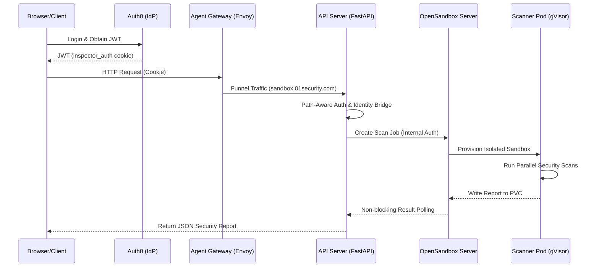

# CodeInspector Technical Process Guide: End-to-End Workflow

This document provides a comprehensive technical reference for the CodeInspector (Z1 Sandbox) platform. It is structured as a **Sequential Lifecycle**, tracing a request from its origin to the final delivery of security reports.

---

## 0. Sequence Overview



---

## Step 1: Identity Provisioning (Origin)

### A. Auth0 Identity Lifecycle
Users authenticate via **Auth0** to obtain an RS256 JWT, which is stored in the `inspector_auth` cookie.

**Reference: Config** (`codeInspector/values.yaml`)
```yaml
# Auth0 credentials for session management
AUTH0_DOMAIN: "dev-1u502t8piuwyzb28.us.auth0.com"
AUTH0_AUDIENCE: "https://api-sandbox"
```

---

## Step 2: Edge Ingress (Traffic Entry)

### A. Agent Gateway Routing
All traffic enters through the Envoy-based **Agent Gateway**.

**Reference: HTTPRoute** (`codeInspector/charts/agentgateway/templates/httproute.yaml`)
```yaml
spec:
  hostnames: ["sandbox.01security.com"]
  rules:
  - matches: [{path: {type: PathPrefix, value: /}}]
    backendRefs: [{name: sandbox-api-service, port: 80}]
```

---

## Step 3: Backend Verification (API Server)

### A. Authentication Handling & Keys
The `apiServer` validates the token's signature using dynamically fetched Auth0 public keys.

**Reference: JWKS Discovery** (`apiServer/fastapi/codeinspectior_api.py`)
```python
# Fetch Auth0 JWKS from the IdP
target_jwks = await get_remote_jwks(f"{issuer.rstrip('/')}/.well-known/jwks.json")
```

### B. Path-Aware Enforcement
The API enforces strict rules: **Execution routes MUST use a header**, while UI routes allow cookie fallback.

**Reference: Auth Selection** (`apiServer/fastapi/codeinspectior_api.py`)
```python
is_execution_route = path.startswith("/v1/run") or ("/api/z1sandbox/" in path and "/docs" not in path)
if auth_header:
    raw_token = auth_header.replace("Bearer ", "", 1)
elif not is_execution_route:
    raw_token = request.cookies.get("inspector_auth")
```

---

## Step 4: Identity Bridge (Internal Mapping)

Internal mapping connects the browser's identity to a persistent **Developer API Key**.

**Reference: Mapping & Lockdown** (`apiServer/fastapi/codeinspectior_api.py`)
```python
# Mapping: Auth0 'sub' -> primary Developer API Key in Postgres
query = "SELECT id FROM api_keys WHERE user_id = %s"
# Lockdown: Verify Cookie ID matches Header ID if both present
if cookie_sub != apikey_sub:
    raise HTTPException(status_code=403, detail="Identity Lockdown: User mismatch")
```

---

## Step 5: Orchestration (OpenSandbox)

### A. Scan Job Lifecycle
The API Server hands off the job to the `opensandbox-server` using an internal key.

**Reference: Internal Auth** (`opensandbox-server/docker-build/src/middleware/auth.py`)
```python
class AuthMiddleware(BaseHTTPMiddleware):
    API_KEY_HEADER = "OPEN-SANDBOX-API-KEY"
```

**Reference: PVC Persistence** (`opensandbox-server/docker-build/src/api/lifecycle.py`)
```python
# Write files to PVC workspace
job_dir = os.path.join(data_root, job_id, "workspace")
with open(os.path.join(job_dir, filename), "w") as f:
    f.write(content)
```

---

## Step 6: Isolation & Scanning (Execution)

### A. Isolated Security Suite
The pod runs parallel scans under **gVisor** isolation.

**Reference: Parallel Scans** (`code-interpreter/src/scanner_orchestrator.py`)
```python
def run_all(self):
    with ThreadPoolExecutor() as executor:
        futures = {
            executor.submit(self.run_semgrep): "semgrep",
            executor.submit(self.run_gitleaks): "gitleaks",
            executor.submit(self.run_bandit): "bandit",
        }
```

---

## Step 7: Report Delivery (Aggregation)

### A. Async Polling Loop
The API blocks synchronously (from the user's perspective) while polling the PVC in a non-blocking loop.

**Reference: Result Polling** (`opensandbox-server/docker-build/src/api/lifecycle.py`)
```python
while timeout > 0:
    if os.path.exists(report_path):
        return load_report(report_path) # Returns JSON report to API Server
    await asyncio.sleep(1)
```

---

## Network Topology Summary

| Step | Component | Address / URL |
| :--- | :--- | :--- |
| **0** | **Identity Provider** | `*.auth0.com` |
| **1** | **Edge Traffic** | `sandbox.01security.com` |
| **2** | **API Orchestrator** | `sandbox-api-service.opensandbox-system` |
| **3** | **Execution Server** | `opensandbox-server.opensandbox-system` |
| **4** | **Data Store** | `postgresql-service`, `redis-service` |
