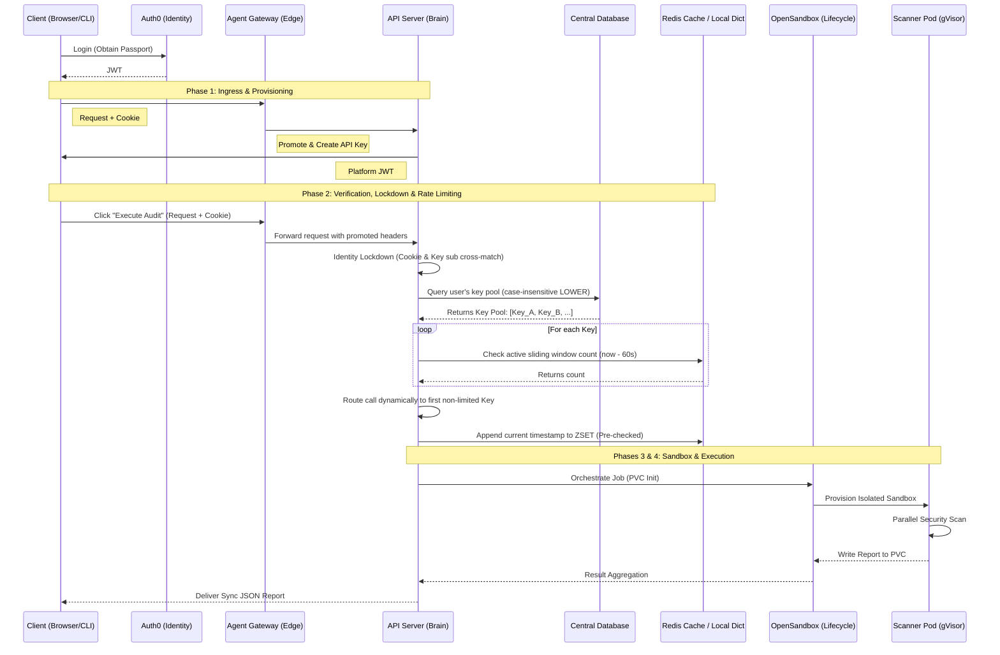

# CodeInspector Technical Process Guide: End-to-End Workflow

This document provides a comprehensive technical reference for the CodeInspector (Z1 Sandbox) platform. It is structured as a **5-Phase Architecture** tracing a request from the browser edge to isolated execution.

---

## 0. Sequence Overview


```mermaid
sequenceDiagram
    participant User as Client (Browser/CLI)
    participant Auth0 as Auth0 (Identity)
    participant GW as Agent Gateway (Edge)
    participant API as API Server (Brain)
    participant DB as Central Database
    participant Cache as Redis Cache / Local Dict
    participant OSS as OpenSandbox (Lifecycle)
    participant POD as Scanner Pod (gVisor)

    User->>Auth0: Login (Obtain Passport)
    Auth0-->>User: JWT
    
    Note over User, API: Phase 1: Ingress & Provisioning
    User->>GW:  
    Note right of User: Request + Cookie
    GW->>API:  
    Note right of GW: Promote & Create API Key
    API->>User:  
    Note left of API: Platform JWT

    Note over User, Cache: Phase 2: Verification, Lockdown & Rate Limiting
    User->>GW: Click "Execute Audit" (Request + Cookie)
    GW->>API: Forward request with promoted headers
    API->>API: Identity Lockdown (Cookie & Key sub cross-match)
    API->>DB: Query user's key pool (case-insensitive LOWER)
    DB-->>API: Returns Key Pool: [Key_A, Key_B, ...]
    loop For each Key
        API->>Cache: Check active sliding window count (now - 60s)
        Cache-->>API: Returns count
    end
    API->>API: Route call dynamically to first non-limited Key
    API->>Cache: Append current timestamp to ZSET (Pre-checked)

    Note over API, POD: Phases 3 & 4: Sandbox & Execution
    API->>OSS: Orchestrate Job (PVC Init)
    OSS->>POD: Provision Isolated Sandbox
    POD->>POD: Parallel Security Scan
    POD-->>OSS: Write Report to PVC
    OSS-->>API: Result Aggregation
    API-->>User: Deliver Sync JSON Report
```

---

## Phase 1: Session Initiation (Login & Key Setup)

The unified entry point for all traffic. Whether you are generating a key or starting a scan, the request must pass through the **Agent Gateway** first.

### 1. Primary Identity (Auth0)
Users receive an **RS256 JWT** via Auth0. This identity is bridged to a **JIT Cookie** (`inspector_auth`) for cross-origin accessibility. (Note: The gateway and API Server often refer to this as the **Auth0 Cookie**).

**Reference Code: JIT Cookie Binding** (`z1sandbox-website/src/pages/Dashboard.tsx`)
```javascript
const token = await getAccessTokenSilently();
document.cookie = `inspector_auth=${token}; SameSite=Lax; Path=/; Max-Age=86400`;
```

### 2. Secondary Entry (API Key Management)
When you click **"Generate New Key"** in the API Management tab, the system initiates a secure provisioning cycle. This process is split into two distinct technical layers:

#### Part A: The Agent Gateway (The Edge Gatekeeper)
Before any key is generated, the request must pass through the gateway at the edge.
*   **Interception**: The gateway intercepts the `POST /v1/api-keys` request.
*   **TLS Termination**: The gateway handles the SSL/TLS handshake, ensuring the sensitive request is encrypted.
*   **Header Promotion**: The gateway detects your **Auth0 Cookie** (the `inspector_auth` JIT Cookie) and "promotes" it to a standard `Authorization: Bearer <JWT>` header. This standardized identity is then funneled to the API Server.

**Reference Code: Ingress Routing** (`codeInspector/charts/agentgateway/templates/httproute.yaml`)
```yaml
# Funneling management requests through the secure gateway pipeline
spec:
  hostnames: ["api-sandbox.01security.com"]
  rules:
    - matches: [{path: {type: PathPrefix, value: /v1/api-keys}}]
      backendRefs: [{name: sandbox-api-service, port: 80}]
```

#### Part B: The API Factory (Technical Generation)
Once the gateway funnels the request, the **API Server** begins the cryptographic creation process.
*   **Identity Anchor**: The server validates the Auth0 JWT received from the gateway to anchor the new key to your `sub`.
*   **Cryptographic Signing**: The server loads the **Private RS256 Key** (`private.pem`) and signs a new JWT payload. This payload contains your **Stateless Identity**, which includes:
    *   `sub`: Your unique **Auth0 User ID** (anchors the key to your account).
    *   `jti`: The **JWT ID** (used for instant revocation).
    *   `iss`: The **Issuer** (`01 Sandbox`).
    *   `backend`: The authorized **Environment** (e.g., `Z1_SANDBOX`).
    *   `iat` / `exp`: The issuance and expiration timestamps.
*   **JTI Registry**: The unique **JWT ID (JTI)** is added to the **Redis `active_api_keys` set** for instant, cluster-wide validation.
*   **One-Time Reveal**: The signed JWT is returned to the browser **exactly once**. The Dashboard then caches it in **LocalStorage** (`bound_key_{id}`) for subsequent "Quick Scans."

**Reference Code: Cryptographic Signing** (`apiServer/fastapi/codeinspectior_api.py`)
```python
# Signing the new identity with the platform's private key
private_key = open("private.pem").read()
token = jwt.encode(token_payload, private_key, algorithm="RS256")
# Syncing to Redis for instant activation across all pods
state.redis_client.sadd("active_api_keys", jti)
```

---

## Phase 2: Identity Verification (API Brain)

The API Server performs **Identity Lockdown** to ensure the presented credentials (**Auth0 Cookie** / `inspector_auth` vs. **API Key**) belong to the same user.

### 1. The Security Problem: Key Impersonation
In a typical dashboard, a user might have a browser session (Cookie) while also using an API Key (Header). Without Identity Lockdown, an attacker who steals a victim's API Key could potentially use it within their *own* dashboard session. 

### 2. The Enforcement Logic
When the API Server receives a request, it performs a cross-check:
*   **Step 1: Extract `sub` from Header**: It decodes the `Authorization: Bearer` token (the API Key) and extracts the `sub` claim (the User ID it belongs to).
*   **Step 2: Extract `sub` from Cookie**: It scans for the `inspector_auth` cookie and extracts its `sub` claim (the current logged-in user).
*   **Step 3: Direct Comparison**: If both exist, the IDs **must** match exactly.
*   **Step 4: Rejection**: If `user_a` tries to use a key belonging to `user_b`, the system triggers an immediate **403 Forbidden** error, preventing the request from reaching the sandbox.

**Reference Code: Identity Lockdown** (`apiServer/fastapi/codeinspectior_api.py`)
```python
# Security Policy: Ensure browser cookie and API key 'sub' claims match
if auth0_cookie and auth_header:
    cookie_sub = jwt.decode(auth0_cookie, options={"verify_signature": False}).get("sub")
    apikey_sub = apikey_payload.get("sub")
    if cookie_sub != apikey_sub:
        raise HTTPException(status_code=403, detail="Identity Lockdown: User mismatch")
```

### 3. Dynamic Key-Specific Rate Limiting (Sliding Window & Key Rotation)
In addition to Identity Lockdown, the API Server protects system resources by enforcing a highly granular **Sliding Window Rate Limiting** system dynamically rotated across the user's active developer key pool.

#### A. The Mechanics of the Sliding Window
Instead of rigid fixed-minute windows (which suffer from boundary reset vulnerabilities), the platform tracks exact timestamps inside a rolling 60-second window `[now - 60, now]`.
*   **Atomic Cleanup**: Old timestamps are removed dynamically from the storage engine (Redis ZSETs score cleanups or float timestamp list slicing) before evaluating the count.
*   **Pre-Check Protection (Anti-Tarpitting)**: The system checks the current count *before* adding a new timestamp. If a request is blocked (429), no timestamp is recorded, preventing aggressive spamming from indefinitely extending the user's cooldown window.
*   **Dynamic Retry Calculation**: When blocked, a `Retry-After` header is calculated dynamically, telling the client precisely how many seconds remain until the oldest timestamp falls out of the active window.

#### B. The Identity Bridge & Key Pool Rotation
If a user creates multiple API keys, the Identity Bridge dynamically rotates incoming requests across all active, non-expired keys:
1.  **Extraction & Database Check**: The system extracts the user's Auth0 ID (`sub`) and queries the database case-insensitively using `LOWER(user_id) = LOWER(?)`.
2.  **Robust Expiration Filters**: It parses dates safely in Python utilizing UTC-aware datetime parsing (`datetime.fromisoformat`) to filter out expired keys.
3.  **Rotation Search**: It loops through the candidate keys and calls `is_key_rate_limited(state, key)`. It binds the request to the first key with available quota.
4.  **Resulting Limit**: The user's total allowed speed scales linearly with their keys (e.g., 2 keys = 14 requests/min, 5 keys = 35 requests/min).

#### C. Prevention of Double-Depletion (1-Slot Button Clicks)
To ensure the rate limit corresponds exactly to the number of clicks a user makes in the UI:
*   **Exclusion List**: Path routing excludes background API queries such as `/openapi.json` or health checks from the rate limiter.
*   **Action Specific**: Only the main document index page (`/docs`) and the scan trigger (`POST /v1/scan-jobs`) consume rate-limit slots. One click on "View Documentation" or "Quick Scan" consumes exactly **1 slot**, ensuring a flawless 7 actions per minute per key.

**Reference Code: Dynamic Sliding Window Verification** (`apiServer/fastapi/ratelimit.py`)
```python
# Sliding Window Check with Atomic Pre-Check and Dynamic Retry-After
async def check_rate_limit(state, jti: str):
    rl_conf = rate_limit_config()
    requests_limit = rl_conf["requests"]
    window_secs = rl_conf["window_secs"]
    
    # 1. Pipeline atomic fetch & cleanup
    current_count = await get_sliding_window_count(state, jti, window_secs)
    
    # 2. Quota validation before commit (Prevents Tarpitting)
    if current_count >= requests_limit:
        oldest_ts = await get_oldest_timestamp(state, jti)
        retry_after = max(1, int(window_secs - (time.time() - oldest_ts)))
        raise HTTPException(
            status_code=429,
            detail={"error": "Rate limit exceeded", "jti": jti, "retry_after": retry_after},
            headers={"Retry-After": str(retry_after)}
        )
    
    # 3. Safe commit on success
    await record_timestamp(state, jti)
```

---

## Phase 3: Workspace Preparation (Provisioning Sandbox)

This phase is triggered the moment a user clicks **"Execute Audit"** in the Security Scanner dashboard. The process is divided into two distinct technical layers:

#### Part A: Storage Foundation (Static)
*   **The Shared PVC**: The system relies on a pre-provisioned `ReadWriteMany` (RWX) PersistentVolumeClaim (`scan-pvc`). 
*   **Persistent Mounts**: This volume is permanently mounted to the Management Server. This architecture avoids the "Cloud Cold Start" problem (waiting for disk attachment), enabling sub-second response times.

#### Part B: Dynamic Ingestion (On-the-Fly)
*   **The Job Directory**: For every request, a unique directory is created instantly on the PVC: `/data/{job_id}/workspace`.
*   **Isolation**: This ensures that while the disk is shared, the files for "User A" and "User B" are physically separated in the filesystem.
*   **UI Status**: During this micro-second operation, the UI displays **"Provisioning isolated execution sandbox"**.

**Reference Code: On-the-Fly Ingestion** (`opensandbox-server/docker-build/src/api/lifecycle.py`)
```python
# Part B: Creating the dynamic workspace on the static PVC
job_dir = os.path.join(data_root, job_id, "workspace")
reports_dir = os.path.join(data_root, job_id, "reports")

# Instant directory creation (no K8s provisioning delay)
os.makedirs(job_dir, exist_ok=True)
os.makedirs(reports_dir, exist_ok=True)

# Writing the untrusted payload to the workspace
with open(os.path.join(job_dir, filename), "w") as f:
    f.write(content)
```

---

## Phase 4: Active Audit (The "Auditing" State)

The core security phase. The UI displays **"Auditing Security Probe..."** as the code is isolated within a **gVisor** "Glass Cage."

### 1. gVisor Isolation (The Glass Cage)
Scanner pods do not run as standard Linux containers. They use the **runsc (gVisor)** runtime, which provides a dedicated application-kernel for the pod. 
*   **Syscall Interception**: If a malicious script attempts to exploit a kernel vulnerability, gVisor intercepts the system call, preventing a breakout to the host node.
*   **Runtime Class Enforcement**: Defined in the cluster configuration to ensure no scanner pod ever runs "naked" on the host.

### 2. Volume Mounting & SubPath Isolation
Even though the PVC is shared, the scanner pod only sees its own data.
*   **SubPath Binding**: The pod is started with a mount that points specifically to `/data/{job_id}`.
*   **Read/Write Access**: The pod has write access to its `/reports` directory to deliver the final verdict.

### 3. Comprehensive Toolset (Language-Aware Scanning)
The orchestrator dynamically selects tools based on file classification to ensure deep coverage without unnecessary overhead.

| Category | Tools | Technical Role |
| :--- | :--- | :--- |
| **Universal** | `Semgrep`, `Gitleaks`, `Trivy` | Scans for secrets, multi-language security patterns, and CVEs. |
| **Python** | `Bandit`, `py_compile` | Security linting (AST analysis) and syntax validation. |
| **Go** | `Gosec`, `Staticcheck`, `GolangCI-Lint` | Deep security audits, advanced static analysis, and meta-linting. |
| **Kubernetes** | `Kube-Linter`, `Kubeconform`, `Kube-Score` | Hardening audits, schema validation, and best-practice scoring. |
| **YAML** | `Yamllint` | Ensures structural integrity and formatting standards. |
| **Shell** | `ShellCheck` | Detects bugs and enforces best practices in `.sh` and `.bash` scripts. |

**Reference Code: Parallel Execution** (`code-interpreter/src/scanner_orchestrator.py`)
```python
# Running the toolchain in parallel to minimize latency
with ThreadPoolExecutor() as executor:
    for tool in self.enabled_tools:
        executor.submit(scanner_map[tool])
```

### 4. Strict Mode Enforcement
The platform goes beyond "standard" linting by enabling "Strict Mode" configurations for several key tools. This ensures that even minor security regressions or structural anomalies are caught.

*   **Semgrep (Security Audit Mode)**:
    *   **Config**: Uses `p/security-audit` and `p/r2c-security-audit` rulesets.
    *   **Impact**: Scans for harmful logic patterns and complex security anti-patterns that standard "best practice" linters miss.
*   **Trivy (Comprehensive Scanning)**:
    *   **Scope**: Configured to scan `vuln, secret, config` simultaneously.
    *   **Severity**: Captures everything from `LOW` to `CRITICAL`, ensuring no vulnerability is hidden by default filters.
*   **Kube-Linter (Ultra-Strict)**:
    *   **Enforcement**: Uses `--add-all-built-in` and `--do-not-auto-add-defaults`.
    *   **Impact**: Forces every single built-in security check to run, ignoring the tool's default (more permissive) exclusion list.
*   **Kubeconform (Schema Lockdown)**:
    *   **Validation**: Uses `-strict` and `-ignore-missing-schemas=false`.
    *   **Impact**: Any manifest missing a schema or containing an unknown field will trigger a failure, preventing "silent" configuration errors.

**Reference Code: Strict Configs** (`code-interpreter/src/scanner_orchestrator.py`)
```python
# Kube-Linter: Add all built-in checks and disable auto-defaults
cmd = ["kube-linter", "lint", "--add-all-built-in", "--do-not-auto-add-defaults"]

# Kubeconform: Enforce strict schema validation
cmd = ["kubeconform", "-strict", "-ignore-missing-schemas=false"]
```

---

## Phase 5: Result Delivery (Verdict & Rendering)

The final delivery of intelligence back to the user. Once the result is delivered, the UI transitions from "AUDITING" to **"SUCCESS"** and renders the **Audit Verdict**.

### 1. The Polling Loop (Synchronous Handover)
The Management Server (OpenSandbox) blocks the initial request and enters a polling loop. It watches the specific `{job_id}/reports` directory on the PVC.
*   **The Trigger**: As soon as the scanner pod finishes and writes `security_scan_report.json`, the management server detects the file.
*   **Cleanup**: Once the report is read into memory, the transient scanner pod is deleted to free up cluster resources.

### 2. Telemetry Persistence
While the pod is gone, the report remains on the PVC for historical retrieval. This allows the UI to display the report even if the user refreshes their browser.

**Reference Code: Result Polling** (`opensandbox-server/docker-build/src/api/lifecycle.py`)
```python
# Polling loop waiting for the isolated pod to write its JSON verdict
while timeout > 0:
    if os.path.exists(report_path):
        # Once the file appears, the wait is over
        with open(report_path, "r") as f:
            return json.load(f)
    await asyncio.sleep(1)
```

---

## Appendix: Platform Key Management

The internal API Keys are signed using a **Manually Managed RSA Key Pair**.

### 1. Key Generation
```bash
# Generate 2048-bit Private Key
openssl genrsa -out private.pem 2048
# Extract Public Key
openssl rsa -in private.pem -pubout -out public.pem
```

### 2. Usage
*   **API Server**: Mounts `private.pem` to sign new JWTs.
*   **Gateway**: Uses `public.pem` (via JWKS) to verify tokens.
