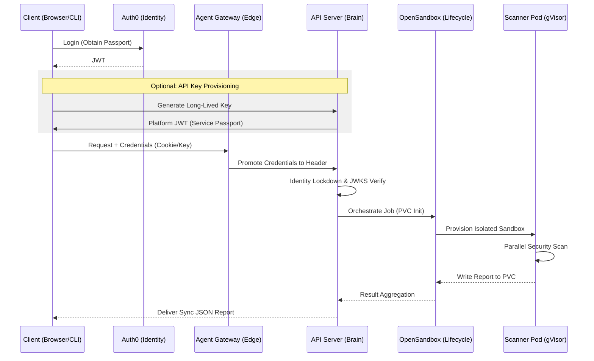

# CodeInspector Technical Process Guide: End-to-End Workflow

This document provides a comprehensive technical reference for the CodeInspector (Z1 Sandbox) platform. It is structured to mirror the **6-Phase Architecture** used by the production toolchain to deliver secure, real-time security audits.

---

## 0. Sequence Overview



---

## Phase 1: Session Initiation (Login & Key Setup)

The entry point for every request. This is where you establish your identity in the browser before interacting with the backends.

### 1. Primary Entry (Auth0)
*   **The Passport**: Users authenticate via Auth0 to receive an **RS256 JWT**. 
*   **Storage**: Stored in LocalStorage for persistence but bridged to a **JIT Cookie** (`inspector_auth`) during navigation for cross-origin accessibility.

### 2. Secondary Entry (Service Keys)
*   **Service Passport**: For CLI/Automation, users generate platform-signed JWTs.
*   **One-Time Reveal & Local Cache**: While the backend returns the key only once, the **Dashboard caches it in LocalStorage** (`bound_key_{id}`) to enable the "Quick Scan" feature without requiring the user to re-paste the key manually.
*   **Registry**: The unique **JTI (ID)** is stored in a global **Redis Set** for instant cluster-wide revocation.

**Reference: Local Persistence** (`z1sandbox-website/src/pages/Dashboard.tsx`)
```javascript
// Caching the revealed key for subsequent 'Quick Scans'
setNewKey({ id: data.api_key_id, key: data.api_key, status: data.status });
localStorage.setItem(`bound_key_${data.api_key_id}`, data.api_key);
```

---

## Phase 2: Traffic Ingestion (The "Execute" Click)

When you click **"EXECUTE AUDIT"** in the scanner modal, the Envoy-based **Agent Gateway** takes control of the ingestion.

### 1. TLS & Auth Enforcement
*   **Strict TLS**: The gateway terminates TLS 1.3 and enforces strict encryption.
*   **Credential Promotion**: Using **CEL (Common Expression Language)**, the gateway detects the `inspector_auth` cookie and "promotes" it to a standard `Authorization: Bearer <JWT>` header. This ensures the backend only ever deals with a clean, standardized identity.

---

## Phase 3: Cryptographic Handshake (API Server)

The **API Server** is the "Brain" that performs the heavy cryptographic lifting and identity enforcement.

### 1. The Official Stamp (Public Keys)
*   **Local Verification**: The API Server fetches Auth0's **Public Keys (JWKS)** once per hour. It performs the signature verification **locally** to ensure zero-trust security without external latency.
*   **Identity Lockdown**: If a request uses both a cookie and an API key, the server verifies they belong to the same `sub`. If there is a mismatch, the request is rejected (Identity Lockdown).

---

## Phase 4: Workspace Preparation (Provisioning Sandbox)

Once identity is verified, the system moves into the provisioning stage. In the UI, you will see the status: **"Provisioning isolated execution sandbox"**.

### 1. PVC Persistence (The Workspace)
*   **Shared PVC**: Files are written to a **ReadWriteMany (RWX) PVC**. This workspace acts as the bridge between the management server and the transient scanner pods.
*   **Lifecycle Management**: The server handles the creation of the directory, file injection, and eventual cleanup once the scan is delivered.

---

## Phase 5: Active Audit (The "Auditing" State)

The core security phase. The UI displays **"Auditing Security Probe..."** as the code is isolated within a **"Glass Cage."**

### 1. gVisor Isolation
The scanner pods do not run as standard Linux containers. They are wrapped in **gVisor**, an application-kernel that intercepts system calls.
*   **Provisioning State**: The UI displays **"Provisioning isolated execution sandbox"** during the pod startup phase.
*   **Attack Surface Reduction**: Even if the scanner tools (like Semgrep) are compromised by a malicious script, the attacker cannot break out to the host node.

### 2. Parallel Scanner Orchestration
The pod runs a suite of security tools in parallel to minimize latency:
*   **Concurrent Probes**: `Semgrep`, `Bandit`, `Gitleaks`, and `Trivy`.
*   **UI Indicator**: The dashboard shows **"Auditing Security Probe..."** while tools are actively running.

---

## Phase 6: Result Delivery (Verdict & Rendering)

The final phase bridges the gap between the isolated "Glass Cage" and the user's dashboard.

### 1. The Result Polling Loop
Because the scanner pod is transient, it writes the final **`security_scan_report.json`** directly back to the **Shared PVC**.
*   **The Wait**: The OpenSandbox Server polls the PVC directory every second.
*   **Completion**: As soon as the JSON file appears, the server reads it, deletes the temporary pod, and returns the data to the API Server.

### 2. Verdict & Rendering
*   **Audit Verdict**: The UI transitions from "AUDITING" to **"SUCCESS"**.
*   **Telemetry**: The final report is rendered as a "Security Telemetry Report" (Raw JSON) alongside "Vulnerability Insights" (Parsed findings).

**Reference: Result Polling** (`opensandbox-server/docker-build/src/api/lifecycle.py`)

---

## Network Topology Summary

| Phase | Component | Responsibility |
| :--- | :--- | :--- |
| **1** | **Browser/CLI** | Identity Provisioning & JIT Cookie Binding |
| **2** | **Agent Gateway** | Edge Routing & Header Promotion |
| **3** | **API Server** | JWKS Verification & Identity Lockdown |
| **4** | **OpenSandbox** | PVC Orchestration & Workspace Setup |
| **5** | **Scanner Pod** | gVisor Isolation & Parallel Scanning |
| **6** | **JSON Delivery** | Result Aggregation & Schema Validation |
